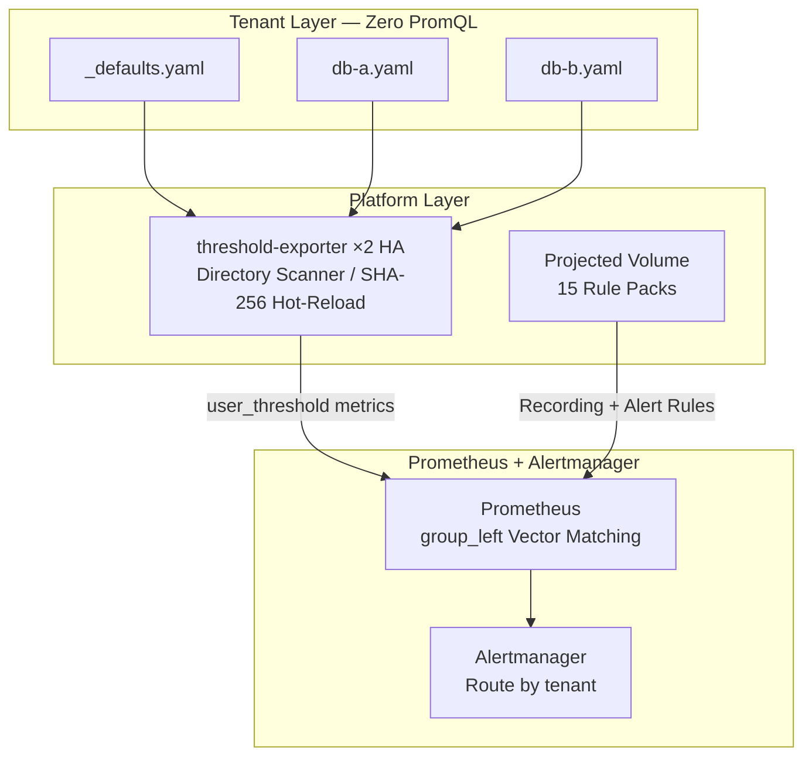

# Dynamic Alerting Integrations

> **Language / 語言：** **English (Current)** | [中文](README.md)

  

Multi-tenant dynamic alerting platform — config-driven threshold management, 15 pre-loaded rule packs, zero PromQL for tenants, three operational modes, HA deployment.

---

## Core Problems & Solutions

> **Before:** N tenants × M rules = N×M PromQL expressions — each tenant hand-writes rules, separate PRs, separate routing config.
> **After:** Fixed 238 rules (independent of tenant count), tenants write YAML only, thresholds → routing → notifications → maintenance windows all config-driven.

### Rule Explosion

Traditional approach: 100 tenants × 50 rules = 5,000 independent PromQL evaluations. This platform uses `group_left` vector matching — a fixed set of M rules evaluates once and matches all tenant thresholds simultaneously. Complexity drops from O(N×M) to O(M).

```yaml
# Traditional: one rule per tenant
- alert: MySQLHighConnections_db-a
  expr: mysql_global_status_threads_connected{namespace="db-a"} > 100

# Dynamic: single rule covers all tenants
- alert: MariaDBHighConnections
  expr: |
    tenant:mysql_threads_connected:max
    > on(tenant) group_left
    tenant:alert_threshold:connections
```

Tenants write YAML only, no PromQL:

```yaml
tenants:
  db-a:
    mysql_connections: "100"
  db-b:
    mysql_connections: "80"
```

### Tenant Onboarding Cost

All tools are packaged in the `da-tools` container — `docker pull` and go, no cloning or dependency installation required. `da-tools scaffold` generates config interactively; `da-tools migrate` auto-converts legacy rules via AST engine.

```bash
docker run --rm -it ghcr.io/vencil/da-tools scaffold --tenant my-app --db mariadb,redis
```

### Alert Fatigue

Built-in maintenance mode (suppress all alerts), silent mode (retain TSDB records but intercept notifications), recurring maintenance windows (cron + duration auto-silence), multi-layer severity with Severity Dedup (Critical suppresses Warning notifications), scheduled thresholds (auto-relax at night).

### Deployment & Maintenance

15 independent Rule Pack ConfigMaps mounted via Projected Volume, each team maintains their own. SHA-256 hash hot-reload without Prometheus restart. Helm chart published to OCI registry for one-command install:

```bash
helm install threshold-exporter \
  oci://ghcr.io/vencil/charts/threshold-exporter --version 1.9.0 \
  -n monitoring --create-namespace -f values-override.yaml
```

### Legacy Rule Migration

`migrate_rule.py` with AST migration engine (`promql-parser` Rust PyO3) auto-converts existing PromQL rules. Shadow Monitoring validates numerical consistency (tolerance ≤ 5%) with auto-convergence detection for zero-risk progressive cutover.

---

## Architecture Overview


```mermaid
graph TD
    subgraph TL["Tenant Layer — Zero PromQL"]
        D["_defaults.yaml"]
        T1["db-a.yaml"]
        T2["db-b.yaml"]
    end

    subgraph PL["Platform Layer"]
        TE["threshold-exporter ×2 HA<br/>Directory Scanner / SHA-256 Hot-Reload"]
        RP["Projected Volume<br/>15 Rule Packs"]
    end

    subgraph PE["Prometheus + Alertmanager"]
        PROM["Prometheus<br/>group_left Vector Matching"]
        AM["Alertmanager<br/>Route by tenant"]
    end

    D --> TE
    T1 --> TE
    T2 --> TE
    TE -->|user_threshold metrics| PROM
    RP -->|Recording + Alert Rules| PROM
    PROM --> AM
```

---

## Quick Start

```bash
# 1. VS Code → "Reopen in Container"
# 2. Deploy
make setup
# 3. Verify
make verify
# 4. Failure test
make test-alert
# 5. End-to-end demo
make demo-full
# 6. UIs
make port-forward
# Prometheus: localhost:9090 | Grafana: localhost:3000 (admin/admin) | Alertmanager: localhost:9093
```

---

## Rule Packs

15 Rule Packs pre-loaded via Projected Volume, each with an independent ConfigMap (`optional: true`). Unused packs cost near-zero evaluation.

| Rule Pack | Exporter | Recording | Alert |
|-----------|----------|-----------|-------|
| mariadb | mysqld_exporter (Percona) | 11 | 8 |
| postgresql | postgres_exporter | 11 | 9 |
| kubernetes | cAdvisor + kube-state-metrics | 7 | 4 |
| redis | redis_exporter | 11 | 6 |
| mongodb | mongodb_exporter | 10 | 6 |
| elasticsearch | elasticsearch_exporter | 11 | 7 |
| oracle | oracledb_exporter | 11 | 7 |
| db2 | db2_exporter | 12 | 7 |
| clickhouse | clickhouse_exporter | 12 | 7 |
| kafka | kafka_exporter | 13 | 9 |
| rabbitmq | rabbitmq_exporter | 12 | 8 |
| jvm | jmx_exporter | 9 | 7 |
| nginx | nginx-prometheus-exporter | 9 | 6 |
| operational | threshold-exporter ops modes | 0 | 4 |
| platform | threshold-exporter self-monitoring | 0 | 4 |
| **Total** | | **139** | **99** |

See [Rule Packs Directory](rule-packs/README.md) · [Alert Reference](rule-packs/ALERT-REFERENCE.en.md)

---

## Tools

All tools available via `da-tools` container (`docker run --rm ghcr.io/vencil/da-tools`) or locally with `python3 scripts/tools/<tool>.py`.

**Operations:**
`scaffold_tenant` config generation · `onboard_platform` reverse analysis · `migrate_rule` AST engine · `validate_migration` Shadow Monitoring · `cutover_tenant` one-click cutover · `batch_diagnose` multi-tenant health · `patch_config` safe updates with `--diff` · `diagnose` single-tenant check · `check_alert` alert status · `baseline_discovery` threshold suggestions · `backtest_threshold` historical replay · `analyze_rule_pack_gaps` coverage analysis · `offboard_tenant` safe removal · `deprecate_rule` rule retirement · `generate_alertmanager_routes` routing · `validate_config` all-in-one validation · `config_diff` diff report · `maintenance_scheduler` scheduled silence · `blind_spot_discovery` blind spot scan

**DX Automation:**
`shadow_verify` Shadow Monitoring auto-verify · `byo_check` BYO integration check · `federation_check` Federation verify · `grafana_import` dashboard import

Full CLI reference: [da-tools CLI](docs/cli-reference.en.md) · [Cheat Sheet](docs/cheat-sheet.en.md)

---

## Documentation Guide

| Document | Description |
|----------|-------------|
| [Architecture & Design](docs/architecture-and-design.en.md) | Core design, HA, Rule Pack architecture |
| [Getting Started (by role)](docs/getting-started/) | Platform Engineers · Domain Experts · Tenants |
| [Migration Guide](docs/migration-guide.en.md) | Onboarding flow, AST engine, Shadow Monitoring |
| [BYO Prometheus](docs/byo-prometheus-integration.en.md) | Integrate with existing Prometheus/Thanos |
| [BYO Alertmanager](docs/byo-alertmanager-integration.en.md) | Alertmanager integration & dynamic routing |
| [Federation](docs/federation-integration.en.md) | Multi-cluster architecture blueprint |
| [GitOps Deployment](docs/gitops-deployment.en.md) | ArgoCD/Flux workflow |
| [Custom Rule Governance](docs/custom-rule-governance.en.md) | Three-tier governance, CI linting |
| [Shadow Monitoring SOP](docs/shadow-monitoring-sop.en.md) | Dual-track SOP |
| [Scenarios](docs/scenarios/) | Alert Routing · Shadow Cutover · Federation · Tenant Lifecycle |

Full doc map: [doc-map.md](docs/internal/doc-map.md) · Tool map: [tool-map.md](docs/internal/tool-map.md) · Interactive tools: [Interactive Tools](https://vencil.github.io/Dynamic-Alerting-Integrations/)

---

## Prerequisites

- [Docker Engine](https://docs.docker.com/engine/install/) or Docker Desktop
- [kubectl](https://kubernetes.io/docs/tasks/tools/)
- (Recommended) VS Code + [Dev Containers extension](https://marketplace.visualstudio.com/items?itemName=ms-vscode-remote.remote-containers)

---

## Key Design Decisions

- **O(M) Rule Complexity**: `group_left` vector matching — rule count depends only on metric types, not tenant count
- **TSDB Completeness First**: Severity Dedup at Alertmanager inhibit layer — TSDB always retains full warning + critical records
- **Projected Volume Isolation**: 15 independent Rule Pack ConfigMaps (`optional: true`), zero PR conflicts
- **Config-Driven Full Chain**: Thresholds → routing → notifications → behavior control, all YAML-driven
- **Dual-Side Consistency**: Go exporter and Python tools share identical constants and validation logic
- **Security Guardrails Built-in**: Webhook Domain Allowlist (SSRF), Schema Validation (typo prevention), Cardinality Guard (metric explosion prevention)

---

## License

MIT
