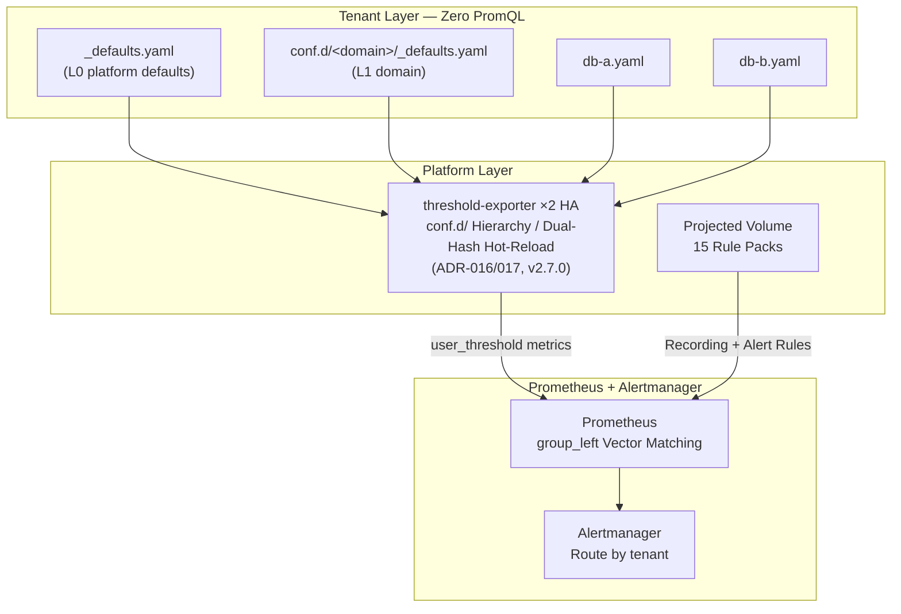

# Dynamic Alerting Integrations

> **Language / 語言：** **English (Current)** | [中文](README.md)

Config-driven multi-tenant alerting platform built on Prometheus `group_left` vector matching.

> **Managing 100 tenants: from 5,000 hand-written rules → 237 fixed rules.**
> Tenants write YAML only — no PromQL, and even author their own alerts via parameterized recipes (v2.9.0 **Custom Alerts**). New-tenant **setup** in minutes (for rule-pack-covered metrics), changes in seconds; migrating an existing complex estate (custom exporters / topology metrics) depends on the metric shape — see the [Migration Guide](docs/migration-guide.en.md).

     

---

**First time here? Pick your starting point:**

| Your situation | Start here |
|----------------|-----------|
| Understand what this is & solves in 30 seconds | [Key Metrics](#key-metrics) → [Architecture Overview](#architecture-overview) below |
| **I'm a leader / decision-maker — show me business value & risk** | [Decision-Maker guide](docs/getting-started/for-decision-makers.en.md) (one page: value + evidence / fit / maturity / next steps) |
| Evaluate whether the tech fits my environment | [Decision Matrix](docs/getting-started/decision-matrix.en.md) · [Integration Guides](docs/integration/README.en.md) |
| Try it on my laptop in 1 minute (no Kubernetes) | [Try it locally](#try-it-locally) |
| Ready to deploy to my own cluster | [Getting Started by Role](#getting-started-by-role) · [Integration Guides](docs/integration/README.en.md) |
| **Already familiar — find a specific scenario / lifecycle stage** | [Scenarios (14)](docs/scenarios/) · [Migration paths](#documentation-guide) · [Day-2 ops](#documentation-guide) |
| Already live, looking for day-2 ops / troubleshooting | [CLI Reference](docs/cli-reference.en.md) · [Troubleshooting](docs/troubleshooting.en.md) |

---

## Key Metrics

| Metric | Traditional (100 tenants) | Dynamic Alerting |
|--------|--------------------------|-----------------|
| Rule count | 5,000+ (grows linearly with tenants) | 237 (fixed, O(M)) |
| New-tenant **setup** (rule-pack-covered metrics) | 1–3 days (PR → Review → Deploy) | < 5 minutes (scaffold → validate → reload) |
| Prometheus memory | ~600MB+ | ~154MB |
| Rule evaluation time | Grows linearly with tenants | 60ms (same for 2 or 102 tenants, [Benchmark](docs/benchmarks.en.md#11-platform-rules-why-its-independent-of-tenant-count-om)) |
| Tenant knowledge required | PromQL + Alertmanager config | YAML threshold values |

---

## Architecture Overview


```mermaid
graph TD
    subgraph TL["Tenant Layer — Zero PromQL"]
        D["_defaults.yaml<br/>(L0 platform defaults)"]
        DOM["conf.d/&lt;domain&gt;/_defaults.yaml<br/>(L1 domain)"]
        T1["db-a.yaml"]
        T2["db-b.yaml"]
    end

    subgraph PL["Platform Layer"]
        TE["threshold-exporter ×2 HA<br/>conf.d/ Hierarchy / Dual-Hash Hot-Reload<br/>(ADR-016/017, v2.7.0)"]
        RP["Projected Volume<br/>15 Rule Packs"]
    end

    subgraph PE["Prometheus + Alertmanager"]
        PROM["Prometheus<br/>group_left Vector Matching"]
        AM["Alertmanager<br/>Route by tenant"]
    end

    D --> TE
    DOM --> TE
    T1 --> TE
    T2 --> TE
    TE -->|user_threshold metrics| PROM
    RP -->|Recording + Alert Rules| PROM
    PROM --> AM
```

15 Rule Packs covering MySQL, PostgreSQL, Redis, Kafka, and 9 other tech stacks, deployed independently via Projected Volume (`optional: true`). Unused packs cost near-zero evaluation. See [Rule Packs Directory](rule-packs/README.md) · [Alert Reference](rule-packs/ALERT-REFERENCE.en.md)

---

## Before / After

```yaml
# Traditional: one rule set per tenant — 100 tenants = 5,000 expressions
- alert: MySQLHighConnections_db-a
  expr: mysql_global_status_threads_connected{namespace="db-a"} > 100
# ... × 100 tenants × 50 rules

# Dynamic Alerting: single rule covers all tenants
- alert: MariaDBHighConnections
  expr: tenant:mysql_threads_connected:max > on(tenant) group_left tenant:alert_threshold:mysql_connections
# Tenants just declare thresholds: db-a: { mysql_connections: "100" }
```

Full comparison with Alertmanager routing examples: [Config-Driven Design](docs/architecture-and-design.en.md#2-core-design-config-driven-architecture).

---

## Repository Map

| Directory | Contents | When to visit |
|-----------|----------|---------------|
| [`components/`](components/) | Component sources: `threshold-exporter` (Go), `tenant-api` (Go), `da-tools` (Python CLI), `da-portal` (frontend container) | Application logic changes |
| [`helm/`](helm/) | Helm charts: `da-portal`, `tenant-api`, `mariadb-instance`; plus `values-db-*.yaml` | Deployment / chart templates |
| [`k8s/`](k8s/) | Raw K8s manifests: namespaces, monitoring (Prometheus/Alertmanager/Grafana), tenant-api, CRD | Spin up the demo environment |
| [`rule-packs/`](rule-packs/) | 15 rule-pack source YAMLs (`rule-pack-<tech>.yaml`) + [ALERT-REFERENCE](rule-packs/ALERT-REFERENCE.en.md) | Add / modify alerting rules |
| [`policies/`](policies/) | OPA Rego policy samples (naming, routing, threshold-bounds) | Governance rules |
| [`environments/`](environments/) | CI / local environment profiles | Cross-environment config |
| [`scripts/`](scripts/) | Shell entrypoints + 185 Python tools under `scripts/tools/{ops,dx,lint}` | Run tools, linting, DX |
| [`tests/`](tests/) | Python pytest (`test_*.py`), shell scenarios (`scenario-*.sh`), `e2e/` Playwright, `snapshots/` | Run / add tests |
| [`docs/`](docs/) | 198 public documents (77 bilingual pairs). Lookup table: [doc-map](docs/internal/doc-map.en.md) | Design / integration / ops docs |
| [`operator-manifests/`](operator-manifests/) | `operator_generate.py` output samples (14 PrometheusRule rule-packs) | Reference output for operator mode |
| [`CLAUDE.md`](CLAUDE.md) | AI Agent bootstrap + task-routing table | Required before starting an agent session |
| [`docs/internal/`](docs/internal/) | Internal playbooks (testing / benchmark / windows-mcp / github-release) and maps | Debugging, releases, benchmarks |

> Newcomer path: `README.en.md` → [`docs/getting-started/`](docs/getting-started/) → Choose BYO / Operator → Follow the relevant integration guide.
> Agent path: `CLAUDE.md` → task-routing table → relevant playbook.

---

## Try it locally

One command runs the whole platform on your laptop — a real alert goes red in ~1 minute. No Kubernetes, no signup.

[](https://github.com/vencil/Dynamic-Alerting-Integrations/actions/workflows/try-local-smoke.yaml)

**Fastest (core twins, ~10s to a live Tenant Manager):**

```bash
cd try-local && cp .env.example .env
docker compose up da-portal tenant-api     # just the core twins
# or the full stack (monitoring + a real firing alert): docker compose up -d
```

Full walkthrough, what to look at, and troubleshooting in **[`try-local/README.md`](try-local/README.md)**. Windows requires **WSL2 + Docker Desktop (WSL2 backend)**.

**The stack showcases 4 tryable products at once:**

| Product | What / why | Day-0 one-liner | Day-1 integration |
|---------|-----------|-----------------|-------------------|
| **da-portal** (Tenant Manager UI)<br>`[For: Tenant]` | Browse/edit tenant config visually; Save lands a real git commit (GitOps) | open <http://localhost:8081> | [Helm chart](helm/) |
| **tenant-api**<br>`[For: Platform Engineer]` | File-based config API (commit-on-write, no database) | [QUICKSTART](components/tenant-api/QUICKSTART.md) | [Helm](helm/) + oauth2-proxy |
| **threshold-exporter** + Prometheus<br>`[For: Platform Engineer]` | Turns YAML thresholds into `user_threshold` metrics → one `group_left` rule covers every tenant | [QUICKSTART](components/threshold-exporter/QUICKSTART.md) | [BYO Prometheus](docs/integration/byo-prometheus-integration.md) |
| **da-tools** (CLI)<br>`[For: Domain Expert]` | Guardrails / migration / scaffold (`guard`, `parser`, `batch-pr`…) | [QUICKSTART](components/da-tools/app/QUICKSTART.md) | CI integration |

---

## Getting Started

### Local Experience (5 minutes)

> One-command local experience is above in [**Try it locally**](#try-it-locally) (no Kubernetes). Or run the full K8s version via the Dev Container:

```bash
# VS Code → "Reopen in Container"
make setup && make verify && make test-alert
# Prometheus: localhost:9090 | Grafana: localhost:3000 | Alertmanager: localhost:9093
```

### Production Deployment

| Environment | Recommended Path | Guide |
|-------------|-----------------|-------|
| Existing Prometheus Operator | Helm + `rules.mode=operator` | [Operator Integration](docs/integration/prometheus-operator-integration.en.md) |
| Self-managed Prometheus | Helm + ConfigMap | [BYO Prometheus](docs/integration/byo-prometheus-integration.en.md) |
| GitOps (ArgoCD / Flux) | Helm + Git repo | [GitOps Deployment](docs/integration/gitops-deployment.en.md) |
| Not sure? | Interactive Decision Matrix | [Decision Matrix](docs/getting-started/decision-matrix.en.md) |

All paths support [OCI Registry installation](components/threshold-exporter/README.md#6-部署).

### Getting Started by Role

- **Executive / Decision-maker** — business value, fit assessment, maturity & trust (one page of decision info) → [Decision-Maker guide](docs/getting-started/for-decision-makers.en.md)
- **Platform Engineer** — Architecture, deployment & operations → [Getting Started](docs/getting-started/for-platform-engineers.en.md)
- **Domain Expert** — Rule Pack customization & quality governance → [Getting Started](docs/getting-started/for-domain-experts.en.md)
- **Tenant** — Threshold configuration, **self-service custom alerts (Custom Alerts, no PromQL)** & self-service management → [Getting Started](docs/getting-started/for-tenants.en.md)
- **Not sure?** → [Getting Started Wizard](https://vencil.github.io/Dynamic-Alerting-Integrations/assets/jsx-loader.html?component=../getting-started/wizard.jsx)

---

## Deployment Tiers

Two management models, incrementally upgradable (both share one YAML source of truth; Tier 2 is a management plane on top of Tier 1, not a replacement):

- **Tier 1 — Git-Native (Pure GitOps)**: 100% pure YAML, fully Git-tracked. validate-config → commit → ArgoCD/Flux → SHA-256 hot-reload in seconds. Best for GitOps-native teams, YAML-comfortable tenants.
- **Tier 2 — Portal + API (UI Management)**: everything in Tier 1 + REST API (RBAC) + da-portal UI (browse / preview / bulk) + OAuth2; Portal auto-degrades to read-only if the API is down, GitOps workflow unaffected. Best for large tenant populations (20+), high-frequency adjustments, UI self-service or compliance audit.

---

## Platform Capabilities

### Rule Engine

O(M) complexity (`group_left` vector matching) · 15 Rule Pack Projected Volumes independently deployed · Severity Dedup via Alertmanager Inhibit ([ADR-001](docs/adr/001-severity-dedup-via-inhibit.en.md)) · Sentinel Alert tri-state control ([ADR-003](docs/adr/003-sentinel-alert-pattern.en.md))

### Tenant Management

Tri-state mode (Normal / Silent / Maintenance with `expires` auto-expiry) · Four-layer routing merge: `_routing_defaults` → profile → tenant → enforced ([ADR-007](docs/adr/007-cross-domain-routing-profiles.en.md)) · Scheduled thresholds & maintenance windows · Schema Validation (dual Go + Python) · Cardinality Guard (per-tenant 500 limit)

### Tenant Self-Service & Multi-Cluster

- **Custom Alerts — tenants define entire alerts themselves, no PromQL**: the platform team steps out of the everyday-alert loop, without losing control (governed recipes + single vectorized rule + per-tenant cap). → [Try locally](#try-it-locally) · [for-tenants guide](docs/getting-started/for-tenants.en.md) · [ADR-024](docs/adr/024-version-aware-threshold-via-dimensional-label.en.md)
- **Version-Aware Threshold — no false alarms during deploy / rollback**: thresholds follow the running version automatically ([ADR-024](docs/adr/024-version-aware-threshold-via-dimensional-label.en.md) Capability A).
- **Tenant Federation — unified cross-cluster tenant-query governance without merging data planes** (deployable foundation, not yet GA; [ADR-020](docs/adr/020-tenant-federation.md)).
- **Write-plane resilience — the self-service write path is production-safe**: no data loss or hangs under high concurrency / forge outages ([ADR-023](docs/adr/023-write-plane-single-writer-invariant.md)).

### Toolchain (da-tools CLI)

Covers tenant **lifecycle** (scaffold / onboard / migrate-rule / cutover / offboard), **day-to-day ops** (diagnose / patch-config / explain-route), **quality governance** (validate-config / alert-quality / Policy-as-Code), and the **customer onboarding pipeline** (da-parser → profile build → da-batchpr → da-guard). All packaged in the `ghcr.io/vencil/da-tools` container.

Full commands, flags & examples → [CLI Reference](docs/cli-reference.en.md) · [Cheat Sheet](docs/cheat-sheet.en.md) · [Interactive Tools Index](docs/interactive-tools.md)

### Customer Onboarding: Migration Toolkit

Migrates a customer's existing PromRule corpus fully-automatically into this platform's `conf.d/` (`da-parser → profile build → da-batchpr → da-guard`), shipping via **three delivery paths — Docker / static binary / air-gapped tar** (all cosign keyless signed + SBOM) covering the full spectrum from internet-connected to isolated finance / government / defense networks.

Full installation & signature verification → [Migration Toolkit Installation](docs/migration-toolkit-installation.en.md)

---

## Key Design Decisions

Every trade-off behind the capabilities above — why it's designed this way, the consequences, and **which alternatives were rejected** — is recorded as an ADR (each with status & introduced version). This is the basis for assessing the platform's maintainability and long-term direction.

Full ADR index → [architecture-and-design.en.md §ADR Index](docs/architecture-and-design.en.md#6-adr-index-architecture-decision-records)

---

## Documentation Guide

| Document | Description |
|----------|-------------|
| [Architecture & Design](docs/architecture-and-design.en.md) | Core design, HA, Rule Pack architecture |
| Getting Started (by role) | [Platform Engineer](docs/getting-started/for-platform-engineers.en.md) · [Domain Expert](docs/getting-started/for-domain-experts.en.md) · [Tenant](docs/getting-started/for-tenants.en.md) |
| Migration paths | [Migration Guide](docs/migration-guide.en.md) (1/2-system: rules / rules+AM) · [Multi-System Playbook](docs/scenarios/multi-system-migration-playbook.en.md) (3-system: Prom→VM + rules + AM) · [Staged Adoption](docs/scenarios/staged-adoption-guide.en.md) (post-cutover `custom_*` → golden lifecycle) |
| Integration guides | [BYO Prometheus](docs/integration/byo-prometheus-integration.en.md) · [BYO Alertmanager](docs/integration/byo-alertmanager-integration.en.md) · [VictoriaMetrics](docs/integration/victoriametrics-integration.en.md) · [Federation](docs/integration/federation-integration.en.md) · [GitOps](docs/integration/gitops-deployment.en.md) |
| [Custom Rule Governance](docs/custom-rule-governance.en.md) | Three-tier governance, CI linting |
| [Benchmarks](docs/benchmarks.md) | Full benchmark data and methodology |
| [Scenarios](docs/scenarios/) | 14 hands-on scenarios (includes migration paths above; others: Routing · Shadow · Federation · Lifecycle · GitOps · Lab) |
| Day-2 Operations | [CLI Reference](docs/cli-reference.en.md) · [Cheat Sheet](docs/cheat-sheet.en.md) · [Troubleshooting (runtime)](docs/troubleshooting.en.md) · [Migration Troubleshooting](docs/integration/troubleshooting-checklist.en.md) (migration-phase symptom-keyed runbook) |

Full doc map: [doc-map.md](docs/internal/doc-map.md) · Tool map: [tool-map.md](docs/internal/tool-map.md)
