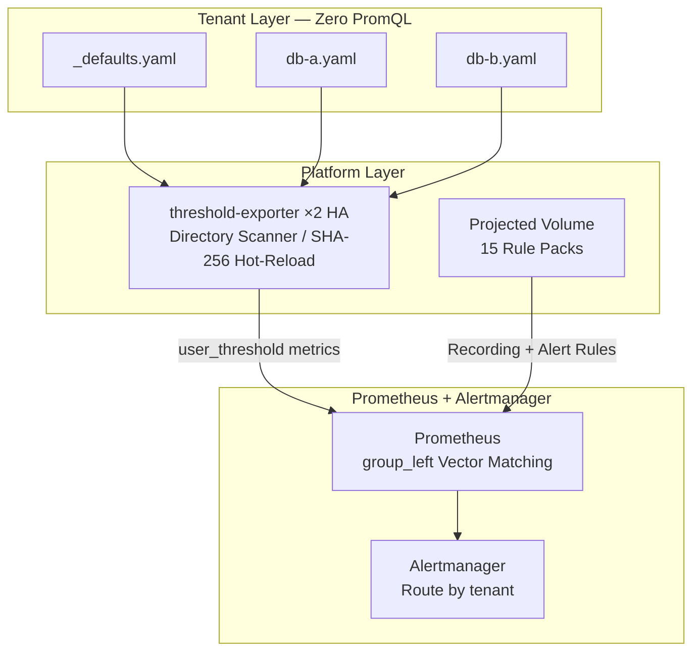

# Dynamic Alerting Integrations

> **Language / 語言：** **English (Current)** | [中文](README.md)

     

---

## Before and After

### Without This Platform

```yaml
# One rule per tenant — 100 tenants = 100 independent expressions
- alert: MySQLHighConnections_db-a
  expr: mysql_global_status_threads_connected{namespace="db-a"} > 100
- alert: MySQLHighConnections_db-b
  expr: mysql_global_status_threads_connected{namespace="db-b"} > 100
- alert: MySQLHighConnections_db-c
  expr: mysql_global_status_threads_connected{namespace="db-c"} > 100
  # ... 97 more rules
# Routing: hardcoded per-tenant receivers
routes:
  - match: {tenant: "db-a"}
    receiver: db-a-slack
  - match: {tenant: "db-b"}
    receiver: db-b-slack
  # ... manual per-tenant routing
```

### With This Platform
```yaml
# Single rule covers all tenants via group_left matching
- alert: MariaDBHighConnections
  expr: |
    tenant:mysql_threads_connected:max
    > on(tenant) group_left
    tenant:alert_threshold:connections

# Tenants declare thresholds only (YAML, no PromQL):
tenants:
  db-a:
    mysql_connections: "100"
    _routing:
      default_receiver: { type: webhook, url: "https://hooks.slack.com/..." }
  db-b:
    mysql_connections: "110"
    _routing:
      default_receiver: { type: webhook, url: "https://hooks.slack.com/..." }
  # Routing auto-generated from config; rule count stays constant
```

**Result:** Rule evaluation time 59.1ms → 60.6ms (2 to 102 tenants). Platform evaluates ~237 rules regardless of tenant count; tenant thresholds become self-service YAML.

---

## 30-Second Overview

Multi-tenant Prometheus alerting where rule count is O(M) not O(N×M) — single rule covers all tenants via `group_left` matching. Tenants declare thresholds in YAML, not PromQL. Routing, notifications, and maintenance windows are config-driven. Hot-reload via SHA-256 detects config changes without restarting Prometheus. Choose your deployment tier: **Tier 1 (pure GitOps + CLI)** for teams happy with YAML and command-line tools, or **Tier 2 (Portal + API)** for teams wanting a UI dashboard and programmatic tenant management.

---

## Architecture Overview


```mermaid
graph TD
    subgraph TL["Tenant Layer — Zero PromQL"]
        D["_defaults.yaml"]
        T1["db-a.yaml"]
        T2["db-b.yaml"]
    end

    subgraph PL["Platform Layer"]
        TE["threshold-exporter ×2 HA<br/>Directory Scanner / SHA-256 Hot-Reload"]
        RP["Projected Volume<br/>15 Rule Packs"]
    end

    subgraph PE["Prometheus + Alertmanager"]
        PROM["Prometheus<br/>group_left Vector Matching"]
        AM["Alertmanager<br/>Route by tenant"]
    end

    D --> TE
    T1 --> TE
    T2 --> TE
    TE -->|user_threshold metrics| PROM
    RP -->|Recording + Alert Rules| PROM
    PROM --> AM
```

---

## Quick Start

```bash
# 1. VS Code → "Reopen in Container"
# 2. Deploy
make setup
# 3. Verify
make verify
# 4. Failure test
make test-alert
# 5. End-to-end demo
make demo-full
# 6. UIs
make port-forward
# Prometheus: localhost:9090 | Grafana: localhost:3000 (admin/admin) | Alertmanager: localhost:9093
```

> **Production deployment?** The above is for local development. For production, see: [Helm + OCI Registry install](components/threshold-exporter/README.md#部署-helm) · [GitOps Deployment Guide](docs/gitops-deployment.en.md) · [BYO Prometheus Integration](docs/byo-prometheus-integration.en.md)

---

## Rule Packs

15 Rule Packs pre-loaded via Projected Volume, each with an independent ConfigMap (`optional: true`). Unused packs cost near-zero evaluation.

| Rule Pack | Exporter | Recording | Alert |
|-----------|----------|-----------|-------|
| mariadb | mysqld_exporter (Percona) | 11 | 8 |
| postgresql | postgres_exporter | 11 | 9 |
| kubernetes | cAdvisor + kube-state-metrics | 7 | 4 |
| redis | redis_exporter | 11 | 6 |
| mongodb | mongodb_exporter | 10 | 6 |
| elasticsearch | elasticsearch_exporter | 11 | 7 |
| oracle | oracledb_exporter | 11 | 7 |
| db2 | db2_exporter | 12 | 7 |
| clickhouse | clickhouse_exporter | 12 | 7 |
| kafka | kafka_exporter | 13 | 9 |
| rabbitmq | rabbitmq_exporter | 12 | 8 |
| jvm | jmx_exporter | 9 | 7 |
| nginx | nginx-prometheus-exporter | 9 | 6 |
| operational | threshold-exporter ops modes | 0 | 4 |
| platform | threshold-exporter self-monitoring | 0 | 4 |
| **Total** | | **139** | **99** |

See [Rule Packs Directory](rule-packs/README.md) · [Alert Reference](rule-packs/ALERT-REFERENCE.en.md)

---

## Deployment Tiers

Choose the tier that matches your team's workflow and maturity level.

### Tier 1: Git-Native (Pure GitOps + CLI)

For teams that prefer declarative, version-controlled configuration with no external management service.

**Components:**
- threshold-exporter (config scanner + YAML-to-metrics)
- Prometheus + Rule Packs
- Alertmanager (static or dynamic config via ConfigMap)

**Tenant self-service workflow:**
1. Tenant writes YAML config → git push
2. CI validates schema, runs tests
3. GitOps controller (ArgoCD / Flux) auto-deploys
4. threshold-exporter detects change via SHA-256 → hot-reload
5. Routing + notifications take effect immediately

**Tools:** `da-tools scaffold` (config generation) · `da-tools validate-config` (local lint) · `da-tools patch-config` (safe updates) · `da-tools explain-route` (routing debugger)

**When to use Tier 1:**
- Teams are GitOps-native (ArgoCD/Flux)
- Configuration churn is low-to-moderate
- Tenants are comfortable with YAML
- No need for a shared management dashboard

---

### Tier 2: Portal + API (UI Management)

For teams that want a self-service dashboard, programmatic management API, and centralized configuration browser.

**Tier 1 components, plus:**
- tenant-api (REST API for RBAC-controlled config read/write)
- da-portal (web dashboard: config browser, change previewer, bulk operations)
- oauth2-proxy (authentication layer)

**Tenant self-service workflow (enhanced):**
1. Tenant logs into Portal UI (OAuth2)
2. Browse current config → click "Edit" → change threshold
3. Preview diff → submit
4. API auto-generates git commit (with operator attribution)
5. CI validates → deployed as Tier 1
6. Portal gracefully degrades to read-only if API is unavailable (GitOps remains unaffected)

**API capabilities:**
- Full CRUD on tenant configs
- Structured schema validation
- Atomic multi-tenant operations (bulk change)
- Audit trail (every API write records operator, timestamp, change delta)
- Version history browsing

**When to use Tier 2:**
- Large tenant population (20+) with varying technical expertise
- High frequency of threshold adjustments
- Regulatory / compliance requirement for audit trails
- Team wants a unified operational dashboard
- Prefer REST API for automation / tooling

---

## Workflow Comparison

| Process | Tier 1 (Git-Native) | Tier 2 (Portal + API) |
|---------|--------------------|-----------------------|
| **New tenant onboarding** | `scaffold` → git commit → ArgoCD deploy (minutes) | UI click → API → git commit → ArgoCD deploy (minutes) |
| **Threshold adjustment** | Edit YAML → commit → hot-reload (seconds) | UI edit → Save → hot-reload (seconds) |
| **Bulk changes** | Script YAML editing / patch_config | Portal multi-select → bulk edit → one-click submit |
| **Change audit** | git blame + log | git log + API audit trail |
| **Offline work** | Supported (local commits, push later) | Requires network (API dependent) |
| **RBAC** | Git layer (branch protection + code review) | API layer (OIDC + fine-grained permissions) |
| **Degradation** | N/A | Portal read-only if API fails (YAML workflow unaffected) |

---

## Tool Ecosystem

All tools are packaged in the `da-tools` container (`docker run --rm ghcr.io/vencil/da-tools`) — no cloning or dependency installation required. The Portal is available as a separate image (`docker run -p 8080:80 ghcr.io/vencil/da-portal`) for enterprise intranet / air-gapped deployment.

**Tenant Lifecycle:** `scaffold_tenant` config generation → `onboard_platform` existing environment analysis → `migrate_rule` AST migration engine → `validate_migration` shadow dual-track verification → `cutover_tenant` one-click cutover → `offboard_tenant` safe removal

**Day-to-Day Operations:** `diagnose` / `batch_diagnose` health checks · `patch_config` safe updates (with `--diff`) · `check_alert` alert status · `maintenance_scheduler` scheduled silence · `generate_alertmanager_routes` routing generation · `explain_route` routing debugger

**Adoption Pipeline:** `init` project scaffold generation · `config_history` config snapshot & history tracking · `gitops-check` GitOps validation · `demo-showcase` 5-tenant demo script

**Routing Profiles & Domain Policies:** `_routing_profiles.yaml` defines cross-tenant shared routing configs, `_domain_policy.yaml` defines business-domain compliance constraints. Four-layer merge: `_routing_defaults` → profile → tenant `_routing` → `_routing_enforced`.

**Quality & Governance:** `validate_config` all-in-one validation · `alert_quality` alert quality scoring · Policy-as-Code engine · `cardinality_forecast` trend prediction · `backtest_threshold` historical replay · `baseline_discovery` threshold recommendations · `config_diff` diff report

Full CLI reference: [da-tools CLI](docs/cli-reference.en.md) · [Cheat Sheet](docs/cheat-sheet.en.md)

---

## Why This Platform

### Platform Teams: Rule Explosion and Maintenance Bottlenecks

In traditional multi-tenant monitoring, each tenant needs independent PromQL rules and routing configs. 100 tenants × 50 rules = 5,000 independent expressions, each requiring PR, review, and deployment. Platform teams become the change bottleneck for all tenants; config drift worsens over time.

This platform uses `group_left` vector matching to reduce complexity from O(N×M) to O(M) — rule count depends only on metric types, not tenant count. Routing, notifications, and maintenance windows are likewise config-driven. 15 Rule Packs are maintained independently via Projected Volume with zero PR conflicts. SHA-256 hash hot-reload means changes require no Prometheus restart.

### Tenant Teams: PromQL Barrier and Change Latency

Tenants know their own business best — what connection counts are normal, what latencies are acceptable. But threshold adjustments require PromQL knowledge; every change is a ticket → platform team → PR → deploy cycle.

This platform lets tenants write only YAML (no PromQL): `da-tools scaffold` generates config interactively, `da-tools validate-config` validates locally, changes take effect via hot-reload. Supports scheduled thresholds (auto-relaxed at night) and scheduled maintenance windows (cron + duration auto-silence).

For teams unwilling to touch YAML, Tier 2 (Portal + API) provides UI management. If API is unavailable, Portal auto-degrades to read-only mode without affecting existing YAML + GitOps workflows.

### Domain Experts: Alert Quality and Standardization

DBAs and SREs must ensure organization-wide alert quality and consistency. The platform provides: 15 pre-loaded Rule Packs encapsulating domain best practices; Severity Dedup auto-suppresses duplicate notifications at the Alertmanager inhibit layer; Alert Quality Scoring quantifies noise; Policy-as-Code enforces governance rules at CI time.

---

## Key Design Decisions

| Decision | Rationale | ADR |
|----------|-----------|-----|
| O(M) Rule Complexity | `group_left` vector matching — rule count depends only on metric types, not tenant count | — |
| TSDB Completeness First | Severity Dedup at Alertmanager inhibit layer — TSDB always retains full warning + critical records | [ADR-001](docs/adr/001-severity-dedup-via-inhibit.en.md) |
| Sentinel Alert Tri-State | exporter flag → sentinel alert → inhibit, composable Normal / Silent / Maintenance modes | [ADR-003](docs/adr/003-sentinel-alert-pattern.en.md) |
| Projected Volume Isolation | 15 independent Rule Pack ConfigMaps (`optional: true`), zero PR conflicts | [ADR-005](docs/adr/005-projected-volume-for-rule-packs.en.md) |
| Config-Driven Full Chain | Thresholds → routing → notifications → behavior control, all YAML-driven | — |
| Four-Layer Routing Merge | `_routing_defaults` → profile → tenant `_routing` → `_routing_enforced`, cross-tenant sharing + domain policy constraints | [ADR-007](docs/adr/007-cross-domain-routing-profiles.en.md) |
| Security Guardrails Built-in | Webhook Domain Allowlist · Schema Validation · Cardinality Guard (per-tenant 500 limit) | — |

---

## Documentation Guide

| Document | Description |
|----------|-------------|
| [Architecture & Design](docs/architecture-and-design.en.md) | Core design, HA, Rule Pack architecture |
| Getting Started (by role) | [Platform Engineer](docs/getting-started/for-platform-engineers.en.md) · [Domain Expert](docs/getting-started/for-domain-experts.en.md) · [Tenant](docs/getting-started/for-tenants.en.md) |
| [Migration Guide](docs/migration-guide.en.md) | Onboarding flow, AST engine, Shadow Monitoring |
| [BYO Prometheus](docs/byo-prometheus-integration.en.md) | Integrate with existing Prometheus/Thanos |
| [BYO Alertmanager](docs/byo-alertmanager-integration.en.md) | Alertmanager integration & dynamic routing |
| [Federation](docs/federation-integration.en.md) | Multi-cluster architecture blueprint |
| [GitOps Deployment](docs/gitops-deployment.en.md) | ArgoCD/Flux workflow |
| [Custom Rule Governance](docs/custom-rule-governance.en.md) | Three-tier governance, CI linting |
| [Shadow Monitoring SOP](docs/shadow-monitoring-sop.en.md) | Dual-track SOP |
| [Benchmarks](docs/benchmarks.md) | Full benchmark data and methodology |
| [Scenarios](docs/scenarios/) | Alert Routing · Shadow Cutover · Federation · Tenant Lifecycle · GitOps CI/CD · Hands-on Lab |
| Day-2 Operations | `diagnose` → `alert-quality` → `patch-config` → `maintenance-scheduler` ([CLI Reference](docs/cli-reference.en.md)) |

Full doc map: [doc-map.md](docs/internal/doc-map.md) · Tool map: [tool-map.md](docs/internal/tool-map.md)

---

## Enterprise-Wide Benefits

| Aspect | Traditional (100 tenants) | Dynamic Platform (100 tenants) |
|--------|--------------------------|-------------------------------|
| Rule evaluations | 9,600 (N×M) | 237 (fixed) |
| Prometheus memory | ~600MB+ | ~154MB |
| New tenant onboarding | Days to weeks | Minutes (scaffold → validate) |
| Threshold change flow | Ticket → PR → Deploy | Tenant self-service YAML + Hot-Reload (or API in Tier 2) |
| Governance | Ad-hoc review | Schema Validation + Policy-as-Code + CI |
| Change audit | Manual git blame | API auto-commit (operator attribution) + full audit trail (Tier 2) |

Measured: scaling from 2 to 102 tenants, rule evaluation time stayed at 59.1ms → 60.6ms.

---

## Next Steps

- **New to the platform?** Start with [Getting Started Wizard](https://vencil.github.io/Dynamic-Alerting-Integrations/assets/jsx-loader.html?component=../getting-started/wizard.jsx) or your role guide ([Platform Engineer](docs/getting-started/for-platform-engineers.en.md) · [Domain Expert](docs/getting-started/for-domain-experts.en.md) · [Tenant](docs/getting-started/for-tenants.en.md))
- **Ready to deploy?** See [Helm install](components/threshold-exporter/README.md#部署-helm) or [GitOps guide](docs/gitops-deployment.en.md)
- **Migrating from existing setup?** [Migration guide](docs/migration-guide.en.md)
- **Building custom rules?** [Custom rule governance](docs/custom-rule-governance.en.md)
