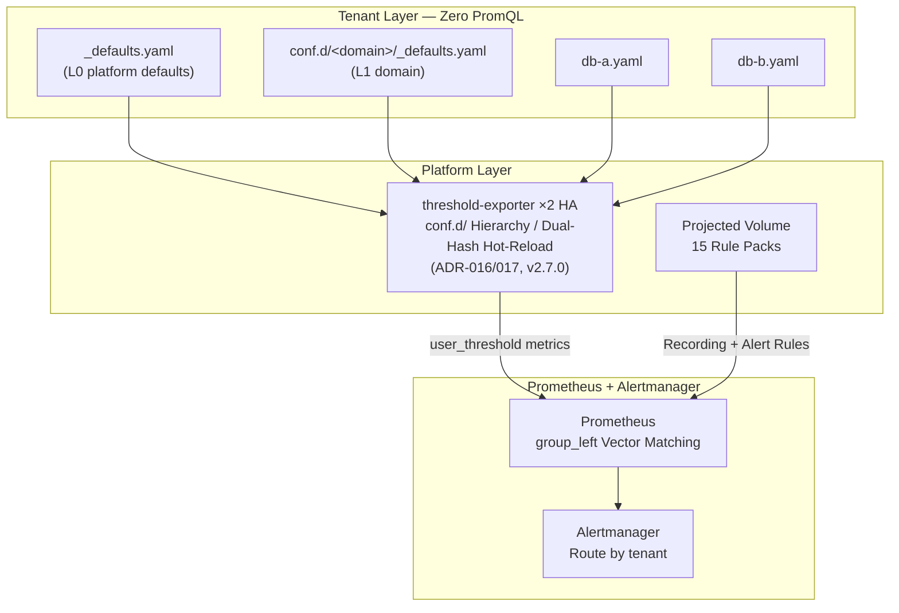

# Dynamic Alerting Integrations

> **Language / 語言：** **English (Current)** | [中文](README.md)

Config-driven multi-tenant alerting platform built on Prometheus `group_left` vector matching.

> **Managing 100 tenants: from 5,000 hand-written rules → 237 fixed rules.**
> Tenants write YAML only — no PromQL, and even author their own alerts via parameterized recipes (v2.9.0 **Custom Alerts**). New tenant onboarding in minutes, changes take effect in seconds.

     

---

**First time here? Pick your starting point:**

| Your situation | Start here |
|----------------|-----------|
| Understand what this is & solves in 30 seconds | [Key Metrics](#key-metrics) → [Architecture Overview](#architecture-overview) below |
| **I'm a leader / decision-maker — show me business value & risk** | [Key Metrics](#key-metrics) (cost / scale / onboarding time) · [Benchmarks](docs/benchmarks.en.md) (1000-tenant proof + soak) · [Supply-chain signing](#customer-onboarding-migration-toolkit-v280) (cosign + SBOM) |
| Evaluate whether the tech fits my environment | [Decision Matrix](docs/getting-started/decision-matrix.en.md) · [Integration Guides](docs/integration/README.en.md) |
| Try it on my laptop in 1 minute (no Kubernetes) | [Try it locally](#try-it-locally) |
| Ready to deploy to my own cluster | [Getting Started by Role](#getting-started-by-role) · [Integration Guides](docs/integration/README.en.md) |
| **Already familiar — find a specific scenario / lifecycle stage** | [Scenarios (14)](docs/scenarios/) · [Migration paths](#documentation-guide) · [Day-2 ops](#documentation-guide) |
| Already live, looking for day-2 ops / troubleshooting | [CLI Reference](docs/cli-reference.en.md) · [Troubleshooting](docs/troubleshooting.en.md) |

---

## Key Metrics

| Metric | Traditional (100 tenants) | Dynamic Alerting |
|--------|--------------------------|-----------------|
| Rule count | 5,000+ (grows linearly with tenants) | 237 (fixed, O(M)) |
| New tenant onboarding | 1–3 days (PR → Review → Deploy) | < 5 minutes (scaffold → validate → reload) |
| Prometheus memory | ~600MB+ | ~154MB |
| Rule evaluation time | Grows linearly with tenants | 60ms (same for 2 or 102 tenants, [Benchmark](docs/benchmarks.en.md#2-why-it-scales-om-vector-matching)) |
| Tenant knowledge required | PromQL + Alertmanager config | YAML threshold values |

---

## Architecture Overview


```mermaid
graph TD
    subgraph TL["Tenant Layer — Zero PromQL"]
        D["_defaults.yaml<br/>(L0 platform defaults)"]
        DOM["conf.d/&lt;domain&gt;/_defaults.yaml<br/>(L1 domain)"]
        T1["db-a.yaml"]
        T2["db-b.yaml"]
    end

    subgraph PL["Platform Layer"]
        TE["threshold-exporter ×2 HA<br/>conf.d/ Hierarchy / Dual-Hash Hot-Reload<br/>(ADR-016/017, v2.7.0)"]
        RP["Projected Volume<br/>15 Rule Packs"]
    end

    subgraph PE["Prometheus + Alertmanager"]
        PROM["Prometheus<br/>group_left Vector Matching"]
        AM["Alertmanager<br/>Route by tenant"]
    end

    D --> TE
    DOM --> TE
    T1 --> TE
    T2 --> TE
    TE -->|user_threshold metrics| PROM
    RP -->|Recording + Alert Rules| PROM
    PROM --> AM
```

15 Rule Packs covering MySQL, PostgreSQL, Redis, Kafka, and 9 other tech stacks, deployed independently via Projected Volume (`optional: true`). Unused packs cost near-zero evaluation. See [Rule Packs Directory](rule-packs/README.md) · [Alert Reference](rule-packs/ALERT-REFERENCE.en.md)

---

## Before / After

```yaml
# Traditional: one rule set per tenant — 100 tenants = 5,000 expressions
- alert: MySQLHighConnections_db-a
  expr: mysql_global_status_threads_connected{namespace="db-a"} > 100
# ... × 100 tenants × 50 rules

# Dynamic Alerting: single rule covers all tenants
- alert: MariaDBHighConnections
  expr: tenant:mysql_threads_connected:max > on(tenant) group_left tenant:alert_threshold:mysql_connections
# Tenants just declare thresholds: db-a: { mysql_connections: "100" }
```

Full comparison with Alertmanager routing examples: [Config-Driven Design](docs/architecture-and-design.en.md#2-core-design-config-driven-architecture).

---

## Repository Map

| Directory | Contents | When to visit |
|-----------|----------|---------------|
| [`components/`](components/) | Component sources: `threshold-exporter` (Go), `tenant-api` (Go), `da-tools` (Python CLI), `da-portal` (frontend container) | Application logic changes |
| [`helm/`](helm/) | Helm charts: `da-portal`, `tenant-api`, `mariadb-instance`; plus `values-db-*.yaml` | Deployment / chart templates |
| [`k8s/`](k8s/) | Raw K8s manifests: namespaces, monitoring (Prometheus/Alertmanager/Grafana), tenant-api, CRD | Spin up the demo environment |
| [`rule-packs/`](rule-packs/) | 15 rule-pack source YAMLs (`rule-pack-<tech>.yaml`) + [ALERT-REFERENCE](rule-packs/ALERT-REFERENCE.en.md) | Add / modify alerting rules |
| [`policies/`](policies/) | OPA Rego policy samples (naming, routing, threshold-bounds) | Governance rules |
| [`environments/`](environments/) | CI / local environment profiles | Cross-environment config |
| [`scripts/`](scripts/) | Shell entrypoints + 159 Python tools under `scripts/tools/{ops,dx,lint}` | Run tools, linting, DX |
| [`tests/`](tests/) | Python pytest (`test_*.py`), shell scenarios (`scenario-*.sh`), `e2e/` Playwright, `snapshots/` | Run / add tests |
| [`docs/`](docs/) | 198 public documents (77 bilingual pairs). Lookup table: [doc-map](docs/internal/doc-map.en.md) | Design / integration / ops docs |
| [`operator-manifests/`](operator-manifests/) | `operator_generate.py` output samples (14 PrometheusRule rule-packs) | Reference output for operator mode |
| [`CLAUDE.md`](CLAUDE.md) | AI Agent bootstrap + task-routing table | Required before starting an agent session |
| [`docs/internal/`](docs/internal/) | Internal playbooks (testing / benchmark / windows-mcp / github-release) and maps | Debugging, releases, benchmarks |

> Newcomer path: `README.en.md` → [`docs/getting-started/`](docs/getting-started/) → Choose BYO / Operator → Follow the relevant integration guide.
> Agent path: `CLAUDE.md` → task-routing table → relevant playbook.

---

## Try it locally

One command runs the whole platform on your laptop — a real alert goes red in ~1 minute. No Kubernetes, no signup.

[](https://github.com/vencil/Dynamic-Alerting-Integrations/actions/workflows/try-local-smoke.yaml)

**Fastest (core twins, ~10s to a live Tenant Manager):**

```bash
cd try-local && cp .env.example .env
docker compose up da-portal tenant-api     # just the core twins
# or the full stack (monitoring + a real firing alert): docker compose up -d
```

Full walkthrough, what to look at, and troubleshooting in **[`try-local/README.md`](try-local/README.md)**. Windows requires **WSL2 + Docker Desktop (WSL2 backend)**.

**The stack showcases 4 tryable products at once:**

| Product | What / why | Day-0 one-liner | Day-1 integration |
|---------|-----------|-----------------|-------------------|
| **da-portal** (Tenant Manager UI)<br>`[For: Tenant]` | Browse/edit tenant config visually; Save lands a real git commit (GitOps) | open <http://localhost:8081> | [Helm chart](helm/) |
| **tenant-api**<br>`[For: Platform Engineer]` | File-based config API (commit-on-write, no database) | [QUICKSTART](components/tenant-api/QUICKSTART.md) | [Helm](helm/) + oauth2-proxy |
| **threshold-exporter** + Prometheus<br>`[For: Platform Engineer]` | Turns YAML thresholds into `user_threshold` metrics → one `group_left` rule covers every tenant | [QUICKSTART](components/threshold-exporter/QUICKSTART.md) | [BYO Prometheus](docs/integration/byo-prometheus-integration.md) |
| **da-tools** (CLI)<br>`[For: Domain Expert]` | Guardrails / migration / scaffold (`guard`, `parser`, `batch-pr`…) | [QUICKSTART](components/da-tools/app/QUICKSTART.md) | CI integration |

---

## Getting Started

### Local Experience (5 minutes)

> One-command local experience is above in [**Try it locally**](#try-it-locally) (no Kubernetes). Or run the full K8s version via the Dev Container:

```bash
# VS Code → "Reopen in Container"
make setup && make verify && make test-alert
# Prometheus: localhost:9090 | Grafana: localhost:3000 | Alertmanager: localhost:9093
```

### Production Deployment

| Environment | Recommended Path | Guide |
|-------------|-----------------|-------|
| Existing Prometheus Operator | Helm + `rules.mode=operator` | [Operator Integration](docs/integration/prometheus-operator-integration.en.md) |
| Self-managed Prometheus | Helm + ConfigMap | [BYO Prometheus](docs/integration/byo-prometheus-integration.en.md) |
| GitOps (ArgoCD / Flux) | Helm + Git repo | [GitOps Deployment](docs/integration/gitops-deployment.en.md) |
| Not sure? | Interactive Decision Matrix | [Decision Matrix](docs/getting-started/decision-matrix.en.md) |

All paths support [OCI Registry installation](components/threshold-exporter/README.md#6-部署).

### Getting Started by Role

- **Executive / Decision-maker** — Business value, proven scale & supply-chain trust → [Key Metrics](#key-metrics) (96% rule reduction / 4× memory savings / minute-scale onboarding) · [Benchmarks](docs/benchmarks.en.md) (1000-tenant proof + readiness soak) · [Supply-chain signing](#customer-onboarding-migration-toolkit-v280) (cosign keyless + SBOM, offline-verifiable for finance/gov/air-gapped)
- **Platform Engineer** — Architecture, deployment & operations → [Getting Started](docs/getting-started/for-platform-engineers.en.md)
- **Domain Expert** — Rule Pack customization & quality governance → [Getting Started](docs/getting-started/for-domain-experts.en.md)
- **Tenant** — Threshold configuration, **self-service custom alerts (Custom Alerts, no PromQL)** & self-service management → [Getting Started](docs/getting-started/for-tenants.en.md)
- **Not sure?** → [Getting Started Wizard](https://vencil.github.io/Dynamic-Alerting-Integrations/assets/jsx-loader.html?component=../getting-started/wizard.jsx)

---

## Deployment Tiers

### Tier 1: Git-Native (Pure GitOps)

Fully Git-tracked YAML workflow. Tenant config → `da-tools validate-config` local validation → git commit → ArgoCD/Flux auto-deploy → SHA-256 hot-reload in seconds.

Best for: GitOps-native teams, low-to-moderate config change frequency, YAML-comfortable tenants.

### Tier 2: Portal + API (UI Management)

Everything in Tier 1, plus a REST API management plane (RBAC), da-portal UI (config browser, change preview, bulk operations), and OAuth2 authentication. Portal auto-degrades to read-only if API is unavailable — GitOps workflow unaffected.

Best for: Large tenant populations (20+), high-frequency threshold adjustments, UI self-service or REST API automation needs, compliance audit requirements.

### Workflow Comparison

| Process | Tier 1 (Git-Native) | Tier 2 (Portal + API) |
|---------|--------------------|-----------------------|
| New tenant onboarding | `scaffold` → git commit → deploy (minutes) | UI click → API → git commit → deploy (minutes) |
| Threshold adjustment | Edit YAML → commit → hot-reload (seconds) | UI edit → Save → hot-reload (seconds) |
| Bulk changes | Script / `patch_config` | Portal multi-select → bulk edit → one-click submit |
| Change audit | git blame + log | git log + API audit trail |
| RBAC | Git layer (branch protection) | API layer (OIDC + fine-grained permissions) |
| Degradation | N/A | Portal read-only, YAML workflow unaffected |

---

## Platform Capabilities

### Rule Engine

O(M) complexity (`group_left` vector matching) · 15 Rule Pack Projected Volumes independently deployed · Severity Dedup via Alertmanager Inhibit ([ADR-001](docs/adr/001-severity-dedup-via-inhibit.en.md)) · Sentinel Alert tri-state control ([ADR-003](docs/adr/003-sentinel-alert-pattern.en.md))

### Tenant Management

Tri-state mode (Normal / Silent / Maintenance with `expires` auto-expiry) · Four-layer routing merge: `_routing_defaults` → profile → tenant → enforced ([ADR-007](docs/adr/007-cross-domain-routing-profiles.en.md)) · Scheduled thresholds & maintenance windows · Schema Validation (dual Go + Python) · Cardinality Guard (per-tenant 500 limit)

### Tenant Self-Service Alerts + Tenant Federation (v2.9.0)

- **Custom Alerts (tenant self-service declarative alerting)** — tenants pick from 6 platform-authored parameterized recipes (threshold / rate / ratio / absence / p99_latency / forecast), fill in parameters, and get a valid alert — **no PromQL at all**; portal `RecipeBuilder` + Tenant Manager modal commit straight back to GitOps. Vectorized compilation means "one new alert type = one rule shared across all tenants" (rule count = shape count, not tenant count), capped per tenant. page/silent reuse the existing Sentinel + Inhibit tri-state ([ADR-024](docs/adr/024-version-aware-threshold-via-dimensional-label.en.md)).
- **Tenant Federation** — authorization plane for cross-cluster tenant queries: token endpoint + read-path proxy / API gateway (Envoy) + 2-tier policy + admission validator + signing-key rotation + offboarding + global kill switch ([ADR-020](docs/adr/020-tenant-federation.md)).
- **Version-Aware Threshold** — declarative version cutover via the existing dimensional `version` label; auto-immune to rolling-update / rollback propagation lag ([ADR-024](docs/adr/024-version-aware-threshold-via-dimensional-label.en.md) Capability A).

### Toolchain (da-tools CLI)

| Category | Tools |
|----------|-------|
| Tenant lifecycle | `scaffold` config generation · `onboard` environment analysis · `migrate-rule` AST migration · `validate-migration` dual-track verification · `cutover` switch · `offboard` removal |
| Day-to-day ops | `diagnose` health check · `patch-config` safe updates · `check-alert` alert status · `maintenance-scheduler` scheduled silence · `explain-route` routing debugger |
| Quality governance | `validate-config` all-in-one validation · `alert-quality` quality scoring · Policy-as-Code · `cardinality-forecast` trend prediction · `backtest-threshold` historical replay |
| Config inheritance (v2.7.0) | `describe-tenant` shows defaults chain + merged config (with `--what-if` simulation / `--show-sources` / `--diff`) · `migrate-conf-d` automated flat → hierarchy migration (`--dry-run` default / `--apply` executes `git mv` preserving history) |
| Customer onboarding pipeline (v2.8.0) | `da-parser` PromRule → JSON parser (dialect detection + VM-only function allowlist + strict-PromQL compatibility check + provenance header) · `da-tools profile build` cluster + Profile-as-Directory-Default extraction ([ADR-018](docs/adr/018-profile-as-directory-default.en.md), median-based defaults) · `da-batchpr apply` Hierarchy-Aware Batch PR creation (Base Infrastructure PR first / per-tenant PRs marked `Blocked by:`) · `da-batchpr refresh --base-merged` auto-rebase tenant PRs after Base merge · `da-batchpr refresh --source-rule-ids` parser-bug data-layer hot-fix granular regen · `da-guard` Dangling Defaults Guard (schema / routing / cardinality / redundant-override 4-layer check; CI workflow posts sticky PR comment) |
| Adoption acceleration | `init` project scaffold · `config-history` snapshot tracking · `gitops-check` GitOps validation · `demo-showcase` demo script |

All tools packaged in `da-tools` container (`docker run --rm ghcr.io/vencil/da-tools`). Full CLI reference: [da-tools CLI](docs/cli-reference.en.md) · [Cheat Sheet](docs/cheat-sheet.en.md) · [Interactive Tools Index](docs/interactive-tools.md)

### Customer Onboarding: Migration Toolkit (v2.8.0)

To migrate a customer's existing PromRule corpus into this platform's `conf.d/` Profile-as-Directory-Default architecture, the pipeline chains:

```
PromRule corpus → da-parser → da-tools profile build → da-batchpr apply → da-guard → conf.d/
```

Starting from `tools/v2.8.0`, **three delivery paths** ship with each GitHub Release (every path includes cosign keyless signing + SBOM in SPDX/CycloneDX):

- **Docker pull** `ghcr.io/vencil/da-tools:v<tag>` (most common; customers with internet)
- **Static binary** linux/darwin/windows × amd64/arm64 — 6 cross-compile targets (Pre-commit / GitHub Actions use)
- **Air-gapped tar** `docker save` export, for customers in isolated networks (finance / government / defense)

Full installation paths and signature verification flow: [Migration Toolkit Installation](docs/migration-toolkit-installation.en.md) · One-shot customer helper: `make verify-release VERSION=tools/v2.8.0`

---

## Key Design Decisions

| Decision | Rationale | ADR |
|----------|-----------|-----|
| O(M) Rule Complexity | `group_left` vector matching — rule count depends only on metric types | — |
| TSDB Completeness First | Severity Dedup at Alertmanager inhibit layer — TSDB retains full records | [ADR-001](docs/adr/001-severity-dedup-via-inhibit.en.md) |
| Projected Volume Isolation | 15 independent Rule Pack ConfigMaps, zero PR conflicts | [ADR-005](docs/adr/005-projected-volume-for-rule-packs.en.md) |
| Config-Driven Full Chain | Thresholds → routing → notifications → behavior control, all YAML-driven | — |
| Four-Layer Routing Merge | defaults → profile → tenant → enforced + domain policy constraints | [ADR-007](docs/adr/007-cross-domain-routing-profiles.en.md) |
| conf.d/ Hierarchical Directory (v2.7.0) | `conf.d/<domain>/<region>/<tenant>.yaml` multi-layer paths; flat and hierarchical layouts coexist | [ADR-016](docs/adr/016-conf-d-directory-hierarchy-mixed-mode.en.md) |
| `_defaults.yaml` Inheritance + Dual-Hash Hot-Reload (v2.7.0) | L0→L1→L2→L3 deep merge + null-as-delete + `source_hash`/`merged_hash` precise reload + 300ms debounce | [ADR-017](docs/adr/017-defaults-yaml-inheritance-dual-hash.en.md) |
| Profile-as-Directory-Default (v2.8.0) | Cluster shared thresholds go in `_defaults.yaml` (cluster median); only deviating tenants write `<id>.yaml` containing override-only keys; rejects 50-tenant.yaml-copy GitOps anti-pattern | [ADR-018](docs/adr/018-profile-as-directory-default.en.md) |
| Security Guardrails Built-in | Webhook Domain Allowlist · Schema Validation · Cardinality Guard · Dangling Defaults Guard (v2.8.0, [`da-guard`](docs/migration-toolkit-installation.en.md)) | — |

Full ADR index: [docs/adr/](docs/adr/README.en.md)

---

## Documentation Guide

| Document | Description |
|----------|-------------|
| [Architecture & Design](docs/architecture-and-design.en.md) | Core design, HA, Rule Pack architecture |
| Getting Started (by role) | [Platform Engineer](docs/getting-started/for-platform-engineers.en.md) · [Domain Expert](docs/getting-started/for-domain-experts.en.md) · [Tenant](docs/getting-started/for-tenants.en.md) |
| Migration paths | [Migration Guide](docs/migration-guide.en.md) (1/2-system: rules / rules+AM) · [Multi-System Playbook](docs/scenarios/multi-system-migration-playbook.en.md) (3-system: Prom→VM + rules + AM) · [Staged Adoption](docs/scenarios/staged-adoption-guide.en.md) (post-cutover `custom_*` → golden lifecycle) |
| Integration guides | [BYO Prometheus](docs/integration/byo-prometheus-integration.en.md) · [BYO Alertmanager](docs/integration/byo-alertmanager-integration.en.md) · [VictoriaMetrics](docs/integration/victoriametrics-integration.en.md) · [Federation](docs/integration/federation-integration.en.md) · [GitOps](docs/integration/gitops-deployment.en.md) |
| [Custom Rule Governance](docs/custom-rule-governance.en.md) | Three-tier governance, CI linting |
| [Benchmarks](docs/benchmarks.md) | Full benchmark data and methodology |
| [Scenarios](docs/scenarios/) | 14 hands-on scenarios (includes migration paths above; others: Routing · Shadow · Federation · Lifecycle · GitOps · Lab) |
| Day-2 Operations | [CLI Reference](docs/cli-reference.en.md) · [Cheat Sheet](docs/cheat-sheet.en.md) · [Troubleshooting (runtime)](docs/troubleshooting.en.md) · [Migration Troubleshooting](docs/integration/troubleshooting-checklist.en.md) (migration-phase symptom-keyed runbook) |

Full doc map: [doc-map.md](docs/internal/doc-map.md) · Tool map: [tool-map.md](docs/internal/tool-map.md)
