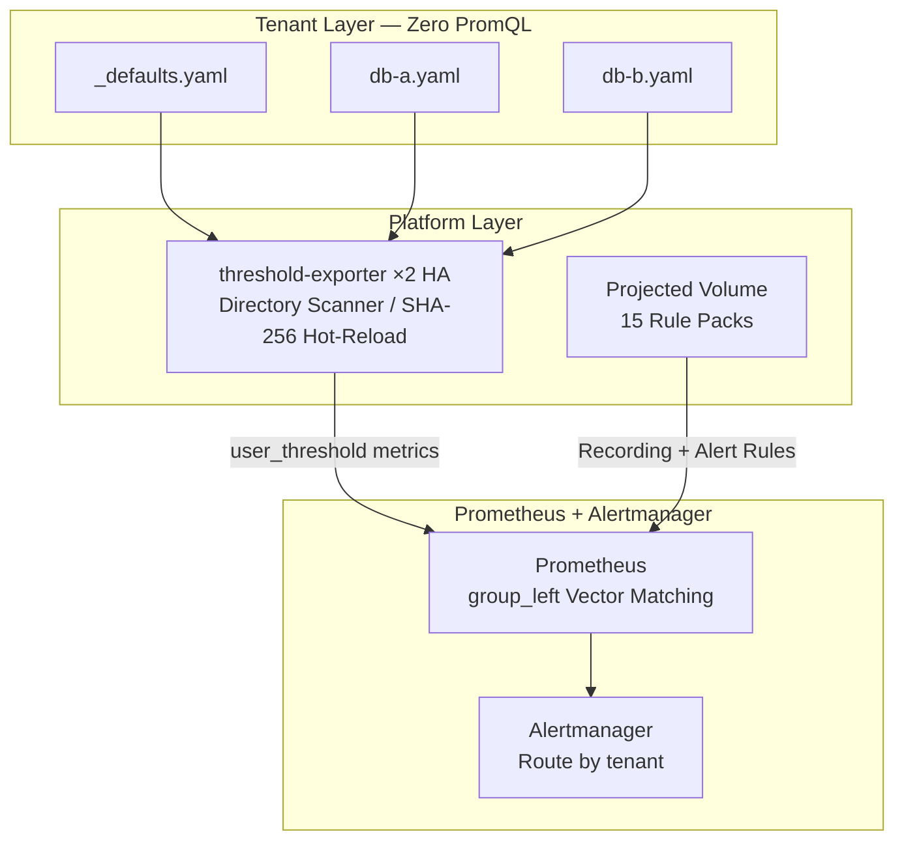

# Dynamic Alerting Integrations

> **Language / 語言：** **English (Current)** | [中文](README.md)

   

Rule explosion and change bottlenecks are the core pain points of Prometheus alerting in multi-tenant environments. This platform solves them with a config-driven architecture: tenants write YAML, the platform manages rules — thresholds, routing, notifications, and maintenance windows are all config-driven, and rule count does not grow with tenants.

**Designed for:** Platform teams managing 10+ tenants across multiple technology stacks (DB / Cache / MQ / JVM) who need tenant self-service, unified governance, and zero-PromQL alert management within the Prometheus ecosystem.

> **Not sure where to start?** Try the [Getting Started Wizard](https://vencil.github.io/Dynamic-Alerting-Integrations/assets/jsx-loader.html?component=../getting-started/wizard.jsx) — answer a few questions and get a personalized reading path.
>
> Or jump in by role: [Platform Engineer](docs/getting-started/for-platform-engineers.en.md) · [Domain Expert / DBA](docs/getting-started/for-domain-experts.en.md) · [Tenant Team](docs/getting-started/for-tenants.en.md)

---

## Why This Platform

### Platform Teams: Rule Explosion and Maintenance Bottleneck

In traditional multi-tenant monitoring, each tenant requires its own PromQL rules and routing config. 100 tenants × 50 rules = 5,000 independent expressions, each needing its own PR, review, and deployment. The platform team becomes the bottleneck for every tenant change, and config drift worsens over time.

This platform uses `group_left` vector matching to reduce complexity from O(N×M) to O(M) — rule count depends only on metric types, not tenant count:

```yaml
# Traditional: one rule per tenant, N tenants = N rules
- alert: MySQLHighConnections_db-a
  expr: mysql_global_status_threads_connected{namespace="db-a"} > 100

# Dynamic: single rule covers all tenants
- alert: MariaDBHighConnections
  expr: |
    tenant:mysql_threads_connected:max
    > on(tenant) group_left
    tenant:alert_threshold:connections
```

Routing, notifications, and maintenance windows are equally config-driven. 15 Rule Packs are independently maintained via Projected Volume — zero PR conflicts between teams. SHA-256 hash hot-reload means changes take effect without restarting Prometheus.

### Tenant Teams: PromQL Barrier and Change Delays

Tenants know their business best — what connection count is normal, what latency is acceptable. But adjusting thresholds requires PromQL expertise, and every change goes through a ticket → platform team → PR → deploy cycle.

This platform lets tenants write YAML only:

```yaml
tenants:
  db-a:
    mysql_connections: "100"
    _severity_dedup: true
    _routing:
      default_receiver: { type: webhook, url: "https://hooks.slack.com/..." }
```

`da-tools scaffold` generates config interactively, `da-tools validate-config` validates locally, and changes take effect via hot-reload. Scheduled thresholds (auto-relax at night) and recurring maintenance windows (cron + duration auto-silence) let tenants manage their own operational rhythm.

### Domain Experts: Alert Quality and Standardization

DBAs and SREs need to ensure alert quality and consistency across the organization. In practice, rules are scattered across tenant configs, severity definitions vary, Warning and Critical fire simultaneously causing notification fatigue, and there's no systematic way to analyze coverage.

The platform provides: 15 pre-loaded Rule Packs encoding domain best practices (MariaDB, PostgreSQL, Kafka, and 10 more technology stacks); Severity Dedup at the Alertmanager inhibit layer automatically suppresses duplicate notifications (TSDB retains full records); Alert Quality Scoring quantifies noise and staleness metrics; Policy-as-Code enforces organization-level governance rules in CI.

### Enterprise Benefits

| Aspect | Traditional (100 tenants) | Dynamic Platform (100 tenants) |
|--------|--------------------------|-------------------------------|
| Rule evaluations | 9,600 (N×M) | 237 (fixed) |
| Prometheus memory | ~600MB+ | ~154MB |
| New tenant onboarding | Days to weeks | Minutes (scaffold → validate) |
| Threshold change flow | Ticket → PR → Deploy | Tenant self-service YAML + Hot-Reload |
| Governance | Ad-hoc review | Schema Validation + Policy-as-Code + CI |

Measured: scaling from 2 to 102 tenants, rule evaluation time stayed at 59.1ms → 60.6ms ([Benchmark §1](docs/benchmarks.md#1-向量匹配複雜度分析)).

---

## Architecture Overview


```mermaid
graph TD
    subgraph TL["Tenant Layer — Zero PromQL"]
        D["_defaults.yaml"]
        T1["db-a.yaml"]
        T2["db-b.yaml"]
    end

    subgraph PL["Platform Layer"]
        TE["threshold-exporter ×2 HA<br/>Directory Scanner / SHA-256 Hot-Reload"]
        RP["Projected Volume<br/>15 Rule Packs"]
    end

    subgraph PE["Prometheus + Alertmanager"]
        PROM["Prometheus<br/>group_left Vector Matching"]
        AM["Alertmanager<br/>Route by tenant"]
    end

    D --> TE
    T1 --> TE
    T2 --> TE
    TE -->|user_threshold metrics| PROM
    RP -->|Recording + Alert Rules| PROM
    PROM --> AM
```

---

## Quick Start

```bash
# 1. VS Code → "Reopen in Container"
# 2. Deploy
make setup
# 3. Verify
make verify
# 4. Failure test
make test-alert
# 5. End-to-end demo
make demo-full
# 6. UIs
make port-forward
# Prometheus: localhost:9090 | Grafana: localhost:3000 (admin/admin) | Alertmanager: localhost:9093
```

> **Production deployment?** The above is for local development. For production, see: [Helm + OCI Registry install](components/threshold-exporter/README.md#部署-helm) · [GitOps Deployment Guide](docs/gitops-deployment.en.md) · [BYO Prometheus Integration](docs/byo-prometheus-integration.en.md)

---

## Rule Packs

15 Rule Packs pre-loaded via Projected Volume, each with an independent ConfigMap (`optional: true`). Unused packs cost near-zero evaluation ([Benchmark §3](docs/benchmarks.md#3-空向量零成本-empty-vector-zero-cost)).

| Rule Pack | Exporter | Recording | Alert |
|-----------|----------|-----------|-------|
| mariadb | mysqld_exporter (Percona) | 11 | 8 |
| postgresql | postgres_exporter | 11 | 9 |
| kubernetes | cAdvisor + kube-state-metrics | 7 | 4 |
| redis | redis_exporter | 11 | 6 |
| mongodb | mongodb_exporter | 10 | 6 |
| elasticsearch | elasticsearch_exporter | 11 | 7 |
| oracle | oracledb_exporter | 11 | 7 |
| db2 | db2_exporter | 12 | 7 |
| clickhouse | clickhouse_exporter | 12 | 7 |
| kafka | kafka_exporter | 13 | 9 |
| rabbitmq | rabbitmq_exporter | 12 | 8 |
| jvm | jmx_exporter | 9 | 7 |
| nginx | nginx-prometheus-exporter | 9 | 6 |
| operational | threshold-exporter ops modes | 0 | 4 |
| platform | threshold-exporter self-monitoring | 0 | 4 |
| **Total** | | **139** | **99** |

See [Rule Packs Directory](rule-packs/README.md) · [Alert Reference](rule-packs/ALERT-REFERENCE.en.md)

---

## Tools

All tools are packaged in the `da-tools` container (`docker run --rm ghcr.io/vencil/da-tools`) — no cloning or dependency installation required. The Interactive Tools Portal is available as a separate image (`docker run -p 8080:80 ghcr.io/vencil/da-portal`) for enterprise intranet / air-gapped deployment.

**Tenant Lifecycle:** `scaffold_tenant` config generation → `onboard_platform` existing environment analysis → `migrate_rule` AST migration engine → `validate_migration` Shadow dual-track verification → `cutover_tenant` one-click cutover → `offboard_tenant` safe removal

**Day-to-Day Operations:** `diagnose` / `batch_diagnose` health checks · `patch_config` safe updates (with `--diff`) · `check_alert` alert status · `maintenance_scheduler` scheduled silence · `generate_alertmanager_routes` routing generation · `explain_route` routing debugger (ADR-007)

**Adoption Pipeline (v2.2.0):** `init` project scaffold generation (CI/CD + conf.d + Kustomize) · `config_history` config snapshot & history tracking · `gitops-check` GitOps Native Mode validation · `demo-showcase` 5-tenant demo script · [Hands-on Lab](docs/scenarios/hands-on-lab.en.md) hands-on tutorial · [Incremental Migration Playbook](docs/scenarios/incremental-migration-playbook.en.md) zero-downtime 4-phase migration

**Routing Profiles & Domain Policies (v2.1.0 ADR-007):** `_routing_profiles.yaml` defines cross-tenant shared routing configs, `_domain_policy.yaml` defines business-domain compliance constraints. Four-layer merge: `_routing_defaults` → profile → tenant `_routing` → `_routing_enforced`. Tools: `check_routing_profiles` (lint hook) · `explain_route` (debugger) · JSON Schema validation

**Quality & Governance:** `validate_config` all-in-one validation · `alert_quality` alert quality scoring · Policy-as-Code engine · `cardinality_forecast` trend prediction · `backtest_threshold` historical replay · `baseline_discovery` threshold recommendations · `config_diff` diff report

Full CLI reference: [da-tools CLI](docs/cli-reference.en.md) · [Cheat Sheet](docs/cheat-sheet.en.md)

---

## Key Design Decisions

| Decision | Rationale | ADR |
|----------|-----------|-----|
| O(M) Rule Complexity | `group_left` vector matching — rule count depends only on metric types, not tenant count | — |
| TSDB Completeness First | Severity Dedup at Alertmanager inhibit layer — TSDB always retains full warning + critical records | [ADR-001](docs/adr/001-severity-dedup-via-inhibit.en.md) |
| Sentinel Alert Tri-State | exporter flag → sentinel alert → inhibit, composable Normal / Silent / Maintenance modes | [ADR-003](docs/adr/003-sentinel-alert-pattern.en.md) |
| Projected Volume Isolation | 15 independent Rule Pack ConfigMaps (`optional: true`), zero PR conflicts | [ADR-005](docs/adr/005-projected-volume-for-rule-packs.en.md) |
| Config-Driven Full Chain | Thresholds → routing → notifications → behavior control, all YAML-driven | — |
| Four-Layer Routing Merge | `_routing_defaults` → profile → tenant `_routing` → `_routing_enforced`, cross-tenant sharing + domain policy constraints | [ADR-007](docs/adr/007-cross-domain-routing-profiles.en.md) |
| Security Guardrails Built-in | Webhook Domain Allowlist · Schema Validation · Cardinality Guard (per-tenant 500 limit) | — |

---

## Documentation Guide

| Document | Description |
|----------|-------------|
| [Architecture & Design](docs/architecture-and-design.en.md) | Core design, HA, Rule Pack architecture |
| Getting Started (by role) | [Platform Engineer](docs/getting-started/for-platform-engineers.en.md) · [Domain Expert](docs/getting-started/for-domain-experts.en.md) · [Tenant](docs/getting-started/for-tenants.en.md) |
| [Migration Guide](docs/migration-guide.en.md) | Onboarding flow, AST engine, Shadow Monitoring |
| [BYO Prometheus](docs/byo-prometheus-integration.en.md) | Integrate with existing Prometheus/Thanos |
| [BYO Alertmanager](docs/byo-alertmanager-integration.en.md) | Alertmanager integration & dynamic routing |
| [Federation](docs/federation-integration.en.md) | Multi-cluster architecture blueprint |
| [GitOps Deployment](docs/gitops-deployment.en.md) | ArgoCD/Flux workflow |
| [Custom Rule Governance](docs/custom-rule-governance.en.md) | Three-tier governance, CI linting |
| [Shadow Monitoring SOP](docs/shadow-monitoring-sop.en.md) | Dual-track SOP |
| [Benchmarks](docs/benchmarks.md) | Full benchmark data and methodology |
| [Scenarios](docs/scenarios/) | Alert Routing · Shadow Cutover · Federation · Tenant Lifecycle · GitOps CI/CD · Hands-on Lab |
| Day-2 Operations | `diagnose` → `alert-quality` → `patch-config` → `maintenance-scheduler` ([CLI Reference](docs/cli-reference.en.md)) |

Full doc map: [doc-map.md](docs/internal/doc-map.md) · Tool map: [tool-map.md](docs/internal/tool-map.md) · Interactive tools: [Interactive Tools](https://vencil.github.io/Dynamic-Alerting-Integrations/)

---

## Prerequisites

- [Docker Engine](https://docs.docker.com/engine/install/) or Docker Desktop
- [kubectl](https://kubernetes.io/docs/tasks/tools/)
- (Recommended) VS Code + [Dev Containers extension](https://marketplace.visualstudio.com/items?itemName=ms-vscode-remote.remote-containers)

---

## License

MIT
