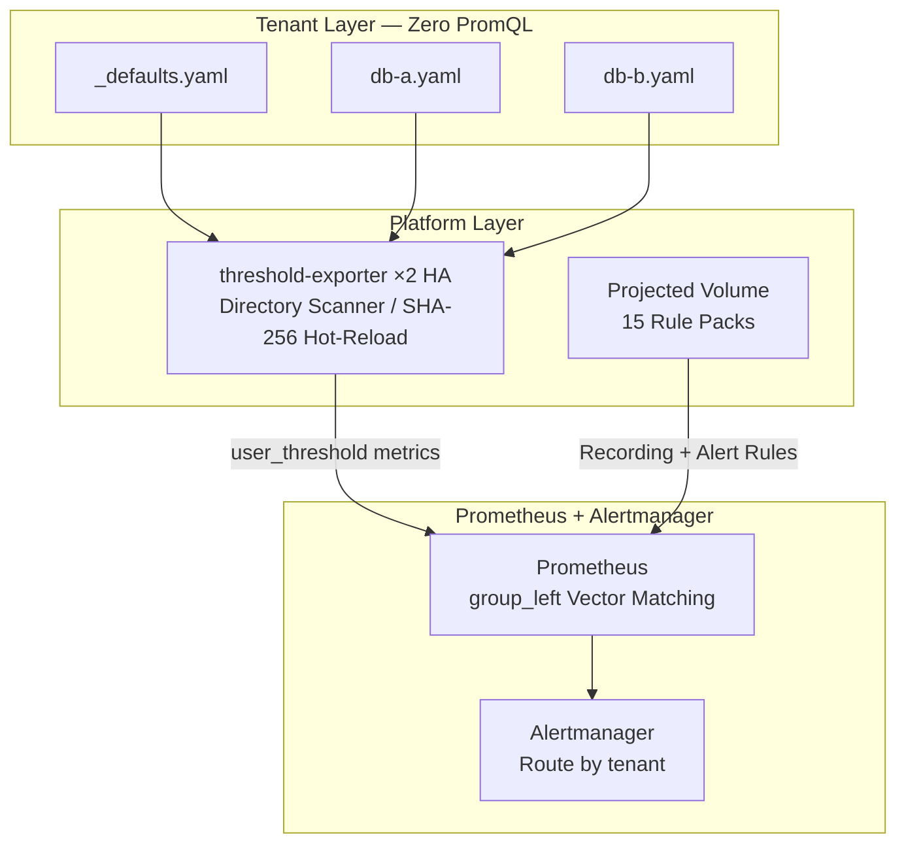

# Dynamic Alerting Integrations

> **Language / 語言：** **English (Current)** | [中文](README.md)

Config-driven multi-tenant alerting platform built on Prometheus `group_left` vector matching.

> **Managing 100 tenants: from 5,000 hand-written rules → 237 fixed rules.**
> Tenants write YAML only — no PromQL. New tenant onboarding in minutes, changes take effect in seconds.

     

---

## Key Metrics

| Metric | Traditional (100 tenants) | Dynamic Alerting |
|--------|--------------------------|-----------------|
| Rule count | 5,000+ (grows linearly with tenants) | 237 (fixed, O(M)) |
| New tenant onboarding | 1–3 days (PR → Review → Deploy) | < 5 minutes (scaffold → validate → reload) |
| Prometheus memory | ~600MB+ | ~154MB |
| Rule evaluation time | Grows linearly with tenants | 60ms (same for 2 or 102 tenants, [Benchmark](docs/benchmarks.md#1-向量匹配複雜度分析)) |
| Tenant knowledge required | PromQL + Alertmanager config | YAML threshold values |

---

## Architecture Overview


```mermaid
graph TD
    subgraph TL["Tenant Layer — Zero PromQL"]
        D["_defaults.yaml"]
        T1["db-a.yaml"]
        T2["db-b.yaml"]
    end

    subgraph PL["Platform Layer"]
        TE["threshold-exporter ×2 HA<br/>Directory Scanner / SHA-256 Hot-Reload"]
        RP["Projected Volume<br/>15 Rule Packs"]
    end

    subgraph PE["Prometheus + Alertmanager"]
        PROM["Prometheus<br/>group_left Vector Matching"]
        AM["Alertmanager<br/>Route by tenant"]
    end

    D --> TE
    T1 --> TE
    T2 --> TE
    TE -->|user_threshold metrics| PROM
    RP -->|Recording + Alert Rules| PROM
    PROM --> AM
```

15 Rule Packs covering MySQL, PostgreSQL, Redis, Kafka, and 9 other tech stacks, deployed independently via Projected Volume (`optional: true`). Unused packs cost near-zero evaluation. See [Rule Packs Directory](rule-packs/README.md) · [Alert Reference](rule-packs/ALERT-REFERENCE.en.md)

---

## Before / After

```yaml
# Traditional: one rule set per tenant — 100 tenants = 5,000 expressions
- alert: MySQLHighConnections_db-a
  expr: mysql_global_status_threads_connected{namespace="db-a"} > 100
# ... × 100 tenants × 50 rules

# Dynamic Alerting: single rule covers all tenants
- alert: MariaDBHighConnections
  expr: tenant:mysql_threads_connected:max > on(tenant) group_left tenant:alert_threshold:connections
# Tenants just declare thresholds: db-a: { mysql_connections: "100" }
```

Full comparison with Alertmanager routing examples: [Config-Driven Design](docs/architecture-and-design.en.md#2-core-design-config-driven-architecture).

---

## Getting Started

### Local Experience (5 minutes)

```bash
# VS Code → "Reopen in Container"
make setup && make verify && make test-alert
# Prometheus: localhost:9090 | Grafana: localhost:3000 | Alertmanager: localhost:9093
```

### Production Deployment

| Environment | Recommended Path | Guide |
|-------------|-----------------|-------|
| Existing Prometheus Operator | Helm + `rules.mode=operator` | [Operator Integration](docs/prometheus-operator-integration.en.md) |
| Self-managed Prometheus | Helm + ConfigMap | [BYO Prometheus](docs/byo-prometheus-integration.en.md) |
| GitOps (ArgoCD / Flux) | Helm + Git repo | [GitOps Deployment](docs/gitops-deployment.en.md) |
| Not sure? | Interactive Decision Matrix | [Decision Matrix](docs/getting-started/decision-matrix.en.md) |

All paths support [OCI Registry installation](components/threshold-exporter/README.md#部署-helm).

### Getting Started by Role

- **Platform Engineer** — Architecture, deployment & operations → [Getting Started](docs/getting-started/for-platform-engineers.en.md)
- **Domain Expert** — Rule Pack customization & quality governance → [Getting Started](docs/getting-started/for-domain-experts.en.md)
- **Tenant** — Threshold configuration & self-service management → [Getting Started](docs/getting-started/for-tenants.en.md)
- **Not sure?** → [Getting Started Wizard](https://vencil.github.io/Dynamic-Alerting-Integrations/assets/jsx-loader.html?component=../getting-started/wizard.jsx)

---

## Deployment Tiers

### Tier 1: Git-Native (Pure GitOps)

Fully Git-tracked YAML workflow. Tenant config → `da-tools validate-config` local validation → git commit → ArgoCD/Flux auto-deploy → SHA-256 hot-reload in seconds.

Best for: GitOps-native teams, low-to-moderate config change frequency, YAML-comfortable tenants.

### Tier 2: Portal + API (UI Management)

Everything in Tier 1, plus a REST API management plane (RBAC), da-portal UI (config browser, change preview, bulk operations), and OAuth2 authentication. Portal auto-degrades to read-only if API is unavailable — GitOps workflow unaffected.

Best for: Large tenant populations (20+), high-frequency threshold adjustments, UI self-service or REST API automation needs, compliance audit requirements.

### Workflow Comparison

| Process | Tier 1 (Git-Native) | Tier 2 (Portal + API) |
|---------|--------------------|-----------------------|
| New tenant onboarding | `scaffold` → git commit → deploy (minutes) | UI click → API → git commit → deploy (minutes) |
| Threshold adjustment | Edit YAML → commit → hot-reload (seconds) | UI edit → Save → hot-reload (seconds) |
| Bulk changes | Script / `patch_config` | Portal multi-select → bulk edit → one-click submit |
| Change audit | git blame + log | git log + API audit trail |
| RBAC | Git layer (branch protection) | API layer (OIDC + fine-grained permissions) |
| Degradation | N/A | Portal read-only, YAML workflow unaffected |

---

## Platform Capabilities

### Rule Engine

O(M) complexity (`group_left` vector matching) · 15 Rule Pack Projected Volumes independently deployed · Severity Dedup via Alertmanager Inhibit ([ADR-001](docs/adr/001-severity-dedup-via-inhibit.en.md)) · Sentinel Alert tri-state control ([ADR-003](docs/adr/003-sentinel-alert-pattern.en.md))

### Tenant Management

Tri-state mode (Normal / Silent / Maintenance with `expires` auto-expiry) · Four-layer routing merge: `_routing_defaults` → profile → tenant → enforced ([ADR-007](docs/adr/007-cross-domain-routing-profiles.en.md)) · Scheduled thresholds & maintenance windows · Schema Validation (dual Go + Python) · Cardinality Guard (per-tenant 500 limit)

### Toolchain (da-tools CLI)

| Category | Tools |
|----------|-------|
| Tenant lifecycle | `scaffold` config generation · `onboard` environment analysis · `migrate-rule` AST migration · `validate-migration` dual-track verification · `cutover` switch · `offboard` removal |
| Day-to-day ops | `diagnose` health check · `patch-config` safe updates · `check-alert` alert status · `maintenance-scheduler` scheduled silence · `explain-route` routing debugger |
| Quality governance | `validate-config` all-in-one validation · `alert-quality` quality scoring · Policy-as-Code · `cardinality-forecast` trend prediction · `backtest-threshold` historical replay |
| Adoption acceleration | `init` project scaffold · `config-history` snapshot tracking · `gitops-check` GitOps validation · `demo-showcase` demo script |

All tools packaged in `da-tools` container (`docker run --rm ghcr.io/vencil/da-tools`). Full CLI reference: [da-tools CLI](docs/cli-reference.en.md) · [Cheat Sheet](docs/cheat-sheet.en.md) · [Interactive Tools Index](docs/interactive-tools.md)

---

## Key Design Decisions

| Decision | Rationale | ADR |
|----------|-----------|-----|
| O(M) Rule Complexity | `group_left` vector matching — rule count depends only on metric types | — |
| TSDB Completeness First | Severity Dedup at Alertmanager inhibit layer — TSDB retains full records | [ADR-001](docs/adr/001-severity-dedup-via-inhibit.en.md) |
| Projected Volume Isolation | 15 independent Rule Pack ConfigMaps, zero PR conflicts | [ADR-005](docs/adr/005-projected-volume-for-rule-packs.en.md) |
| Config-Driven Full Chain | Thresholds → routing → notifications → behavior control, all YAML-driven | — |
| Four-Layer Routing Merge | defaults → profile → tenant → enforced + domain policy constraints | [ADR-007](docs/adr/007-cross-domain-routing-profiles.en.md) |
| Security Guardrails Built-in | Webhook Domain Allowlist · Schema Validation · Cardinality Guard | — |

Full ADR index: [docs/adr/](docs/adr/README.en.md)

---

## Documentation Guide

| Document | Description |
|----------|-------------|
| [Architecture & Design](docs/architecture-and-design.en.md) | Core design, HA, Rule Pack architecture |
| Getting Started (by role) | [Platform Engineer](docs/getting-started/for-platform-engineers.en.md) · [Domain Expert](docs/getting-started/for-domain-experts.en.md) · [Tenant](docs/getting-started/for-tenants.en.md) |
| [Migration Guide](docs/migration-guide.en.md) | Onboarding flow, AST engine, Shadow Monitoring |
| Integration guides | [BYO Prometheus](docs/byo-prometheus-integration.en.md) · [BYO Alertmanager](docs/byo-alertmanager-integration.en.md) · [Federation](docs/federation-integration.en.md) · [GitOps](docs/gitops-deployment.en.md) |
| [Custom Rule Governance](docs/custom-rule-governance.en.md) | Three-tier governance, CI linting |
| [Benchmarks](docs/benchmarks.md) | Full benchmark data and methodology |
| [Scenarios](docs/scenarios/) | 9 hands-on scenarios (Routing · Shadow · Federation · Lifecycle · GitOps · Lab) |
| Day-2 Operations | [CLI Reference](docs/cli-reference.en.md) · [Cheat Sheet](docs/cheat-sheet.en.md) |

Full doc map: [doc-map.md](docs/internal/doc-map.md) · Tool map: [tool-map.md](docs/internal/tool-map.md)
