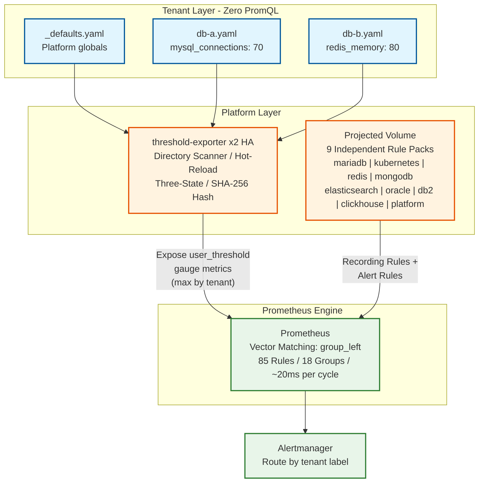

# Dynamic Alerting Integrations

> **Language / 語言：** **English (Current)** | [中文](README.md)

> **Enterprise-Grade Multi-Tenant Monitoring Governance Platform** v1.0.1 — Configuration-driven thresholds, zero PromQL for tenants, 9 pre-loaded rule packs (MariaDB / Redis / MongoDB / Elasticsearch / Oracle / DB2 / ClickHouse / Kubernetes / Platform), AST migration engine, three-tier governance model, regex dimension thresholds, scheduled time windows, HA deployment.

---

## Pain Points and Solutions

### 2.1 Rule Explosion and Performance Bottlenecks

**❌ Traditional Pain Points:**
100 tenants × 50 rules = 5,000 independent PromQL evaluations every 15 seconds. Prometheus CPU spikes, rule evaluation latency impacts SLA.

**✅ Our Solution:**
Vector matching with `group_left`. Platform maintains a fixed set of M rules. Prometheus evaluates once and matches all tenants' `user_threshold` vectors simultaneously. Complexity: O(N×M) → O(M).

**Code Comparison:**

```yaml
# ❌ Traditional: one rule per tenant (×100 tenants = 100 rules)
- alert: MySQLHighConnections_db-a
  expr: mysql_global_status_threads_connected{namespace="db-a"} > 100
- alert: MySQLHighConnections_db-b
  expr: mysql_global_status_threads_connected{namespace="db-b"} > 80
# ... repeat for every tenant

# ✅ Dynamic: single rule covers all tenants
- alert: MariaDBHighConnections
  expr: |
    tenant:mysql_threads_connected:max
    > on(tenant) group_left
    tenant:alert_threshold:connections
```

**Tenant Configuration (Zero PromQL):**

```yaml
# conf.d/db-a.yaml
tenants:
  db-a:
    mysql_connections: "100"
  db-b:
    mysql_connections: "80"
```

**Performance Benchmark:**

| Metric | Dynamic (Current) | Traditional @ 100 Tenants |
|--------|-------------------|---------------------------|
| Alert Rules | 56 (fixed) | 5,600 (56×100) |
| Total Rules | 141 (9 Rule Packs) | 5,600+ |
| **Evaluation Time per Cycle** | **~20ms** (5-round mean ± 1.9ms) | **~800ms+** (linear growth) |
| Cost of Unused Rule Packs | Near zero | N/A |

Detailed performance analysis: see [Architecture and Design Document](docs/architecture-and-design.en.md)

---

### 2.2 Tenant Onboarding Friction

**❌ Traditional Pain Points:**
Tenants must learn PromQL (`rate`, `sum by`, `group_left`). A single label typo = silent failure. Platform team debugs PromQL for tenants.

**✅ Our Solution:**
Zero PromQL. `scaffold_tenant.py` generates configuration through interactive Q&A. `migrate_rule.py` automatically converts legacy rules with intelligent aggregation inference. Tenants write only YAML: `mysql_connections: "80"`.

---

### 2.3 Platform Maintenance Nightmare

**❌ Traditional Pain Points:**
All rules packed in a single giant ConfigMap. Every threshold change = PR → CI/CD → Prometheus reload. Multi-team editing = merge conflicts.

**✅ Our Solution:**
9 independent Rule Pack ConfigMaps mounted via Projected Volume. Each team (DBA, SRE, K8s, Analytics) maintains their own rule pack independently. SHA-256 hash hot-reload — no Prometheus restart needed. Directory mode (`conf.d/`) supports per-tenant YAML files.

---

### 2.4 Alert Fatigue

**❌ Traditional Pain Points:**
Maintenance window = alert storm. Non-critical Redis queue alert = P0 on-call.

**✅ Our Solution:**
Built-in maintenance mode (`_state_maintenance: enable` suppresses all alerts via `unless`). Multi-layer severity (`_critical` suffix). Dimensional thresholds (`redis_queue_length{queue="email"}: 1000`). Three-state logic: each tenant's each metric supports custom / default / disable. **Scheduled thresholds**: time-window auto-switching (e.g., `22:00-06:00` relaxed nighttime thresholds), reducing off-hours false positives.

---

### 2.5 Governance and Auditing

**❌ Traditional Pain Points:**
Who changed which threshold? No audit trail. No separation of duties.

**✅ Our Solution:**
Per-tenant YAML in Git = natural audit trail. `_defaults.yaml` controlled by platform team (separation of duties). Boundary rules prevent tenants from overriding platform settings. File-level RBAC via Git permissions. **Three-tier governance model**: Platform Team manages global defaults → Domain Experts define golden standards → Tenant Tech Leads tune business thresholds, with CI deny-list linting for compliance.

---

### 2.6 Legacy Rule Migration Risk

**❌ Traditional Pain Points:**
Hundreds of hand-written PromQL rules with no automated conversion path. Manual migration takes weeks, and a big-bang cutover carries extreme risk — a failed switch means monitoring blind spots.

**✅ Our Solution:**
`migrate_rule.py` v4 with **AST migration engine** (`promql-parser` Rust PyO3) precisely identifies metric names and label matchers. `custom_` prefix isolation prevents naming conflicts. `--triage` mode produces a CSV inventory categorizing each rule's migration strategy. **Shadow Monitoring** dual-track — `validate_migration.py` verifies numerical consistency before and after migration (tolerance ≤ 5%), enabling zero-risk progressive cutover.

---

### 2.7 Fine-Grained Dimension Control

**❌ Traditional Pain Points:**
Only one threshold per metric. Oracle DBAs need 85% for `USERS` tablespace and 95% for `SYSTEM` tablespace — traditional approach requires two separate rules.

**✅ Our Solution:**
**Regex dimension thresholds**: support `=~` operator (e.g., `tablespace=~"SYS.*"`), specifying dimension-level thresholds directly in YAML. The exporter outputs regex patterns as `_re` suffixed labels, and PromQL recording rules perform matching at query time. Tenants still write zero PromQL.

---

### Enterprise Value Propositions

| Value | Mechanism | Verifiability |
|-------|-----------|---------------|
| **Risk-Free Migration** | `migrate_rule.py` v4 AST engine + `custom_` prefix isolation + Shadow Monitoring dual-track | `validate_migration.py` numerical diff ≤ 5% |
| **Zero-Crash Opt-Out** | Projected Volume `optional: true` — deleting a ConfigMap won't crash Prometheus | `kubectl delete cm prometheus-rules-<type>` instantly testable |
| **Full Lifecycle Governance** | `scaffold_tenant.py` onboard → `patch_config.py` operate → `deprecate_rule.py` / `offboard_tenant.py` offboard | Every tool has `--dry-run` or pre-check mode |
| **Live Verifiability** | `make demo-full` end-to-end: real load injection → alert fires → cleanup → auto-recovery | Full cycle < 5 minutes, visually observable |
| **Multi-DB Ecosystem** | 9 Rule Packs covering 7 database types (MariaDB / Redis / MongoDB / ES / Oracle / DB2 / ClickHouse) + K8s + Platform self-monitoring | `scaffold_tenant.py --catalog` lists all supported DB types |

---

## Architecture Overview

### Concept Comparison: Traditional vs. Dynamic


### Data Flow Architecture



---

## Quick Start

```bash
# 1. Open in VS Code → "Reopen in Container"

# 2. One-click deployment
make setup

# 3. Verify metrics
make verify

# 4. Hard Outage Test — Kill process to simulate service failure
make test-alert

# 5. Live Load Demo — stress-ng + connections → alert fires → cleanup → auto-recovery
make demo-full

# 6. Access UIs
make port-forward
# Prometheus: http://localhost:9090
# Grafana:    http://localhost:3000 (admin/admin)
```

---

## Documentation Guide

Ordered by reader journey: Understand → Deploy → Integrate → Migrate → Govern → Operate.

| Document | Description | Target Audience |
|----------|-------------|-----------------|
| [Architecture and Design](docs/architecture-and-design.en.md) | O(M) derivation, HA design, Projected Volume deep-dive | Platform Engineers, SREs |
| [Rule Packs Directory](rule-packs/README.md) | 9 Rule Pack specifications, structure templates, exporter links | Everyone |
| [Threshold Exporter](components/threshold-exporter/README.md) | Component architecture, API endpoints, configuration format, development guide | Developers |
| [BYOP Integration Guide](docs/byo-prometheus-integration.md) | Minimum integration steps for existing Prometheus / Thanos clusters | Platform Engineers, SREs |
| [Migration Guide](docs/migration-guide.md) | Frictionless onboarding, scaffold tools, 5 hands-on scenarios | Tenants, DevOps |
| [Custom Rule Governance](docs/custom-rule-governance.md) | 3-Tier governance model, RnR definitions, SLA boundaries, CI linting | Platform Leads, Domain Experts |
| [Shadow Monitoring SOP](docs/shadow-monitoring-sop.md) | Dual-track SOP: startup, inspection, convergence criteria, cutover & exit | SREs, Platform Engineers |
| [da-tools CLI](components/da-tools/README.md) | Portable verification toolkit — validate integration without cloning | Everyone |

---

## Rule Packs Directory

9 Rule Packs are pre-loaded in Prometheus via Kubernetes **Projected Volume**, each with its own independent ConfigMap (`optional: true`), maintained separately by different teams:

| Rule Pack | Exporter | Rules | Status |
|-----------|----------|-------|--------|
| mariadb | mysqld_exporter (Percona) | 7R + 8A | Pre-loaded |
| kubernetes | cAdvisor + kube-state-metrics | 5R + 4A | Pre-loaded |
| redis | oliver006/redis_exporter | 7R + 6A | Pre-loaded |
| mongodb | percona/mongodb_exporter | 7R + 6A | Pre-loaded |
| elasticsearch | elasticsearch_exporter | 7R + 7A | Pre-loaded |
| oracle | oracledb_exporter | 6R + 7A | Pre-loaded |
| db2 | db2_exporter | 7R + 7A | Pre-loaded |
| clickhouse | clickhouse_exporter | 7R + 7A | Pre-loaded |
| platform | threshold-exporter self-monitoring | 0R + 4A | Pre-loaded |

**Note:** R=Recording Rules, A=Alert Rules. Total: 53R + 56A = 109 rules. Evaluation cost of unused rule packs is near zero.

---

## Tools

| Tool | Purpose |
|------|---------|
| `scaffold_tenant.py` | Interactive configuration generator for new tenants |
| `migrate_rule.py` | AST migration engine (v4: AST precision + Triage CSV + Prefix isolation + Dictionary + tenant label injection) |
| `validate_migration.py` | Shadow Monitoring value diff (Recording Rule comparison) |
| `patch_config.py` | Safe partial ConfigMap updates |
| `check_alert.py` | Query tenant alert status |
| `diagnose.py` | Tenant health check |
| `offboard_tenant.py` | Safe tenant removal (pre-check + cross-reference cleanup) |
| `deprecate_rule.py` | Graceful rule/metric deprecation (3-step automation) |
| `baseline_discovery.py` | Load observation + threshold suggestions (p95/p99 stats → recommendations) |
| `lint_custom_rules.py` | CI deny-list linter — validates Custom Rule governance compliance |

**Usage Examples:**

```bash
# View supported DB types
python3 scripts/tools/scaffold_tenant.py --catalog

# New tenant: Interactive config generator (supports 8 DB types)
python3 scripts/tools/scaffold_tenant.py

# Existing alert rules: Auto-convert with AST engine
python3 scripts/tools/migrate_rule.py <your-legacy-rules.yml>

# End-to-end demo
make demo
```

---

## Prerequisites

**Required:**

- [Docker Engine](https://docs.docker.com/engine/install/) or Docker Desktop
- [kubectl](https://kubernetes.io/docs/tasks/tools/)

**Recommended (not required):**

- [VS Code](https://code.visualstudio.com/) + [Dev Containers extension](https://marketplace.visualstudio.com/items?itemName=ms-vscode-remote.remote-containers) — provides a pre-configured development environment, but is not required to use this platform

---

## Development (Makefile Targets)

<details>
<summary><strong>Click to expand all Makefile targets</strong></summary>

```
make setup              # Deploy all resources (Kind cluster + DB + Monitoring)
make reset              # Clean and redeploy
make verify             # Verify Prometheus metric collection
make test-alert         # Hard outage test — kill process simulation (usage: make test-alert TENANT=db-b)
make test-scenario-a    # Scenario A: Dynamic thresholds (usage: make test-scenario-a TENANT=db-a)
make test-scenario-b    # Scenario B: Weak link detection
make test-scenario-c    # Scenario C: Status string matching
make test-scenario-d    # Scenario D: Maintenance mode / composite alerts / multi-layer severity
make test-scenario-e    # Scenario E: Multi-tenant isolation (--with-load for real injection)
make test-scenario-f    # Scenario F: HA failover (Kill Pod → continuity → no doubling)
make load-composite     # Composite load injection (connections + cpu) (TENANT=db-a)
make baseline-discovery # Load observation + threshold suggestions (TENANT=db-a)
make demo               # End-to-end demo — quick mode (scaffold + migrate + diagnose + check_alert)
make demo-full          # Live Load Demo (stress-ng + connections → alert fire/resolve cycle)
make component-build    # Build component image (COMP=threshold-exporter)
make component-deploy   # Deploy component (COMP=threshold-exporter ENV=local)
make component-logs     # View component logs
make status             # Display all Pod status
make logs               # View DB logs (TENANT=db-b)
make shell              # Enter DB CLI (TENANT=db-a)
make inspect-tenant     # AI Agent: Inspect tenant health (TENANT=db-a)
make port-forward       # Start port-forwarding (9090, 3000, 9093, 8080)
make clean              # Clean all K8s resources (preserve cluster)
make destroy            # Clean resources + delete Kind cluster
make help               # Show help message
```

</details>

---

## Project Structure

<details>
<summary><strong>Click to expand project directory tree</strong></summary>

```
.
├── components/
│   ├── threshold-exporter/     # Dynamic threshold exporter (Helm chart + Go app)
│   └── (kube-state-metrics integrated into k8s/03-monitoring/)
├── environments/
│   ├── local/                  # Local development Helm values
│   └── ci/                     # CI/CD Helm values
├── helm/
│   └── mariadb-instance/       # Helm chart: MariaDB + exporter sidecar
├── k8s/
│   ├── 00-namespaces/          # db-a, db-b, monitoring
│   └── 03-monitoring/          # Prometheus, Grafana, Alertmanager
│       ├── configmap-rules-*.yaml  # 9 independent Rule Pack ConfigMaps (including platform)
│       └── deployment-prometheus.yaml  # Projected Volume architecture
├── rule-packs/                 # Modular Prometheus rule packs (authoritative reference)
│   └── README.md               # Rule Pack specifications and templates
├── scripts/                    # Operation scripts (_lib.sh, setup, verify, cleanup...)
│   ├── setup.sh                # One-click deployment
│   ├── verify.sh               # Verify metric collection
│   ├── test-alert.sh           # Trigger failure test
│   ├── demo.sh                 # End-to-end demo
│   └── tools/                  # Automation tools
│       ├── patch_config.py
│       ├── check_alert.py
│       ├── diagnose.py
│       ├── migrate_rule.py
│       ├── validate_migration.py  # Shadow Monitoring validation
│       ├── scaffold_tenant.py
│       ├── offboard_tenant.py     # Tenant offboarding
│       ├── deprecate_rule.py      # Rule/Metric deprecation
│       ├── baseline_discovery.py  # Load observation + threshold suggestions
│       └── metric-dictionary.yaml # Heuristic metric mapping dictionary
├── tests/                      # Integration tests
│   ├── scenario-a.sh           # Dynamic threshold test
│   ├── scenario-b.sh           # Weak link detection test
│   ├── scenario-c.sh           # Status string matching test
│   ├── scenario-d.sh           # Maintenance mode/composite alert test
│   ├── scenario-e.sh           # Multi-tenant isolation test
│   ├── scenario-f.sh           # HA failover test
│   └── test-migrate-*.sh       # Migration tool tests
├── docs/                       # Documentation directory
│   ├── architecture-and-design.md  # Architecture deep-dive document
│   ├── migration-guide.md      # Complete migration guide (5 scenarios + examples)
│   ├── custom-rule-governance.md  # Custom rule governance model
│   ├── byo-prometheus-integration.md # BYOP integration guide
│   ├── shadow-monitoring-sop.md   # Shadow Monitoring SRE SOP
│   └── internal/               # Internal dev playbooks (not user-facing)
│       ├── testing-playbook.md    # Testing troubleshooting manual
│       └── windows-mcp-playbook.md # Dev Container operation manual
├── .devcontainer/              # Dev Container configuration
├── CLAUDE.md                   # AI Agent development context guide
├── CHANGELOG.md                # Version changelog
├── Makefile                    # Operation entry point (make help)
└── README.md
```

</details>

---

## High Availability and Self-Monitoring

threshold-exporter is deployed by default with **2 Replicas** with the following HA mechanisms:

- **Pod Anti-Affinity** (`preferredDuringSchedulingIgnoredDuringExecution`): Spreads the two replicas across different Nodes when possible, compatible with Kind single-node clusters.
- **PodDisruptionBudget** (`minAvailable: 1`): Guarantees at least 1 Pod survives Node maintenance.
- **RollingUpdate** (`maxUnavailable: 0`): Zero-downtime rolling updates.
- **`max by(tenant)` aggregation**: All threshold recording rules use `max` instead of `sum` for `user_threshold` aggregation, preventing threshold doubling from multiple replicas.

The Platform Rule Pack (`configmap-rules-platform.yaml`) provides 4 self-monitoring alerts:

| Alert | Condition | Severity |
|-------|-----------|----------|
| `ThresholdExporterDown` | Single Pod `up == 0` | warning |
| `ThresholdExporterAbsent` | All Pods disconnected | critical |
| `ThresholdExporterTooFewReplicas` | Healthy replicas < 2 | warning |
| `ThresholdExporterHighRestarts` | Restarts > 3 in 1 hour | warning |

---

## Key Design Decisions

- **Projected Volume**: 9 Rule Pack ConfigMaps (including Platform self-monitoring) are merged and mounted to `/etc/prometheus/rules/` via projected volume, with each team maintaining their own pack independently and zero PR conflicts.
- **GitOps Directory Mode**: threshold-exporter uses `-config-dir` to scan `conf.d/`, supporting `_defaults.yaml` + per-tenant YAML split.
- **PVC (not emptyDir)**: MariaDB data uses Kind's built-in StorageClass; data persists after Pod restarts.
- **Sidecar Pattern**: mysqld_exporter and MariaDB in the same Pod, connected via `localhost:3306`.
- **Annotation Auto-discovery**: `prometheus.io/scrape: "true"` enables auto-discovery; adding components doesn't require Prometheus configuration changes.
- **Cross-platform Scripts**: `_lib.sh` provides cross-platform utility functions; all scripts run on Linux/macOS/Dev Container environments.

---

## License

MIT
