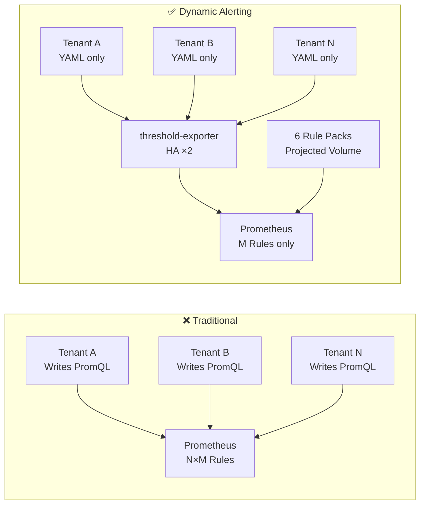
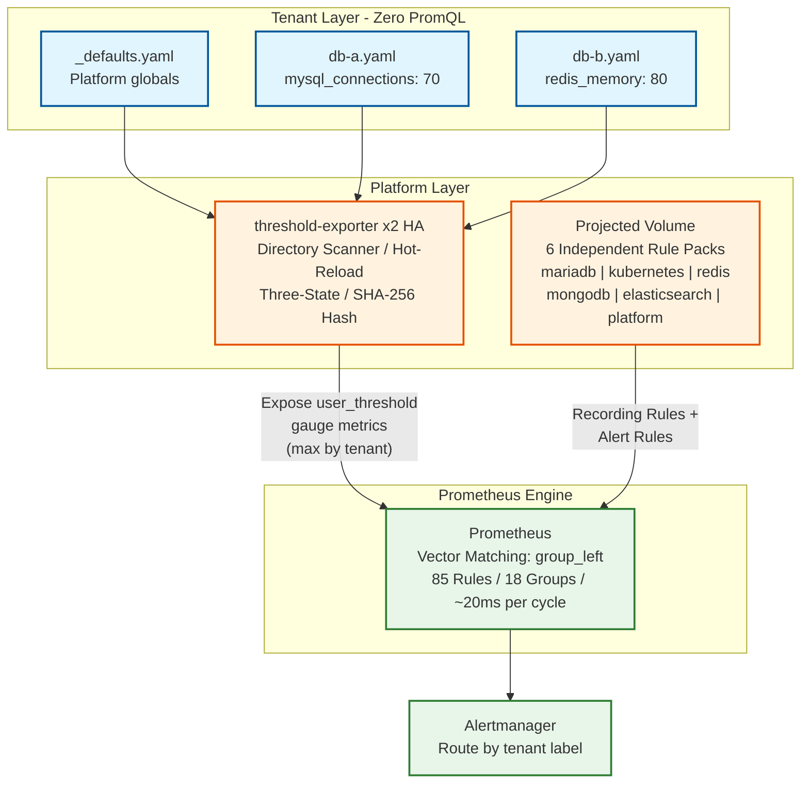

# Dynamic Alerting Integrations

> **Language / 語言：** [English](README.en.md) | **中文（當前）**

> **企業級多租戶動態警報平台** — 配置驅動閾值、租戶零 PromQL、GitOps 目錄模式、HA 部署、6 個預載規則包 (Projected Volume)。

---

## 痛點與解決方案

### 2.1 規則膨脹與效能瓶頸

**❌ 傳統痛點：**
100 個租戶 × 50 條規則 = 5,000 次獨立 PromQL 評估（每 15 秒）。Prometheus CPU 飆升，規則評估延遲影響 SLA。

**✅ 我們的方案：**
透過 `group_left` 向量匹配。平台維護固定 M 條規則，Prometheus 一次評估即匹配所有租戶的 `user_threshold` 向量。複雜度：O(N×M) → O(M)。

**程式碼對比：**

```yaml
# ❌ Traditional: 每個 tenant 一條 rule (×100 tenants = 100 rules)
- alert: MySQLHighConnections_db-a
  expr: mysql_global_status_threads_connected{namespace="db-a"} > 100
- alert: MySQLHighConnections_db-b
  expr: mysql_global_status_threads_connected{namespace="db-b"} > 80
# ... repeat for every tenant

# ✅ Dynamic: 1 條 rule 涵蓋所有 tenants
- alert: MariaDBHighConnections
  expr: |
    tenant:mysql_threads_connected:max
    > on(tenant) group_left
    tenant:alert_threshold:connections
```

**租戶配置（零 PromQL）：**

```yaml
# conf.d/db-a.yaml
tenants:
  db-a:
    mysql_connections: "100"
  db-b:
    mysql_connections: "80"
```

**效能基準：**

| 指標 | 動態（現行） | 傳統 @ 100 租戶 |
|------|-------------|-----------------|
| 警報規則數 | 35（固定） | 3,500（35×100） |
| 規則總數 | 85 | 3,500 |
| 每週期評估時間 | ~20.8ms | ~850ms+（線性增長） |
| 未使用規則包成本 | 近乎零 | N/A |

詳細效能分析：見 [架構與設計文件](docs/architecture-and-design.md)

---

### 2.2 租戶導入阻力

**❌ 傳統痛點：**
租戶必須學習 PromQL（`rate`、`sum by`、`group_left`）。一個 label 寫錯 = 靜默失敗。平台團隊替租戶除錯 PromQL。

**✅ 我們的方案：**
零 PromQL。`scaffold_tenant.py` 透過互動式問答產生配置。`migrate_rule.py` 自動轉換舊規則並智能推斷聚合方式。租戶只寫 YAML：`mysql_connections: "80"`。

---

### 2.3 平台維護災難

**❌ 傳統痛點：**
所有規則塞在一個巨型 ConfigMap 中。每次閾值修改 = PR → CI/CD → Prometheus reload。多團隊編輯 = merge conflicts。

**✅ 我們的方案：**
6 個獨立 Rule Pack ConfigMap，透過 Projected Volume 掛載。各團隊（DBA、SRE、K8s）獨立維護自己的規則包。SHA-256 hash 熱重載 — 不需重啟 Prometheus。目錄模式（`conf.d/`）支援 per-tenant YAML 檔案。

---

### 2.4 警報疲勞

**❌ 傳統痛點：**
維護窗口 = 警報風暴。非關鍵的 Redis queue alert = P0 呼叫。

**✅ 我們的方案：**
內建維護模式（`_state_maintenance: enable` 透過 `unless` 抑制所有警報）。多層嚴重度（`_critical` 後綴）。維度閾值（`redis_queue_length{queue="email"}: 1000`）。三態邏輯：每個租戶的每個指標支援 custom / default / disable。

---

### 2.5 治理與稽核

**❌ 傳統痛點：**
誰改了什麼閾值？沒有稽核軌跡。沒有權責分離。

**✅ 我們的方案：**
Per-tenant YAML 存放於 Git = 天然稽核軌跡。`_defaults.yaml` 由平台團隊管控（權責分離）。邊界規則防止租戶覆蓋平台設定。透過 Git 權限實現檔案級 RBAC。

---

### 企業級價值主張

| 價值 | 機制 | 可驗證性 |
|------|------|----------|
| **零摩擦遷移 (Risk-Free Migration)** | `migrate_rule.py --triage` 分桶 + `custom_` Prefix 隔離 + Shadow Monitoring 雙軌並行 | `validate_migration.py` 數值 diff 報告 |
| **零崩潰退出 (Zero-Crash Opt-Out)** | Projected Volume `optional: true` — 刪除 ConfigMap 不影響 Prometheus 運行 | `kubectl delete cm prometheus-rules-<type>` 立即可測 |
| **全生命週期治理 (Full Lifecycle)** | `scaffold_tenant.py` 導入 → `patch_config.py` 營運 → `deprecate_rule.py` / `offboard_tenant.py` 下架 | 每個工具皆具 `--dry-run` 或 Pre-check 模式 |
| **即時可驗證 (Live Verifiability)** | `make demo-full` 端對端展演：真實負載注入 → alert 觸發 → 清除 → 自動恢復 | 完整循環 < 5 分鐘，肉眼可見 |

---

## 架構總覽

### 概念對比：傳統 vs 動態



### 資料流架構



---

## 快速開始

```bash
# 1. Open in VS Code → "Reopen in Container"

# 2. 一鍵部署
make setup

# 3. 驗證指標
make verify

# 4. 硬體故障測試 — Kill process 模擬服務中斷 (Hard Outage Test)
make test-alert

# 5. 動態負載展演 — Live Load Demo (stress-ng + connections → alert 觸發 → 清除 → 自動恢復)
make demo-full

# 6. 存取 UI
make port-forward
# Prometheus: http://localhost:9090
# Grafana:    http://localhost:3000 (admin/admin)
```

---

## 文件導覽

| 文件 | 說明 | 目標讀者 |
|------|------|---------|
| [遷移指南](docs/migration-guide.md) | 零摩擦導入、scaffold 工具、5 個實戰場景 | 租戶、DevOps |
| [架構與設計](docs/architecture-and-design.md) | 效能分析、HA 設計、Projected Volume 深度解析、治理 | Platform Engineers、SREs |
| [規則包目錄](rule-packs/README.md) | 6 個 Rule Pack 規格、結構範本、exporter 連結 | 全體 |
| [Threshold Exporter](components/threshold-exporter/README.md) | 元件架構、API 端點、配置格式、開發指南 | 開發者 |
| [Shadow Monitoring SOP](docs/shadow-monitoring-sop.md) | 雙軌並行完整 SOP：啟動、每日巡檢、收斂判定、切換退出 | SREs、Platform Engineers |
| [BYOP 整合指南](docs/byo-prometheus-integration.md) | 企業現有 Prometheus / Thanos 叢集的最小整合步驟 (Label 注入、Exporter 抓取、規則掛載) | Platform Engineers、SREs |
| [da-tools CLI](components/da-tools/README.md) | 可攜帶驗證工具容器 — 不需 clone 專案即可驗證整合、遷移規則、產生配置 | 全體 |
| [測試手冊](docs/testing-playbook.md) | K8s 環境問題、HA 測試、shell script 陷阱 | 貢獻者 |

---

## 規則包目錄

6 個 Rule Pack 透過 Kubernetes **Projected Volume** 預載於 Prometheus 中，各自擁有獨立 ConfigMap，由不同團隊獨立維護：

| 規則包 | Exporter | 規則數 | 狀態 |
|--------|----------|--------|------|
| mariadb | mysqld_exporter (Percona) | 7R + 8A | 預載 |
| kubernetes | cAdvisor + kube-state-metrics | 5R + 4A | 預載 |
| redis | oliver006/redis_exporter | 7R + 6A | 預載 |
| mongodb | percona/mongodb_exporter | 7R + 6A | 預載 |
| elasticsearch | elasticsearch_exporter | 7R + 7A | 預載 |
| platform | threshold-exporter 自我監控 | 0R + 4A | 預載 |

**備註：** R=Recording Rules、A=Alert Rules。未使用的規則包評估成本近乎零。

---

## 工具

| 工具 | 用途 |
|------|------|
| `scaffold_tenant.py` | 新租戶互動式配置產生器 |
| `migrate_rule.py` | 自動轉換傳統規則（v3: Triage CSV + Prefix 隔離 + Metric Dictionary） |
| `validate_migration.py` | Shadow Monitoring 數值差異比對（Recording Rule diff） |
| `patch_config.py` | 安全局部更新 ConfigMap |
| `check_alert.py` | 查詢租戶警報狀態 |
| `diagnose.py` | 租戶健康檢查 |
| `offboard_tenant.py` | 安全移除 Tenant 配置（Pre-check + 連帶檢查） |
| `deprecate_rule.py` | 平滑下架過時的 Rule / Metric（三步自動化） |
| `baseline_discovery.py` | 負載觀測 + 閾值建議（p95/p99 統計 → 建議值） |

**使用範例：**

```bash
# New tenant: Interactive config generator
python3 scripts/tools/scaffold_tenant.py

# Existing alert rules: Auto-convert to dynamic
python3 scripts/tools/migrate_rule.py <your-legacy-rules.yml>

# End-to-end demo
make demo
```

---

## 前置需求

- [Docker Desktop](https://www.docker.com/products/docker-desktop/) (Windows/macOS)
- [VS Code](https://code.visualstudio.com/) + [Dev Containers extension](https://marketplace.visualstudio.com/items?itemName=ms-vscode-remote.remote-containers)

---

## 開發（Makefile 目標）

<details>
<summary><strong>Click to expand all Makefile targets</strong></summary>

```
make setup              # 部署全部資源 (Kind cluster + DB + Monitoring)
make reset              # 清除後重新部署
make verify             # 驗證 Prometheus 指標抓取
make test-alert         # 硬體故障/服務中斷測試 (使用: make test-alert TENANT=db-b)
make test-scenario-a    # Scenario A: 動態閾值 (使用: make test-scenario-a TENANT=db-a)
make test-scenario-b    # Scenario B: 弱環節檢測
make test-scenario-c    # Scenario C: 狀態字串比對
make test-scenario-d    # Scenario D: 維護模式 / 複合警報 / 多層嚴重度
make test-scenario-e    # Scenario E: 多租戶隔離驗證 (--with-load 支援真實負載)
make test-scenario-f    # Scenario F: HA 故障切換驗證 (Kill Pod → 連續性 → 無翻倍)
make load-composite     # 複合負載注入 (connections + cpu) (TENANT=db-a)
make baseline-discovery # 負載觀測 + 閾值建議 (TENANT=db-a)
make demo               # 端對端示範 — 快速模式 (scaffold + migrate + diagnose + check_alert)
make demo-full          # 動態負載展演 — Live Load Demo (含 alert 觸發/消除完整循環)
make component-build    # Build component image (COMP=threshold-exporter)
make component-deploy   # Deploy component (COMP=threshold-exporter ENV=local)
make component-logs     # View component logs
make status             # 顯示所有 Pod 狀態
make logs               # 查看 DB 日誌 (TENANT=db-b)
make shell              # 進入 DB CLI (TENANT=db-a)
make inspect-tenant     # AI Agent: 檢查 Tenant 健康 (TENANT=db-a)
make port-forward       # 啟動 Port-Forward (9090, 3000, 9093, 8080)
make clean              # 清除所有 K8s 資源（保留 cluster）
make destroy            # 清除資源 + 刪除 Kind cluster
make help               # 顯示說明
```

</details>

---

## 專案結構

<details>
<summary><strong>Click to expand project directory tree</strong></summary>

```
.
├── components/
│   ├── threshold-exporter/     # 動態閾值 exporter (Helm chart + Go app)
│   └── (kube-state-metrics 已整合至 k8s/03-monitoring/)
├── environments/
│   ├── local/                  # 本地開發 Helm values
│   └── ci/                     # CI/CD Helm values
├── helm/
│   └── mariadb-instance/       # Helm chart: MariaDB + exporter sidecar
├── k8s/
│   ├── 00-namespaces/          # db-a, db-b, monitoring
│   └── 03-monitoring/          # Prometheus, Grafana, Alertmanager
│       ├── configmap-rules-*.yaml  # 6 獨立 Rule Pack ConfigMaps (含 platform)
│       └── deployment-prometheus.yaml  # Projected Volume 架構
├── rule-packs/                 # 模組化 Prometheus 規則包 (權威參考)
│   └── README.md               # Rule Pack 規格與範本
├── scripts/                    # 操作腳本 (_lib.sh, setup, verify, cleanup...)
│   ├── setup.sh                # 一鍵部署
│   ├── verify.sh               # 驗證指標抓取
│   ├── test-alert.sh           # 觸發故障測試
│   ├── demo.sh                 # 端對端示範
│   └── tools/                  # 自動化工具
│       ├── patch_config.py
│       ├── check_alert.py
│       ├── diagnose.py
│       ├── migrate_rule.py
│       ├── validate_migration.py  # Shadow Monitoring 驗證
│       ├── scaffold_tenant.py
│       ├── offboard_tenant.py     # Tenant 下架
│       ├── deprecate_rule.py      # Rule/Metric 下架
│       ├── baseline_discovery.py  # 負載觀測 + 閾值建議
│       └── metric-dictionary.yaml # 啟發式指標對照字典
├── tests/                      # 整合測試
│   ├── scenario-a.sh           # 動態閾值測試
│   ├── scenario-b.sh           # 弱環節檢測測試
│   ├── scenario-c.sh           # 狀態字串比對測試
│   ├── scenario-d.sh           # 維護模式/複合警報測試
│   ├── scenario-e.sh           # 多租戶隔離測試
│   ├── scenario-f.sh           # HA 故障切換測試
│   └── test-migrate-*.sh       # 遷移工具測試
├── docs/                       # 文件目錄
│   ├── migration-guide.md      # 完整遷移指南 (5 scenarios + 範例)
│   ├── architecture-and-design.md  # 架構深度文件
│   ├── shadow-monitoring-sop.md   # Shadow Monitoring SRE SOP
│   ├── windows-mcp-playbook.md    # Dev Container 操作手冊
│   └── testing-playbook.md        # 測試排錯手冊
├── .devcontainer/              # Dev Container 配置
├── CLAUDE.md                   # AI Agent 開發上下文指引
├── CHANGELOG.md                # 版本變更日誌
├── Makefile                    # 操作入口 (make help)
└── README.md
```

</details>

---

## 高可用與自我監控

threshold-exporter 預設以 **2 Replicas** 部署，具備以下 HA 機制：

- **Pod Anti-Affinity**（`preferredDuringSchedulingIgnoredDuringExecution`）：盡可能將兩個 replica 分散在不同 Node，相容 Kind 單節點叢集。
- **PodDisruptionBudget**（`minAvailable: 1`）：Node 維護時保證至少 1 個 Pod 存活。
- **RollingUpdate**（`maxUnavailable: 0`）：滾動更新期間零停機。
- **`max by(tenant)` 聚合**：所有 threshold recording rules 使用 `max` 而非 `sum` 聚合 `user_threshold`，避免多 replica 造成閾值翻倍。

Platform Rule Pack（`configmap-rules-platform.yaml`）提供 4 條自我監控警報：

| 警報 | 條件 | 嚴重度 |
|------|------|--------|
| `ThresholdExporterDown` | 單一 Pod `up == 0` | warning |
| `ThresholdExporterAbsent` | 所有 Pod 斷線 | critical |
| `ThresholdExporterTooFewReplicas` | 健康 replica < 2 | warning |
| `ThresholdExporterHighRestarts` | 1 小時內重啟 > 3 次 | warning |

---

## 關鍵設計決策

- **Projected Volume**：6 個 Rule Pack ConfigMap（含 Platform 自我監控）透過 projected volume 合併掛載至 `/etc/prometheus/rules/`，各團隊獨立維護、零 PR 衝突。
- **GitOps 目錄模式**：threshold-exporter 使用 `-config-dir` 掃描 `conf.d/`，支援 `_defaults.yaml` + per-tenant YAML 拆分。
- **PVC（非 emptyDir）**：MariaDB 資料使用 Kind 內建 StorageClass，Pod 重啟後資料保留。
- **Sidecar 模式**：mysqld_exporter 與 MariaDB 在同一 Pod，透過 `localhost:3306` 連線。
- **Annotation 自動發現**：`prometheus.io/scrape: "true"` 自動發現，新增組件不需修改 Prometheus 設定。
- **跨平台腳本**：`_lib.sh` 提供跨平台工具函式，所有 script 可在 Linux/macOS/Dev Container 環境運行。

---

## License

MIT
