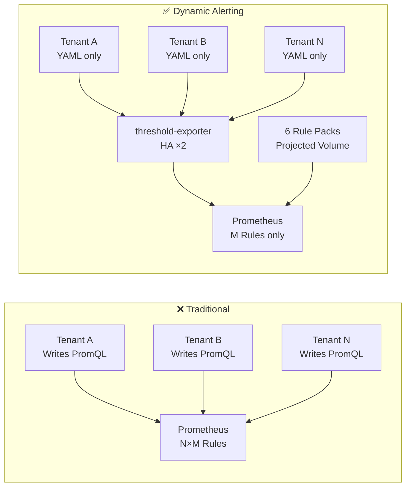

# Dynamic Alerting Integrations

> **Enterprise-grade Multi-Tenant Dynamic Alerting Platform** — Config-driven thresholds with zero PromQL for tenants, GitOps-ready directory mode, HA deployment, and 6 pre-loaded Rule Packs via Projected Volume.

---

## 痛點與解決方案 (The Challenge & Our Solution)

### 2.1 Rule Sprawl & Performance (規則膨脹與效能瓶頸)

**❌ Traditional Pain:**
100 tenants × 50 rules = 5,000 independent PromQL evaluations every 15 seconds. Prometheus CPU spikes, rule evaluation latency degrades SLA.

**✅ Our Solution:**
Vector Matching via `group_left`. Platform maintains fixed M rules. Prometheus evaluates once, matching against all tenants' `user_threshold` vector. Complexity: O(N×M) → O(M).

**Code Comparison:**

```yaml
# ❌ Traditional: 每個 tenant 一條 rule (×100 tenants = 100 rules)
- alert: MySQLHighConnections_db-a
  expr: mysql_global_status_threads_connected{namespace="db-a"} > 100
- alert: MySQLHighConnections_db-b
  expr: mysql_global_status_threads_connected{namespace="db-b"} > 80
# ... repeat for every tenant

# ✅ Dynamic: 1 條 rule 涵蓋所有 tenants
- alert: MariaDBHighConnections
  expr: |
    tenant:mysql_threads_connected:max
    > on(tenant) group_left
    tenant:alert_threshold:connections
```

**Tenant Config (Zero PromQL):**

```yaml
# conf.d/db-a.yaml
tenants:
  db-a:
    mysql_connections: "100"
  db-b:
    mysql_connections: "80"
```

**Performance Benchmark:**

| Metric | Dynamic (Current) | Traditional @ 100 tenants |
|--------|-------------------|--------------------------|
| Alert Rules | 35 (fixed) | 3,500 (35×100) |
| Total Rules | 85 | 3,500 |
| Eval Time / Cycle | ~20.8ms | ~850ms+ (linear) |
| Unused Rule Pack Cost | near-zero | N/A |

Detailed performance analysis: see [docs/architecture-and-design.md](docs/architecture-and-design.md)

---

### 2.2 Tenant Adoption Friction (租戶導入阻力)

**❌ Traditional Pain:**
Tenants must learn PromQL (`rate`, `sum by`, `group_left`). One wrong label = silent failure. Platform team debugs PromQL for tenants.

**✅ Our Solution:**
Zero PromQL. `scaffold_tenant.py` generates config from interactive Q&A. `migrate_rule.py` auto-converts legacy rules with intelligent aggregation heuristics. Tenant writes YAML only: `mysql_connections: "80"`.

---

### 2.3 Platform Maintenance Nightmare (平台維護災難)

**❌ Traditional Pain:**
All rules in one giant ConfigMap. Every threshold change = PR → CI/CD → Prometheus reload. Multi-team edits = merge conflicts.

**✅ Our Solution:**
6 independent Rule Pack ConfigMaps via Projected Volume. Each team (DBA, SRE, K8s) maintains their own pack. Hot-reload via SHA-256 hash — no Prometheus restart needed. Directory mode (`conf.d/`) with per-tenant YAML files.

---

### 2.4 Alert Fatigue (警報疲勞)

**❌ Traditional Pain:**
Maintenance window = alert storm. Non-critical Redis queue alert = P0 page.

**✅ Our Solution:**
Built-in maintenance mode (`_state_maintenance: enable` suppresses all alerts via `unless`). Multi-tier severity (`_critical` suffix). Dimensional thresholds (`redis_queue_length{queue="email"}: 1000`). Three-state logic: custom / default / disable per metric per tenant.

---

### 2.5 Governance & Audit (治理與稽核)

**❌ Traditional Pain:**
Who changed what threshold? No audit trail. No separation of duties.

**✅ Our Solution:**
Per-tenant YAML in Git = natural audit trail. `_defaults.yaml` controlled by platform team (separation of duties). Boundary rules prevent tenants overwriting platform settings. File-level RBAC via Git permissions.

---

## 架構總覽 (Architecture)

### Before vs After (概念對比)



### Data Flow Architecture (資料流)

```mermaid
graph TD
    subgraph "Tenant Layer (Zero PromQL)"
        D["`_defaults.yaml`<br>Platform globals"]
        T1["`db-a.yaml`<br>mysql_connections: 70"]
        T2["`db-b.yaml`<br>redis_memory: 80"]
    end

    subgraph "Platform Layer"
        TE["`threshold-exporter (×2 HA)`<br>Directory Scanner · Hot-Reload<br>Three-State · SHA-256 Hash"]
        RP["`Projected Volume`<br>6 Independent Rule Packs<br>mariadb │ kubernetes │ redis<br>mongodb │ elasticsearch │ platform"]
    end

    subgraph "Prometheus Engine"
        PROM["`Prometheus`<br>Vector Matching: group_left<br>85 Rules · 18 Groups · ~20ms/cycle"]
    end

    D --> TE
    T1 --> TE
    T2 --> TE
    TE -->|"Expose user_threshold<br>gauge metrics"| PROM
    RP -->|"Recording Rules +<br>Alert Rules"| PROM
    PROM --> AM[Alertmanager<br>Route by tenant label]

    classDef tenant fill:#e1f5fe,stroke:#01579b,stroke-width:2px
    classDef platform fill:#fff3e0,stroke:#e65100,stroke-width:2px
    classDef engine fill:#e8f5e9,stroke:#2e7d32,stroke-width:2px
    class D,T1,T2 tenant
    class TE,RP platform
    class PROM,AM engine
```

---

## Quick Start (快速開始)

```bash
# 1. Open in VS Code → "Reopen in Container"

# 2. 一鍵部署
make setup

# 3. 驗證指標
make verify

# 4. 測試 Alert
make test-alert

# 5. 存取 UI
make port-forward
# Prometheus: http://localhost:9090
# Grafana:    http://localhost:3000 (admin/admin)
```

---

## Documentation (文件導覽)

| Document | Description | Target Audience |
|----------|-------------|-----------------|
| [Migration Guide](docs/migration-guide.md) | Zero-friction onboarding, scaffold tools, 5 real-world scenarios | Tenants, DevOps |
| [Architecture & Design](docs/architecture-and-design.md) | Performance analysis, HA design, Projected Volume deep-dive, governance | Platform Engineers, SREs |
| [Rule Packs Catalog](rule-packs/README.md) | 6 Rule Pack specifications, structure template, exporter links | All |
| [Threshold Exporter](components/threshold-exporter/README.md) | Component architecture, API endpoints, config format, development guide | Developers |
| [Testing Playbook](docs/testing-playbook.md) | K8s environment issues, HA testing, shell script traps | Contributors |

---

## Rule Packs (規則包目錄)

6 Rule Packs 透過 Kubernetes **Projected Volume** 預載於 Prometheus 中，各自擁有獨立 ConfigMap，由不同團隊獨立維護：

| Rule Pack | Exporter | Rules | Status |
|-----------|----------|-------|--------|
| mariadb | mysqld_exporter (Percona) | 7R + 8A | 🟢 Pre-loaded |
| kubernetes | cAdvisor + kube-state-metrics | 5R + 4A | 🟢 Pre-loaded |
| redis | oliver006/redis_exporter | 7R + 6A | 🟢 Pre-loaded |
| mongodb | percona/mongodb_exporter | 7R + 6A | 🟢 Pre-loaded |
| elasticsearch | elasticsearch_exporter | 7R + 7A | 🟢 Pre-loaded |
| platform | threshold-exporter self-monitoring | 0R + 4A | 🟢 Pre-loaded |

**Note:** R=Recording Rules, A=Alert Rules. Unused packs have near-zero evaluation cost.

---

## Tools (工具)

A concise table of automation tools:

| Tool | Purpose |
|------|---------|
| `scaffold_tenant.py` | Interactive config generator for new tenants |
| `migrate_rule.py` | Auto-convert legacy Prometheus rules to dynamic architecture |
| `patch_config.py` | Safe partial ConfigMap update |
| `check_alert.py` | Query alert status for a tenant |
| `diagnose.py` | Health check for a tenant |

**Usage Examples:**

```bash
# New tenant: Interactive config generator
python3 scripts/tools/scaffold_tenant.py

# Existing alert rules: Auto-convert to dynamic
python3 scripts/tools/migrate_rule.py <your-legacy-rules.yml>

# End-to-end demo
make demo
```

---

## Prerequisites

- [Docker Desktop](https://www.docker.com/products/docker-desktop/) (Windows/macOS)
- [VS Code](https://code.visualstudio.com/) + [Dev Containers extension](https://marketplace.visualstudio.com/items?itemName=ms-vscode-remote.remote-containers)

---

## Development (Makefile Targets)

<details>
<summary><strong>Click to expand all Makefile targets</strong></summary>

```
make setup              # 部署全部資源 (Kind cluster + DB + Monitoring)
make reset              # 清除後重新部署
make verify             # 驗證 Prometheus 指標抓取
make test-alert         # 觸發故障測試 (使用: make test-alert TENANT=db-b)
make test-scenario-a    # Scenario A: 動態閾值 (使用: make test-scenario-a TENANT=db-a)
make test-scenario-b    # Scenario B: 弱環節檢測
make test-scenario-c    # Scenario C: 狀態字串比對
make test-scenario-d    # Scenario D: 維護模式 / 複合警報 / 多層嚴重度
make demo               # 端對端示範 (scaffold + migrate + diagnose + check_alert)
make component-build    # Build component image (COMP=threshold-exporter)
make component-deploy   # Deploy component (COMP=threshold-exporter ENV=local)
make component-logs     # View component logs
make status             # 顯示所有 Pod 狀態
make logs               # 查看 DB 日誌 (TENANT=db-b)
make shell              # 進入 DB CLI (TENANT=db-a)
make inspect-tenant     # AI Agent: 檢查 Tenant 健康 (TENANT=db-a)
make port-forward       # 啟動 Port-Forward (9090, 3000, 9093, 8080)
make clean              # 清除所有 K8s 資源（保留 cluster）
make destroy            # 清除資源 + 刪除 Kind cluster
make help               # 顯示說明
```

</details>

---

## Project Structure

<details>
<summary><strong>Click to expand project directory tree</strong></summary>

```
.
├── components/
│   ├── threshold-exporter/     # 動態閾值 exporter (Helm chart + Go app)
│   └── (kube-state-metrics 已整合至 k8s/03-monitoring/)
├── environments/
│   ├── local/                  # 本地開發 Helm values
│   └── ci/                     # CI/CD Helm values
├── helm/
│   └── mariadb-instance/       # Helm chart: MariaDB + exporter sidecar
├── k8s/
│   ├── 00-namespaces/          # db-a, db-b, monitoring
│   └── 03-monitoring/          # Prometheus, Grafana, Alertmanager
│       ├── configmap-rules-*.yaml  # 6 獨立 Rule Pack ConfigMaps (含 platform)
│       └── deployment-prometheus.yaml  # Projected Volume 架構
├── rule-packs/                 # 模組化 Prometheus 規則包 (權威參考)
│   └── README.md               # Rule Pack 規格與範本
├── scripts/                    # 操作腳本 (_lib.sh, setup, verify, cleanup...)
│   ├── setup.sh                # 一鍵部署
│   ├── verify.sh               # 驗證指標抓取
│   ├── test-alert.sh           # 觸發故障測試
│   ├── demo.sh                 # 端對端示範
│   └── tools/                  # 自動化工具
│       ├── patch_config.py
│       ├── check_alert.py
│       ├── diagnose.py
│       ├── migrate_rule.py
│       └── scaffold_tenant.py
├── tests/                      # 整合測試
│   ├── scenario-a.sh           # 動態閾值測試
│   ├── scenario-b.sh           # 弱環節檢測測試
│   ├── scenario-c.sh           # 狀態字串比對測試
│   ├── scenario-d.sh           # 維護模式/複合警報測試
│   └── test-migrate-*.sh       # 遷移工具測試
├── docs/                       # 文件目錄
│   ├── migration-guide.md      # 完整遷移指南 (5 scenarios + 範例)
│   ├── architecture-and-design.md  # 架構深度文件
│   ├── windows-mcp-playbook.md # Dev Container 操作手冊
│   └── testing-playbook.md     # 測試排錯手冊
├── .devcontainer/              # Dev Container 配置
├── CLAUDE.md                   # AI Agent 開發上下文指引
├── CHANGELOG.md                # 版本變更日誌
├── Makefile                    # 操作入口 (make help)
└── README.md
```

</details>

---

## High Availability & Self-Monitoring

threshold-exporter 預設以 **2 Replicas** 部署，具備以下 HA 機制：

- **Pod Anti-Affinity** (`preferredDuringSchedulingIgnoredDuringExecution`): 盡可能將兩個 replica 分散在不同 Node，相容 Kind 單節點叢集。
- **PodDisruptionBudget** (`minAvailable: 1`): Node 維護時保證至少 1 個 Pod 存活。
- **RollingUpdate** (`maxUnavailable: 0`): 滾動更新期間零停機。
- **`max by(tenant)` 聚合**: 所有 threshold recording rules 使用 `max` 而非 `sum` 聚合 `user_threshold`，避免多 replica 造成閾值翻倍 (Double Counting)。

Platform Rule Pack (`configmap-rules-platform.yaml`) 提供 4 條自我監控警報：

| Alert | 條件 | Severity |
|-------|------|----------|
| `ThresholdExporterDown` | 單一 Pod `up == 0` | warning |
| `ThresholdExporterAbsent` | 所有 Pod 斷線 | critical |
| `ThresholdExporterTooFewReplicas` | 健康 replica < 2 | warning |
| `ThresholdExporterHighRestarts` | 1 小時內重啟 > 3 次 | warning |

---

## Key Design Decisions

- **Projected Volume**: 6 個 Rule Pack ConfigMap (含 Platform self-monitoring) 透過 projected volume 合併掛載至 `/etc/prometheus/rules/`，各團隊獨立維護、零 PR 衝突。
- **GitOps Directory Mode**: threshold-exporter 使用 `-config-dir` 掃描 `conf.d/`，支援 `_defaults.yaml` + per-tenant YAML 拆分。
- **PVC (not emptyDir)**: MariaDB 資料使用 Kind 內建 StorageClass，Pod 重啟後資料保留。
- **Sidecar Pattern**: mysqld_exporter 與 MariaDB 在同一 Pod，透過 `localhost:3306` 連線。
- **Annotation-based SD**: `prometheus.io/scrape: "true"` 自動發現，新增組件不需修改 Prometheus 設定。
- **Cross-platform Scripts**: `_lib.sh` 提供跨平台工具函式，所有 script 可在 Linux/macOS/Dev Container 環境運行。

---

## License

MIT
