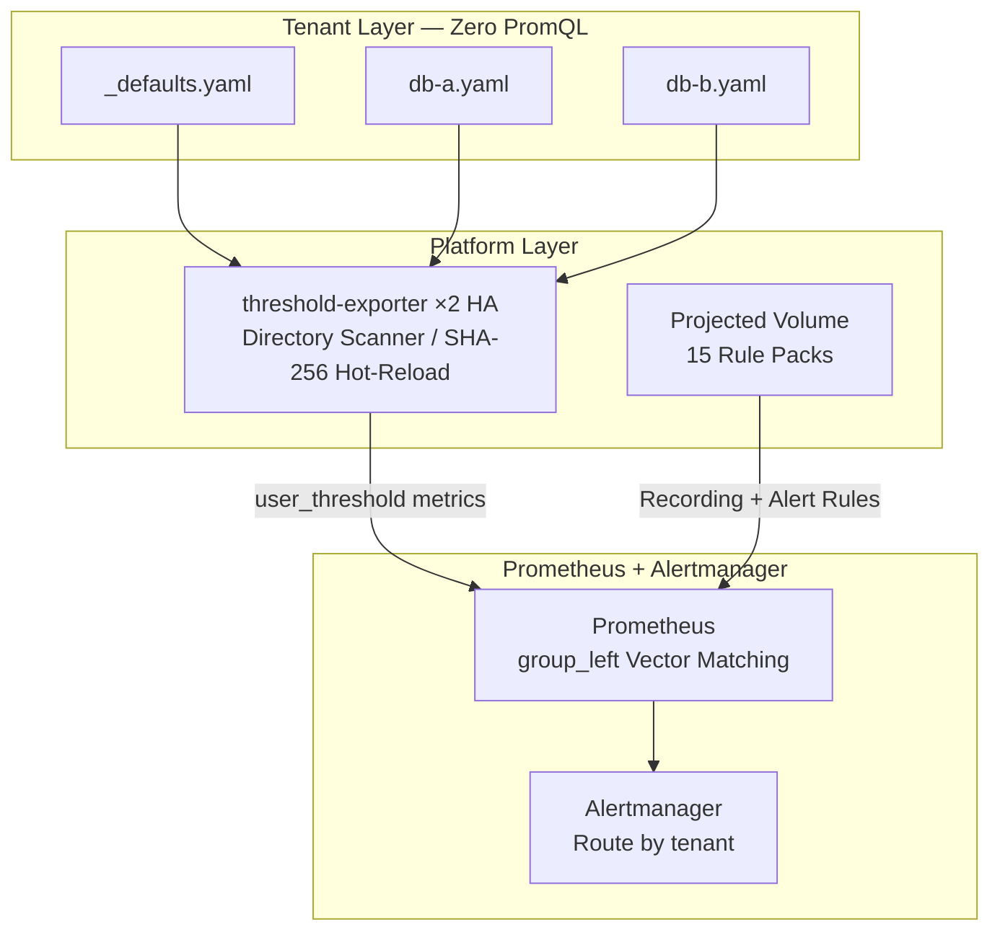

# Dynamic Alerting Integrations

> **Language / 語言：** [English](README.en.md) | **中文（當前）**

     

多租戶環境下，規則膨脹與變更瓶頸是 Prometheus 告警運維的核心痛點。本平台以 config-driven 架構解決：租戶寫 YAML，平台管規則——閾值、路由、通知、維護窗口全配置驅動，規則數不隨租戶增長。

**適用場景：** 管理 10+ 租戶、多技術棧（DB / Cache / MQ / JVM）的平台團隊，需要在 Prometheus 生態中實現租戶自助、統一治理、零 PromQL 門檻的告警管理。

> **不知道從哪裡開始？** 試試 [互動式入門精靈](https://vencil.github.io/Dynamic-Alerting-Integrations/assets/jsx-loader.html?component=../getting-started/wizard.jsx) — 回答幾個問題，取得為你量身打造的閱讀路徑。
>
> 或依角色直接開始：[Platform Engineer](docs/getting-started/for-platform-engineers.md) · [Domain Expert / DBA](docs/getting-started/for-domain-experts.md) · [Tenant Team](docs/getting-started/for-tenants.md)

---

## 為什麼需要這個平台

### 平台團隊：規則膨脹與維護瓶頸

傳統多租戶監控中，每個租戶需要獨立的 PromQL 規則和路由設定。100 個租戶 × 50 條規則 = 5,000 條獨立表達式，各自需要 PR、Review、部署。平台團隊成為所有租戶的變更瓶頸，config drift 隨時間惡化。

本平台透過 `group_left` 向量匹配，將複雜度從 O(N×M) 降為 O(M)——規則數只與 metric 種類相關，與租戶數無關：

```yaml
# 傳統：每個 tenant 一條 rule，N 個 tenant = N 條
- alert: MySQLHighConnections_db-a
  expr: mysql_global_status_threads_connected{namespace="db-a"} > 100

# 動態：1 條 rule 涵蓋所有 tenants
- alert: MariaDBHighConnections
  expr: |
    tenant:mysql_threads_connected:max
    > on(tenant) group_left
    tenant:alert_threshold:connections
```

路由、通知、維護窗口同樣配置驅動。15 個 Rule Pack 透過 Projected Volume 各自獨立維護，團隊間零 PR 衝突。SHA-256 hash 熱重載，變更不需重啟 Prometheus。

### 租戶團隊：PromQL 門檻與變更延遲

租戶最了解自己的業務——什麼連線數正常、什麼延遲可接受。但調整閾值需要 PromQL 知識，每次變更都是 ticket → 平台團隊 → PR → 部署的循環。

本平台讓租戶只寫 YAML：

```yaml
tenants:
  db-a:
    mysql_connections: "100"
    _severity_dedup: true
    _routing:
      default_receiver: { type: webhook, url: "https://hooks.slack.com/..." }
```

`da-tools scaffold` 互動式產生配置，`da-tools validate-config` 本地驗證，變更透過 hot-reload 即時生效。支援排程式閾值（夜間自動放寬）和排程式維護窗口（cron + duration 自動 silence），租戶可自主管理運維節奏。

對於不想碰 YAML 的團隊，tenant-api 提供 REST API 管理平面：透過 Portal UI 瀏覽配置、預覽變更差異、批量操作，所有寫入自動產生 git commit（以操作者身份署名）。API 不可用時 Portal 自動降級為唯讀模式，不影響既有 YAML + GitOps 工作流。

### 領域專家：警報品質與標準化

DBA 和 SRE 需要確保全組織的警報品質與一致性。現實中，規則散落各租戶配置、嚴重度定義不統一、Warning 和 Critical 同時觸發造成通知疲勞，缺乏系統性的覆蓋分析手段。

平台提供：15 個預載 Rule Pack 封裝領域最佳實踐（MariaDB、PostgreSQL、Kafka 等 13 種技術棧）；Severity Dedup 在 Alertmanager inhibit 層自動抑制重複通知（TSDB 保有完整紀錄）；Alert Quality Scoring 量化噪音與陳腐指標；Policy-as-Code 在 CI 層強制執行組織級治理規則。

### 企業整體效益

| 面向 | 傳統方案（100 租戶） | 動態平台（100 租戶） |
|------|---------------------|---------------------|
| 規則評估數 | 9,600（N×M） | 237（固定） |
| Prometheus 記憶體 | ~600MB+ | ~154MB |
| 新租戶導入週期 | 天～週 | 分鐘（scaffold → validate） |
| 閾值變更流程 | Ticket → PR → Deploy | 租戶自助 YAML + Hot-Reload |
| 治理機制 | Ad-hoc Review | Schema Validation + Policy-as-Code + CI |
| 變更審計 | git blame 手動追溯 | API 自動 commit（操作者署名）+ 完整 audit trail |

實測驗證：2→102 租戶，規則評估時間從 59.1ms 到 60.6ms 幾乎不變（[Benchmark §1](docs/benchmarks.md#1-向量匹配複雜度分析)）。

---

## 架構總覽


```mermaid
graph TD
    subgraph TL["Tenant Layer — Zero PromQL"]
        D["_defaults.yaml"]
        T1["db-a.yaml"]
        T2["db-b.yaml"]
    end

    subgraph PL["Platform Layer"]
        TE["threshold-exporter ×2 HA<br/>Directory Scanner / SHA-256 Hot-Reload"]
        RP["Projected Volume<br/>15 Rule Packs"]
    end

    subgraph PE["Prometheus + Alertmanager"]
        PROM["Prometheus<br/>group_left Vector Matching"]
        AM["Alertmanager<br/>Route by tenant"]
    end

    D --> TE
    T1 --> TE
    T2 --> TE
    TE -->|user_threshold metrics| PROM
    RP -->|Recording + Alert Rules| PROM
    PROM --> AM
```

---

## 快速開始

```bash
# 1. VS Code → "Reopen in Container"
# 2. 部署
make setup
# 3. 驗證
make verify
# 4. 故障測試
make test-alert
# 5. 端對端展演
make demo-full
# 6. UI
make port-forward
# Prometheus: localhost:9090 | Grafana: localhost:3000 (admin/admin) | Alertmanager: localhost:9093
```

> **生產部署？** 上述為本地開發環境。生產環境請參考：[Helm + OCI Registry 安裝](components/threshold-exporter/README.md#部署-helm) · [GitOps 部署指南](docs/gitops-deployment.md) · [BYO Prometheus 整合](docs/byo-prometheus-integration.md)

---

## 規則包

15 個 Rule Pack 透過 Projected Volume 預載，各自擁有獨立 ConfigMap（`optional: true`）。未使用的規則包評估成本近乎零（[Benchmark §3](docs/benchmarks.md#3-空向量零成本-empty-vector-zero-cost)）。

| 規則包 | Exporter | Recording | Alert |
|--------|----------|-----------|-------|
| mariadb | mysqld_exporter (Percona) | 11 | 8 |
| postgresql | postgres_exporter | 11 | 9 |
| kubernetes | cAdvisor + kube-state-metrics | 7 | 4 |
| redis | redis_exporter | 11 | 6 |
| mongodb | mongodb_exporter | 10 | 6 |
| elasticsearch | elasticsearch_exporter | 11 | 7 |
| oracle | oracledb_exporter | 11 | 7 |
| db2 | db2_exporter | 12 | 7 |
| clickhouse | clickhouse_exporter | 12 | 7 |
| kafka | kafka_exporter | 13 | 9 |
| rabbitmq | rabbitmq_exporter | 12 | 8 |
| jvm | jmx_exporter | 9 | 7 |
| nginx | nginx-prometheus-exporter | 9 | 6 |
| operational | threshold-exporter 運營模式 | 0 | 4 |
| platform | threshold-exporter 自監控 | 0 | 4 |
| **合計** | | **139** | **99** |

詳見 [規則包目錄](rule-packs/README.md) · [Alert 速查](rule-packs/ALERT-REFERENCE.md)

---

## 工具生態

所有工具封裝在 `da-tools` 容器中（`docker run --rm ghcr.io/vencil/da-tools`），不需 clone 專案或安裝依賴。互動工具 Portal 另有獨立 image（`docker run -p 8080:80 ghcr.io/vencil/da-portal`），支援企業內網 / air-gapped 部署。

**租戶生命週期：** `scaffold_tenant` 配置產生 → `onboard_platform` 既有環境分析 → `migrate_rule` AST 遷移引擎 → `validate_migration` Shadow 雙軌驗證 → `cutover_tenant` 一鍵切換 → `offboard_tenant` 安全下架

**日常運維：** `diagnose` / `batch_diagnose` 健康檢查 · `patch_config` 安全更新（含 `--diff`）· `check_alert` 警報狀態 · `maintenance_scheduler` 排程維護 · `generate_alertmanager_routes` 路由產生 · `explain_route` 路由偵錯（ADR-007）

**採用管線（v2.2.0）：** `init` 專案骨架產生（CI/CD + conf.d + Kustomize）· `config_history` 配置快照與歷史追蹤 · `gitops-check` GitOps Native Mode 驗證 · `demo-showcase` 5-tenant 展演腳本 · [Hands-on Lab](docs/scenarios/hands-on-lab.md) 實戰教程 · [漸進式遷移 Playbook](docs/scenarios/incremental-migration-playbook.md) 四階段零停機遷移

**路由設定檔與域策略（v2.1.0 ADR-007）：** `_routing_profiles.yaml` 定義跨租戶共用路由配置，`_domain_policy.yaml` 定義業務域合規約束。四層合併：`_routing_defaults` → profile → tenant `_routing` → `_routing_enforced`。工具：`check_routing_profiles`（lint hook）· `explain_route`（偵錯）· JSON Schema 驗證

**品質與治理：** `validate_config` 一站式驗證 · `alert_quality` 告警品質評分 · Policy-as-Code 引擎 · `cardinality_forecast` 趨勢預測 · `backtest_threshold` 歷史回測 · `baseline_discovery` 閾值建議 · `config_diff` 配置差異

完整 CLI 參考：[da-tools CLI](docs/cli-reference.md) · [速查表](docs/cheat-sheet.md)

---

## 關鍵設計決策

| 決策 | 說明 | ADR |
|------|------|-----|
| O(M) 規則複雜度 | `group_left` 向量匹配，規則數只與 metric 種類相關，與租戶數無關 | — |
| TSDB 完整性優先 | Severity Dedup 在 Alertmanager inhibit 層實現，TSDB 保有完整 warning + critical 紀錄 | [ADR-001](docs/adr/001-severity-dedup-via-inhibit.md) |
| Sentinel Alert 三態控制 | exporter flag → sentinel alert → inhibit，可組合的 Normal / Silent / Maintenance 模式 | [ADR-003](docs/adr/003-sentinel-alert-pattern.md) |
| Projected Volume 隔離 | 15 個 Rule Pack ConfigMap 各自獨立（`optional: true`），零 PR 衝突 | [ADR-005](docs/adr/005-projected-volume-for-rule-packs.md) |
| Config-Driven 全鏈路 | 閾值 → 路由 → 通知 → 行為控制，全部 YAML 驅動 | — |
| 四層路由合併 | `_routing_defaults` → profile → tenant `_routing` → `_routing_enforced`，跨租戶共用 + 域策略約束 | [ADR-007](docs/adr/007-cross-domain-routing-profiles.md) |
| 安全護欄內建 | Webhook Domain Allowlist · Schema Validation · Cardinality Guard（per-tenant 500 上限） | — |

---

## 文件導覽

| 文件 | 說明 |
|------|------|
| [架構與設計](docs/architecture-and-design.md) | 核心設計、HA、Rule Pack 架構 |
| 快速入門（按角色） | [Platform Engineer](docs/getting-started/for-platform-engineers.md) · [Domain Expert](docs/getting-started/for-domain-experts.md) · [Tenant](docs/getting-started/for-tenants.md) |
| [遷移指南](docs/migration-guide.md) | 導入流程、AST 引擎、Shadow Monitoring |
| [BYO Prometheus](docs/byo-prometheus-integration.md) | 整合既有 Prometheus/Thanos |
| [BYO Alertmanager](docs/byo-alertmanager-integration.md) | Alertmanager 整合與動態 Routing |
| [Federation](docs/federation-integration.md) | 多叢集架構藍圖 |
| [GitOps 部署](docs/gitops-deployment.md) | ArgoCD/Flux 工作流 |
| [客製化規則治理](docs/custom-rule-governance.md) | 三層治理模型、CI Linting |
| [Shadow Monitoring SOP](docs/shadow-monitoring-sop.md) | 雙軌並行完整 SOP |
| [性能基準](docs/benchmarks.md) | 完整 benchmark 數據與方法論 |
| [場景指南](docs/scenarios/) | Alert Routing · Shadow Cutover · Federation · Tenant Lifecycle · GitOps CI/CD · Hands-on Lab |
| Day-2 運維 | `diagnose` → `alert-quality` → `patch-config` → `maintenance-scheduler`（[CLI 參考](docs/cli-reference.md)） |

完整文件對照表：[doc-map.md](docs/internal/doc-map.md) · 工具表：[tool-map.md](docs/internal/tool-map.md