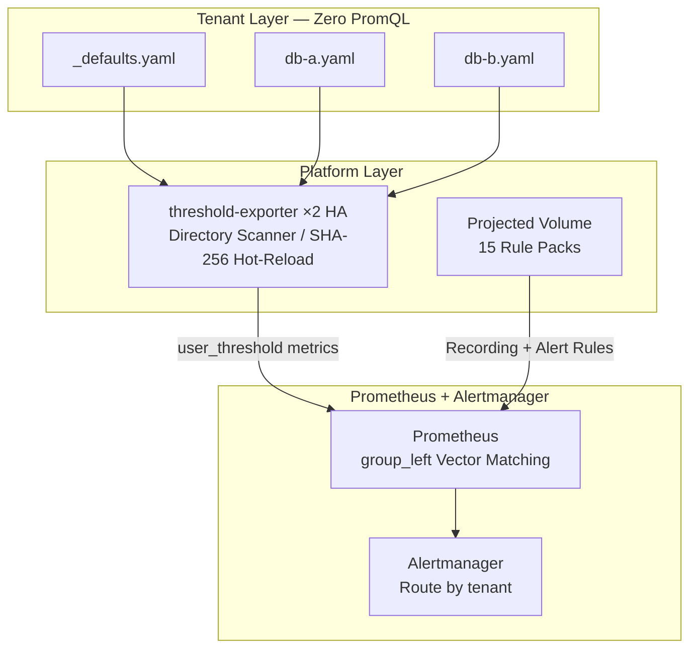

# Dynamic Alerting Integrations

> **Language / 語言：** [English](README.en.md) | **中文（當前）**

  

多租戶動態警報平台 — 配置驅動閾值管理、15 個預載規則包、租戶零 PromQL、三態運營模式、HA 部署。

---

## 核心問題與解法

> **Before：** N tenants × M rules = N×M 條 PromQL，每個 tenant 手寫規則、獨立 PR、獨立路由設定。
> **After：** 固定 238 條規則（不隨租戶數增長），租戶只寫 YAML，閾值 → 路由 → 通知 → 維護窗口全配置驅動。

### 規則膨脹

傳統做法中，100 個租戶 × 50 條規則 = 5,000 次獨立 PromQL 評估。本平台透過 `group_left` 向量匹配，維護固定 M 條規則，Prometheus 一次評估即匹配所有租戶閾值。複雜度從 O(N×M) 降為 O(M)。

```yaml
# 傳統：每個 tenant 一條 rule
- alert: MySQLHighConnections_db-a
  expr: mysql_global_status_threads_connected{namespace="db-a"} > 100

# 動態：1 條 rule 涵蓋所有 tenants
- alert: MariaDBHighConnections
  expr: |
    tenant:mysql_threads_connected:max
    > on(tenant) group_left
    tenant:alert_threshold:connections
```

租戶只寫 YAML，不需 PromQL：

```yaml
tenants:
  db-a:
    mysql_connections: "100"
  db-b:
    mysql_connections: "80"
```

### 租戶導入成本

所有工具封裝在 `da-tools` 容器中，`docker pull` 即用，不需 clone 專案或安裝依賴。`da-tools scaffold` 互動式產生配置，`da-tools migrate` 自動轉換舊規則（AST 引擎）。

```bash
docker run --rm -it ghcr.io/vencil/da-tools scaffold --tenant my-app --db mariadb,redis
```

### 警報疲勞

內建維護模式（抑制所有警報）、Silent 模式（保留 TSDB 紀錄但攔截通知）、排程式維護窗口（cron + duration 自動 silence）、多層嚴重度搭配 Severity Dedup（Critical 觸發時抑制 Warning 通知）、排程式閾值（夜間自動放寬）。

### 部署與維護

15 個獨立 Rule Pack ConfigMap 透過 Projected Volume 掛載，各團隊獨立維護。SHA-256 hash 熱重載，不需重啟 Prometheus。Helm chart 發佈至 OCI registry，一行指令完成安裝：

```bash
helm install threshold-exporter \
  oci://ghcr.io/vencil/charts/threshold-exporter --version 1.9.0 \
  -n monitoring --create-namespace -f values-override.yaml
```

### 舊規則遷移

`migrate_rule.py` 搭載 AST 遷移引擎（`promql-parser` Rust PyO3），自動轉換既有 PromQL 規則。Shadow Monitoring 雙軌並行驗證遷移前後數值一致（容差 ≤ 5%），支援自動穩態偵測。

---

## 架構總覽


```mermaid
graph TD
    subgraph TL["Tenant Layer — Zero PromQL"]
        D["_defaults.yaml"]
        T1["db-a.yaml"]
        T2["db-b.yaml"]
    end

    subgraph PL["Platform Layer"]
        TE["threshold-exporter ×2 HA<br/>Directory Scanner / SHA-256 Hot-Reload"]
        RP["Projected Volume<br/>15 Rule Packs"]
    end

    subgraph PE["Prometheus + Alertmanager"]
        PROM["Prometheus<br/>group_left Vector Matching"]
        AM["Alertmanager<br/>Route by tenant"]
    end

    D --> TE
    T1 --> TE
    T2 --> TE
    TE -->|user_threshold metrics| PROM
    RP -->|Recording + Alert Rules| PROM
    PROM --> AM
```

---

## 快速開始

```bash
# 1. VS Code → "Reopen in Container"
# 2. 部署
make setup
# 3. 驗證
make verify
# 4. 故障測試
make test-alert
# 5. 端對端展演
make demo-full
# 6. UI
make port-forward
# Prometheus: localhost:9090 | Grafana: localhost:3000 (admin/admin) | Alertmanager: localhost:9093
```

---

## 規則包

15 個 Rule Pack 透過 Projected Volume 預載，各自擁有獨立 ConfigMap（`optional: true`）。未使用的規則包評估成本近乎零。

| 規則包 | Exporter | Recording | Alert |
|--------|----------|-----------|-------|
| mariadb | mysqld_exporter (Percona) | 11 | 8 |
| postgresql | postgres_exporter | 11 | 9 |
| kubernetes | cAdvisor + kube-state-metrics | 7 | 4 |
| redis | redis_exporter | 11 | 6 |
| mongodb | mongodb_exporter | 10 | 6 |
| elasticsearch | elasticsearch_exporter | 11 | 7 |
| oracle | oracledb_exporter | 11 | 7 |
| db2 | db2_exporter | 12 | 7 |
| clickhouse | clickhouse_exporter | 12 | 7 |
| kafka | kafka_exporter | 13 | 9 |
| rabbitmq | rabbitmq_exporter | 12 | 8 |
| jvm | jmx_exporter | 9 | 7 |
| nginx | nginx-prometheus-exporter | 9 | 6 |
| operational | threshold-exporter 運營模式 | 0 | 4 |
| platform | threshold-exporter 自監控 | 0 | 4 |
| **合計** | | **139** | **99** |

詳見 [規則包目錄](rule-packs/README.md) · [Alert 速查](rule-packs/ALERT-REFERENCE.md)

---

## 工具

所有工具可透過 `da-tools` 容器執行（`docker run --rm ghcr.io/vencil/da-tools`），或在已 clone 的環境中直接用 `python3 scripts/tools/<tool>.py`。

**運維工具：**
`scaffold_tenant` 新租戶配置產生 · `onboard_platform` 既有配置反向分析 · `migrate_rule` AST 遷移引擎 · `validate_migration` Shadow Monitoring 驗證 · `cutover_tenant` 一鍵切換 · `batch_diagnose` 多租戶健康報告 · `patch_config` 安全局部更新（含 `--diff` preview）· `diagnose` 單租戶檢查 · `check_alert` 警報狀態查詢 · `baseline_discovery` 負載觀測閾值建議 · `backtest_threshold` 歷史回測 · `analyze_rule_pack_gaps` 覆蓋分析 · `offboard_tenant` 安全下架 · `deprecate_rule` 規則下架 · `generate_alertmanager_routes` 路由產生 · `validate_config` 一站式驗證 · `config_diff` 配置差異比對 · `maintenance_scheduler` 排程維護 · `blind_spot_discovery` 盲區掃描

**DX Automation：**
`shadow_verify` Shadow Monitoring 自動驗證 · `byo_check` BYO 整合檢查 · `federation_check` Federation 驗證 · `grafana_import` Dashboard 匯入

完整 CLI 參考：[da-tools CLI](docs/cli-reference.md) · [速查表](docs/cheat-sheet.md)

---

## 文件導覽

| 文件 | 說明 |
|------|------|
| [架構與設計](docs/architecture-and-design.md) | 核心設計、HA、Rule Pack 架構 |
| [快速入門（按角色）](docs/getting-started/) | Platform Engineers · Domain Experts · Tenants |
| [遷移指南](docs/migration-guide.md) | 導入流程、AST 引擎、Shadow Monitoring |
| [BYO Prometheus](docs/byo-prometheus-integration.md) | 整合既有 Prometheus/Thanos |
| [BYO Alertmanager](docs/byo-alertmanager-integration.md) | Alertmanager 整合與動態 Routing |
| [Federation](docs/federation-integration.md) | 多叢集架構藍圖 |
| [GitOps 部署](docs/gitops-deployment.md) | ArgoCD/Flux 工作流 |
| [客製化規則治理](docs/custom-rule-governance.md) | 三層治理模型、CI Linting |
| [Shadow Monitoring SOP](docs/shadow-monitoring-sop.md) | 雙軌並行完整 SOP |
| [場景指南](docs/scenarios/) | Alert Routing · Shadow Cutover · Federation · Tenant Lifecycle |

完整文件對照表：[doc-map.md](docs/internal/doc-map.md) · 工具表：[tool-map.md](docs/internal/tool-map.md)

---

## 前置需求

- [Docker Engine](https://docs.docker.com/engine/install/) 或 Docker Desktop
- [kubectl](https://kubernetes.io/docs/tasks/tools/)
- （建議）VS Code + [Dev Containers extension](https://marketplace.visualstudio.com/items?itemName=ms-vscode-remote.remote-containers)

---

## 關鍵設計決策

- **O(M) 規則複雜度**：`group_left` 向量匹配，規則數只與 metric 種類相關，與租戶數無關
- **TSDB 完整性優先**：Severity Dedup 在 Alertmanager inhibit 層實現，TSDB 保有完整 warning + critical 紀錄
- **Projected Volume 隔離**：15 個 Rule Pack ConfigMap 各自獨立（`optional: true`），零 PR 衝突
- **Config-Driven 全鏈路**：閾值 → 路由 → 通知 → 行為控制，全部 YAML 驅動
- **雙端一致性**：Go exporter 與 Python 工具共用相同常數與驗證邏輯
- **安全護欄內建**：Webhook Domain Allowlist（防 SSRF）、Schema Validation（防 typo）、Cardinality Guard（防 metric 爆炸）

---

## License

MIT
