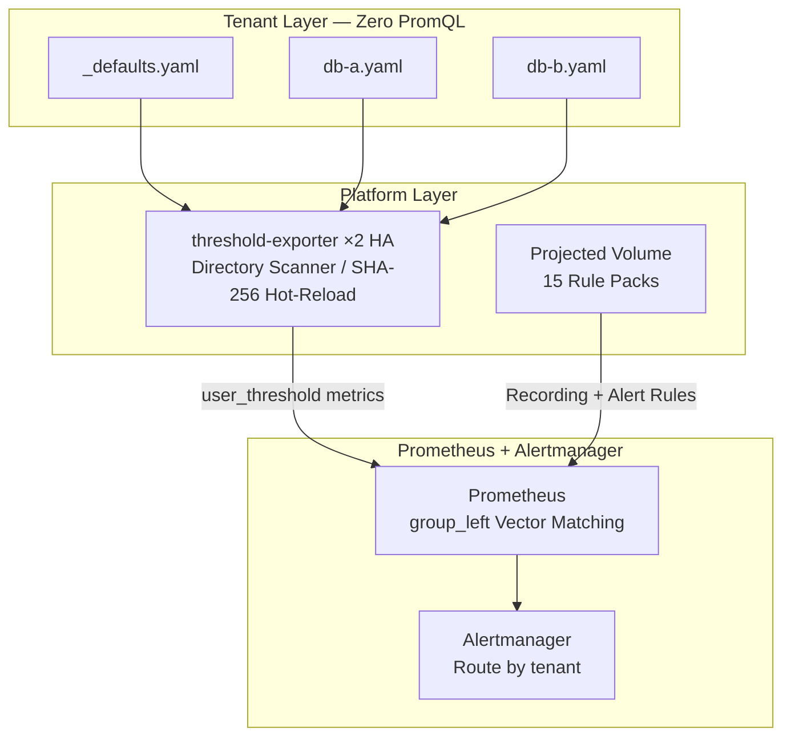

# Dynamic Alerting Integrations

> **Language / 語言：** [English](README.en.md) | **中文（當前）**

Config-driven 多租戶告警平台，基於 Prometheus `group_left` 向量匹配。

> **100 租戶的監控管理：從 5,000 條手寫規則 → 237 條固定規則。**
> 租戶只寫 YAML，不碰 PromQL。新租戶分鐘級導入，變更秒級生效。

     

---

## 核心指標

| 指標 | 傳統方案（100 租戶） | Dynamic Alerting |
|------|---------------------|-----------------|
| 規則數量 | 5,000+（隨租戶線性增長） | 237（固定，O(M)） |
| 新租戶導入 | 1–3 天（PR → Review → Deploy） | < 5 分鐘（scaffold → validate → reload） |
| Prometheus 記憶體 | ~600MB+ | ~154MB |
| 規則評估時間 | 隨租戶線性增長 | 60ms（2 或 102 租戶皆同，[Benchmark](docs/benchmarks.md#1-向量匹配複雜度分析)） |
| 租戶所需知識 | PromQL + Alertmanager 配置 | YAML 閾值設定 |

---

## 架構總覽


```mermaid
graph TD
    subgraph TL["Tenant Layer — Zero PromQL"]
        D["_defaults.yaml"]
        T1["db-a.yaml"]
        T2["db-b.yaml"]
    end

    subgraph PL["Platform Layer"]
        TE["threshold-exporter ×2 HA<br/>Directory Scanner / SHA-256 Hot-Reload"]
        RP["Projected Volume<br/>15 Rule Packs"]
    end

    subgraph PE["Prometheus + Alertmanager"]
        PROM["Prometheus<br/>group_left Vector Matching"]
        AM["Alertmanager<br/>Route by tenant"]
    end

    D --> TE
    T1 --> TE
    T2 --> TE
    TE -->|user_threshold metrics| PROM
    RP -->|Recording + Alert Rules| PROM
    PROM --> AM
```

15 個 Rule Pack 涵蓋 MySQL、PostgreSQL、Redis、Kafka 等 13 種技術棧，透過 Projected Volume 獨立部署（`optional: true`），未使用的規則包評估成本近乎零。詳見 [規則包目錄](rule-packs/README.md) · [Alert 速查](rule-packs/ALERT-REFERENCE.md)

---

## Before / After

```yaml
# 傳統：每個租戶一套規則，100 租戶 = 5,000 條表達式
- alert: MySQLHighConnections_db-a
  expr: mysql_global_status_threads_connected{namespace="db-a"} > 100
# ... × 100 租戶 × 50 條規則

# Dynamic Alerting：單一規則覆蓋所有租戶
- alert: MariaDBHighConnections
  expr: tenant:mysql_threads_connected:max > on(tenant) group_left tenant:alert_threshold:connections
# 租戶只需宣告閾值：db-a: { mysql_connections: "100" }
```

完整對比範例（含 Alertmanager 路由）見 [Config-Driven 設計](docs/architecture-and-design.md#2-核心設計config-driven-架構)。

---

## 專案結構導覽

| 目錄 | 內容 | 何時會來這裡 |
|------|------|--------------|
| [`components/`](components/) | 各元件程式碼：`threshold-exporter`（Go）、`tenant-api`（Go）、`da-tools`（Python CLI）、`da-portal`（前端容器）、`backstage-plugin`（TS） | 改應用程式邏輯 |
| [`helm/`](helm/) | Helm charts：`da-portal`、`tenant-api`、`mariadb-instance`；values 檔 `values-db-*.yaml` | 調整部署與 chart 模板 |
| [`k8s/`](k8s/) | 原生 K8s manifests：namespaces、monitoring（Prometheus/Alertmanager/Grafana）、tenant-api、CRD | 部署示範環境 |
| [`rule-packs/`](rule-packs/) | 15 份 Rule Pack 來源 YAML（`rule-pack-<tech>.yaml`）+ [ALERT-REFERENCE](rule-packs/ALERT-REFERENCE.md) | 新增/修改告警規則 |
| [`policies/`](policies/) | OPA Rego 政策範例（naming、routing、threshold-bounds） | 治理層規則 |
| [`environments/`](environments/) | CI / local 環境 profile | 跨環境差異配置 |
| [`scripts/`](scripts/) | Shell 進入點 + `scripts/tools/{ops,dx,lint}` 下 97 個 Python 工具 | 跑工具、lint、開發者體驗 |
| [`tests/`](tests/) | Python pytest（`test_*.py`）、shell scenario（`scenario-*.sh`）、`e2e/` Playwright、`snapshots/` | 跑測試、加測試 |
| [`docs/`](docs/) | 145 份文件（雙語），對照表見 [doc-map](docs/internal/doc-map.md) | 讀設計/整合/運維文件 |
| [`operator-output/`](operator-output/) | `operator_generate.py` 產出的 PrometheusRule 範例（14 個 rule-pack） | 參考 operator 模式的輸出樣板 |
| [`CLAUDE.md`](CLAUDE.md) | AI Agent 起手式與任務分流表 | agent session 開始前必讀 |
| [`docs/internal/`](docs/internal/) | 內部 playbook（testing / benchmark / windows-mcp / github-release）與 maps | 排錯、release、跑 benchmark |

> 新人路徑：`README.md` → [`docs/getting-started/`](docs/getting-started/) → 決定 BYO / Operator → 對應整合手冊。
> Agent 路徑：`CLAUDE.md` → 任務分流表 → 對應 playbook。

---

## 開始使用

### 本地體驗（5 分鐘）

```bash
# VS Code → "Reopen in Container"
make setup && make verify && make test-alert
# Prometheus: localhost:9090 | Grafana: localhost:3000 | Alertmanager: localhost:9093
```

### 生產部署

| 環境 | 推薦路徑 | 指南 |
|------|---------|------|
| 已有 Prometheus Operator | Helm + `rules.mode=operator` | [Operator 整合](docs/prometheus-operator-integration.md) |
| 自管 Prometheus | Helm + ConfigMap | [BYO Prometheus](docs/byo-prometheus-integration.md) |
| GitOps（ArgoCD / Flux） | Helm + Git repo | [GitOps 部署](docs/gitops-deployment.md) |
| 不確定？ | 互動式決策矩陣 | [Decision Matrix](docs/getting-started/decision-matrix.md) |

所有路徑均支援 [OCI Registry 安裝](components/threshold-exporter/README.md#部署-helm)。

### 按角色入門

- **Platform Engineer** — 架構部署與運維 → [Getting Started](docs/getting-started/for-platform-engineers.md)
- **Domain Expert** — Rule Pack 客製與品質治理 → [Getting Started](docs/getting-started/for-domain-experts.md)
- **Tenant** — 閾值配置與自助管理 → [Getting Started](docs/getting-started/for-tenants.md)
- **不確定角色？** → [Getting Started Wizard](https://vencil.github.io/Dynamic-Alerting-Integrations/assets/jsx-loader.html?component=../getting-started/wizard.jsx)

---

## 部署層級

### Tier 1：Git-Native（GitOps 優先）

100% Git 可追蹤的純 YAML 工作流。租戶配置 → `da-tools validate-config` 本地驗證 → git commit → ArgoCD/Flux 自動部署 → SHA-256 hot-reload 秒級生效。

適用：GitOps-native 團隊、配置變更頻率低中等、租戶熟悉 YAML。

### Tier 2：Portal + API（UI 管理）

Tier 1 的全部，加上 REST API 管理平面（RBAC）、da-portal UI（配置瀏覽、變更預覽、批量操作）、OAuth2 認證。API 不可用時 Portal 自動降級為唯讀，不影響 GitOps 工作流。

適用：大量租戶（20+）、高頻閾值調整、需要 UI 自助或 REST API 自動化、合規審計需求。

### 工作流對比

| 流程 | Tier 1（Git-Native） | Tier 2（Portal + API） |
|------|---------------------|------------------------|
| 新租戶導入 | `scaffold` → git commit → deploy（分鐘） | UI 點選 → API → git commit → deploy（分鐘） |
| 閾值調整 | 編輯 YAML → commit → hot-reload（秒） | UI 編輯 → Save → hot-reload（秒） |
| 批量變更 | 指令碼 / `patch_config` | Portal 多選 → 批量編輯 → 單鍵提交 |
| 變更審計 | git blame + log | git log + API audit trail |
| RBAC | Git 層（branch protection） | API 層（OIDC + 細粒度權限） |
| 降級機制 | N/A | Portal 轉唯讀，YAML 工作流不中斷 |

---

## 平台能力

### 規則引擎

O(M) 複雜度（`group_left` 向量匹配）· 15 個 Rule Pack Projected Volume 獨立部署 · Severity Dedup via Alertmanager Inhibit（[ADR-001](docs/adr/001-severity-dedup-via-inhibit.md)）· Sentinel Alert 三態控制（[ADR-003](docs/adr/003-sentinel-alert-pattern.md)）

### 租戶管理

三態模式（Normal / Silent / Maintenance，支援 `expires` 自動失效）· 四層路由合併：`_routing_defaults` → profile → tenant → enforced（[ADR-007](docs/adr/007-cross-domain-routing-profiles.md)）· 排程式閾值與維護窗口 · Schema Validation 雙端驗證 · Cardinality Guard（per-tenant 500 上限）

### 工具鏈（da-tools CLI）

| 類別 | 工具 |
|------|------|
| 租戶生命週期 | `scaffold` 配置產生 · `onboard` 環境分析 · `migrate-rule` AST 遷移 · `validate-migration` 雙軌驗證 · `cutover` 切換 · `offboard` 下架 |
| 日常運維 | `diagnose` 健康檢查 · `patch-config` 安全更新 · `check-alert` 警報狀態 · `maintenance-scheduler` 排程維護 · `explain-route` 路由偵錯 |
| 品質治理 | `validate-config` 一站式驗證 · `alert-quality` 品質評分 · Policy-as-Code · `cardinality-forecast` 趨勢預測 · `backtest-threshold` 歷史回測 |
| 採用加速 | `init` 專案骨架 · `config-history` 快照追蹤 · `gitops-check` GitOps 驗證 · `demo-showcase` 展演腳本 |

所有工具封裝在 `da-tools` 容器（`docker run --rm ghcr.io/vencil/da-tools`）。完整 CLI 參考：[da-tools CLI](docs/cli-reference.md) · [速查表](docs/cheat-sheet.md) · [互動工具索引](docs/interactive-tools.md)

---

## 關鍵設計決策

| 決策 | 說明 | ADR |
|------|------|-----|
| O(M) 規則複雜度 | `group_left` 向量匹配，規則數只與 metric 種類相關 | — |
| TSDB 完整性優先 | Severity Dedup 在 Alertmanager inhibit 層，TSDB 保有完整紀錄 | [ADR-001](docs/adr/001-severity-dedup-via-inhibit.md) |
| Projected Volume 隔離 | 15 個 Rule Pack ConfigMap 獨立部署，零 PR 衝突 | [ADR-005](docs/adr/005-projected-volume-for-rule-packs.md) |
| Config-Driven 全鏈路 | 閾值 → 路由 → 通知 → 行為控制，全部 YAML 驅動 | — |
| 四層路由合併 | defaults → profile → tenant → enforced + 域策略約束 | [ADR-007](docs/adr/007-cross-domain-routing-profiles.md) |
| 安全護欄內建 | Webhook Domain Allowlist · Schema Validation · Cardinality Guard | — |

完整 ADR 索引：[docs/adr/](docs/adr/README.md)

---

## 文件導覽

| 文件 | 說明 |
|------|------|
| [架構與設計](docs/architecture-and-design.md) | 核心設計、HA、Rule Pack 架構 |
| 快速入門（按角色） | [Platform Engineer](docs/getting-started/for-platform-engineers.md) · [Domain Expert](docs/getting-started/for-domain-experts.md) · [Tenant](docs/getting-started/for-tenants.md) |
| [遷移指南](docs/migration-guide.md) | 導入流程、AST 引擎、Shadow Monitoring |
| 整合指南 | [BYO Prometheus](docs/byo-prometheus-integration.md) · [BYO Alertmanager](docs/byo-alertmanager-integration.md) · [Federation](docs/federation-integration.md) · [GitOps](docs/gitops-deployment.md) |
| [客製化規則治理](docs/custom-rule-governance.md) | 三層治理模型、CI Linting |
| [性能基準](docs/benchmarks.md) | Benchmark 數據與方法論 |
| [場景指南](docs/scenarios/) | 9 個實戰場景（Routing · Shadow · Federation · Lifecycle · GitOps · Lab） |
| Day-2 運維 | [CLI 參考](docs/cli-reference.md) · [速查表](docs/cheat-sheet.md) |

完整文件對照表：[doc-map.md](docs/internal/doc-map.md) · 工具表：[tool-map.md](docs/internal/tool-map.md)
