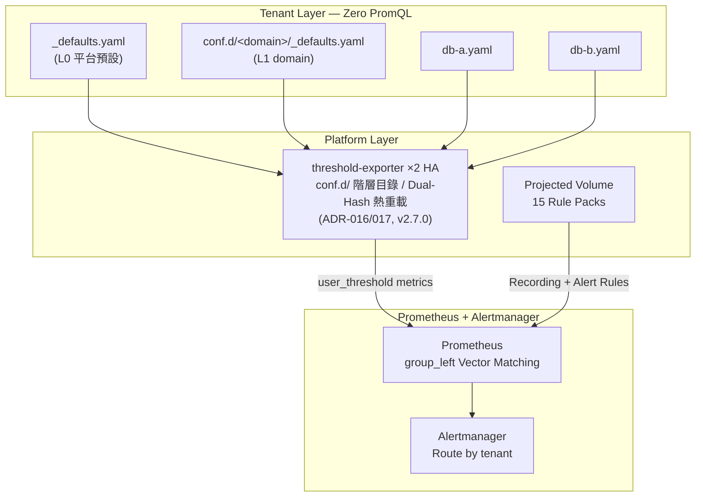

# Dynamic Alerting Integrations

> **Language / 語言：** [English](README.en.md) | **中文（當前）**

Config-driven 多租戶告警平台，基於 Prometheus `group_left` 向量匹配。

> **100 租戶的監控管理：從 5,000 條手寫規則 → 237 條固定規則。**
> 租戶只寫 YAML、不碰 PromQL —— 連自訂告警都用參數化 recipe 自助產出（v2.9.0 **Custom Alerts**）。新租戶**設定**分鐘級（rule-pack 已涵蓋的指標）、變更秒級生效；遷移既有複雜告警（自訂 exporter / 拓樸指標）視形態而定，見[遷移指南](docs/migration-guide.md)。

     

---

**第一次來？依你的狀況選起點：**

| 你的狀況 | 從這裡開始 |
|---------|-----------|
| 想 30 秒搞懂這是什麼、解決什麼 | 下方 [核心指標](#核心指標) → [架構總覽](#架構總覽) |
| **我是主管 / 決策者，想看商業價值與風險** | [決策者評估指南](docs/getting-started/for-decision-makers.md)（一頁：價值 + 證據 / 適配 / 成熟度 / 下一步） |
| 評估技術是否適合我的環境 | [決策矩陣](docs/getting-started/decision-matrix.md) · [整合指南](docs/integration/README.md) |
| 想在筆電上 1 分鐘試玩（免 Kubernetes） | [在本機試用](#在本機試用) |
| 準備部署到自己的叢集 | [按角色入門](#按角色入門) · [整合指南](docs/integration/README.md) |
| **已熟悉，要找特定場景 / 生命週期階段** | [場景指南（14 個）](docs/scenarios/) · [遷移路徑](#文件導覽) · [Day-2 運維](#文件導覽) |
| 已上線，找日常運維 / 排錯 | [CLI 參考](docs/cli-reference.md) · [故障排查](docs/troubleshooting.md) |

---

## 核心指標

| 指標 | 傳統方案（100 租戶） | Dynamic Alerting |
|------|---------------------|-----------------|
| 規則數量 | 5,000+（隨租戶線性增長） | 237（固定，O(M)） |
| 新租戶**設定**（rule-pack 涵蓋的指標） | 1–3 天（PR → Review → Deploy） | < 5 分鐘（scaffold → validate → reload） |
| Prometheus 記憶體 | ~600MB+ | ~154MB |
| 規則評估時間 | 隨租戶線性增長 | 60ms（2 或 102 租戶皆同，[Benchmark](docs/benchmarks.md#11-平台規則為什麼與租戶數無關om)） |
| 租戶所需知識 | PromQL + Alertmanager 配置 | YAML 閾值設定 |

---

## 架構總覽


```mermaid
graph TD
    subgraph TL["Tenant Layer — Zero PromQL"]
        D["_defaults.yaml<br/>(L0 平台預設)"]
        DOM["conf.d/&lt;domain&gt;/_defaults.yaml<br/>(L1 domain)"]
        T1["db-a.yaml"]
        T2["db-b.yaml"]
    end

    subgraph PL["Platform Layer"]
        TE["threshold-exporter ×2 HA<br/>conf.d/ 階層目錄 / Dual-Hash 熱重載<br/>(ADR-016/017, v2.7.0)"]
        RP["Projected Volume<br/>15 Rule Packs"]
    end

    subgraph PE["Prometheus + Alertmanager"]
        PROM["Prometheus<br/>group_left Vector Matching"]
        AM["Alertmanager<br/>Route by tenant"]
    end

    D --> TE
    DOM --> TE
    T1 --> TE
    T2 --> TE
    TE -->|user_threshold metrics| PROM
    RP -->|Recording + Alert Rules| PROM
    PROM --> AM
```

15 個 Rule Pack 涵蓋 MySQL、PostgreSQL、Redis、Kafka 等 13 種技術棧，透過 Projected Volume 獨立部署（`optional: true`），未使用的規則包評估成本近乎零。詳見 [規則包目錄](rule-packs/README.md) · [Alert 速查](rule-packs/ALERT-REFERENCE.md)

---

## Before / After

```yaml
# 傳統：每個租戶一套規則，100 租戶 = 5,000 條表達式
- alert: MySQLHighConnections_db-a
  expr: mysql_global_status_threads_connected{namespace="db-a"} > 100
# ... × 100 租戶 × 50 條規則

# Dynamic Alerting：單一規則覆蓋所有租戶
- alert: MariaDBHighConnections
  expr: tenant:mysql_threads_connected:max > on(tenant) group_left tenant:alert_threshold:mysql_connections
# 租戶只需宣告閾值：db-a: { mysql_connections: "100" }
```

完整對比範例（含 Alertmanager 路由）見 [Config-Driven 設計](docs/architecture-and-design.md#2-核心設計config-driven-架構)。

---

## 專案結構導覽

| 目錄 | 內容 | 何時會來這裡 |
|------|------|--------------|
| [`components/`](components/) | 各元件程式碼：`threshold-exporter`（Go）、`tenant-api`（Go）、`da-tools`（Python CLI）、`da-portal`（前端容器） | 改應用程式邏輯 |
| [`helm/`](helm/) | Helm charts：`da-portal`、`tenant-api`、`mariadb-instance`；values 檔 `values-db-*.yaml` | 調整部署與 chart 模板 |
| [`k8s/`](k8s/) | 原生 K8s manifests：namespaces、monitoring（Prometheus/Alertmanager/Grafana）、tenant-api、CRD | 部署示範環境 |
| [`rule-packs/`](rule-packs/) | 15 份 Rule Pack 來源 YAML（`rule-pack-<tech>.yaml`）+ [ALERT-REFERENCE](rule-packs/ALERT-REFERENCE.md) | 新增/修改告警規則 |
| [`policies/`](policies/) | OPA Rego 政策範例（naming、routing、threshold-bounds） | 治理層規則 |
| [`environments/`](environments/) | CI / local 環境 profile | 跨環境差異配置 |
| [`scripts/`](scripts/) | Shell 進入點 + `scripts/tools/{ops,dx,lint}` 下 180 個 Python 工具 | 跑工具、lint、開發者體驗 |
| [`tests/`](tests/) | Python pytest（`test_*.py`）、shell scenario（`scenario-*.sh`）、`e2e/` Playwright、`snapshots/` | 跑測試、加測試 |
| [`docs/`](docs/) | 198 份公開文件（77 雙語 pair），對照表見 [doc-map](docs/internal/doc-map.md)；另有 internal playbook/planning 文件不入 catalog | 讀設計/整合/運維文件 |
| [`operator-manifests/`](operator-manifests/) | `operator_generate.py` 產出的 PrometheusRule 範例（14 個 rule-pack） | 參考 operator 模式的輸出樣板 |
| [`CLAUDE.md`](CLAUDE.md) | AI Agent 起手式與任務分流表 | agent session 開始前必讀 |
| [`docs/internal/`](docs/internal/) | 內部 playbook（testing / benchmark / windows-mcp / github-release）與 maps | 排錯、release、跑 benchmark |

> 新人路徑：`README.md` → [`docs/getting-started/`](docs/getting-started/) → 決定 BYO / Operator → 對應整合手冊。
> Agent 路徑：`CLAUDE.md` → 任務分流表 → 對應 playbook。

---

## 在本機試用

一行指令把整個平台跑在筆電上，~1 分鐘看到真實告警亮紅燈 —— 不需 Kubernetes、不需註冊。

[](https://github.com/vencil/Dynamic-Alerting-Integrations/actions/workflows/try-local-smoke.yaml)

**最快（核心雙星，~10 秒起 live Tenant Manager）：**

```bash
cd try-local && cp .env.example .env
docker compose up da-portal tenant-api     # 只起核心雙星
# 或完整 stack（含監控 + 真實 firing 告警）：docker compose up -d
```

完整 walkthrough、看點與排錯見 **[`try-local/README.md`](try-local/README.md)**。Windows 需 **WSL2 + Docker Desktop（WSL2 backend）**。

**這套 stack 一次帶出 4 個可試產品：**

| 產品 | 是什麼 / 解決什麼 | Day-0 一行試 | Day-1 整合 |
|------|------------------|--------------|------------|
| **da-portal**（Tenant Manager UI）<br>`[給 Tenant]` | 視覺化瀏覽/編輯租戶設定，按 Save 即落一個真實 git commit（GitOps） | 開 <http://localhost:8081> | [Helm chart](helm/) |
| **tenant-api**<br>`[給 Platform Engineer]` | file-based 設定 API（commit-on-write，無資料庫） | [QUICKSTART](components/tenant-api/QUICKSTART.md) | [Helm](helm/) + oauth2-proxy |
| **threshold-exporter** + Prometheus<br>`[給 Platform Engineer]` | 把 YAML 閾值變成 `user_threshold` 指標 → `group_left` 單規則覆蓋全租戶 | [QUICKSTART](components/threshold-exporter/QUICKSTART.md) | [BYO Prometheus](docs/integration/byo-prometheus-integration.md) |
| **da-tools**（CLI）<br>`[給 Domain Expert]` | 護欄 / 遷移 / scaffold（`guard`、`parser`、`batch-pr`…） | [QUICKSTART](components/da-tools/app/QUICKSTART.md) | CI 整合 |

---

## 開始使用

### 本地體驗（5 分鐘）

> 一鍵本機體驗見上方 [**在本機試用**](#在本機試用)（不需 Kubernetes）。或用 Dev Container 跑完整 K8s 版：

```bash
# VS Code → "Reopen in Container"
make setup && make verify && make test-alert
# Prometheus: localhost:9090 | Grafana: localhost:3000 | Alertmanager: localhost:9093
```

### 生產部署

| 環境 | 推薦路徑 | 指南 |
|------|---------|------|
| 已有 Prometheus Operator | Helm + `rules.mode=operator` | [Operator 整合](docs/integration/prometheus-operator-integration.md) |
| 自管 Prometheus | Helm + ConfigMap | [BYO Prometheus](docs/integration/byo-prometheus-integration.md) |
| GitOps（ArgoCD / Flux） | Helm + Git repo | [GitOps 部署](docs/integration/gitops-deployment.md) |
| 不確定？ | 互動式決策矩陣 | [Decision Matrix](docs/getting-started/decision-matrix.md) |

所有路徑均支援 [OCI Registry 安裝](components/threshold-exporter/README.md#6-部署)。

### 按角色入門

- **企業主管 / 決策者** — 商業價值、適配判斷、成熟度與信任（一頁決策資訊）→ [決策者評估指南](docs/getting-started/for-decision-makers.md)
- **Platform Engineer** — 架構部署與運維 → [Getting Started](docs/getting-started/for-platform-engineers.md)
- **Domain Expert** — Rule Pack 客製與品質治理 → [Getting Started](docs/getting-started/for-domain-experts.md)
- **Tenant** — 閾值配置、**自助自訂告警（Custom Alerts，免 PromQL）** 與自助管理 → [Getting Started](docs/getting-started/for-tenants.md)
- **不確定角色？** → [Getting Started Wizard](https://vencil.github.io/Dynamic-Alerting-Integrations/assets/jsx-loader.html?component=../getting-started/wizard.jsx)

---

## 部署層級

兩種管理模型，可漸進升級（共用同一份 YAML 真相、Tier 2 是 Tier 1 之上的管理平面而非替代）：

- **Tier 1 — Git-Native（GitOps 優先）**：100% 純 YAML、Git 全可追蹤。validate-config → commit → ArgoCD/Flux → SHA-256 hot-reload 秒級生效。適合 GitOps-native 團隊、租戶熟 YAML。
- **Tier 2 — Portal + API（UI 管理）**：Tier 1 全部 + REST API（RBAC）+ da-portal UI（瀏覽 / 預覽 / 批量）+ OAuth2；API 不可用時 Portal 自動降級唯讀、GitOps 工作流不中斷。適合大量租戶（20+）、高頻調整、需 UI 自助或合規審計。

---

## 平台能力

### 規則引擎

O(M) 複雜度（`group_left` 向量匹配）· 15 個 Rule Pack Projected Volume 獨立部署 · Severity Dedup via Alertmanager Inhibit（[ADR-001](docs/adr/001-severity-dedup-via-inhibit.md)）· Sentinel Alert 三態控制（[ADR-003](docs/adr/003-sentinel-alert-pattern.md)）

### 租戶管理

三態模式（Normal / Silent / Maintenance，支援 `expires` 自動失效）· 四層路由合併：`_routing_defaults` → profile → tenant → enforced（[ADR-007](docs/adr/007-cross-domain-routing-profiles.md)）· 排程式閾值與維護窗口 · Schema Validation 雙端驗證 · Cardinality Guard（per-tenant 500 上限）

### 租戶自助與跨叢集

- **Custom Alerts — 租戶自助定義整個告警、免 PromQL**：平台團隊退出日常告警迴路，又不失控（recipe 列管 + 向量化單規則 + per-tenant cap）。→ [試玩](#在本機試用) · [租戶指南](docs/getting-started/for-tenants.md) · [ADR-024](docs/adr/024-version-aware-threshold-via-dimensional-label.md)
- **Version-Aware Threshold — 部署 / 回滾期間消除假告警**：閾值隨執行版本自動切換（[ADR-024](docs/adr/024-version-aware-threshold-via-dimensional-label.md) 能力 A）。
- **Tenant Federation — 多叢集統一治理租戶查詢、不需合併資料平面**（可部署基礎、非 GA；[ADR-020](docs/adr/020-tenant-federation.md)）。
- **寫入平面韌性 — 自助寫入 production-safe**：高並發 / forge outage 下不丟資料、不卡死（[ADR-023](docs/adr/023-write-plane-single-writer-invariant.md)）。

### 工具鏈（da-tools CLI）

涵蓋租戶**生命週期**（scaffold / onboard / migrate-rule / cutover / offboard）、**日常運維**（diagnose / patch-config / explain-route）、**品質治理**（validate-config / alert-quality / Policy-as-Code）、與**客戶導入管線**（da-parser → profile build → da-batchpr → da-guard）。全部封裝在 `ghcr.io/vencil/da-tools` 容器。

完整命令、旗標與範例 → [CLI 參考](docs/cli-reference.md) · [速查表](docs/cheat-sheet.md) · [互動工具索引](docs/interactive-tools.md)

### 客戶導入：Migration Toolkit

把客戶現有 PromRule corpus 全自動導入本平台 `conf.d/`（`da-parser → profile build → da-batchpr → da-guard`），並以 **Docker / static binary / air-gapped tar 三條交付路徑**（皆 cosign keyless 簽 + SBOM）覆蓋從外網到金融/政府/軍工封閉網路的全光譜環境。

完整安裝與簽章驗證 → [Migration Toolkit Installation](docs/migration-toolkit-installation.md)

---

## 關鍵設計決策

上述每項能力的取捨——為什麼這樣設計、後果、以及**否決了哪些替代方案**——都以 ADR 記錄（附狀態與引入版本）。這是評估本平台可維護性與長期方向的依據。

完整 ADR 索引 → [architecture-and-design.md §ADR 索引](docs/architecture-and-design.md#6-adr-索引-architecture-decision-records)

---

## 文件導覽

| 文件 | 說明 |
|------|------|
| [架構與設計](docs/architecture-and-design.md) | 核心設計、HA、Rule Pack 架構 |
| 快速入門（按角色） | [Platform Engineer](docs/getting-started/for-platform-engineers.md) · [Domain Expert](docs/getting-started/for-domain-experts.md) · [Tenant](docs/getting-started/for-tenants.md) |
| 遷移路徑 | [遷移指南](docs/migration-guide.md)（1/2-system：規則 / 規則+AM）· [Multi-System Playbook](docs/scenarios/multi-system-migration-playbook.md)（3-system：Prom→VM + 規則 + AM）· [Staged Adoption](docs/scenarios/staged-adoption-guide.md)（cutover 後 custom_ → golden lifecycle）|
| 整合指南 | [BYO Prometheus](docs/integration/byo-prometheus-integration.md) · [BYO Alertmanager](docs/integration/byo-alertmanager-integration.md) · [VictoriaMetrics](docs/integration/victoriametrics-integration.md) · [Federation](docs/integration/federation-integration.md) · [GitOps](docs/integration/gitops-deployment.md) |
| [客製化規則治理](docs/custom-rule-governance.md) | 三層治理模型、CI Linting |
| [性能基準](docs/benchmarks.md) | Benchmark 數據與方法論 |
| [場景指南](docs/scenarios/) | 14 個實戰場景（含上方遷移類；其他：Routing · Shadow · Federation · Lifecycle · GitOps · Lab） |
| Day-2 運維 | [CLI 參考](docs/cli-reference.md) · [速查表](docs/cheat-sheet.md) · [故障排查（運行期）](docs/troubleshooting.md) · [Migration Troubleshooting](docs/integration/troubleshooting-checklist.md)（遷移期 symptom-keyed runbook） |

完整文件對照表：[doc-map.md](docs/internal/doc-map.md) · 工具表：[tool-map.md](docs/internal/tool-map.md)
