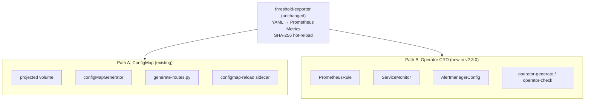
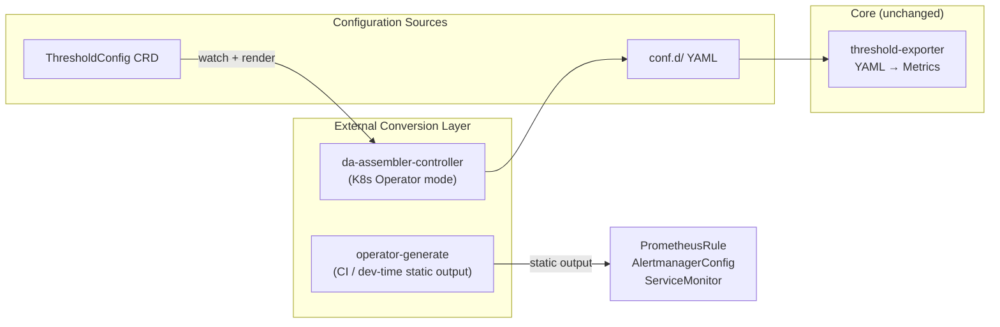

# ADR-008: Operator-Native Integration Path

## Status

✅ **Accepted** (v2.3.0) — Platform supports both ConfigMap and Operator CRD paths; detection logic auto-selects
📎 **Addendum** (v2.6.0) — Architecture boundary declaration added, see §Addendum below

## Context

Prometheus Operator (kube-prometheus-stack) has become the dominant deployment method for Prometheus in Kubernetes environments. The Operator uses custom CRDs (`PrometheusRule`, `ServiceMonitor`, `AlertmanagerConfig`) instead of traditional ConfigMaps, and auto-loads configurations via label selectors.

### Problem Statement

1. **Dual-path coexistence**: Existing users mount Rule Packs via ConfigMap (`configMapGenerator` / `projected volume`); Operator users need PrometheusRule CRD format
2. **Mutual exclusion risk**: ConfigMap-based `generate_alertmanager_routes.py` output and `AlertmanagerConfig` CRD cannot be mixed — mixing causes route overrides
3. **API version fragmentation**: AlertmanagerConfig has `v1alpha1` and `v1beta1` versions; different Operator releases support different APIs
4. **GitOps idempotency**: Auto-generated CRD YAML with `resourceVersion`, `creationTimestamp` or other server-side metadata causes ArgoCD/Flux to continuously report OutOfSync
5. **Namespace strategy**: Cluster-wide vs namespace-scoped CRD deployment affects RBAC design and multi-tenant isolation

### Decision Drivers

- No added complexity to core architecture (threshold-exporter unchanged)
- Toolchain adapts to both paths rather than forcing migration
- Output must be GitOps-friendly pure declarative YAML

## Decision

**Adopt toolchain adaptation pattern: core platform (threshold-exporter + Rule Packs) remains path-agnostic; new `operator-generate` / `operator-check` tools handle CRD conversion and validation.**

### Architecture Layering



### Path B Tool Design

**`da-tools operator-generate`**:
- Read `rule-packs/` → output 15 PrometheusRule CRD YAML
- Read `conf.d/` → output per-tenant AlertmanagerConfig CRD
- Output ServiceMonitor for threshold-exporter
- `--api-version` flag specifies AlertmanagerConfig API version (`v1alpha1` | `v1beta1`, default `v1beta1`)
- `--gitops` flag: sorted keys, no timestamps/resourceVersion/status, deterministic output
- `--namespace` flag: target namespace (affects CRD metadata.namespace)
- `--output-dir` flag: Kustomize/Helm friendly output

**`da-tools operator-check`**:
- Detect Operator presence (`kubectl get crd prometheusrules.monitoring.coreos.com`)
- Verify PrometheusRule loading status (label match ruleSelector)
- Verify ServiceMonitor target status (Prometheus `/api/v1/targets`)
- Verify AlertmanagerConfig effectiveness (Alertmanager status API)
- Output diagnostic report (PASS / WARN / FAIL)

### Detection Logic

```python
def detect_deployment_mode(kubeconfig=None):
    """Detect whether target cluster uses ConfigMap or Operator deployment"""
    try:
        result = kubectl("get", "crd", "prometheusrules.monitoring.coreos.com")
        if result.returncode == 0:
            return "operator"
    except Exception:
        pass
    return "configmap"
```

### Mutual Exclusion Boundary

| Item | Path A (ConfigMap) | Path B (Operator) |
|------|-------------------|-------------------|
| Rule Pack mount | projected volume ConfigMap | PrometheusRule CRD |
| Route generation | `generate_alertmanager_routes.py` | `operator-generate` AlertmanagerConfig |
| Config reload | configmap-reload sidecar | Operator auto-reconcile |
| Validation tool | `validate_config.py` | `operator-check` |

**Strict exclusion**: A single cluster's Alertmanager must not use both ConfigMap and AlertmanagerConfig CRD for route management simultaneously. `operator-generate` detects and warns.

## Rationale

### Why not rewrite threshold-exporter as a Kubernetes Operator?

We evaluated rewriting threshold-exporter to watch a custom `DynamicAlertTenant` CRD, but decided against it for v2.3.0:

1. **Architecture scope expansion**: Operator SDK + CRD + Controller significantly increases core complexity
2. **Reduced deployment flexibility**: Current config-dir + SHA-256 hot-reload works anywhere (including non-K8s environments)
3. **Proven stability**: Hot-reload benchmarked at 2,000 tenants / 10ms reload in v2.2.0
4. **Incremental adoption**: Toolchain adaptation lets users migrate gradually

### Why not just provide documentation (instead of building tools)?

v2.2.0 BYO documentation's Operator Appendix was only CRD example translation. User feedback revealed:
- Manual conversion of 15 Rule Pack ConfigMaps → PrometheusRule is time-consuming and error-prone
- AlertmanagerConfig API version differences are easy to get wrong
- GitOps pipelines require deterministic output

## Consequences

### Positive

- Operator users get first-class experience (auto-generated CRDs + validation tools)
- Existing ConfigMap users are unaffected
- GitOps pipelines integrate directly (`operator-generate --gitops` for deterministic YAML)
- Clear migration path (ConfigMap → CRD gradual conversion)

### Negative

- Increased toolchain maintenance cost (Path A + Path B two paths)
- Must track AlertmanagerConfig API version evolution
- `operator-generate` CRD output must maintain compatibility with Operator versions

### Risks

- AlertmanagerConfig `v1alpha1` may be removed in future Operator versions → Default to `v1beta1`, mark `v1alpha1` as deprecated
- Operator ruleSelector label strategies vary → `operator-check` provides diagnostic guidance

## Addendum: Architecture Boundary Declaration (v2.6.0)

> **Added in v2.6.0 Phase .a** — Formally documents core component responsibility boundaries to prevent scope creep.

### Inviolable Boundaries

1. **threshold-exporter does NOT watch any CRD**. It only reads `conf.d/` YAML files via SHA-256 hot-reload. This is intentional — it preserves the exporter's ability to run in non-K8s environments.

2. **CRD → conf.d/ conversion is handled externally**. Two supported paths:
   - **da-assembler-controller** (future Operator mode): watches `ThresholdConfig` CRD → renders `conf.d/` files
   - **`operator-generate` in CI pipeline**: static conversion → outputs CRD YAML for GitOps deployment

3. **`operator-generate` is strictly an "assemble / render" role**. It reads `rule-packs/` and `conf.d/` directories and outputs standard CRD YAML. It does not extend the exporter's responsibilities, does not connect to clusters, and does not run `kubectl apply`.

### Boundary Diagram



### Decision Criteria for New Operator Tools

Any new Operator-related tool or feature must pass these three questions:

1. **Does it change threshold-exporter's input interface?** → If yes, boundary violation — do not proceed
2. **Does it require the exporter to connect to the K8s API?** → If yes, boundary violation — delegate to external tools
3. **Is it purely "read → transform → output"?** → If yes, falls within toolchain scope — proceed

## Evolution Status

- **v2.3.0** (completed): `operator-generate` / `operator-check` toolchain, PrometheusRule + AlertmanagerConfig + ServiceMonitor CRD output
- **v2.6.0** (completed): Architecture boundary declaration (see §Addendum above), `operator-generate --kustomize` multi-cluster deployment, `drift_detect.py --mode operator` cross-cluster CRD drift detection

**Remaining**:
- **da-assembler-controller** (long-term exploration): external Operator watches `ThresholdConfig` CRD → renders `conf.d/`. Note: this component lives outside threshold-exporter, does not violate the architecture boundary declaration
- **Helm Chart kube-prometheus-stack values examples**: provide values.yaml reference for common Operator deployments
- **ArgoCD ApplicationSet integration**: multi-cluster Federation CRD deployment automation

## Related Decisions

| ADR | Relationship |
|-----|-------------|
| [ADR-001](001-severity-dedup-via-inhibit.en.md) | Inhibit rule equivalence in Operator CRDs |
| [ADR-004](004-federation-central-exporter-first.en.md) | Federation CRD deployment for edge/central split |
| [ADR-005](005-projected-volume-for-rule-packs.en.md) | Path A projected volume design; Path B replaces with PrometheusRule |
| [ADR-007](007-cross-domain-routing-profiles.en.md) | Routing Profile mapping in AlertmanagerConfig CRD |

## Related Resources

| Resource | Description |
|----------|-------------|
| [`docs/prometheus-operator-integration.md`](../integration/prometheus-operator-integration.md) | Full Operator integration guide |
| [`docs/byo-prometheus-integration.md`](../integration/byo-prometheus-integration.md) | Path A: Existing BYO Prometheus integration |
| [`docs/byo-alertmanager-integration.md`](../integration/byo-alertmanager-integration.md) | Path A: Existing BYO Alertmanager integration |
| [kube-prometheus-stack](https://github.com/prometheus-community/helm-charts/tree/main/charts/kube-prometheus-stack) | Upstream Helm chart |
| [Prometheus Operator CRD Reference](https://prometheus-operator.dev/docs/api-reference/api/) | CRD API documentation |
