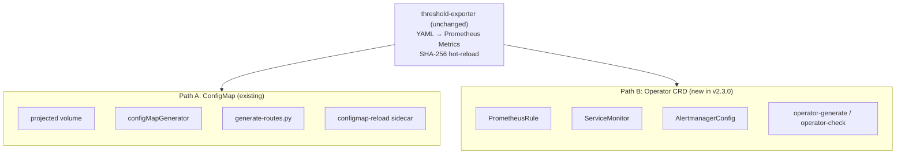

# ADR-008: Operator-Native Integration Path

## Status

✅ **Accepted** (v2.3.0) — Platform supports both ConfigMap and Operator CRD paths; detection logic auto-selects

## Context

Prometheus Operator (kube-prometheus-stack) has become the dominant deployment method for Prometheus in Kubernetes environments. The Operator uses custom CRDs (`PrometheusRule`, `ServiceMonitor`, `AlertmanagerConfig`) instead of traditional ConfigMaps, and auto-loads configurations via label selectors.

### Problem Statement

1. **Dual-path coexistence**: Existing users mount Rule Packs via ConfigMap (`configMapGenerator` / `projected volume`); Operator users need PrometheusRule CRD format
2. **Mutual exclusion risk**: ConfigMap-based `generate_alertmanager_routes.py` output and `AlertmanagerConfig` CRD cannot be mixed — mixing causes route overrides
3. **API version fragmentation**: AlertmanagerConfig has `v1alpha1` and `v1beta1` versions; different Operator releases support different APIs
4. **GitOps idempotency**: Auto-generated CRD YAML with `resourceVersion`, `creationTimestamp` or other server-side metadata causes ArgoCD/Flux to continuously report OutOfSync
5. **Namespace strategy**: Cluster-wide vs namespace-scoped CRD deployment affects RBAC design and multi-tenant isolation

### Decision Drivers

- No added complexity to core architecture (threshold-exporter unchanged)
- Toolchain adapts to both paths rather than forcing migration
- Output must be GitOps-friendly pure declarative YAML

## Decision

**Adopt toolchain adaptation pattern: core platform (threshold-exporter + Rule Packs) remains path-agnostic; new `operator-generate` / `operator-check` tools handle CRD conversion and validation.**

### Architecture Layering

### Mutual Exclusion Boundary

| Item | Path A (ConfigMap) | Path B (Operator) |
|------|-------------------|-------------------|
| Rule Pack mount | projected volume ConfigMap | PrometheusRule CRD |
| Route generation | `generate_alertmanager_routes.py` | `operator-generate` AlertmanagerConfig |
| Config reload | configmap-reload sidecar | Operator auto-reconcile |
| Validation tool | `validate_config.py` | `operator-check` |

**Strict exclusion**: A single cluster's Alertmanager must not use both ConfigMap and AlertmanagerConfig CRD for route management simultaneously. `operator-generate` detects and warns.

## Rationale

### Why not rewrite threshold-exporter as a Kubernetes Operator?

We evaluated rewriting threshold-exporter to watch a custom `DynamicAlertTenant` CRD, but decided against it for v2.3.0:

1. **Architecture scope expansion**: Operator SDK + CRD + Controller significantly increases core complexity
2. **Reduced deployment flexibility**: Current config-dir + SHA-256 hot-reload works anywhere (including non-K8s environments)
3. **Proven stability**: Hot-reload benchmarked at 2,000 tenants / 10ms reload in v2.2.0
4. **Incremental adoption**: Toolchain adaptation lets users migrate gradually

## Consequences

### Positive

- Operator users get first-class experience (auto-generated CRDs + validation tools)
- Existing ConfigMap users are unaffected
- GitOps pipelines integrate directly (`operator-generate --gitops` for deterministic YAML)

### Negative

- Increased toolchain maintenance (Path A + Path B)
- Must track AlertmanagerConfig API version evolution

### Future Direction

1. **v2.4.0+ candidate**: threshold-exporter as Kubernetes Operator watching custom `DynamicAlertTenant` CRD
2. **Helm Chart values.yaml integration**: kube-prometheus-stack Helm values examples
3. **ArgoCD ApplicationSet integration**: Multi-cluster Federation CRD deployment automation

## Related Decisions

| ADR | Relationship |
|-----|-------------|
| [ADR-001](001-severity-dedup-via-inhibit.en.md) | Inhibit rule equivalence in Operator CRDs |
| [ADR-004](004-federation-scenario-a-first.en.md) | Federation CRD deployment for edge/central split |
| [ADR-005](005-projected-volume-for-rule-packs.en.md) | Path A projected volume design; Path B replaces with PrometheusRule |
| [ADR-007](007-cross-domain-routing-profiles.en.md) | Routing Profile mapping in AlertmanagerConfig CRD |

## Related Resources

| Resource | Description |
|----------|-------------|
| [`docs/prometheus-operator-integration.md`](../prometheus-operator-integration.md) | Full Operator integration guide |
| [`docs/byo-prometheus-integration.md`](../byo-prometheus-integration.md) | Path A: Existing BYO Prometheus integration |
| [`docs/byo-alertmanager-integration.md`](../byo-alertmanager-integration.md) | Path A: Existing BYO Alertmanager integration |
| [kube-prometheus-stack](https://github.com/prometheus-community/helm-charts/tree/main/charts/kube-prometheus-stack) | Upstream Helm chart |
| [Prometheus Operator CRD Reference](https://prometheus-operator.dev/docs/api-reference/api/) | CRD API documentation |
