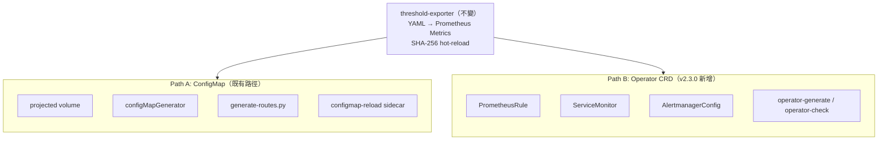

# ADR-008: Operator-Native 整合路徑

## 狀態

✅ **Accepted** (v2.3.0) — 平台同時支援 ConfigMap 路徑和 Operator CRD 路徑，由偵測邏輯自動判斷

## 背景

Prometheus Operator（kube-prometheus-stack）已成為 Kubernetes 環境中部署 Prometheus 的主流方式。Operator 使用自定義 CRD（`PrometheusRule`、`ServiceMonitor`、`AlertmanagerConfig`）取代傳統 ConfigMap，並透過 label selector 自動載入配置。

### 問題陳述

1. **雙路徑共存**：既有用戶使用 ConfigMap 掛載 Rule Pack（`configMapGenerator` / `projected volume`），Operator 用戶需要 PrometheusRule CRD 格式
2. **互斥風險**：`generate_alertmanager_routes.py` 產出的 ConfigMap 格式與 `AlertmanagerConfig` CRD 不可混用，混用會導致路由覆蓋
3. **API 版本碎片化**：AlertmanagerConfig 存在 `v1alpha1` 和 `v1beta1` 兩個版本，不同 Operator 版本支援不同 API
4. **GitOps 冪等性**：自動產出的 CRD YAML 若帶有 `resourceVersion`、`creationTimestamp` 等 server-side metadata，ArgoCD/Flux 會持續報告 OutOfSync
5. **Namespace 策略**：cluster-wide vs namespace-scoped 的 CRD 部署影響 RBAC 設計和多租戶隔離

### 決策驅動力

- 不增加核心架構複雜度（threshold-exporter 不變）
- 工具鏈可適配兩種路徑，而非強制遷移
- 產出物必須是 GitOps-friendly 的純淨 declarative YAML

## 決策

**採用工具鏈適配模式：核心平台（threshold-exporter + Rule Pack）保持 path-agnostic，新增 `operator-generate` / `operator-check` 工具處理 CRD 轉換與驗證。**

### 架構分層



### Path B 工具設計

**`da-tools operator-generate`**：
- 讀取 `rule-packs/` → 產出 15 個 PrometheusRule CRD YAML
- 讀取 `conf.d/` → 產出 per-tenant AlertmanagerConfig CRD
- 產出 ServiceMonitor for threshold-exporter
- `--api-version` flag 指定 AlertmanagerConfig API 版本（`v1alpha1` | `v1beta1`，預設 `v1beta1`）
- `--gitops` flag：sorted keys、無 timestamps/resourceVersion/status、deterministic output
- `--namespace` flag：目標 namespace（影響 CRD metadata.namespace）
- `--output-dir` flag：Kustomize/Helm friendly 輸出

**`da-tools operator-check`**：
- 偵測 Operator 存在（`kubectl get crd prometheusrules.monitoring.coreos.com`）
- 驗證 PrometheusRule 載入狀態（label 比對 ruleSelector）
- 驗證 ServiceMonitor target 狀態（Prometheus `/api/v1/targets`）
- 驗證 AlertmanagerConfig 生效（Alertmanager status API）
- 輸出診斷報告（PASS / WARN / FAIL）

### 偵測邏輯

```python
def detect_deployment_mode(kubeconfig=None):
    """偵測目標叢集使用 ConfigMap 還是 Operator 部署"""
    try:
        result = kubectl("get", "crd", "prometheusrules.monitoring.coreos.com")
        if result.returncode == 0:
            return "operator"
    except Exception:
        pass
    return "configmap"
```

### 互斥邊界

| 項目 | Path A (ConfigMap) | Path B (Operator) |
|------|-------------------|-------------------|
| Rule Pack 掛載 | projected volume ConfigMap | PrometheusRule CRD |
| 路由產生 | `generate_alertmanager_routes.py` | `operator-generate` AlertmanagerConfig |
| 配置重載 | configmap-reload sidecar | Operator 自動 reconcile |
| 驗證工具 | `validate_config.py` | `operator-check` |

**嚴格互斥**：同一叢集的 Alertmanager 不可同時使用 ConfigMap 和 AlertmanagerConfig CRD 管理路由。`operator-generate` 會偵測並警告。

## 基本原理

### 為什麼不把 threshold-exporter 改為 Kubernetes Operator？

評估過將 threshold-exporter 改寫為監聽 `DynamicAlertTenant` CRD 的 Kubernetes Operator，但基於以下原因決定不在 v2.3.0 採用：

1. **架構邊界擴大**：引入 Operator SDK + CRD + Controller 會大幅增加核心複雜度
2. **部署靈活度降低**：當前 config-dir + SHA-256 hot-reload 設計可在任何環境運行（非 K8s 環境也行），Operator 模式綁定 K8s
3. **已驗證的穩定性**：hot-reload 機制已通過 v2.2.0 benchmark 驗證（2,000 tenant 10ms reload）
4. **漸進式採用**：工具鏈適配讓用戶可逐步遷移，而非全有全無

### 為什麼不只提供文件指引（而是建工具）？

v2.2.0 BYO 文件的 Operator Appendix 僅是 CRD 範例翻譯，用戶反映：
- 手工轉換 15 個 Rule Pack ConfigMap → PrometheusRule 耗時且易錯
- AlertmanagerConfig API 版本差異容易踩坑
- GitOps pipeline 需要 deterministic 輸出

## 後果

### 正面

- Operator 用戶獲得一級公民體驗（自動產出 CRD + 驗證工具）
- 既有 ConfigMap 用戶不受影響
- GitOps pipeline 可直接整合（`operator-generate --gitops` 輸出 deterministic YAML）
- 遷移路徑明確（ConfigMap → CRD 漸進式轉換）

### 負面

- 工具鏈維護成本增加（Path A + Path B 兩套路徑）
- 需追蹤 AlertmanagerConfig API 版本演進
- `operator-generate` 的 CRD 輸出需與 Operator 版本保持相容

### 風險

- AlertmanagerConfig `v1alpha1` 可能在未來 Operator 版本中被移除 → 預設 `v1beta1`，`v1alpha1` 標注 deprecation
- Operator ruleSelector label 策略多樣 → `operator-check` 提供診斷指引

## 未來演進方向

1. **v2.4.0+ 候選**：threshold-exporter 作為 Kubernetes Operator 監聽自定義 `DynamicAlertTenant` CRD，實現完全 Operator-native 的配置管理
2. **Helm Chart values.yaml 整合**：提供 kube-prometheus-stack Helm values 範例
3. **ArgoCD ApplicationSet 整合**：多叢集 Federation 場景的 CRD 部署自動化

## 相關決策

| ADR | 關係 |
|-----|------|
| [ADR-001](001-severity-dedup-via-inhibit.md) | Inhibit rule 在 Operator CRD 中的等價表達 |
| [ADR-004](004-federation-scenario-a-first.md) | Federation 場景 CRD 部署需考慮 edge/central 分層 |
| [ADR-005](005-projected-volume-for-rule-packs.md) | Path A 的 projected volume 設計；Path B 用 PrometheusRule 取代 |
| [ADR-007](007-cross-domain-routing-profiles.md) | 路由 Profile 在 AlertmanagerConfig CRD 中的映射 |

## 相關資源

| 資源 | 說明 |
|------|------|
| [`docs/prometheus-operator-integration.md`](../prometheus-operator-integration.md) | Operator 整合完整手冊 |
| [`docs/byo-prometheus-integration.md`](../byo-prometheus-integration.md) | Path A: 既有 BYO Prometheus 整合 |
| [`docs/byo-alertmanager-integration.md`](../byo-alertmanager-integration.md) | Path A: 既有 BYO Alertmanager 整合 |
| [kube-prometheus-stack](https://github.com/prometheus-community/helm-charts/tree/main/charts/kube-prometheus-stack) | 上游 Helm chart |
| [Prometheus Operator CRD Reference](https://prometheus-operator.dev/docs/api-reference/api/) | CRD API 文件 |
