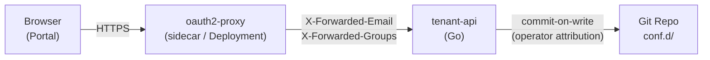

# ADR-009: Tenant Manager CRUD API Architecture

## Status

✅ **Accepted** (v2.4.0) — Tenant Management API implemented as Go HTTP server + oauth2-proxy + commit-on-write pattern

## Background

### Problem Statement

The da-portal in v2.3.0 is a purely static display layer: tenant configurations are updated by domain experts manually editing YAML files through ConfigMap or GitOps workflows. This creates the following friction:

1. **High operational barrier**: Domain experts without engineering backgrounds must edit YAML directly, risking format errors
2. **Inconsistent audit trail**: Manual `kubectl apply` or `git push` cannot uniformly record operator identity
3. **Inefficient bulk operations**: Switching 20 tenants to silent mode requires editing 20 YAML files individually
4. **Late validation**: Configuration errors are only discovered after threshold-exporter reload, not prevented at write time
5. **Insufficient permission granularity**: No mechanism to restrict a group to managing only their specific tenant subset

### Decision Drivers

- Maintain GitOps philosophy: Git repo remains source of truth; API is a controlled write channel to Git
- Reuse existing threshold-exporter config parsing and validation logic; avoid maintaining duplicate schema
- Delegate authentication to mature tooling; API server has zero auth code
- Portal graceful degradation: when API is unavailable, Portal automatically falls back to read-only static mode

## Decision

Introduce **tenant-api**: a standalone Go HTTP server serving as the management plane backend for da-portal.



### Core Decision Points

| Decision | Choice | Rationale |
|----------|--------|-----------|
| **API language** | Go | Directly imports `pkg/config` to share config parsing and validation logic, avoiding Go↔Python dual-maintenance of schema |
| **Authentication** | oauth2-proxy sidecar | K8s-native pattern, API server only reads HTTP headers, zero auth code; supports GitHub OAuth / Google OIDC / generic OIDC |
| **Write-back** | commit-on-write | UI action → API → modify conf.d/ YAML → git commit (with operator email as author). Full audit trail, compatible with GitOps workflow |
| **Permission model** | `_rbac.yaml` static mapping | Maintain one `_rbac.yaml`: `groups[].tenants[]` mapping. IdP groups as source of truth, dynamically loaded, no hardcoding |
| **Concurrency model** | `sync.Mutex` → goroutine pool | v2.4.0 synchronous execution; v2.6.0 upgraded to goroutine pool + `task_id` polling async mode |
| **API documentation** | swaggo/swag annotation | Auto-generate `swagger.yaml` from Go handler annotations, keeps docs in sync with code |
| **Portal positioning** | Extend existing da-portal | No new project; add API client layer; tenant-manager.jsx fallback protection (API unavailable → static JSON read-only mode) |
| **Go module boundary** | Standalone module + replace | `github.com/vencil/tenant-api` has its own `go.mod`, with `replace` directive pointing to local `threshold-exporter/`; can be independently published later |

### RBAC Hot-Reload Design

`_rbac.yaml` uses `sync/atomic.Value` to store the parsed RBAC structure, consistent with threshold-exporter config hot-reload pattern:

```go
type RBACManager struct {
    path  string
    value atomic.Value  // stores *RBACConfig
}
// WatchLoop: periodic SHA-256 comparison, atomic.Store() only on change
// handler goroutine: atomic.Load(), lock-free
```

### Batch Operation Response Format

v2.4.0 executed synchronously; `status` was always `"completed"`. v2.6.0 upgraded to async mode (goroutine pool + `task_id` polling):

```json
{
  "status": "completed",
  "task_id": "batch-20260405-001",
  "results": [
    {"tenant_id": "db-a-prod", "status": "ok"},
    {"tenant_id": "db-b-staging", "status": "error", "message": "validation failed: unknown key _foo"}
  ]
}
```

## Rationale

### Why Go instead of Python?

threshold-exporter's core config parsing logic (`ValidateTenantKeys`, `ResolveAt`, `ParseConfig`) is all in Go. Writing the API server in Go allows direct `import "github.com/vencil/threshold-exporter/pkg/config"`, ensuring configurations rejected by the API are exactly those rejected by `da-tools validate-config`. Using Python would require maintaining two parallel schema validators, and historically Go↔Python dual-maintenance has caused validation logic inconsistencies (see `governance-security.md §2`).

### Why no database?

The Git repo is already the source of truth. Introducing a database creates a bi-directional synchronization problem between Git state ↔ DB state, increasing system complexity and failure points. The commit-on-write pattern preserves a complete audit trail; any point-in-time configuration state can be reconstructed via `git log`, embodying the GitOps core philosophy.

### Why oauth2-proxy instead of custom JWT validation?

oauth2-proxy is a mature CNCF ecosystem tool supporting all major IdPs (GitHub, Google, Azure AD, generic OIDC). After injecting `X-Forwarded-Email` and `X-Forwarded-Groups` headers, the API server only needs to read headers — no token validation code required. This follows the separation of concerns principle and is consistent with K8s ingress auth patterns.

### Why no real-time WebSocket push?

v2.4.0's primary user scenario is low-frequency operations (≥1 second between operations); polling or manual refresh is sufficient. Async batch operations with task_id polling introduced in v2.6.0; SSE server-sent events replaced WebSocket in v2.6.0 for real-time push notifications without persistent connection overhead.

## Consequences

### Positive

- **Improved operational experience**: Domain experts manage tenants through the Portal UI without directly editing YAML
- **Unified audit trail**: All configuration changes use the operator's email as git commit author, fully traceable
- **Pre-write validation**: API server executes `ValidateTenantKeys()` before committing; configuration errors are immediately returned
- **Fine-grained permissions**: `_rbac.yaml` can restrict specific teams to their responsible tenant subset
- **Zero-downtime degradation**: When oauth2-proxy or API server fails, Portal automatically degrades to static read-only mode

### Negative

- **New operational components**: tenant-api + oauth2-proxy each add a Deployment requiring monitoring, upgrades, and troubleshooting
- **OAuth configuration complexity**: First deployment requires creating OAuth applications in IdP (GitHub/Google) and configuring callback URLs
- **Increased network topology**: Portal → oauth2-proxy → tenant-api → Git multi-hop latency (expected <100ms in-cluster)

### Risks

- **Git conflict**: Multiple operators writing to the same tenant config simultaneously may cause conflicts. Mitigation: HEAD snapshot comparison before write; return 409 on conflict, requiring operator to refresh and retry
- **git binary dependency**: API server calls `git` via `os/exec`; container must have git installed. Mitigation: Dockerfile uses `golang:alpine` build stage to ensure git availability

## Evolution Status

- **v2.4.0** (completed): Core CRUD API, commit-on-write, oauth2-proxy authentication, `_rbac.yaml` permission model, Portal degradation safety
- **v2.5.0** (completed): Multi-Tenant Grouping (ADR-010), multi-dimension filtering, Group CRUD + batch operations
- **v2.6.0** (completed): Async batch operations (goroutine pool + `task_id` polling), SSE real-time push (replacing WebSocket), PR-based write-back (ADR-011, GitHub + GitLab dual platform)

**Remaining**:
- Field-level fine-grained RBAC (currently tenant-level) — v2.7.0 candidate

## Related Decisions

| ADR | Relationship |
|-----|-------------|
| [ADR-003: Sentinel Alert Pattern](003-sentinel-alert-pattern.en.md) | flag metric pattern extended to API server operational monitoring metrics |
| [ADR-007: Four-Layer Routing Merge](007-cross-domain-routing-profiles.en.md) | API's `PUT /tenants/{id}` must understand and preserve `_routing` fields |
| [ADR-008: Operator-Native Integration Path](008-operator-native-integration-path.en.md) | CRD changes under Operator path bypass the API, maintaining CLI toolchain |

## Related Resources

- `components/tenant-api/` — API server implementation
- `components/threshold-exporter/pkg/config/` — Shared config parsing package (extracted in C-2a)
- `docs/interactive/tools/tenant-manager.jsx` — Portal frontend (refactored in C-5)
- `docs/governance-security.md §2` — Schema validation dual-consistency requirements
- [oauth2-proxy documentation](https://oauth2-proxy.github.io/oauth2-proxy/) — IdP configuration reference
- [swaggo/swag](https://github.com/swaggo/swag) — Go annotation → swagger.yaml
