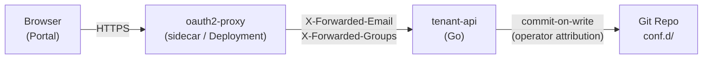

# ADR-009: Tenant Manager CRUD API Architecture

> **Language / 語言：** **English (Current)** | [中文](./009-tenant-manager-crud-api.md)

**Decision in brief**: add tenant-api, a standalone Go HTTP server that serves as the management backend for da-portal. Sign-in is handled by an oauth2-proxy in front of it, and tenant-api decides permissions from the identity headers oauth2-proxy passes along; every write modifies the tenant config file in the Git repo directly and commits it as the operator, so Git remains the single source of the configuration.

## Status

✅ **Accepted** (v2.4.0) — Tenant Management API implemented as Go HTTP server + oauth2-proxy + commit-on-write pattern

## Terms

- **conf.d/**: the directory holding tenant config YAML; threshold-exporter reads its configuration from here.
- **oauth2-proxy**: an open-source authenticating reverse proxy. Users first sign in through it with an IdP (identity provider, for example GitHub, Google, or a corporate identity system that speaks OIDC, the standard sign-in protocol); it then forwards the request to the backend, carrying the user's email and groups in the `X-Forwarded-Email` and `X-Forwarded-Groups` headers.
- **commit-on-write**: every write the API handles modifies the YAML in conf.d/ and immediately creates a git commit whose author is the operator's email.
- **SSE (Server-Sent Events)**: one-way push from server to browser: the server keeps an HTTP response open and writes an entry into it whenever there is an event.

## Background

### Problem

Before this decision, da-portal was only a static display layer: tenant configuration was edited by hand in YAML by domain experts and then updated through a ConfigMap or a GitOps workflow. This caused the following friction:

1. **High barrier to operate**: domain experts without an engineering background had to edit YAML directly and easily got the format wrong.
2. **Inconsistent audit trail**: a manual `kubectl apply` or `git push` cannot record who the operator was in a uniform way.
3. **Inefficient bulk operations**: switching 20 tenants to silent mode meant editing 20 YAML files one by one.
4. **Errors found late**: configuration errors only surfaced after threshold-exporter reloaded, with no way to stop them before the write.
5. **Permissions not granular enough**: there was no way to restrict a group to managing a specific subset of tenants.

### Decision drivers

- Keep the GitOps spirit: the Git repo remains the single source of configuration, and the API is a controlled channel for writing to Git.
- Reuse threshold-exporter's existing config parsing and validation logic instead of maintaining a separate schema.
- Leave authentication to mature tooling.

## Decision

Add **tenant-api**: a standalone Go HTTP server serving as the management backend for da-portal.


```mermaid
graph LR
    A["Browser<br/>(Portal)"] -->|HTTPS| B["oauth2-proxy<br/>(sidecar / Deployment)"]
    B -->|"X-Forwarded-Email<br/>X-Forwarded-Groups"| C["tenant-api<br/>(Go)"]
    C -->|"commit-on-write<br/>(operator attribution)"| D["Git Repo<br/>conf.d/"]
```

### Choices

| Decision | Choice | Rationale |
|----------|--------|-----------|
| **API language** | Go | Imports threshold-exporter's `pkg/config` directly to share config parsing and validation logic, so the schema is not maintained in both Go and Python |
| **Authentication** | oauth2-proxy sidecar | A common Kubernetes pattern; authorization reads only the HTTP headers oauth2-proxy adds; supports GitHub OAuth, Google OIDC, and generic OIDC |
| **Write-back** | commit-on-write | UI action → API → modify YAML in conf.d/ → git commit (author is the operator's email). Complete audit trail, compatible with the GitOps workflow |
| **Permission model** | `_rbac.yaml` static mapping | One `_rbac.yaml` lists which tenants each IdP group maps to and with which permissions. Group membership comes from the IdP; the file is reloaded automatically when it changes, and nothing is hard-coded |
| **Concurrency model** | Serialized writes, optionally async batches | All writes are serialized by the writer lock; batch operations run synchronously by default, and with `?async=true` they run on background workers and the result is polled by `task_id` |
| **Change notification** | SSE | Config changes are pushed to the browser in real time over SSE. Only one-way server-to-browser push is needed, and SSE is simpler than WebSocket and works natively with HTTP/2 |
| **API documentation** | swaggo/swag annotations | `swagger.yaml` is generated from annotations on the Go handlers, so it stays in sync with the code |
| **Portal positioning** | Extend the existing da-portal | No new project; the tenant-manager frontend gains a layer that calls the API |
| **Go module boundary** | Standalone module + `replace` | `github.com/vencil/tenant-api` has its own `go.mod`, with a `replace` directive pointing to threshold-exporter in the repo; it can be released independently later |

### Example: `_rbac.yaml`

```yaml
groups:
  - name: platform-admins
    tenants: ["*"]
    permissions: [read, write, admin]
  - name: db-operators
    tenants: ["db-a-*", "db-b-*"]
    permissions: [read, write]
```

`name` is the IdP group name, i.e. the value oauth2-proxy puts in `X-Forwarded-Groups`; `tenants` can hold full tenant IDs, `*`, or prefix patterns (`db-a-*`). Result: a user whose `X-Forwarded-Groups` contains `db-operators` can read and write tenants whose ID starts with `db-a-` or `db-b-`, and no others.

The parsed `_rbac.yaml` is stored in a `sync/atomic.Value`, so handlers read it without locking; a background loop periodically compares the file's SHA-256 and only re-parses and swaps it in when the content changed — the same pattern as threshold-exporter's config hot reload.

### Example: batch operation response

`POST /api/v1/tenants/batch` with two operations, where the first succeeds and the second hits a concurrent-write conflict. The default synchronous mode returns:

```json
{
  "status": "completed",
  "task_id": "batch-20260405-0002",
  "results": [
    {"tenant_id": "db-a-prod", "status": "ok"},
    {"tenant_id": "db-b-staging", "status": "error", "message": "conflict: retry after refresh"}
  ],
  "summary": "1 succeeded, 1 failed"
}
```

With `?async=true` it returns 202 and a `task_id` instead, and the result is fetched with `GET /api/v1/tasks/{id}`.

## Rationale

### Why Go instead of Python?

threshold-exporter's core config parsing logic (`ValidateTenantKeys`, `ResolveAt`, `ParseConfigFile`) is all in Go. Writing the API server in Go allows a direct `import "github.com/vencil/threshold-exporter/pkg/config"`, so key validation shares its source with the exporter. That does not make it match `da-tools validate-config`: that tool is Python (`validate_config.py`), and the two reject different sets (see [config-driven](../design/config-driven.en.md)). Writing the API in Python would mean maintaining two schema validators side by side.

### Why no database?

The Git repo is already the single source of configuration. A database would create a state-synchronization problem between Git and the database, adding complexity and failure points. commit-on-write keeps a complete audit trail, and the configuration at any point in time can be rebuilt from `git log`, which is the core of GitOps.

### Why oauth2-proxy instead of validating JWTs ourselves?

oauth2-proxy supports the mainstream IdPs (GitHub, Google, Azure AD, generic OIDC). The sign-in flow is left to it, and tenant-api's authorization reads only the `X-Forwarded-Email` and `X-Forwarded-Groups` headers it injects. This keeps authentication apart from business logic and matches the common Kubernetes pattern of doing authentication at the ingress layer.

## Consequences and known limitations

**What we get**

- **Better operating experience**: domain experts manage tenants through the Portal UI without editing YAML directly.
- **A unified audit trail**: every config change uses the operator's email as the git commit author and can be traced.
- **Validation before the write**: the API runs `ValidateTenantKeys()` before committing, and configuration errors are reported immediately.
- **Fine-grained permissions**: `_rbac.yaml` can restrict a team to the subset of tenants it is responsible for.

**What we accept**

- **OAuth setup**: the first deployment requires creating an OAuth application in the IdP (GitHub, Google, and so on) and configuring its callback URL.
- **One more network hop**: the request path becomes Portal → oauth2-proxy → tenant-api → Git.
- **Dependence on the git binary**: the API calls `git` through `os/exec`, so the container must have git. The runtime image is based on alpine and installs it with `apk add git`.

**Conflicts between concurrent writes**

Several operators writing the same tenant's config at the same time can conflict. API writes are serialized by the writer lock; after the commit, its parent is compared with the HEAD recorded before the write, and a mismatch returns 409. By then the write is **already committed and is not rolled back** ([#1535](https://github.com/vencil/Dynamic-Alerting-Integrations/issues/1535)). A change made by someone else between the read and the write (a lost update) is caught only by the opt-in `X-DA-Base-Hash` precondition: the request carries the hash it got when reading, and if the file has changed since, the API returns 409. This header only works in direct write-back mode.

**Out of scope**

- Permissions are per tenant; there are no field-level permissions.

## Implementation

- `components/tenant-api/` — the API server
- `components/threshold-exporter/app/pkg/config/` — the shared config parsing package
- `components/tenant-api/internal/rbac/` — loading `_rbac.yaml` and permission checks
- `components/tenant-api/internal/gitops/writer.go` — commit-on-write and conflict detection
- `components/tenant-api/internal/async/` — the worker pool for async batch operations
- `components/tenant-api/internal/ws/hub.go` — SSE push
- `tools/portal/src/interactive/tools/tenant-manager.jsx` — the Portal frontend

## Related

| ADR | Relationship |
|-----|-------------|
| [ADR-003: Sentinel Alert Pattern](003-sentinel-alert-pattern.en.md) | The flag-metric pattern extends to the API server's operational monitoring metrics |
| [ADR-007: Cross-Domain Routing Profiles and Domain Policies](007-cross-domain-routing-profiles.en.md) | The API's `PUT /tenants/{id}` must understand and preserve the `_routing` field |
| [ADR-008: Operator-Native Integration Path](008-operator-native-integration-path.en.md) | CRD (Kubernetes custom resource) changes on the Operator path do not go through the API and keep using the CLI toolchain |
| [ADR-010: Multi-Tenant Grouping Architecture](010-multi-tenant-grouping.en.md) | Adds custom groups on top of this API |
| [ADR-011: PR-based Write-back Mode](011-pr-based-write-back.en.md) | Adds a write-back mode that opens a PR instead of committing directly |

- [`governance-security.md` configuration validation and compliance](../governance-security.en.md) — how validation is split between Go and Python
- [oauth2-proxy documentation](https://oauth2-proxy.github.io/oauth2-proxy/) — IdP configuration reference
- [swaggo/swag](https://github.com/swaggo/swag) — Go annotations → swagger.yaml
