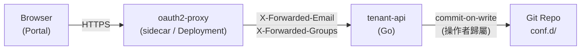

# ADR-009: Tenant Manager CRUD API 架構

## 狀態

✅ **Accepted** (v2.4.0) — Tenant Management API 以 Go HTTP server + oauth2-proxy + commit-on-write 模式實作

## 背景

### 問題陳述

v2.3.0 的 da-portal 是純靜態展示層：tenant 配置由 domain expert 手動編輯 YAML 後透過 ConfigMap 或 GitOps 流程更新。這造成以下摩擦：

1. **操作門檻高**：非工程師背景的 domain expert 需要直接編輯 YAML，容易引入格式錯誤
2. **審計軌跡不一致**：手動 `kubectl apply` 或 `git push` 無法統一記錄操作者身份
3. **批量操作低效**：將 20 個 tenant 切換為靜默模式需要逐一編輯 20 個 YAML 檔案
4. **驗證時間晚**：配置錯誤在 threshold-exporter reload 後才被發現，無法在寫入前預防
5. **權限粒度不足**：目前無機制限制某個 group 只能管理特定 tenant 子集

### 決策驅動力

- 維持 GitOps 精神：Git repo 仍是 source of truth，API 是寫入 Git 的受控通道
- 複用現有 threshold-exporter 的 config 解析與驗證邏輯，不重複維護 schema
- 認證外包給成熟工具，API server 零 auth 程式碼
- Portal 降級安全：API 不可用時，Portal 自動退回唯讀靜態模式

## 決策

引入 **tenant-api**：一個獨立的 Go HTTP server，作為 da-portal 的管理平面後端。



### 核心決策點

| 決策項目 | 選擇 | 理由 |
|----------|------|------|
| **API 實作語言** | Go | 直接 import `pkg/config` 共用 config 解析與驗證邏輯，避免 Go↔Python 雙端維護 schema |
| **認證機制** | oauth2-proxy sidecar | K8s 原生模式，API server 只讀 HTTP header，零 auth 程式碼；支援 GitHub OAuth / Google OIDC / 通用 OIDC |
| **寫回機制** | commit-on-write | UI 操作 → API → 修改 conf.d/ YAML → git commit（以操作者 email 為 author）。完整 audit trail，與 GitOps 流程相容 |
| **權限模型** | `_rbac.yaml` 靜態映射 | 維護一份 `_rbac.yaml`：`groups[].tenants[]` 對應表。IdP groups 為 source of truth，動態載入，無需硬編碼 |
| **並發模型** | `sync.Mutex` + `task_id` 預留 | v2.4.0 同步執行（Kind cluster 並發極低）；response 已預留 `task_id` 欄位，v2.5.0 引入 async queue 時 client 無需改動 |
| **API 文件** | swaggo/swag annotation | 從 Go handler annotation 自動產出 `swagger.yaml`，與程式碼保持同步 |
| **Portal 定位** | 擴展現有 da-portal | 不另起新專案；新增 API client layer，tenant-manager.jsx 降級保護（API 不可用 → 靜態 JSON 唯讀模式）|
| **Go module 邊界** | 獨立 module + replace | `github.com/vencil/tenant-api` 有自己的 `go.mod`，以 `replace` directive 指向本地 `threshold-exporter/`；未來可獨立發布 |

### RBAC 熱更新設計

`_rbac.yaml` 使用 `sync/atomic.Value` 存放解析後的 RBAC 結構，與 threshold-exporter config hot-reload 模式一致：

```go
type RBACManager struct {
    path  string
    value atomic.Value  // 存放 *RBACConfig
}
// WatchLoop: 定期 SHA-256 比對，有變更才 atomic.Store()
// handler goroutine: atomic.Load()，lock-free
```

### 批量操作回應格式

v2.4.0 同步執行，`status` 永遠為 `"completed"`，但結構已預留 `task_id` 供 v2.5.0 async 升級：

```json
{
  "status": "completed",
  "task_id": "batch-20260405-001",
  "results": [
    {"tenant_id": "db-a-prod", "status": "ok"},
    {"tenant_id": "db-b-staging", "status": "error", "message": "validation failed: unknown key _foo"}
  ]
}
```

## 基本原理

### 為何選 Go 而非 Python？

threshold-exporter 的核心 config 解析邏輯（`ValidateTenantKeys`, `ResolveAt`, `ParseConfig`）全在 Go。以 Go 撰寫 API server 可直接 `import "github.com/vencil/threshold-exporter/pkg/config"`，確保 API 拒絕的配置與 `da-tools validate-config` 拒絕的完全一致。若改用 Python，必須同步維護兩套 schema validator，歷史上 Go↔Python 雙端維護曾造成驗證邏輯不一致（參見 `governance-security.md §2`）。

### 為何不用資料庫？

Git repo 已是 source of truth。引入資料庫會產生 Git state ↔ DB state 的雙向同步問題，增加系統複雜度和故障點。commit-on-write 模式保留完整 audit trail，任何時間點的配置狀態都可透過 `git log` 重建，符合 GitOps 核心精神。

### 為何用 oauth2-proxy 而非自建 JWT 驗證？

oauth2-proxy 是 CNCF 生態的成熟工具，支援所有主流 IdP（GitHub、Google、Azure AD、通用 OIDC）。注入 `X-Forwarded-Email` 和 `X-Forwarded-Groups` header 後，API server 只需讀取 header，無需任何 token 驗證程式碼。這遵循 separation of concerns 原則，且與 K8s ingress auth 模式一致。

### 為何不做即時 WebSocket 推播？

v2.4.0 的主要用戶場景是低頻操作（每次操作間隔 ≥1 秒），polling 或手動重新整理已足夠。引入 WebSocket 需要額外的 goroutine pool、connection management 和錯誤處理，超出本版本 scope。列入 v2.5.0 roadmap。

## 後果

### 正向

- **操作體驗提升**：domain expert 透過 Portal UI 進行 tenant 管理，無需直接編輯 YAML
- **統一 audit trail**：所有配置變更以操作者 email 為 git commit author，可追溯
- **寫入前驗證**：API server 在 commit 前執行 `ValidateTenantKeys()`，配置錯誤即時回饋
- **細粒度權限**：`_rbac.yaml` 可將特定 team 限制在其負責的 tenant 子集
- **零停機降級**：oauth2-proxy 或 API server 故障時，Portal 自動降級為靜態唯讀模式

### 負向

- **新增運維元件**：tenant-api + oauth2-proxy 各增加一個 Deployment，需要監控、升級、排障
- **OAuth 設定複雜度**：首次部署需要在 IdP（GitHub/Google）建立 OAuth application，設定 callback URL
- **網路拓撲增加**：Portal → oauth2-proxy → tenant-api → Git 的多跳延遲（預期 <100ms in-cluster）

### 風險

- **Git conflict**：多個操作者同時寫入同一 tenant 配置可能產生 conflict。Mitigation：寫入前 HEAD 快照比對，衝突時返回 409，要求操作者重新整理後重試
- **git binary 依賴**：API server 以 `os/exec` 呼叫 `git` 指令，容器內需安裝 git。Mitigation：Dockerfile 使用 `golang:alpine` build stage 確保 git 可用

## 未來演進方向

- **v2.5.0**: 非同步批量操作（`status: "pending"` + task_id 輪詢），引入 goroutine pool
- **v2.5.0**: WebSocket 推播（配置變更即時通知 Portal）
- **v2.6.0**: PR-based 寫回（高安全環境：UI 操作 → 建立 PR → reviewer 核准 → 合併）
- **v2.6.0**: 細粒度欄位級 RBAC（目前為 tenant 層級）

## 相關決策

| ADR | 關聯 |
|-----|------|
| [ADR-003: Sentinel Alert 模式](003-sentinel-alert-pattern.md) | flag metric 模式延伸至 API server 的操作監控 metrics |
| [ADR-007: 四層路由合併](007-cross-domain-routing-profiles.md) | API 的 `PUT /tenants/{id}` 需理解並保留 `_routing` 欄位 |
| [ADR-008: Operator-Native 整合路徑](008-operator-native-integration-path.md) | Operator 路徑下的 CRD 變更不走 API，維持 CLI 工具鏈 |

## 相關資源

- `components/tenant-api/` — API server 實作
- `components/threshold-exporter/pkg/config/` — 共用 config 解析 package（C-2a 抽取）
- `docs/interactive/tools/tenant-manager.jsx` — Portal 前端（C-5 改造）
- `docs/governance-security.md §2` — Schema validation 雙端一致性要求
- [oauth2-proxy 官方文件](https://oauth2-proxy.github.io/oauth2-proxy/) — IdP 設定參考
- [swaggo/swag](https://github.com/swaggo/swag) — Go annotation → swagger.yaml
