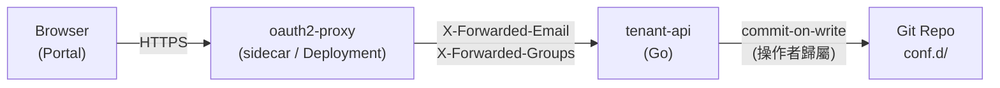

# ADR-009: Tenant Manager CRUD API 架構

> **Language / 語言：** **中文 (Current)** | [English](./009-tenant-manager-crud-api.en.md)

**決策摘要**：新增 tenant-api，一個獨立的 Go HTTP server，作為 da-portal 的管理後端。登入交給前面的 oauth2-proxy，tenant-api 依 oauth2-proxy 帶來的身分標頭判斷權限；每次寫入都直接修改 Git repo 裡的租戶設定檔並以操作者身分 commit，Git 仍是設定的唯一來源。

## 狀態

✅ **Accepted**（v2.4.0）— Tenant Management API 以 Go HTTP server + oauth2-proxy + commit-on-write 模式實作

## 名詞

- **da-portal**：平台的 Web 入口，租戶管理介面（tenant-manager）就在這裡。
- **GitOps**：以 Git repo 作為設定的唯一來源，所有變更都經由 Git 進到系統的運維方式。
- **conf.d/**：存放租戶設定 YAML 的目錄，threshold-exporter 從這裡讀設定。
- **oauth2-proxy**：開源的認證反向代理。使用者先在它那裡經由 IdP（身分提供者，例如 GitHub、Google，或支援 OIDC 這個標準登入協定的企業身分系統）登入，它再把請求轉給後端，並以 `X-Forwarded-Email`、`X-Forwarded-Groups` 標頭帶上使用者的 email 與所屬群組。
- **commit-on-write**：API 每處理一次寫入，就修改 conf.d/ 裡的 YAML 並立刻建立一個 git commit，commit 的 author 是操作者的 email。
- **SSE（Server-Sent Events）**：瀏覽器與伺服器之間的單向推播：伺服器保持一條 HTTP 回應不結束，有事件就往裡面寫一筆。

## 背景

### 問題

在這個決策之前，da-portal 只是靜態展示層：租戶設定由領域專家手動編輯 YAML，再經 ConfigMap 或 GitOps 流程更新。這造成以下摩擦：

1. **操作門檻高**：非工程背景的領域專家要直接編輯 YAML，容易寫錯格式。
2. **稽核軌跡不一致**：手動 `kubectl apply` 或 `git push` 無法統一記錄操作者是誰。
3. **批量操作沒效率**：要把 20 個租戶切到靜默模式，得逐一編輯 20 個 YAML 檔。
4. **錯誤發現得晚**：設定錯誤要等 threshold-exporter 重新載入後才發現，無法在寫入前擋下。
5. **權限不夠細**：沒有機制限制某個群組只能管理特定的租戶子集。

### 決策驅動力

- 維持 GitOps 精神：Git repo 仍是設定的唯一來源，API 是寫入 Git 的受控通道。
- 重用 threshold-exporter 既有的設定解析與驗證邏輯，不另外維護一份 schema。
- 認證交給成熟工具。
- Portal 在 API 不可用時仍要能顯示：改讀靜態的 `platform-data.json`，再不行就用內建的示範資料。

## 決策

新增 **tenant-api**：一個獨立的 Go HTTP server，作為 da-portal 的管理後端。


```mermaid
graph LR
    A["Browser<br/>(Portal)"] -->|HTTPS| B["oauth2-proxy<br/>(sidecar / Deployment)"]
    B -->|"X-Forwarded-Email<br/>X-Forwarded-Groups"| C["tenant-api<br/>(Go)"]
    C -->|"commit-on-write<br/>(操作者歸屬)"| D["Git Repo<br/>conf.d/"]
```

### 各項選擇

| 決策項目 | 選擇 | 理由 |
|----------|------|------|
| **API 實作語言** | Go | 直接 import threshold-exporter 的 `pkg/config`，共用設定解析與驗證邏輯，不必在 Go 與 Python 兩邊維護 schema |
| **認證機制** | oauth2-proxy sidecar | Kubernetes 常見做法；授權判斷只讀 oauth2-proxy 帶來的 HTTP 標頭；支援 GitHub OAuth、Google OIDC 與通用 OIDC |
| **寫回機制** | commit-on-write | UI 操作 → API → 修改 conf.d/ 的 YAML → git commit（author 為操作者 email）。稽核軌跡完整，與 GitOps 流程相容 |
| **權限模型** | `_rbac.yaml` 靜態對應 | 維護一份 `_rbac.yaml`，列出 IdP 群組對應哪些租戶、有哪些權限。群組歸屬以 IdP 為準，檔案改了會自動重新載入，程式裡不寫死 |
| **並行模型** | 寫入序列化，批量可非同步 | 所有寫入由 writer lock（tenant-api 內部的寫入鎖，同一時間只讓一筆寫入進行）序列化；批量操作預設同步執行，直接寫回模式下加 `?async=true` 改由背景 worker 執行，用 `task_id` 輪詢結果（PR 寫回模式忽略這個參數，一律同步） |
| **變更通知** | SSE | 設定變更以 SSE 即時推給瀏覽器。只需要伺服器往瀏覽器單向推播，SSE 比 WebSocket 簡單，也與 HTTP/2 原生相容 |
| **API 文件** | swaggo/swag 標註 | 從 Go handler 上的標註自動產生 `swagger.yaml`，與程式碼保持同步 |
| **Portal 定位** | 擴充現有 da-portal | 不另起新專案，在 tenant-manager 前端加上呼叫 API 的那一層；API 不可用時依序改讀靜態的 `platform-data.json` 與內建示範資料 |
| **Go module 邊界** | 獨立 module + `replace` | `github.com/vencil/tenant-api` 有自己的 `go.mod`，以 `replace` 指向 repo 內的 threshold-exporter；之後可以獨立發布 |

### 範例：`_rbac.yaml`

```yaml
groups:
  - name: platform-admins
    tenants: ["*"]
    permissions: [read, write, admin]
  - name: db-operators
    tenants: ["db-a-*", "db-b-*"]
    permissions: [read, write]
```

`name` 對應 IdP 群組名稱，也就是 oauth2-proxy 放在 `X-Forwarded-Groups` 裡的值；`tenants` 可以寫完整租戶 ID、`*` 或前綴樣式（`db-a-*`）。結果：`X-Forwarded-Groups` 含 `db-operators` 的使用者，可以讀寫 ID 以 `db-a-` 或 `db-b-` 開頭的租戶，其他租戶不行。

`_rbac.yaml` 解析後存放在 `sync/atomic.Value` 裡，handler 讀取時不必加鎖；背景定期比對檔案的 SHA-256，內容變了才重新解析、替換，與 threshold-exporter 的設定熱更新同一個模式。

### 範例：批量操作的回應

`POST /api/v1/tenants/batch` 帶兩個操作，第一個成功、第二個在寫入時遇到並行衝突。預設的同步模式回：

```json
{
  "status": "completed",
  "task_id": "batch-20260405-0002",
  "results": [
    {"tenant_id": "db-a-prod", "status": "ok"},
    {"tenant_id": "db-b-staging", "status": "error", "message": "conflict: retry after refresh"}
  ],
  "summary": "1 succeeded, 1 failed"
}
```

直接寫回模式下加 `?async=true` 時改回 202 與 `task_id`，結果用 `GET /api/v1/tasks/{id}` 取得；PR 寫回模式忽略 `?async=true`。

## 理由

### 為何選 Go 而非 Python？

threshold-exporter 的核心設定解析邏輯（`ValidateTenantKeys`、`ResolveAt`、`ParseConfigFile`）都在 Go。以 Go 寫 API server，可以直接 `import "github.com/vencil/threshold-exporter/pkg/config"`，鍵的驗證與 exporter 同源。這不等於與 `da-tools validate-config` 一致：後者是 Python（`validate_config.py`），兩邊拒收的集合不同（見 [config-driven](../design/config-driven.md)）。若改用 Python 寫 API，就得同時維護兩套 schema 驗證器。

### 為何不用資料庫？

Git repo 已經是設定的唯一來源。引入資料庫會產生 Git 與資料庫兩邊的狀態同步問題，增加系統複雜度與故障點。commit-on-write 保留完整的稽核軌跡，任何時間點的設定狀態都能從 `git log` 重建，符合 GitOps 的核心精神。

### 為何用 oauth2-proxy 而非自己驗證 JWT？

JWT 是 IdP 登入後簽發、帶有使用者身分的 token；自己驗證就得在 tenant-api 裡處理簽章、過期與各家 IdP 的差異。

oauth2-proxy 支援主流 IdP（GitHub、Google、Azure AD、通用 OIDC），登入流程交給它，tenant-api 的授權判斷只讀它注入的身分標頭。這讓認證與業務邏輯分開，也與 Kubernetes ingress 層做認證的常見模式一致。

## 後果與已知限制

**得到的**

- **操作體驗提升**：領域專家透過 Portal UI 管理租戶，不必直接編輯 YAML。
- **統一的稽核軌跡**：所有設定變更都以操作者 email 為 git commit 的 author，可以追溯。
- **寫入前驗證**：API 在 commit 前執行 `ValidateTenantKeys()`，設定錯誤當場回報。
- **細粒度權限**：`_rbac.yaml` 可以把特定團隊限制在它負責的租戶子集。
- **API 不可用時 Portal 仍能顯示**：依序改讀靜態的 `platform-data.json` 與內建示範資料。

**要承擔的**

- **OAuth 設定**：第一次部署要在 IdP（GitHub、Google 等）建立 OAuth application，並設定 callback URL。
- **網路多一跳**：請求路徑變成 Portal → oauth2-proxy → tenant-api → Git。
- **依賴 git 執行檔**：API 以 `os/exec` 呼叫 `git`，容器裡必須有 git。執行階段的 image 以 alpine 為基底，並以 `apk add git` 安裝。

**並行寫入的衝突**

多個操作者同時寫同一個租戶的設定時可能衝突。API 的寫入由 writer lock 序列化；commit 之後比對這個 commit 的 parent 是否仍是寫入前記下的 HEAD，不是就回 409。回 409 時這筆寫入**已經 commit、不會回滾**（[#1535](https://github.com/vencil/Dynamic-Alerting-Integrations/issues/1535)）。「讀到之後、寫入之前被別人改過」（lost update）要靠選用的 `X-DA-Base-Hash` 前置條件：請求帶上讀取時拿到的雜湊值，檔案已經變了就回 409。這個標頭只在直接寫回模式有效。

**不涵蓋的範圍**

- 權限以租戶為單位，沒有欄位層級的權限。

## 實作位置

- `components/tenant-api/` — API server
- `components/threshold-exporter/app/pkg/config/` — 共用的設定解析 package
- `components/tenant-api/internal/rbac/` — `_rbac.yaml` 的載入與權限判斷
- `components/tenant-api/internal/gitops/writer.go` — commit-on-write 與衝突偵測
- `components/tenant-api/internal/async/` — 非同步批量操作的 worker pool
- `components/tenant-api/internal/ws/hub.go` — SSE 推播
- `tools/portal/src/interactive/tools/tenant-manager.jsx` — Portal 前端

## 相關

| ADR | 關聯 |
|-----|------|
| [ADR-003: Sentinel Alert 模式](003-sentinel-alert-pattern.md) | 旗標指標的模式延伸到 API server 的運維監控指標 |
| [ADR-007: 跨域路由設定檔與域策略](007-cross-domain-routing-profiles.md) | API 的 `PUT /tenants/{id}` 需理解並保留 `_routing` 欄位 |
| [ADR-008: Operator-Native 整合路徑](008-operator-native-integration-path.md) | Operator 路徑下的 CRD（Kubernetes 自訂資源）變更不走 API，維持 CLI 工具鏈 |
| [ADR-010: Multi-Tenant Grouping Architecture](010-multi-tenant-grouping.md) | 以這套 API 為基礎加上自訂群組 |
| [ADR-011: PR-based Write-back 模式](011-pr-based-write-back.md) | 在 commit-on-write 之外，提供改開 PR 的寫回模式 |

- [`governance-security.md` 配置驗證與合規](../governance-security.md#配置驗證與合規) — Go 與 Python 兩端驗證的分工
- [oauth2-proxy 官方文件](https://oauth2-proxy.github.io/oauth2-proxy/) — IdP 設定參考
- [swaggo/swag](https://github.com/swaggo/swag) — Go 標註 → swagger.yaml
