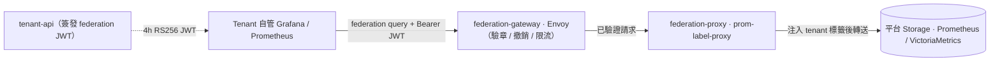

# ADR-020: Tenant Federation — Label-Injection Proxy over Self-Built Endpoint

> Tenant-user 拉取**自己**的 metrics 子集回 tenant 側 infra 自管 federation。
> 平台**不自寫** federation endpoint，採 prom-label-proxy 做 label-enforced rewriting。
>
> 與 [ADR-004 (Federation — Central-Exporter-First)](./004-federation-central-exporter-first.md) 是兩件事：ADR-004 是**平台內部**多叢集 federation（中央 exporter 服務邊緣 Prometheus），本 ADR 是**跨平台邊界** federation（tenant 把自己的 metrics 拉回 tenant 自有 Prom/VM 自管）。

## 狀態

✅ **Accepted**（v2.8.0 起草，issue [#380](https://github.com/vencil/Dynamic-Alerting-Integrations/issues/380)；v2.9.0 federation epic 實作期間經 owner 拍板正式昇格，設計鎖定見 issue [#504](https://github.com/vencil/Dynamic-Alerting-Integrations/issues/504)）

> EN mirror：原規劃「進入 `Accepted` 後再起 EN 翻譯」已不執行 —— 平台語言政策定案「中文為主 SSOT、不執行 ZH→EN 遷移」後，ADR EN mirror 慣例停止（ADR-019 同樣無 EN mirror）。本 ADR 不另製 `.en.md`。

## 背景

### 客戶需求

進入 v2.8.0 客戶導入準備階段，多個 prospective customer 在 RFP / pre-onboarding 訪談中提出需求：

- 我們已有自己的 Prometheus / VictoriaMetrics infra（NOC / SRE team 自管）
- 想把**屬於我們自己** tenant 的 metrics 子集拉回我們 infra，做：
  - 自己 SRE team 的 long-term retention（平台側預設 retention 可能不滿足合規）
  - 整合到自己既有 Grafana dashboard / oncall workflow
  - 自管告警 evaluation（不依賴平台 Alertmanager）

**注意定位**：這不是「平台幫客戶 federation」（那是 [ADR-004](./004-federation-central-exporter-first.md)），是「**客戶從平台拉自己的 metrics 出去**」。資料流向相反，trust boundary 也不同——ADR-004 是「平台信任邊緣叢集（同組織內 N 個 cluster）」的 inbound 場景；ADR-020 是「平台對客戶（cross-org）」的 outbound 場景，被取走的資料離開平台控制邊界後就可能被 tenant 自己再轉、再存、再泄。Multi-tenant isolation 與 audit 需求因此更嚴格。

### 既有 federation 架構覆蓋空白

| 場景 | 既有方案 | 缺口 |
|---|---|---|
| 平台內部多叢集 federation | ADR-004 中央 exporter + 邊緣 remote_read | ✅ 覆蓋 |
| 平台自管 alert eval | tenant-api SSE + Alertmanager | ✅ 覆蓋 |
| **Tenant 拉自己 metrics 回 tenant 側自管** | ⛔ **無方案** | 🎯 本 ADR |

### 為什麼這是個棘手的問題

「給 tenant 開一個 read endpoint 把自己 metrics 拉出去」表面簡單，實際有四個交叉約束：

1. **Multi-tenant isolation**（強制）— Tenant A 絕對不能讀到 Tenant B 的資料。Platform 後端 storage（VictoriaMetrics / Mimir / Prom）通常**沒有強制的 label filter**：寫一個自寫 endpoint 容易在 label sanitization 漏一個矩陣維度（cluster / node / namespace 在某些 metric 上不帶 tenant），變成 multi-tenant breach。
2. **Blast radius**（強制）— Tenant 拉自己 100 萬 series 的查詢若沒限制，會把 platform storage 拖垮（影響其他 tenant + 影響平台 alert eval pipeline）。
3. **Auth / Token lifecycle**（強制）— Token 簽發 / 失效 / 替換 / 撤銷的 surface。
4. **平台 engineering cost**（限制）— 自寫 endpoint + 多 tenant rewrite engine 是 6+ month workload；在單一 minor release 的時程內不現實。

### 設計討論紀錄

[Issue #380](https://github.com/vencil/Dynamic-Alerting-Integrations/issues/380) 記錄四輪 strategic discussion 與兩輪外部 adversarial review，locked decision 摘要：

- **不自寫 endpoint**：用既有開源 proxy（prom-label-proxy）做 label injection
- **MVP 2-tier policy**（Platform whitelist + Tenant subset）— Domain layer 暫 drop 到 Future Work
- **Token TTL 4h + 無 server-side revocation list** — 明寫 trade-off 換實作簡單
- **Blast radius 三件組**：concurrency cap / request timeout / series count cap
- **3-tier permission model**（include compliance / audit 角色分離）→ Future Work，等 compliance 客戶觸發再做

## 決策

### 主決策

**採 prom-label-proxy 作為 label-enforced read proxy，不自寫 federation endpoint。**



prom-label-proxy 是 prometheus-community 維護的成熟開源工具，front 任何相容 Prometheus query API 的後端（Prometheus / Thanos / 單機 VictoriaMetrics），在 query path 強制把 `{tenant="<X>"}` 注入所有 selector。

**VictoriaMetrics cluster** 模式不經 prom-label-proxy：其租戶隔離由 API gateway 直接把 URL 改寫到 `/select/<accountID>/prometheus/` 達成（gateway 已從驗證過的 JWT 取得 `tenant_id`）。proxy 選型理由（為什麼不是 vmauth）見 §為什麼不用其他方案。

Platform 側只負責：

1. **Helm chart** 把 prom-label-proxy 拉進部署（`helm/federation-proxy` chart，issue [#506](https://github.com/vencil/Dynamic-Alerting-Integrations/issues/506)；front Prometheus / Thanos / VictoriaMetrics 單機）
2. **tenant-api token endpoint** 簽發 / 列舉 / 撤銷 tenant federation token
3. **Policy schema validation**（platform whitelist + tenant subset 兩層）
4. **Audit log + anomaly metric**（誰拉了什麼、拉多少、是否超 cap）

### MVP 範圍（2-tier policy）

**架構安全聲明 —— 安全邊界與治理邊界分離**：

- **安全邊界（資料平面）**：跨租戶隔離 100% 來自 prom-label-proxy 在 query path 強制注入的 `{tenant="<X>"}` label matcher。租戶查得到的資料恆等於「帶它自己 `tenant` label 的 series」—— 前提是該 metric 在 data-layer 確實帶 `tenant` label（見 §前提約束；缺 label 時結果為 empty vector，不是洩漏）。
- **治理邊界（控制平面）**：2-tier policy（platform whitelist + tenant subset）是 UI catalogue、admission validator 檢查標的、subset 策展的依據，**不在 query path 做硬阻擋**。緊急阻斷某 metric 外洩須走 ingestion 階段（見下方 ⚠️）。

```
┌───────────────────────────────────────────────┐
│ Platform whitelist (maintainer-managed)       │
│ 允許 tenant 拉的 metric name + label 範圍上限 │
└───────────────────────────────────────────────┘
                    ↓ intersect
┌───────────────────────────────────────────────┐
│ Tenant subset (tenant-self-managed via API)   │
│ Tenant 從 whitelist 中選自己要拉的子集        │
└───────────────────────────────────────────────┘
                    ↓ inform（非 enforce）
┌───────────────────────────────────────────────┐
│ prom-label-proxy                              │
│ 強制注入 tenant="<X>" 到所有 query            │
└───────────────────────────────────────────────┘
```

**為什麼 whitelist 不能在 query path 強制**：prom-label-proxy 只做 label 注入、無 metric-name allowlist 能力，gateway 也無法可靠地用 regex 從 PromQL AST 攔截 metric name。租戶若查 whitelist 外的 metric，proxy 一樣注入它自己的 tenant label，它只會拿到自己的資料（查自己的 custom metric 因此是 feature，不是漏洞）。`tenant subset ⊆ whitelist` 的不變式為治理一致性、非安全邊界：靜態檔案過期時以 read-repair（讀取端取交集）修復，不掃改租戶檔。

> **⚠️ Hard-revocation 警告**：whitelist 不在 query path 強制執行，所以**從 whitelist 移除一個 metric 無法阻斷對它的查詢**。read-repair 只擋「發現」（GET 不再列出它），擋不住「已知名稱的查詢」：已知該 metric 名稱的租戶仍可直接對 gateway 送該 PromQL、無阻礙地拉到自己的資料。**若需緊急阻斷某 metric 被 federate（例如該 metric 被發現夾帶 PII），改 whitelist 無效**——必須在 **ingestion 階段**處理：Prometheus / VictoriaMetrics 的 `relabel_configs` 以 `drop` action 丟棄該 metric，或調整底層存取權限。federation proxy 不具備阻擋特定 metric 的能力。

**Domain layer**（讓 tenant 內再分 sub-team scope）**留 Future Work**。理由：v2.9.0 customer base 是「單一 SRE/NOC team 拉自己 tenant 全部」，sub-team scope 是更晚的需求；現在做會增加 2-tier → 3-tier schema 複雜度，但無 customer signal。

### 前提約束：Data-layer Label Enrichment Guarantee

平台 data-layer 的租戶 label 名為 **`tenant`**（Prometheus relabel `target_label: tenant`、threshold-exporter、tenant-scoped rule pack 一律 `on(tenant)`）。本 ADR prose 凡指「proxy 注入到 metric 的 label」一律為 `tenant`。JWT claim 名為 `tenant_id`——claim 名與 metric label 名為獨立命名空間，互不要求一致；§Token model 與 token JSON 範例的 `tenant_id` 即 claim。data-layer 租戶 label 現況盤點詳 [`federation-label-enrichment-audit.md`](../internal/federation-label-enrichment-audit.md)（issue [#505](https://github.com/vencil/Dynamic-Alerting-Integrations/issues/505)）。

所有 platform whitelist 列入的 metric，平台**必須**確保在 ingest / scrape 階段（Prometheus `scrape_configs.relabel_configs`、VictoriaMetrics `relabel_config`、或統一 ingestion pipeline）已可靠注入 `tenant` label。

**為什麼這是 prerequisite**：proxy 在 query path 強制把 `{tenant="<X>"}` 注入到所有 selector。如果某 metric 原生不帶 `tenant` label，query 結果就是 empty vector——tenant 看到「dashboard 空白」，會報修「federation 壞了」，SRE 要從 token 一路查到 scrape config 才能發現是 data-layer 沒打 label。是個典型的 silent-failure 地雷。

**典型踩坑 metric 來源**（無 `tenant` native label）：

- `container_*`（cAdvisor）
- `node_*`（node-exporter）
- `kube_*`（kube-state-metrics）
- 任何透過 federation 從上游 Prom 抓進來、上游沒打 tenant label 的 metric

#### Admission validator（soft gate + force override）

whitelist 加入新 metric 時，admission validator 對「過去 24h 該 metric 在後端 storage 至少有一筆帶 `tenant` label 的 sample」做檢查（2-tier policy schema 與 admission validator 見 issue [#510](https://github.com/vencil/Dynamic-Alerting-Integrations/issues/510)）。

檢查只走 **Series metadata API**（`GET /api/v1/series`），不用 range query —— 後者會把 24h raw sample 載進記憶體、對高基數 metric 把 Prometheus 打到 OOM。探測用 `metric{tenant!=""}` 把過濾下推 TSDB inverted index（近零成本）；每次呼叫三重 bound（`limit=1` + `io.LimitReader` + `context` 5s timeout），validator 自身不會變成 resource sink。後端不可達 / timeout 視為 WARN（查不到無法證明 metric 壞）。validator 另含 **PII label-name heuristic**：metric 的 label 名命中 `email` / `customer` / `user_ip` 等樣式 → 列為 advisory soft warning（非 hard block，heuristic 必然不精準）。

hard-block 的判準是「**沒有任何** series 帶 `tenant` label」，**不是**「有 series 缺 label」。K8s 共享叢集裡 `up` / `container_*` 等 metric，租戶 pod 帶 `tenant`、平台 pod（kube-system / API server）不帶——proxy 注入 `{tenant="<X>"}` 已把每個租戶隔離到自己的 series，平台那些無 label 的 series 無害。若以「任一 series 缺 label」為準則，會把所有 K8s 原生 metric 永久 hard-block。故探測 `metric{tenant!=""}`：非空即 Pass。

**輸出分三種**：

| 觀察結果 | Validator 行為 | 為何 |
|---|---|---|
| metric 有帶 `tenant` label 的 series | ✅ Pass | 該 metric 可 federate；共用 metric 上同時存在的無 `tenant` 平台 series 不影響（proxy 注入 `{tenant="<X>"}` 自動隔離） |
| metric 有 sample、但**沒有任何** series 帶 `tenant` label | ⛔ **Hard block** | True positive failure mode——scrape config 沒打 label，federate 後對所有租戶都是 empty vector |
| 過去 24h 完全無 sample | ⚠️ **WARN，不 block**——要求 admin 顯式 `--force` 才能通過 | Cold start（新 tenant deploy 新 service）/ sparse metric（`critical_error_count` 週發一次）都是合法情境；hard block 會卡死合法 whitelist 更新 |

`--force` bypass 路徑同時寫進兩處稽核軌跡：tenant-api 的 slog audit line，以及該次 git commit message 的 `[Bypass-Validator]` trailer（operator + reason + metrics）—— commit message 是 GitOps 不可繞、不會 rotate 的固化軌跡。hard block **不可** `--force`。**為什麼不直接 hard block 全部**：cardinality guard 也是 soft gate 設計（[ADR-017](./017-defaults-yaml-inheritance-dual-hash.md) precedent）——平台級防護要區分「結構性錯誤（hard block）」與「資料時序性缺漏（warn + 人工確認）」，否則 false positive 把合法 ops 鎖死。

### Token model

| 屬性 | 設計選擇 | 理由 / trade-off |
|---|---|---|
| **簽發方** | tenant-api `/api/v1/federation/tokens` POST | 與既有 tenant-api auth pipeline 一致；不另起 service |
| **TTL** | 4h（hardcoded MVP，Helm value 可調） | 4h 在「短到撤銷不重要」與「長到 ops 不痛苦」之間平衡 |
| **撤銷機制** | ⚠️ **無 server-side revocation list**（MVP）。⚠️⚠️ **Compensating control 強制要求**：API Gateway 必須實作嚴格 per-token + per-IP rate limiting（見 §Blast radius Layer 2），確保 4h 曝險窗內外洩 token 即便被併發濫用也無法把後端 storage CPU 打滿 | Trade-off：避免 token revocation table 的 cache / propagation / TTL 複雜度。換來代價：token 洩漏後**最多** 4h 曝險（前提：gateway rate limit 確實到位；缺它則 4h 曝險升級為 4h DoS 樂園）。Gateway rate limit **不是** nice-to-have，是放棄 revocation 的對價 |
| **Scope binding** | token 內 embed `tenant_id` claim，proxy 強制 inject | proxy 不能信 query string 帶的 tenant_id |
| **Refresh** | 過期前 tenant 自行重新簽發；無 sliding refresh | 簡化實作；4h 重簽對 self-service tenant 不痛 |

**簽章金鑰**：RS256 簽章金鑰的生成 / 輪替由 `da-tools fed-key` 命令負責（issue [#518](https://github.com/vencil/Dynamic-Alerting-Integrations/issues/518)）——私鑰吐成 Kubernetes Secret manifest（不落地）、公鑰吐成 JWKS 供 gateway。每把公鑰的 `kid` 為其 **RFC 7638 thumbprint**；tenant-api 簽 token 時對載入金鑰算同一 thumbprint、注入 `kid` header，故 gateway `jwt_authn` 可用 `kid` O(1) 選鑰（輪替期 JWKS 多鑰並存也不會放大壞簽章 flood 的 RSA 成本）。計畫性輪替走 grace-period overlap、私鑰外洩走緊急汰換——標準流程見 [`federation-key-rotation-runbook.md`](../internal/federation-key-rotation-runbook.md)。

### Blast radius：3-layer defense

Blast-radius 控制分布於三層，每層做它最適合的事——`prom-label-proxy` 是極輕量的 label-injection middleware（解析 PromQL AST 注入 label 後把 request 原封轉給後端），不解析 response body、不追蹤 per-token state，無法獨力承擔 series cap 或 concurrency 控制。三層職責一覽：

- **Layer 1 — Storage backend**：query 資源上限（sample / series cap + timeout），防 OOM-by-query。
- **Layer 2 — API Gateway（Envoy）**：per-token / per-tenant 限流 + 並發控制，防 token-level abuse。
- **Layer 3 — Proxy（prom-label-proxy）**：強制 `{tenant="<X>"}` 注入，租戶隔離的核心保證。

三層由內而外標號（Layer 1 = 最內層 storage）；請求實際流向為 gateway → proxy → storage。

#### Layer 1 — Storage backend（series / sample 上限）

| 後端 | Flag / Config | 防護對象 |
|---|---|---|
| Prometheus | `--query.max-samples`（單 query sample 總數上限） + `--query.timeout`（global query 超時） | 防 OOM-by-query |
| VictoriaMetrics | `-search.maxUniqueTimeseries`（單 query 唯一 series 上限） + `-search.maxSamplesPerQuery` + `-search.maxQueryDuration` | 同上 |

平台必須在部署時**強制配置**這些 flag。**Starting default**（上線後觀察實際 customer query pattern 再 tuning）：

| Flag | Starting default | Tuning range | Rationale |
|---|---|---|---|
| Prom `--query.max-samples` | 5M | 5M–50M（Prom native 預設 50M）| federation read 比 internal eval 嚴；5M 是「典型 1000 series × 1d @ 30s scrape ≈ 3M」之上的保守起點，觀察 false-positive 再放寬 |
| VM `-search.maxUniqueTimeseries` | 100k | 50k–300k（VM native 預設 300k）| 同上邏輯；100k 對應「能撐 cluster-wide dashboard panel 但擋 `count by (instance) (...)` 意外高基查詢」 |
| Prom `--query.timeout` / VM `-search.maxQueryDuration` | 25s（storage；gateway 維持 30s）| storage < gateway | **Cascading timeout（非等值）**：storage 須**短於** gateway —— inner layer 先逾時才能砍 query、釋放記憶體並回精確 error code 給 gateway 記錄。兩層相等會 race：gateway 計時較早起跑、會先 504，Prometheus 卻還在跑、clean error 無處可回 |

#### Layer 2 — API Gateway（per-token concurrency + per-token rate limit）

`prom-label-proxy` 沒有 per-token concurrency 原生支援 → 必須由前置 **API Gateway** 擋。Gateway 以 **Envoy**（`distroless` image）實作，交付為 `helm/federation-gateway` chart（issue [#507](https://github.com/vencil/Dynamic-Alerting-Integrations/issues/507)）。選 Envoy 的關鍵：最不能錯的 RS256 驗章交給原生 `jwt_authn` filter（純設定、audited、無 alg-confusion footgun）。

Gateway 的 filter chain 採 cheap-before-expensive 排序：

```
per-IP local_ratelimit
  → jwt_authn（RS256 驗章，kid O(1) 選鑰）
  → Lua（revoked-set 查驗 + 已驗證 tenant header 覆寫）
  → per-token / per-tenant local_ratelimit
  → router
```

per-token + per-tenant 雙層限流以 wildcard descriptor 達成（防單 token 濫用 + 防 round-robin ≤16 token 的 Sybil）。revoked-set 由 Lua filter time-gated 重讀 ConfigMap projected volume。詳 `helm/federation-gateway` chart README。

**Rate limit 取值**：per-token sustained ≈ 30 req/min（平均每 2s 一次 query），對應 Grafana 預設 dashboard refresh interval（30s）× 多 panel 場景的合理上限；容忍「打開 dashboard 一次性發 ~10 個 panel query」的初始 burst。**刻意不用 web API 數量級（如 10 r/s）**：PromQL query 是 CPU/memory-expensive 操作；一個外洩 token 在 4h 曝險窗 + 10 r/s ≈ 144k 次 query，足以把後端 storage CPU 打滿。Web API 預設值對 TSDB read 而言錯了一個數量級。Tuning corridor：panel-heavy customer 可調高至 60 req/min；觀察到 abuse 則降到 15 req/min。

Rate-limit key 用 `token_id`（由 JWT claim 解出），**不是用 IP**——否則公司 NAT 後所有 tenant 互相影響。

#### Layer 3 — Proxy（label injection）

`prom-label-proxy` 在此層只做一件事：強制把 `{tenant="<X>"}` 注入所有 selector（核心安全保證）。

> **Audit log 不在此層**：access log 由 **Layer 2 gateway** 產出（見 §Audit log + anomaly metric），因為只有 gateway 持有 `jwt_authn` 驗證過的 claims（`tenant_id` / `token_id`）；Layer 3 proxy 看不到 token。

**⚠️ Metadata API 防護承諾（critical）**：proxy 的 enforcement 必須**同時涵蓋 Query API 與 Metadata API**，否則跨租戶拓樸資訊外洩：

| API class | Endpoints | 為何必須涵蓋 |
|---|---|---|
| Query API | `/api/v1/query`, `/api/v1/query_range` | 明顯目標 |
| **Metadata API** | `/api/v1/series`, `/api/v1/labels`, `/api/v1/label/<name>/values` | Grafana variable dropdown（`label_values(pod)` 等）走這些 endpoint。**沒擋 = tenant A 在自家 Grafana variable dropdown 看到 tenant B 的 pod name / instance / hostname → multi-tenant breach** |

> ⚠️ 上表 endpoints 為**最常見**且 Grafana 必用的子集，**非 exhaustive**。Prom HTTP API 還有 `/api/v1/metadata`、`/api/v1/targets`、VM `/api/v1/status/active_queries` 等也可能洩漏 metadata。實作的 acceptance criteria 含「完整 Prom HTTP API surface audit」，把所有 query/metadata endpoint 逐一驗 enforcement coverage（不只本表列出的 3 個）。

prom-label-proxy 必須**顯式啟用** label/metadata API enforcement（`--enable-label-apis`；早期版本預設 OFF）。Helm chart 必須 hardcode 啟用，**不開放 customer override**。Smoke test：簽 token A，用它連 `/api/v1/series?match[]={__name__=~".+"}` 查所有 series，驗證 response 不含任何 tenant B 的 label value；同樣對 `/api/v1/labels` 與 `/api/v1/label/pod/values` 各驗一次，並擴張至上述 non-exhaustive note 列出的其他 endpoint。

#### Default 值 rationale（上線後實測可調）

| 控制項 | 預設值 | Where | Rationale |
|---|---|---|---|
| Concurrency / token | 4 | Gateway L7 | 一個 tenant 的 Grafana / 自管 alert eval / oncall 並行 query 通常 ≤ 3；4 留 headroom 擋明顯 abuse |
| Request timeout | gateway 30s / storage 25s | Gateway L7 + storage backend | Grafana 預設 query timeout 在 30s 附近；長跑離線分析應走 batch export 非 federation 即時 path。storage 取 25s（< gateway）為 **cascading timeout** —— inner 先逾時、乾淨回錯；等值會 race |
| Series per query | 100k | Storage backend | 100k series 是「撐得起 cluster-wide dashboard panel」與「不至於 OOM」的中間值；擋住 `count by (instance) (...)` 類意外高基查詢 |
| Sample per query | 5M | Storage backend | 與 series cap 互補：tenant 可能拉低基數但長時段範圍 |

**三層缺一不可，且職責不可錯位**：proxy 擋 label 注入；storage 擋 query 資源；gateway 擋 token-level abuse。錯放層（例如指望 proxy 擋 series cap）= 工程上做不到，最後還是得自寫 middleware，**違背本 ADR 不自寫 endpoint 的初衷**。

### Audit log + anomaly metric

audit log（issue [#511](https://github.com/vencil/Dynamic-Alerting-Integrations/issues/511)）**分兩個維度，物理分離**。

#### Data-plane audit（誰查了什麼）

由 **Layer 2 gateway（Envoy）** 產出，不經 tenant-api。每個 federation request 一筆 JSON：

```jsonc
{
  "ts": "2026-05-11T10:23:00Z",
  "tenant_id": "db-anonymized-001",
  "token_id": "ftk_8a3f...",
  "method": "POST",
  "path": "/api/v1/query_range",              // 截斷 2048 字元
  "query": "rate(http_requests_total[5m])",   // Lua 統一抽取，見下
  "status": 200,                              // 原始 HTTP code
  "duration_ms": 1843
}
```

- **`query`**：Envoy access log 無 native 的 request-body 變數，故由 audit Lua filter（`audit_extract.lua`）**統一抽取** PromQL —— GET 取自 URL query-string、POST 取自 form body，URL-decode、截斷 2048 字元，GET/POST 輸出格式一致。audit / `buffer` filter 置於限流器**之後**，被限流拒絕的請求因此不進 Envoy 記憶體緩衝。
- **`status`**：access log 記**原始 HTTP code**；下游 metric 的 `status` label 才是分桶 enum。
- audit schema **不含** `matched_whitelist_rule`（whitelist 不在查詢路徑執行，沒有「規則匹配」這回事）與 `series_returned`（Envoy 不該 buffer 並解 response body 來數 series——成本過高；blast-radius 的執行靠 storage 的 `--query.max-samples`，不靠 log 算）。

新 metric **`tenant_federation_requests_total{tenant,status}`** 由 gateway pod 的 **mtail sidecar** tail access log 產出（Envoy 原生 stats 無法產生 per-tenant 高基數 label）。`status` label 為 HTTP code 分桶 enum：

| enum | HTTP | 意義 |
|---|---|---|
| `ok` | 2xx | 成功 |
| `client_aborted` | 0 / 499 | client 在收到回應前中斷連線（如 Grafana 切換時間範圍 / 下拉選單時取消查詢）；非平台拒絕，不計入 rejection rate |
| `rate_limited` | 429 | gateway 限流 |
| `auth_failed` | 401 / 403 | JWT 驗證失敗 / token 撤銷 |
| `bad_request` | 其他 4xx（含 422）| 錯誤請求；422 = storage `--query.max-samples` 超標（blast-radius 觸發訊號） |
| `backend_error` | 5xx | 平台故障 |

配 alert `FederationRejectionRateAnomaly`（per-tenant rejection ratio 異常 → `severity: warning`，notify platform ops；非 `severity: none` inhibit sentinel）。該規則 join `tenant_metadata_info`，只評估仍在 conf.d 的活躍租戶 —— 已退租租戶的殭屍 token 持續被 `403` 拒絕（撤銷後、4h TTL 未到期前計入 `auth_failed`，見下「Metric 邊界」）不會誤報（[#550](https://github.com/vencil/Dynamic-Alerting-Integrations/issues/550)）。

> **Metric 邊界**：mtail 以 `tenant_id` 為必要分桶欄位，故**純 JWT 驗證失敗**的請求（偽造 / 過期 token —— `jwt_authn` 在 claim 注入前就 401，access log 無 `tenant_id`）**不計入** `tenant_federation_requests_total`：它們無有效租戶、不屬 per-tenant 用量，屬攻擊噪音，由 Envoy `jwt_authn` 自身的 stats 觀測。被撤銷的 token 不同 —— 那是合法 JWT（claim 已注入）、由 revoked set 擋下的 403，正常計入 `auth_failed`。

#### Control-plane audit（誰授權了什麼）

federation 控制平面操作（簽發／撤銷 token、改 whitelist／subset、`--force` bypass）的稽核軌跡**是既有的兩個持久層，不需另建 store**：

- **token 生命週期** → `tenant-federation-store` ConfigMap 內的 token `Record`（`token_id` / `tenant_id` / `issued_by` / `issued_at` / `expires_at`）+ revoked set。
- **whitelist / subset 變更** → GitOps commit 歷史，每次變更一個 commit，帶 author 與（`--force` 時）bypass trailer（ADR-009 / 011）。
- tenant-api 的 slog request log 為輔助訊號（走 stderr，非持久查詢來源）。

#### 持久化邊界（已知 trade-off）

data-plane audit log 的**持久、可中央查詢的合規儲存不在本 ADR 交付範圍**。平台目前無 log 聚合 stack（無 Loki / ELK / Fluentd / Vector）；把 audit log 寫 per-pod PVC 是 cloud-native anti-pattern——RWO PVC 在 gateway 的 `replicaCount>1` / `podAntiAffinity` 下根本無法多副本掛載，RWX 則拖入 NFS／EFS 依賴。交付的是：

1. **aggregate 層**——`tenant_federation_requests_total` 進 Prometheus，本即 durable + queryable（誰拉多少、拒絕率多少）。
2. **per-request 層**——結構化 JSON 寫 gateway stdout（collector-ready），持久度等同 node container-log 輪替，**尚非中央可查**；另有一份 in-pod emptyDir mirror 供 mtail，為 ephemeral metrics feed，非系統紀錄。

真正的中央 forensic log store（node-level log shipper + Loki／SIEM + retention policy）為 follow-up [#539](https://github.com/vencil/Dynamic-Alerting-Integrations/issues/539)。觸發條件：合規客戶要求中央 forensic 查詢，或 stdout audit log volume 超出 node container-log 輪替可用保留。

> **與 chargeback 無關**：把 audit log 變中央可查（#539）解決的是「合規 forensic 查詢」，不是「計費」—— audit log 記**請求次數**、不記**查詢成本**（掃了幾條 series、耗多少 CPU），不能當帳單來源。federation 流量計費為何不能靠這條 log、正解為何，見 §Future Work item 5。

## 為什麼不用其他方案

### 替代方案 A：Self-built federation endpoint（純自寫）

「在 tenant-api 加 `/api/v1/federation/read` proxy 到後端 storage，自己做 label rewrite。」

**問題**：

1. **Label sanitization 是地雷**：後端 storage 不同 metric 的 label 矩陣不一致（有些 metric 帶 `tenant`，有些只帶 `cluster_id` + reverse mapping）。自寫 sanitizer 漏一個矩陣維度 = multi-tenant breach。prom-label-proxy 在 production 跑了多年，這類 corner case 已被解掉
2. **Engineering cost**：6+ months 寫一個「比現成開源 proxy 還弱」的東西，無 value-add
3. **Maintenance cost**：自寫的安全 patch 要自己追

**結論**：拒絕。Open-source proxy 是「贏家通吃」場景：自寫只虧不賺。

### 替代方案 B：純 RBAC on remote_read（無 proxy）

「給 tenant 後端 Prom 開 read-only user，靠 storage 層 RBAC 做隔離。」

**對 VM 客戶**：VictoriaMetrics 沒有 native multi-tenant RBAC——這條路對 VM 客戶不成立。

**對 Prom 客戶**：

1. **Prometheus 本身沒 multi-tenant RBAC**：要靠 Cortex / Mimir 這種第三方層做，但既有平台後端不是 Mimir（見 `byo-prometheus-integration.md`，平台**不**強制客戶用特定後端）
2. **PromQL metadata leakage**：tenant 可以寫 `count by (tenant) (up)` 之類的 query 探測其他 tenant 是否存在；純 RBAC（檔案級權限 / basic auth）擋不掉這類查詢層資料外洩。**proxy 方案如 prom-label-proxy 在 query path 強制注入 `{tenant="<X>"}` matcher 才擋得住**——這正是它存在的原因
3. **Audit 缺口**：純 RBAC 只記「誰連線」，不記「誰拉了什麼 query / 多少 series」；compliance 要求的查詢層稽核做不到

**結論**：拒絕。沒有 universal 後端 RBAC；prom-label-proxy 本來就是補這缺口的方案。

### 替代方案 C：Push-based（remote_write to tenant）

「平台主動 remote_write tenant 自己的 metrics 到 tenant 端 Prom/VM。」

**問題**：

1. **逆向 trust**：平台要主動連到 tenant 內網，network ingress 與 firewall 規則複雜度爆炸
2. **Tenant 控制權**：tenant 沒法選擇拉什麼、何時拉、拉多少；只能照平台 push 的 schedule
3. **Backpressure**：tenant 端 storage 滿了 / 慢了，會反壓回平台 remote_write queue
4. **Multi-tenant ergonomic 倒置**：tenant N 個的話平台要維護 N 條 outbound remote_write，運維極差

**結論**：拒絕。Pull-based 是 Prom ecosystem 的 first-principle，不要違背它。

### 替代方案 D：label-injection proxy（採用）

優點（vs A/B/C）：

- **Engineering cost**：用既有開源 proxy + Helm 整合，相對自寫 6+ months 是數量級的節省
- **Label injection 安全性**：prom-label-proxy 在 label injection / query rewrite 範疇是 multi-year production-hardened（**注意 scope 限定**：proxy 不負責 series cap / 並發控制——那些靠 storage backend + API gateway，見 §Blast radius 3-layer。但每層用的都是 well-established 工具，不是自寫）
- **Ecosystem 對齊**：Prom 客戶看到 prom-label-proxy = 熟悉，沒新東西要學
- **後端解耦**：proxy 在「客戶 → 後端 storage」中間，後端 storage 換什麼（Prom / VM / Mimir）proxy 都吃

缺點（已接受）：

- **3 component coordination**（proxy + gateway + storage backend）比自寫單 endpoint 多三套變動點，每次 upstream 升級要 multi-layer regression
- VM cluster 模式的隔離不走 proxy，改由 gateway URL rewrite 處理——架構上多一條分支

**結論**：採用。本 ADR 主決策。Multi-component 缺點 acceptable，因為每層都是 well-established 工具，不是自寫——比自寫 endpoint 的單點變成「全平台單點 multi-tenant breach 風險」要好。

### Proxy 選型：prom-label-proxy 而非 vmauth

採用 label-injection proxy 後，仍要在 vmauth 與 prom-label-proxy 間選一個。設計初稿曾規劃「VM 客戶走 vmauth、Prom 客戶走 prom-label-proxy」的配對，盤點後確認不可行：

1. **vmauth 不做 label 注入**：vmauth 是 auth router，不解析 PromQL、不注入 label matcher。其多租戶僅靠把使用者路由到 VictoriaMetrics cluster 的 `accountID` 路徑達成，對單機 VM 無隔離能力。
2. **vmauth 吃不下動態 JWT**：vmauth 靠**靜態 `auth.yml`** 的 username / bearer token 路由，無法消化 tenant-api 動態簽發的 RS256 federation JWT（4h TTL，每次簽發都重寫 `auth.yml` 不可行）。

故統一採 prom-label-proxy。VictoriaMetrics **cluster** 的租戶隔離不走 proxy，改由 API gateway 直接 URL-rewrite 到 `/select/<accountID>/prometheus/`（gateway 已從驗證過的 JWT 取得 `tenant_id`）。

## 實作計畫

本 ADR 經 v2.9.0 federation epic（[#380](https://github.com/vencil/Dynamic-Alerting-Integrations/issues/380)）實作完成，工作分解：

| 階段 | 內容 |
|---|---|
| 1 | 本 ADR draft + 外部 adversarial review |
| 2 | prom-label-proxy 整合 + `helm/federation-proxy` chart |
| 3 | API Gateway（Envoy）rate-limit `helm/federation-gateway` chart + JWT claim extraction |
| 4 | Storage backend tuning：平台 Prometheus deployment 加 `--query.max-samples` / `--query.timeout`（BYO-VM 的 `-search.maxUniqueTimeseries` 等以文件交代，VM 非平台部署元件）|
| 5 | tenant-api token endpoint：`POST/GET/DELETE /api/v1/federation/tokens` + 簽章 + ConfigMap-backed 持久化 |
| 6 | 2-tier whitelist/subset policy schema + admission validator（`tenant` label-enrichment 驗證，擋 empty-vector silent failure）|
| 7 | Audit log + anomaly metric：結構化 log + sentinel alert + Grafana dashboard |
| 8 | Metadata API smoke test：簽 token A 驗 `/series`/`/labels`/`/label/<name>/values` 都不洩 tenant B 拓樸 |
| 9 | 端對端整合測試 + user-facing guide + Helm chart README + sample policy |

各階段的 sub-issue 與 PR 追溯見 epic [#380](https://github.com/vencil/Dynamic-Alerting-Integrations/issues/380)。設計過程中，外部 adversarial review 補入了三層 blast-radius defense（原稿誤把三件組全放 proxy layer）、admission validator 的 `tenant` enrichment 驗證、以及 Metadata API smoke test——這些都已併入上表。

## 後果（Consequences）

### 正面

- Tenant 拿到 standards-compliant federation 介面（Prom remote_read / VM read API），整合既有 oncall workflow 零摩擦
- Platform engineering cost 相對自寫 6+ months 是數量級的節省
- Multi-tenant **label-level** isolation 由 production-hardened proxy 保證；resource isolation 由 storage backend 強制；rate isolation 由 API gateway 強制——三層每層都是 well-established 工具，不是自寫
- 後端 storage 演進不影響 federation 介面（proxy 抽象層解耦）
- 2-tier policy 讓 platform 與 tenant 各自有 audit-able 控制點

### 負面

- **3-component coordination**（proxy + API gateway + storage backend）——每次 upstream 升級要 multi-layer regression；任一層配錯都會造成 silent failure 或安全破口
- Token TTL 4h + 無 revocation list = token 洩漏曝險窗 4h；**critical dependency on gateway rate limit**——gateway 配錯 → 4h 變 DoS 樂園
- **Data-layer prerequisite**：所有 whitelist 列入的 metric 必須在 ingest/scrape 階段帶 `tenant` label；admission validator 是必需，不是 nice-to-have
- **Metadata API coverage 是非顯性風險**：prom-label-proxy `--enable-label-apis` 是顯式 flag——Helm chart 設計時容易只想到 `/api/v1/query` 而漏掉 `/series` / `/labels`；smoke test 是這個非顯性風險的安全網
- **Admission validator soft-gate 留人為判斷空間**：`--force` 路徑（針對 cold-start / sparse-metric）依賴 admin 判斷正確性；audit log 是事後追蹤手段，misuse 仍可能埋雷
- Domain layer scope 在 MVP 缺席，sub-team 客戶來時要 schema migration
- prom-label-proxy 上游 break change，platform Helm chart 須同步更新
- Audit log size：每個 federation request 寫一筆 → tenant 高頻拉時 log volume 不小，需 retention policy

### 中性

- 新 tenant-api endpoint 一組（`/api/v1/federation/*`）— 比照既有 `/api/v1/events` / `/api/v1/tenants` 風格
- 文件多一份 [`docs/integration/tenant-federation.md`](../integration/tenant-federation.md) — 租戶 onboarding 操作指南（與 [`federation-integration.md`](../integration/federation-integration.md) ADR-004 平行）
- 新增 platform Grafana dashboard：3-layer rejection rate（gateway 429 / proxy 4xx / storage 5xx）給 platform ops 觀察 blast radius hit rate

## Future Work

按優先排序：

1. **Server-side revocation list**（觸發條件：compliance 客戶 RFP 顯式要求 / 第一次 token 洩漏事件）。設計時須處理 cache propagation TTL（典型 5min vs 即時 invalidate 二選一）
2. **Domain-layer policy（3-tier）**（觸發條件：tenant 內 sub-team 隔離需求）。schema 從 `{platform_whitelist, tenant_subset}` 擴成 `{platform_whitelist, tenant_subset, domain_scope}`
3. **3-tier permission model**（compliance / audit / operator 角色分離）— 觸發條件：合規客戶（SOX / ISO 27001 / SOC 2）。可能與「server-side revocation」同時 trigger，一起做
4. **Series cap auto-tuning**：依 tenant 歷史 federation 流量 dynamic 調 `max_series_per_response`（避免一刀切過鬆 / 過嚴）
5. **Federation 流量 chargeback**（觸發條件：平台商業化、federation 流量要計費）。**不可**靠 gateway audit log 加總 —— `tenant_federation_requests_total` 只計「請求**次數**」，分不出一次拉 10 條 series 還是 100,000 條（IV-2f 刻意砍掉 `series_returned`：Envoy 不該 buffer + 解壓 + 解析 response body 數 series，成本過高），一次重查詢與一次輕查詢計同樣的帳不可行。正解：開後端 storage 的 query logging（Prometheus 的 `query_log_file` 全域設定 / VictoriaMetrics 的 query log）→ 倒進中央 log store → 由離線大數據 pipeline 非同步算每個 `tenant_id` 實際掃描的 series 數與 CPU 時間，作為企業級帳單來源。中央 log store 基礎設施可與 item 6 / [#539](https://github.com/vencil/Dynamic-Alerting-Integrations/issues/539) 一起評估（#539 收 gateway audit log、chargeback 另需 storage query log 進同一個 store）。前置盤點見 [#552](https://github.com/vencil/Dynamic-Alerting-Integrations/issues/552)。
6. **中央 forensic log store**：node-level log shipper + Loki／SIEM + retention policy，把 data-plane audit log 變成中央可查的合規儲存（follow-up [#539](https://github.com/vencil/Dynamic-Alerting-Integrations/issues/539)）

## 關聯

- **[ADR-004 (Federation — Central-Exporter-First)](./004-federation-central-exporter-first.md)** — 平台內部多叢集 federation。本 ADR 與之**互補**（platform-internal vs cross-boundary），非取代
- **[ADR-009 (Tenant Manager CRUD API)](./009-tenant-manager-crud-api.md)** — tenant-api 既有 endpoint pattern，本 ADR 的 token endpoint 沿用其 conventions
- **[`docs/integration/tenant-federation.md`](../integration/tenant-federation.md)** — 本 ADR 的租戶 onboarding 操作指南（IV-2h）
- **[`docs/integration/victoriametrics-integration.md`](../integration/victoriametrics-integration.md)** — §7「已知 gap / Future Work」table 已預先 cross-link 本 ADR
- **[Issue #380](https://github.com/vencil/Dynamic-Alerting-Integrations/issues/380)** — 本 ADR + federation 實作 epic

## 相關資源

| 資源 | 相關性 |
|------|--------|
| [004-federation-central-exporter-first](004-federation-central-exporter-first.md) | ⭐⭐⭐ |
| [009-tenant-manager-crud-api](009-tenant-manager-crud-api.md) | ⭐⭐ |
| [federation-integration](../integration/federation-integration.md) | ⭐⭐ |
| [victoriametrics-integration](../integration/victoriametrics-integration.md) | ⭐⭐ |
| [README](README.md) | ⭐⭐ |
