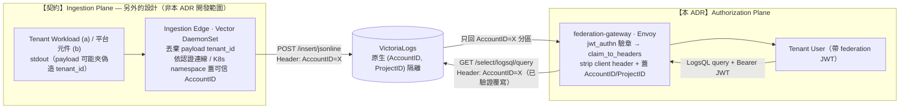

# ADR-021: Tenant Log Query — Authorization-Plane-Only, Ingestion-Decoupled

> Tenant-user 在**平台上**查詢屬於**自己**的 log（query-in-place，不拉回 tenant 側）。
> 平台**只負責授權平面**（租戶身分解析 + query path 強制隔離 + 可見度治理）；
> log 如何「集中送進平台並蓋上可信租戶身分」是**解耦的另一份設計（ingestion plane）**，本 ADR 以**顯式可驗證契約**約束它。
>
> 與 [ADR-020 (Tenant Federation — Label-Injection Proxy)](./020-tenant-federation.md) 是**姊妹件**：ADR-020 讓 tenant 把 metrics **拉回**自有 infra（pull-back，prom-label-proxy 注入 `{tenant="X"}`）；本 ADR 讓 tenant 在平台上**就地查**自己的 log（query-in-place，VictoriaLogs 原生 `(AccountID, ProjectID)` 租戶隔離）。資料流向與隔離原語都不同，但**授權平面複用同一套 federation-gateway**。

## 狀態

✅ **Accepted**（v2.9.0 起草，tracking `TRK-316`）。

實作分層、版本定位：

| 階段 | 內容 | 定位 |
|---|---|---|
| **Phase 1 — (b) 平台營運 log** | tenant 查「平台**關於該租戶**」的營運 log（federation audit、告警 eval 等）。資料部分**已存在**（[#539](https://github.com/vencil/Dynamic-Alerting-Integrations/issues/539) audit stream 已帶 `tenant_id`）。`ProjectID=0` | **v2.10.0 實作開發**（milestone 待建立）|
| **Phase 2 — (a) 租戶應用 log** | tenant 查自己 workload 的應用 log。需「另外的設計」ingestion epic 把 log 集中送進平台。`ProjectID=1` | **Defer-with-trigger**（Future Work，見文末）|

> **EN mirror**：依平台語言政策（中文為主 SSOT、不執行 ZH→EN 遷移），本 ADR 不另製 `.en.md`（同 ADR-019 / ADR-020）。

## 背景

### 客戶需求與訊號強度

進入客戶導入後，浮現「tenant-user 想在平台上查自己 log」的需求：

- 客戶**當前實際場景是 (a)**——想查自己 workload 的應用 log，但**不一定要拉回**自有 infra；就地在平台查即可。
- 平台側**自評 (b) 是必要的**（讓租戶看「平台關於它的營運可觀測性」，例如告警為何觸發/沒觸發、它的 federation 行為），且 (b) 能作為**可延伸到 (a) 的方向**。
- 訊號強度：**soft signal**——「隔離若做得夠硬，可主動對客戶提議」，尚非硬性 RFP。故 (a) 列 defer-with-trigger，(b) 先行。

**定位**：這是 cross-org（平台對客戶）的 outbound 讀取場景，trust boundary 與隔離/稽核需求等同 ADR-020 等級。

### 既有覆蓋空白

| 場景 | 既有方案 | 缺口 |
|---|---|---|
| Tenant 拉自己 metrics 回 tenant 側 | ADR-020 federation（prom-label-proxy）| ✅ 覆蓋 |
| 平台內部 log 中央聚合（gateway audit / prom query log）| #539 Vector + VictoriaLogs | ✅ 覆蓋（但**僅平台內部 log**；#539 non-goal 明列「tenant-side log shipping」）|
| **Tenant 在平台上就地查自己的 log** | ⛔ **無方案** | 🎯 本 ADR |

### 為什麼這是個棘手的問題

1. **隔離是 query-in-place 也逃不掉的核心**——Grafana 層過濾是 client-side trust，**不是安全邊界**；隔離必須由後端強制。
2. **隔離是 joint property**——`ingestion-stamping × read-enforcement` 兩端任一弱即 breach。本 ADR 只 own read-enforcement，故 ingestion 蓋章必須以**顯式契約 + 驗證**約束，不能「假定別人做對」。
3. **平台 log store 是 VictoriaLogs（LogsQL），不是 Prometheus（PromQL）**——直覺上「沿用 ADR-020 的 prom-label-proxy」**不成立**（見 §為什麼不用其他方案 A）。
4. **平台營運 log 含基礎設施拓樸**（node name、internal IP、他租戶 namespace 命名）——直接開給租戶會 infra-leak，需可見度治理。

### 設計討論紀錄（locked decision 摘要）

本 ADR 經多輪 Socratic ideation + 兩輪外部 adversarial review（含一輪 verify-don't-claim 火力偵察），locked decision：

- **只 own 授權平面**；ingestion 蓋章解耦為「另外的設計」，以契約約束。
- **隔離原語 = VictoriaLogs 原生 `(AccountID, ProjectID)`**，由既有 federation-gateway 注入 header 強制；**非** prom-label-proxy、**非**自寫 LogsQL injector、**非** vmauth。
- **(b) 先行（v2.10.0）→ (a) defer-with-trigger**；以統一 AccountID 原語讓兩者共用同一授權平面。
- **ProjectID 分流 (a)/(b)**；**AccountID 單調配發、永不回收**。
- **Fork B = ingest-time 敏感欄位 drop**（read-time strip 留 Future Work）。
- **Admission validator = 結構性探測 + 告警**（不自動熔斷）。

## 決策

### 主決策

**採 VictoriaLogs 原生 `(AccountID, ProjectID)` 租戶隔離，由既有 `helm/federation-gateway` 新增 `victorialogs` mode 從驗證過的 JWT claim 注入租戶 header；平台不自寫 query endpoint、不自寫 LogsQL filter。**



**Gateway 為什麼能無痛承載**：`helm/federation-gateway`（ADR-020 Layer 2）已是 **mode-pluggable**——現有 `prom-label-proxy` mode（metrics label 注入）與 `vm-cluster` mode（Lua 做 `/select/<id>/` path rewrite）。**log 是第三個 mode `victorialogs`**：注入 `AccountID`/`ProjectID` **header**（非 label、非 path）。`envoy.yaml` 既有的 `jwt_authn`（`payload_in_metadata: fed_payload`）+ `revoked_check.lua`（verified-identity header wiring）+ per-IP / per-token / per-tenant 三層限流 + audit log，**全部現成複用**。

> **⚠️ Fail-closed invariant（Null-Claim Trap 防線）**：若 token 缺 `account_id` claim（tenant-api bug / 空字串），`claim_to_headers` **不會注入** header；VictoriaLogs 對缺 `AccountID` header **預設導向 `0`（platform default）**→ 租戶誤讀平台 log = 越權。故 gateway **route 層必須加 header 存在性 matcher**：經 `jwt_authn` 後仍不具合法 `AccountID` header 的請求，在 route 直接 `direct_response 403`（比照既有 `/api/v1/read` reject route），**絕不允許未標記流量穿透到 VictoriaLogs**。配合 vhost `request_headers_to_remove`（擋 client 自帶）形成雙向封閉。

平台側只負責：

1. **Gateway `victorialogs` mode**（驗章 → 蓋租戶 header → VictoriaLogs query/metadata 路由白名單）。
2. **tenant-api**：onboarding 配發穩定 uint32 AccountID、簽 federation JWT 時 embed 數值 claim、列舉/撤銷 token（複用 ADR-020 token 機制）。
3. **可見度治理**：2-tier log policy（platform whitelist of exposable streams/fields + tenant subset）。
4. **Audit + anomaly metric**（誰查了哪些 log、是否異常）。

### 前提約束：Ingestion-Edge Tenant Stamping Guarantee（the contract）

> **本 ADR 的隔離保證，上限等於 ingestion 端蓋章的誠實度。** 此契約把責任**切出去但不甩鍋**——以顯式、可驗證形式約束「另外的設計」。

ingestion plane（無論 (a) 租戶推送或 (b) 平台元件 stdout）**必須**：

1. **零信任 payload**——log payload 內自帶的 `tenant_id` / 任何租戶身分欄位**一律視為不可信並丟棄**。
2. **基礎設施強蓋章**——租戶身分（→ uint32 AccountID）由 **node 層 Vector DaemonSet 依「認證過的連線 / K8s namespace / GitOps 受控標籤」強制判定**，寫成 VictoriaLogs `AccountID` header。（對照 ADR-020「proxy 不信 query-string `tenant_id`」+「Data-layer Label Enrichment Guarantee」。）

**為什麼這是 prerequisite**：gateway 在 query path 強制注入 `AccountID=X`，若 ingestion 蓋錯/可被偽造，授權平面會「忠實地」把錯租戶的 log 餵出去——garbage-in。這是 silent cross-tenant breach 地雷。

> **Phase 2 (a) 額外前提 — node 隔離硬化（Stamping Illusion 防線）**：(a) 靠 node 層 Vector 依 namespace 蓋章，前提是 K8s pod 邊界可信。租戶 workload 若經容器逃逸（特權逃逸 / 掛 node socket）打穿 pod 邊界，可在 node 層干擾 Vector DaemonSet 或偽造他 namespace 的 cgroup 標籤 → 蓋章失真。故 (a) 開通的**先決條件**含對租戶 workload 強制 Pod Security Standards + AppArmor/Seccomp（屬 ingestion plane 責任，本契約列為 (a) 門檻）。對應既有殘餘風險 [#566](https://github.com/vencil/Dynamic-Alerting-Integrations/issues/566) T2-3（Vector DaemonSet root + `DAC_READ_SEARCH` 讀整 node pod log）。

#### AccountID 配發紀律（security-critical）

| 規則 | 理由 |
|---|---|
| **單調配發、永不回收** | 退租後若把同一 uint32 配給新租戶、舊 log 仍在 retention 窗內 → 新租戶讀得到前租戶殘留 log = 跨租戶洩漏。registry 必須 monotonic，或保證 retention 清空後才重用 |
| **配發紀錄入 Git tenant registry** | GitOps 不可繞軌跡；對映 `tenant_id`(str) ↔ `account_id`(uint32) |
| **JWT embed 數值 claim** | Envoy `claim_to_headers` 只支援 string/int/bool；AccountID 為數值 claim 才能 O(1) 注入 |
| **禁用 hash 映射** | FNV-1a 等 hash 把 `tenant_id`(str)→uint32 有生日悖論碰撞 → 兩租戶撞同 AccountID = 跨租戶洩漏。一律 **Git tenant registry 單調發號**（發號狀態在 Git、commit-on-write，同 conf.d / tenant-api SSOT；**不引入外部 stateful DB**——違背 config-driven 架構，且 uint32 空間 ~40 億充足） |

#### Admission validator（結構性探測 + 告警，不熔斷）

read 端保留驗證機制：探測「**該被蓋章卻掉進 `0:0`（platform default）的異常 log**」（= ingestion 蓋章失效訊號）。

- **行為**：發**標準 Alertmanager alert**（鏡像 ADR-020 `FederationRejectionRateAnomaly`，`severity: warning`，notify platform ops）。**不自動熔斷租戶 query API**——false positive 切斷合法租戶會引發 SLA 事故。
- **不做**：content-based 異常偵測 / 自動斷流（拒絕外審初稿的 over-engineering）。

### MVP 範圍與可見度治理（2-tier log policy）

**安全邊界 vs 治理邊界分離**（同 ADR-020 精神）：

- **安全邊界（資料平面）**：跨租戶隔離 100% 來自 VictoriaLogs 原生 `(AccountID, ProjectID)`——租戶查得到的恆等於「自己 AccountID 分區」。
- **治理邊界（控制平面）**：2-tier policy 是 UI catalogue / 可見度策展，**不在 query path 硬阻擋**。

```
Platform whitelist（maintainer-managed）：哪些平台 log stream / field 對租戶可曝光
            ↓ intersect
Tenant subset（tenant-self-managed）：租戶選自己要看的子集
            ↓ inform（非 enforce）
VictoriaLogs (AccountID, ProjectID)：強制隔離
```

#### Fork B：(b) 平台 log 可見度 = ingest-time drop（預設拒絕、白名單開放）

平台營運 log 含基礎設施拓樸（`node_name` / `pod_ip` / 他租戶 namespace 命名規則…），**預設不對租戶可見**。

- **做法**：Vector 寫入租戶 AccountID 分區**前**，VRL `drop_fields` 拔除敏感欄位 → 落在 `AccountID:X` 的資料 100% 乾淨，gateway 連 read-time strip 漏濾風險都不必承擔。過濾規則入 Git 版控。
- **可見範圍是子集**：(b) 對租戶可見的僅 `log_type=federation_audit` 且帶有效 `tenant_id` 的列；`gateway_operational`（Envoy 操作層錯誤，非租戶可歸屬）與 JWT-fail 列**永遠 platform-only**（落 `0:0`），不進租戶分區。
- **關聯性不斷鏈（Correlation id）**：drop 敏感欄位**之前**，Vector 注入一個全域唯一、無語意的 `log_event_id`，**同時存在於平台完整副本（`0:0`）與租戶淨化副本（`AccountID:X`）**。值班拿租戶截圖報修時，可用此 id 跨分區 join 回完整 node 資訊，避免淨化把 MTTR 拉長。
- **已知 trade-off**：ingest-time drop **事後無法 un-drop**（改 whitelist 要 reprocess）。對「本來就不該給租戶看」的拓樸欄位可接受；動態可調的 read-time strip 留 Future Work。

### Token model

複用 ADR-020 federation JWT（RS256 / 4h TTL / 無 server-side revocation list / gateway rate-limit 為對價補償控制），**新增** `account_id` 數值 claim。

| 屬性 | 設計選擇 | 理由 / trade-off |
|---|---|---|
| 簽發方 | tenant-api（複用 ADR-020 `/api/v1/federation/tokens`，或 in-place 查詢綁平台 Grafana session）| 不另起 service；gateway enforcement 兩者皆同 |
| AccountID claim | onboarding 配發的穩定 uint32，數值 claim | Envoy `claim_to_headers` 直接注入 |
| Scope binding | claim → header，gateway 強制覆寫；vhost `request_headers_to_remove: [AccountID, ProjectID]` defense-in-depth | client 自帶 header 永不漏穿 |
| **能力 scope** | log-query 與 ADR-020 metrics-pull **分離 audience/scope claim**（最小權限）| 持 metrics-pull token 不應自動可查 log，反之亦然；否則一個 capability 洩漏放大成兩個。⚠️ open point：同一 token + scope claim vs 各簽各的，待實作定 |

### Blast radius：3-layer defense（對 VictoriaLogs / LogsQL 重新校準）

沿用 ADR-020 三層職責分工，但**資源模型不同於 Prometheus**——log 沒有 metrics 的 sample/series cap，改以 **time-range 上限**為主護欄。

#### Layer 1 — Storage backend（VictoriaLogs query 上限）

| Flag | 防護對象 | Starting default（上線後可調）|
|---|---|---|
| `-search.maxQueryTimeRange` | **擋無時間過濾 / 過寬範圍查詢**（log 世界的主要 blast-radius 原語）| 例如 `7d`（依 retention 調）|
| `-search.maxQueryDuration` | 單查詢執行時間上限（storage < gateway，cascading）| `25s`（gateway 30s）|
| `-search.maxConcurrentRequests` | 並發查詢上限（RAM 保護）| 保守起點，觀察再調 |
| `-search.maxQueueDuration` | 並發滿時排隊等待上限 | — |

> **與 ADR-020 的關鍵差異**：metrics 端擋 `--query.max-samples` / series cap；log 端**沒有等價 sample cap**，靠 `-search.maxQueryTimeRange` 限時窗。**cascading timeout** 同 ADR-020：storage（25s）須短於 gateway（30s）。

#### Layer 2 — API Gateway（per-token / per-tenant 限流）

**完全複用** ADR-020 既有三層 local_ratelimit（per-IP / per-token / per-tenant，key on `x-fed-token-id` / `x-tenant-id`）。新增 metric **`tenant_log_query_requests_total{account_id, project_id, status}`**（mtail sidecar tail access log，與 ADR-020 `tenant_federation_requests_total` 對稱）。

> **⚠️ 非對稱限流缺口（multi-replica）**：`local_ratelimit` 是 **per-pod**；gateway HPA（#539 觀察 2–8 replica）下，單 token 實際放行量 ≈ 設定值 × replica 數。惡意租戶平行 dump 歷史 log 時可能 N× 擊穿。**Layer 1 backstop**：VictoriaLogs `-search.maxConcurrentRequests` 限制**實際並發執行**——無論 gateway 幾個 replica 都封住真正的 CPU blast（緩解，非根治）。Phase 1 先記錄 + 觀察 429 率 / storage 負載，持續觸發再評估 Redis-backed global rate limit（見 Future Work 7）。

#### Layer 3 — 隔離核心（native tenancy）

VictoriaLogs 原生 `(AccountID, ProjectID)` 即隔離核心。

> **⭐ 比 prom-label-proxy 更乾淨**：ADR-020 需顯式 `--enable-label-apis` 才擋得住 `/series` `/labels` 的 Metadata API 跨租戶拓樸洩漏（非顯性風險 + smoke test 安全網）。VictoriaLogs 的 metadata 類 endpoint（`field_values` / `stream_field_values` 等）**同樣受 `AccountID` header 約束**——租戶查不到別人 AccountID 的 field/stream 值，**metadata leak 由原生租戶模型自動擋掉**，無需額外 flag。（仍須在實作 AC 對完整 VictoriaLogs query/metadata endpoint surface 逐一驗 enforcement coverage。）

> **⚠️ Endpoint allowlist 須顯式逐一放行（非前綴比對）**：VictoriaLogs query surface 含 `/select/logsql/query`（streaming、**預設無 limit**）、`/hits`、`/streams`、`/stats_query[_range]`、`/tail`（**live 長連線**）、`field_values` / `field_names` / `stream_field_values`。寬鬆前綴 `/select/logsql/` 會連 `/tail` 一起放行——長連線**繞過 `maxQueryDuration`**（duration cap 管查詢執行、不管 stream 連線壽命）並長期佔 concurrency slot。故 MVP **顯式 deny `/tail`**（audit log 不需即時 tail），其餘 allowed endpoint 各自驗 AccountID enforcement，`/query` 另靠 `maxQueryTimeRange` + 強制 `limit` 收斂 streaming 量。（VictoriaLogs **無** `/export` endpoint —— 真正的無界風險是 `/query` streaming 與 `/tail` 長連線，非某個 export endpoint。）

### Audit log + anomaly metric

- **Data-plane**（誰查了哪些 log）：gateway access log JSON（`account_id` / `token_id` / LogsQL / status / duration），與 ADR-020 同形物理分離（stdout collector-ready）。聚合層 `tenant_log_query_requests_total` 進 Prometheus。
- **Control-plane**（誰授權/改了可見度）：token 生命週期 → ConfigMap-backed store；whitelist/subset 變更 → GitOps commit 歷史。

## 實作計畫

### Phase 1 — (b) 平台營運 log（v2.10.0）

| # | 內容 |
|---|---|
| 1 | Gateway `victorialogs` mode：`claim_to_headers`/Lua 蓋 `AccountID`/`ProjectID` + `request_headers_to_remove` + VictoriaLogs endpoint route 白名單 + path 正規化（比照現有 `/api/v1/read` reject 那套嚴謹度）|
| 2 | **建立 (b) 租戶淨化投影**：Vector fan-out（平台完整副本留 `0:0` + 租戶淨化副本寫 `AccountID:X`，見下 §Ingestion）|
| 3 | VictoriaLogs Layer 1 flags 上 storage（time-range / duration / concurrency）|
| 4 | (b) ingest-time 敏感欄位 drop（VRL `drop_fields`）|
| 5 | 結構性 admission validator → Alertmanager alert（不熔斷）|
| 6 | 2-tier log visibility policy schema + 可見度 catalogue |
| 7 | tenant-api：AccountID 配發 + 數值 claim + Git registry |
| 8 | `tenant_log_query_requests_total` metric + Grafana dashboard |
| 9 | 端對端整合測試（簽 token A → 查 `/select/logsql/query` 驗只見 A、metadata endpoint 不洩 B）+ user-facing guide |
| AC | **Vector route 行為測試入 CI**：`vector validate`（語法，codify runbook §4.4 手動步驟）+ **`vector test`** 餵空值/惡意 `tenant_id` 的 mock log，斷言 fail-closed 落 `0:0`（驗極端 payload 的確定行為，非僅語法；對齊 lint-everything + 75% coverage gate）；**(b) 淨化 negative assertion**：餵帶**全部**敏感欄位（node_name / pod_ip…）的 mock payload，斷言租戶副本中這些欄位**確實不存在**（測「移除了」而非只測「有產出」）|

#### Ingestion：Fan-out（平台完整副本 + 租戶淨化投影），非搬移

關鍵澄清：(b) **不是把 `0:0` 的資料搬到 per-AccountID**，而是 **fan-out（雙寫）**——平台仍需跨租戶的完整 audit view 自用：

- **平台完整副本**：`federation_audit` + `gateway_operational` 全欄位**續留 `0:0`**（即 #539 現狀，平台 ops 的 cross-tenant 查詢面，**不變**）。
- **租戶淨化投影（net-new）**：Vector `route` 對帶有效 `tenant_id` 的 audit 列，`drop_fields` 淨化 + 注入 `log_event_id`，寫入對應 `AccountID:X`（`ProjectID=0`）。**租戶只有 Day 0 起的歷史**——新 feature 完全可接受，故**無需歷史 backfill / re-index**。
- **`tenant_id`(str) → `AccountID`(uint32) 映射**：route **不能**直接拿字串 `tenant_id` 當 AccountID。Vector 以 **Git tenant registry 衍生的 enrichment table**（與 gateway 同一 SSOT）查表；查不到 → **fail-closed 落 `0:0`**（絕不誤落他租戶）。
- **為何靜態 N-sink 而非單一動態 sink**：Vector `http` sink 的 per-event header 模板在**混租戶 batch** 內會 header 污染（header 是 per-request 屬性，一 batch 一 request；官方 issue [vectordotdev/vector#21402](https://github.com/vectordotdev/vector/issues/21402) 證實同構失敗——壞憑證污染整批；http sink 無 key-partition batching）。故 (b) 用 `route` → 靜態 N-sink（各帶固定 AccountID header）；(a) Phase 2 從 tenant registry **產生** route/sink（config-from-SSOT）。
- **Rollback**：投影是疊加層，revert PR 即停止寫租戶分區、平台 `0:0` 不受影響；零星 orphaned 資料等 retention 回收（VictoriaLogs 不支援單筆刪）。

### Phase 2 — (a) 租戶應用 log（defer-with-trigger）

- 前置：「另外的設計」ingestion epic + namespace 蓋章（零信任 payload）。
- 復用：**同一 gateway mode** + route/sink 從 tenant registry（conf.d / tenant-api SSOT）**產生**（config-from-SSOT，解決靜態 N-sink 在海量租戶不 scale）。`ProjectID=1`。
- Trigger：見 Future Work item 1。

## 為什麼不用其他方案

### A：沿用 ADR-020 的 prom-label-proxy ⛔

prom-label-proxy 解析 **PromQL**、注入 metric label matcher。VictoriaLogs query API 是 **LogsQL**（`/select/logsql/query`，語法完全不同），prom-label-proxy **不認得**——直接擺在 VictoriaLogs 前面不會運作。（這是直覺最容易踩的前提錯誤。）

### B：自寫 LogsQL filter injector ⛔

「在 query 字串 AND 進 `tenant_id:"X"`」——LogsQL 具 pipe stage 與布林邏輯（`OR` / `NOT`），字串拼接**極易被構造語法逃逸**造成跨租戶 breach。這正是 ADR-020 §替代方案 A 拒絕的「label sanitization 地雷」，等於把全平台單點 multi-tenant breach 風險扛回來。

### C：vmauth 動態租戶路由 ⛔

vmauth 雖能注入 `AccountID` header，但靠**靜態 `auth.yml`** 路由，無法消化 tenant-api 動態簽發的 RS256 JWT（4h TTL，每次簽發重寫 `auth.yml` 不可行）——與 ADR-020 拒絕 vmauth 同理。且既有 Envoy gateway 已具 JWT 驗證 + header 改寫，無須再引入第三方元件增加維運負擔。

### D：native tenancy + gateway header 注入 ✅（採用）

優點：複用既有開源原生隔離 + 既有 gateway，工程成本數量級節省；native 隔離自動擋 metadata leak；單一隔離原語（AccountID）讓 (a)/(b) 架構一致。缺點（已接受）見 §後果。

## 後果

### 正面

- **極高 ROI**：複用 #539 現成資料 + Envoy `jwt_authn` + gateway mode-pluggable，開發量小、見效快。
- **堅固隔離**：vendor 原生強隔離 + gateway 邊界覆寫，免自寫 filter 的單點資安風險；**metadata leak 由原生租戶模型自動擋**（無 ADR-020 `--enable-label-apis` 那類非顯性風險）。
- **架構一致性**：營運 log (b) 與未來應用 log (a) 共用單一隔離原語（AccountID），授權平面同一套；ProjectID 在儲存層把 (a)/(b) 劃清。

### 負面

- **Blast-radius 需重校**：LogsQL 資源模型異於 Prometheus（無 sample cap，改靠 time-range）。
- **客戶預期管理**：MVP 階段租戶**只能查平台營運級可觀測性 (b)**，無法查自身應用 log (a)——產品面須清晰引導。
- **per-ProjectID 差異化 retention 不支援（Community）**：VictoriaLogs `-retentionPeriod` 是全域單值；(a) 若需更長合規 retention，須**另起 VictoriaLogs 實例**或上 Enterprise。
- **跨 ProjectID 單查詢不可行**：VictoriaLogs 無 multi-tenant select（feature request [#492](https://github.com/VictoriaMetrics/VictoriaLogs/issues/492) 未實作），租戶同時看 (a)+(b) 須分兩個查詢 context。
- **AccountID 永不回收的維運紀律**：違反即跨租戶洩漏。
- **ingestion 契約是硬外部依賴**：本 ADR 隔離保證上限 = 上游蓋章誠實度；admission validator 是事後手段。
- **單 pod VictoriaLogs 的查詢負載**：#539 把 VictoriaLogs 部署為 single pod + RWO PVC，容量按**寫入**估。租戶查詢是**新的讀負載**疊上去，single pod 同時是查詢 SPOF + scaling ceiling——上線前須重估容量 / HA（runbook §5 capacity 公式只算 ingestion）。
- **非對稱限流（multi-replica）**：per-pod `local_ratelimit` × replica 數 = 實際上限，靠 Layer 1 `-search.maxConcurrentRequests` backstop，未根治（見 Blast radius Layer 2）。

### 中性

- gateway 新增一個 mode（`victorialogs`）；tenant-api 新增 `account_id` claim 欄位；新增 VictoriaLogs query route 白名單。
- 文件多一份租戶 onboarding 指南（與 ADR-020 `tenant-federation.md` 平行）。
- 新租戶剛 onboard、尚無 (b) 活動時查詢得**空結果**（empty，非 error）——預期行為，onboarding 指南須說明（同 ADR-020 cold-start 精神）。

## Future Work

按優先排序：

1. **Phase 2 — (a) 租戶應用 log ingestion + query**。觸發：(i) RFP/合約將「應用日誌代管與合規審計」列為必選；或 (ii) 客戶願付 add-on 增值授權費以合理化 storage 擴容 + DaemonSet 採集架構的常態維運成本。
2. **差異化 retention（per log-class）**。觸發：合規明確要求某類 log 更長保留 → 另起 VictoriaLogs 實例或 Enterprise retention filter。
3. **跨 ProjectID 統一查詢**。觸發：VictoriaLogs [#492](https://github.com/VictoriaMetrics/VictoriaLogs/issues/492) 落地 / 租戶 UX 需求。
4. **Read-time field sanitization**（動態可調可見度，取代 ingest-time drop 的不可逆）。觸發：可見度規則需頻繁調整。
5. **Server-side revocation list**（與 ADR-020 Future Work item 1 共用）。
6. **Log ingestion/query metrics 的 Recording-rule 降維**（複用平台既有 Cardinality Guard + Recording Rule pattern，控 per-AccountID metric 基數）。
7. **Redis-backed global rate limit**（取代 per-pod `local_ratelimit` 的 multi-replica 非對稱缺口）。觸發：租戶頻繁觸發 429 / 觀察到 storage 負載因平行 dump 飆升。

## 關聯

- **[ADR-020 (Tenant Federation — Label-Injection Proxy)](./020-tenant-federation.md)** — 姊妹件（pull-back metrics vs query-in-place logs）；本 ADR 複用其 gateway / token model / 3-layer blast-radius pattern
- **[ADR-004 (Federation — Central-Exporter-First)](./004-federation-central-exporter-first.md)** — 平台內部多叢集 federation
- **[ADR-009 (Tenant Manager CRUD API)](./009-tenant-manager-crud-api.md)** — tenant-api endpoint pattern，AccountID 配發沿用
- **[#539 — Platform log aggregation (Vector + VictoriaLogs)](https://github.com/vencil/Dynamic-Alerting-Integrations/issues/539)** — 本 ADR 的 log store 與 (b) 資料來源
- **[`platform-log-aggregation-runbook.md`](../internal/platform-log-aggregation-runbook.md)** — Vector/VictoriaLogs 維運 SOP

## 相關資源

| 資源 | 相關性 |
|------|--------|
| [020-tenant-federation](020-tenant-federation.md) | ⭐⭐⭐ |
| [009-tenant-manager-crud-api](009-tenant-manager-crud-api.md) | ⭐⭐ |
| [004-federation-central-exporter-first](004-federation-central-exporter-first.md) | ⭐⭐ |
| [platform-log-aggregation-runbook](../internal/platform-log-aggregation-runbook.md) | ⭐⭐⭐ |
