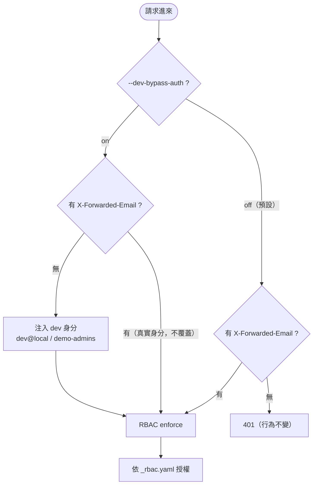

# ADR-022: tenant-api Dev-Auth Bypass — Local-Dev Identity Substitute, Four-Layer Containment

## 狀態

✅ **Accepted**（2026-05-25，v2.9.0 起草）。Tracker：[#464](https://github.com/vencil/Dynamic-Alerting-Integrations/issues/464)。

## 背景

tenant-api 自己不做登入。它信任前方 oauth2-proxy 注入的兩個 header 當身分來源：

- `X-Forwarded-Email` —— 沒有就直接回 **401**。
- `X-Forwarded-Groups` —— 拿去和 `_rbac.yaml` 比對，決定能存取哪些 tenant。

production 一律有 oauth2-proxy 在前面注入這兩個 header，所以運作正常。

問題出在 try-local 的 **Mode 0**（`docker compose up da-portal tenant-api`：不含監控、只起 portal + tenant-api 兩個核心容器，是 showcase 的中心）。這個模式**沒有 oauth2-proxy**，於是：

1. 瀏覽器打開 portal，portal 容器經 compose 網路把請求轉給 tenant-api。
2. 沒有 proxy 注入 header，tenant-api 收到的請求缺 `X-Forwarded-Email`。
3. `/api/v1/me` 回 401、RBAC 全部拒絕。
4. 旗艦的 Tenant Manager 根本開不出來。

我們需要一個「**本機 dev 用的身分替身**」，在缺 header 時補上一個身分。

但這裡有個張力：**在 production binary 裡放任何 auth bypass，本身就是資安風險**。本 ADR 的重點不在「要不要做替身」，而在「**怎麼把這個風險圍住**」。

## 決策

新增一個**預設關閉**的 flag：`--dev-bypass-auth`（或環境變數 `TA_DEV_BYPASS_AUTH`）。

啟用後，一個外層 middleware 的行為很單純：**請求若缺 `X-Forwarded-Email`，就注入一個 dev 身分**（預設 `dev@local` / `demo-admins`，可用 `--dev-bypass-email` / `--dev-bypass-groups` 改）。**若請求已帶真實的 forwarded 身分，絕不覆蓋。**

### 請求怎麼走



兩個關鍵：**flag off 時行為完全不變**（缺 header 照樣 401）；**flag on 時也只補身分、不繞授權**。

### identity-only，不是 RBAC 繞過

注入身分後，**RBAC 照常 enforce**（針對注入的 group），不給 god-mode：注入的 group 能做什麼，仍由 `_rbac.yaml` 決定（try-local 的 seed 提供）。所以即使這個 flag 被啟用，blast radius 也只限於「注入 group 的 RBAC 範圍」。

換句話說，這個 flag 繞過的是**上游的身分 proxy**，不是**授權本身**。

### 跑起來長這樣

```console
# Mode 0：請求沒有 X-Forwarded-* header，flag 已開
$ curl -is localhost:8080/api/v1/me
HTTP/1.1 200 OK
X-Dev-Auth-Bypass: active          # ← Layer 2 tripwire，每個 response 都帶
...
{"email":"dev@local","groups":["demo-admins"],"accessible_tenants":["*"]}
```

啟動時還會印一行很大聲的 WARN，且 `/metrics` 會出現一個 gauge：

```text
WARN ⚠️  DEV AUTH BYPASS ACTIVE — ... LOCAL DEV ONLY; never enable in production.  inject_email=dev@local inject_groups=demo-admins

tenant_api_dev_auth_bypass_active 1
```

## 四層防線

把「prod binary 帶 auth-bypass」的風險用四層圍住（對齊專案既有的四層防線文化）。直覺上：**L1–L2 擋誠實的意外，L3–L4 擋誤佈署**。

| 層 | 機制 | 防什麼 |
|---|---|---|
| **L1 預設 off** | flag 預設 `false`；middleware 只在 flag on 時才掛上（off = 零行為改變、零開銷） | 不會被「不小心」啟用 |
| **L2 可觀測 tripwire** | 每個 response 帶 `X-Dev-Auth-Bypass: active`、`/metrics` 出 `tenant_api_dev_auth_bypass_active 1`、啟動印 loud WARN | 讓「bypass 在 prod 開著」**在任何環境**都被監控 / proxy / `curl` 抓到 —— 包含 L3 偵測不到的非 k8s prod |
| **L3 runtime poison pill** | 啟動時若 flag on 且偵測到 `KUBERNETES_SERVICE_HOST` 或 serviceaccount token 掛載 → **直接 panic**（fail-closed） | k8s production（auth bypass 絕不該在叢集內跑） |
| **L4 deploy-time SAST** | `check_dev_bypass_manifest.py` HARD-block `TA_DEV_BYPASS_AUTH` / `--dev-bypass-auth` 出現在 `helm/`、`k8s/`、operator manifest（pre-commit + CI `Lint`） | 在「引入它的 PR」階段就擋下；涵蓋 L3 看不到的非 k8s manifest |

L3 與 L4 互補：L4 在部署前擋 manifest，L3 是 runtime backstop —— 擋 SAST 看不到的手動 / 極端誤設。

## 替代方案

**為什麼不用 nginx header-injection（在 portal 端掛 nginx.conf 注 header）？**
Windows / WSL2 的單檔 bind-mount 容易觸發 `invalid mount config` 或檔案鎖定，而 try-local 的 Windows 用戶一定會踩到。讓 tenant-api 自己消化 dev-bypass，portal 端就不必掛載任何檔案。

**為什麼 L2 不是「只綁 loopback」？**
原始的四層設計曾用「loopback bind only」當 L2。實作時自審發現它**和 Mode 0 自相矛盾**：portal 容器要經 compose 網路（不是 loopback）連 tenant-api，而 `-p` port-forward 又要求 bind `0.0.0.0` —— loopback-only 會讓 dev-bypass 服務不了它唯一的用途。改用**可觀測 tripwire** 後，不但不與 compose 衝突，還補上了「L3 只擋 k8s」留下的非 k8s-prod 缺口（監控在任何環境都抓得到）。

**為什麼 identity-only，而不是完整 RBAC 繞過？**
為了縮小 blast radius。完整繞過 = god-mode；identity-only 即使被啟用，也只拿到「注入 group 的 RBAC-scoped 權限」。

## 後果

### 正面
- try-local **Mode 0 的 portal-live 解鎖** —— portal 用 published image、不改任何檔案就能在 compose 裡活起來（showcase 的中心）。
- 一個須謹慎處理的平台決策被完整記錄、可追溯。

### 負面 / 取捨
- **production binary 多帶了一個 auth-bypass flag**。已用四層圍住（L3 在 k8s 不可繞、L4 擋 manifest），但它仍是一塊須持續審視的 attack surface。
- **L3 只擋 k8s**：非 k8s 的 prod（VM / bare-metal）不會觸發 L3、也不經過 L4（沒有 manifest）。這個缺口由 **L2 tripwire（監控）** 兜底。本平台 production 以 k8s 為主，殘留風險低。

## 實作

| 部分 | 位置 |
|---|---|
| middleware + k8s guard | `internal/rbac/devbypass.go`（`DevBypassMiddleware` / `DevBypassK8sGuard` / `InKubernetes`） |
| flag + L3 guard + L2 WARN + 掛載 | `cmd/server/main.go`（middleware 掛在 rate limiter **之前**，讓注入的 `X-Forwarded-Email` 成為限流 key） |
| L2 `/metrics` gauge | `internal/handler/metrics.go`（`SetDevBypassActive`） |
| L4 SAST | `scripts/tools/lint/check_dev_bypass_manifest.py` + pre-commit `dev-bypass-manifest-guard` + `ci.yml` `Lint` |
| 測試 | `internal/rbac/devbypass_test.go`（注入 / 不覆蓋真身分 / tripwire header / k8s panic）、`tests/lint/test_check_dev_bypass_manifest.py` |

## 關聯
- Tracker：[#464](https://github.com/vencil/Dynamic-Alerting-Integrations/issues/464)（epic [#449](https://github.com/vencil/Dynamic-Alerting-Integrations/issues/449) 原 onboarding-ADR 子題，重定位為本 ADR 的 tracker；需求由 try-local Mode 0 浮現）。
- [#448](https://github.com/vencil/Dynamic-Alerting-Integrations/issues/448) IaC SAST —— L4 之家。
- try-local Mode 0、tenant-api QUICKSTART（[#466](https://github.com/vencil/Dynamic-Alerting-Integrations/issues/466)）的 demo 以此 flag + seed `_rbac.yaml` 驅動。
