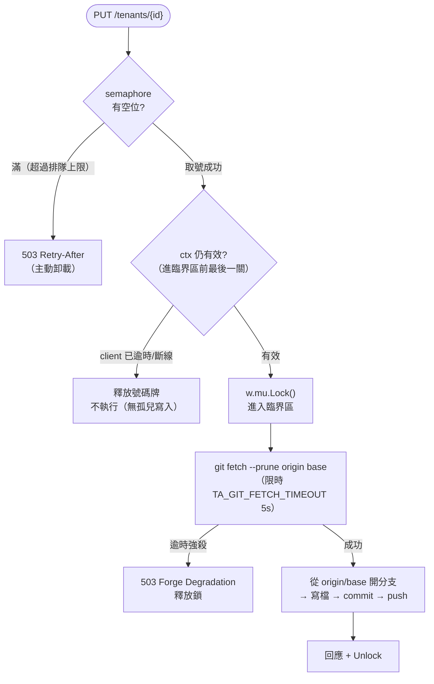

# ADR-023: tenant-api 寫入平面 — Single-Writer Invariant 與韌性圍堵

## 狀態

✅ **Accepted**（2026-05-30 起草，2026-06-06 接受）。單寫者不變式三層強制已全數 codify（layer-1 Helm `fail` guard + layer-2 靜態 lint + Recreate 部署策略），實作見「Action Items」。

- **Deciders**：tenant-api maintainer + 平台架構 owner。
- **Epic**：TRK-317（子項 TRK-318 / 319 / 320 / 324 / 325）。
- **來源**：一輪混沌工程視角的外部 review。本 ADR 的每一條事實主張都對原始碼**逐行核對**，並由一個獨立的對抗式子代理覆驗（過程中修正了數個外部建議的錯誤前提，記於各節）。

## 背景

tenant-api 的寫入路徑（`internal/gitops/Writer`）目前隱含一個**從未寫成契約**的假設：**一個 process 內只有一個寫者**。四個獨立證據指向同一件事：

| # | 證據 | 位置 |
|---|---|---|
| 1 | 全域單鎖序列化所有寫入（`Write` / `WritePR` / `WritePRBatch` / `Write*File`） | `writer.go:60` `sync.Mutex` |
| 2 | conf.d 是單一 git working tree，stale-lock 清理的安全前提註明「由這個單一 replica 獨佔」 | `writer.go:671` `clearStaleGitLocks` |
| 3 | 部署即單副本，PVC 為 `ReadWriteOnce` | `helm/tenant-api/values.yaml` `replicaCount: 1` |
| 4 | 本地 base 只在 pod 啟動時由 initContainer `git pull --ff-only` 同步一次 | `helm/tenant-api/templates/deployment.yaml` |

與這個假設**直接衝突**的是：federation 子系統（ADR-020）刻意設計成 stateless、token record 放 ConfigMap，目標是「tenant-api stays stateless and can run multi-replica」（`cmd/server/main.go:277`）。

於是出現一個危險的灰色地帶：**讀平面想水平擴展、寫平面其實是單例，卻沒有任何東西阻止有人把 `replicaCount` 調成 >1**。一旦發生，兩個副本對同一個 git working tree 並發操作，in-process mutex 完全不跨副本 → working-tree 損毀與 silent data loss。

外部 review 挖出的三個具體缺口，全部是這個隱性假設的不同切面：

| 缺口 | 切面 | 子項 |
|---|---|---|
| 本地 base 在 pod 存活期間不 fetch → 共享檔跨-merge 並發編輯 silent data loss | 單寫者 correctness | TRK-318 |
| Circuit Breaker 把 GitHub secondary-rate-limit 403 當「成功」、不熔斷、不尊重 `Retry-After` | 對 forge 的防禦 | TRK-319 |
| 寫入鎖無 in-flight 上限、無 load shedding、`Lock()` 不吃 context → goroutine 堆積 + 孤兒寫入 | 單寫者 resilience | TRK-320 |

## 決策

把「寫入平面是單寫者」從隱性假設**升為顯式不變式（invariant）**，並在這個前提下選擇正確的韌性模式。

- **讀平面**（`GET /tenants`、`/search`、`/effective`、`/me` …）= stateless，可水平擴展。
- **寫平面**（所有 `PUT` / `POST` 寫回、PR 建立）= **MUST be single writer**。

硬化後的單一寫入請求臨界路徑如下（semaphore 與 fetch 的設計理由見「考量的選項」）：

## 機制強制（三層）

靜態檢查只是第一層，**不足以**保證執行期單寫者：

1. **靜態（兩道，僅及 config 撰寫 / deploy-time）** — (a) **Helm render guard**：`replicaCount > 1` 時 chart 直接 `fail`（`helm/tenant-api/templates/deployment.yaml` 頂部），擋掉 install/upgrade 時無意間調大；(b) **commit/CI 靜態 lint** `check_single_writer_invariant.py`：commit 期跨 **chart values + raw `k8s/04-tenant-api/deployment.yaml`** 驗 `replicaCount==1`、`strategy: Recreate`、**template 仍帶 guard**（meta-guard，防有人只拔 guard 不改值）、**且無 HPA 打 tenant-api**（HPA 會 runtime scale >1 繞過 render guard）。 **條件無條件於 `replicaCount`**——原草案寫的「且 `writeMode != read-only`」是錯前提：binary 無 read-only 模式（`--write-mode` ∈ {direct, pr, pr-github, pr-gitlab}）、values.yaml 也無此欄位，寫入恆為開，故 guard 不該有 writeMode 旁路（見「考量的選項 §A」校正）。 **範圍誠實界定**：這兩道只關閉 **config 撰寫** 向量；`kubectl scale` / 手 patch live Deployment / GitOps controller reconcile 等 **runtime mutation 不在內**，唯一解是 layer-3。（註：`k8s/04-tenant-api/` 為 reference/sample、非 deploy path；lint 守它是 sample 與 chart 的一致性。）
2. **滾動更新交疊（幽靈副本）** — 靜態檢查抓不到的破口：Deployment 預設 `RollingUpdate`（`maxSurge` 進位為 1），發版時新舊 pod 會短暫同時 Ready、各持 in-process `w.mu`。詳見「考量的選項 §A」。本 ADR 採 `strategy: Recreate` 當零程式碼 interim、K8s Lease 為 deferred 水密艙。
3. **執行期不變式守衛（deferred）** — K8s Lease / leader-election。**雙重角色**：既是「要 zero-downtime 部署**又**要單寫者」的唯一正解，也是 layer-1/2 靜態守衛擋不到的 **runtime mutation 向量（`kubectl scale` / 手加 HPA / controller reconcile）的唯一防線**。Trigger 見「Deferred options」。

## 考量的選項

### §A 滾動更新交疊期間的單寫者強制

`replicaCount: 1` **不等於**執行期單寫者。失敗模式依 volume 型態而異：`emptyDir`（目前預設）下兩個交疊 pod 各有 conf.d → dual-writer push race；RWO PVC 同節點 → 共享 tree 損毀，跨節點 → Multi-Attach 擋住新 pod。

| 選項 | 複雜度 | 部署可用性 | 程式碼成本 | 單寫者保證 |
|---|---|---|---|---|
| **A1 `strategy: Recreate`**（採用為 interim） | 低 | 部署期短暫中斷 | 零（一行 Helm） | ✅ 殺舊再起新，無交疊 |
| A2 `RollingUpdate{maxSurge:0}` | 低 | 部署期短暫中斷 | 零 | ✅ 等同 A1 |
| **A3 K8s Lease / leader-election**（採用為 deferred） | 高 | zero-downtime | 中（client-go leaderelection + readiness gate） | ✅ 跨副本水密 |
| A4 讀寫拆分部署（TRK-325） | 中 | 讀 zero-downtime、寫 Recreate | 中（需 read-only 模式 + 路由） | ✅（寫部署單副本） |

> **校正**：外部 review 主張「拆分是零程式碼」。核實後**否決**此前提——binary 無 read-only 模式（`--write-mode` 只有 `direct`/`pr`/`pr-github`/`pr-gitlab`），拆分需新增 read-only enforcement + method 路由，非零成本（TRK-325）。又因現狀 `replicaCount:1` 讀取本就無 HA，`Recreate` 不引入新 regression，故 A1 為合理 interim、A4/A3 為依需求觸發的 deferred。

### §B 新鮮錨點的 fetch 位置（TRK-318）

寫入前必須讓本地 base 追上遠端，否則共享檔（`_groups.yaml` / `_views.yaml` / `_federation_policy.yaml`）跨-merge 並發編輯會 silent data loss。`git fetch` 是跨網路阻塞呼叫，放錯位置會把網路劣化轉嫁到全域鎖或引入競態。

| 選項 | 鎖持有期間 | TOCTOU | 複雜度 |
|---|---|---|---|
| **B1 鎖內 fetch + 獨立激進 timeout**（採用） | 含一次 ≤5s 有界 fetch | ✅ 無（fetch 緊接開分支，原子） | 低 |
| B2 鎖外預載 fetch、鎖內只做本地 reset | 不含網路 | ❌ 有：排隊期間遠端前進，鎖內 reset 錨到過期 ref | 高（須鎖內再驗證 → 網路又回鎖內） |

> **依據**：外部 review 上一輪推 B2 為「最優解」，但其自身的 TOCTOU 推演恰恰**否決 B2**——正解是 B1。單寫者 + 低頻 config 寫入 + 已有 load-shedding 快速卸載，讓「持鎖期間一次有界 fetch」完全可接受；B2 的非對稱複雜度只在高併發寫入才划算，而那違反本 ADR 的單寫者前提。B1 用獨立的 `TA_GIT_FETCH_TIMEOUT`（預設 5s），**不複用** `TENANT_API_GIT_TIMEOUT`（60s 常規 git 超時），逾時強殺 → 釋放鎖 → 回 `503 Forge Degradation`。指令用 `git fetch --prune origin <base>`（base-only refspec，prune scope 僅及該分支）。

> **已實作（[#671](https://github.com/vencil/Dynamic-Alerting-Integrations/issues/671)）**：開分支前在臨界區內 `git fetch --prune origin <base>`（限時 `TA_GIT_FETCH_TIMEOUT`），新分支錨到 `origin/<base>`；逾時 → `ErrForgeDegraded` → 503 `FORGE_UNAVAILABLE`（帶 `Retry-After`），不 silently 用過期 base。**刻意不 `reset --hard`**——硬 reset 會丟棄本地 base 上未 push 的 commit（特殊檔 PR 模式也直接 commit 到當前分支，見上）；只錨新分支、不動本地 base 即兩全。實作細節（`resolveFreshBaseRef` / fallback 分支 / regression）見 PR #671。

### §C 並發卸載與孤兒寫入（TRK-320）

所有寫入序列化在單一 `w.mu`，無 in-flight 上限。突發 `PUT` 時請求全 block 在 `Lock()`；更糟的是 `sync.Mutex.Lock()` **不吃 context**——`middleware.Timeout(30s)` 讓 client 收到逾時，但卡在鎖上的 goroutine 不會被釋放，`gitCmd` 用自己的 `context.Background()`，於是 **client 早逾時了、git 寫入仍照跑**（孤兒寫入）。

採 semaphore 主動卸載 + context 綁定，但**邊界很重要**：

- context **只綁「取號/排隊」階段**（含「拿號後、進臨界區前」的微秒夾縫 → 進鎖前補一次 `ctx.Err()` 檢查）。
- **一旦進入臨界區就讓寫入跑完**，不中途砍 git——半路砍 commit 會留 dirty tree，且已驗證的寫入半途中止反而誘發 client 重試造成重複 PR。in-flight 由 git timeout 圈住。

## 取捨分析

- **寫入吞吐量被單寫者上限封頂**。對「config 寫回」這種人工觸發為主、低頻的 workload 可接受；若哪天寫入變高頻，才需要動 A3 Lease。這是刻意的 CQRS 邊界，不是疏漏。
- **B1 替每次 PR 寫入引入一次鎖內網路往返**。但 PR 模式本就要 push，網路相依已存在，且受 `TA_GIT_FETCH_TIMEOUT` 圈住；最壞情況全域鎖只被扣留 5s，配合 §C 的 load-shedding，排在後面的請求快速 fail-fast 而非無上限堆積。
- **forge 降級辨識（TRK-319）需動 `APIError`**。它目前刻意只存 StatusCode、不存 body（防洩漏）；但 header 在傳輸層拿得到（`github/client.go:339`），只需加欄位、不必動 transport，故成本低。

## 後果

**正面**

- 杜絕「無意間 multi-replica 寫者」造成的 git working-tree 損毀（目前唯一防線是「沒人去改 replicaCount」）。
- 把擴展故事講清楚：讀可擴展、寫單例是**刻意選擇**而非疏漏，未來水平擴展有明確路徑（A3/A4）。
- 三個 resilience 修補有了統一的設計依據，不再是三個零散 bug。

**負面 / 須持續審視**

- 寫平面成為顯式 SPOF（單寫者）。以 Recreate 的部署期短暫不可用為對價，直到 A3/A4 觸發。
- `TA_GIT_FETCH_TIMEOUT` 新增一個運維旋鈕，需文件化其與 `TENANT_API_GIT_TIMEOUT` 的分工。

## Deferred options（附 re-evaluation trigger）

- **讀寫拆分部署（A4 / TRK-325，追蹤 [#788](https://github.com/vencil/Dynamic-Alerting-Integrations/issues/788)）** — 觸發：讀取 HA 成為需求（Portal 上線、讀 QPS 上升，使「發版時讀取短暫中斷」不再可接受）。前提：read-only enforcement 模式 + method 路由。
- **K8s Lease 分散式寫入鎖（A3，追蹤 [#787](https://github.com/vencil/Dynamic-Alerting-Integrations/issues/787)）** — **雙重動機**：(1)「寫入部署需 zero-downtime 滾動更新」成硬需求（Recreate 部署期短暫不可用不再可接受）；(2) layer-1/2 靜態守衛擋不到的 **runtime mutation 向量（`kubectl scale` / 手加 HPA / controller reconcile）唯一防線**。
- **寫入水平擴展** — 觸發：單寫者吞吐量成為實測瓶頸（寫入排隊 p99 超標），或出現「必須多副本寫」的硬需求。走 A3，而非放寬單鎖。

## Action Items

- [x] **單寫者不變式顯性化 + 靜態強制（TRK-324）** — `strategy: Recreate` 消除滾動更新交疊（[#677](https://github.com/vencil/Dynamic-Alerting-Integrations/issues/677)）；其後補齊兩道靜態守衛：chart render-time `fail` guard（`replicaCount>1` 即擋）+ commit/CI `check_single_writer_invariant.py`（跨 chart values + raw `k8s/04-tenant-api/deployment.yaml` 驗 `replicaCount==1` 且 `Recreate`，codify 時抓到 raw manifest 漏 `Recreate` 的漂移並修正）。layer-1 條件改為無條件 `replicaCount>1`（移除不存在的 `writeMode` 旁路）。
- [x] **TRK-318** 鎖內 fetch（B1）+ `TA_GIT_FETCH_TIMEOUT`（[#671](https://github.com/vencil/Dynamic-Alerting-Integrations/issues/671)）— `WritePR` / `WritePRBatch` 開分支前在臨界區內 `git fetch --prune origin <base>` 取得新鮮 ref，再從該 ref（`origin/<base>`，或無 origin / non-timeout error 時 fallback 至本地 `<base>`）以 `checkout -b --no-track` 建分支，**刻意不 `reset --hard`** 以保留本地 base 上未 push 的 commit（特殊檔直接 commit 路徑，見 §B）；逾時（`TA_GIT_FETCH_TIMEOUT`，預設 5s，獨立於 `TENANT_API_GIT_TIMEOUT`）→ `ErrForgeDegraded` → 釋放鎖 → 回 503 `FORGE_UNAVAILABLE`（帶 `Retry-After`），不 silently 用過期 base。前置：TRK-324 Recreate（已落地）。
- [x] **TRK-319** `APIError` 認得 secondary-rate-limit 403 → 熔斷 + 尊重 `Retry-After`（[#672](https://github.com/vencil/Dynamic-Alerting-Integrations/issues/672)）— `APIError` 加 `RateLimited` / `RetryAfter` 欄位（client roundTrip 經 `DetectRateLimit` 依 `Retry-After` / `X-RateLimit-Remaining==0` / body 判定，**body 仍不留存、不洩漏**）；`isForgeDegradation` 改判 `StatusCode>=500 || RateLimited`，rate-limit 期間熔斷器真正保護寫入平面（permission 403 仍不熔斷）；`APIError.Is` 排除 rate-limited 403（不誤映成永久 403、改走 503）；breaker 加 `Retry-After` 閘（方案乙）—— 熔斷後依 `Retry-After` 延長壓制窗，避免固定 60s half-open probe 反覆戳 still-active limit。
- [x] **TRK-320** load-shedding semaphore + context 綁排隊階段（[#673](https://github.com/vencil/Dynamic-Alerting-Integrations/issues/673)）— 所有寫入方法在 `w.mu` 前過 `acquireWrite(ctx)`：單一執行 token（`writeExec` cap 1）序列化唯一 in-flight 寫入，`writeInFlight` 計數把「執行中＋排隊中」總額封在 `maxWriteAdmit`（= 1 + `TA_WRITE_QUEUE_DEPTH`，預設 5），超過即 `ErrWriteOverloaded` → handler 回 **503 + `Retry-After`**。**排隊（等 token）是 ctx-aware**：client 在排隊期間斷線/逾時立即釋放、永不執行（杜絕孤兒寫入），含「拿號後進鎖前」微秒夾縫的 `ctx.Err()` 補查；**一旦拿到 token 進臨界區就讓寫入跑完**，不中途砍 git（半路砍留 dirty tree / 誘發重試重複 PR）。寫入方法簽名加 `ctx`（根因即 `Lock()` 不吃 context）。與 TRK-318 配對。
- [ ] **TRK-325 / A3 Lease** — deferred，見各自 trigger。

## 關聯

- 相關 ADR：ADR-009（commit-on-write GitOps）、ADR-011（PR-based write-back）、ADR-020（federation stateless multi-replica — 本 ADR 釐清它與寫平面的邊界）。
- 已評估不修：TRK-323（wontfix — `da-guard` CI gate + handler domain 驗證已覆蓋 special-file 左移驗證）。
