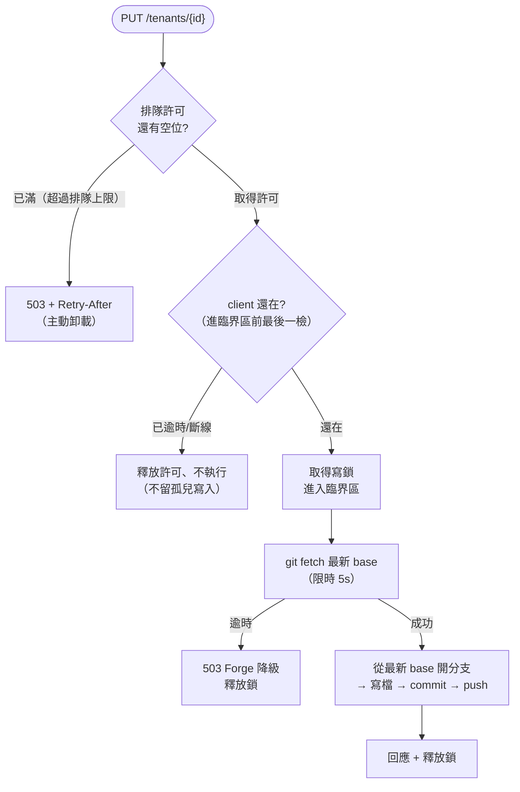

# ADR-023: tenant-api 寫入平面 — 單一寫者不變式

## 狀態

✅ **Accepted**（2026-05-30 起草，2026-06-06 接受）。Deciders：tenant-api maintainer + 平台架構 owner。

## TL;DR

- **寫平面是單一寫者（MUST）；讀平面可水平擴展。** 這是刻意的 CQRS 邊界，不是疏漏。
- **為什麼**：所有寫入共用「一個 git working tree + 一把 process 內的鎖」，這把鎖不跨 pod。第二個寫者 = working tree 損毀 + 無聲資料遺失。
- **怎麼守**：部署期兩道靜態守衛（Helm render `fail` guard + commit/CI lint）；要在執行期安全地水平擴展只能上 K8s Lease（已延後，trigger 見下）。
- **連帶**：三個韌性修補（寫入前抓最新 base／forge 熔斷／過載卸載）都從這條不變式導出，已全數落地。

## 背景：為什麼寫平面只能有一個寫者

tenant-api 以 GitOps 把租戶設定寫回 git（ADR-009／011）。寫入路徑有三個結構性事實，共同鎖死「單一寫者」：

1. 所有寫入（直接寫、開 PR、批次）序列化在**同一把 process 內的鎖**上——這把鎖不跨 pod。
2. conf.d 是**單一 git working tree**；連 stale-lock 清理的安全前提都是「由這個副本獨佔」。
3. 部署即**單副本**（`replicaCount: 1`、PVC `ReadWriteOnce`），本地 base 只在 pod 啟動時同步一次。

對照之下，federation 子系統（ADR-020）**刻意**做成 stateless、可多副本——它和寫平面是兩種不同的東西。問題在於：「寫平面是單例」這個前提**從沒寫成契約**，也沒有任何東西阻止有人把 `replicaCount` 調成 2。一旦發生，兩個副本對同一個 working tree 並發 git 操作，process 內的鎖完全擋不住 → 損毀。

**本 ADR 就是把這條隱性前提升為顯式、可機械強制的不變式。**

## 決策

- **讀平面**（`GET /tenants`、`/search`、`/effective`、`/me` …）= stateless，可水平擴展。
- **寫平面**（所有寫回、PR 建立）= **單一寫者，MUST**。

硬化後的單一寫入請求路徑：



## 三層強制

只「部署成單副本」不足以保證執行期單一寫者。三層由淺入深：

| 層 | 擋什麼 | 機制 | 範圍 |
|---|---|---|---|
| **L1 靜態守衛** | 在設定裡調大副本數／拿掉 Recreate／掛 autoscaler | (a) Helm render `fail` guard：`replicaCount>1` 直接中止 render；(b) commit/CI lint `check_single_writer_invariant.py` | 部署期（設定撰寫） |
| **L2 部署策略** | 滾動更新時新舊 pod 短暫並存（幽靈副本） | `strategy: Recreate`——先殺舊再起新，無交疊 | 部署期（發版瞬間） |
| **L3 執行期鎖（延後）** | 執行期直接改副本數 | K8s Lease／leader-election | 執行期 |

**L1 lint 檢查四件事**：`replicaCount==1`、`strategy: Recreate` 為**字面硬編碼**（刻意不可用 Helm values 參數化——否則 operator 一翻成 RollingUpdate 就重開幽靈副本窗）、Helm template 仍帶 L1 guard（防有人只拔 guard 不改值）、且**沒有 autoscaler**（native HPA 或 KEDA `ScaledObject`／`ScaledJob`）打 tenant-api。

> **範圍要誠實**：L1/L2 只關「設定撰寫」這個向量。**執行期直接改副本數的路徑——`kubectl scale`、KEDA controller 在執行期生成的 HPA、GitOps controller reconcile 一個被手改的 `replicas`、Argo/Flux 套用的 Kustomize overlay——靜態檢查全看不到，唯一防線是 L3 Lease。** 這正是 L3 雖延後、但 trigger 一到就必須做的原因。

**例**：`helm upgrade ... --set replicaCount=2` 會直接中止並印：

```text
ADR-023 single-writer invariant violated: tenant-api replicaCount=2 but MUST be 1.
... implement a K8s Lease (Deferred option A3) — do not raise replicaCount.
```

## 選項與取捨

三個獨立決策，各取一個方案；被否決的選項附原因。

### 1. 滾動更新交疊期間怎麼保證單寫者

`replicaCount: 1` 不等於執行期單寫者：預設 RollingUpdate 發版時會先起新 pod、等它 Ready 才殺舊的，兩個 pod 短暫並存、各持自己的鎖。

| 方案 | 部署可用性 | 程式碼成本 | 採用 |
|---|---|---|---|
| **`strategy: Recreate`** | 部署期短暫中斷 | 零（一行） | ✅ interim |
| `RollingUpdate{maxSurge:0}` | 同上 | 零 | 等效備案 |
| K8s Lease | zero-downtime | 中 | 延後（A3） |
| 讀寫拆分部署 | 讀 zero-downtime | 中 | 延後（A4） |

採 Recreate：現狀單副本讀取本就無 HA，部署期短暫中斷不是新的 regression，而成本只有一行；zero-downtime 留給 Lease。（讀寫拆分**不是零成本**：binary 目前沒有 read-only 模式，要新增 enforcement + 路由，故列延後。）

### 2. 寫入前怎麼取得最新 base

寫入前必須讓本地 base 追上遠端，否則共享檔（`_groups.yaml` 等）會被「從過期 base 開的 PR」算成要刪 → 無聲資料遺失。`git fetch` 是阻塞網路呼叫，放錯位置會把網路劣化轉嫁到全域鎖、或引入競態。

**採鎖內 fetch**：進臨界區後、開分支前 `git fetch` 一次，緊接著從最新 ref 開分支——原子、無 TOCTOU。「鎖外預載再鎖內 reset」反而有 TOCTOU（排隊期間遠端前進），且只在高併發寫入才划算，而那違反單寫者前提。fetch 用**獨立的短逾時 `TA_GIT_FETCH_TIMEOUT`（預設 5s）**，與常規 git 逾時（60s）分開——持鎖期間的網路呼叫必須快速 fail 成 503，不能拖到 60s。

### 3. 突發寫入怎麼不堆積、不留孤兒

所有寫入序列化在一把鎖上，且鎖的取得不吃 context：突發請求全卡在鎖上，client 逾時了但 goroutine 不釋放、git 還照跑（孤兒寫入）。

**採過載卸載 + context 綁排隊**：用一個許可制把「執行中＋排隊中」的總數封頂，超過直接回 503 + Retry-After。**排隊階段是 context-aware**（client 斷線立即釋放、永不執行）；**但一旦進臨界區就讓寫入跑完**——半路砍 git 會留 dirty tree，還誘發 client 重試造成重複 PR。

## 後果

**正面**

- 杜絕「設定層面無意間多副本寫者」造成的 working tree 損毀（原本唯一防線是「沒人去動 replicaCount」）。
- 擴展故事講清楚：讀可擴展、寫單例是刻意選擇，未來水平擴展有明確路徑（Lease／讀寫拆分）。
- 三個韌性修補有了統一設計依據，不再是零散 bug。

**負面 / 待審視**

- 寫平面是顯式 SPOF。代價是部署期短暫不可用，直到 Lease 落地。
- 執行期改副本數的向量（`kubectl scale`／KEDA-runtime／GitOps patch）L1/L2 擋不到——這是**已知殘留風險**，由 L3 的 trigger 控管。
- 多一個運維旋鈕 `TA_GIT_FETCH_TIMEOUT`，需文件化它與 `TENANT_API_GIT_TIMEOUT` 的分工。

## Deferred（附 re-evaluation trigger）

- **K8s Lease 分散式寫入鎖（A3，[#787](https://github.com/vencil/Dynamic-Alerting-Integrations/issues/787)）** — 雙重動機：(1) 寫入部署需 zero-downtime 成硬需求；(2) 執行期多寫者向量（`kubectl scale`／KEDA／GitOps patch）需根治。任一觸發即開工。
- **讀寫拆分部署（A4，[#678](https://github.com/vencil/Dynamic-Alerting-Integrations/issues/678) / [#788](https://github.com/vencil/Dynamic-Alerting-Integrations/issues/788)，已關閉、defer 不變）** — issue 不留 open：「讀取 HA 是需求」前提目前無 field data 驗證（讀路徑為低頻 admin UI），留 open 只會變 zombie。觸發改 **codify 成自觸發 alert** `TenantApiReadHANeeded`（`k8s/03-monitoring/configmap-rules-platform.yaml`，severity `info`、不 page）：`tenant_api_sse_clients` **7d 平均並發 > 2**（取平均非峰值＝持續多人讀取面，非單日尖峰；另加 `count_over_time(...) >= 150` 守 cold-start，fresh deploy 的 partial 視窗不誤觸；互補可看 `rate(tenant_api_requests_total)`）即「讀取 HA 成真實需求」→ reopen 本項實作。前提：binary 新增 read-only enforcement + method 路由。**⚠️ A4 只買讀 zero-downtime，寫路徑（Save）發版仍中斷，須與 A3 同排、勿單獨出。** 行為契約 `tests/rulepacks/platform-read-ha-trigger_test.yaml`。
- **寫入水平擴展** — 觸發：單寫者吞吐量成實測瓶頸。走 Lease，不放寬單鎖。
- **寫入依優先級分流：真人即時操作優先於機器批次（[#746](https://github.com/vencil/Dynamic-Alerting-Integrations/issues/746)，2026-06-24 暫緩、附重啟條件）** — 構想是讓真人在 Portal 上的即時設定永遠插到機器的大量背景寫入前面（機器寫入切成小段，一發現有人要寫就讓出）。
    - **為何現在不做**：目前所有寫入都來自真人（以登入身分寫回 git），沒有任何背景程式會自動改租戶設定。現有的過載保護（[#673](https://github.com/vencil/Dynamic-Alerting-Integrations/issues/673)）會在塞車時擋下多餘請求、請對方稍後重試，但它「先到先服務、不分人或機器」—— 對「全是真人寫入」的現狀已足夠。
    - **何時重啟**：等第一支「會自動寫入、且可能長時間佔住寫入鎖」的背景程式上線時（例如自動清理過期規則、批次重新編譯規則）。判斷不靠「等到出事」：先加一個觀測指標，把每筆寫入標記為人或機器，量「真人寫入平均等多久」「有多少真人寫入因機器佔線被擋下」，指標一惡化就動工。
    - **前置已備妥**：先前擔心的「git push 卡住會無限佔住寫入鎖」已修好 —— 每個 git 操作都有逾時上限（[#630](https://github.com/vencil/Dynamic-Alerting-Integrations/issues/630)）。

## 實作對照

| 項目 | 狀態 | 出處 |
|---|---|---|
| Recreate 部署策略（L2） | ✅ | [#677](https://github.com/vencil/Dynamic-Alerting-Integrations/issues/677) |
| L1 Helm guard + lint（含 KEDA／hardcode-Recreate／meta-guard） | ✅ | 本 ADR PR |
| 寫入前鎖內 fetch 最新 base + `TA_GIT_FETCH_TIMEOUT` | ✅ | [#671](https://github.com/vencil/Dynamic-Alerting-Integrations/issues/671) |
| forge secondary-rate-limit 熔斷 + 尊重 `Retry-After` | ✅ | [#672](https://github.com/vencil/Dynamic-Alerting-Integrations/issues/672) |
| 過載卸載 + context 綁排隊（`TA_WRITE_QUEUE_DEPTH`） | ✅ | [#673](https://github.com/vencil/Dynamic-Alerting-Integrations/issues/673) |
| K8s Lease（A3）／讀寫拆分（A4） | deferred（A4 已 codify re-trigger alert `TenantApiReadHANeeded`） | [#787](https://github.com/vencil/Dynamic-Alerting-Integrations/issues/787)／[#678](https://github.com/vencil/Dynamic-Alerting-Integrations/issues/678)·[#788](https://github.com/vencil/Dynamic-Alerting-Integrations/issues/788)（closed） |

每筆的詳細實作敘述見對應 PR；本 ADR 只保留決策與理由。

## 關聯

- ADR-009（commit-on-write GitOps）、ADR-011（PR-based write-back）、ADR-020（federation stateless 多副本——本 ADR 釐清它與寫平面的邊界）。
