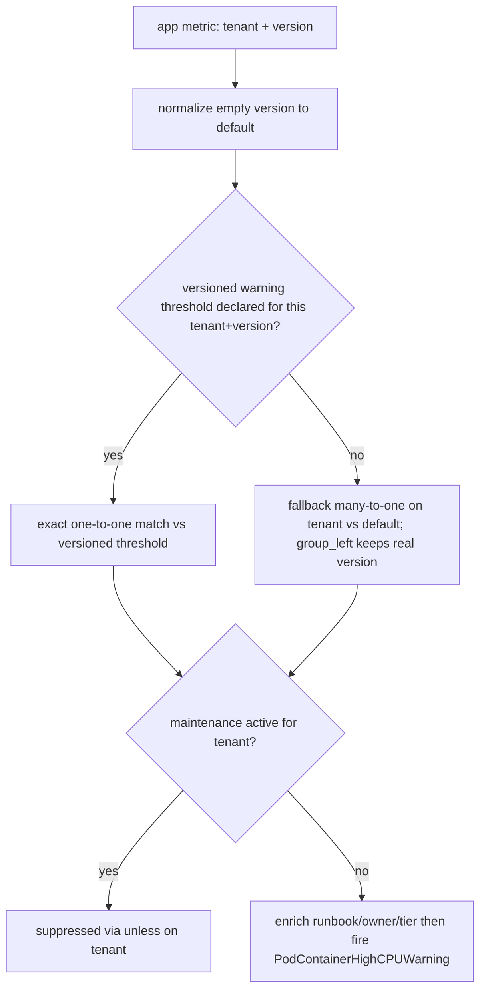

# ADR-024: Declarative Dimensional Alerting Engine — Version-Aware Thresholds + Custom Alerts

> Secondary (EN) copy. Primary source of truth is the Chinese version: [`024-version-aware-threshold-via-dimensional-label.md`](024-version-aware-threshold-via-dimensional-label.md).

## Status

✅ **Accepted** (architecture decision, targeting v2.9.0). This ADR records a **declarative dimensional alerting engine** with two capabilities: **version-aware thresholds** (platform-authored, k8s pilot merged) and **custom alerts** (tenant-authored, recipe design converged, implementation in progress) — **both belong to v2.9.0, not a phased release**; they differ only in implementation status (see §As-built). The `status:` frontmatter stays a machine-readable bare `accepted` (the architecture decision is made; an ADR records the decision, not implementation completeness). Tracker: [#423](https://github.com/vencil/Dynamic-Alerting-Integrations/issues/423) (version-aware, `rfc` + `epic`) + [#741](https://github.com/vencil/Dynamic-Alerting-Integrations/issues/741) (custom alerts, `epic`).

> **Relationship to existing mechanisms**: This ADR does **not** replace or modify [`config-driven.md` §2.6 Scheduled Thresholds](../design/config-driven.md). They are two coexisting, orthogonal mechanisms — boundary in §"Boundary vs §2.6".

## Strategic Arc: Version-Aware is the Foundation, Custom Alerts the North Star

> This ADR is "one engine + two capabilities", not a phased project plan. Read this framing first, then the heavy machinery below — otherwise it reads as over-engineering.

The product north star is not "platform-authored standard alerts" but **empowering every tier (platform / domain / tenant) to author custom alerts declaratively**, filling the domain-level and app-level gaps standard rule packs don't cover — without it there is no GA. But this collides head-on with the project's bedrock constraint: **declarative-only, never write PromQL** (§Hard constraints, [ADR-008](008-operator-native-integration-path.en.md)).

One **declarative dimensional alerting machine** — the dimensional-label model, scrape-time relabel, rule-pack normalize / compile layer, graceful-degradation join, the promtool safety net, per-tenant isolation — powers two capabilities:

- **Capability A — Version-Aware Thresholds (§Context–§Action Items)**: on platform-authored rule packs, let tenants declare **multi-version numeric thresholds**. This is the **foundation and capability proof** — first prove the machine runs safely in prod.
- **Capability B — Custom Alerts (§Custom Alerts)**: open the same machine to **every tier (platform / domain / tenant)**, defining via **parameterized recipes** (not PromQL) the alerts standard rule packs don't cover. A's normalize / join / promtool gate / isolation are reused verbatim (see §Custom Alerts "Reuse of existing machinery"). This is the product north star.

**Both capabilities belong to v2.9.0, not a phased release** — deliberately NOT using "Phase 1 / Phase 2" to split the reader's mental model (avoids misreading them as two releases or a maturity gap; and this ADR's existing "Phase 2 = the other-packs rollout" usage means something else, so reusing the label would collide). The only difference is **implementation status** (A merged, B in progress), listed in §As-built.

**Documentation-structure decision (converged from internal + external discussion)**: Custom Alerts is folded into this ADR rather than a separate ADR-025, because both capabilities share one underlying engine, one tenant-api write boundary, one CI pipeline — splitting would sever the "why is the foundation this heavy" causal link and create a virtual boundary ("which ADR governs `validate()`?"). **Residual open question**: if this ADR later becomes hard to read, reconsider moving the "living engine spec" into [`docs/design/`](../design/) (the repo's proper home for a living spec; ADRs remain snapshot-style records of discrete decisions). Revisit on trigger.

## As-built (Implementation Status)

> The `status:` frontmatter stays a machine-readable bare value (`accepted`); implementation status lives here. For **how to use it** (tenant declaration + platform KSM remediation) see the [Version-Aware Thresholds guide](../scenarios/version-aware-thresholds.md).

**Capability A — Version-Aware Thresholds (Kubernetes pilot merged, targeting v2.9.0)**: both `container_cpu` and `container_memory` are version-aware. Four pieces shipped: the rule-pack normalize layer (version injection → dynamic fallback → split per-severity rules), bilingual da-guard validation of the `version` label value, the three-layer KSM-allowlist defense, and the tenant-api rejection of an invalid `version` at write time. PR breakdown in [#423](https://github.com/vencil/Dynamic-Alerting-Integrations/issues/423).

⛔ **Deployment prerequisite (HARD)**: kube-state-metrics MUST run with `--metric-labels-allowlist=pods=[app.kubernetes.io/version]`, otherwise `kube_pod_labels` carries no version, the version-injection join matches nothing, and **version thresholds are silently inert** (proven on a real cluster). The three-layer defense guards this prerequisite: the `VersionAwareThresholdInert` runtime sentinel is the safety net, and the CI static lint `check_ksm_version_allowlist.py` catches the misconfiguration.

**Capability B — Custom Alerts (implementation in progress, targeting v2.9.0)**: design converged; the recipe library / compiler / discovery catalog / two UXs are net-new and implementation has not started (see §Custom Alerts).

**Deferred (defer-with-trigger)**:

- Version-awareness for the other (non-kubernetes) packs — **this is "capability proof" in nature, not the north star** (trigger: a customer asks for a version-specific threshold on a non-k8s metric; the real fix is the external-backend relabel in §Custom Alerts and [#716](https://github.com/vencil/Dynamic-Alerting-Integrations/issues/716)).
- Tenant self-service verification of "is my version threshold actually live" — a tenant-api resolved-view — **subsumed by the read-only discovery catalog in §Custom Alerts** (same mechanism: show tenants what is actually live in Prometheus).
- A `versioned:` config sugar / portal UI inline editing help (trigger: the portal / operator epic [#692](https://github.com/vencil/Dynamic-Alerting-Integrations/issues/692); note: custom alerts use a portal recipe form + inline help, **not** a new `versioned:` schema).

## TL;DR

- **Problem**: tenants want rules "pre-staged but only active on the app version bump", and at troubleshooting time need to know "which version is running now".
- **Decision**: express multi-version thresholds via a dimensional `version` label on the metric; cutover is **emergent** (whichever `version` the metric carries after a deploy joins the matching threshold). **The existing dimensional-label mechanism already achieves this with zero threshold-exporter parse/emit change** — Phase 1's core is a rule-pack **normalize layer**, not a new config schema (Option A, reuse-over-build; the `versioned:` sugar is demoted to defer-with-trigger).
- **Three reliability hardenings**: (1) **dynamic fallback** — a missing versioned threshold falls back to `version="default"`, eliminating the "silent alerting gap" and decoupling deploy frequency from config; (2) **split per-severity rules** — avoids the `version × severity` PromQL cardinality deadlock (otherwise the pilot would crash the alerting engine on rollout); (3) **deterministic truncation + non-piloted-pack defensive hardening** — eliminates flapping and isolates cross-pack contamination.
- **Critical pre-GA to-dos**: the metric-side `kube_pod_labels` version injection (§Decision (0a)) + OQ-1 pipeline-contract sign-off; the rest are in §Action Items.

## Context

### Original tenant ask

Tenants may want a new alert rule / threshold to become active "starting on a future date", but they want to commit the rule ahead of time. When troubleshooting, they must be able to answer "which version of the rule is Prometheus running right now", not stumble onto a version that is in git but not yet deployed. When a rule is bumped, the "deactivate old + activate new" double-write — if atomicity is not enforced — gets half-written during review/ops.

Decomposed: (1) commit rules/thresholds into `conf.d/` ahead of time without immediate effect; (2) activation aligned to app version bump; (3) troubleshooting can answer "what version is live right now"; (4) YAML must not accumulate meaningless historical activation dates.

### Hard constraints (existing project contracts)

- **Tenant declarative-only** — Platform team owns rule-pack PromQL; tenants only set plain numeric thresholds in YAML. **Any approach requiring tenants to write PromQL violates this.**
- **`user_threshold` is already a dimensional metric** — `user_threshold{tenant, component, metric, severity, <arbitrary dimensional labels>}`, already supporting `env`, `tablespace_re`, etc. ([`config-driven.md` §2.5](../design/config-driven.md)).
- **Rule pack is the platform-team-controlled normalize layer** — complexity centralized there, not pushed to tenants.
- **Cardinality Guard exists** (per-tenant `max_metrics_per_tenant` ceiling, enforced in `config/resolve.go::ResolveAtWithStats`; over-limit truncates + emits `da_tenant_metrics_over_limit`, see #652).
- **No ArgoCD/Flux** — config via Directory Scanner + SHA-256 hot-reload; rule packs via ConfigMap projected volume + Prometheus reload.

## Decision

Adopt **Version-Aware Threshold**: express "multiple coexisting versions of the same threshold" via a dimensional `version` label on the metric. Cutover is **emergent behavior** — whichever `version` the app metric carries after a deploy is the version of threshold the PromQL join aligns to.

Key convergence (a **correction of the current state** relative to #423's original proposal):

> **The project's existing dimensional-label mechanism already produces the metric shape #423 §3.2 wants, with zero exporter changes.** Therefore the Phase 1 core is the **rule pack normalize layer**, not a new config schema.

Verification: `config/resolve.go` (dimensional key path, lines 182–227) already parses `metric{label="value"}` into `CustomLabels`; `collector.go` (lines 68–78) emits `CustomLabels` as Prometheus labels in sorted order. So today a tenant can write:

```yaml
tenants:
  db-a:
    container_cpu{version="v1"}: "80"
    container_cpu{version="v2"}: "60"
```

and the exporter emits (no new code):

```
user_threshold{tenant="db-a", component="container", metric="cpu", severity="warning", version="v1"} 80
user_threshold{tenant="db-a", component="container", metric="cpu", severity="warning", version="v2"} 60
```

`version` rides the same dimensional path as `env` / `tablespace_re` — **a single mental model**.

> **Precise boundary of "zero change"**: "zero change" applies to the **parse + emit** half — emitting threshold series with a version label genuinely needs no exporter change. But the **safety rail this design depends on, the OQ-6 guard, is net-new** (Go `ValidateTenantKeys` + Python da-guard, dual-language), and the metric-side version injection ((0a) above) is the real engineering work. So "Phase 1 is not a new config schema" holds, but "Phase 1 is zero effort" does **not**.

### Two independently-deployable halves (the most important architectural property)

1. **Threshold side** — tenant declares multi-version thresholds via `{version="..."}` in YAML. Exporter unchanged.
2. **Metric side** — app metric carries a `version` label (for business apps: via `app.kubernetes.io/version` + kube-state-metrics `kube_pod_labels` relabel).

**Until the metric side injects version, the whole mechanism is inert and 100% backward-compatible**: an unversioned threshold (`container_cpu: "80"`) emits a series with no `version` label (i.e. `version=""`); an app metric without injection is also `version=""`; the normalize layer rewrites both to `version="default"` and they join naturally — behavior identical to pre-change (satisfies AC-1).

### Rule Pack Normalize Layer (the real Phase 1 engineering core)

Using `rule-pack-kubernetes`'s `PodContainerHighCPU` (current join key is `on(tenant)`):

```yaml
# (0a) version injection point (bottom layer, the real engineering hard part):
#      cAdvisor's container_cpu_usage_seconds_total carries no version.
#      Approach: compute the plain percentage first (reusing the existing
#      by(namespace,pod,container) logic, zero mental change), then join
#      kube_pod_labels ONCE at the outermost level to inject version.
#      ✅ Halves the join cost vs joining version in both numerator and
#         denominator, and avoids the NaN edge case where a rolling-moment
#         version drift misaligns numerator/denominator (perf + correctness).
- record: tenant:container_cpu_percent:by_container
  expr: |
    label_replace(
      (
        (
          sum by(namespace, pod, container) (rate(container_cpu_usage_seconds_total{namespace=~"db-.+", container!="", container!="POD"}[5m]))
          /
          sum by(namespace, pod, container) (kube_pod_container_resource_limits{resource="cpu", namespace=~"db-.+"})
        ) * 100
        * on(namespace, pod) group_left(version)
          label_replace(kube_pod_labels, "version", "$1", "label_app_kubernetes_io_version", "(.+)")
      ),
      "tenant", "$1", "namespace", "(.*)"
    )

# (0b) version propagation: keep version in every by(...) layer
- record: tenant:pod_weakest_cpu_percent:max
  expr: max by(tenant, pod, version) (tenant:container_cpu_percent:by_container)  # <- version added to by()

# (1) Normalize: rewrite missing version to "default" on both sides
#     - app metric side: collapse to per (tenant, version), then default
- record: tenant_version:pod_weakest_cpu_percent:vlabeled
  expr: |
    label_replace(
      max by(tenant, version) (tenant:pod_weakest_cpu_percent:max),
      "version", "default", "version", "^$"
    )
#     - threshold side: unversioned thresholds emit series with no version label (version="")
#       keep severity in by(): a versioned threshold can carry severity via
#       the "value:severity" suffix (e.g. `container_cpu{version="v2"}: "60:critical"`,
#       supported at resolve.go:206-210); severity must NOT be collapsed by max here.
- record: tenant_version:alert_threshold:container_cpu
  expr: |
    label_replace(
      max by(tenant, version, severity) (user_threshold{component="container", metric="cpu"}),
      "version", "default", "version", "^$"
    )

# (2) Alert: dynamic fallback + split-per-severity (split per severity to avoid the version × severity cardinality deadlock).
#     WARNING: do NOT use `group_left(severity)`: the default bucket may hold both warning and
#       critical (legacy `_critical` plain key), so the exact branch goes one-to-many (multiple
#       matches) and the fallback branch goes many(versions)×many(severities) (many-to-many) →
#       Prometheus runtime error that takes down the whole alerting engine.
#     FIX: split one rule per severity. With severity fixed, the RHS degenerates to a
#       per-(tenant[,version]) singleton, making every join a clean one-to-one / many-to-one;
#       the fallback uses group_left to PRESERVE the metric's real version (SRE visibility).
#       The Critical rule is a mirror (severity="critical").
- alert: PodContainerHighCPUWarning
  expr: |
    (
      (
        # exact hit on this (tenant, version)'s warning threshold (one-to-one; severity fixed -> RHS singleton)
        tenant_version:pod_weakest_cpu_percent:vlabeled
        > on(tenant, version) group_left()
          tenant_version:alert_threshold:container_cpu{severity="warning"}
      )
      or
      (
        # fallback: no matching versioned warning threshold -> use default. severity fixed makes
        # RHS a per-tenant singleton; LHS multiple versions -> legal many-to-one, group_left keeps real version
        (
          tenant_version:pod_weakest_cpu_percent:vlabeled
          unless on(tenant, version)
            tenant_version:alert_threshold:container_cpu{severity="warning"}
        )
        > on(tenant) group_left()
          tenant_version:alert_threshold:container_cpu{version="default", severity="warning"}
      )
    )
    unless on(tenant) (user_state_filter{filter="maintenance"} == 1)
    * on(tenant) group_left(runbook_url, owner, tier) tenant_metadata_info
  labels:
    severity: warning   # fixed on the alert label; Critical rule mirrors with severity="critical"
```

**The asymmetric join keys are intentional and safe**: the threshold comparison uses `on(tenant, version)`, but `user_state_filter` (maintenance) and `tenant_metadata_info` are both **per-tenant singletons with no version label** (verified: `collector.go` emits `user_state_filter{tenant,filter,severity}` and `tenant_metadata_info{tenant,runbook_url,owner,tier}`). So `unless on(tenant)` suppresses **all versions** of a tenant under maintenance (correct semantics), and `* on(tenant) group_left(...)` is a many(version-carrying LHS):one(RHS) join — a legal direction. **Conclusion: adding version does not break these two shared-metric joins.**

**Key: version propagation (what the "passive version-aware" rows in the OQ-3 table mean — and the real engineering hard part)** — the existing percent / weakest-link recording rules aggregate with `sum/max by(namespace,pod,container)` / `by(tenant,pod)`, which **drops the version label at every layer**. So (0a) must join `kube_pod_labels` at the `:by_container` layer to inject `app.kubernetes.io/version` as `version` (via a single outermost join, see above); from (0b) onward every `by(...)` aggregation must include `version` to preserve it. **This (0a) edit is the metric-side hard part — not the "thresholds can emit version" half (that half is zero-change), but the "how does the app metric carry version" half.**

> **inert-by-design is intentional, not a bug**: before the (0a) metric-side join ships, version is always `""` across the chain → normalize rewrites to `"default"` → aligns to unversioned thresholds, identical to pre-change (AC-1). I.e. the §"two independently-deployable halves" threshold-side can ship first; the metric-side ((0a) + OQ-1/OQ-4) follows, 100% backward-compatible in between. But note: **without (0a), version-aware is merely inert — so the pilot PR must include (0a) plus kind-cluster relabel validation (AC-3/AC-4), not just flip the join key and claim done.**

**Note (R5 trap, avoided)**: always use `label_replace(..., "version", "default", "version", "^$")`, **never `or on() vector(0)`** — the latter fabricates a 0 when data is missing, breaking downstream aggregation and producing false positives for "alert when value == 0" rules (e.g. `mysql_up == 0`). `label_replace` treats a missing src label as empty string, which `regex="^$"` matches — the correct and only safe form.

> **Deliberate `sum`→`max by(tenant, version, severity)` change**: the existing threshold-normalization uses `sum by(tenant)`; this ADR uses `max by(tenant, version, severity)`. Equivalent for a single threshold, but `max` is safer against "an unexpected second row in the same bucket" (with OQ-6 forbidding explicit `default`), and `severity` MUST stay in `by()` or multi-severity is collapsed.

> **Dynamic-fallback semantics**: the alert's `exact or fallback` structure makes cutover mean "**only takes effect when the tenant explicitly declares that version's threshold**, otherwise it inherits `version="default"`". Benefit: routine small deploys (many deploys/day, image-SHA / SemVer-patch churn) need **no** alert-YAML change — a tenant writes `{version="v2"}` only when a specific major version needs a special threshold. This promotes the former top risk "observed-but-not-declared = silent gap" from "sentinel after-the-fact" to "**architecturally built-in, no dropped series**". Cost: a typo'd version (e.g. `v2x`) silently falls to default (not the intended value), caught by orphan detection (declared-but-not-observed). This fallback PromQL must be validated in a kind cluster (AC-3/AC-4).

> **Cardinality-match hardening**: the block above uses a **per-severity split** rather than a single rule with `group_left(severity)`. Reason: the `version × severity` interleaving creates a join cardinality deadlock — if any `(tenant, version)` (especially `default`, which may hold both warning and critical from a legacy `_critical` key) has multiple severities, the exact branch `> on(tenant,version) group_left(severity)` goes **one-to-many (multiple matches)** and the fallback `> on(tenant) group_left(severity)` goes **many(versions)×many(severities) (many-to-many)** → a Prometheus runtime error that takes down the whole k8s alerting engine. Splitting per severity degenerates the RHS to a singleton, reducing everything to legal one-to-one / many-to-one. **Alternative (Route 1, more compact)**: keep one rule but in the fallback branch first `max by(tenant)` to flatten the versions and `label_replace` to force `version="default"`, lowering many-to-many to one-to-many (with `group_right()`); the cost is that **fallback alerts show `version="default"`, losing real-version visibility**. Route 2 (split per severity, above) preserves the version and matches the existing per-severity alert idiom, so it is the **recommended default**; the pilot / maintainer makes the final call and validates cardinality in kind.

The diagram below shows the evaluation flow for a single-severity (Warning) rule (the Critical rule mirrors it):



### K8s failure modes auto-immunized

| Failure mode | Why it is handled automatically |
|---|---|
| Rolling-update coexistence | metrics `{version="v1"}` / `{version="v2"}` coexist for 5–10 min, each joining its threshold |
| Rollback drift | after `helm rollback`, metric reverts to v1; v2 threshold becomes an orphan (no matching metric) → does not fire |
| GitOps propagation lag | v2 threshold was already "latent" before the bump; no reliance on precise propagation timing |
| YAML history accumulation | `{version=...}` has no time axis; stale versions are just orphan sections awaiting GC |
| Atomic cutover | multiple version keys for one metric are adjacent — a single review diff hunk |

## Boundary vs §2.6 Scheduled Thresholds (two coexisting mechanisms, NOT a replacement)

`config-driven.md` §2.6's `ScheduledValue.overrides: [{window, value}]` is a **recurring time-window** mechanism (v0.12.0), deliberately separate from this ADR:

| Dimension | §2.6 Scheduled Threshold | ADR-024 Version-Aware |
|---|---|---|
| Switching axis | **time** (recurring window, `ResolveAt(now)` reads wall-clock) | **state / version label** (no time evaluation) |
| Trigger | UTC clock, repeats daily | **new version on the app metric after a deploy**, one-time cutover |
| Aligns to | fixed daily windows (e.g. relax thresholds at night) | K8s rolling update (immune to deploy timing drift) |
| Typical use | "relax to 200 during 22:00–06:00 UTC" | "tighten CPU threshold from 80 to 60 once v2 ships" |

#423 §2 round 1 (Option B) once proposed **extending `ScheduledValue` with absolute `from`/`until` dates**; this was rejected in §4 R1 (below). Hence this ADR is not an extension of §2.6 — §2.6 handles periodic windows, this ADR handles one-time version alignment. They are orthogonal and can both apply to the same tenant.

## Options Considered

### Option A: Reuse existing dimensional `{version="..."}` label (✅ chosen)

| Dimension | Assessment |
|---|---|
| Complexity | **Low** — zero exporter changes; only the rule pack |
| Blast radius | **Low** — does not touch the thousand-tenant hot-reload critical path (config parser) |
| Cardinality accounting | **Free** — each `{version=}` key is already a distinct resolved threshold counted by the existing per-tenant guard |
| Backward compat (AC-1) | **Trivially true** — exporter unchanged; unversioned tenants see zero series-count delta |
| Consistency | **High** — same dimensional model as `env`/`tablespace_re` |

**Pros**: minimal net-new surface; AC-1 satisfied for free; default fallback centralized in one place (the rule pack).
**Cons**: versions scatter across multiple keys (weaker atomic review, though adjacent and a single diff hunk); no exporter-level auto `version="default"` (handled by the normalize-layer `label_replace`); da-guard naming rule must special-case the `version` label value.

### Option B: New dedicated `versioned:` YAML block (#423 §3.1 original, ✗ deferred)

| Dimension | Assessment |
|---|---|
| Complexity | **Med-High** — net-new parser type + `UnmarshalYAML` path + resolve path + da-guard schema + da-parser + tests |
| Blast radius | **High** — touches the most safety-critical hot-reload config parser |
| Ambiguity | introduces a **second** path to attach a `version` label (dimensional `{version=}` still exists); guard must forbid mixing |

**Pros**: ergonomic grouping; natural atomic review; natural home for auto `version="default"` and the naming guard; can inherit defaults (dimensional keys are tenant-only, no inheritance).
**Cons**: high blast radius; **functional duplication** with the normalize-layer default injection (two places can drift); an extra code path.

### Option C: `POST /active-version` write API (✗, see R4)

Introduces a "second state" that breaks the single SOT; calling it mid-rolling causes transient misalignment.

## Trade-off Analysis

The core call is **reuse-over-build**: the target capability already exists 90% in the dimensional mechanism. Option B's only real gain is "authoring grouping + a home for the naming guard", at the cost of touching the hot-reload critical path, introducing a duplicate default-injection path, and turning AC-1 (zero behavior change on the highest-cardinality, hot-reload-critical component) from "automatically true" into "must be verified".

Hence **Option A**, with the `versioned:` sugar listed as **defer-with-trigger** (see Consequences). The default fallback is owned solely by the normalize layer to avoid double-write drift.

## Open Questions resolution

| OQ | Resolution | Nature |
|---|---|---|
| **OQ-1** pipeline contract / version source | Pipeline **calls no write API** (reaffirms R4). Default version source = `app.kubernetes.io/version` (K8s standard label) via kube-state-metrics `kube_pod_labels` relabel to `version`. | **Self-decided default**; tenant-team sign-off is an action item (not a design blocker) |
| **OQ-2** Cardinality budget | `version` is a dimensional multiplier; concurrent versions: steady-state N=1, rolling window N=2, rollback/staged overlap cap N=3. **Design guideline: support ≤3 concurrent versions within the existing per-tenant cap**; each version = +1 series per (metric,severity), already counted+truncated by the existing guard. | **Self-decided guideline**; empirical N=1/2/3 deferred to pilot (action item); budget bump only if over-cap (trigger) |
| **OQ-3** which rules to sweep | **Principle**: a rule is version-aware ⟺ it joins a tenant-app perf metric to `user_threshold` on `(tenant)`. Cluster/infra-wide or state-based rules are version-agnostic. `rule-pack-kubernetes` classification below. | **Self-decided** |
| **OQ-4** relabel template kind validation | Template (`kube_pod_labels` → `version` join) goes into the migration doc; in-kind-cluster validation is bound to AC-3/AC-4 (rolling/rollback scenarios), done at impl time. | **Deferred to impl** (not a design blocker) |
| **OQ-5** sentinel period | Two-tier `version_orphaned`: **warn @ 7d, critical @ 30d** (aligned to weekly release cadence). `version_unknown` (observed-but-not-declared) uses **`for: 5–10m`, NOT `for: 0s`** — during a normal rolling update there is a 1–3 min GitOps propagation lag between a new Pod emitting the version label and the exporter hot-reloading the threshold; `for: 0s` would fire on every deploy → alert fatigue → SRE mutes it → the sentinel becomes a formality. With a buffer, only "a new version persisting >5–10m with still no matching threshold and no fallback" is judged a real omission. (With dynamic fallback, `version_unknown` is already demoted to a visibility signal, so the buffer is even more appropriate.) | **Self-decided**; buffer value tuning deferred (trigger: tenant cadence / noise feedback) |
| **OQ-6** version naming convention + scope | da-guard regex `^[a-z0-9][a-z0-9._-]*$`; **forbid empty string and the literal `default`** (reserved for fallback); **do not** enforce SemVer (allow image-tag / SHA). **Plus scope: `version` keys are only allowed on already-piloted components** (Phase 1 = kubernetes container_cpu/memory); version keys on non-piloted components are rejected (prevents cross-pack double-count, see Consequences). Note this guard is **net-new dual-language work**: Go `ValidateTenantKeys` + Python da-guard must stay in sync (label values are currently **completely unvalidated** — `parseLabelsStringWithOp` accepts anything). **Pilot must align with real version strings**: what tenant CI/CD emits to `app.kubernetes.io/version` may include uppercase (`V1.0.0`), long Git SHAs, or branch combos — too strict a regex falsely rejects normal deploys, too loose pollutes the label. Finalize the regex after observing real samples in the pilot (may need to relax case / length). | **Self-decided + pilot calibration** |

### `rule-pack-kubernetes` rule classification (OQ-3 concrete result)

| Rule | Class | Reason |
|---|---|---|
| `PodContainerHighCPU` / `PodContainerHighMemory` | **version-aware** | join `tenant:alert_threshold:container_*` on `(tenant)` → add `version` |
| `tenant:alert_threshold:container_*` (threshold-normalization) | **version-aware** | switch to `max by(tenant, version)` + `label_replace` default |
| `tenant:container_*_percent:by_container` / `:pod_weakest_*:max` | **version-aware** (passive) | must ensure version label propagates into the percent recording rule |
| `ContainerCrashLoop` / `ContainerImagePullFailure` | **version-agnostic** | based on `user_state_filter` (pod-state string match), no numeric-threshold join |

## Consequences

### Easier
- Threshold cutover auto-aligns with K8s rolling update — no timing drift, no 3 a.m. auto-merge risk.
- "What version is running" answerable via `count by(version)(<app metric>)` (feeds §5.6 `check-running-rule` three-layer truth).
- YAML no longer accumulates historical activation dates.

### Harder / new failure mode (blast-radius)
- **observed-but-not-declared** (a v2 metric is running but no v2 threshold was declared): **architecturally resolved by dynamic fallback** — an exact-match miss falls back to the `version="default"` threshold instead of dropping the series, leaving no false negative (not a sentinel after-the-fact patch). The `version_unknown` sentinel is demoted to a **visibility signal** (a version is undeclared, or a typo), and its firing needs a buffer (see "version naming and sentinel cadence" below). Residual risk: a typo'd version silently falls to default, caught by orphan detection.
- **declared-but-not-observed = orphan threshold** (harmless): a threshold series with no matching metric does not fire. It is a GC target (portal yellow, `version_orphaned` 7d/30d), not red.
- **`default` naming collision**: if a tenant writes both an unversioned threshold (→ `version=""`) and an explicit `{version="default"}`, after `label_replace` both become `version="default"` and take the max within one bucket (a `sum` variant would double-count). Hence da-guard **forbids explicit `default`** (reserved for fallback).
- **version × multi-severity**: dimensional keys do not support the `_critical` suffix but do support the `value:severity` suffix (`container_cpu{version="v2"}: "60:critical"`, `resolve.go:206-210`), so **a single severity per version is supported**. The normalize uses `max by(tenant, version, severity)` to keep severity, and the alert **must split per severity** (a single-rule `group_left(severity)` hits a `version × severity` cardinality deadlock, see §Decision). The only remaining limitation is "the same version carrying **both** warning+critical tiers" (two keys both have label set `{version="v2"}`, a collision) → defer-with-trigger.
- **Cardinality truncation must be deterministic**: the per-tenant guard (`resolve.go:229–244`) truncates via `result[:startIdx+limit]`, while dimensional keys are appended by **Go's randomized map iteration**. When a tenant crosses the cap, the dropped version varies scrape-to-scrape → alert series flicker → **alert flapping + repeated PagerDuty pages**. **Must fix**: sort keys deterministically before truncation (protect unversioned / `default` first, then `sort.Strings()`), so the dropped version is always fixed (lexicographically last) and state stays stable. Mapped to AC-7.
- **Shared `user_threshold` cross-pack leak → PromQL defense-in-depth**: `user_threshold` is shared by all packs. If a tenant bypasses CI and writes `{version=...}` on a **non-piloted component** (redis / mysql), that pack's `sum by(tenant)(user_threshold{component="redis"})` sums across versions → double-count → wrong core alerts. CI guard alone is insufficient (defense-in-depth): every non-piloted pack's normalize matcher adds `version=~"|default"` (matches only no-version / default) so existing alerts stay safe even if the CI guard fails. Trade-off: lightly touches the 13 non-piloted packs (just one matcher, not a full `by(tenant, version)` rewrite).
- **Dashboards / portal queries assume no version label**: once tenants write version keys, unaggregated `user_threshold{...}` panels see series with a new `version` label, so exact-match-join panels may break → audit Grafana / portal queries.

### To revisit (defer-with-trigger)
- **`versioned:` dedicated block (Option B)**: trigger = a postmortem where "scattered keys" caused a review miss, or ≥N tenants reporting an ergonomics pain. Re-evaluate touching the hot-reload path then.
- **GC auto-PR bot**: trigger = after Phase 1 sentinel + portal warning run 1–2 quarters and manual-GC burden complaints persist (#423 §6 Phase 3).
- **DB-engine ServiceMonitor relabel**: trigger = non-business apps (mysqld_exporter etc. that do not know their own version) need version alignment (#423 §6 Phase 2.5).
- **sentinel period / cardinality budget**: triggers per OQ-2 / OQ-5.

## Rejected Alternatives

- **R1. `ScheduledValue.from/until` absolute-date schema extension** — Rejected. YAML accumulates meaningless activation dates (an expired `from` is forever true, dead code left in-file) + double-write atomicity (missing `until` → two active conflicting; missing `from` → gap). Swallowing the time axis into declarative config is a structural error. **This is precisely the answer to "why not extend §2.6".**
- **R2. Scheduled PR Merge orchestration** — Rejected. K8s rolling/rollback drift (Git's instantaneous binary merge cannot align with K8s's 5–10 min gradual rollout) + GitOps propagation lag (merge→ConfigMap→reload 1–3 min) + helm rollback does not reverse-revert a Git PR.
- **R3. "tenant writes two coexisting PromQL rules directly"** — Rejected. Violates the declarative-only core contract. The concept was correct, though, and was adapted into this ADR's dimensional-label approach.
- **R4. `POST /active-version` write-state API** — Rejected. Introduces a second state breaking the single SOT; a mid-rolling call causes transient misalignment. The metric carrying the version label *is* the SOT.
- **R5. PromQL normalize via `or on() vector(0)`** — Rejected (a trap). Breaks downstream `min/avg/sum`; fabricates false positives for "alert when value == 0" rules. Correct form = `label_replace(..., "version", "default", "version", "^$")`.
- **R6. Per-tenant version injection at the ServiceMonitor (Path A)** — Rejected for Phase 1. Pushes complexity to tenants, violating "centralize in the platform-controlled rule pack". Partially adopted only for the Phase 2.5 DB scenario.
- **R7. GC auto-PR bot in Phase 1** — Rejected for Phase 1. No bot infrastructure; "stable for 24h" needs a new cron/reconciler (new SLO/failure point); risk of mis-deleting while rolling is incomplete. Phase 1 is detect-only (CLI + sentinel + portal warning).

## Acceptance Criteria (Phase 1 GA, per #423 §8)

1. **AC-1** Existing (unversioned) tenants behave identically after upgrade — no alert / metric series-count change.
2. **AC-2** A pilot tenant can declare `v1`+`v2` thresholds in `rule-pack-kubernetes`; each metric stream joins its number.
3. **AC-3** Rolling update (kind) v1→v2 coexistence period: no false positive.
4. **AC-4** Rollback (kind): v1 metric reappears and aligns to v1 threshold; v2 threshold becomes an orphan but does not mis-fire.
5. **AC-5** `da-tools detect-orphan-versions` + `check-running-rule` cover the SRE 3-a.m. troubleshooting reflex.
6. **AC-6** `GET /versions` passes the existing schemathesis contract test.
7. **AC-7** Cardinality Guard does not warn at N=3 concurrent versions; **and "just over the cap" truncation is deterministic**: `resolve.go` sorts dimensional keys lexicographically before truncation (protecting unversioned/`default` first); the test must assert **the same over-cap config drops the same fixed version across repeated scrapes** (no flapping), not "documented as a known limitation".
8. **AC-8** Docs synced (dev-rules #4 Doc-as-Code): CHANGELOG / CLAUDE.md / README / migration guide / config-driven.md §2.x / troubleshooting.md.
9. **AC-9** Alert lifecycle closes: in kind, verify that after a rolling update finishes and old Pods are destroyed so the `{version="v1"}` metric goes absent, **a firing v1 alert is properly resolved** by Prometheus/Alertmanager (join RHS breaks → implicit clear → the notification channel receives `resolved`), ensuring a complete Fire→Resolve loop with no zombie alerts.

## Action Items

1. [ ] **OQ-1 sign-off**: tenant team confirms "pipeline only lets the metric carry version, calls no write API" + provides the business-app version-source template.
2. [ ] **Rule-pack pilot (dynamic fallback + cardinality-safe severity)**: add the normalize layer (`:vlabeled` + `max by(tenant, version, severity)`) to `rule-pack-kubernetes`; change the 4 version-aware rules to the **exact-or-fallback** PromQL. **⛔ Do NOT use the crashing `group_left(severity)`** — explicitly choose **Route 2 (split per severity, recommended)** or Route 1 (single rule + fallback `max by(tenant)` version flatten + `group_right()`), landing a legal cardinality structure. Validate fallback **and cardinality matching** in a kind cluster (AC-3/AC-4).
3. [ ] **da-guard (dual-language)**: Go `ValidateTenantKeys` + Python da-guard enforce OQ-6 regex + forbid-list (empty / `default`) + **component scope allowlist** (version key on a non-piloted component → reject) on the `version` label value of dimensional keys.
4. [ ] **Sentinel**: `da_config_event{event="version_orphaned"}` (7d/30d two-tier) + `version_unknown` (**`for: 5–10m` buffer, not `for: 0s`**, avoids rolling-update false positives) → `rule-pack-operational`.
5. [ ] **tenant-api**: `GET /api/v1/tenants/{id}/versions` (read-only reconciliation: declared/observed/orphaned/missing) + swag + `make api-docs`. **No** write API.
6. [ ] **CLI**: `da-tools detect-orphan-versions` (read-only) + `check-running-rule` (three-layer truth).
7. [ ] **Portal**: tenant-manager timeline panel (Active/Declared/Orphaned green/grey/yellow), `make portal-build` + `make test-portal`.
8. [ ] **Cardinality measurement**: pilot N=1/2/3 series counts, feed OQ-2.
9. [ ] **kind validation**: OQ-4 relabel template + AC-3/AC-4 rolling/rollback scenarios.
10. [ ] **Docs**: new config-driven.md section (mark the §2.6 boundary); `docs/migration/v2.9.0-version-aware.md`; troubleshooting.md "Rule version mismatch".
11. [ ] **Dashboard / portal query audit**: review unaggregated Grafana / portal queries against `user_threshold` to confirm the new `version` label does not break existing panels.
12. [ ] **Go exporter deterministic truncation**: in `config/resolve.go::ResolveAtWithStats`, sort dimensional keys deterministically before the cap truncation (unversioned/`default` first, then `sort.Strings()`), eliminating map-iteration flapping; unit test asserts stable over-cap truncation.
13. [ ] **Non-piloted pack defensive hardening**: add `version=~"|default"` to the `user_threshold` normalize matcher in the 13 non-piloted packs, preventing cross-version double-count if the CI guard fails (maintainer decides inclusion in the pilot vs a later rollout).

## Custom Alerts (Capability B — hierarchical custom alerts, v2.9.0 north star)

> **Implementation status: design converged, implementation in progress** (the architecture decision is accepted, see §Status; not another release, not a maturity gap). Tracker: [#741](https://github.com/vencil/Dynamic-Alerting-Integrations/issues/741) (with [#716](https://github.com/vencil/Dynamic-Alerting-Integrations/issues/716)'s defer items folded in as appropriate). This section continues §Strategic Arc: open the existing version-aware declarative machine to **every tier (platform / domain / tenant)**. Unrelated to this ADR's existing "Phase 2 = the other-packs rollout".

### North star vs the bedrock constraint

The product lifeline is empowering every tier to author alerts, but the bedrock constraint is declarative-only (§Hard constraints). The tiers are carried by the existing `conf.d/` `_defaults.yaml` directory tree (L0 platform / L1 domain / L2 subdomain / tenant leaf, see [ADR-017](017-defaults-yaml-inheritance-dual-hash.en.md) / [ADR-018](018-profile-as-directory-default.en.md)). Key convergence: **of the three risks the "never write PromQL" rule guards against, the hardest — cross-tenant isolation — is already solved structurally by the existing architecture** — so the real design question is not "can we do it" but "expressiveness + rule-count cost".

| Risk | Current state | Custom Alerts reinforcement |
|---|---|---|
| Cross-tenant isolation | ✅ Solved — the `tenant-exporters` scrape job stamps the `tenant` label from the namespace (`configmap-prometheus.yaml`), tenants cannot forge it; federation already isolates the read path via prom-label-proxy | A vectorized rule scopes via `on(tenant)` join against the existing namespace-stamped label (same as rule packs); no per-rule injection, no regex |
| Invalid expression takes down Prometheus | ⚠️ rules are a `/etc/prometheus/rules/*.yml` glob → can be isolated into per-tenant files | promtool hard gate (CI authoritative + tenant-api shift-left preflight) + rule-file isolation |
| Cost / rule-count bomb | ❌ no protection | **vectorization (no fan-out) + `max_custom_recipes` per-tenant cap + global rule-count budget + rule-eval-duration benchmark**; dynamic AST cost is Future |

### Three-Plane Architecture

- **Plane A — Metric Onboarding**: tenant app metrics enter Prometheus + version is stamped at scrape time. Reuses the existing `tenant-exporters` job; adds a **platform-default** `podTargetLabels` / relabel mapping `app.kubernetes.io/version` → `version` (centralized, resolving R6's "pushes complexity to the tenant" rejection, see §Rejected R6).
- **Plane B — Recipe Definition**: a platform-authored **parameterized recipe library** (threshold / rate / ratio / absence / increase / **latency p99**). Each tier fills a form (metric / window / op / threshold / severity / `mode`), stored as declarative YAML — **the `_defaults.yaml` level it is declared at (platform / domain / subdomain / tenant leaf) determines its scope**; **never write PromQL, the bedrock holds**.
- **Plane C — Compiler + safety net**: recipe + params → generate a **vectorized `group_left` rule** (one `app_metric > on(tenant[,version]) group_left(...) <the recipe's user_threshold>` covering every tenant that declared the recipe — **rule count = recipe count, not tenant count**, preserving the O(M) guarantee of [benchmarks.md §2](../benchmarks.md)) → version graceful-join (reuse existing version-aware) → promtool gate → rule-file isolation → GitOps deploy.

### Core decisions (each with trade-off)

- **MVP = Level 1 parameterized recipes**, serving every tier's persona (business devs tenant-scoped, Domain SRE domain-scoped, Platform SRE platform-scoped — one compiler safety net, differing only in declaration level); a Level 2 bounded-DSL / Level 3 raw-PromQL escape hatch is Future. *Trade-off*: buys the declarative-only bedrock + structural promtool safety, sacrifices SRE arbitrary-expression immediacy (caught by defer-with-trigger).
- **Hierarchical authoring (scope = declaration level)**: the `_defaults.yaml` level a recipe is declared at (L0 platform / L1 domain / L2 subdomain / tenant leaf) determines its blast radius; the compiler emits **one vectorized rule** for that subtree (not N fanned-out rules). A Domain SRE writes once, applies to the whole subtree, without editing N tenant files. **Platform/domain policy = a generated rule the tenant cannot override** (same mechanism as rule packs: the rule lives in a `_defaults.yaml` + CI-generated file the tenant's RBAC cannot write; non-overridability is structural, not a lock flag); a tenant-leaf recipe is tenant-owned. **Routing**: the vectorized rule's existing `group_left(owner, runbook_url, tier)` defaults to paging the tenant's team (semantically correct). *Trade-off*: a single bad domain recipe breaks the whole subtree's rules → its shift-left promtool gate carries more weight. Finer governance ("advisory / tenant-opt-out domain recipe" and "strictly non-overridable") is Future.
- **Recipes are platform-authored**, same governance model as rule packs. *Trade-off*: expressiveness bounded by the recipe library, buys a limited PromQL-generation surface → safety is structural, not luck.
- **Metric catalog = read-only discovery view** (reverse-discovered from Prometheus `/api/v1/metadata` + `/api/v1/series` for type / existence), abolishing manual registration. Eliminates "tenant lies about type → compile crash"; but discovery solves the lie-risk, not the cost-risk (still needs the cost cap below). **Version-awareness is not stored as a flag** — the compiler always emits the existing graceful-degradation join, safe whether or not the label is present. This view subsumes [#716](https://github.com/vencil/Dynamic-Alerting-Integrations/issues/716)'s `/effective`.
- **Compilation authority stays in CI** (aligned with [#692](https://github.com/vencil/Dynamic-Alerting-Integrations/issues/692) generator-of-record), tenant-api adds a **shift-left promtool preflight**: on PUT, compile in-memory + `promtool check rules`, reject with HTTP 400 immediately on error. *Trade-off*: tenant-api needs the promtool binary, buys instant-validation UX + CI only ever sees "promtool-blessed perfect YAML" (clean separation of concerns).
- **Cross-tenant isolation is structural**: the vectorized rule's `on(tenant)` join scopes against the existing namespace-stamped `tenant` label (same as rule packs), which cannot be forged. Near-zero cost; **no** per-rule injection, **no** giant regex.
- **Performance honesty: O(M)-independent-of-N holds only for shared metrics**. Vectorization removes the "pointless fan-out duplication" (a shared metric is no longer copied into N rules), but it cannot remove "different metrics necessarily mean different rules" — a single PromQL has a hardcoded metric name, so tenant A's `order_created_total` and tenant B's `payment_failed_total` must generate two rules. So custom-alert rule count grows **linearly with the total number of custom alerts (≈ N × recipes-per-tenant)**, NOT enjoying the [benchmarks.md §2](../benchmarks.md) O(M) guarantee that rule packs do. **Guardrail trio**: (a) a hard `max_custom_recipes` per-tenant cap → bounds the total at N×cap; (b) a global rule-count budget (the cap value is back-derived from measured rule-eval-duration, not guessed); (c) a bad rule only breaks its own rule-file group + rule-group `limit` (native in Prometheus 3.x) + promtool hard gate. Dynamic AST cost prediction is Future (named tools like `mimirtool` are verify-before-adopting, not locked in). *Trade-off*: accept linear rule growth for unique metrics (bounded by the cap) in exchange for tenant-authored business alerts.
- **Version injection uses a platform-default relabel** (centralized `podTargetLabels`), resolving the R6 "pushes complexity to the tenant" rejection. *Trade-off*: only holds for "pod-deployed app metrics carrying `app.kubernetes.io/version`"; external / managed backends are Future.
- **Dry-run uses `mode: [active | silent]`** (not `shadow`, to avoid colliding with the existing Shadow Monitoring migration semantics); `silent` compiles to an alert routed to a null / log-only receiver, reusing the existing empty-receiver route. *Trade-off*: needs an explicit null route for the silent class (do not rely on default fall-through), buys zero new schema + alert-storm protection.

**Three design boundaries** (implementation must define): (a) **metric name collision** — discovery must filter per-tenant (`{tenant="X"}`), the picker shows only that tenant's metrics; (b) **metric disappearance / phantom metrics** — a recipe's metric must exist in the discovery catalog (tenant-api preflight fail-fast rejects building an alert on a non-existent metric, preventing thousands of phantom rules from degrading the evaluator); post-creation absent/staleness behavior is the tenant's responsibility by default, but must be stated; (c) **provenance** — a vectorized rule cannot hardcode the source at compile time (one rule serves many tenants/policies), so provenance moves to the data plane: the exporter emits a separate meta series `tenant_threshold_meta{tenant, recipe, policy_source}` and the rule `group_left(policy_source)` to mark "this is a domain policy" so on-call doesn't mis-delete it (mirrors the existing `tenant_metadata_info` pattern, without polluting `user_threshold` cardinality). Provenance can be a post-MVP follow-up.

### Reuse of existing machinery (the foundation paying off — why both capabilities share one ADR)

| Custom Alerts needs | Reused existing asset (version-aware / platform) |
|---|---|
| scrape ingestion + version stamping | `tenant-exporters` job + version-aware's `app.kubernetes.io/version` source (platform-default relabel) |
| version graceful join | version-aware normalize layer's `version=~"\|default"` left-outer-join |
| tenant isolation | namespace→`tenant` scrape-stamp + prom-label-proxy (ADR-020) |
| hierarchical scope (platform/domain/tenant authoring) | `_defaults.yaml` directory-tree inheritance (ADR-017/018) — declaration level = scope |
| one-rule-covers-all-tenants vectorization | the rule packs' existing `on(tenant) group_left` O(M) pattern (benchmarks.md §2) |
| compilation authority + GitOps | `operator_generate` (#714) + Directory Scanner + conf.d projected volume |
| write validation / defaults merge | tenant-api `validate()` + `MergeTenantWithRootDefaults` (#706) |
| onboarding-vacuum isolation | left-outer-join enrichment (#709) |
| promtool gate | the rule-pack CI promtool pattern |
| dry-run inhibition | the existing Shadow Monitoring inhibition route |

The only **net-new core**: recipe library + parameter schema + recipe compiler + discovery catalog + cost cap + two UXs (onboarding / recipe editing).

### MVP vs Future Work (defer-with-trigger)

**MVP / GA bar**: discovery catalog + onboarding (the common k8s pod app-metric case), 6 core recipes (threshold / rate / ratio / absence / **p99 latency** / **`forecast`**, where forecast = trend / exhaustion prediction dual-mode, see §Forecast Recipe), **vectorized compiler (no fan-out) + scope-aware authoring (declaration level → vectorized rule) + `max_custom_recipes` cap**, the full safety pipeline, recipe editing + `mode: silent` preview, version graceful-join.

**Future Work**:

- Level 2 bounded DSL — *trigger*: the first real SRE alert that no recipe + composition can express.
- Level 3 raw PromQL + cost limit — *trigger*: a customer contractually requires arbitrary PromQL and accepts the cost regime.
- **domain-aggregate alerts** (a single rule aggregating across a domain subtree, e.g. a domain-wide error budget) — *trigger*: the first customer needing cross-tenant aggregation. Membership resolves from the conf.d tree: **small N can bake `tenant=~members`; large N (hundreds of tenants) hits Prometheus regex limits / query CPU → switch to scrape-time `domain` label injection, not a giant regex**. The isolation model shifts from structural per-tenant to "compile-time bounded to the subtree".
- **provenance label** (`tenant_threshold_meta` + `group_left(policy_source)`) + **finer governance for strictly-non-overridable / advisory-opt-out domain recipes** — *trigger*: a real support case of domain-policy ownership confusion / a compliance requirement.
- Version-awareness for external / managed backends (ServiceMonitor relabel) — *trigger*: a managed-DB customer needs version alerts (subsumes [#716](https://github.com/vencil/Dynamic-Alerting-Integrations/issues/716) item 1).
- [#692](https://github.com/vencil/Dynamic-Alerting-Integrations/issues/692) in-memory dynamic compiler — *trigger*: CI round-trip latency becomes a real adoption blocker (until then keep generator-of-record, preserving the promtool safety net).
- Dynamic AST cost prediction / recipe composition — *trigger*: demand appears.

### Custom Alerts Acceptance Criteria (proposed)

1. A tenant can create one alert via the portal recipe form (threshold / rate / ratio / absence / p99) without touching PromQL; saving goes through GitOps.
2. tenant-api returns HTTP 400 with the error location for a recipe whose compiled output fails promtool (shift-left preflight, mutation-proven).
3. Cross-scope isolation: the vectorized rule scopes via `on(tenant)`; a tenant-leaf recipe affects only that tenant, a domain recipe joins only the tenants under that subtree (each carrying its own `tenant=`) and does not spill outside the subtree; over-reach (a tenant referencing another's, or crossing subtrees) is blocked at compile time (test assertion).
4. A bad recipe (if it bypasses the gate) only fails its own rule-file group load; platform packs and other tenants' rules are unaffected (kind-verified).
5. **rule-eval scale**: a shared-metric recipe's rule-eval-duration is independent of tenant count (vectorized, measured against benchmarks.md §2); unique-metric rule count is bounded by the `max_custom_recipes` cap, the global rule-count stays within budget, and eval-duration does not exceed the scrape interval (**measured pre-GA benchmark, not reasoning**).
6. A `mode: silent` recipe, when firing, routes to a null / log-only receiver and leaves a trace in Grafana, confirmed **not** to reach PagerDuty / Slack (routing test).
7. The discovery catalog shows a tenant only their `{tenant=}` metrics + correct type; a newly-onboarded metric appearing in the view = onboarding succeeded (merges [#716](https://github.com/vencil/Dynamic-Alerting-Integrations/issues/716)'s `/effective`).
8. A recipe on a version-aware metric auto graceful-joins, falling to `default` when the label is absent, producing no NaN / empty set (reuses the version-aware invariant).
9. Cost guardrails: rule-group `limit` + per-tenant cap are in effect, with deterministic over-cap behavior (aligned with the existing version-aware truncation invariant).
10. Doc-as-Code: a recipe author guide (bilingual) + a config-driven.md recipe section + troubleshooting.

### Custom Alerts new dependencies / blast-radius

- **network policy**: if the discovery catalog is driven from tenant-api, add a `tenant-api → prometheus:9090` egress / ingress allowance (currently `network-policies.yaml` only allows grafana / threshold-exporter).
- **alertmanager**: add an explicit null / log-only route for `mode: silent` (do not rely on the test-env default fall-through).
- **tenant-api image**: bundle the `promtool` binary (for the shift-left preflight).
- **Prometheus version**: rule-group `limit` needs ≥ 2.31 (current v3.11.2 ✅); `/api/v1/metadata` + `/series` (v3.x ✅).

### Forecast Recipe (trend / exhaustion prediction, #741 follow-up)

> **Decision**: add a 6th recipe `forecast` (trend / exhaustion prediction, dual-mode ratio / raw) + a platform-derived lookback + a cold-start gate, never letting tenants write PromQL; plus a related fix for an existing `for` divergence P0 ([#751](https://github.com/vencil/Dynamic-Alerting-Integrations/issues/751), TRK-326). Each decision below carries its trade-off.

Target customers already run **trend-prediction** alerts like "disk / memory will be exhausted within N hours at the current trend" — a defer-trigger that is **already tripped by a real existing need**, so it is a near-term committed slice, not backlog. But **raw `predict_linear` must not be exposed to tenants directly**: it is a well-known false-positive factory in the SRE world (transient spikes linearly extrapolated, log-rotation sawtooth treated as linear, too-short lookback = pure noise). Product stance — platform-SRE seals off the FP sources and packages them into a parameterized recipe (this is precisely the recipe model's core value over "tenants writing PromQL": anti-foot-gun wisdom tuned once, every tenant benefits).

**Decisions (each with trade-off)**:

- **A single `forecast` recipe, dual-mode** (presence of `capacity_metric` is the mode switch, reusing `ratio`'s denominator slug slot): **ratio mode** (with `capacity_metric`) predicts "the ratio will drop below the floor", `threshold` = the ratio floor ∈ (0,1), `op` usually `<`; **raw mode** (no `capacity_metric`) predicts "a raw gauge will cross an absolute threshold", `threshold` = absolute value, `op` usually `>`. *Trade-off*: one recipe with two `threshold` semantics, in exchange for no recipe-count bloat + a shared compiler skeleton; resolved via docs + per-mode validation (ratio mode enforces ∈ (0,1)).
- **True prediction (predict crossing the floor), not a "low AND falling" pseudo-prediction**. A "`predict ≤ 0` + current-value gate" draft was rejected — the current-value gate castrates the forecast's lead time (fires only once already below the floor, degenerating into a threshold alert). The fix: run `predict_linear` on a **recorded ratio / aggregate series** and compare directly against the tenant's floor, so "still at 40% but falling fast" fires early. *Trade-off*: one extra base recording rule (working around `predict_linear` not being allowed to range-select a division / aggregation expression inline), in exchange for genuine lead time.
- **Lookback is NOT tenant-settable; the platform derives `lookback = max(k·horizon, 1h)` (k≈2, integer seconds)**; the tenant only picks `horizon` (enum, e.g. `["1h","2h","4h","12h","24h","48h"]`, covering short bursts to slow exhaustion, cardinality locked to 6, into the slug). Rationale: (a) lookback is an expert knob whose exposure is the biggest foot-gun (naive predict alerts most often die from too-short lookback); (b) `horizon ≤ lookback` **holds by construction**, no extra validation; (c) lookback is a pure compile-time function of horizon, **the Go exporter never touches it**, so the cross-language slug only gains `horizon`; (d) it does not reproduce `for` divergence (lookback is not an independent tenant value). *Trade-off*: loses the "long smoothing window + short horizon" combo (a few extra-noisy metrics); mitigated by a larger k + a 1h floor, and if a real need appears, k can become an enum (defer-with-trigger).
- **Cold-start data-sufficiency gate**: `predict_linear(<base>[lookback], horizon) and count_over_time(<base>[lookback]) > N` (N to be back-derived from benchmark, start with N>3). A freshly-onboarded / freshly-deployed series has too few points → wild predictions. ⚠️ This is a "**enough data?**" gate (does not touch lead time), **not** the rejected "current-value" gate.
- **`forecast` only takes gauges (or gauge-like ratios)**: `predict_linear` computes garbage slopes on counter-reset series (the reset is a negative jump) → counters must be `rate()`-d first (not in MVP, deferred).

**Compiled expansion (vectorized)**: both modes converge to the standard form `custom:metric {op} custom:threshold` → **`_core_record` (version graceful-join + `unless … user_state_filter{maintenance}`) is reused verbatim**, only `_metric_record` gains a forecast branch. Each mode = base record (mode-specific) + forecast record (uniform) + core (reused). Ratio-mode conceptual form (the design *shape* was verified with a **hand-written representative rule** + promtool `test rules` using realistic K8s scrape labels; **the actual compiler output awaits the implementation PR**):

```promql
record  custom:ratio:{id}   = sum by(tenant)(avail{sel}) / sum by(tenant)(cap{sel})
record  custom:metric:{id}  = label_replace(
            predict_linear(custom:ratio:{id}[{lookback}s], {horizon_s})
            and count_over_time(custom:ratio:{id}[{lookback}s]) > {N},
            "version","default","version","^$")
record  custom:{id}:{sev}:core = custom:metric:{id} {op}
            on(tenant,version) group_left(name,mode) custom:threshold:{id}{severity}  +  maintenance suppress
```

Raw mode: the base becomes `custom:agg:{id} = max by(tenant,version)(metric{sel})`, the forecast record runs `predict_linear` on it, the rest identical. The cold-start gate's two operands **derive from the same base series and share an identical label set**, so a bare `and` matches **without `on()`** (promtool-proven; by contrast range-selecting an expression `(...)[range]` is a parse error "ranges only allowed for vector selectors"). All time arithmetic uses **integer seconds**, the `[lookback]` emits an integer-unit duration (e.g. `[28800s]`, eliminating `1.5h`-style parse errors), with a property test locking the duration grammar.

**Worked example (disk-fill, ratio mode)** — the tenant declaration (`_custom_alerts`, no PromQL):

```yaml
- recipe: forecast
  name: disk_will_fill
  metric: kubelet_volume_stats_available_bytes
  capacity_metric: kubelet_volume_stats_capacity_bytes
  op: "<"
  horizon: 4h
  threshold: "0.15:warning"   # predict the available ratio dropping below 15% within 4h
```

Compiled (conceptual):

```promql
# horizon=4h → 14400s;  lookback = max(2·4h, 1h) = 8h → 28800s;  cold-start N=3
custom:metric:<rid> = label_replace(
  predict_linear(custom:ratio:<rid>[28800s], 14400)
  and count_over_time(custom:ratio:<rid>[28800s]) > 3,
  "version","default","version","^$")
# fires: per the last 8h slope, the available ratio will be < 0.15 within 4h (fires early, while headroom remains)
```

**Cross-language slug contract change**: `forecast` joins `RECIPES` (`shape.py` + Go `customAlertRecipes`); **`horizon`** is added as a slug parameter (synced across `shape.py::recipe_id` + `custom_alert.go::RecipeID` + `recipe_id_vectors.json` and grammar vectors); `capacity_metric` reuses the `den_…` slug slot; `lookback` is **NOT in the slug**. Plus `for` enters the slug + enum-bound (see below).

**Caveats (must be documented externally)**: (1) **Negative forecasts** — for physically non-negative metrics, a downward trend can extrapolate `predict_linear` to a negative value: upward `>` (exhaustion / ceiling, the mainstream case) negative predictions don't fire, harmless; downward `<` the firing decision is still correct (it is indeed crossing below) but the annotation `$value` may show a negative number (**a display / cognitive issue, not a false-positive**), so recommend `>` toward an upper bound for non-negative metrics; `clamp_min(…, 0)` is an **opt-in parameter, deferred** (temperature / net flow / balance deltas are legitimately negative, cannot be a default; `clamp_min` never changes the firing decision for `threshold ≥ 0`, only the displayed value). (2) **gauge-only** (counters must be rate-d first). (3) **build-up period** — after a rule deploys it must accumulate a lookback's worth of base series; the cold-start gate keeps it silent meanwhile.

**Acceptance Criteria (forecast addition, continuing the §Custom Alerts AC above)**: ① create one forecast alert (either mode) without touching PromQL, promtool passes (**realistic K8s scrape-label fixture, not lab-clean**); ② "the ratio will drop below the floor" fires **early** while there is still ample headroom (lead-time assertion); ③ the derived lookback is an integer-unit duration (property test locks the grammar) and `horizon ≤ lookback` holds by construction; ④ cold-start: base samples < N do not fire; ⑤ Go `RecipeID` == Python `recipe_id` (golden vector includes forecast + horizon vectors); ⑥ upward `>` negative predictions do not fire (regression assertion).

**Related P0: `for` divergence ([#751](https://github.com/vencil/Dynamic-Alerting-Integrations/issues/751), TRK-326)**: while designing forecast we surfaced a **correctness bug that the existing recipes already carry** — `for` is not part of the shape identity (`recipe_id` / `shape_signature`), so when two tenants share a shape but set different `for`, the latter's `for` is silently dropped (taking the first-seen value, no error or warning). `mode` can ride the data plane via `group_left` (per-tenant), but Prometheus `for:` is a control-plane **static rule attribute** that `group_left` cannot save. **Fix (a+ Strict Enum Bounding)**: bring `for` into the `recipe_id` slug + a schema-enforced enum (which must include and preserve the existing `default:"1m"`), locking cardinality to a constant and preventing free-form `for` from degrading O(M) into O(N). **P0, fixed before GA, folded into the S3-related flow, NOT coupled to forecast**; file:line forensics and full acceptance criteria live in #751 (SoT).

## Links / Cross-Reference

- [#423](https://github.com/vencil/Dynamic-Alerting-Integrations/issues/423) — epic SOT (full three-round design context)
- [#716](https://github.com/vencil/Dynamic-Alerting-Integrations/issues/716) — version-aware defer-with-trigger tracker (the fate of its item 1 / item 2 is in §Custom Alerts)
- [#741](https://github.com/vencil/Dynamic-Alerting-Integrations/issues/741) — Custom Alerts implementation epic (Capability B)
- [#751](https://github.com/vencil/Dynamic-Alerting-Integrations/issues/751) — `for` divergence P0 (TRK-326, §Forecast Recipe related)
- [`config-driven.md` §2.5 / §2.6](../design/config-driven.md) — existing dimensional + scheduled mechanisms (this ADR's foundation and boundary)
- `config/resolve.go` (dimensional key path 182–227) / `collector.go` (CustomLabels emit 68–78) — verification basis
- [ADR-005 Projected Volume for Rule Packs](005-projected-volume-for-rule-packs.en.md) — rule-pack propagation chain
- [`architecture-and-design.md` Cardinality Guard](../architecture-and-design.md) — must align in Phase 1
- [`test-map.md` Test Injection Seam](../internal/test-map.md) — follow v2.8.0 test standards when sweeping (`freshMetrics`/`SetMetrics`, no global swap)

> **Convergence note**: the key current-state correction is "the dimensional label already achieves the target metric shape" — which shifts the core from a schema extension to the rule-pack normalize layer and demotes the `versioned:` sugar to defer-with-trigger. Full design context in [#423](https://github.com/vencil/Dynamic-Alerting-Integrations/issues/423).
