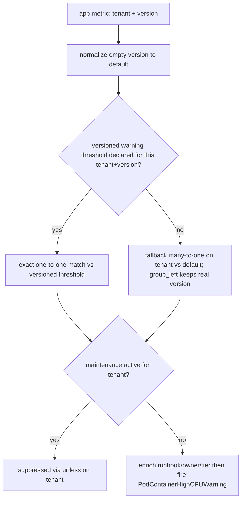

# ADR-024: Version-Aware Threshold — Declarative Cutover via the Existing Dimensional `version` Label

> Secondary (EN) copy. Primary source of truth is the Chinese version: [`024-version-aware-threshold-via-dimensional-label.md`](024-version-aware-threshold-via-dimensional-label.md).

## Status

🟡 **Proposed** (draft, 2026-05-30). Tracker: [#423](https://github.com/vencil/Dynamic-Alerting-Integrations/issues/423) (`rfc` + `epic`). This ADR is the draft for the "Future ADR" promised in #423 §10; it converges the three rounds of design discussion into locked decisions and will be finalized (status → accepted) at v2.9.0 GA.

> **Relationship to existing mechanisms**: This ADR does **not** replace or modify [`config-driven.md` §2.6 Scheduled Thresholds](../design/config-driven.md). They are two coexisting, orthogonal mechanisms — boundary in §"Boundary vs §2.6".

## TL;DR

- **Problem**: tenants want rules "pre-staged but only active on the app version bump", and at troubleshooting time need to know "which version is running now".
- **Decision**: express multi-version thresholds via a dimensional `version` label on the metric; cutover is **emergent** (whichever `version` the metric carries after a deploy joins the matching threshold). **The existing dimensional-label mechanism already achieves this with zero threshold-exporter parse/emit change** — Phase 1's core is a rule-pack **normalize layer**, not a new config schema (Option A, reuse-over-build; the `versioned:` sugar is demoted to defer-with-trigger).
- **Three reliability hardenings** (external review Pass 2–3): (1) **dynamic fallback** — a missing versioned threshold falls back to `version="default"`, eliminating the "silent alerting gap" and decoupling deploy frequency from config; (2) **split per-severity rules** — avoids the `version × severity` PromQL cardinality deadlock (otherwise the pilot would crash the alerting engine on rollout); (3) **deterministic truncation + non-piloted-pack defensive hardening** — eliminates flapping and isolates cross-pack contamination.
- **Critical pre-GA to-dos**: the metric-side `kube_pod_labels` version injection (§Decision (0a)) + OQ-1 pipeline-contract sign-off; the rest are in §Action Items.

## Context

### Original tenant ask

Tenants may want a new alert rule / threshold to become active "starting on a future date", but they want to commit the rule ahead of time. When troubleshooting, they must be able to answer "which version of the rule is Prometheus running right now", not stumble onto a version that is in git but not yet deployed. When a rule is bumped, the "deactivate old + activate new" double-write — if atomicity is not enforced — gets half-written during review/ops.

Decomposed: (1) commit rules/thresholds into `conf.d/` ahead of time without immediate effect; (2) activation aligned to app version bump; (3) troubleshooting can answer "what version is live right now"; (4) YAML must not accumulate meaningless historical activation dates.

### Hard constraints (existing project contracts)

- **Tenant declarative-only** — Platform team owns rule-pack PromQL; tenants only set plain numeric thresholds in YAML. **Any approach requiring tenants to write PromQL violates this.**
- **`user_threshold` is already a dimensional metric** — `user_threshold{tenant, component, metric, severity, <arbitrary dimensional labels>}`, already supporting `env`, `tablespace_re`, etc. ([`config-driven.md` §2.5](../design/config-driven.md)).
- **Rule pack is the platform-team-controlled normalize layer** — complexity centralized there, not pushed to tenants.
- **Cardinality Guard exists** (per-tenant `max_metrics_per_tenant` ceiling, enforced in `config/resolve.go::ResolveAtWithStats`; over-limit truncates + emits `da_tenant_metrics_over_limit`, see #652).
- **No ArgoCD/Flux** — config via Directory Scanner + SHA-256 hot-reload; rule packs via ConfigMap projected volume + Prometheus reload.

## Decision

Adopt **Version-Aware Threshold**: express "multiple coexisting versions of the same threshold" via a dimensional `version` label on the metric. Cutover is **emergent behavior** — whichever `version` the app metric carries after a deploy is the version of threshold the PromQL join aligns to.

Key convergence (a **correction of the current state** relative to #423's original proposal):

> **The project's existing dimensional-label mechanism already produces the metric shape #423 §3.2 wants, with zero exporter changes.** Therefore the Phase 1 core is the **rule pack normalize layer**, not a new config schema.

Verification: `config/resolve.go` (dimensional key path, lines 182–227) already parses `metric{label="value"}` into `CustomLabels`; `collector.go` (lines 68–78) emits `CustomLabels` as Prometheus labels in sorted order. So today a tenant can write:

```yaml
tenants:
  db-a:
    container_cpu{version="v1"}: "80"
    container_cpu{version="v2"}: "60"
```

and the exporter emits (no new code):

```
user_threshold{tenant="db-a", component="container", metric="cpu", severity="warning", version="v1"} 80
user_threshold{tenant="db-a", component="container", metric="cpu", severity="warning", version="v2"} 60
```

`version` rides the same dimensional path as `env` / `tablespace_re` — **a single mental model**.

> **Precise boundary of "zero change"** (reviewer correction): "zero change" applies to the **parse + emit** half — emitting threshold series with a version label genuinely needs no exporter change. But the **safety rail this design depends on, the OQ-6 guard, is net-new** (Go `ValidateTenantKeys` + Python da-guard, dual-language), and the metric-side version injection ((0a) above) is the real engineering work. So "Phase 1 is not a new config schema" holds, but "Phase 1 is zero effort" does **not**.

### Two independently-deployable halves (the most important architectural property)

1. **Threshold side** — tenant declares multi-version thresholds via `{version="..."}` in YAML. Exporter unchanged.
2. **Metric side** — app metric carries a `version` label (for business apps: via `app.kubernetes.io/version` + kube-state-metrics `kube_pod_labels` relabel).

**Until the metric side injects version, the whole mechanism is inert and 100% backward-compatible**: an unversioned threshold (`container_cpu: "80"`) emits a series with no `version` label (i.e. `version=""`); an app metric without injection is also `version=""`; the normalize layer rewrites both to `version="default"` and they join naturally — behavior identical to pre-change (satisfies AC-1).

### Rule Pack Normalize Layer (the real Phase 1 engineering core)

Using `rule-pack-kubernetes`'s `PodContainerHighCPU` (current join key is `on(tenant)`):

```yaml
# (0a) version injection point (bottom layer, the real engineering hard part):
#      cAdvisor's container_cpu_usage_seconds_total carries no version.
#      Approach: compute the plain percentage first (reusing the existing
#      by(namespace,pod,container) logic, zero mental change), then join
#      kube_pod_labels ONCE at the outermost level to inject version.
#      ✅ Halves the join cost vs joining version in both numerator and
#         denominator, and avoids the NaN edge case where a rolling-moment
#         version drift misaligns numerator/denominator (perf + correctness).
- record: tenant:container_cpu_percent:by_container
  expr: |
    label_replace(
      (
        (
          sum by(namespace, pod, container) (rate(container_cpu_usage_seconds_total{namespace=~"db-.+", container!="", container!="POD"}[5m]))
          /
          sum by(namespace, pod, container) (kube_pod_container_resource_limits{resource="cpu", namespace=~"db-.+"})
        ) * 100
        * on(namespace, pod) group_left(version)
          label_replace(kube_pod_labels, "version", "$1", "label_app_kubernetes_io_version", "(.+)")
      ),
      "tenant", "$1", "namespace", "(.*)"
    )

# (0b) version propagation: keep version in every by(...) layer
- record: tenant:pod_weakest_cpu_percent:max
  expr: max by(tenant, pod, version) (tenant:container_cpu_percent:by_container)  # <- version added to by()

# (1) Normalize: rewrite missing version to "default" on both sides
#     - app metric side: collapse to per (tenant, version), then default
- record: tenant_version:pod_weakest_cpu_percent:vlabeled
  expr: |
    label_replace(
      max by(tenant, version) (tenant:pod_weakest_cpu_percent:max),
      "version", "default", "version", "^$"
    )
#     - threshold side: unversioned thresholds emit series with no version label (version="")
#       keep severity in by() (Pass-2 #5): a versioned threshold can carry severity via
#       the "value:severity" suffix (e.g. `container_cpu{version="v2"}: "60:critical"`,
#       supported at resolve.go:206-210); severity must NOT be collapsed by max here.
- record: tenant_version:alert_threshold:container_cpu
  expr: |
    label_replace(
      max by(tenant, version, severity) (user_threshold{component="container", metric="cpu"}),
      "version", "default", "version", "^$"
    )

# (2) Alert: dynamic fallback + split-per-severity (Pass-2 #1 + Pass-3 cardinality hardening).
#     WARNING: do NOT use `group_left(severity)`: the default bucket may hold both warning and
#       critical (legacy `_critical` plain key), so the exact branch goes one-to-many (multiple
#       matches) and the fallback branch goes many(versions)×many(severities) (many-to-many) →
#       Prometheus runtime error that takes down the whole alerting engine.
#     FIX: split one rule per severity. With severity fixed, the RHS degenerates to a
#       per-(tenant[,version]) singleton, making every join a clean one-to-one / many-to-one;
#       the fallback uses group_left to PRESERVE the metric's real version (SRE visibility).
#       The Critical rule is a mirror (severity="critical").
- alert: PodContainerHighCPUWarning
  expr: |
    (
      (
        # exact hit on this (tenant, version)'s warning threshold (one-to-one; severity fixed -> RHS singleton)
        tenant_version:pod_weakest_cpu_percent:vlabeled
        > on(tenant, version) group_left()
          tenant_version:alert_threshold:container_cpu{severity="warning"}
      )
      or
      (
        # fallback: no matching versioned warning threshold -> use default. severity fixed makes
        # RHS a per-tenant singleton; LHS multiple versions -> legal many-to-one, group_left keeps real version
        (
          tenant_version:pod_weakest_cpu_percent:vlabeled
          unless on(tenant, version)
            tenant_version:alert_threshold:container_cpu{severity="warning"}
        )
        > on(tenant) group_left()
          tenant_version:alert_threshold:container_cpu{version="default", severity="warning"}
      )
    )
    unless on(tenant) (user_state_filter{filter="maintenance"} == 1)
    * on(tenant) group_left(runbook_url, owner, tier) tenant_metadata_info
  labels:
    severity: warning   # fixed on the alert label; Critical rule mirrors with severity="critical"
```

**The asymmetric join keys are intentional and safe**: the threshold comparison uses `on(tenant, version)`, but `user_state_filter` (maintenance) and `tenant_metadata_info` are both **per-tenant singletons with no version label** (verified: `collector.go` emits `user_state_filter{tenant,filter,severity}` and `tenant_metadata_info{tenant,runbook_url,owner,tier}`). So `unless on(tenant)` suppresses **all versions** of a tenant under maintenance (correct semantics), and `* on(tenant) group_left(...)` is a many(version-carrying LHS):one(RHS) join — a legal direction. **Conclusion: adding version does not break these two shared-metric joins.**

**Key: version propagation (what the "passive version-aware" rows in the OQ-3 table mean — and the real engineering hard part)** — the existing percent / weakest-link recording rules aggregate with `sum/max by(namespace,pod,container)` / `by(tenant,pod)`, which **drops the version label at every layer**. So (0a) must join `kube_pod_labels` at the `:by_container` layer to inject `app.kubernetes.io/version` as `version` (via a single outermost join, see above); from (0b) onward every `by(...)` aggregation must include `version` to preserve it. **This (0a) edit is the metric-side hard part — not the "thresholds can emit version" half (that half is zero-change), but the "how does the app metric carry version" half.**

> **inert-by-design is intentional, not a bug**: before the (0a) metric-side join ships, version is always `""` across the chain → normalize rewrites to `"default"` → aligns to unversioned thresholds, identical to pre-change (AC-1). I.e. the §"two independently-deployable halves" threshold-side can ship first; the metric-side ((0a) + OQ-1/OQ-4) follows, 100% backward-compatible in between. But the reviewer's point stands: **without (0a), version-aware is merely inert — so the pilot PR must include (0a) plus kind-cluster relabel validation (AC-3/AC-4), not just flip the join key and claim done.**

**Note (R5 trap, avoided)**: always use `label_replace(..., "version", "default", "version", "^$")`, **never `or on() vector(0)`** — the latter fabricates a 0 when data is missing, breaking downstream aggregation and producing false positives for "alert when value == 0" rules (e.g. `mysql_up == 0`). `label_replace` treats a missing src label as empty string, which `regex="^$"` matches — the correct and only safe form.

> **Deliberate `sum`→`max by(tenant, version, severity)` change**: the existing threshold-normalization uses `sum by(tenant)`; this ADR uses `max by(tenant, version, severity)`. Equivalent for a single threshold, but `max` is safer against "an unexpected second row in the same bucket" (with OQ-6 forbidding explicit `default`), and `severity` MUST stay in `by()` or multi-severity is collapsed (Pass-2 #5).

> **Dynamic-fallback semantics (Pass-2 #1)**: the alert's `exact or fallback` structure makes cutover mean "**only takes effect when the tenant explicitly declares that version's threshold**, otherwise it inherits `version="default"`". Benefit: routine small deploys (many deploys/day, image-SHA / SemVer-patch churn) need **no** alert-YAML change — a tenant writes `{version="v2"}` only when a specific major version needs a special threshold. This promotes the former top risk "observed-but-not-declared = silent gap" from "sentinel after-the-fact" to "**architecturally built-in, no dropped series**". Cost: a typo'd version (e.g. `v2x`) silently falls to default (not the intended value), caught by orphan detection (declared-but-not-observed). This fallback PromQL must be validated in a kind cluster (AC-3/AC-4).

> **Cardinality-match hardening (Pass-3)**: the block above uses a **per-severity split** rather than a single rule with `group_left(severity)`. Reason: the `version × severity` interleaving creates a join cardinality deadlock — if any `(tenant, version)` (especially `default`, which may hold both warning and critical from a legacy `_critical` key) has multiple severities, the exact branch `> on(tenant,version) group_left(severity)` goes **one-to-many (multiple matches)** and the fallback `> on(tenant) group_left(severity)` goes **many(versions)×many(severities) (many-to-many)** → a Prometheus runtime error that takes down the whole k8s alerting engine. Splitting per severity degenerates the RHS to a singleton, reducing everything to legal one-to-one / many-to-one. **Alternative (Route 1, more compact)**: keep one rule but in the fallback branch first `max by(tenant)` to flatten the versions and `label_replace` to force `version="default"`, lowering many-to-many to one-to-many (with `group_right()`); the cost is that **fallback alerts show `version="default"`, losing real-version visibility**. Route 2 (split per severity, above) preserves the version and matches the existing per-severity alert idiom, so it is the **recommended default**; the pilot / maintainer makes the final call and validates cardinality in kind.

The diagram below shows the evaluation flow for a single-severity (Warning) rule (the Critical rule mirrors it):



### K8s failure modes auto-immunized

| Failure mode | Why it is handled automatically |
|---|---|
| Rolling-update coexistence | metrics `{version="v1"}` / `{version="v2"}` coexist for 5–10 min, each joining its threshold |
| Rollback drift | after `helm rollback`, metric reverts to v1; v2 threshold becomes an orphan (no matching metric) → does not fire |
| GitOps propagation lag | v2 threshold was already "latent" before the bump; no reliance on precise propagation timing |
| YAML history accumulation | `{version=...}` has no time axis; stale versions are just orphan sections awaiting GC |
| Atomic cutover | multiple version keys for one metric are adjacent — a single review diff hunk |

## Boundary vs §2.6 Scheduled Thresholds (two coexisting mechanisms, NOT a replacement)

`config-driven.md` §2.6's `ScheduledValue.overrides: [{window, value}]` is a **recurring time-window** mechanism (v0.12.0), deliberately separate from this ADR:

| Dimension | §2.6 Scheduled Threshold | ADR-024 Version-Aware |
|---|---|---|
| Switching axis | **time** (recurring window, `ResolveAt(now)` reads wall-clock) | **state / version label** (no time evaluation) |
| Trigger | UTC clock, repeats daily | **new version on the app metric after a deploy**, one-time cutover |
| Aligns to | fixed daily windows (e.g. relax thresholds at night) | K8s rolling update (immune to deploy timing drift) |
| Typical use | "relax to 200 during 22:00–06:00 UTC" | "tighten CPU threshold from 80 to 60 once v2 ships" |

#423 §2 round 1 (Option B) once proposed **extending `ScheduledValue` with absolute `from`/`until` dates**; this was rejected in §4 R1 (below). Hence this ADR is not an extension of §2.6 — §2.6 handles periodic windows, this ADR handles one-time version alignment. They are orthogonal and can both apply to the same tenant.

## Options Considered

### Option A: Reuse existing dimensional `{version="..."}` label (✅ chosen)

| Dimension | Assessment |
|---|---|
| Complexity | **Low** — zero exporter changes; only the rule pack |
| Blast radius | **Low** — does not touch the thousand-tenant hot-reload critical path (config parser) |
| Cardinality accounting | **Free** — each `{version=}` key is already a distinct resolved threshold counted by the existing per-tenant guard |
| Backward compat (AC-1) | **Trivially true** — exporter unchanged; unversioned tenants see zero series-count delta |
| Consistency | **High** — same dimensional model as `env`/`tablespace_re` |

**Pros**: minimal net-new surface; AC-1 satisfied for free; default fallback centralized in one place (the rule pack).
**Cons**: versions scatter across multiple keys (weaker atomic review, though adjacent and a single diff hunk); no exporter-level auto `version="default"` (handled by the normalize-layer `label_replace`); da-guard naming rule must special-case the `version` label value.

### Option B: New dedicated `versioned:` YAML block (#423 §3.1 original, ✗ deferred)

| Dimension | Assessment |
|---|---|
| Complexity | **Med-High** — net-new parser type + `UnmarshalYAML` path + resolve path + da-guard schema + da-parser + tests |
| Blast radius | **High** — touches the most safety-critical hot-reload config parser |
| Ambiguity | introduces a **second** path to attach a `version` label (dimensional `{version=}` still exists); guard must forbid mixing |

**Pros**: ergonomic grouping; natural atomic review; natural home for auto `version="default"` and the naming guard; can inherit defaults (dimensional keys are tenant-only, no inheritance).
**Cons**: high blast radius; **functional duplication** with the normalize-layer default injection (two places can drift); an extra code path.

### Option C: `POST /active-version` write API (✗, see R4)

Introduces a "second state" that breaks the single SOT; calling it mid-rolling causes transient misalignment.

## Trade-off Analysis

The core call is **reuse-over-build** (vibe-brainstorm Q1): the target capability already exists 90% in the dimensional mechanism. Option B's only real gain is "authoring grouping + a home for the naming guard", at the cost of touching the hot-reload critical path, introducing a duplicate default-injection path, and turning AC-1 (zero behavior change on the highest-cardinality, hot-reload-critical component) from "automatically true" into "must be verified".

Hence **Option A**, with the `versioned:` sugar listed as **defer-with-trigger** (see Consequences). The default fallback is owned solely by the normalize layer to avoid double-write drift.

## Open Questions resolution

| OQ | Resolution | Nature |
|---|---|---|
| **OQ-1** pipeline contract / version source | Pipeline **calls no write API** (reaffirms R4). Default version source = `app.kubernetes.io/version` (K8s standard label) via kube-state-metrics `kube_pod_labels` relabel to `version`. | **Self-decided default**; tenant-team sign-off is an action item (not a design blocker) |
| **OQ-2** Cardinality budget | `version` is a dimensional multiplier; concurrent versions: steady-state N=1, rolling window N=2, rollback/staged overlap cap N=3. **Design guideline: support ≤3 concurrent versions within the existing per-tenant cap**; each version = +1 series per (metric,severity), already counted+truncated by the existing guard. | **Self-decided guideline**; empirical N=1/2/3 deferred to pilot (action item); budget bump only if over-cap (trigger) |
| **OQ-3** which rules to sweep | **Principle**: a rule is version-aware ⟺ it joins a tenant-app perf metric to `user_threshold` on `(tenant)`. Cluster/infra-wide or state-based rules are version-agnostic. `rule-pack-kubernetes` classification below. | **Self-decided** |
| **OQ-4** relabel template kind validation | Template (`kube_pod_labels` → `version` join) goes into the migration doc; in-kind-cluster validation is bound to AC-3/AC-4 (rolling/rollback scenarios), done at impl time. | **Deferred to impl** (not a design blocker) |
| **OQ-5** sentinel period | Two-tier `version_orphaned`: **warn @ 7d, critical @ 30d** (aligned to weekly release cadence). `version_unknown` (observed-but-not-declared) uses **`for: 5–10m`, NOT `for: 0s`** (Pass-2 #2) — during a normal rolling update there is a 1–3 min GitOps propagation lag between a new Pod emitting the version label and the exporter hot-reloading the threshold; `for: 0s` would fire on every deploy → alert fatigue → SRE mutes it → the sentinel becomes a formality. With a buffer, only "a new version persisting >5–10m with still no matching threshold and no fallback" is judged a real omission. (With dynamic fallback, `version_unknown` is already demoted to a visibility signal, so the buffer is even more appropriate.) | **Self-decided**; buffer value tuning deferred (trigger: tenant cadence / noise feedback) |
| **OQ-6** version naming convention + scope | da-guard regex `^[a-z0-9][a-z0-9._-]*$`; **forbid empty string and the literal `default`** (reserved for fallback); **do not** enforce SemVer (allow image-tag / SHA). **Plus scope: `version` keys are only allowed on already-piloted components** (Phase 1 = kubernetes container_cpu/memory); version keys on non-piloted components are rejected (prevents cross-pack double-count, see Consequences). Note this guard is **net-new dual-language work**: Go `ValidateTenantKeys` + Python da-guard must stay in sync (label values are currently **completely unvalidated** — `parseLabelsStringWithOp` accepts anything). **Pilot must align with real version strings** (Pass-3 final review): what tenant CI/CD emits to `app.kubernetes.io/version` may include uppercase (`V1.0.0`), long Git SHAs, or branch combos — too strict a regex falsely rejects normal deploys, too loose pollutes the label. Finalize the regex after observing real samples in the pilot (may need to relax case / length). | **Self-decided + pilot calibration** |

### `rule-pack-kubernetes` rule classification (OQ-3 concrete result)

| Rule | Class | Reason |
|---|---|---|
| `PodContainerHighCPU` / `PodContainerHighMemory` | **version-aware** | join `tenant:alert_threshold:container_*` on `(tenant)` → add `version` |
| `tenant:alert_threshold:container_*` (threshold-normalization) | **version-aware** | switch to `max by(tenant, version)` + `label_replace` default |
| `tenant:container_*_percent:by_container` / `:pod_weakest_*:max` | **version-aware** (passive) | must ensure version label propagates into the percent recording rule |
| `ContainerCrashLoop` / `ContainerImagePullFailure` | **version-agnostic** | based on `user_state_filter` (pod-state string match), no numeric-threshold join |

## Consequences

### Easier
- Threshold cutover auto-aligns with K8s rolling update — no timing drift, no 3 a.m. auto-merge risk.
- "What version is running" answerable via `count by(version)(<app metric>)` (feeds §5.6 `check-running-rule` three-layer truth).
- YAML no longer accumulates historical activation dates.

### Harder / new failure mode (blast-radius, vibe-brainstorm Q5)
- **observed-but-not-declared (architecturally resolved by dynamic fallback, Pass-2 #1)**: the original pure-exact `on(tenant, version)` join produced nothing for a v2 metric with no v2 threshold → v2 pods unalerted (false negative). **The corrected design uses dynamic fallback**: an exact-match miss falls back to the `version="default"` threshold (see alert PromQL above) instead of dropping the series. So this risk is **no longer a sentinel after-the-fact patch but built into the architecture**. The `version_unknown` sentinel is demoted to a **visibility signal** (a version is running undeclared, or a typo), not a false-negative gatekeeper, and its firing needs a buffer (see OQ-5 fix). Residual risk: a typo'd version silently falls to default, caught by orphan detection.
- **declared-but-not-observed = orphan threshold** (harmless): a threshold series with no matching metric does not fire. It is a GC target (portal yellow, `version_orphaned` 7d/30d), not red.
- **`default` naming collision** (guarded by OQ-6): if a tenant writes both an unversioned threshold (→ `version=""`) and an explicit `{version="default"}`, after `label_replace` both become `version="default"`; `max by(...,version)` takes the max within one bucket (a `sum` variant would double-count). Hence OQ-6 **forbids explicit `default`**.
- **🟠 version × multi-severity (Pass-2 #5 — corrects the previous version's wrong conclusion)**: the previous version wrongly claimed "version-aware is structurally warning-tier only". **Correction**: the dimensional key path indeed **does not support the `_critical` suffix** (`resolve.go:180`), but it **does support the `value:severity` suffix** (`resolve.go:206-210`) — `container_cpu{version="v2"}: "60:critical"` correctly emits severity="critical". So **a single severity per version IS supported**; the normalize uses `max by(tenant, version, severity)` to keep the severity dimension, but the alert **must split per severity** (Pass-3) — a single-rule `group_left(severity)` hits a `version × severity` cardinality deadlock (see the Pass-3 hardening note in §Decision). **The real limitation** is "the same version carrying **both** tiers (warning+critical)": two dimensional keys both have label set `{version="v2"}` (collision), and `_critical` doesn't work on dimensional keys — this "per-version dual tier" is defer-with-trigger (trigger: a tenant needs warn+crit on the same version). **No longer forced warning-only.**
- **🟠 Cardinality truncation must become deterministic (Pass-2 #3 — promoted from "known limitation" to defensive code)**: the per-tenant guard (`resolve.go:229–244`) truncates via `result[:startIdx+limit]`, while dimensional keys are appended by `for key := range overrides` (**Go's randomized map iteration**). When a tenant crosses the cap, the dropped version varies scrape-to-scrape → alert series flicker → **Prometheus alert flapping + repeated PagerDuty pages** — the worst kind of non-determinism in an observability system. **Not acceptable as a "known limitation". Phase 1 must fix**: sort keys deterministically before truncation (protect unversioned / `default` first, then `sort.Strings()`), so the dropped version is always fixed (lexicographically last) and state stays stable (persistently absent + triggers the over-limit alert, not flicker). AC-7 upgraded accordingly.
- **🟠 Shared `user_threshold` cross-pack leak → needs PromQL defense-in-depth (Pass-2 #4)**: `user_threshold` is shared by all packs. If a tenant bypasses CI (manual apply / direct test-env edit) and writes `{version=...}` on a **non-piloted component** (redis / mysql), that pack's `sum by(tenant)(user_threshold{component="redis"})` will **sum across versions → double-count → wrong existing core alerts**. **Relying on CI `da-guard` alone is insufficient (defense-in-depth)**. Phase 1 applies a **light hardening to every non-piloted pack's normalize**: add `version=~"|default"` to the matcher (matches only no-version / default — an absent label is treated as empty string so `^$` equivalently matches), auto-filtering stray versions so existing alerts stay safe even if the CI guard fails. **Trade-off (explicit)**: this lightly touches the 13 non-piloted packs in Phase 1 (**just one label matcher**, not a full `by(tenant, version)` rewrite), modestly increasing blast radius / test load; the alternative is relying solely on OQ-6 guard scoping. Maintainer decides Phase 1 inclusion vs Phase 2 defer.
- Rule-pack join keys move from `on(tenant)` to `on(tenant, version)` across packs — needs per-pack staged rollout (Phase 2 scope).
- **Dashboards / portal queries assume no version label**: once tenants write version keys, unaggregated `user_threshold{...}` panels suddenly see 2–3× series with a new `version` label; panels using exact-match label joins may break. Action item added: audit Grafana / portal queries.

### To revisit (defer-with-trigger)
- **`versioned:` dedicated block (Option B)**: trigger = a postmortem where "scattered keys" caused a review miss, or ≥N tenants reporting an ergonomics pain. Re-evaluate touching the hot-reload path then.
- **GC auto-PR bot**: trigger = after Phase 1 sentinel + portal warning run 1–2 quarters and manual-GC burden complaints persist (#423 §6 Phase 3).
- **DB-engine ServiceMonitor relabel**: trigger = non-business apps (mysqld_exporter etc. that do not know their own version) need version alignment (#423 §6 Phase 2.5).
- **sentinel period / cardinality budget**: triggers per OQ-2 / OQ-5.

## External Adversarial Review (Pass 2–3 — Gemini)

### Pass 2

A second post-convergence external review (Gemini, SRE / senior-architect lens). Classified take / reframe / reject — **all 5 taken** (2 with a syntax/scope reframe), none rejected:

1. **Dynamic-fallback join** — TAKE (syntax reframe). The original pure-exact `on(tenant, version)` join's silent-gap is promoted from "sentinel after-the-fact" to "architecturally built-in fallback to `version="default"`", decoupling deploy frequency from config changes. Gemini's `unless … group_left()` example is invalid syntax; corrected to a legal "exact `or` (`unless` set-difference `>` default)". → §Decision alert PromQL + Action Item 2.
2. **`version_unknown` buffer** — TAKE. Fixes an internal contradiction (the ADR cites a 1–3 min propagation lag yet set `for: 0s` → every rolling update would false-fire). Changed to `for: 5–10m`. → OQ-5 + Action Item 4.
3. **Deterministic truncation** — TAKE. Go map-iteration truncation → alert flapping; not acceptable as a "known limitation"; sort keys before truncating (unversioned/`default` first). → AC-7 + Action Item 12.
4. **Non-piloted pack PromQL hardening** — TAKE (scope reframe). Defense-in-depth: add `version=~"|default"` to non-piloted packs' matchers so existing alerts stay safe even if the CI guard fails. Trade-off stated: Phase 1 lightly touches 13 packs (one matcher, not a rewrite). → §Consequences + Action Item 13.
5. **Multi-severity preservation** — TAKE, **and corrects a factual error in the previous version**. The previous version wrongly claimed "structurally warning-tier only"; in fact dimensional keys support the `value:severity` suffix (`resolve.go:206-210`), and the normalize preserving it via `by(…, severity)` + alert `group_left(severity)`. The real limit is only "the same version with **both** tiers" (deferred). → §Decision + §Consequences.

Pass 2 **does not disturb** the §Decision reuse-over-build thesis (threshold-side parse/emit zero-change + rule-pack normalize layer still hold), but raises reliability to GA grade: eliminates the silent gap, eliminates truncation flapping, preserves multi-severity, and adds defense-in-depth.

### Pass 3 (PromQL cardinality-match hardening)

A third review focused on the Pass-2-corrected alert PromQL and caught a cardinality-match deadlock that **would crash Prometheus at runtime** (self-verified as real):

- **Exact branch wrong direction**: in `> on(tenant, version) group_left(severity)`, the RHS (threshold) is the side carrying `severity` (the "many"), so `group_left` is backwards; when the `default` bucket holds both warning and critical (legacy `_critical` plain key) → one-to-many → `multiple matches` crash.
- **Fallback branch many-to-many**: after `unless`, the LHS may carry multiple undeclared versions (v2/v3 mid-rolling) and the RHS default threshold multiple severities, joined only `on(tenant)` → **many-to-many → 100% runtime error**.

**Disposition (TAKE, self-verified)**: adopt **Route 2 (split per severity)** — fixing severity degenerates the RHS to a singleton, lowering the exact branch to one-to-one and the fallback to many-to-one (`group_left` preserves the real version). It matches the existing per-severity alert idiom and maximizes SRE version visibility. **Route 1** (single rule + fallback `max by(tenant)` flatten + `group_right()`) is the more compact alternative, at the cost of fallback alerts showing `version="default"`. The pilot / maintainer makes the final call and validates cardinality in kind (updated §Decision PromQL + Action Item 2). Pass 3 likewise leaves the thesis intact — a pure implementation-layer PromQL structural hardening — but **without it the pilot would take down the entire k8s alerting engine on rollout**, making it the most critical convergence before GA.

**Final verdict**: after verifying the Route 2 PromQL vector matching branch by branch, Gemini gave it a **green light (Approved & Locked, Ready to Ship)**, leaving only two **pilot-phase operational boundaries** (not design defects): (1) the `da-guard` regex boundary against real `app.kubernetes.io/version` string shapes (uppercase / long SHA) — folded into **OQ-6** (pilot calibration); (2) verifying the alert **Fire→Resolve loop** when the old version's metric disappears after a rolling update — folded into **AC-9**. The design-level runtime-crash risk (many-to-many deadlock) is fully sealed at the design stage by PromQL logic.

**(0a) performance optimization (final-review follow-up)**: per Gemini's suggestion, version injection was changed to "compute the plain percentage first, then a single outermost join of `kube_pod_labels`" (see §Decision (0a)) — halving the join cost vs joining version in both numerator and denominator, and eliminating the `NaN` edge case where a rolling-moment version drift misaligns numerator/denominator.

## Rejected Alternatives (#423 §4 convergence — the soul of the ADR)

- **R1. `ScheduledValue.from/until` absolute-date schema extension** — Rejected. YAML accumulates meaningless activation dates (an expired `from` is forever true, dead code left in-file) + double-write atomicity (missing `until` → two active conflicting; missing `from` → gap). Swallowing the time axis into declarative config is a structural error. **This is precisely the answer to "why not extend §2.6".**
- **R2. Scheduled PR Merge orchestration** — Rejected. K8s rolling/rollback drift (Git's instantaneous binary merge cannot align with K8s's 5–10 min gradual rollout) + GitOps propagation lag (merge→ConfigMap→reload 1–3 min) + helm rollback does not reverse-revert a Git PR.
- **R3. Gemini original "tenant writes two coexisting PromQL rules directly"** — Rejected. Violates the declarative-only core contract. The concept was correct, though, and was adapted into this ADR.
- **R4. `POST /active-version` write-state API** — Rejected. Introduces a second state breaking the single SOT; a mid-rolling call causes transient misalignment. The metric carrying the version label *is* the SOT.
- **R5. PromQL normalize via `or on() vector(0)`** — Rejected (a trap). Breaks downstream `min/avg/sum`; fabricates false positives for "alert when value == 0" rules. Correct form = `label_replace(..., "version", "default", "version", "^$")`.
- **R6. Per-tenant version injection at the ServiceMonitor (Path A)** — Rejected for Phase 1. Pushes complexity to tenants, violating "centralize in the platform-controlled rule pack". Partially adopted only for the Phase 2.5 DB scenario.
- **R7. GC auto-PR bot in Phase 1** — Rejected for Phase 1. No bot infrastructure; "stable for 24h" needs a new cron/reconciler (new SLO/failure point); risk of mis-deleting while rolling is incomplete. Phase 1 is detect-only (CLI + sentinel + portal warning).

## Acceptance Criteria (Phase 1 GA, per #423 §8)

1. **AC-1** Existing (unversioned) tenants behave identically after upgrade — no alert / metric series-count change.
2. **AC-2** A pilot tenant can declare `v1`+`v2` thresholds in `rule-pack-kubernetes`; each metric stream joins its number.
3. **AC-3** Rolling update (kind) v1→v2 coexistence period: no false positive.
4. **AC-4** Rollback (kind): v1 metric reappears and aligns to v1 threshold; v2 threshold becomes an orphan but does not mis-fire.
5. **AC-5** `da-tools detect-orphan-versions` + `check-running-rule` cover the SRE 3-a.m. troubleshooting reflex.
6. **AC-6** `GET /versions` passes the existing schemathesis contract test.
7. **AC-7** Cardinality Guard does not warn at N=3 concurrent versions; **and "just over the cap" truncation is deterministic** (Pass-2 #3): `resolve.go` sorts dimensional keys lexicographically before truncation (protecting unversioned/`default` first); the test must assert **the same over-cap config drops the same fixed version across repeated scrapes** (no flapping), not "documented as a known limitation".
8. **AC-8** Docs synced (dev-rules #4 Doc-as-Code): CHANGELOG / CLAUDE.md / README / migration guide / config-driven.md §2.x / troubleshooting.md.
9. **AC-9** Alert lifecycle closes (Pass-3 final review): in kind, verify that after a rolling update finishes and old Pods are destroyed so the `{version="v1"}` metric goes absent, **a firing v1 alert is properly resolved** by Prometheus/Alertmanager (join RHS breaks → implicit clear → the notification channel receives `resolved`), ensuring a complete Fire→Resolve loop with no zombie alerts.

## Action Items

1. [ ] **OQ-1 sign-off**: tenant team confirms "pipeline only lets the metric carry version, calls no write API" + provides the business-app version-source template.
2. [ ] **Rule-pack pilot (dynamic fallback + cardinality-safe severity)**: add the normalize layer (`:vlabeled` + `max by(tenant, version, severity)`) to `rule-pack-kubernetes`; change the 4 version-aware rules to the **exact-or-fallback** PromQL (Pass-2 #1). **⛔ Do NOT use the crashing `group_left(severity)` (Pass-3)** — explicitly choose **Route 2 (split per severity, recommended)** or Route 1 (single rule + fallback `max by(tenant)` version flatten + `group_right()`), landing a legal cardinality structure. Validate fallback **and cardinality matching** in a kind cluster (AC-3/AC-4).
3. [ ] **da-guard (dual-language)**: Go `ValidateTenantKeys` + Python da-guard enforce OQ-6 regex + forbid-list (empty / `default`) + **component scope allowlist** (version key on a non-piloted component → reject) on the `version` label value of dimensional keys.
4. [ ] **Sentinel**: `da_config_event{event="version_orphaned"}` (7d/30d two-tier) + `version_unknown` (**`for: 5–10m` buffer, not `for: 0s`**, Pass-2 #2, avoids rolling-update false positives) → `rule-pack-operational`.
5. [ ] **tenant-api**: `GET /api/v1/tenants/{id}/versions` (read-only reconciliation: declared/observed/orphaned/missing) + swag + `make api-docs`. **No** write API.
6. [ ] **CLI**: `da-tools detect-orphan-versions` (read-only) + `check-running-rule` (three-layer truth).
7. [ ] **Portal**: tenant-manager timeline panel (Active/Declared/Orphaned green/grey/yellow), `make portal-build` + `make test-portal`.
8. [ ] **Cardinality measurement**: pilot N=1/2/3 series counts, feed OQ-2.
9. [ ] **kind validation**: OQ-4 relabel template + AC-3/AC-4 rolling/rollback scenarios.
10. [ ] **Docs**: new config-driven.md section (mark the §2.6 boundary); `docs/migration/v2.9.0-version-aware.md`; troubleshooting.md "Rule version mismatch".
11. [ ] **Dashboard / portal query audit**: review unaggregated Grafana / portal queries against `user_threshold` to confirm the new `version` label does not break existing panels.
12. [ ] **Go exporter deterministic truncation (Pass-2 #3, new)**: in `config/resolve.go::ResolveAtWithStats`, sort dimensional keys deterministically before the cap truncation (unversioned/`default` first, then `sort.Strings()`), eliminating map-iteration flapping; unit test asserts stable over-cap truncation.
13. [ ] **Non-piloted pack defensive hardening (Pass-2 #4, new)**: add `version=~"|default"` to the `user_threshold` normalize matcher in the 13 non-piloted packs, preventing cross-version double-count if the CI guard fails (maintainer decides Phase 1 inclusion vs Phase 2).
14. [ ] **GA finalize**: at v2.9.0 GA, set this ADR status → accepted and sync the EN copy; **also do an editorial readability pass** — move the three-pass review provenance (the "Pass 2/3" tags) out of the body into the "External Adversarial Review" appendix, and sub-section §Decision (threshold-side / metric-side / alert+cardinality / normalize safety rules) to lower cognitive load (pure editorial, no technical change).

## Links / Cross-Reference

- [#423](https://github.com/vencil/Dynamic-Alerting-Integrations/issues/423) — epic SOT (full three-round design context)
- [`config-driven.md` §2.5 / §2.6](../design/config-driven.md) — existing dimensional + scheduled mechanisms (this ADR's foundation and boundary)
- `config/resolve.go` (dimensional key path 182–227) / `collector.go` (CustomLabels emit 68–78) — verification basis
- [ADR-005 Projected Volume for Rule Packs](005-projected-volume-for-rule-packs.en.md) — rule-pack propagation chain
- [`architecture-and-design.md` Cardinality Guard](../architecture-and-design.md) — must align in Phase 1
- [`test-map.md` Test Injection Seam](../internal/test-map.md) — follow v2.8.0 test standards when sweeping (`freshMetrics`/`SetMetrics`, no global swap)

> **Convergence note**: this ADR distills the locked decisions from #423's three design rounds (user × Claude × Gemini cross-review). The key current-state correction is "the dimensional label already achieves the target metric shape" — which shifts the Phase 1 core from a schema extension to the rule-pack normalize layer and demotes the `versioned:` sugar to defer-with-trigger.
