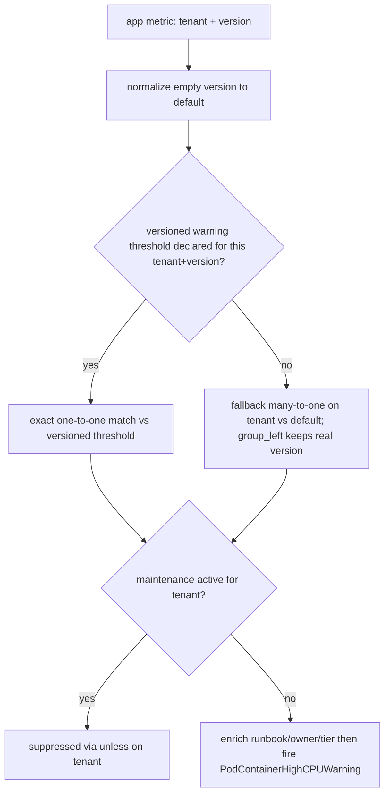

# ADR-024: 宣告式 Dimensional 告警引擎 — Version-Aware Thresholds + Custom Alerts

## 狀態

✅ **Accepted**（架構決策，目標 v2.9.0）。本 ADR 記錄一個**宣告式 dimensional 告警引擎**，含兩個能力：**version-aware thresholds**（平台 authored，k8s pilot 已 merge）與 **custom alerts**（租戶自訂，recipe 設計收斂、實作進行中）——**兩者同屬 v2.9.0、非分期釋出**，差異只在實作現況（見 §As-built）。`status:` frontmatter 維持機讀單值 `accepted`（架構決策已定；ADR 記錄決策而非實作完成度）。Tracker：[#423](https://github.com/vencil/Dynamic-Alerting-Integrations/issues/423)（version-aware，`rfc` + `epic`）+ [#741](https://github.com/vencil/Dynamic-Alerting-Integrations/issues/741)（custom alerts，`epic`）。

> **與既有機制的關係**：本 ADR 不取代、不修改 [`config-driven.md` §2.6 排程式閾值（Scheduled Thresholds）](../design/config-driven.md)。兩者是並存的不同機制，界線見 §2。

## 戰略弧：Version-Aware 是地基，Custom Alert 是北極星

> 本 ADR 是「一個引擎 + 兩個能力」，不是分期的專案計畫。讀者應先建立這個框架，再讀下方重型機械——否則會誤判為 over-engineering。

本專案的產品北極星不是「平台預設的標準告警」，而是**賦能各階層（platform / domain / tenant）以宣告式語法自訂告警（Custom Alerts）**，填補標準 rule pack 涵蓋不到的 domain-level 與 app-level 邊界——做不到就無法 GA。但這直接撞上本專案的地基鐵則：**declarative-only、永不寫 PromQL**（§硬約束、[ADR-008](008-operator-native-integration-path.md)）。

同一套**宣告式 dimensional 告警機械**——dimensional-label 模型、scrape-time relabel、rule-pack normalize / compile 層、graceful-degradation join、promtool 安全網、per-tenant 隔離——撐起兩個能力：

- **能力 A — Version-Aware Thresholds（§背景–§Action Items）**：在平台 authored 的 rule pack 上，讓租戶宣告**多版本數字閾值**。它是**地基與能力證明**——先證明這套機械能在 prod 安全運轉。
- **能力 B — Custom Alerts（§Custom Alerts）**：把同一套機械開放給**各階層（platform / domain / tenant）**，用**參數化 recipe**（非 PromQL）定義標準 rule pack 涵蓋不到的告警。A 的 normalize / join / promtool gate / 隔離原封復用（見 §Custom Alerts「復用既有機制」）。這是產品北極星。

**兩個能力同屬 v2.9.0、非分期釋出**——刻意不用「Phase 1 / Phase 2」把讀者心智切兩半（避免誤讀為兩次釋出或成熟度落差；且本 ADR 既有的 "Phase 2 = 其餘 pack 的 rollout" 用法另有所指，再借會撞名）。唯一差異是**實作現況**（A 已 merge、B 進行中），列於 §As-built。

**文件結構決策（收斂自內外部討論）**：Custom Alerts 折入本 ADR 而非另開 ADR-025，因為兩個能力共用同一個底層引擎、同一個 tenant-api 寫入邊界、同一條 CI pipeline——拆開會切斷「為何地基要鋪這麼重」的因果，並製造「`validate()` 該遵哪份 ADR」的虛擬邊界。**殘留 open question**：若日後本 ADR 篇幅難讀，再評估把「活體引擎 spec」移入 [`docs/design/`](../design/)（repo 中活體規格的適切家，ADR 仍 snapshot-style 記錄離散決策）。待觸發再議。

## As-built（落地現況）

> `status:` frontmatter 維持機讀純值 `accepted`；實作現況列於此。**使用方式**（租戶宣告 + 平台 KSM 搶修）見 [Version-Aware Thresholds 使用攻略](../scenarios/version-aware-thresholds.md)。

**能力 A — Version-Aware Thresholds（Kubernetes pilot 已 merge，目標 v2.9.0）**：`container_cpu` + `container_memory` 兩 metric 已 version-aware。落地四塊：rule pack normalize layer（version 注入 → 動態降級 → 拆 per-severity 規則）、`version` label value 的 da-guard 雙語驗證、KSM-allowlist 三層防禦、tenant-api 對無效 `version` 的寫入拒絕。PR 拆解見 [#423](https://github.com/vencil/Dynamic-Alerting-Integrations/issues/423)。

⛔ **部署前提（HARD）**：kube-state-metrics 必須設 `--metric-labels-allowlist=pods=[app.kubernetes.io/version]`，否則 `kube_pod_labels` 不帶 version、version 注入 join 匹配空集、**版本閾值靜默 inert**（真叢集實證）。三層防禦守住此前提：runtime sentinel `VersionAwareThresholdInert` 是安全網、CI static lint `check_ksm_version_allowlist.py` 攔誤配。

**能力 B — Custom Alerts（實作進行中，目標 v2.9.0）**：設計收斂；recipe 庫 / 編譯器 / discovery catalog / 兩個 UX 為 net-new，實作尚未開始（見 §Custom Alerts）。

**Deferred（defer-with-trigger）**：

- 其餘（kubernetes 以外的）pack 之 version-awareness — **此為「能力證明」性質、非北極星**（trigger：客戶對非-k8s metric 提出版本專屬閾值需求；正解見 §Custom Alerts 之外部後端 relabel 與 [#716](https://github.com/vencil/Dynamic-Alerting-Integrations/issues/716)）。
- 租戶 self-service 驗證「版本閾值是否生效」——tenant-api resolved-view — **已被 §Custom Alerts 的唯讀 discovery catalog 併吞**（同一機制：給租戶看 Prometheus 裡真正活著什麼）。
- `versioned:` config sugar / portal UI inline 編輯輔助（trigger：portal / operator epic [#692](https://github.com/vencil/Dynamic-Alerting-Integrations/issues/692)；註：custom alerts 採 portal recipe 表單 + inline help，**不**新增 `versioned:` schema）。

## TL;DR

- **問題**：tenant 想「規則預先放上、配合 app 升版才生效」，且查錯時要知道「現在跑哪個版本」。
- **決策**：用 metric 上的 dimensional `version` label 表達多版本閾值，cutover 為 **emergent**（升版後 metric 帶哪個 `version` 就 join 對應閾值）。**既有 dimensional-label 機制已能在 threshold-exporter parse/emit 零改動下達成**——Phase 1 核心是 rule pack 的 **normalize layer**，而非新 config schema（Option A，reuse-over-build；`versioned:` sugar 降為 defer-with-trigger）。
- **三大可靠性硬化**：(1) **動態降級**——缺版號閾值自動 fallback 到 `version="default"`，消「silent alerting gap」並解除部署頻率耦合；(2) **拆 per-severity 規則**——避開 `version × severity` 的 PromQL cardinality 死鎖（否則 pilot 上線即癱瘓告警引擎）；(3) **確定性截斷 + 非 pilot pack 防禦硬化**——消 flapping、隔離跨 pack 污染。
- **GA 前關鍵待辦**：metric-side 的 `kube_pod_labels` version 注入（§Decision (0a)）+ OQ-1 pipeline 契約簽核；其餘見 §Action Items。

## 背景（Context）

### 訴求原語

> Tenant 對新的 alert rule / threshold 可能設定「某個日期開始才 active」，但會事先把規則放上來。查錯時要能知道「現在運作中的 rule 是什麼版本」，而不是找到已上 git 但未 deploy 的版本。同一條規則升版時的「舊失效 + 新生效」雙寫若沒 enforce atomicity，會在 review／操作中漏寫。

訴求拆解：(1) 規則／閾值能事先 commit 進 `conf.d/` 而不立即生效；(2) 生效時機跟 app 升版對齊；(3) 查錯時能明確答出「現在 Prometheus 跑的是什麼版本」；(4) 不要讓 YAML 累積無意義的歷史生效日。

### 硬約束（沿用本專案既有契約）

- **Tenant declarative-only** — Platform team 寫 rule pack PromQL，tenant 只在 YAML 設純數字閾值。**任何要 tenant 寫 PromQL 的方案都違反此約束**。
- **`user_threshold` 已是 dimensional metric** — 既有 schema `user_threshold{tenant, component, metric, severity, <任意 dimensional labels>}`，已支援 `env`、`tablespace_re` 等維度（[`config-driven.md` §2.5 Regex 維度閾值](../design/config-driven.md)）。
- **Rule pack 是 platform team 集中管理的 normalize 層**，複雜度集中於此、不下放 tenant。
- **Cardinality Guard 存在**（per-tenant `max_metrics_per_tenant` 上限，`config/resolve.go::ResolveAtWithStats` 強制；超標 truncate + emit `da_tenant_metrics_over_limit`，見 #652）。
- **沒有 ArgoCD/Flux** — config 走 Directory Scanner + SHA-256 hot-reload；rule pack 走 ConfigMap projected volume + Prometheus reload。

## 決策（Decision）

採用 **Version-Aware Threshold**：以 metric 上的 dimensional `version` label 表達「同一閾值的多個並存版本」，cutover 是 **emergent behavior**——升版後 app metric 帶上哪個 `version`，PromQL join 就對齊哪個版本的閾值。

關鍵收斂（相對於 #423 原始提案的**現況校正**）：

> **本專案既有的 dimensional-label 機制，已能在 exporter 零改動下產出 #423 §3.2 想要的 metric shape。** 因此 Phase 1 的核心是 **rule pack normalize layer**，而非新的 config schema。

驗證依據：`config/resolve.go`（dimensional key path，182–227 行）已把 `metric{label="value"}` 解析為 `CustomLabels`；`collector.go`（68–78 行）把 `CustomLabels` 依字典序 emit 成 Prometheus label。因此 tenant 今天就能寫：

```yaml
tenants:
  db-a:
    container_cpu{version="v1"}: "80"
    container_cpu{version="v2"}: "60"
```

exporter 直接吐出（無須任何新程式碼）：

```
user_threshold{tenant="db-a", component="container", metric="cpu", severity="warning", version="v1"} 80
user_threshold{tenant="db-a", component="container", metric="cpu", severity="warning", version="v2"} 60
```

`version` 與 `env` / `tablespace_re` 是同一條 dimensional 路徑，**單一心智模型**。

> **「零改動」的精確邊界**：零改動指的是 **parse + emit** 這半邊——閾值 series 帶 version label 流出來確實不需動 exporter。但本設計**依賴的安全護欄 OQ-6 guard 是 net-new**（Go `ValidateTenantKeys` + Python da-guard 雙語），且 metric-side 的 version 注入（上文 (0a)）是真正的工程量。所以「Phase 1 不是新 config schema」成立，但「Phase 1 零工程量」**不**成立。

### 兩半獨立可部署（本 ADR 最重要的架構性質）

Version-Aware 由兩個彼此獨立的半邊組成，可分開 ship、互不阻塞：

1. **閾值宣告半邊（threshold side）** — tenant 在 YAML 用 `{version="..."}` 宣告多版本閾值。Exporter 零改動。
2. **Metric 版本注入半邊（metric side）** — app metric 帶上 `version` label（業務 app 場景透過 `app.kubernetes.io/version` + kube-state-metrics `kube_pod_labels` relabel）。

**在 metric side 尚未注入 version 之前，整套機制是 inert（惰性）且 100% 向下相容的**：未版本化的閾值（`container_cpu: "80"`）emit 出的 series 無 `version` label（即 `version=""`），未注入版本的 app metric 也是 `version=""`，normalize layer 把兩邊都補成 `version="default"` 後自然 join——行為與改造前等價（滿足 AC-1）。

### Rule Pack Normalize Layer（Phase 1 真正的工程核心）

以 `rule-pack-kubernetes` 的 `PodContainerHighCPU` 為例（現況 join key 為 `on(tenant)`）：

```yaml
# (0a) version 注入點（最底層，本 ADR 真正的工程硬骨頭）：
#      cAdvisor 的 container_cpu_usage_seconds_total 不帶 version。
#      做法：先算純百分比（沿用既有 by(namespace,pod,container) 邏輯、零心智改動），
#      再在最外層「一次」join kube_pod_labels 注入 version。
#      ✅ 比「分子/分母各自 join version」省一半 join 運算，且避開滾動瞬間
#         version 漂移使分子分母對不齊而吐 NaN 的邊界（效能/正確性雙贏）。
- record: tenant:container_cpu_percent:by_container
  expr: |
    label_replace(
      (
        (
          sum by(namespace, pod, container) (rate(container_cpu_usage_seconds_total{namespace=~"db-.+", container!="", container!="POD"}[5m]))
          /
          sum by(namespace, pod, container) (kube_pod_container_resource_limits{resource="cpu", namespace=~"db-.+"})
        ) * 100
        * on(namespace, pod) group_left(version)
          label_replace(kube_pod_labels, "version", "$1", "label_app_kubernetes_io_version", "(.+)")
      ),
      "tenant", "$1", "namespace", "(.*)"
    )

# (0b) version 透傳：每一層 by(...) 都要保留 version
- record: tenant:pod_weakest_cpu_percent:max
  expr: max by(tenant, pod, version) (tenant:container_cpu_percent:by_container)  # ← by() 多帶 version

# (1) Normalize：兩邊把缺漏的 version 補成 "default"
#     — app metric side：先收斂到 per (tenant, version)，再補 default
- record: tenant_version:pod_weakest_cpu_percent:vlabeled
  expr: |
    label_replace(
      max by(tenant, version) (tenant:pod_weakest_cpu_percent:max),
      "version", "default", "version", "^$"
    )
#     — threshold side：未版本化閾值 emit 出的 series 無 version label（即 version=""）
#       by() 保留 severity：versioned threshold 可用 "值:severity"
#       後綴（如 `container_cpu{version="v2"}: "60:critical"`，resolve.go:206-210 支援），
#       severity 不可在 normalize 被 max 收斂掉。
- record: tenant_version:alert_threshold:container_cpu
  expr: |
    label_replace(
      max by(tenant, version, severity) (user_threshold{component="container", metric="cpu"}),
      "version", "default", "version", "^$"
    )

# (2) Alert：動態降級 + 拆 per-severity 規則（per-severity 拆分以避 version × severity cardinality 死鎖）。
#     ⚠ 不可用 `group_left(severity)`：default bucket 可能同時有 warning+critical
#        （legacy `_critical` plain key），精確分支會 one-to-many 崩（multiple matches），
#        fallback 分支會 many(版號)×many(severity) 崩（many-to-many）→ 整個告警引擎癱瘓。
#     ✅ 解法：每個 severity 拆一條規則。固定 severity 後 RHS 退化為 per-(tenant[,version])
#        singleton，所有 join 變乾淨 one-to-one / many-to-one，fallback 用 group_left
#        保留 metric 真實版號（SRE 可見性）。Critical 規則鏡像（severity="critical"）。
- alert: PodContainerHighCPUWarning
  expr: |
    (
      (
        # 精確命中該 (tenant, version) 的 warning 閾值（one-to-one；severity 已固定 → RHS singleton）
        tenant_version:pod_weakest_cpu_percent:vlabeled
        > on(tenant, version) group_left()
          tenant_version:alert_threshold:container_cpu{severity="warning"}
      )
      or
      (
        # 降級：無對應版號 warning 閾值 → 套 default。severity 固定故 RHS 為 per-tenant
        # singleton，LHS 多版號 → 合法 many-to-one，group_left 保留真實版號（v2/v3...）
        (
          tenant_version:pod_weakest_cpu_percent:vlabeled
          unless on(tenant, version)
            tenant_version:alert_threshold:container_cpu{severity="warning"}
        )
        > on(tenant) group_left()
          tenant_version:alert_threshold:container_cpu{version="default", severity="warning"}
      )
    )
    unless on(tenant) (user_state_filter{filter="maintenance"} == 1)
    * on(tenant) group_left(runbook_url, owner, tier) tenant_metadata_info
  labels:
    severity: warning   # 固定於 alert label；Critical 規則改 severity="critical" 鏡像複製
```

**非對稱 join key 是刻意且安全的**：threshold 比較用 `on(tenant, version)`，但 `user_state_filter`（維護模式）與 `tenant_metadata_info` 都是**不帶 version 的 per-tenant singleton**（驗證：`collector.go` emit `user_state_filter{tenant,filter,severity}`、`tenant_metadata_info{tenant,runbook_url,owner,tier}`）。所以 `unless on(tenant)` 會對一個 tenant 的**所有 version** 一起套用維護抑制（正確語意），`* on(tenant) group_left(...)` 是 many(LHS 多 version):one(RHS) join、方向合法。**結論：加 version 不破壞這兩個共享 metric 的 join。**

**關鍵：version 透傳（OQ-3 表中「被動 version-aware」的具體意義，也是本 ADR 真正的工程難點）**——既有 percent / weakest-link recording rule 用 `sum/max by(namespace,pod,container)` / `by(tenant,pod)` 聚合，**每一層都會丟掉 version label**。所以 (0a) 必須在 `:by_container` 層 join `kube_pod_labels` 把 `app.kubernetes.io/version` 注入為 `version`（採最外層單次 join，見上）；(0b) 起每一層 `by(...)` 聚合都要把 `version` 列入、逐層保留。**這個 (0a) edit 才是 metric-side 的硬骨頭——不是「閾值能 emit version」那半邊（那半邊零改動），而是「app metric 怎麼帶上 version」這半邊。**

> **inert-by-design 是刻意的，不是 bug**：在 (0a) 的 metric-side join 上線前，整條鏈的 version 恆為 `""` → normalize 補成 `"default"` → 對齊未版本化閾值，行為與改造前等價（AC-1）。即 §「兩半獨立可部署」的 threshold-side 可先 ship、metric-side（(0a) + OQ-1/OQ-4）後到，期間 100% 向下相容。但須注意：**(0a) 不做，version-aware 就只是 inert——所以 pilot PR 必須把 (0a) 連同 kind-cluster relabel 驗證（AC-3/AC-4）一起做，不能只改 join key 就宣稱完成。**

**注意（R5 技術陷阱，已避開）**：normalize 一律用 `label_replace(..., "version", "default", "version", "^$")`，**絕不用 `or on() vector(0)`**——後者會在「無資料時硬補 0」破壞下游聚合，且對「值為 0 即告警」的 rule（如 `mysql_up == 0`）製造 false positive。`label_replace` 對不存在的 src label 視為空字串，`regex="^$"` 已能匹配，是正確且唯一安全的寫法。

> **`sum`→`max by(tenant, version, severity)` 的刻意改動**：既有 threshold-normalization 用 `sum by(tenant)`；本 ADR 改 `max by(tenant, version, severity)`。單一閾值時等價，但 `max` 對「同一 bucket 意外多筆」較安全（配合 OQ-6 禁用顯式 `default` 防 double-count），且 `severity` 必須在 `by()` 保留、否則多嚴重度被收斂。

> **動態降級語意**：上方 alert 的 `精確 or 降級` 結構讓 cutover 變成「**只有當 tenant 顯式宣告該版號閾值時才生效**，否則自動沿用 `version="default"`」。效益：tenant 日常小改版（每天多次 deploy、image SHA / SemVer patch 變動）**不需**同步改告警 YAML——只有「特定大版號要特殊閾值」才寫 `{version="v2"}`。這把 §Consequences 原本「observed-but-not-declared = silent gap」的最高風險從「sentinel 事後補救」升級為「**架構內建、不丟 series**」。代價：typo 版號（如 `v2x`）會靜默落到 default（非預期值），靠 orphan 偵測（declared-but-not-observed）抓。此 fallback PromQL 必須在 kind cluster 實測（AC-3/AC-4）。

> **Cardinality match 硬化**：上方採 **per-severity 拆規則**而非單規則 `group_left(severity)`。原因：`version × severity` 維度交織會在 join 形成 cardinality 死鎖——若任一 `(tenant, version)`（特別是 `default`，可能同時有 legacy `_critical` 的 warning+critical）出現多 severity，精確分支 `> on(tenant,version) group_left(severity)` 會 **one-to-many 崩（multiple matches）**，fallback `> on(tenant) group_left(severity)` 會 **many(版號)×many(severity) 崩（many-to-many）** → Prometheus 執行期錯誤、整個 k8s 告警引擎癱瘓。拆 severity 後 RHS 退化 singleton，全部降為合法 one-to-one / many-to-one。**替代路線（Route 1，較精簡）**：維持單規則，但 fallback 分支先 `max by(tenant)` 拍平多版號再 `label_replace` 強制 `version="default"`，把 many-to-many 降階為 one-to-many（配 `group_right()`）；代價是**降級告警的版號顯示為 `default`、喪失真實版號可見性**。Route 2（拆 severity，上方）保留版號、對齊既有 per-severity alert 慣例，為**建議預設**；最終由 pilot / maintainer 抉擇並在 kind 實測 cardinality。

下圖為單一 severity（Warning）規則的求值流（Critical 規則鏡像）：



### 自動免疫的 K8s 漏洞

| 漏洞 | 為何自動處理 |
|---|---|
| Rolling Update 並存 | metric 流 `{version="v1"}` / `{version="v2"}` 自然並存 5–10 分鐘，各自 join 對應閾值 |
| Rollback drift | `helm rollback` 後 metric 退回 v1，v2 閾值變孤兒（無對應 metric）→ 不 fire |
| GitOps 傳遞鏈延遲 | v2 閾值升版前已「潛伏」在 system，不依賴傳遞鏈精準時刻生效 |
| YAML 不累積歷史 | `{version=...}` 沒有時間軸；過期版本只剩「無對應 metric 的孤兒 section」待 GC |
| Cutover atomic | 同一 YAML 同一 metric 的多 version key 相鄰，單一 diff hunk review |

## 與 §2.6 排程式閾值的界線（重要：兩套並存，非取代）

`config-driven.md` §2.6 的 `ScheduledValue.overrides: [{window, value}]` 是 **recurring 時間窗口**機制（v0.12.0），與本 ADR 是**刻意分開的兩套**：

| 維度 | §2.6 排程式閾值 | ADR-024 Version-Aware |
|---|---|---|
| 切換軸 | **時間**（recurring 窗口，`ResolveAt(now)` 看 wall-clock） | **狀態 / version label**（不評估時間） |
| 觸發來源 | UTC 時鐘到點，每日重複 | **app 升版後 metric 帶新 version**，one-time cutover |
| 對齊對象 | 每日固定時段（如夜間批次放寬閾值） | K8s rolling update（免疫升版時序漂移） |
| 典型場景 | 「夜間 22:00–06:00 放寬到 200」 | 「v2 上線後 CPU 閾值由 80 收緊到 60」 |

#423 §2 輪 1（方案 B）曾提議**擴充 `ScheduledValue` 加 `from`/`until` 絕對日期**，已於 §4 R1 否決（見下）。因此本 ADR 不是 §2.6 的延伸——§2.6 處理週期性時段，本 ADR 處理一次性的版本對齊，兩者正交、可同時作用於同一 tenant。

## Options Considered

### Option A：沿用既有 dimensional `{version="..."}` label（✅ 採用）

| 維度 | 評估 |
|---|---|
| 複雜度 | **低** — exporter 零改動；只動 rule pack |
| Blast radius | **低** — 不碰千租戶 hot-reload critical path（config parser） |
| Cardinality 計量 | **免費** — 每個 `{version=}` key 已是獨立 resolved threshold，被既有 per-tenant guard 計數 |
| 向下相容（AC-1） | **trivially true** — exporter 不變，未版本化 tenant series 數零變動 |
| 一致性 | **高** — 與 `env`/`tablespace_re` 同一 dimensional 模型 |

**Pros**：最小 net-new surface；AC-1 自動滿足；default fallback 集中在 rule pack 一處（不分散）。
**Cons**：多版本散在多個 key（atomic review 較弱，但相鄰且單一 diff hunk）；無 exporter 級 auto `version="default"` 注入（由 normalize layer 的 `label_replace` 承擔）；da-guard 命名規範需對 `version` label value 特判。

### Option B：新增 `versioned:` 專用 YAML block（#423 §3.1 原案，✗ defer）

| 維度 | 評估 |
|---|---|
| 複雜度 | **中高** — net-new parser type + `UnmarshalYAML` 路徑 + resolve 路徑 + da-guard schema + da-parser + 測試 |
| Blast radius | **高** — 觸碰最安全敏感的 hot-reload config parser |
| 歧義 | 引入**第二條**附加 `version` label 的路徑（dimensional `{version=}` 仍在），guard 須禁止混用 |

**Pros**：ergonomic 分組；天然 atomic review；auto `version="default"` 與命名 guard 的自然落點；可繼承 defaults（dimensional key 是 tenant-only 無繼承）。
**Cons**：高 blast radius；與 normalize layer 的 default 注入**功能重複**（兩處可能 drift）；多一條 code path。

### Option C：`POST /active-version` 寫 API（✗，見 R4）

引入「第二個 state」破壞 single SOT；rolling 中段呼叫反而造成 transient 不對齊。

## Trade-off Analysis

核心判斷是 **reuse-over-build**：目標能力 90% 已存在於既有 dimensional 機制。Option B 的唯一實質增益是「authoring 分組 + 命名 guard 落點」，但代價是觸碰 hot-reload critical path、引入功能重複的第二條 default-注入路徑，並使 AC-1（千租戶最高 cardinality 元件的零行為變動）從「自動成立」變成「需要驗證」。

因此採 **Option A**，把 `versioned:` sugar 列為 **defer-with-trigger**（見 Consequences）。default fallback 由 normalize layer 單一承擔，避免雙寫 drift。

## Open Questions 釐清（逐條收斂）

| OQ | 收斂決策 | 性質 |
|---|---|---|
| **OQ-1** pipeline 契約 / version 來源 | Pipeline **不呼叫任何寫 API**（重申 R4）。版本來源預設 = `app.kubernetes.io/version`（K8s 標準 label）經 kube-state-metrics `kube_pod_labels` relabel 成 `version`。 | **自決 default**；tenant team 確認列為 action item（不阻塞設計） |
| **OQ-2** Cardinality budget | `version` 是 dimensional 乘數；並存版本數穩態 N=1、rolling 窗 N=2、rollback/staged 重疊上限 N=3。**設計準則：支援 ≤3 並存版本於既有 per-tenant cap 內**；每版本 = 每 (metric,severity) +1 series，已被既有 guard 計數＋truncate。 | **自決準則**；N=1/2/3 實測值 defer 至 pilot（action item），超 cap 才調 budget（trigger） |
| **OQ-3** 要 sweep 哪些 rule | **原則**：rule 為 version-aware ⟺ 它把 tenant-app perf metric join `user_threshold` on `(tenant)`。cluster/infra-wide 或 state-based（非閾值 join）的 rule 為 version-agnostic。`rule-pack-kubernetes` 分類見下表。 | **自決** |
| **OQ-4** relabel 範本 kind 驗證 | 範本（`kube_pod_labels` → `version` join）寫入 migration doc；in-kind-cluster 驗證綁 AC-3/AC-4（rolling/rollback scenario）於實作期執行。 | **defer 至實作**（非設計 blocker） |
| **OQ-5** sentinel 觸發週期 | 兩段 `version_orphaned`：**warn @ 7d、critical @ 30d**（對齊 weekly release cadence）。`version_unknown`（observed-but-not-declared）**改 `for: 5–10m`，不可 `for: 0s`**——正常滾動更新時，新 Pod 吐 version label 與 exporter hot-reload 載入閾值之間有 1–3 分鐘 GitOps 傳遞鏈延遲，`for: 0s` 會在每次部署必然誤報 → 告警疲勞 → SRE 直接 mute → 哨兵流於形式。加 buffer 後，唯有「新版號持續 >5–10m 仍無對應閾值且未走 fallback」才判定真正漏寫。（搭配動態降級後，`version_unknown` 本就降為可見性訊號，buffer 更合理。） | **自決**；buffer 值 tune defer（trigger：tenant cadence / 噪音回饋） |
| **OQ-6** version 命名規範 + scope | da-guard regex `^[a-z0-9][a-z0-9._-]*$`；**禁止空字串與字面 `default`**（保留給 fallback）；**不**強制 SemVer（允許 image-tag / SHA）。**並 scope：`version` key 僅允許用於已 pilot 的元件**（Phase 1 = kubernetes container_cpu/memory），非 pilot 元件寫 version key 直接 reject（防跨 pack double-count，見 Consequences）。注意此 guard 是 **net-new 雙語工程**：Go 側 `ValidateTenantKeys` + Python 側 da-guard 須同步（label value 目前**完全無驗證**，`parseLabelsStringWithOp` 照單全收）。**Pilot 須對齊真實版號字串**：tenant CI/CD 吐給 `app.kubernetes.io/version` 的可能含大寫（`V1.0.0`）、長 Git SHA、分支組合——regex 卡太死會誤攔正常部署、太鬆又污染 label。Pilot 觀察實際樣態後定稿 regex（可能需放寬大小寫或長度上限）。 | **自決 + Pilot 校準** |

### `rule-pack-kubernetes` rule 分類（OQ-3 具體結果）

| Rule | 類別 | 理由 |
|---|---|---|
| `PodContainerHighCPU` / `PodContainerHighMemory` | **version-aware** | join `tenant:alert_threshold:container_*` on `(tenant)` → 加 `version` |
| `tenant:alert_threshold:container_*`（threshold-normalization） | **version-aware** | 改 `max by(tenant, version)` + `label_replace` default |
| `tenant:container_*_percent:by_container` / `:pod_weakest_*:max` | **version-aware**（被動） | 需確保 version label 透傳到 percent recording rule |
| `ContainerCrashLoop` / `ContainerImagePullFailure` | **version-agnostic** | 基於 `user_state_filter`（pod 狀態字串匹配），不 join 數字閾值 |

## Consequences

### 變容易
- 升版閾值 cutover 與 K8s rolling update 自動對齊，無時序漂移、無凌晨 auto-merge 風險。
- 「現在跑什麼版本」可由 `count by(version)(<app metric>)` 直接答出（對應 §5.6 `check-running-rule` 三層真相）。
- YAML 不再累積歷史生效日。

### 變難 / 新增的 failure mode（blast-radius）
- **observed-but-not-declared**（v2 metric 在跑、但沒宣告 v2 閾值）：由**動態降級架構性消解**——精確命中失敗自動 fallback 到 `version="default"` 閾值，不丟 series、不留 false negative（不靠 sentinel 事後補救）。`version_unknown` sentinel 降為**可見性訊號**（提示有未宣告版號或 typo），觸發須加 buffer（見下「version 命名與 sentinel 週期」）。殘餘風險：typo 版號靜默落 default，靠 orphan 偵測抓。
- **declared-but-not-observed = 孤兒閾值**（無害）：threshold series 無對應 metric，不 fire。屬 GC 對象（portal 黃燈、`version_orphaned` 7d/30d），非 red。
- **`default` 命名碰撞**：若 tenant 同時寫未版本化閾值（→`version=""`）與顯式 `{version="default"}`，經 `label_replace` 兩者都成 `version="default"`、在同一 bucket 取 max（改 `sum` 則 double-count）。故 da-guard **禁止顯式 `default`**（保留給 fallback）。
- **version × 多嚴重度**：dimensional key 不支援 `_critical` 後綴，但支援 `值:severity` 後綴（`container_cpu{version="v2"}: "60:critical"`，`resolve.go:206-210`），故**單一 severity per version 支援**。normalize 用 `max by(tenant, version, severity)` 保留 severity，alert 必須**拆 per-severity 規則**（單規則 `group_left(severity)` 會觸發 `version × severity` cardinality 死鎖，見 §Decision）。真正的限制只剩「同一 version **同時** warning+critical 雙 tier」（兩條 key 的 label set 都是 `{version="v2"}` 會碰撞）→ defer-with-trigger。
- **Cardinality 截斷必須確定性**：per-tenant guard（`resolve.go:229-244`）以 `result[:startIdx+limit]` 截斷，而 dimensional key 由 map 迭代（**Go 隨機序**）append。越過 cap 時被截的 version 隨 scrape 隨機 → 告警 series 忽隱忽現 → **alert flapping + PagerDuty 重複轟炸**。**必修**：截斷前對 keys 確定性排序（無版號 / `default` 優先保護，其餘 `sort.Strings()`），使被截的永遠是固定（字母序末位）版號、狀態穩定。對應 AC-7。
- **共享 `user_threshold` 跨 pack 洩漏 → PromQL 防禦深度**：`user_threshold` 是所有 pack 共用 series。tenant 若繞過 CI 對**非 pilot 元件**（redis / mysql）寫 `{version=...}`，該 pack 的 `sum by(tenant)(user_threshold{component="redis"})` 會跨 version 相加 → double-count → 核心告警誤報/漏報。只靠 CI guard 不足（defense-in-depth）：所有非 pilot pack 的 normalize matcher 加 `version=~"|default"`（只收無版號 / default），CI 護欄失效時仍保既有告警安全。Trade-off：輕觸 13 個非 pilot pack（僅加一個 matcher，非全面 `by(tenant, version)` 改寫）。
- **Dashboards / Portal query 假設無 version label**：tenant 開始寫 version key 後，未聚合的 `user_threshold{...}` panel 會多出帶 `version` label 的 series，exact-match join 的 panel 可能壞掉 → 需審 Grafana / portal query。

### 需要重訪（defer-with-trigger）
- **`versioned:` 專用 block（Option B）**：trigger = 實際使用顯示「多 key 散落」造成 review 漏寫的 postmortem，或 ≥N tenant 反映 ergonomics 痛點。屆時再評估是否值得觸碰 hot-reload path。
- **GC auto-PR bot**：trigger = Phase 1 sentinel + portal warning 跑過 1–2 quarter 仍有 manual GC 負擔抱怨（#423 §6 Phase 3）。
- **DB engine 場景的 ServiceMonitor relabel**：trigger = 非業務 app（mysqld_exporter 等本身不識版本）需要版本對齊（#423 §6 Phase 2.5）。
- **sentinel 週期 / cardinality budget**：trigger 見 OQ-2 / OQ-5。

## Rejected Alternatives

- **R1. `ScheduledValue.from/until` 絕對日期 schema 擴展** — Rejected。YAML 累積無意義生效日（過期 `from` 永遠 true，等於死代碼留檔）+ 雙寫 atomicity（漏寫 `until` → 兩條 active 衝突；漏寫 `from` → 空窗）。把時間軸吞進 declarative config 是結構性錯誤。**這正是「為何不擴 §2.6」的答案。**
- **R2. Scheduled PR Merge orchestration** — Rejected。K8s rolling/rollback drift（Git 瞬時二元 merge 無法 align K8s 5–10 分鐘漸進發佈）+ GitOps 傳遞鏈延遲（merge→ConfigMap→reload 1–3 分鐘）+ helm rollback 不反向 revert Git PR。
- **R3. 「tenant 直接寫 PromQL、兩條規則並存」** — Rejected。違反 declarative-only 核心契約。但概念正確，被 adapt 成本 ADR 的 dimensional-label 方案。
- **R4. `POST /active-version` 寫狀態 API** — Rejected。引入第二個 state 破壞 single SOT；rolling 中段呼叫造成 transient 不對齊。Metric 帶 version 流進來就是 SOT。
- **R5. PromQL normalize 用 `or on() vector(0)` 補假值** — Rejected（技術陷阱）。破壞下游 `min/avg/sum` 聚合；對「值為 0 即告警」rule 製造 false positive。正解 = `label_replace(..., "version", "default", "version", "^$")`。
- **R6. ServiceMonitor 端逐 tenant 注入 version（Path A）** — Rejected for Phase 1。複雜度下放 tenant，違反「集中於 platform team 可控 rule pack」原則。Phase 2.5 DB 場景再部分採用。
- **R7. GC auto-PR bot in Phase 1** — Rejected for Phase 1。無 bot infrastructure；「24h 穩定」由誰判定需新 cron/reconciler（新 SLO/故障點）；rolling 未竟時誤刪難回滾。Phase 1 走 detect-only（CLI + sentinel + portal warning）。

## Acceptance Criteria（Phase 1 GA，對齊 #423 §8）

1. **AC-1** 既有（未寫 version）tenant 升級後行為與升級前 100% 等價，無 alert / metric series 數變動。
2. **AC-2** Pilot tenant 可在 `rule-pack-kubernetes` 範圍同時宣告 `v1`+`v2` 閾值，metric 流各自 join 對應數字。
3. **AC-3** Rolling update（kind 驗證）v1→v2 並存期間無 false positive。
4. **AC-4** Rollback（kind 驗證）後 v1 metric 重現對齊 v1 閾值，v2 閾值成孤兒但不誤觸。
5. **AC-5** `da-tools detect-orphan-versions` + `check-running-rule` 對應 SRE 凌晨查錯反射動作可用。
6. **AC-6** `GET /versions` 通過既有 schemathesis 契約測試。
7. **AC-7** Cardinality Guard 在 N=3 並存版本下不觸發 warn；**且「剛好越過 cap」時截斷為確定性**：`resolve.go` 截斷前對 dimensional keys 字典序排序（無版號/`default` 優先保護），測試須斷言**同一 over-cap 配置跨多次 scrape 截掉的是固定版號**（無 flapping），非「記錄為已知限制」。
8. **AC-8** Doc 同步完整（dev-rules #4 Doc-as-Code）：CHANGELOG / CLAUDE.md / README / migration guide / config-driven.md §2.x / troubleshooting.md。
9. **AC-9** 告警生命週期閉環：kind 驗證 rolling update 結束、舊版 Pod 銷毀、`{version="v1"}` metric 消失（absent）後，**正在燒的 v1 告警能正常收到 Prometheus/Alertmanager 的 Resolve**（join RHS 斷開 → 隱式熄滅 → 通知管道收到 resolved），確保 Fire→Resolve 完整閉環、不留殭屍告警。

## Action Items

1. [ ] **OQ-1 確認**：tenant team 簽核「pipeline 只讓 metric 帶 version、不呼叫寫 API」+ 提供業務 app version 來源範本。
2. [ ] **Rule pack pilot（動態降級 + cardinality-safe severity）**：`rule-pack-kubernetes` 加 normalize layer（`:vlabeled` + `max by(tenant, version, severity)`），4 條 version-aware rule 改**精確-or-降級** PromQL。**⛔ 不可用會崩潰的 `group_left(severity)`**——明確抉擇 **Route 2（拆 per-severity 規則，建議）** 或 Route 1（單規則 + fallback `max by(tenant)` 收斂版號 + `group_right()`），落盤合法 cardinality 結構。kind cluster 實測 fallback **與 cardinality matching**（AC-3/AC-4）。
3. [ ] **da-guard（雙語）**：Go `ValidateTenantKeys` + Python da-guard 對 dimensional key 的 `version` label value 加 OQ-6 regex + 禁用清單（空字串 / `default`）+ **元件 scope 白名單**（非 pilot 元件寫 version key → reject）。
4. [ ] **Sentinel**：`da_config_event{event="version_orphaned"}`（7d/30d 兩段）+ `version_unknown`（**`for: 5–10m` buffer，非 `for: 0s`**，避滾動更新誤報）→ `rule-pack-operational`。
5. [ ] **tenant-api**：`GET /api/v1/tenants/{id}/versions`（純讀 reconciliation：declared/observed/orphaned/missing）+ swag + `make api-docs`。**不**新增寫 API。
6. [ ] **CLI**：`da-tools detect-orphan-versions`（read-only）+ `check-running-rule`（三層真相）。
7. [ ] **Portal**：tenant-manager timeline panel（Active/Declared/Orphaned 綠/灰/黃），`make portal-build` + `make test-portal`。
8. [ ] **Cardinality 實測**：pilot 下 N=1/2/3 series 數測量，feed OQ-2。
9. [ ] **kind 驗證**：OQ-4 relabel 範本 + AC-3/AC-4 rolling/rollback scenario。
10. [ ] **Doc**：config-driven.md 新增節（標明與 §2.6 界線）、`docs/migration/v2.9.0-version-aware.md`、troubleshooting.md「Rule version mismatch」。
11. [ ] **Dashboard / Portal query 審查**：審 Grafana / portal 對 `user_threshold` 的未聚合 query，確認新增 `version` label 不破壞既有 panel。
12. [ ] **Go Exporter 確定性截斷**：`config/resolve.go::ResolveAtWithStats` 在容量截斷前對 dimensional keys 確定性排序（無版號/`default` 優先，其餘 `sort.Strings()`），消除 map 隨機序 flapping；單元測試斷言 over-cap 截斷穩定。
13. [ ] **非 pilot pack 防禦硬化**：13 個非 pilot pack 的 `user_threshold` normalize matcher 加 `version=~"|default"`，防 CI guard 失效時跨 version double-count（maintainer 決納入 pilot or 後續 rollout）。

## Custom Alerts（能力 B — 階層式自訂告警，v2.9.0 北極星）

> **實作現況：設計收斂，實作進行中**（架構決策已 accepted，見 §狀態；非另一次釋出、非成熟度落差）。Tracker：[#741](https://github.com/vencil/Dynamic-Alerting-Integrations/issues/741)（[#716](https://github.com/vencil/Dynamic-Alerting-Integrations/issues/716) 之 defer 項適度併入）。本節延續 §戰略弧：把既有 version-aware 的宣告式機械開放給**各階層（platform / domain / tenant）**。與本 ADR 既有的 "Phase 2 = 其餘 pack rollout" 無關。

### 北極星與地基張力

產品命脈是賦能各階層自訂告警，但地基鐵則是 declarative-only（§硬約束）。階層由既有 `conf.d/` 的 `_defaults.yaml` 目錄樹承載（L0 平台 / L1 domain / L2 subdomain / tenant leaf，見 [ADR-017](017-defaults-yaml-inheritance-dual-hash.md) / [ADR-018](018-profile-as-directory-default.md)）。關鍵收斂：**「永不寫 PromQL」這條鐵則擋的三個風險，其中最難的「跨租戶隔離」已被既有架構結構性解掉**——故真正的設計問題不是「能不能做」，而是「表達力 + 規則數成本」。

| 風險 | 現況 | Custom Alerts 補強 |
|---|---|---|
| 跨租戶隔離 | ✅ 已解 — `tenant-exporters` scrape job 從 namespace 烙 `tenant` label（`configmap-prometheus.yaml`），租戶偽造不了；federation 已用 prom-label-proxy 隔離讀路徑 | 向量化規則以 `on(tenant)` join 既有 namespace-stamped label 圈定（同 rule pack），非 per-rule 注入、非 regex |
| 運算式無效拖垮 Prometheus | ⚠️ rule 為 `/etc/prometheus/rules/*.yml` glob → 可隔離成 per-tenant 檔 | promtool hard gate（CI 權威 + tenant-api shift-left preflight）+ 規則檔隔離 |
| 成本 / 規則數炸彈 | ❌ 無防護 | **向量化（消扇出）+ `max_custom_recipes` per-tenant cap + 全域 rule-count budget + rule-eval-duration benchmark**；動態 AST cost 列 Future |

### 三-Plane 架構

- **Plane A — Metric Onboarding**：租戶 app metric 進 Prometheus + scrape-time 烙 `version`。復用既有 `tenant-exporters` job；新增**平台預設** `podTargetLabels` / relabel 把 `app.kubernetes.io/version` → `version`（集中式，化解 R6 的「per-tenant 推複雜度」否決，見 §Rejected R6）。
- **Plane B — Recipe Definition**：平台 authored 的**參數化 recipe 庫**（門檻 / rate / ratio / absence / increase / **latency p99**）。各階層填表（metric / window / op / 閾值 / severity / `mode`），存成 declarative YAML——**宣告在哪層 `_defaults.yaml`（平台 / domain / subdomain / tenant leaf）就決定 scope**；**永不寫 PromQL，守住地基**。
- **Plane C — Compiler + 安全網**：recipe + params → 生成**向量化 `group_left` 規則**（一條 `app_metric > on(tenant[,version]) group_left(...) <該 recipe 的 user_threshold>` 涵蓋所有宣告該 recipe 的租戶——**規則數 = recipe 數,非租戶數**,守住 [benchmarks.md §2](../benchmarks.md) 的 O(M) 保證）→ version graceful-join（復用既有 version-aware）→ promtool gate → 規則檔隔離 → GitOps 部署。

### 核心決策（每條附 trade-off）

- **MVP = Level 1 參數化 recipe**，服務各階層 persona（業務開發者 tenant-scoped、Domain SRE domain-scoped、Platform SRE platform-scoped，同一 compiler 安全網，差別只在宣告層級）；Level 2 bounded-DSL / Level 3 raw-PromQL 逃生門列 Future。*Trade-off*：換 declarative-only 地基 + promtool 結構性安全，犧牲 SRE 任意運算式的即時性（defer-with-trigger 接）。
- **階層式 authoring（scope = 宣告層級）**：recipe 宣告在 `_defaults.yaml` 哪一層（L0 平台 / L1 domain / L2 subdomain / tenant leaf）決定其 blast radius；compiler 為該子樹生成**一條向量化規則**（非扇出 N 條）。Domain SRE 寫一次、套整棵子樹,不逐一改 N 個 tenant 檔。**platform/domain 政策 = 生成規則、租戶不可 override**（與 rule pack 同機制:規則住在租戶 RBAC 寫不到的 `_defaults.yaml`+CI 生成檔;非靠 lock 標記,而是結構)；tenant-leaf recipe 則租戶自管。**Routing**：向量規則經既有 `group_left(owner, runbook_url, tier)` 預設打給該租戶團隊（語意正確）。*Trade-off*：domain recipe 一錯炸整棵子樹的規則 → 它的 shift-left promtool gate 更吃重。「advisory/租戶可 opt-out 的 domain recipe」與「強制不可覆寫」的細緻治理列 Future。
- **Recipe 由平台 authored**，同 rule-pack 治理模型。*Trade-off*：表達力被 recipe 庫框住，換 PromQL 生成面有限 → 安全為結構性而非靠運氣。
- **Metric catalog = 唯讀 discovery view**（從 Prometheus `/api/v1/metadata` + `/api/v1/series` 反向發現 type / 存在性），廢手動註冊。消滅「租戶謊報 type → 編譯崩潰」；但 discovery 只解謊報、不解成本（仍需下方 cost cap）。**version-awareness 不存 flag**——編譯器一律 emit 既有的 graceful-degradation join，label 在不在都安全。此 view 併吞 [#716](https://github.com/vencil/Dynamic-Alerting-Integrations/issues/716) 的 `/effective`。
- **編譯權威留 CI**（對齊 [#692](https://github.com/vencil/Dynamic-Alerting-Integrations/issues/692) generator-of-record），tenant-api 加 **shift-left promtool preflight**：PUT 時記憶體編譯 + `promtool check rules`，錯則 HTTP 400 即時擋。*Trade-off*：tenant-api 需 promtool binary，換即時驗證 UX + CI 永遠只見「promtool 點過頭的完美 YAML」（乾淨 separation of concerns）。
- **跨租戶隔離靠結構**：向量規則的 `on(tenant)` join 對既有 namespace-stamped `tenant` label 圈定（同 rule pack），`tenant` 偽造不了。近零成本解掉地基鐵則最難的風險;**非** per-rule 注入、**非**巨型 regex。
- **效能誠實:O(M)-與-N-無關只對「共享指標」成立**。向量化消掉「無意義扇出複製」(同指標不再複製 N 條),但**消不掉「不同 metric 必然不同規則」**——單一 PromQL 的 metric name 寫死,租戶 A 的 `order_created_total` 與 B 的 `payment_failed_total` 必生成兩條。故 custom-alert 規則數隨**自訂告警總數（≈ N × 每租戶 recipe 數）線性增長**,不享 [benchmarks.md §2](../benchmarks.md) 對 rule pack 的 O(M) 保證。**護欄三件組**:(a) 硬性 `max_custom_recipes` per-tenant cap → 封頂 N×cap;(b) 全域 rule-count budget(cap 值由實測 rule-eval-duration 反推,非拍腦袋);(c) 壞 rule 只炸自己規則檔 group + rule group `limit`（Prometheus 3.x 原生）+ promtool hard gate。動態 AST cost 預測列 Future（具名工具如 `mimirtool` 採用前先驗,不鎖定）。*Trade-off*:接受獨有指標的線性規則增長(用 cap 封頂),換租戶可自訂業務告警。
- **version 注入用平台預設 relabel**（集中式 `podTargetLabels`），化解 R6「per-tenant 推複雜度」否決。*Trade-off*：只對「以 pod 跑、帶 `app.kubernetes.io/version` 的 app metric」成立；外部 / 託管後端列 Future。
- **Dry-run 用 `mode: [active | silent]`**（非 `shadow`，避與既有 Shadow Monitoring 遷移語意衝突）；`silent` 編譯成走 null / log-only receiver 的告警，復用既有空 receiver 路由。*Trade-off*：需為 silent class 加明確 null route（勿賴 default fallthrough），換零新 schema + 防告警風暴。

**三個設計邊界**（實作須明定）：(a) **metric 命名碰撞**——discovery 必須 per-tenant 過濾（`{tenant="X"}`），picker 只顯該租戶的 metric；(b) **metric 消失 / 幽靈指標**——recipe 引用的 metric 必須在 discovery catalog 內（tenant-api preflight fail-fast 拒絕為不存在 metric 建告警，防累積上千條幽靈規則拖垮評估器）;建立後 absent 的 staleness 行為預設租戶自負,要明寫;(c) **provenance**——向量規則無法在編譯期把來源寫死（一條規則同時服務多租戶/多政策）→ 來源下放資料平面:exporter 吐獨立 meta 系列 `tenant_threshold_meta{tenant, recipe, policy_source}`,規則 `group_left(policy_source)` 標出「這是 domain 政策」讓 on-call 不誤刪（比照既有 `tenant_metadata_info` pattern,不污染 `user_threshold` cardinality）。provenance 可列 MVP 後 follow-up。

### 復用既有機制（地基的兌現——這就是兩個能力同住的理由）

| Custom Alerts 需要 | 復用的既有資產（version-aware / 平台） |
|---|---|
| scrape ingestion + version 烙印 | `tenant-exporters` job + version-aware 的 `app.kubernetes.io/version` 來源（平台預設 relabel） |
| version graceful join | version-aware normalize layer 的 `version=~"\|default"` 左外連接 |
| 租戶隔離 | namespace→`tenant` scrape-stamp + prom-label-proxy（ADR-020） |
| 階層 scope（platform/domain/tenant authoring） | `_defaults.yaml` 目錄樹繼承（ADR-017/018）— 宣告層級 = scope |
| 向量化 1-rule-蓋全租戶 | rule pack 既有 `on(tenant) group_left` O(M) pattern（benchmarks.md §2） |
| 編譯權威 + GitOps | `operator_generate`（#714）+ Directory Scanner + conf.d projected volume |
| 寫入驗證 / 預設融合 | tenant-api `validate()` + `MergeTenantWithRootDefaults`（#706） |
| onboarding 真空隔離 | left-outer-join enrichment（#709） |
| promtool gate | rule-pack CI promtool 既有模式 |
| dry-run inhibition | Shadow Monitoring 既有 inhibition 路由 |

唯一 **net-new 核心**：recipe 庫 + 參數 schema + recipe 編譯器 + discovery catalog + cost cap + 兩個 UX（onboarding / recipe 編輯）。

### MVP vs Future Work（defer-with-trigger）

**MVP / GA bar**：discovery catalog + onboarding（k8s pod app metric 常見情境）、5 核心 recipe（門檻 / rate / ratio / absence / **p99 latency**）+ **`forecast`（趨勢 / 耗盡預測，雙模式；見 §Forecast Recipe）**、**向量化編譯器（消扇出）+ scope-aware authoring（宣告層級 → 向量規則）+ `max_custom_recipes` cap**、全安全管線、recipe 編輯 + `mode: silent` 預覽、version graceful-join。

**Future Work**：

- Level 2 bounded DSL — *trigger*：第一個 recipe + 組合都表達不出的真實 SRE 告警。
- Level 3 raw PromQL + cost limit — *trigger*：客戶合約要求任意 PromQL 且接受 cost 制度。
- **domain-aggregate 告警**（單規則跨 domain 子樹聚合，如全域 error budget）— *trigger*：第一個要跨租戶聚合的 domain 客戶。membership 從 conf.d 樹解析:**小 N 可烤 `tenant=~members`;大 N（數百租戶）會撞 Prometheus regex 上限 / query CPU → 改 scrape-time `domain` label 注入,不靠巨型 regex**。隔離模型從結構性 per-tenant 變「compile-time 限定子樹」。
- **provenance label**（`tenant_threshold_meta` + `group_left(policy_source)`）+ **強制不可覆寫 / advisory 可 opt-out 的細緻治理** — *trigger*：domain 政策認領混淆的實際 support 案例 / 合規要求。
- 外部 / 託管後端 version 感知（ServiceMonitor relabel）— *trigger*：託管 DB 客戶要版本告警（併吞 [#716](https://github.com/vencil/Dynamic-Alerting-Integrations/issues/716) item 1）。
- [#692](https://github.com/vencil/Dynamic-Alerting-Integrations/issues/692) in-memory 動態編譯器 — *trigger*：CI round-trip 延遲成真實導入阻塞（在此之前留 generator-of-record，守住 promtool 安全網）。
- 動態 AST cost 預測 / recipe 組合 — *trigger*：需求出現。

### Custom Alerts Acceptance Criteria（proposed）

1. 租戶可在 portal 用 recipe 表單建立一條告警（門檻 / rate / ratio / absence / p99），不接觸 PromQL；存檔走 GitOps。
2. tenant-api PUT 對「編譯後 promtool 不過」的 recipe 回 HTTP 400 並指出錯處（shift-left preflight，mutation-proven）。
3. 跨 scope 隔離：向量規則以 `on(tenant)` 圈定;tenant-leaf recipe 只作用該租戶,domain recipe 只 join 到該子樹下租戶(各帶自己 `tenant=`),不外溢子樹;越權(租戶引用他人 / 跨子樹)在編譯期阻斷（測試斷言）。
4. 壞 recipe（若繞過 gate）只使其規則檔 group 載入失敗，平台 pack 與其他租戶 rule 不受影響（kind 驗證）。
5. **rule-eval scale**：shared-metric recipe 的 rule-eval-duration 與租戶數無關（向量化,實測對齊 benchmarks.md §2）;unique-metric 規則數受 `max_custom_recipes` cap 封頂,全域 rule-count 在 budget 內、eval-duration 不超抓取週期（**pre-GA benchmark 實測,非推理**）。
6. `mode: silent` recipe 觸發時走 null / log-only receiver、在 Grafana 留痕，確認**不**進 PagerDuty / Slack（路由測試）。
7. discovery catalog 對某 tenant 僅顯示其 `{tenant=}` 的 metric + 正確 type；onboarding 後新 metric 出現於 view = 接入成功（併 [#716](https://github.com/vencil/Dynamic-Alerting-Integrations/issues/716) `/effective`）。
8. version-aware metric 上的 recipe 自動 graceful-join，label 缺時落 `default`、不產 NaN / 空集（復用 version-aware 不變式）。
9. cost 護欄：rule group `limit` + per-tenant cap 生效，over-cap 行為確定性（對齊既有 version-aware 截斷不變式）。
10. Doc-as-Code：recipe 作者指南（雙語）+ config-driven.md recipe 節 + troubleshooting。

### Custom Alerts 新增 dependency / blast-radius

- **network policy**：discovery catalog 若由 tenant-api 發動，需新增 `tenant-api → prometheus:9090` 之 egress / ingress 放行（現況 `network-policies.yaml` 僅放行 grafana / threshold-exporter）。
- **alertmanager**：為 `mode: silent` 加明確 null / log-only route（勿賴測試環境 default fallthrough）。
- **tenant-api 鏡像**：打包 `promtool` binary（shift-left preflight 用）。
- **Prometheus 版本**：rule group `limit` 需 ≥ 2.31（現況 v3.11.2 ✅）；`/api/v1/metadata` + `/series`（v3.x ✅）。

### Forecast Recipe（趨勢 / 耗盡預測，#741 衍生）

> **決策**：新增第 6 個 recipe `forecast`（趨勢 / 耗盡預測，雙模式 ratio / raw）+ 平台推導式 lookback + cold-start gate，全程不讓租戶寫 PromQL；連帶修一條既有 `for` divergence P0（[#751](https://github.com/vencil/Dynamic-Alerting-Integrations/issues/751)，TRK-326）。下文逐條附 trade-off。

target 客戶既有「磁碟 / 記憶體照趨勢未來 N 小時內會耗盡」這類**趨勢預測**告警——defer-trigger 已觸發的**真實既有需求**，故列近期 committed slice、非 backlog。但 **raw `predict_linear` 不可直接開放租戶**：它是 SRE 圈公認的 false-positive 製造機（瞬時尖峰被線性外推、log-rotation sawtooth 被當線性、lookback 太短全是雜訊）。產品姿態——platform-SRE 把 FP 來源堵死、封裝成參數化 recipe（這正是 recipe 模式相對「租戶自寫 PromQL」的核心價值兌現：anti-foot-gun 智慧一次調校、全租戶受益）。

**決策（每條附 trade-off）**：

- **單一 `forecast` recipe，雙模式**（`capacity_metric` 在不在當 mode 開關，復用 `ratio` 的 denominator slug 槽）：**比例 mode**（有 `capacity_metric`）預測「比例會掉破 floor」，`threshold` = 比例下限 ∈ (0,1)、`op` 常 `<`；**原始值 mode**（無 `capacity_metric`）預測「原始 gauge 穿越絕對門檻」，`threshold` = 絕對值、`op` 常 `>`。*Trade-off*：一 recipe 兩種 `threshold` 語意，換 recipe 數不膨脹 + 編譯器共用骨架；以文件 + 分模式驗證（比例強制 ∈ (0,1)）化解歧義。
- **真預測（預測穿越 floor），非「低且 falling」偽預測**。否決過「`predict ≤ 0` + 當前水位 gate」草案——當前水位 gate 會把 forecast 的提前量（lead time）閹割（只在已跌破才響、退化成 threshold 告警）。正解：對**錄製好的比例 / 聚合序列**下 `predict_linear` 直接比對租戶設的 floor，使「還有 40% 但正快速下滑」即提前響。*Trade-off*：多一條 base recording rule（繞過 `predict_linear` 不能對除法 / 聚合表達式 inline 下 range selector 的語法限制），換真正的提前量。
- **lookback 不給租戶填，平台推導 `lookback = max(k·horizon, 1h)`（k≈2，整數秒）**；租戶只填 `horizon`（enum，如 `["4h","12h","24h"]`，進 slug）。理由：(a) lookback 是專家旋鈕、暴露＝最大 foot-gun（naive predict 最常死於 lookback 太短）；(b) `horizon ≤ lookback` **結構恆成立**、免額外驗證；(c) lookback 是 horizon 的純編譯期函數、**Go exporter 完全不碰**，跨語言 slug 只新增 `horizon`；(d) 不重演 `for` divergence（lookback 非獨立 tenant 值）。*Trade-off*：失「長平滑窗 + 短 horizon」組合（極少數超吵 metric）；緩解 k 偏大 + 1h 地板，真需求再把 k 開成 enum（defer-with-trigger）。
- **cold-start 資料量 gate**：`predict_linear(<base>[lookback], horizon) and count_over_time(<base>[lookback]) > N`（N 待 benchmark 反推，先 N>3）。新 onboard / 剛部署時點太少 → 預測亂跳。⚠️ 此為「**資料夠不夠**」gate（不碰 lead time），**非**被否決的「當前水位」gate。
- **`forecast` 只吃 gauge（或 gauge-like 比例）**：`predict_linear` 對 counter reset 序列算出垃圾斜率（reset 那刻負跳）→ counter 須先 `rate()`（MVP 不做，defer）。

**編譯展開（向量化）**：兩模式都收斂成標準形 `custom:metric {op} custom:threshold` → **`_core_record`（version graceful-join + `unless … user_state_filter{maintenance}`）原封重用**，僅 `_metric_record` 加 forecast 分支。每模式 = base record（mode-specific）+ forecast record（統一）+ core（重用）。比例 mode 概念形（設計形狀已以**手寫代表規則** + promtool `test rules`、用真實 K8s scrape label 驗證觸發與 label 拓樸；**compiler 實際產出待實作 PR 驗**）：

```promql
record  custom:ratio:{id}   = sum by(tenant)(avail{sel}) / sum by(tenant)(cap{sel})
record  custom:metric:{id}  = label_replace(
            predict_linear(custom:ratio:{id}[{lookback}s], {horizon_s})
            and count_over_time(custom:ratio:{id}[{lookback}s]) > {N},
            "version","default","version","^$")
record  custom:{id}:{sev}:core = custom:metric:{id} {op}
            on(tenant,version) group_left(name,mode) custom:threshold:{id}{severity}  +  維護抑制
```

原始值 mode：base 改為 `custom:agg:{id} = max by(tenant,version)(metric{sel})`，forecast record 對其下 `predict_linear`，其餘相同。cold-start gate 的兩運算元**同源於 base 序列、label 集合相同**，故平 `and` 即 match、**無需 `on()`**（promtool 實證；對比之下對表達式下 range selector `(...)[range]` 是 parse error「ranges only allowed for vector selectors」）。時間運算一律**整數秒**，`[lookback]` 吐整數單位 duration（如 `[28800s]`，杜絕 `1.5h` 之類 parse error），並以 property test 鎖 duration 文法。

**具體例（disk-fill，比例 mode）** —— 租戶宣告（`_custom_alerts`，不碰 PromQL）：

```yaml
- recipe: forecast
  name: disk_will_fill
  metric: kubelet_volume_stats_available_bytes
  capacity_metric: kubelet_volume_stats_capacity_bytes
  op: "<"
  horizon: 4h
  threshold: "0.15:warning"   # 預測 4h 內可用比例掉破 15%
```

編譯（`horizon=4h` → 14400s、`lookback=max(2·4h, 1h)=8h` → 28800s、cold-start N=3）：

```promql
custom:metric:<rid> = label_replace(
  predict_linear(custom:ratio:<rid>[28800s], 14400)
  and count_over_time(custom:ratio:<rid>[28800s]) > 3,
  "version","default","version","^$")
# fires：照過去 8h 斜率，4h 內可用比例將 < 0.15（仍有餘量時即提前響）
```

**跨語言 slug 契約變更**：`forecast` 加入 `RECIPES`（`shape.py` + Go `customAlertRecipes`）；新增 **`horizon`** 為 slug 參數（`shape.py::recipe_id` + `custom_alert.go::RecipeID` + `recipe_id_vectors.json` 三邊與 grammar 向量同步）；`capacity_metric` 復用 `den_…` slug 槽；`lookback` **不進 slug**。連帶 `for` 進 slug + enum-bound（見下）。

**Caveats（對外文件須載明）**：(1) **負值預測**——對物理非負 metric，下行趨勢的 `predict_linear` 可能外推出負值：向上 `>`（耗盡 / 上界，主流）負值預測不 fire、無害；向下 `<` 時 fire 決策仍正確（確實在掉破），僅 annotation 的 `$value` 可能顯示負數（**顯示 / 認知問題、非 false-positive**），建議非負 metric 用 `>` 預測上界；`clamp_min(…, 0)` 做成 **opt-in 參數、defer**（溫度 / 淨流量 / 餘額差等合法為負，不可預設；`clamp_min` 對 `threshold ≥ 0` 從不改變觸發決策，純修顯示值）。(2) **gauge-only**（counter 須先 rate）。(3) **build-up 期**——規則部署後需累積 lookback 時長的 base 序列，cold-start gate 期間不 fire。

**Acceptance Criteria（forecast 增補，延續上方 §Custom Alerts AC）**：① 建一條 forecast 告警（兩 mode）不接觸 PromQL、promtool 過（**真實 K8s scrape label fixture，非 lab-clean**）；② 比例「會掉破 floor」在仍有充裕餘量時即**提前** fire（提前量斷言）；③ 推導 lookback 為整數單位 duration（property test 鎖文法）、`horizon ≤ lookback` 結構恆成立；④ cold-start：base 樣本 < N 時不 fire；⑤ Go `RecipeID` == Python `recipe_id`（golden vector 含 forecast + horizon 向量）；⑥ 向上 `>` 的負值預測不 fire（回歸測試斷言）。

**連帶 P0：`for` divergence（[#751](https://github.com/vencil/Dynamic-Alerting-Integrations/issues/751)，TRK-326）**：設計 forecast 時挖出一條**既有 recipe 就帶的正確性 bug** —— `for` 不在 shape 身分（`recipe_id` / `shape_signature`）內，兩租戶共用 shape 但 `for` 不同時，後者的 `for` 被靜默丟棄、吃首見者的值（無錯無警）。`mode` 能用 `group_left` 搭資料平面（per-tenant），但 Prometheus `for:` 是控制平面**靜態規則屬性**、`group_left` 救不了。**修法（a+ Strict Enum Bounding）**：`for` 納 `recipe_id` slug + schema enum（須含並保留既有 `default:"1m"`），把 cardinality 鎖成常數、免 free-form 把 O(M) 退化成 O(N)。**P0、GA 前修、併 S3 流程、不綁 forecast**；file:line 鑑識與完整驗收見 #751（SoT）。

## 連結 / Cross-Reference

- [#423](https://github.com/vencil/Dynamic-Alerting-Integrations/issues/423) — epic SOT（三輪設計討論完整脈絡）
- [#716](https://github.com/vencil/Dynamic-Alerting-Integrations/issues/716) — version-aware defer-with-trigger 追蹤（其 item 1 / item 2 之去向見 §Custom Alerts）
- [#741](https://github.com/vencil/Dynamic-Alerting-Integrations/issues/741) — Custom Alerts 實作 epic（能力 B）
- [#751](https://github.com/vencil/Dynamic-Alerting-Integrations/issues/751) — `for` divergence P0（TRK-326，§Forecast Recipe 連帶）
- [`config-driven.md` §2.5 Regex 維度閾值 / §2.6 排程式閾值](../design/config-driven.md) — 既有 dimensional + scheduled 機制（本 ADR 的基礎與界線）
- `config/resolve.go`（dimensional key path 182–227）/ `collector.go`（CustomLabels emit 68–78）— 驗證依據
- [ADR-005 投影卷掛載 Rule Pack](005-projected-volume-for-rule-packs.md) — rule pack 傳遞鏈
- [`architecture-and-design.md` Cardinality Guard](../architecture-and-design.md) — Phase 1 必須對齊
- [`test-map.md` §測試注入 Seam](../internal/test-map.md) — sweep 時遵守 v2.8.0 測試標準（`freshMetrics`/`SetMetrics`，禁 global swap）

> **討論收斂註記**：最關鍵的現況校正是「dimensional label 已能達成目標 metric shape」——使核心由 schema 擴展轉為 rule pack normalize layer，並讓 `versioned:` sugar 降為 defer-with-trigger。完整設計脈絡見 [#423](https://github.com/vencil/Dynamic-Alerting-Integrations/issues/423)。
