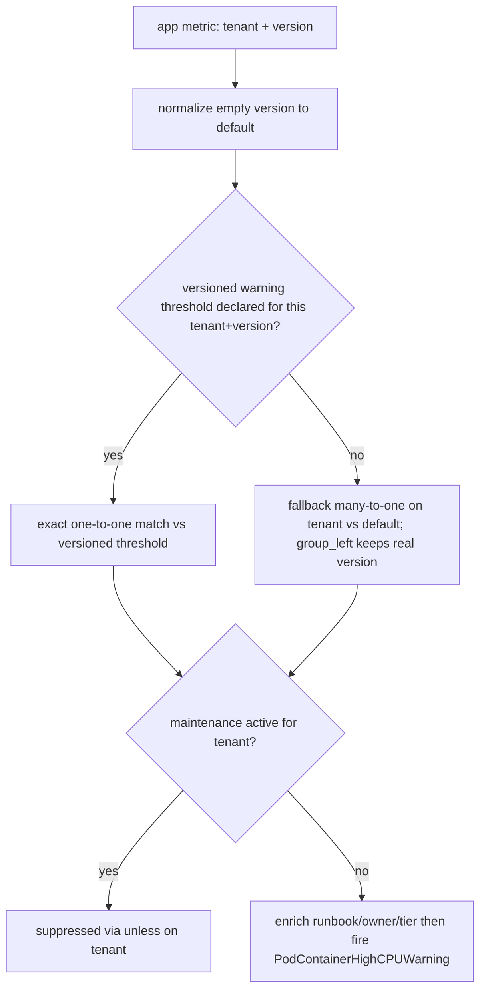

# ADR-024: Version-Aware Threshold — 透過既有 Dimensional `version` Label 達成 Declarative Cutover

## 狀態

🟡 **Proposed**（草案，2026-05-30）。Tracker：[#423](https://github.com/vencil/Dynamic-Alerting-Integrations/issues/423)（`rfc` + `epic`）。本 ADR 是 #423 §10「Future ADR」的草稿，把 issue 三輪設計討論收斂為 locked decision，於 v2.9.0 GA 時定稿（status → accepted）。

> **與既有機制的關係**：本 ADR 不取代、不修改 [`config-driven.md` §2.6 排程式閾值（Scheduled Thresholds）](../design/config-driven.md)。兩者是並存的不同機制，界線見 §2。

## TL;DR

- **問題**：tenant 想「規則預先放上、配合 app 升版才生效」，且查錯時要知道「現在跑哪個版本」。
- **決策**：用 metric 上的 dimensional `version` label 表達多版本閾值，cutover 為 **emergent**（升版後 metric 帶哪個 `version` 就 join 對應閾值）。**既有 dimensional-label 機制已能在 threshold-exporter parse/emit 零改動下達成**——Phase 1 核心是 rule pack 的 **normalize layer**，而非新 config schema（Option A，reuse-over-build；`versioned:` sugar 降為 defer-with-trigger）。
- **三大可靠性硬化**（外審 Pass 2–3）：(1) **動態降級**——缺版號閾值自動 fallback 到 `version="default"`，消「silent alerting gap」並解除部署頻率耦合；(2) **拆 per-severity 規則**——避開 `version × severity` 的 PromQL cardinality 死鎖（否則 pilot 上線即癱瘓告警引擎）；(3) **確定性截斷 + 非 pilot pack 防禦硬化**——消 flapping、隔離跨 pack 污染。
- **GA 前關鍵待辦**：metric-side 的 `kube_pod_labels` version 注入（§Decision (0a)）+ OQ-1 pipeline 契約簽核；其餘見 §Action Items。

## 背景（Context）

### 訴求原語

> Tenant 對新的 alert rule / threshold 可能設定「某個日期開始才 active」，但會事先把規則放上來。查錯時要能知道「現在運作中的 rule 是什麼版本」，而不是找到已上 git 但未 deploy 的版本。同一條規則升版時的「舊失效 + 新生效」雙寫若沒 enforce atomicity，會在 review／操作中漏寫。

訴求拆解：(1) 規則／閾值能事先 commit 進 `conf.d/` 而不立即生效；(2) 生效時機跟 app 升版對齊；(3) 查錯時能明確答出「現在 Prometheus 跑的是什麼版本」；(4) 不要讓 YAML 累積無意義的歷史生效日。

### 硬約束（沿用本專案既有契約）

- **Tenant declarative-only** — Platform team 寫 rule pack PromQL，tenant 只在 YAML 設純數字閾值。**任何要 tenant 寫 PromQL 的方案都違反此約束**。
- **`user_threshold` 已是 dimensional metric** — 既有 schema `user_threshold{tenant, component, metric, severity, <任意 dimensional labels>}`，已支援 `env`、`tablespace_re` 等維度（[`config-driven.md` §2.5 Regex 維度閾值](../design/config-driven.md)）。
- **Rule pack 是 platform team 集中管理的 normalize 層**，複雜度集中於此、不下放 tenant。
- **Cardinality Guard 存在**（per-tenant `max_metrics_per_tenant` 上限，`config/resolve.go::ResolveAtWithStats` 強制；超標 truncate + emit `da_tenant_metrics_over_limit`，見 #652）。
- **沒有 ArgoCD/Flux** — config 走 Directory Scanner + SHA-256 hot-reload；rule pack 走 ConfigMap projected volume + Prometheus reload。

## 決策（Decision）

採用 **Version-Aware Threshold**：以 metric 上的 dimensional `version` label 表達「同一閾值的多個並存版本」，cutover 是 **emergent behavior**——升版後 app metric 帶上哪個 `version`，PromQL join 就對齊哪個版本的閾值。

關鍵收斂（相對於 #423 原始提案的**現況校正**）：

> **本專案既有的 dimensional-label 機制，已能在 exporter 零改動下產出 #423 §3.2 想要的 metric shape。** 因此 Phase 1 的核心是 **rule pack normalize layer**，而非新的 config schema。

驗證依據：`config/resolve.go`（dimensional key path，182–227 行）已把 `metric{label="value"}` 解析為 `CustomLabels`；`collector.go`（68–78 行）把 `CustomLabels` 依字典序 emit 成 Prometheus label。因此 tenant 今天就能寫：

```yaml
tenants:
  db-a:
    container_cpu{version="v1"}: "80"
    container_cpu{version="v2"}: "60"
```

exporter 直接吐出（無須任何新程式碼）：

```
user_threshold{tenant="db-a", component="container", metric="cpu", severity="warning", version="v1"} 80
user_threshold{tenant="db-a", component="container", metric="cpu", severity="warning", version="v2"} 60
```

`version` 與 `env` / `tablespace_re` 是同一條 dimensional 路徑，**單一心智模型**。

> **「零改動」的精確邊界**（外審校正）：零改動指的是 **parse + emit** 這半邊——閾值 series 帶 version label 流出來確實不需動 exporter。但本設計**依賴的安全護欄 OQ-6 guard 是 net-new**（Go `ValidateTenantKeys` + Python da-guard 雙語），且 metric-side 的 version 注入（上文 (0a)）是真正的工程量。所以「Phase 1 不是新 config schema」成立，但「Phase 1 零工程量」**不**成立。

### 兩半獨立可部署（本 ADR 最重要的架構性質）

Version-Aware 由兩個彼此獨立的半邊組成，可分開 ship、互不阻塞：

1. **閾值宣告半邊（threshold side）** — tenant 在 YAML 用 `{version="..."}` 宣告多版本閾值。Exporter 零改動。
2. **Metric 版本注入半邊（metric side）** — app metric 帶上 `version` label（業務 app 場景透過 `app.kubernetes.io/version` + kube-state-metrics `kube_pod_labels` relabel）。

**在 metric side 尚未注入 version 之前，整套機制是 inert（惰性）且 100% 向下相容的**：未版本化的閾值（`container_cpu: "80"`）emit 出的 series 無 `version` label（即 `version=""`），未注入版本的 app metric 也是 `version=""`，normalize layer 把兩邊都補成 `version="default"` 後自然 join——行為與改造前等價（滿足 AC-1）。

### Rule Pack Normalize Layer（Phase 1 真正的工程核心）

以 `rule-pack-kubernetes` 的 `PodContainerHighCPU` 為例（現況 join key 為 `on(tenant)`）：

```yaml
# (0a) version 注入點（最底層，本 ADR 真正的工程硬骨頭）：
#      cAdvisor 的 container_cpu_usage_seconds_total 不帶 version。
#      做法：先算純百分比（沿用既有 by(namespace,pod,container) 邏輯、零心智改動），
#      再在最外層「一次」join kube_pod_labels 注入 version。
#      ✅ 比「分子/分母各自 join version」省一半 join 運算，且避開滾動瞬間
#         version 漂移使分子分母對不齊而吐 NaN 的邊界（效能/正確性雙贏）。
- record: tenant:container_cpu_percent:by_container
  expr: |
    label_replace(
      (
        (
          sum by(namespace, pod, container) (rate(container_cpu_usage_seconds_total{namespace=~"db-.+", container!="", container!="POD"}[5m]))
          /
          sum by(namespace, pod, container) (kube_pod_container_resource_limits{resource="cpu", namespace=~"db-.+"})
        ) * 100
        * on(namespace, pod) group_left(version)
          label_replace(kube_pod_labels, "version", "$1", "label_app_kubernetes_io_version", "(.+)")
      ),
      "tenant", "$1", "namespace", "(.*)"
    )

# (0b) version 透傳：每一層 by(...) 都要保留 version
- record: tenant:pod_weakest_cpu_percent:max
  expr: max by(tenant, pod, version) (tenant:container_cpu_percent:by_container)  # ← by() 多帶 version

# (1) Normalize：兩邊把缺漏的 version 補成 "default"
#     — app metric side：先收斂到 per (tenant, version)，再補 default
- record: tenant_version:pod_weakest_cpu_percent:vlabeled
  expr: |
    label_replace(
      max by(tenant, version) (tenant:pod_weakest_cpu_percent:max),
      "version", "default", "version", "^$"
    )
#     — threshold side：未版本化閾值 emit 出的 series 無 version label（即 version=""）
#       by() 保留 severity（外審 Pass 2 #5）：versioned threshold 可用 "值:severity"
#       後綴（如 `container_cpu{version="v2"}: "60:critical"`，resolve.go:206-210 支援），
#       severity 不可在 normalize 被 max 收斂掉。
- record: tenant_version:alert_threshold:container_cpu
  expr: |
    label_replace(
      max by(tenant, version, severity) (user_threshold{component="container", metric="cpu"}),
      "version", "default", "version", "^$"
    )

# (2) Alert：動態降級 + 拆 per-severity 規則（外審 Pass 2 #1 + Pass 3 cardinality 硬化）。
#     ⚠ 不可用 `group_left(severity)`：default bucket 可能同時有 warning+critical
#        （legacy `_critical` plain key），精確分支會 one-to-many 崩（multiple matches），
#        fallback 分支會 many(版號)×many(severity) 崩（many-to-many）→ 整個告警引擎癱瘓。
#     ✅ 解法：每個 severity 拆一條規則。固定 severity 後 RHS 退化為 per-(tenant[,version])
#        singleton，所有 join 變乾淨 one-to-one / many-to-one，fallback 用 group_left
#        保留 metric 真實版號（SRE 可見性）。Critical 規則鏡像（severity="critical"）。
- alert: PodContainerHighCPUWarning
  expr: |
    (
      (
        # 精確命中該 (tenant, version) 的 warning 閾值（one-to-one；severity 已固定 → RHS singleton）
        tenant_version:pod_weakest_cpu_percent:vlabeled
        > on(tenant, version) group_left()
          tenant_version:alert_threshold:container_cpu{severity="warning"}
      )
      or
      (
        # 降級：無對應版號 warning 閾值 → 套 default。severity 固定故 RHS 為 per-tenant
        # singleton，LHS 多版號 → 合法 many-to-one，group_left 保留真實版號（v2/v3...）
        (
          tenant_version:pod_weakest_cpu_percent:vlabeled
          unless on(tenant, version)
            tenant_version:alert_threshold:container_cpu{severity="warning"}
        )
        > on(tenant) group_left()
          tenant_version:alert_threshold:container_cpu{version="default", severity="warning"}
      )
    )
    unless on(tenant) (user_state_filter{filter="maintenance"} == 1)
    * on(tenant) group_left(runbook_url, owner, tier) tenant_metadata_info
  labels:
    severity: warning   # 固定於 alert label；Critical 規則改 severity="critical" 鏡像複製
```

**非對稱 join key 是刻意且安全的**：threshold 比較用 `on(tenant, version)`，但 `user_state_filter`（維護模式）與 `tenant_metadata_info` 都是**不帶 version 的 per-tenant singleton**（驗證：`collector.go` emit `user_state_filter{tenant,filter,severity}`、`tenant_metadata_info{tenant,runbook_url,owner,tier}`）。所以 `unless on(tenant)` 會對一個 tenant 的**所有 version** 一起套用維護抑制（正確語意），`* on(tenant) group_left(...)` 是 many(LHS 多 version):one(RHS) join、方向合法。**結論：加 version 不破壞這兩個共享 metric 的 join。**

**關鍵：version 透傳（OQ-3 表中「被動 version-aware」的具體意義，也是本 ADR 真正的工程難點）**——既有 percent / weakest-link recording rule 用 `sum/max by(namespace,pod,container)` / `by(tenant,pod)` 聚合，**每一層都會丟掉 version label**。所以 (0a) 必須在 `:by_container` 層 join `kube_pod_labels` 把 `app.kubernetes.io/version` 注入為 `version`（採最外層單次 join，見上）；(0b) 起每一層 `by(...)` 聚合都要把 `version` 列入、逐層保留。**這個 (0a) edit 才是 metric-side 的硬骨頭——不是「閾值能 emit version」那半邊（那半邊零改動），而是「app metric 怎麼帶上 version」這半邊。**

> **inert-by-design 是刻意的，不是 bug**：在 (0a) 的 metric-side join 上線前，整條鏈的 version 恆為 `""` → normalize 補成 `"default"` → 對齊未版本化閾值，行為與改造前等價（AC-1）。即 §「兩半獨立可部署」的 threshold-side 可先 ship、metric-side（(0a) + OQ-1/OQ-4）後到，期間 100% 向下相容。但 reviewer 提醒成立：**(0a) 不做，version-aware 就只是 inert——所以 pilot PR 必須把 (0a) 連同 kind-cluster relabel 驗證（AC-3/AC-4）一起做，不能只改 join key 就宣稱完成。**

**注意（R5 技術陷阱，已避開）**：normalize 一律用 `label_replace(..., "version", "default", "version", "^$")`，**絕不用 `or on() vector(0)`**——後者會在「無資料時硬補 0」破壞下游聚合，且對「值為 0 即告警」的 rule（如 `mysql_up == 0`）製造 false positive。`label_replace` 對不存在的 src label 視為空字串，`regex="^$"` 已能匹配，是正確且唯一安全的寫法。

> **`sum`→`max by(tenant, version, severity)` 的刻意改動**：既有 threshold-normalization 用 `sum by(tenant)`；本 ADR 改 `max by(tenant, version, severity)`。單一閾值時等價，但 `max` 對「同一 bucket 意外多筆」較安全（配合 OQ-6 禁用顯式 `default` 防 double-count），且 `severity` 必須在 `by()` 保留、否則多嚴重度被收斂（外審 Pass 2 #5）。

> **動態降級語意（外審 Pass 2 #1）**：上方 alert 的 `精確 or 降級` 結構讓 cutover 變成「**只有當 tenant 顯式宣告該版號閾值時才生效**，否則自動沿用 `version="default"`」。效益：tenant 日常小改版（每天多次 deploy、image SHA / SemVer patch 變動）**不需**同步改告警 YAML——只有「特定大版號要特殊閾值」才寫 `{version="v2"}`。這把 §Consequences 原本「observed-but-not-declared = silent gap」的最高風險從「sentinel 事後補救」升級為「**架構內建、不丟 series**」。代價：typo 版號（如 `v2x`）會靜默落到 default（非預期值），靠 orphan 偵測（declared-but-not-observed）抓。此 fallback PromQL 必須在 kind cluster 實測（AC-3/AC-4）。

> **Cardinality match 硬化（外審 Pass 3）**：上方採 **per-severity 拆規則**而非單規則 `group_left(severity)`。原因：`version × severity` 維度交織會在 join 形成 cardinality 死鎖——若任一 `(tenant, version)`（特別是 `default`，可能同時有 legacy `_critical` 的 warning+critical）出現多 severity，精確分支 `> on(tenant,version) group_left(severity)` 會 **one-to-many 崩（multiple matches）**，fallback `> on(tenant) group_left(severity)` 會 **many(版號)×many(severity) 崩（many-to-many）** → Prometheus 執行期錯誤、整個 k8s 告警引擎癱瘓。拆 severity 後 RHS 退化 singleton，全部降為合法 one-to-one / many-to-one。**替代路線（Route 1，較精簡）**：維持單規則，但 fallback 分支先 `max by(tenant)` 拍平多版號再 `label_replace` 強制 `version="default"`，把 many-to-many 降階為 one-to-many（配 `group_right()`）；代價是**降級告警的版號顯示為 `default`、喪失真實版號可見性**。Route 2（拆 severity，上方）保留版號、對齊既有 per-severity alert 慣例，為**建議預設**；最終由 pilot / maintainer 抉擇並在 kind 實測 cardinality。

下圖為單一 severity（Warning）規則的求值流（Critical 規則鏡像）：



### 自動免疫的 K8s 漏洞

| 漏洞 | 為何自動處理 |
|---|---|
| Rolling Update 並存 | metric 流 `{version="v1"}` / `{version="v2"}` 自然並存 5–10 分鐘，各自 join 對應閾值 |
| Rollback drift | `helm rollback` 後 metric 退回 v1，v2 閾值變孤兒（無對應 metric）→ 不 fire |
| GitOps 傳遞鏈延遲 | v2 閾值升版前已「潛伏」在 system，不依賴傳遞鏈精準時刻生效 |
| YAML 不累積歷史 | `{version=...}` 沒有時間軸；過期版本只剩「無對應 metric 的孤兒 section」待 GC |
| Cutover atomic | 同一 YAML 同一 metric 的多 version key 相鄰，單一 diff hunk review |

## 與 §2.6 排程式閾值的界線（重要：兩套並存，非取代）

`config-driven.md` §2.6 的 `ScheduledValue.overrides: [{window, value}]` 是 **recurring 時間窗口**機制（v0.12.0），與本 ADR 是**刻意分開的兩套**：

| 維度 | §2.6 排程式閾值 | ADR-024 Version-Aware |
|---|---|---|
| 切換軸 | **時間**（recurring 窗口，`ResolveAt(now)` 看 wall-clock） | **狀態 / version label**（不評估時間） |
| 觸發來源 | UTC 時鐘到點，每日重複 | **app 升版後 metric 帶新 version**，one-time cutover |
| 對齊對象 | 每日固定時段（如夜間批次放寬閾值） | K8s rolling update（免疫升版時序漂移） |
| 典型場景 | 「夜間 22:00–06:00 放寬到 200」 | 「v2 上線後 CPU 閾值由 80 收緊到 60」 |

#423 §2 輪 1（方案 B）曾提議**擴充 `ScheduledValue` 加 `from`/`until` 絕對日期**，已於 §4 R1 否決（見下）。因此本 ADR 不是 §2.6 的延伸——§2.6 處理週期性時段，本 ADR 處理一次性的版本對齊，兩者正交、可同時作用於同一 tenant。

## Options Considered

### Option A：沿用既有 dimensional `{version="..."}` label（✅ 採用）

| 維度 | 評估 |
|---|---|
| 複雜度 | **低** — exporter 零改動；只動 rule pack |
| Blast radius | **低** — 不碰千租戶 hot-reload critical path（config parser） |
| Cardinality 計量 | **免費** — 每個 `{version=}` key 已是獨立 resolved threshold，被既有 per-tenant guard 計數 |
| 向下相容（AC-1） | **trivially true** — exporter 不變，未版本化 tenant series 數零變動 |
| 一致性 | **高** — 與 `env`/`tablespace_re` 同一 dimensional 模型 |

**Pros**：最小 net-new surface；AC-1 自動滿足；default fallback 集中在 rule pack 一處（不分散）。
**Cons**：多版本散在多個 key（atomic review 較弱，但相鄰且單一 diff hunk）；無 exporter 級 auto `version="default"` 注入（由 normalize layer 的 `label_replace` 承擔）；da-guard 命名規範需對 `version` label value 特判。

### Option B：新增 `versioned:` 專用 YAML block（#423 §3.1 原案，✗ defer）

| 維度 | 評估 |
|---|---|
| 複雜度 | **中高** — net-new parser type + `UnmarshalYAML` 路徑 + resolve 路徑 + da-guard schema + da-parser + 測試 |
| Blast radius | **高** — 觸碰最安全敏感的 hot-reload config parser |
| 歧義 | 引入**第二條**附加 `version` label 的路徑（dimensional `{version=}` 仍在），guard 須禁止混用 |

**Pros**：ergonomic 分組；天然 atomic review；auto `version="default"` 與命名 guard 的自然落點；可繼承 defaults（dimensional key 是 tenant-only 無繼承）。
**Cons**：高 blast radius；與 normalize layer 的 default 注入**功能重複**（兩處可能 drift）；多一條 code path。

### Option C：`POST /active-version` 寫 API（✗，見 R4）

引入「第二個 state」破壞 single SOT；rolling 中段呼叫反而造成 transient 不對齊。

## Trade-off Analysis

核心判斷是 **reuse-over-build**（vibe-brainstorm Q1）：目標能力 90% 已存在於既有 dimensional 機制。Option B 的唯一實質增益是「authoring 分組 + 命名 guard 落點」，但代價是觸碰 hot-reload critical path、引入功能重複的第二條 default-注入路徑，並使 AC-1（千租戶最高 cardinality 元件的零行為變動）從「自動成立」變成「需要驗證」。

因此採 **Option A**，把 `versioned:` sugar 列為 **defer-with-trigger**（見 Consequences）。default fallback 由 normalize layer 單一承擔，避免雙寫 drift。

## Open Questions 釐清（逐條收斂）

| OQ | 收斂決策 | 性質 |
|---|---|---|
| **OQ-1** pipeline 契約 / version 來源 | Pipeline **不呼叫任何寫 API**（重申 R4）。版本來源預設 = `app.kubernetes.io/version`（K8s 標準 label）經 kube-state-metrics `kube_pod_labels` relabel 成 `version`。 | **自決 default**；tenant team 確認列為 action item（不阻塞設計） |
| **OQ-2** Cardinality budget | `version` 是 dimensional 乘數；並存版本數穩態 N=1、rolling 窗 N=2、rollback/staged 重疊上限 N=3。**設計準則：支援 ≤3 並存版本於既有 per-tenant cap 內**；每版本 = 每 (metric,severity) +1 series，已被既有 guard 計數＋truncate。 | **自決準則**；N=1/2/3 實測值 defer 至 pilot（action item），超 cap 才調 budget（trigger） |
| **OQ-3** 要 sweep 哪些 rule | **原則**：rule 為 version-aware ⟺ 它把 tenant-app perf metric join `user_threshold` on `(tenant)`。cluster/infra-wide 或 state-based（非閾值 join）的 rule 為 version-agnostic。`rule-pack-kubernetes` 分類見下表。 | **自決** |
| **OQ-4** relabel 範本 kind 驗證 | 範本（`kube_pod_labels` → `version` join）寫入 migration doc；in-kind-cluster 驗證綁 AC-3/AC-4（rolling/rollback scenario）於實作期執行。 | **defer 至實作**（非設計 blocker） |
| **OQ-5** sentinel 觸發週期 | 兩段 `version_orphaned`：**warn @ 7d、critical @ 30d**（對齊 weekly release cadence）。`version_unknown`（observed-but-not-declared）**改 `for: 5–10m`，不可 `for: 0s`**（外審 Pass 2 #2）——正常滾動更新時，新 Pod 吐 version label 與 exporter hot-reload 載入閾值之間有 1–3 分鐘 GitOps 傳遞鏈延遲，`for: 0s` 會在每次部署必然誤報 → 告警疲勞 → SRE 直接 mute → 哨兵流於形式。加 buffer 後，唯有「新版號持續 >5–10m 仍無對應閾值且未走 fallback」才判定真正漏寫。（搭配動態降級後，`version_unknown` 本就降為可見性訊號，buffer 更合理。） | **自決**；buffer 值 tune defer（trigger：tenant cadence / 噪音回饋） |
| **OQ-6** version 命名規範 + scope | da-guard regex `^[a-z0-9][a-z0-9._-]*$`；**禁止空字串與字面 `default`**（保留給 fallback）；**不**強制 SemVer（允許 image-tag / SHA）。**並 scope：`version` key 僅允許用於已 pilot 的元件**（Phase 1 = kubernetes container_cpu/memory），非 pilot 元件寫 version key 直接 reject（防跨 pack double-count，見 Consequences）。注意此 guard 是 **net-new 雙語工程**：Go 側 `ValidateTenantKeys` + Python 側 da-guard 須同步（label value 目前**完全無驗證**，`parseLabelsStringWithOp` 照單全收）。**Pilot 須對齊真實版號字串**（外審 Pass 3 終審）：tenant CI/CD 吐給 `app.kubernetes.io/version` 的可能含大寫（`V1.0.0`）、長 Git SHA、分支組合——regex 卡太死會誤攔正常部署、太鬆又污染 label。Pilot 觀察實際樣態後定稿 regex（可能需放寬大小寫或長度上限）。 | **自決 + Pilot 校準** |

### `rule-pack-kubernetes` rule 分類（OQ-3 具體結果）

| Rule | 類別 | 理由 |
|---|---|---|
| `PodContainerHighCPU` / `PodContainerHighMemory` | **version-aware** | join `tenant:alert_threshold:container_*` on `(tenant)` → 加 `version` |
| `tenant:alert_threshold:container_*`（threshold-normalization） | **version-aware** | 改 `max by(tenant, version)` + `label_replace` default |
| `tenant:container_*_percent:by_container` / `:pod_weakest_*:max` | **version-aware**（被動） | 需確保 version label 透傳到 percent recording rule |
| `ContainerCrashLoop` / `ContainerImagePullFailure` | **version-agnostic** | 基於 `user_state_filter`（pod 狀態字串匹配），不 join 數字閾值 |

## Consequences

### 變容易
- 升版閾值 cutover 與 K8s rolling update 自動對齊，無時序漂移、無凌晨 auto-merge 風險。
- 「現在跑什麼版本」可由 `count by(version)(<app metric>)` 直接答出（對應 §5.6 `check-running-rule` 三層真相）。
- YAML 不再累積歷史生效日。

### 變難 / 新增的 failure mode（blast-radius，vibe-brainstorm Q5）
- **observed-but-not-declared（已由動態降級架構性消解，外審 Pass 2 #1）**：原始設計用純精確 `on(tenant, version)` join——v2 metric 無 v2 閾值即產不出結果 → v2 pod 完全不告警（false negative）。**修正後採動態降級**：精確命中失敗自動 fallback 到 `version="default"` 閾值（見上方 alert PromQL），不丟 series。故此風險**不再靠 sentinel 事後補救，而是架構內建**。`version_unknown` sentinel 降為**可見性訊號**（提示 tenant 有未宣告版號在跑、或 typo），非 false-negative 守門員，且觸發須加 buffer（見 OQ-5 修正）。殘餘風險：typo 版號靜默落 default，靠 orphan 偵測抓。
- **declared-but-not-observed = 孤兒閾值**（無害）：threshold series 無對應 metric，不 fire。屬 GC 對象（portal 黃燈、`version_orphaned` 7d/30d），非 red。
- **`default` 命名碰撞**（已由 OQ-6 guard 擋掉）：若 tenant 同時寫未版本化閾值（→`version=""`）與顯式 `{version="default"}`，經 `label_replace` 兩者都成 `version="default"`，`max by(...,version)` 會在同一 version bucket 取 max（若改 `sum` 則 double-count）。故 OQ-6 **禁止顯式 `default`**。
- **🟠 version × 多嚴重度（外審 Pass 2 #5 — 校正前一版的錯誤結論）**：前一版誤判「version-aware 結構性僅 warning-tier」。**更正**：dimensional key 確實**不支援 `_critical` 後綴**（`resolve.go:180`），但**支援 `值:severity` 後綴**（`resolve.go:206-210`）——`container_cpu{version="v2"}: "60:critical"` 可正確 emit severity="critical"。因此**單一 severity per version 是支援的**；normalize 用 `max by(tenant, version, severity)` 保留 severity 維度，但 alert **必須拆 per-severity 規則**（外審 Pass 3）——單規則 `group_left(severity)` 會因 `version × severity` 交織觸發 cardinality match 死鎖（見 §Decision 的 Pass-3 硬化註）。**真正的限制**是「同一 version **同時**兩個 tier（warning+critical）」：兩條 dimensional key 的 label set 都是 `{version="v2"}` 會碰撞、且 `_critical` 後綴對 dimensional key 無效——這種「per-version 雙 tier」留 defer-with-trigger（trigger：tenant 需要同版號同時 warn+crit）。**不再強制 warning-only。**
- **🟠 Cardinality 截斷必須改為確定性（外審 Pass 2 #3 — 從「已知限制」升為防禦性程式碼）**：per-tenant guard（`resolve.go:229-244`）以 `result[:startIdx+limit]` 截斷，而 dimensional key 由 `for key := range overrides`（map 迭代，**Go 隨機序**）append。tenant 越過 cap 時，被截掉的 version 是 scrape 間隨機的 → 告警 series 忽隱忽現 → **Prometheus alert flapping + PagerDuty 重複轟炸**——分散式觀測系統最忌的非確定性。**不接受當「已知限制」甩鍋。Phase 1 必修**：截斷前對 keys 做**確定性排序**（無版號 / `default` key 優先保護，其餘按字典序 `sort.Strings()`），確保被截的永遠是固定的（字母序末位）版號，狀態穩定（持續消失並觸發上限告警，而非閃爍）。AC-7 對應升級。
- **🟠 共享 `user_threshold` 跨 pack 洩漏 → 需 PromQL 防禦深度（外審 Pass 2 #4）**：`user_threshold` 是所有 pack 共用 series。tenant 若繞過 CI（手動 apply / 測試環境直更）對**非 pilot 元件**（redis / mysql）也寫 `{version=...}`，該 pack 的 `sum by(tenant)(user_threshold{component="redis"})` 會**跨 version 相加 → double-count → 既有核心告警誤報/漏報**。**只靠 CI 的 `da-guard` 不足（defense-in-depth 原則）**。Phase 1 對所有**非 pilot pack 的 normalize 做輕量硬化**：matcher 加 `version=~"|default"`（只收無版號 / default，PromQL 中缺 label 視為空字串故 `^$` 等價匹配），自動濾掉非法版號——CI 護欄失效時仍保既有告警絕對安全。**Trade-off（明寫）**：此舉在 Phase 1 輕觸 13 個非 pilot pack（**僅加一個 label matcher**，非全面 `by(tenant, version)` 改寫），blast radius 與測試量略增；替代是純靠 OQ-6 guard scoping。由 maintainer 定 Phase 1 納入 or defer Phase 2。
- rule pack join key 全面 `on(tenant)` → `on(tenant, version)`，需逐 pack staged rollout（Phase 2 範圍）。
- **Dashboards / Portal query 假設無 version label**：開始有 tenant 寫 version key 後，未聚合的 `user_threshold{...}` panel 會突然多出 2–3× series 帶新 `version` label，exact-match label join 的 panel 可能壞掉。Action item 加：審 Grafana / portal query。

### 需要重訪（defer-with-trigger）
- **`versioned:` 專用 block（Option B）**：trigger = 實際使用顯示「多 key 散落」造成 review 漏寫的 postmortem，或 ≥N tenant 反映 ergonomics 痛點。屆時再評估是否值得觸碰 hot-reload path。
- **GC auto-PR bot**：trigger = Phase 1 sentinel + portal warning 跑過 1–2 quarter 仍有 manual GC 負擔抱怨（#423 §6 Phase 3）。
- **DB engine 場景的 ServiceMonitor relabel**：trigger = 非業務 app（mysqld_exporter 等本身不識版本）需要版本對齊（#423 §6 Phase 2.5）。
- **sentinel 週期 / cardinality budget**：trigger 見 OQ-2 / OQ-5。

## 外部對抗式 Review（Pass 2–3 — Gemini）

### Pass 2

收斂後第二輪外審（Gemini，SRE / 資深架構師視角）。依 take / reframe / reject 分類，**5 項全數採納**（含 2 項語法/範圍 reframe），無 reject：

1. **動態降級 join** — TAKE（reframe 語法）。原純精確 `on(tenant, version)` join 的 silent-gap，從「sentinel 事後補救」升為「架構內建 fallback 到 `version="default"`」，解除「部署頻率 ↔ 閾值配置」強耦合。Gemini 範例的 `unless … group_left()` 為無效語法，已改為合法的「精確 `or`（`unless` 差集 `>` default）」。→ §Decision alert PromQL + Action Item 2。
2. **`version_unknown` 加 buffer** — TAKE。修正本 ADR 內部矛盾（自陳 1–3 分鐘傳遞延遲卻設 `for: 0s` → 每次滾動更新必誤報）。改 `for: 5–10m`。→ OQ-5 + Action Item 4。
3. **確定性截斷** — TAKE。Go map 隨機序截斷 → alert flapping，不接受當「已知限制」；改截斷前字典序排序（無版號/`default` 優先）。→ AC-7 + Action Item 12。
4. **非 pilot pack PromQL 硬化** — TAKE（reframe scope）。defense-in-depth：非 pilot pack matcher 加 `version=~"|default"`，CI guard 失效仍保既有告警安全。Trade-off 明寫：Phase 1 輕觸 13 pack（僅加 matcher，非全面改寫）。→ §Consequences + Action Item 13。
5. **多嚴重度保留** — TAKE，**並更正前一版的事實錯誤**。前版誤判「version-aware 結構性僅 warning-tier」；實際 dimensional key 支援 `值:severity` 後綴（`resolve.go:206-210`），normalize 補 `by(…, severity)` + alert `group_left(severity)` 即保留嚴重度。真正限制僅「同 version **雙** tier」（defer-with-trigger）。→ §Decision + §Consequences。

Pass 2 **未動搖** §Decision 的 reuse-over-build 主軸（threshold-side parse/emit 零改動 + rule-pack normalize layer 仍成立），但把可靠性拉到 GA 級：消 silent-gap、消 truncation flapping、保多嚴重度、加防禦深度。

### Pass 3（PromQL cardinality match 硬化）

第三輪外審聚焦 Pass 2 修正後的 alert PromQL，抓到一個**會讓 Prometheus 執行期崩潰**的 cardinality match 死鎖（self-verify 確認屬實）：

- **精確分支方向錯**：`> on(tenant, version) group_left(severity)` 中 RHS（threshold）才是帶 severity 的「多」端，`group_left` 方向顛倒；當 `default` bucket 同時有 warning+critical（legacy `_critical` plain key）時 → one-to-many → `multiple matches` 崩。
- **fallback 分支 many-to-many**：`unless` 後 LHS 可能多個未宣告版號（rolling 中 v2/v3），RHS default 閾值可能多個 severity，僅 `on(tenant)` join → **many-to-many → 100% 執行期錯誤**。

**處置（TAKE，self-verified）**：採 **Route 2（拆 per-severity 規則）**——固定 severity 使 RHS 退化 singleton，精確分支降為 one-to-one、fallback 降為 many-to-one（`group_left` 保留真實版號）。對齊既有「每 severity 一條 alert」慣例、且最大化 SRE 版號可見性。**Route 1**（單規則 + fallback `max by(tenant)` 拍平 + `group_right()`）列為較精簡替代，代價是降級告警版號顯示為 `default`。最終由 pilot / maintainer 抉擇、kind 實測 cardinality（更新 §Decision PromQL + Action Item 2）。Pass 3 同樣未動搖主軸，純屬實作層 PromQL 結構硬化——但**沒做就會在 pilot 上線時癱瘓整個 k8s 告警引擎**，是 GA 前最關鍵的一次收斂。

**終審結果**：Gemini 對 Route 2 PromQL 的向量匹配逐分支驗證後**點亮綠燈（Approved & Locked，Ready to Ship）**，僅留兩個 **Pilot 階段營運邊界**（非設計缺陷）：(1) `da-guard` regex 對真實 `app.kubernetes.io/version` 字串樣態（大寫 / 長 SHA）的邊界——已納入 **OQ-6**（Pilot 校準）；(2) 滾動更新後舊版 metric 消失時的告警 **Fire→Resolve 閉環**驗證——已納入 **AC-9**。設計層的執行期崩潰風險（many-to-many 死鎖）已在設計階段以 PromQL 邏輯完全封殺。

**(0a) 效能優化（終審 follow-up）**：另採 Gemini 建議把 version 注入改為「先算純百分比、最外層單次 join `kube_pod_labels`」（見 §Decision (0a)），相較「分子/分母各自 join version」省一半 join 運算，並消除滾動瞬間 version 漂移使分子分母對不齊吐 `NaN` 的邊界。

## Rejected Alternatives（#423 §4 收斂，ADR 靈魂）

- **R1. `ScheduledValue.from/until` 絕對日期 schema 擴展** — Rejected。YAML 累積無意義生效日（過期 `from` 永遠 true，等於死代碼留檔）+ 雙寫 atomicity（漏寫 `until` → 兩條 active 衝突；漏寫 `from` → 空窗）。把時間軸吞進 declarative config 是結構性錯誤。**這正是「為何不擴 §2.6」的答案。**
- **R2. Scheduled PR Merge orchestration** — Rejected。K8s rolling/rollback drift（Git 瞬時二元 merge 無法 align K8s 5–10 分鐘漸進發佈）+ GitOps 傳遞鏈延遲（merge→ConfigMap→reload 1–3 分鐘）+ helm rollback 不反向 revert Git PR。
- **R3. Gemini 原案「tenant 直接寫 PromQL 兩條規則並存」** — Rejected。違反 declarative-only 核心契約。但概念正確，被 adapt 成本 ADR。
- **R4. `POST /active-version` 寫狀態 API** — Rejected。引入第二個 state 破壞 single SOT；rolling 中段呼叫造成 transient 不對齊。Metric 帶 version 流進來就是 SOT。
- **R5. PromQL normalize 用 `or on() vector(0)` 補假值** — Rejected（技術陷阱）。破壞下游 `min/avg/sum` 聚合；對「值為 0 即告警」rule 製造 false positive。正解 = `label_replace(..., "version", "default", "version", "^$")`。
- **R6. ServiceMonitor 端逐 tenant 注入 version（Path A）** — Rejected for Phase 1。複雜度下放 tenant，違反「集中於 platform team 可控 rule pack」原則。Phase 2.5 DB 場景再部分採用。
- **R7. GC auto-PR bot in Phase 1** — Rejected for Phase 1。無 bot infrastructure；「24h 穩定」由誰判定需新 cron/reconciler（新 SLO/故障點）；rolling 未竟時誤刪難回滾。Phase 1 走 detect-only（CLI + sentinel + portal warning）。

## Acceptance Criteria（Phase 1 GA，對齊 #423 §8）

1. **AC-1** 既有（未寫 version）tenant 升級後行為與升級前 100% 等價，無 alert / metric series 數變動。
2. **AC-2** Pilot tenant 可在 `rule-pack-kubernetes` 範圍同時宣告 `v1`+`v2` 閾值，metric 流各自 join 對應數字。
3. **AC-3** Rolling update（kind 驗證）v1→v2 並存期間無 false positive。
4. **AC-4** Rollback（kind 驗證）後 v1 metric 重現對齊 v1 閾值，v2 閾值成孤兒但不誤觸。
5. **AC-5** `da-tools detect-orphan-versions` + `check-running-rule` 對應 SRE 凌晨查錯反射動作可用。
6. **AC-6** `GET /versions` 通過既有 schemathesis 契約測試。
7. **AC-7** Cardinality Guard 在 N=3 並存版本下不觸發 warn；**且「剛好越過 cap」時截斷為確定性**（外審 Pass 2 #3）：`resolve.go` 截斷前對 dimensional keys 字典序排序（無版號/`default` 優先保護），測試須斷言**同一 over-cap 配置跨多次 scrape 截掉的是固定版號**（無 flapping），非「記錄為已知限制」。
8. **AC-8** Doc 同步完整（dev-rules #4 Doc-as-Code）：CHANGELOG / CLAUDE.md / README / migration guide / config-driven.md §2.x / troubleshooting.md。
9. **AC-9** 告警生命週期閉環（外審 Pass 3 終審）：kind 驗證 rolling update 結束、舊版 Pod 銷毀、`{version="v1"}` metric 消失（absent）後，**正在燒的 v1 告警能正常收到 Prometheus/Alertmanager 的 Resolve**（join RHS 斷開 → 隱式熄滅 → 通知管道收到 resolved），確保 Fire→Resolve 完整閉環、不留殭屍告警。

## Action Items

1. [ ] **OQ-1 確認**：tenant team 簽核「pipeline 只讓 metric 帶 version、不呼叫寫 API」+ 提供業務 app version 來源範本。
2. [ ] **Rule pack pilot（動態降級 + cardinality-safe severity）**：`rule-pack-kubernetes` 加 normalize layer（`:vlabeled` + `max by(tenant, version, severity)`），4 條 version-aware rule 改**精確-or-降級** PromQL（Pass 2 #1）。**⛔ 不可用會崩潰的 `group_left(severity)`（Pass 3）**——明確抉擇 **Route 2（拆 per-severity 規則，建議）** 或 Route 1（單規則 + fallback `max by(tenant)` 收斂版號 + `group_right()`），落盤合法 cardinality 結構。kind cluster 實測 fallback **與 cardinality matching**（AC-3/AC-4）。
3. [ ] **da-guard（雙語）**：Go `ValidateTenantKeys` + Python da-guard 對 dimensional key 的 `version` label value 加 OQ-6 regex + 禁用清單（空字串 / `default`）+ **元件 scope 白名單**（非 pilot 元件寫 version key → reject）。
4. [ ] **Sentinel**：`da_config_event{event="version_orphaned"}`（7d/30d 兩段）+ `version_unknown`（**`for: 5–10m` buffer，非 `for: 0s`**，外審 Pass 2 #2，避滾動更新誤報）→ `rule-pack-operational`。
5. [ ] **tenant-api**：`GET /api/v1/tenants/{id}/versions`（純讀 reconciliation：declared/observed/orphaned/missing）+ swag + `make api-docs`。**不**新增寫 API。
6. [ ] **CLI**：`da-tools detect-orphan-versions`（read-only）+ `check-running-rule`（三層真相）。
7. [ ] **Portal**：tenant-manager timeline panel（Active/Declared/Orphaned 綠/灰/黃），`make portal-build` + `make test-portal`。
8. [ ] **Cardinality 實測**：pilot 下 N=1/2/3 series 數測量，feed OQ-2。
9. [ ] **kind 驗證**：OQ-4 relabel 範本 + AC-3/AC-4 rolling/rollback scenario。
10. [ ] **Doc**：config-driven.md 新增節（標明與 §2.6 界線）、`docs/migration/v2.9.0-version-aware.md`、troubleshooting.md「Rule version mismatch」。
11. [ ] **Dashboard / Portal query 審查**：審 Grafana / portal 對 `user_threshold` 的未聚合 query，確認新增 `version` label 不破壞既有 panel。
12. [ ] **Go Exporter 確定性截斷（外審 Pass 2 #3，新增）**：`config/resolve.go::ResolveAtWithStats` 在容量截斷前對 dimensional keys 確定性排序（無版號/`default` 優先，其餘 `sort.Strings()`），消除 map 隨機序 flapping；單元測試斷言 over-cap 截斷穩定。
13. [ ] **非 pilot pack 防禦硬化（外審 Pass 2 #4，新增）**：13 個非 pilot pack 的 `user_threshold` normalize matcher 加 `version=~"|default"`，防 CI guard 失效時跨 version double-count（maintainer 決 Phase 1 納入 or Phase 2）。
14. [ ] **GA 定稿**：v2.9.0 GA 時本 ADR status → accepted，補 EN 版同步；**併做編輯性可讀性重構**——把三輪外審 provenance（「Pass 2/3」標註）從 body 收進「外部對抗式 Review」附錄、§Decision 切分小節（threshold-side / metric-side / alert+cardinality / normalize 安全規則），降低認知門檻（純編排、不動技術內容）。

## 連結 / Cross-Reference

- [#423](https://github.com/vencil/Dynamic-Alerting-Integrations/issues/423) — epic SOT（三輪設計討論完整脈絡）
- [`config-driven.md` §2.5 Regex 維度閾值 / §2.6 排程式閾值](../design/config-driven.md) — 既有 dimensional + scheduled 機制（本 ADR 的基礎與界線）
- `config/resolve.go`（dimensional key path 182–227）/ `collector.go`（CustomLabels emit 68–78）— 驗證依據
- [ADR-005 投影卷掛載 Rule Pack](005-projected-volume-for-rule-packs.md) — rule pack 傳遞鏈
- [`architecture-and-design.md` Cardinality Guard](../architecture-and-design.md) — Phase 1 必須對齊
- [`test-map.md` §測試注入 Seam](../internal/test-map.md) — sweep 時遵守 v2.8.0 測試標準（`freshMetrics`/`SetMetrics`，禁 global swap）

> **討論收斂註記**：本 ADR 是 #423 三輪設計（user × Claude × Gemini cross-review）的 locked-decision 萃取。最關鍵的現況校正是「dimensional label 已能達成目標 metric shape」——使 Phase 1 核心由 schema 擴展轉為 rule pack normalize layer，並讓 `versioned:` sugar 降為 defer-with-trigger。
