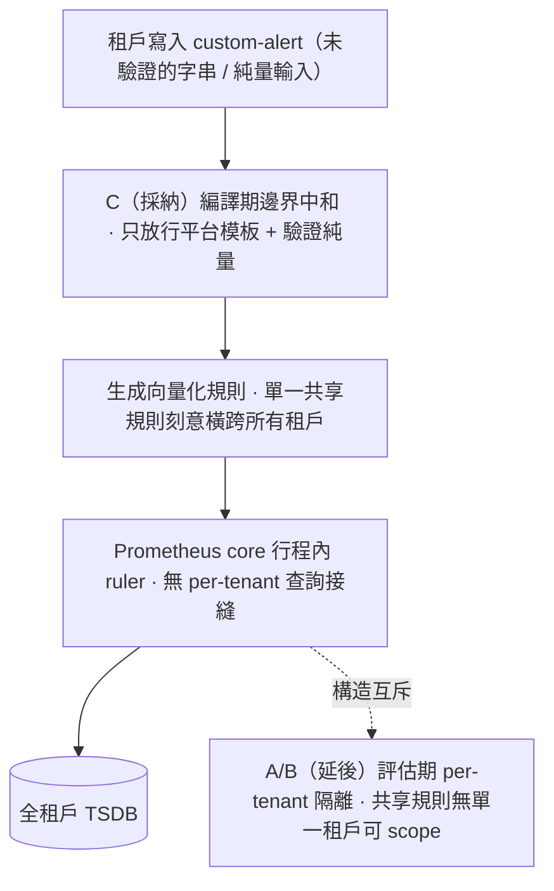

# ADR-029: 租戶自訂告警跨租戶查詢隔離 — 編譯期邊界中和為主、評估期 ruler 隔離延後

## 狀態

✅ **Accepted**（2026-07-05）

> **決策一句話**：租戶自訂告警的跨租戶讀，**現在**用**編譯期邊界中和**（選項 C）關閉；**評估期 ruler 隔離**（選項 A / B）**延後**，附 T1–T4 明確重啟 trigger。

源自 [#741](https://github.com/vencil/Dynamic-Alerting-Integrations/issues/741) 的安全稽核（[ADR-024](024-version-aware-threshold-via-dimensional-label.md) Custom Alerts 寫鏈的一個跨租戶讀類別；於內部稽核脈絡以對抗式盲審驗證，可武器化細節不入本公開文件）。選項 C 的邊界修復**另案實作、獨立合併**（[#1007](https://github.com/vencil/Dynamic-Alerting-Integrations/pull/1007)）。完整架構評估（拓撲、A/B/C 深掘、整合成本）見 eval issue [#1013](https://github.com/vencil/Dynamic-Alerting-Integrations/issues/1013)（label `defer-with-trigger`）；本 ADR 只保留決策 + trigger。

> 依語言政策（自 ADR-019 預設 ZH-only），本 ADR 不另製 `.en.md`。

## 名詞（先定義，全文用得到）

- **編譯期**：租戶送出的告警 **spec** 在寫入時被「編譯」成 Prometheus 規則檔——本文「編譯期」即指此**生成步驟**（相對於 Prometheus 之後**評估**規則的「評估期」）。
- **shape（形狀）**：一種平台 recipe 告警形狀。多租戶宣告同一 recipe 即共用同一 shape，故**規則數 = shape 數而非租戶數**（ADR-024 §4 稱此為「向量化」）。
- **接縫（seam）**：一個能插入「per-tenant 過濾」的注入點（API hook / 查詢路徑）。
- **三個選項（一句話）**：**A** = 換成 per-tenant ruler（Mimir/Cortex 級的評估期隔離）；**B** = 把 ruler 拆出 Prometheus core、其查詢改走可注入租戶範圍的 label-proxy 路徑；**C** = 在編譯邊界攔下未驗證的租戶輸入（**本 ADR 採納**）。
- **BYO**：Bring-Your-Own，客戶自帶 Thanos / Prometheus 的部署形態。

## TL;DR

- **問題**：租戶操作員（同租戶一般寫入權、**無提權**）自訂告警時，若干**未驗證的租戶輸入**流入生成的 Prometheus 規則，使規則在評估時能以規則的信任權限讀取**另一租戶**的時序資料。
- **架構根源**：平台用**單一共享 Prometheus core**（行程內 ruler）+ **向量化規則**（一條規則涵蓋所有租戶，規則數 = shape 數）。要在評估期做 per-tenant 隔離，需在 ruler 的查詢路徑有個**接縫**可注入租戶範圍；Prometheus core **沒有這個接縫**（同 Thanos 讓其 Ruler 非多租戶的限制）。
- **決策**：採 **C**；延後 **A / B**，附 **T1–T4** trigger。
- **四條鎖定判定**：① C 對平台**零功能損失**（見 §D1 之 scope）；② 對**單一共享規則**，評估期隔離與向量化互斥（連 partition-hybrid 也只是把成本挪位，見 §D2）；③ 相關 roadmap 不確定 → **不預建**但方向鎖定；④ trigger 定義 + **不轉移至 BYO 部署**。

## 架構模型（一圖看懂衝突點）

**讀圖**：租戶輸入在**編譯期**（C，圖最上游那一步）就被中和，之後才組成一條橫跨全租戶的共享規則交給行程內 ruler。A/B 想在 **ruler 評估時**才 per-tenant 隔離，但那條共享規則刻意沒有「單一租戶」可綁 → 隔離與向量化不可兼得（§D2）。

## 背景：確認的跨租戶讀類別

源自 #741 的安全稽核確認一個類別：租戶自訂告警時，若干**未驗證的租戶輸入**（字串與純量兩類）可抵達生成的規則、進入規則的**信任評估上下文**（該上下文能發起讀取查詢）→ 造成**跨租戶讀**，或使共享規則包載入失敗（**可用性**風險）。稽核於內部脈絡以對抗式盲審（finder≠verifier、換模型）驗證；可武器化的攔截點與繞過細節**不入本公開文件**。

> **為何「在 ruler 攔」才是根治、卻做不到**：要在**評估期**做 per-tenant 隔離，需在 ruler 的查詢路徑有個接縫可注入租戶範圍；但 Prometheus **core 的 ruler 為行程內評估、無此接縫**（同 Thanos 讓其 Ruler 非多租戶之因）。這把選擇逼成「在 ruler 之外的**編譯邊界**攔（C）」或「**換掉 ruler**（A/B）」兩條路。

## 決策

### D1 · 判定① — 選項 C 是「中和查詢函式」的務實形式，且對平台零功能損失

保留單一共享 Prometheus core + 向量化規則，在**編譯器 / 邊界**關閉此類，而非在 ruler：**只允許平台自撰的模板**、**驗證租戶純量參數**（格式與值域）。**攔截發生在同步的 emit-time 路徑**——tenant-api preflight（PUT 時即拒）＋ 編譯器生成——使注入在規則**生成時就結構性不可能**；`promtool check rules` 是**最終防線（backstop），非唯一防線**（重要：主防線是同步 runtime，不是非同步 CI，否則 write→compile→reload 之間會有暴露窗）。

**零功能損失的 scope（依實測，非無限制斷言）**：截至 2026-07-05，於所評估的平台規則來源（`rule-packs/` + `k8s/03-monitoring/`）中，平台自撰的 annotation **只用 `$value` / `$labels` 這類靜態插值、零次**使用能執行任意查詢的動態查詢函式。因此一道「編譯器 emit-time allowlist、只放行平台模板」對**目前**的平台規則零功能損失。它確實**限制未來**平台若想在 custom-alert recipe 模板引入動態查詢函式——這是一個**刻意接受的取捨**（真要時循 T1 重開），成本極低。這也是「停用查詢函式」在 Prometheus 無 server 開關下的**唯一可實現形式**：不是關掉函式，而是**絕不讓未驗證的租戶輸入抵達能呼叫它的模板**。

### D2 · 判定② — 對單一共享規則，評估期隔離與向量化互斥（partition-hybrid 也只是挪成本）

對**任一條實際橫跨租戶的共享規則**，把隔離移到評估期與向量化互斥：向量化靠「單一 expr 跑遍整個 TSDB、評估**後**由 `on(tenant) group_left` 依 `tenant` 標籤切分」——租戶身份活在**資料平面**。per-tenant 評估做的恰好相反：在 join **前**移除跨租戶時序，使共享 join 退化成 per-tenant 恒等匹配 → 該規則須**逐租戶各評估一次**，重新引入 **O(tenants) fan-out**（ADR-024 §4 刻意消除的成本）。

**partition-hybrid 不脫身，只是換「對誰付成本」**：可以只把租戶自撰的 custom-alert 子集放進 per-tenant scoped ruler、平台既有 packs 維持向量化。但那仍須為該子集**另立一個 HTTP-querying ruler / 第二評估引擎**（＝縮小範圍的 B）——結構成本照付，只是套在較少規則上。故 hybrid 改變的是成本的**分佈**，非**有無**。

- **證據**：Prometheus core 為單副本、上游版本，**無** per-tenant 查詢接縫可注入 → A ≈ **re-platform 到 Mimir/Cortex**（原生接縫）；B 需先把 ruler 拆出 core 成獨立 HTTP-querying ruler。平台既有 rule packs 亦**普遍**倚賴此向量化模式（數百處跨租戶聚合）。
- **對抗式定論**：對單一共享規則，向量化-共享 與 per-tenant 評估期界定**構造互斥**；hybrid 只挪成本、不消成本。

### D3 · 判定③ — roadmap 不確定 → 不預建，但方向鎖定

觸發 A/B 的主要情境是「租戶能自撰超出固定 recipe 模板的查詢表達力（raw-PromQL / bounded-DSL）」，但該能力**是否納入 roadmap 尚不確定**（屬臆測需求）→ **不預建 A/B**。設計方向仍鎖定：**若**日後採納，須與一次 ruler 遷移（T3）**併行**——平台若走向獨立 HTTP-querying ruler 則**偏好 B**（重用已擁有的 label proxy）；若走向 Mimir/Cortex 則**偏好 A**（原生接縫）。

## 選項與取捨

| 面向 | A — per-tenant ruler scoping | B — ruler 查詢路徑 label proxy | C — 編譯期邊界中和（本 ADR 採） |
|---|---|---|---|
| 從根關閉跨租戶讀 | 是（評估上下文收束） | 是（強制 matcher 於 ruler 查詢） | 否根治，但**移除注入輸入** |
| 與向量化 O(shapes) 相容 | **否 — 逼 O(tenants)** | **否 — 逼 per-tenant 規則** | **是 — 不變** |
| 須離開 Prometheus core | 是（Mimir/Cortex 或 per-tenant shard） | 是（獨立 HTTP-querying ruler） | 否 |
| 新元件／運維負擔 | 極高（換告警後端） | 高（獨立 ruler + proxy 接線，**免換後端**） | 低（驗證 + 一道 CI gate） |
| 對既有平台 packs 的爆炸半徑 | 高（普遍共享評估都受影響） | 中／高（同一假設） | 無 |
| 修復確認問題的時程 | 慢（季） | 慢（季） | 快（日） |

> A 與 B 在**向量化軸**上同（都逼 O(tenants)），差別在**平台軸**：A 要換整個告警後端，B 只多一個獨立 ruler、重用既有 label proxy——故 B「近 A」是指隔離代價，運維負擔仍低 A 一階。

**核心取捨**：A/B 買到「評估期真隔離 + 涵蓋*未來*可能重新引入讀取的 recipe 功能」，代價是**放棄平台頭號擴充性質**（高租戶數的 O(shapes) 向量化）；C 以邊界驗證關閉*已確認*的注入輸入，成本近零、零架構爆炸半徑，弱點是**通用性**（每個新 sink 需各自驗證）。既然問題是*輸入注入*而非*架構必然*，C 足以關閉它，A/B 的通用性只在相應功能真正 ship 時才值得買。

## Defer-with-trigger（延後 A/B，任一觸發即重啟評估）

> T2 / T3 是平台**自身可觀測或可控**、到達性較高的 safety net；T1 是**觸發即最高影響**、但發生與否取決於不確定 roadmap。

| Trigger | 說明 |
|---|---|
| **T1（最高影響）— 一個新類別的租戶查詢表達力 ship** | 租戶可撰寫超出「固定 recipe 模板 + 已驗純量參數」的查詢。此時邊界驗證無法再保證「合法 spec → 租戶安全的 PromQL」→ **重開隔離評估**。分兩種：**raw-PromQL** 實質需**評估期**隔離（A/B）；**bounded-DSL** 則**未必**——若編譯器具備完整的 **AST 安全重寫 / 沙箱**能力，可能仍在**編譯期（C 家族延伸）** securable。故 T1 = 重開隔離問題（A/B **或** 編譯期 AST-sandbox），**非逕自 mandate A/B**。「最高影響」指觸發即質變，**非最可能發生**（roadmap 不確定，故 §D3 不預建）。 |
| **T2 — 現行模型內再現一個缺陷** | 仍在**現行 recipe-template 模型內**（非新表達力功能）、儘管有 C，仍發現另一個未驗證輸入抵達信任評估的缺陷。一次是 bug，兩次是模式 → 支持在 ruler 設結構性邊界。 |
| **T3 — 平台因無關原因遷移告警後端**（多叢集／HA ruler／長儲存 → Mimir/Cortex/Thanos-Ruler） | 屆時 per-tenant 接縫（A）或 HTTP ruler 查詢路徑（B）「免費出現」，向量化-vs-scoping 取捨須在該遷移中**刻意重開**，不事後補。 |
| **T4 — 合規／客戶要求可證的 ruler 級租戶隔離** | 邊界驗證是緩解、非隔離證明；硬合規要求（要求架構級收束）翻轉成本效益。 |

> **不轉移至 BYO 部署**：自帶 Thanos 的客戶部署經 Thanos Querier 把同一批向量化 packs 載入其 Ruler（見所有租戶），同樣是共享向量化、**無** per-tenant ruler scoping → 一樣**依賴 C 的邊界驗證**。任何 A/B 決策不涵蓋 BYO 部署（見 `docs/integration/byo-prometheus-integration.md`）。

## Consequences

- **變容易**：跨租戶讀從「輸入穿透」變「編譯器邊界攔下」；平台維持 O(shapes) 向量化與高租戶數擴充故事，零架構改動。
- **殘留風險（具名）+ 新 sink 判準**：C 是**邊界形狀**的防護——它保護*目前已納入驗證*的輸入，零功能損失是**當前**實測結論（限制未來平台模板引入動態查詢函式）。**判準給未來維護者**：任何**新**的租戶控制輸入（多一個 label 欄位、多一個純量參數）一旦抵達規則生成，即是一個 C **不會自動涵蓋**的**新 sink**，須各自加驗證。（具體受保護 sink 的清單宜就近寫在**驗證點的 code 註解**、而非本公開文件——公開列舉等於給出攻擊面地圖。）新查詢表達力 ship → 由 T1 帶回。
- **要回訪**：A/B 不主動預建；由上表 T1–T4 觸發重啟評估。屆時 A vs B 依遷移目標（Mimir/Cortex → A；獨立 HTTP ruler → B）於 §D3 已鎖定方向。
