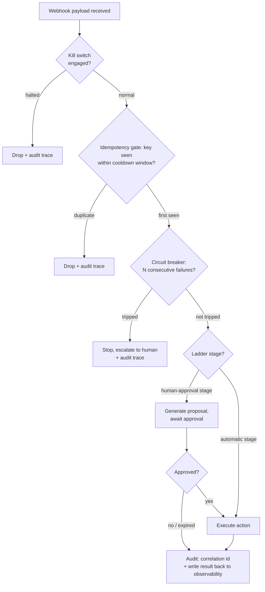

# Beyond Actionable: From Alert Decisions to the Idempotency Spectrum of Automated Actions

> **Language / 語言：** [中文](./alerting-best-practices.md) | **English (Current)**

> **Audience**: SREs and platform engineers — especially teams that are wiring (or about to wire) alerts into automated actions.
> **Prerequisites**: Basic familiarity with how an alerting pipeline such as Prometheus / Alertmanager operates is enough.
> **What you'll take away**: one classification criterion (can the action be made declarative), one toolbox of guardrails (for irreducibly imperative actions), and one checklist ([§7](#7-the-takeaway-checklist)).

---

## 0. The Alert Value Chain

Almost every alerting guide says that alerts must be actionable — when the alert fires, someone must be able to do something about it. But very few push one step further downstream: **is that "do something" itself up to standard?**

The core claim of this document:

> **The value of an action is the ceiling on the value of the alert that triggers it; and the safety of an action is determined by its idempotency.**

This is an upper bound, not an identity — the fuller formulation is "an alert's actual value ≈ action value × trigger precision × timeliness": an alert with a 99% false-positive rate wired to even the highest-value action is still a net liability; a heartbeat alert derives its value from *not* firing, and a diagnostic alert derives its value from narrowing the search space — those are the boundary cases of this framework. But for alerts that trigger remediation (human or automated) — that is, the vast majority — the upper bound holds: **if the action is a mess (undefinable, untestable, unsafe to re-run), no amount of precision on the signal side can help; the value ceiling is already locked in.**

There is an even harder reason why the action side is required reading: **the delivery semantics of the alerting pipeline**. To "rather duplicate than lose", mature alerting pipelines are almost universally at-least-once — failed deliveries are retried, continuously firing alerts are re-sent on an interval, and flapping states re-trigger after resolving. **Every consumer sitting behind the webhook is structurally required to be idempotent**, whether you have realized it or not. This document is, in effect, the companion document to that webhook contract.

> The body of this document is general-purpose guidance and does not depend on any particular product; the end ([§6](#6-this-platforms-honest-boundary)) includes a "guideline × does this platform enforce it" matrix for readers evaluating this platform.

## 1. The Decision Side: A Solved Domain

On the question of "which conditions deserve an alert", the industry has reached mature consensus: alert on symptoms, rarely on causes; reserve pages for what is urgent and requires human intelligence, and demote the rest to tickets or records; every page should be actionable. These come from Rob Ewaschuk's [My Philosophy on Alerting](https://docs.google.com/document/d/199PqyG3UsyXlwieHaqbGiWVa8eMWi8zzAn0YfcApr8Q) and [Chapter 6 of the Google SRE Book](https://sre.google/sre-book/monitoring-distributed-systems/), and will not be restated here. (Team hasn't built up these concepts yet? The [first article](./alerting-design-fundamentals.en.md) in this series covers the decision side in introductory language.)

**This document starts where they stop**: the decision side tells you when the alert should fire; the action side asks — is the thing executed after it fires itself a passable engineering object?

## 2. The Full Definition of "Actionable": The Idempotency Spectrum

To complete the definition of "actionable", an action must pass three questions:

1. **Definable** — can you write it down? "Restart the service" is an action; "handle it as appropriate" is not.
2. **Testable** — can correctness be verified before execution?
3. **Safe to re-run** — if the same trigger arrives twice (as §0 noted, that is the default delivery semantics), what happens?

The third question lays every action out on a spectrum:

| | Declarative / idempotent | Imperative / non-idempotent |
|---|---|---|
| **Form** | "Ensure the system is in state X" (reconcile toward the desired state) | "Perform operation Y once" (a one-shot command) |
| **Examples** | Ensure replica count = N; ensure the ticket exists; ensure the certificate is not expired | Restart a VM; rotate a credential; re-enqueue dead-letter messages; flush a cache; fail over |
| **Repeated execution** | Converges to the same state; inherently safe | Running twice ≠ running once; duplication is damage |
| **Verification** | Inspect the final state | Must actually produce the side effect to verify |
| **During system migration** | Replay-safe | At risk of double execution |
| **Guideline** | Prefer this | Minimize; when irreducible, add guardrails ([§4](#4-a-guardrail-toolbox-for-irreducibly-imperative-actions)) |

The classification criterion is a single question:

> **"Does a stable, observable desired state exist — one that a reconcile loop can converge toward, where repeated reconciliation is safe?"**

If yes, rewrite toward the declarative form ("restart the VM" can often be rewritten as "ensure the service is healthy", delegated to a controller that can exercise judgment). If not — a one-shot multi-step runbook, or a one-shot operation against an external stateful system — then it is an **irreducibly imperative action**. To be emphatic: **irreducible imperativeness is the norm, not a failure**; the majority of real-world operational actions live on that end of the spectrum, and the second half of this document is written for them.

This spectrum corresponds to the old level-triggered vs. edge-triggered debate in control-plane design (level = re-examine the *current state* every cycle and decide behavior from it; edge = act only at the instant of a *state transition*) — but this is an **analogy, not an isomorphism**: Kubernetes is in practice driven by edges (events) and reconciles to level. In alerting systems, the more precise observation is: **the alert condition itself is level-evaluated (re-judged every evaluation cycle), while notifications are edge (sent on state transitions, re-sent on an interval)**. If your automation hangs off notifications, it hangs off the edge — which is exactly why it is structurally required to be idempotent.

The declarative end of the spectrum has an ultimate form: if an action truly can be reconciled, its best home is often not "a webhook triggered by an alert" but a controller watching the metrics directly — with the alert retired into a backstop for when the controller itself fails. This does not argue alerting away: **alerts should be reserved for what requires human judgment or cannot be made declarative** — precisely the classic SRE position. The rest of this document is about how the actions that remain in the edge world can live there safely.

## 3. Why the Action Side Is Harder to Verify Than the Decision Side

You have heard "test your alerting rules" a hundred times, but rarely "test your alert actions" — because the action side is structurally harder to verify:

1. **No replay**. The decision side (should it fire?) has no side effects and can be validated by replaying historical data; the action side genuinely changes system state — you cannot "replay a deletion" against production to see whether it was correct. Every convenience of decision-side validation evaporates on the action side.
2. **Closed-loop races**. The action changes the very metric the alert is watching, and there is latency between sensing and actuating. The vivid version: the primary node of a stateful service degrades; the alert triggers an automated failover; the switchover completes, the new primary is still warming up, the metric has not yet recovered — and the alert, on its re-send interval, fires again: the script kicks out the new primary that has just taken over. The double execution is not a bug; it is the default behavior of a closed-loop system.
3. **Remediation fan-out**. A single root cause often fires N alerts at once; if each one carries an action, that is N actions trampling one another — the remediation itself becomes a thundering herd.
4. **Silence**. Humans notice their own mistakes; when an automated action goes wrong, often nobody notices until the damage has taken shape. Automation without an audit trail fails silently by default.

These four points lead to the most important reframe in this document:

> **Up-front validation does not provide safety — runtime guardrails do. Validation's job is to shrink the residual risk and make it explicit.**

For actions that are **re-runnable and recoverable**, this division of labor holds: validate to a reasonable degree, and let the guardrails absorb the rest. For **irreversible** actions, it breaks down — that is the subject of [§5](#5-destructive-and-irreversible-actions-the-defense-must-move-upstream).

## 4. A Guardrail Toolbox for Irreducibly Imperative Actions

1. **A boundary idempotency gate: idempotency key + cooldown**. Rather than retrofitting every action one by one, deduplicate first at the "alert → action" boundary: use the alert event's fingerprint (which alert, which target, which episode — the same firing→resolve cycle) as the key, and let a given key through only once within a cooldown window T. The second failover in [§3](#3-why-the-action-side-is-harder-to-verify-than-the-decision-side) — the one that kicked out the new primary — is exactly what this gate is there to stop. Two honest caveats: (a) episode boundaries are not perfectly defined under flapping (rapid state oscillation) — key + cooldown is an engineering compromise, not a mathematical solution; (b) **whatever the gate drops, the gate itself must leave a trace of** — otherwise the mechanism that "prevents duplicate execution" becomes a new source of silence.

    > **Hands-on tip (using the Alertmanager webhook as the example)**: the payload already carries deduplication material — `alerts[].fingerprint` (a hash of the label set, stable across re-sends), `startsAt` (the identity of this episode), and `status` (firing / resolved). A minimum viable idempotency gate: write `fingerprint + startsAt` as a key into any KV store with TTL support (the TTL is the cooldown); if the key already exists, drop and leave a trace. The TTL's semantics are **throttling, not complete deduplication**: once an episode keeps firing beyond T, the same key is let through again — for re-runnable actions this is a deliberate retry window (when to stop is the circuit breaker's job); for actions where **repetition means damage**, keep the key until after resolve and use the TTL only for memory cleanup. Also note that webhooks are delivered **per group** (`groupKey`) — to act on a single alert you must unroll `alerts[]` and process each entry, which is also where §3's fan-out first shows up in practice.

2. **Circuit breaker**. If the same action fails to improve the state N consecutive times, stop and escalate to a human. Hammering on with an ineffective action is worse than not acting at all.
3. **Kill switch**. A master switch that immediately halts all automated actions — and one that has been drilled. Knight Capital (2012): a deployment did not fully cover every node; a repurposed flag woke up residual old logic, and the system kept sending erroneous orders for roughly 45 minutes, losing over four hundred million dollars; along the way, no rehearsed "halt everything now" procedure was available.
4. **Progressive-automation ladder**. Do not take a new action straight to fully automatic: human-executed → auto-proposed with human approval → automatic within guardrails → fully automatic, climbing as trust accrues. Two disciplines: once the confidence threshold is reached you **must** promote, or the ladder degenerates into permanent toil; and **irreversible actions have a ceiling** — they are never promoted to fully automatic ([§5](#5-destructive-and-irreversible-actions-the-defense-must-move-upstream)).
5. **Audit trail**. Record every action execution — including those blocked by the idempotency gate — with a correlation id threaded from alert to notification to webhook all the way through to the action. It is the only antidote to silence, and the only basis on which, when things go wrong, "the signal side says it sent, the action side says it never arrived" does not devolve into finger-pointing. The complete form goes one step further: have the action's execution result (success / failure / duration) written back to the observability plane under the same correlation id — only then can the full "trigger → execution → recovery" timeline be reconstructed after the fact, and only then does the postmortem have material to work with. This clean bidirectional data chain is also the foundation for any advanced observability you may want to build later — alert correlation analysis, historical comparison, even automated incident summaries: the credibility of those capabilities depends on whether this id chain underneath is unbroken.

Where the five guardrails sit in a webhook receiver, and in what order — note that every "no" path leads to audit (the drop itself must leave a trace):

| Guardrail | Failure mode it targets ([§3](#3-why-the-action-side-is-harder-to-verify-than-the-decision-side)) |
|---|---|
| Idempotency gate + cooldown | Duplicate execution of the same action via re-sends / re-fires / fan-out |
| Circuit breaker | Endless hammering when the action is ineffective |
| Kill switch | No way to stop the bleeding immediately when automation as a whole runs away |
| Progressive ladder | Going fully automatic too early on actions that have not yet earned trust |
| Audit trail | Silence — the action went wrong and nobody knows |

These guardrails have a payoff moment that is easy to overlook: **alerting system migration**. During a migration, replays, dual-runs, and re-sends all show up at once — invisible to declarative actions (replay-safe), but pure double-execution risk for imperative ones; the boundary idempotency gate is exactly the lifeline then. In-depth migration validation methodology is beyond this document's scope; see the [migration guide](migration-guide.en.md).

## 5. Destructive and Irreversible Actions: The Defense Must Move Upstream

Runtime guardrails share a structural weakness: **they are reactive**. A circuit breaker trips only after "N failures" — which means the system must first be allowed to let attempt #1 happen. For reversible actions that is fine; a wrong first attempt can be recovered. But if the first attempt is an irreversible destruction of the wrong target (deleting data someone is still using), the guardrail only stops the second one.

> **For irreversible actions, runtime guardrails are zero defense against the first shot — the defense must move upstream, before execution.**

Three concrete disciplines:

1. **No blind canaries**. Reversible actions can buy confidence with a small-scope canary; irreversible actions cannot — a rollback recovers the signal, not the data already deleted.
2. **Dry-run must echo**. A dry-run that only answers "syntax is valid" cannot catch "pointed at the wrong target"; it must return **the list of objects it expects to affect**, to be compared and confirmed before proceeding. AWS S3 (2017): [a capacity-removal command executed per the playbook, with a mistyped parameter, removed a far larger set of servers than intended](https://aws.amazon.com/message/41926/); the post-incident fixes were precisely "remove capacity more slowly + refuse to execute below a safety floor" — in essence, echo plus a lower bound.
3. **A human ceiling — but do not treat it as a silver bullet**. Irreversible actions stop at the ladder's "auto-propose, human-approve" rung. Be honest at the same time: humans get tired and misread windows too. GitLab (2017): [an engineer, fatigued late at night, ran an irreversible deletion against the wrong host, and it later turned out that none of the multiple backup mechanisms were usable](https://about.gitlab.com/blog/2017/02/10/postmortem-of-database-outage-of-january-31/). The human ceiling is only complete when stacked with the previous two disciplines (echo to confirm the target) and a **drilled recovery path** — defenses stack; they are not alternatives.

## 6. This Platform's Honest Boundary

Everything up to this point is general-purpose guidance. To close the loop opened in [§0](#0-the-alert-value-chain): the webhook contract has two sides — what the **signal side** (the alerting platform) can enforce for you is idempotency and observability at the notification layer; the **action-side** guardrails (§4–§5) live in downstream automation, where the signal side cannot enforce them. An alerting product that claims to "guarantee action safety end-to-end" deserves one more question about how, exactly.

The table below is this platform's declaration of where that boundary lies. The three values:

- ✅ **Enforced** — enforced by platform code paths; cannot be bypassed
- ⚙️ **Default** — provided by the platform by default; can be overridden via configuration
- 📖 **Guidance** — outside the platform's scope (downstream automation / organizational governance); stated in this document as general guidance

| # | Guideline | Layer | This platform | Mechanism and honest qualifications |
|---|---|---|---|---|
| 1 | Prefer symptom-based alerting | Decision | ⚙️ | Design orientation of the built-in rule packs; covers only platform built-in rules — the platform does not review the semantics of tenant-defined custom alerts, to which the three questions of [§2](#2-the-full-definition-of-actionable-the-idempotency-spectrum) apply as a self-check |
| 2 | Malformed / high-cardinality rules never reach production | Decision | ✅ | Schema validation + cardinality guard; what is blocked is shape and cardinality, not semantically bad rules |
| 3 | Severity layering, deliver only the highest | Notification | ⚙️ | [Severity Dedup](design/config-driven.en.md) (inhibit rules auto-generated); enabled by default, tenants can explicitly disable |
| 4 | Zero interruptions during maintenance windows, auto-recovery never forgotten | Notification | ⚙️ | [Three-state operating modes](design/config-driven.en.md); "never forgotten" relies on the optional `expires` field — it only auto-expires if set |
| 5 | Known issues suppress notifications but keep the record | Notification | ✅ | Sentinel alert → inhibit; suppression is opt-in, but "keeping the record" is a structural guarantee — suppression happens at the notification layer, TSDB evaluation is uninterrupted |
| 6 | Routing configuration enforced correct, delivery failures observable | Notification | ✅ | Enforced Routing + Timing Guardrails; on the delivery side, [watchdog + webhook egress failure alerting](integration/alerting-plane-self-liveness.en.md) (delivery failures of other notification channels are not covered by alerting). **No "guaranteed delivery" claim** — what is enforced is configuration correctness and webhook-failure visibility |
| 7 | Notification-level throttling | Notification→action boundary | ⚙️ | Grouping and re-send intervals coarsely throttle webhook trigger frequency as a by-product; this is spillover from notification idempotency, **not** an action idempotency gate |
| 8 | Alert configuration changes must themselves be safe | Configuration | ✅ | The config write plane's [single-writer invariant (ADR-023)](adr/023-write-plane-single-writer-invariant.md): enforced on the deployment path (Helm guard + CI lint + Recreate strategy); honest boundary: a runtime bypass cannot be prevented in advance, but any violation immediately fires a critical alert, and the root-cause fix (a distributed lock) is scheduled follow-up work |
| 9 | Prefer declarative / idempotent actions | Action | 📖 | A downstream architecture choice; the platform's contribution is a stable level-evaluated signal source and resolve edges |
| 10 | Boundary idempotency gate (key + cooldown) | Action | 📖 | Downstream |
| 11 | Circuit breaker / kill switch | Action | 📖 | Downstream |
| 12 | Progressive-automation ladder | Action | 📖 | Downstream + organizational governance |
| 13 | Audit trail for action execution | Action | 📖 | Downstream owns the execution-side audit; the platform owns observability of "did the signal leave the boundary" (see #6) — the two connect, they do not substitute for each other |
| 14 | Irreversible actions: dry-run echo + human ceiling | Action | 📖 | Downstream governance |

> Note: "separating the trigger decision from action execution" is deliberately not given a three-value rating in this table — the platform stops at the webhook contract, so decision and execution are separated by construction; that is an architectural property, not a feature you can toggle.

## 7. The Takeaway Checklist

1. To evaluate an alert, evaluate its action first: **the action's value is the ceiling on the alert's value**.
2. Ask three questions of every action: definable? testable? safe to re-run?
3. Classify with one criterion: **is there a stable, observable desired state to reconcile toward?** If yes → rewrite declaratively.
4. Go declarative wherever you can; when truly irreducible, add guardrails — never run bare.
5. A boundary idempotency gate (key + cooldown) comes before retrofitting actions one by one; **the gate's drops must leave a trace**.
6. Circuit breaker: after N ineffective attempts, stop and escalate to a human.
7. The kill switch must exist — and must be drilled.
8. New actions climb the ladder; promotion takes discipline, and **irreversible actions have a ceiling**.
9. Irreversible actions: no blind canaries, dry-runs must echo, human approval stacked with recovery drills — defenses stack.
10. The audit trail runs from the alert all the way through to the action; automation without an audit trail fails silently by default.

One final reminder: an **alerting system migration** is when action-layer risks all come due at once — re-sends, replays, and dual-runs arrive together. Re-read §4–§5 before migrating, and see the [migration guide](migration-guide.en.md).
