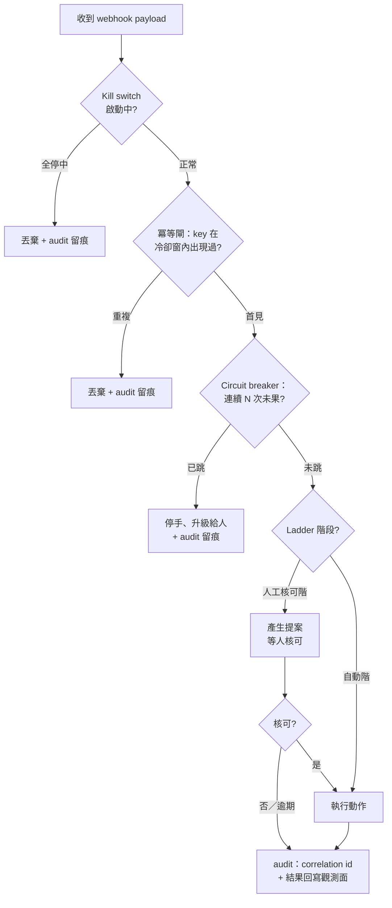

# Actionable 之後：從告警決策到自動化動作的冪等光譜

> **Language / 語言：** **中文 (Current)** | [English](./alerting-best-practices.en.md)

> **受眾**：SRE／平台工程師，特別是正在（或準備）把告警接上自動化動作的團隊。
> **前置**：知道 Prometheus / Alertmanager 一類告警管線的基本運作即可。
> **讀完帶走**：一條判準（動作能不能宣告式化）、一箱護欄（給不可約的命令式動作）、一份 checklist（[§7](#7-帶走的-checklist)）。

---

## 0. 告警的價值鏈

幾乎每份告警指南都會講到「alert 要 actionable」——告警響起時，得有人能做點什麼。但很少有人往下游追問一格：**那個「做點什麼」本身，及格嗎？**

本文的核心主張：

> **一個動作的價值，是觸發它的告警價值的天花板；而動作的安全，取決於它的冪等性。**

這是上界式，不是恆等式——更完整的寫法是「告警的實際價值 ≈ 動作價值 × 觸發正確率 × 時效」：一條 99% 誤報的告警接上再高價值的動作，仍是淨負資產；heartbeat 告警的價值在於*沒響*、診斷型告警的價值在縮小定位範圍，它們是這個框架的邊界案例。但對「會觸發處置（人或自動化）」的告警——也就是絕大多數——這個上界成立：**動作是一坨爛泥（不可定義、不可測、不可安全重跑）的話，訊號側做得再精準，價值天花板也已經被鎖死。**

還有一個更硬的理由讓動作側非讀不可：**告警管線的投遞語義**。成熟的告警管線為了「寧可重複、不可遺漏」，幾乎都是 at-least-once——投遞失敗會重試、持續 firing 會按間隔重送、狀態閃爍會 resolve 後再觸發。**接在 webhook 後面的每一個消費者，結構上就已經被要求冪等**，不管你有沒有意識到。本文其實是那份 webhook 契約的隨附文件。

> 正文是通用準則，不依賴任何特定產品；文末（[§6](#6-本平台的誠實邊界)）附一張「準則 × 本平台是否強制」對照表，給評估本平台的讀者。

## 1. 決策面：已解的領域

「哪些條件該響告警」這一面，業界已有成熟共識：對症狀（symptom）告警、少對原因（cause）告警；page 留給緊急且需要人類智慧的事，其餘降級為 ticket 或紀錄；每一個 page 都該是 actionable 的。這些出自 Rob Ewaschuk 的 [My Philosophy on Alerting](https://docs.google.com/document/d/199PqyG3UsyXlwieHaqbGiWVa8eMWi8zzAn0YfcApr8Q) 與 [Google SRE Book 第 6 章](https://sre.google/sre-book/monitoring-distributed-systems/)，此處不重述。（團隊還沒建立這些概念？本系列[第一篇](alerting-design-fundamentals.md)用入門語言講決策面；「閾值該設多嚴」見[第二篇](alerting-slo-error-budget.md)。）

**本文從它們停下的地方開始**：決策面告訴你什麼時候該響；動作面問的是——響了之後執行的那件事，本身是不是一個及格的工程物件。

## 2. 「Actionable」的完整定義：冪等光譜

把「actionable」補完整，一個動作要通過三問：

1. **可定義**——寫得出來嗎？「重啟服務」是動作；「看情況處理」不是。
2. **可測**——執行前驗得了對錯嗎？
3. **可安全重跑**——同一個觸發送來兩次（§0 說了，這是投遞語義的預設），會發生什麼？

第三問把所有動作攤在一條光譜上：

| | 宣告式／冪等 | 命令式／非冪等 |
|---|---|---|
| **形式** | 「確保系統處於狀態 X」（reconcile 到期望狀態） | 「執行一次操作 Y」（一次性命令） |
| **例子** | 確保副本數 = N、確保 ticket 存在、確保憑證未過期 | 重啟 VM、輪轉憑證、把死信訊息重新入隊、清快取、故障轉移 |
| **重複執行** | 收斂到同一狀態，天生安全 | 跑兩次 ≠ 跑一次，重複即傷害 |
| **驗證** | 查最終狀態即可 | 必須真的造成副作用才驗得到 |
| **系統遷移時** | replay-safe | 有 double-execution 風險 |
| **準則** | 優先選這種 | 能少就少；不可約時加護欄（[§4](#4-不可約命令式動作的護欄工具箱)） |

分類判準只有一個問題：

> **「存不存在一個穩定、可觀測的期望狀態，讓 reconcile 迴圈可以收斂過去、而且重複 reconcile 是安全的？」**

有，就往宣告式重寫（「重啟 VM」常可以重寫成「確保服務健康」，交給一個會判斷的 controller）。沒有——一次性的多步 runbook、對外部有狀態系統的一次性操作——那它是**不可約的命令式動作**。要強調：**不可約命令式是常態、不是失敗**；真實世界的維運動作大半落在這一端，本文後半就是為它們寫的。

這條光譜對應 control-plane 設計裡 level-triggered 與 edge-triggered 的老辯論（level＝每個週期重看「當下狀態」決定行為；edge＝只在「狀態轉換」的瞬間動作）——但這是**類比、不是同構**：Kubernetes 實際上以 edge（events）驅動、reconcile 到 level。告警系統裡更精確的觀察是：**告警條件本身是 level-evaluated 的（每個評估週期重新判斷），通知才是 edge（狀態轉換時發送、間隔重送）**。你的自動化掛在通知上，就是掛在 edge 上——這正是它結構上需要冪等的原因。

光譜的宣告式端有個終極形：一個動作若真能 reconcile，它最好的位置往往不是「告警觸發的 webhook」，而是一個直接看著指標的 controller——告警退役成 controller 自身失效時的後備。這不是把告警講沒了：**告警該留給需要人類判斷、或無法宣告式化的事**，這正是 SRE 的經典立場。本文其餘篇幅的主題就是：留在 edge 世界的那批動作，怎麼安全地活著。

## 3. 為什麼動作面比決策面難驗

你聽過一百次「告警規則要測試」，卻很少聽到「告警動作要測試」——因為動作面在結構上就更難驗：

1. **不可重放**。決策面（該不該響）沒有副作用，可以拿歷史資料重放驗證；動作面真的改變系統狀態，你不能對 production「重放一次刪除」看看對不對。決策面驗證的所有便利，到動作面全部失效。
2. **閉環競態**。動作會改變告警正在看的那個指標，而從感測到致動之間有延遲。畫面感的版本：某個有狀態服務的主節點健康劣化，告警觸發自動 failover；切換完成、新主節點還在預熱、指標尚未回穩，告警按重送間隔又打了一次——腳本把剛接手的新主節點也踢掉了。二次執行不是 bug，是閉環系統的預設行為。
3. **Remediation fan-out**。一個根因常同時觸發 N 條告警；若每條都掛了動作，就是 N 個動作互相踩踏——修復行為自己形成 thundering herd。
4. **靜默性**。人做錯事會自己發現；自動化動作做錯事，往往要等傷害成形才有人注意。沒有 audit 的自動化，錯誤以「無聲」為預設。

這四點導出本文最重要的一個 reframe：

> **事前驗證不提供安全——runtime 護欄才提供。驗證的職責是縮小殘餘風險、並讓它顯性。**

對**可重跑、可恢復**的動作，這個分工成立：驗證做到合理程度，護欄承接剩下的。但對**不可逆**的動作，這個分工會失效——那是 [§5](#5-破壞性不可逆動作防線必須前移) 的主題。

## 4. 不可約命令式動作的護欄工具箱

1. **邊界冪等閘：idempotency key + cooldown**。與其逐一改造每個動作，先在「告警 → 動作」的邊界上去重：以告警事件的指紋（哪條告警、哪個對象、哪一輪 episode——同一次 firing→resolve 週期）當 key，同一 key 在冷卻窗 T 內只放行一次。[§3](#3-為什麼動作面比決策面難驗) 那次踢掉新主節點的二次 failover，正是這道閘要擋的。兩個誠實註記：(a) episode 邊界在 flapping（狀態快速震盪）下沒有完美定義——key + cooldown 是工程折衷，不是數學解；(b) **閘丟棄了什麼，自己必須留痕**——否則「防止重複執行」的機制自己變成新的靜默源。

    > **動手提示（以 Alertmanager webhook 為例）**：payload 裡現成的去重材料——`alerts[].fingerprint`（label 集合的雜湊，跨重送穩定）、`startsAt`（這一輪 episode 的身分）、`status`（firing／resolved）。最小可行的冪等閘：以 `fingerprint + startsAt` 當 key 寫入任何帶 TTL 的 KV 儲存（TTL 就是 cooldown），已存在就丟棄並留痕。TTL 的語意是**節流、不是完整去重**：episode 持續 firing 超過 T 後同一 key 會再次放行——對可重跑動作這是刻意的重試窗（何時停手交給 circuit breaker）；對**重複即傷害**的動作，key 應保留到 resolve 之後才回收、TTL 只作記憶體清理。另外注意 webhook 是**按分組**送達的（`groupKey`）——要對單一告警動作，得展開 `alerts[]` 逐筆處理，這也是 §3 fan-out 的第一道現場。
2. **Circuit breaker**。同一動作連續 N 次未讓狀態好轉，就停手、升級給人。動作無效卻無限重錘，比不動作更糟。
3. **Kill switch**。一個讓所有自動化動作立即全停的總開關——而且要演練過。Knight Capital（2012）：部署未完整覆蓋所有節點，一個被重用的旗標喚醒了殘留的舊邏輯，系統在約 45 分鐘內持續送出錯誤委託、損失超過四億美元；過程中沒有演練過的「立即全停」程序可用。
4. **Progressive-automation ladder**。新動作不要直接全自動：人工執行 → 自動提案、人工核可 → 護欄內自動 → 全自動，隨信任爬階。兩個紀律：達到信賴門檻**就要**升階，否則 ladder 退化成永久 toil；**不可逆動作有天花板**，不升到全自動（[§5](#5-破壞性不可逆動作防線必須前移)）。
5. **Audit trail**。每一次動作執行——含被冪等閘擋下的——都留紀錄，correlation id 從告警、通知、webhook 一路貫穿到動作。它是靜默性的唯一解藥，也是出事時「訊號側說發了、動作側說沒收到」不互踢皮球的唯一依據。完整形再多一步：讓動作的執行結果（成功／失敗／耗時）帶著同一個 correlation id 回寫到觀測面——事後才重建得出「觸發 → 執行 → 恢復」的完整時間軸，postmortem 才有材料。這條乾淨的雙向資料鏈，同時是你日後想蓋任何進階觀測——告警關聯分析、歷史比對、乃至自動事件摘要——的地基：那些能力的可信度，取決於底下這條 id 鏈有沒有斷。

五道護欄在 webhook 接收器裡的落點與順序——注意每一條「否」的路都通向 audit（丟棄本身要留痕）：

| 護欄 | 針對的失效模式（[§3](#3-為什麼動作面比決策面難驗)） |
|---|---|
| 冪等閘 + cooldown | 重送／re-fire／fan-out 造成同一動作重複執行 |
| Circuit breaker | 動作無效時的無限重錘 |
| Kill switch | 自動化整體失控時無法立即止血 |
| Progressive ladder | 對還沒建立信任的動作過早全自動 |
| Audit trail | 靜默性——動作錯了沒人知道 |

這些護欄有一個常被忽略的回報時刻：**告警系統遷移**。遷移期間的重放、雙跑、重送會同時出現——對宣告式動作無感（replay-safe），對命令式動作全是 double-execution 風險，邊界冪等閘正是那時的救命索。深入的遷移驗證方法超出本文範圍，見[遷移指南](migration-guide.md)；其思想基礎值得記一句——**告警的正確性要靠注入故障的實驗驗證，語法檢查不夠**（學術討論見 [Validating Alerts in Cloud-Native Observability](https://arxiv.org/abs/2510.23970)；本平台的遷移驗證正是以故障波形注入實作這件事，見 [ADR-030](adr/030-decision-layer-migration-validation.md)）。

## 5. 破壞性／不可逆動作：防線必須前移

Runtime 護欄有個共同的結構性弱點：**它們是反應式的**。Circuit breaker 要「失敗 N 次」才跳——意思是系統必須先允許第 1 次發生。對可逆動作沒問題，第 1 次錯了可以恢復；但若第 1 次是對錯誤目標的不可逆破壞（刪掉還有人在用的資料），護欄只擋得住第 2 次。

> **對不可逆動作，runtime 護欄對首發是零防禦——防線必須前移到執行之前。**

三條具體紀律：

1. **禁止盲測 canary**。可逆動作可以用小範圍 canary 買信心；不可逆動作不行——rollback 救得回訊號，救不回已刪掉的資料。
2. **Dry-run 必須回 echo**。只回「語法正確」的 dry-run 攔不住「指向錯誤目標」；它必須回傳**預計影響的對象清單**，比對確認後才放行。AWS S3（2017）：[一道按 playbook 執行的移除容量指令，參數輸錯，實際移除的伺服器集合遠大於意圖](https://aws.amazon.com/message/41926/)；事後的修復方向正是「更慢地移除 + 低於安全水位拒絕執行」——本質上就是 echo 與下限保護。
3. **人工天花板——但別把它當萬靈丹**。不可逆動作停在 ladder 的「自動提案、人工核可」階。同時要誠實：人也會累、也會看錯視窗。GitLab（2017）：[工程師在深夜疲勞下對錯誤的主機執行了不可逆刪除，事後發現多套備份機制沒有一套可用](https://about.gitlab.com/blog/2017/02/10/postmortem-of-database-outage-of-january-31/)。人工天花板必須疊加前兩條（echo 確認目標）與**演練過的恢復路徑**才完整——防線是疊加的，不是擇一的。

## 6. 本平台的誠實邊界

正文到此都是通用準則。最後回收 [§0](#0-告警的價值鏈) 那座橋：webhook 契約有兩側——**訊號側**（告警平台）能替你 enforce 的，是通知層的冪等與可觀測；**動作側**的護欄（§4–§5）活在下游 automation，訊號側 enforce 不了。宣稱自己「end-to-end 保證動作安全」的告警產品，值得你多問一句怎麼辦到的。

下表是本平台對這條邊界的聲明。三值定義：

- ✅ **強制**——平台代碼路徑強制、不可繞過
- ⚙️ **預設**——平台預設提供、可配置覆寫
- 📖 **準則**——平台範圍外（下游 automation／組織治理），本文以通用準則陳述

| # | 準則 | 層 | 本平台 | 機制與誠實限定 |
|---|---|---|---|---|
| 1 | Symptom-based 告警優先 | 決策 | ⚙️ | 內建 rule pack 的設計取向；僅覆蓋平台內建規則——租戶自訂告警的語意平台不審，適用 [§2](#2-actionable的完整定義冪等光譜) 三問自檢 |
| 2 | 格式壞／高基數規則不入生產 | 決策 | ✅ | Schema 驗證 + cardinality guard；擋的是格式與基數，不是語意壞規則 |
| 3 | 嚴重度分層、只收最高 | 通知 | ⚙️ | [Severity Dedup](design/config-driven.md)（inhibit 規則自動生成）；預設啟用，租戶可顯式關閉 |
| 4 | 維護窗零干擾、自動恢復不遺忘 | 通知 | ⚙️ | [三態運營模式](design/config-driven.md)；「不遺忘」靠選用的 `expires` 欄位——設了才自動失效 |
| 5 | 已知問題抑制通知但留紀錄 | 通知 | ✅ | Sentinel alert → inhibit；抑制是選用，但「留紀錄」是結構保證——抑制發生在通知層，TSDB 評估不中斷 |
| 6 | 路由配置強制正確、投遞失敗可觀測 | 通知 | ✅ | Enforced Routing + Timing Guardrails；投遞側 [watchdog + webhook egress 失敗告警](integration/alerting-plane-self-liveness.md)（其他通知通道的投遞失敗不在告警覆蓋內）。**不宣稱「必達」**——強制的是配置正確與 webhook 失敗可見 |
| 7 | 通知級節流 | 通知→動作邊界 | ⚙️ | 分組與重送間隔順帶粗粒度節流了 webhook 觸發頻率；這是通知冪等的外溢，**不是**動作冪等閘 |
| 8 | 告警配置變更自身要安全 | 配置 | ✅ | 配置寫入平面[單一寫者不變式（ADR-023）](adr/023-write-plane-single-writer-invariant.md)：部署路徑強制（Helm guard + CI lint + Recreate 策略）；誠實邊界：執行期繞過無法事前阻止、但違反即刻觸發 critical 告警，根治方案（分散式鎖）為已排定的後續工作 |
| 9 | 動作優先宣告式／冪等 | 動作 | 📖 | 下游架構選擇；平台的貢獻是穩定的 level-evaluated 訊號源與 resolve 邊緣 |
| 10 | 邊界冪等閘（key + cooldown） | 動作 | 📖 | 下游 |
| 11 | Circuit breaker／kill switch | 動作 | 📖 | 下游 |
| 12 | Progressive-automation ladder | 動作 | 📖 | 下游 + 組織治理 |
| 13 | 動作執行 audit trail | 動作 | 📖 | 下游擁有執行側 audit；平台擁有「訊號有沒有送出邊界」的可觀測（見 #6）——兩者相接，不互相替代 |
| 14 | 不可逆動作：dry-run echo + 人工天花板 | 動作 | 📖 | 下游治理 |

> 附註：「拆開觸發決策與動作執行」不在表內給三值——平台止於 webhook 契約，決策與執行 by-construction 分離；那是架構性質，不是可開關的功能。

## 7. 帶走的 checklist

1. 評一條告警，先評它的動作：**動作的價值是告警價值的天花板**。
2. 對每個動作問三問：可定義？可測？可安全重跑？
3. 一個判準分類：**有沒有穩定、可觀測的期望狀態能 reconcile？** 有 → 往宣告式重寫。
4. 能宣告式就宣告式；真的不可約，再上護欄——不要裸奔。
5. 邊界冪等閘（key + cooldown）優先於逐一改造動作；**閘的丟棄要留痕**。
6. Circuit breaker：N 次未果就停手、升級給人。
7. Kill switch 要存在、要演練。
8. 新動作走 ladder 升階；升階要有紀律，**不可逆動作有天花板**。
9. 不可逆動作：禁盲測、dry-run 要回 echo、人工核可疊加恢復演練——防線是疊加的。
10. Audit trail 從告警貫穿到動作；沒有 audit 的自動化，錯誤以無聲為預設。

最後一條提醒：**告警系統遷移**是動作層風險集中兌現的時刻——重送、重放、雙跑同時出現。遷移前重讀一次 §4–§5，並見[遷移指南](migration-guide.md)。
