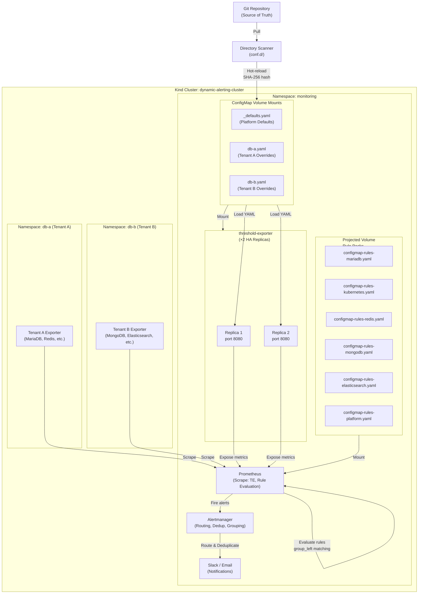

# Architecture and Design — Multi-Tenant Dynamic Alerting Platform Technical Whitepaper

> **Language / 語言：** **English (Current)** | [中文](architecture-and-design.md)

## Introduction

This document provides Platform Engineers and Site Reliability Engineers (SREs) with an in-depth exploration of the technical architecture of the "Multi-Tenant Dynamic Alerting Platform" (v0.5.0).

**This document covers:**
- System architecture and core design principles
- Config-driven configuration workflow
- Governance model for Projected Volume and Rule Packs
- Performance analysis and scalability proof
- High availability (HA) design
- Governance, audit, and security compliance

**Related documentation:**
- **Quick Start** → [README.en.md](../README.en.md)
- **Migration Guide** → [migration-guide.md](migration-guide.md)
- **Rule Packs Documentation** → [rule-packs/README.md](../rule-packs/README.md)
- **threshold-exporter Component** → [components/threshold-exporter/README.md](../components/threshold-exporter/README.md)

---

## 1. System Architecture Diagram



**Architecture highlights:**
1. **Directory Scanner** scans the `conf.d/` directory, automatically discovering `_defaults.yaml` and tenant configuration files
2. **threshold-exporter × 2 HA Replicas** read ConfigMap and output three-state Prometheus metrics
3. **Projected Volume** mounts 6 independent rule packs, zero PR conflicts, each team independently owns their rules
4. **Prometheus** uses `group_left` vector matching to join with user thresholds, achieving O(M) complexity

---

## 2. Core Design: Config-Driven Architecture

### 2.1 Three-State Logic

The platform supports a "three-state" configuration pattern, providing flexible default values, overrides, and disable mechanisms:

| State | Configuration | Prometheus Output | Description |
|-------|---------------|-------------------|-------------|
| **Custom Value** | `metric_key: 42` | ✓ Output custom threshold | Tenant override of default |
| **Omitted (Default)** | Not specified in YAML | ✓ Output platform default | Uses `_defaults.yaml` |
| **Disable** | `metric_key: "disable"` | ✗ No output | Completely disable metric |

**Prometheus output example:**

```
# Custom value (db-a tenant)
user_threshold{tenant="db-a", metric="mariadb_replication_lag", severity="warning"} 10

# Default value (db-b tenant, not overridden)
user_threshold{tenant="db-b", metric="mariadb_replication_lag", severity="warning"} 30

# Disabled (no output)
# (metric not present)
```

### 2.2 Directory Scanner Mode (conf.d/)

**Directory structure:**
```
conf.d/
├── _defaults.yaml         # Platform global defaults (managed by Platform team)
├── db-a.yaml             # Tenant A overrides (managed by db-a team)
├── db-b.yaml             # Tenant B overrides (managed by db-b team)
└── ...
```

**`_defaults.yaml` content (Platform managed):**
```yaml
defaults:
  mysql_connections: 80
  mysql_cpu: 80
  mysql_slave_lag: 30
  container_cpu: 80
  container_memory: 85

state_filters:
  container_crashloop:
    reasons: ["CrashLoopBackOff"]
    severity: "critical"
  maintenance:
    reasons: []
    severity: "info"
    default_state: "disable"
```

**`db-a.yaml` content (Tenant override):**
```yaml
tenants:
  db-a:
    mysql_connections: "70"          # Override default 80
    container_cpu: "70"              # Override default 80
    mysql_slave_lag: "disable"       # No replica, disable
    # mysql_cpu not specified → use default value 80
    # Dimensional labels (Phase 2B)
    "redis_queue_length{queue='tasks'}": "500"
    "redis_queue_length{queue='events', priority='high'}": "1000:critical"
```

#### Boundary Enforcement Rules

| File Type | Allowed Blocks | Violation Behavior |
|-----------|----------------|-------------------|
| Files with `_` prefix (`_defaults.yaml`) | `defaults`, `state_filters`, `tenants` | — |
| Tenant files (`db-a.yaml`) | Only `tenants` | Other blocks automatically ignored + WARN log |

#### SHA-256 Hot-Reload

Does not rely on file modification time (ModTime), but rather on **SHA-256 content hash**:

```bash
# On each ConfigMap update
$ sha256sum conf.d/_defaults.yaml conf.d/db-a.yaml conf.d/db-b.yaml
abc123... conf.d/_defaults.yaml
def456... conf.d/db-a.yaml
ghi789... conf.d/db-b.yaml

# Kubernetes ConfigMap symlink mounted will rotate
# Old hash → new hash
# threshold-exporter detects change, reloads configuration
```

**Why SHA-256 instead of ModTime?**
- Kubernetes ConfigMap creates a symlink layer, ModTime is unreliable
- Same content = same hash, avoid unnecessary reloads

### 2.3 Multi-tier Severity

Support both `_critical` suffix and `"value:severity"` syntax:

**Method 1: `_critical` suffix (suitable for basic thresholds)**
```yaml
tenants:
  db-a:
    mysql_connections: "100"            # warning threshold
    mysql_connections_critical: "150"   # _critical → auto-generate critical alert
```

**Method 2: `"value:severity"` syntax (suitable for dimensional labels)**
```yaml
tenants:
  redis-prod:
    "redis_queue_length{queue='orders'}": "500:critical"
```

**Prometheus output:**
```
user_threshold{tenant="db-a", component="mysql", metric="connections", severity="warning"} 100
user_threshold{tenant="db-a", component="mysql", metric="connections", severity="critical"} 150
```

#### Auto-Suppression

Platform Alert Rules use `unless` logic to auto-suppress warning when critical triggers:

```yaml
- alert: MariaDBHighConnections          # warning
  expr: |
    ( tenant:mysql_threads_connected:max > on(tenant) group_left tenant:alert_threshold:connections )
    unless on(tenant) (user_state_filter{filter="maintenance"} == 1)
- alert: MariaDBHighConnectionsCritical  # critical
  expr: |
    ( tenant:mysql_threads_connected:max > on(tenant) group_left tenant:alert_threshold:connections_critical )
    unless on(tenant) (user_state_filter{filter="maintenance"} == 1)
```

**Result:**
- Connection count ≥ 150 (critical): only critical alert fires
- Connection count 100-150 (warning only): warning alert fires

---

## 3. Projected Volume Architecture (Rule Packs)

### 3.1 Six Independent Rule Packs

| Rule Pack | Owning Team | ConfigMap Name | Recording Rules | Alert Rules |
|-----------|------------|-----------------|----------------|-------------|
| MariaDB | DBA | `configmap-rules-mariadb` | 7 | 8 |
| Kubernetes | Infra | `configmap-rules-kubernetes` | 5 | 4 |
| Redis | Cache | `configmap-rules-redis` | 7 | 6 |
| MongoDB | AppData | `configmap-rules-mongodb` | 7 | 6 |
| Elasticsearch | Search | `configmap-rules-elasticsearch` | 7 | 7 |
| Platform | Platform | `configmap-rules-platform` | 0 | 4 |
| **Total** | | | **33** | **35** |

### 3.2 Self-Contained Three-Part Structure

Each Rule Pack contains three separate and reusable parts:

#### Part 1: Normalization Recording Rules
```yaml
groups:
  - name: mariadb-normalization
    rules:
      # Normalization naming: tenant:<component>_<metric>:<function>
      - record: tenant:mysql_threads_connected:max
        expr: max by(tenant) (mysql_global_status_threads_connected)

      - record: tenant:mysql_slow_queries:rate5m
        expr: sum by(tenant) (rate(mysql_global_status_slow_queries[5m]))
```

**Purpose:** Normalize raw metrics from different exporters into unified namespace `tenant:<metric>:<function>`

#### Part 2: Threshold Normalization
```yaml
groups:
  - name: mariadb-threshold-normalization
    rules:
      - record: tenant:alert_threshold:connections
        expr: max by(tenant) (user_threshold{metric="connections", severity="warning"})

      - record: tenant:alert_threshold:connections_critical
        expr: max by(tenant) (user_threshold{metric="connections", severity="critical"})
```

**Key:** Use `max by(tenant)` rather than `sum` to prevent HA double-counting (see section 5.3)

#### Part 3: Alert Rules
```yaml
groups:
  - name: mariadb-alerts
    rules:
      - alert: MariaDBHighConnections
        expr: |
          (
            tenant:mysql_threads_connected:max
            > on(tenant) group_left
            tenant:alert_threshold:connections
          )
          unless on(tenant) (user_state_filter{filter="maintenance"} == 1)
        for: 5m
        labels:
          severity: warning
        annotations:
          summary: "MariaDB connections {{ $value }} exceeds threshold ({{ $labels.tenant }})"
```

### 3.3 Advantages

1. **Zero PR Conflicts** — Each ConfigMap is independent, different teams can push in parallel
2. **Team Autonomy** — DBAs own MariaDB rules, no central platform review needed
3. **Reusable** — Rules can easily be ported to other Prometheus clusters
4. **Independent Testing** — Each pack can be validated and released independently

---

## 4. Performance Analysis — Core Advantages

### 4.1 Vector Matching Complexity Analysis

**Traditional approach (multi-tenant hardcoded):**
```
N tenants × M alert rules = N×M independent PromQL evaluations
Complexity: O(N×M)

Example: 100 tenants, 35 alert rules
= 3,500 independent rule evaluations
```

**Dynamic approach (vector matching with `group_left`):**
```
M alert rules × 1 vector matching = M evaluations
Complexity: O(M), independent of tenant count

Example: 100 tenants, 35 alert rules
= 35 rule evaluations (regardless of tenant count)
```

### 4.2 Actual Benchmark Data (Kind Cluster Measurement)

**Current setup: 2 tenants, 85 rules, 18 alert groups**

```
Total evaluation time (per cycle): ~20.8ms
- p50 (50th percentile):  0.59ms per group
- p99 (99th percentile):  5.05ms per group
```

**Scalability comparison:**

| Metric | Current (2 tenants) | Traditional (100 tenants) | Dynamic (100 tenants) |
|--------|-------|-------------------|------------------|
| Alert rule count | 35 (fixed) | 3,500 (35×100) | 35 (fixed) |
| Recording rule count | 50 (normalization) | 0 (embedded in alerts) | 50 (fixed) |
| **Total rule count** | **85** | **3,500** | **85** |
| Evaluation complexity | O(M) | O(N×M) | O(M) |
| **Estimated evaluation time** | **~20.8ms** | **~850ms+** | **~20.8ms** |

**Conclusion:**
- Traditional approach increases evaluation time by **40×** at 100 tenants
- Dynamic approach maintains **constant** evaluation time, linear scalability

### 4.3 Empty Vector Zero-Cost

6 rule packs are pre-loaded. Packs without deployed exporters are evaluated against empty vectors.

**Kind cluster actual measurement:**

| Rule Pack | Status | Rule Count | Evaluation Time | Notes |
|-----------|--------|-----------|-----------------|-------|
| MariaDB | ✓ Active | 7 | **2.12ms** | Has exporter |
| MongoDB | ✗ No exporter | 7 | **0.64ms** | Empty vector |
| Redis | ✗ No exporter | 7 | **0.41ms** | Empty vector |
| Elasticsearch | ✗ No exporter | 7 | **1.75ms** | Complex PromQL, still low-cost |

**Conclusion:**
- Empty vector operations are approximately O(1)
- Pre-loading unused rule packs has **negligible** overhead (< 1ms)
- When new tenants come online, all rules automatically apply, **no redeployment needed**

### 4.4 Memory Efficiency

```
Single threshold-exporter Pod:
- ConfigMap memory: ~5MB (YAML parsing)
- Output metrics: ~2,000 series (2 tenants)
- Total usage: ~150MB (RSS)

× 2 HA Replicas: ~300MB total
+ Prometheus rule cache: ~50MB
= Cluster overhead: ~350MB

vs. Traditional approach (3,500 rules):
- Prometheus rule cache: ~200MB+
- Total overhead: ~400MB+ (single hub)
```

---

## 5. High Availability Design

### 5.1 Deployment Strategy

```yaml
replicas: 2
strategy:
  type: RollingUpdate
  rollingUpdate:
    maxUnavailable: 0    # Zero-downtime rolling update
    maxSurge: 1

affinity:
  podAntiAffinity:
    preferredDuringSchedulingIgnoredDuringExecution:
      - weight: 100
        podAffinityTerm:
          topologyKey: kubernetes.io/hostname
```

**Features:**
- 2 replicas spread across different nodes
- During rolling update, always 1 replica available
- Kind single-node cluster: soft affinity allows bin-packing

### 5.2 Pod Disruption Budget

```yaml
apiVersion: policy/v1
kind: PodDisruptionBudget
metadata:
  name: threshold-exporter-pdb
spec:
  minAvailable: 1
  selector:
    matchLabels:
      app: threshold-exporter
```

**Guarantee:** Always 1 replica serving Prometheus scrapes, even during active maintenance

### 5.3 Critical: `max by(tenant)` vs `sum`

#### ❌ Wrong: Using `sum`
```yaml
- record: tenant:alert_threshold:connections
  expr: |
    sum by(tenant)
      user_threshold{tenant=~".*", metric="connections"}
```

**Problem:**
- Prometheus scrapes the same metric from two replicas → double value
- `sum by(tenant)` adds values from both replicas → **threshold doubled**
- Alerts fire incorrectly

#### ✓ Correct: Using `max`
```yaml
- record: tenant:alert_threshold:connections
  expr: |
    max by(tenant)
      user_threshold{tenant=~".*", metric="connections"}
```

**Advantage:**
- Takes the maximum value from both replicas (logically identical)
- Avoids double-counting
- Alert threshold accurate under HA

### 5.4 Self-Monitoring (Platform Rule Pack)

4 dedicated alerts monitor threshold-exporter itself:

| Alert | Condition | Action |
|-------|-----------|--------|
| ThresholdExporterDown | `up{job="threshold-exporter"} == 0` for 2m | PagerDuty → SRE |
| ThresholdExporterAbsent | Metrics absent > 5m | Warning → Platform team |
| TooFewReplicas | `count(up{job="threshold-exporter"}) < 2` | Warning → SRE |
| HighRestarts | `rate(container_last_terminated_reason[5m]) > 0.1` | Investigation |

---

## 6. Governance & Audit

### 6.1 Natural Audit Trail

Each tenant YAML ↔ Git history:

```bash
$ git log --follow conf.d/db-a.yaml
commit 5f3e8a2 (HEAD)
Author: alice@db-a-team.com
Date:   2026-02-26

    Increase MariaDB replication_lag threshold from 10s to 15s

    Reason: High load during 6-9pm peak hours
    Ticket: INCIDENT-1234

commit 1a2c5b9
Author: bob@db-a-team.com
Date:   2026-02-20

    Add monitoring for new Redis cluster
    Metric: redis_memory_usage_percent
    Default: 75% warning, 90% critical
```

### 6.2 Separation of Duties

| Role | Can Modify | Cannot Modify |
|------|-----------|---------------|
| **Platform Team** | `conf.d/_defaults.yaml` | Tenant overrides, alert rules |
| **Tenant Team** | `conf.d/<tenant>.yaml` | Defaults, state_filters |
| **All** | N/A | `state_filters` (only in _defaults) |

Git RBAC:
```bash
# .gitignore or Branch Protection Rules
conf.d/_defaults.yaml ← admin:platform-team exclusive push rights

conf.d/db-a.yaml ← write:db-a-team
conf.d/db-b.yaml ← write:db-b-team
```

### 6.3 Configuration Validation and Compliance

Automatically executed on each ConfigMap update:

1. **YAML Format Validation** — Syntax correctness
2. **Boundary Checks** — Tenants cannot modify state_filters
3. **Default Value Validation** — Thresholds in reasonable range (e.g., 0-100%)
4. **Anomaly Detection** — Unusual value detection (e.g., threshold > 10× normal)

---

## 7. Security Compliance (SAST)

### 7.1 Go Component Security

#### ReadHeaderTimeout (Gosec G112 — Slowloris)
```go
// ✓ Correct
server := &http.Server{
    Addr:              ":8080",
    Handler:           mux,
    ReadHeaderTimeout: 10 * time.Second,  // Must be set
}

// ✗ Violation
server := &http.Server{
    Addr:    ":8080",
    Handler: mux,
    // No ReadHeaderTimeout → Slowloris attack risk
}
```

**Why:** Prevent clients from sending slow HTTP headers, exhausting server resources

#### Other Checks
- **G113** — Potential uncontrolled memory consumption
- **G114** — Use of `http.Request.RequestURI` (unsafe, use URL.Path)

### 7.2 Python Component Security

#### File Permissions (CWE-276)
```python
# ✓ Correct
with open(path, 'w') as f:
    f.write(config_content)
os.chmod(path, 0o600)  # rw-------

# ✗ Violation
# Default file permission 0o644 (rw-r--r--) → readable by other users
```

#### No Shell Injection (Command Injection)
```python
# ✓ Correct
result = subprocess.run(['kubectl', 'patch', 'configmap', ...], check=True)

# ✗ Violation
result = os.system(f"kubectl patch configmap {name}")  # shell=True risk
```

### 7.3 SSRF Protection

All local API calls marked with `# nosec B602`:

```python
# nosec B602 — localhost-only, no SSRF risk
response = requests.get('http://localhost:8080/health')
```

---

## 8. Troubleshooting and Edge Cases

### 8.1 SHA-256 Hot-Reload Delay

**Scenario:** After ConfigMap update, threshold-exporter still shows old value

```bash
# Diagnosis
$ kubectl get configmap -n monitoring configmap-defaults -o jsonpath='{.metadata.generation}'
5

$ kubectl logs -n monitoring deployment/threshold-exporter | grep "SHA256"
2026-02-26T10:15:32Z SHA256: abc123... (old)
2026-02-26T10:20:45Z SHA256: def456... (updated after 5min)
```

**Cause:** Kubernetes syncs ConfigMap mounts at most every 60 seconds

**Solution:**
1. Force restart: `kubectl rollout restart deployment/threshold-exporter`
2. Or wait for mount sync (typical < 1 minute)

### 8.2 Empty Vector Alerts Don't Fire

**Scenario:** Redis has no deployed exporter, but Redis alert rules still evaluate

```promql
# Issue:
redis_memory_usage_percent{job="redis-exporter"} >= on(tenant) group_left
  user_threshold{metric="redis_memory_usage_percent", severity="warning"}

# Right side is empty vector (no Redis data in user_threshold)
# group_left matching fails → alert doesn't fire ✓ Expected behavior
```

**Verification (not an issue):**
```bash
$ kubectl exec -it prometheus-0 -c prometheus -- \
  promtool query instant 'count(redis_memory_usage_percent)'
0  # No Redis metric ✓
```

### 8.3 Dual-Replica Scrape Double-Counting

**Scenario:** Prometheus scrapes from two threshold-exporter replicas, user_threshold values double

```
user_threshold{tenant="db-a", severity="warning"} 30  (from replica-1)
user_threshold{tenant="db-a", severity="warning"} 30  (from replica-2)
# ↓ sum by(tenant) would produce 60 (Wrong!)
```

**Fix:** Ensure all threshold rules use `max by(tenant)`

```yaml
- record: tenant:alert_threshold:slave_lag
  expr: |
    max by(tenant)  # ✓ Not sum
      user_threshold{metric="slave_lag"}
```

---

## 9. Implemented Advanced Scenarios

### 9.1 Scenario D: Maintenance Mode and Composite Alerts (Implemented ✓)

All Alert Rules have built-in `unless maintenance` logic, tenants can mute with one state_filter switch:

```yaml
# _defaults.yaml
state_filters:
  maintenance:
    reasons: []
    severity: "info"
    default_state: "disable"   # Disabled by default

# Tenant enables maintenance mode:
tenants:
  db-a:
    _state_maintenance: "enable"  # All alerts suppressed by unless
```

Composite alerts (AND logic) and multi-tier severity (Critical auto-suppresses Warning) are also fully implemented.

---

## 10. Future Roadmap

### 10.1 Full RBAC Integration

Bind with Kubernetes RBAC:
- Platform Team gets `configmaps/patch` on `_defaults.yaml`
- Tenant Team gets `configmaps/patch` on `<tenant>.yaml`

### 10.2 Prometheus Federation

Support multi-cluster federation:
- Edge clusters collect tenant metrics
- Central cluster performs global alert evaluation
- Cross-cluster SLA monitoring

---

## References

- **README.en.md** — Quick start and overview
- **migration-guide.md** — Migration from traditional approach
- **rule-packs/README.md** — Rule pack development and extension
- **components/threshold-exporter/README.md** — Exporter internal implementation
- **docs/testing-playbook.md** — K8s and testing troubleshooting
- **docs/windows-mcp-playbook.md** — Windows/PowerShell compatibility

---

**Document version:** v0.5.0 — 2026-02-26
**Last updated:** Multi-Tenant Dynamic Alerting Platform GA Release
**Maintainer:** Platform Engineering Team
