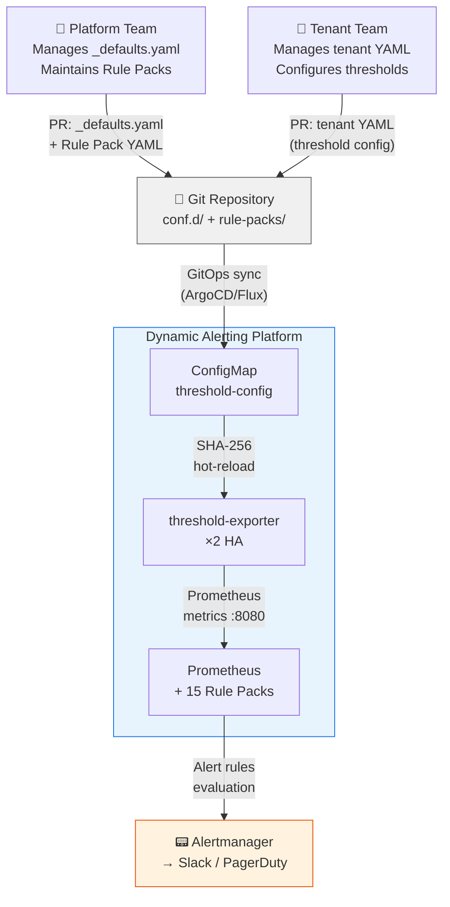
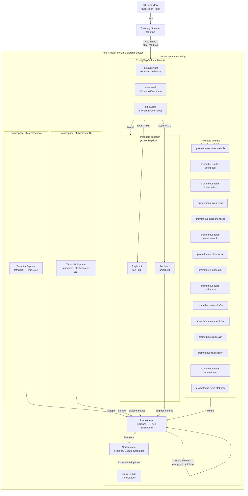

# Architecture and Design — Multi-Tenant Dynamic Alerting Platform Technical Whitepaper

> **Language / 語言：** **English (Current)** | [中文](architecture-and-design.md)

## Introduction

This document provides Platform Engineers and Site Reliability Engineers (SREs) with an in-depth exploration of the technical architecture of the "Multi-Tenant Dynamic Alerting Platform" .

**This document covers:**
- System architecture and core design principles (including Regex dimension thresholds, scheduled thresholds)
- High availability (HA) design
- Rule Pack governance model overview (see [design/rule-packs.en.md](design/rule-packs.en.md) for details)

**Standalone design documents (spoke files):**
- **Config-Driven Design Deep Dive** → [design/config-driven.en.md](design/config-driven.en.md) — The core mechanism that eliminates N×M config explosion; zero additional rule maintenance per new tenant
- **Rule Packs & Projected Volume** → [design/rule-packs.en.md](design/rule-packs.en.md) — 15 independent rule packs with zero PR conflicts, enabling cross-team parallel development
- **High Availability (HA) Deep Dive** → [design/high-availability.en.md](design/high-availability.en.md) — Achieving 99.9%+ alert reliability SLA with zero monitoring blind spots during maintenance
- **Future Roadmap** → [design/roadmap-future.en.md](design/roadmap-future.en.md) — v2.8.0 delivered items + v2.9.0+ long-term exploration directions

**Standalone topic documents:**
- **Benchmarks** → [benchmarks.en.md](benchmarks.en.md)
- **Governance & Security** → [governance-security.en.md](governance-security.en.md)
- **Troubleshooting** → [troubleshooting.en.md](troubleshooting.en.md)
- **Advanced Scenarios** → [internal/test-coverage-matrix.md](internal/test-coverage-matrix.md)
- **Migration Engine** → [migration-engine.en.md](migration-engine.en.md)

**Related documentation:**
- **Quick Start** → [README.en.md](index.md)
- **Migration Guide** → [migration-guide.md](migration-guide.md)
- **Rule Packs Documentation** → [rule-packs/README.md](rule-packs/README.md)
- **threshold-exporter Component** → [components/threshold-exporter/README.md](https://github.com/vencil/Dynamic-Alerting-Integrations/blob/main/components/threshold-exporter/README.md)

---

## 1. System Architecture Diagram

### 1.1 C4 Context — System Boundary & Actor Interactions


```mermaid
graph TB
    PT["👤 Platform Team<br/>Manages _defaults.yaml<br/>Maintains Rule Packs"]
    TT["👤 Tenant Team<br/>Manages tenant YAML<br/>Configures thresholds"]
    Git["📂 Git Repository<br/>conf.d/ + rule-packs/"]

    subgraph DAP["Dynamic Alerting Platform"]
        TE["threshold-exporter<br/>×2 HA"]
        PM["Prometheus<br/>+ 15 Rule Packs"]
        CM["ConfigMap<br/>threshold-config"]
    end

    AM["📟 Alertmanager<br/>→ Slack / PagerDuty"]

    PT -->|"PR: _defaults.yaml<br/>+ Rule Pack YAML"| Git
    TT -->|"PR: tenant YAML<br/>(threshold config)"| Git
    Git -->|"GitOps sync<br/>(ArgoCD/Flux)"| CM
    CM -->|"SHA-256<br/>hot-reload"| TE
    TE -->|"Prometheus<br/>metrics :8080"| PM
    PM -->|"Alert rules<br/>evaluation"| AM

    style DAP fill:#e8f4fd,stroke:#1a73e8
    style Git fill:#f0f0f0,stroke:#666
    style AM fill:#fff3e0,stroke:#e65100
```

### 1.2 Internal Architecture


```mermaid
graph TB
    subgraph Cluster["Kind Cluster: dynamic-alerting-cluster"]
        subgraph TenantA["Namespace: db-a (Tenant A)"]
            ExpA["Tenant A Exporter<br/>(MariaDB, Redis, etc.)"]
        end

        subgraph TenantB["Namespace: db-b (Tenant B)"]
            ExpB["Tenant B Exporter<br/>(MongoDB, Elasticsearch, etc.)"]
        end

        subgraph Monitoring["Namespace: monitoring"]
            subgraph Config["ConfigMap Volume Mounts"]
                CfgDefault["_defaults.yaml<br/>(Platform Defaults)"]
                CfgTenantA["db-a.yaml<br/>(Tenant A Overrides)"]
                CfgTenantB["db-b.yaml<br/>(Tenant B Overrides)"]
            end

            subgraph Export["threshold-exporter<br/>(×2 HA Replicas)"]
                TE1["Replica 1<br/>port 8080"]
                TE2["Replica 2<br/>port 8080"]
            end

            subgraph Rules["Projected Volume<br/>Rule Packs (×15)"]
                RP1["prometheus-rules-mariadb"]
                RP2["prometheus-rules-postgresql"]
                RP3["prometheus-rules-kubernetes"]
                RP4["prometheus-rules-redis"]
                RP5["prometheus-rules-mongodb"]
                RP6["prometheus-rules-elasticsearch"]
                RP7["prometheus-rules-oracle"]
                RP8["prometheus-rules-db2"]
                RP9["prometheus-rules-clickhouse"]
                RP10["prometheus-rules-kafka"]
                RP11["prometheus-rules-rabbitmq"]
                RP12["prometheus-rules-jvm"]
                RP13["prometheus-rules-nginx"]
                RP14["prometheus-rules-operational"]
                RP15["prometheus-rules-platform"]
            end

            Prom["Prometheus<br/>(Scrape: TE, Rule Evaluation)"]
            AM["Alertmanager<br/>(Routing, Dedup, Grouping)"]
            Slack["Slack / Email<br/>(Notifications)"]
        end
    end

    Git["Git Repository<br/>(Source of Truth)"]
    Scanner["Directory Scanner<br/>(conf.d/)"]

    Git -->|Pull| Scanner
    Scanner -->|Hot-reload<br/>SHA-256 hash| Config
    Config -->|Mount| Export
    ExpA -->|Scrape| Prom
    ExpB -->|Scrape| Prom
    Config -->|Load YAML| TE1
    Config -->|Load YAML| TE2
    TE1 -->|Expose metrics| Prom
    TE2 -->|Expose metrics| Prom
    Rules -->|Mount| Prom
    Prom -->|Evaluate rules<br/>group_left matching| Prom
    Prom -->|Fire alerts| AM
    AM -->|Route & Deduplicate| Slack
```

**Architecture highlights:**
1. **Directory Scanner** scans the `conf.d/` directory, automatically discovering `_defaults.yaml` and tenant configuration files
2. **threshold-exporter × 2 HA Replicas** read ConfigMap and output three-state Prometheus metrics
3. **Projected Volume** mounts 15 independent rule packs, zero PR conflicts, each team independently owns their rules
4. **Prometheus** uses `group_left` vector matching to join with user thresholds, achieving O(M) complexity

### 1.3 Customer Migration & GitOps Governance Pipeline (Day-0 / Day-1 / Day-2)

The v2.8.0 customer migration pipeline strings together three lifecycle phases — "Day-0 import existing PromRule corpus", "Day-1 GitOps PR splitting & governance", "Day-2 runtime hot-reload" — into an end-to-end flow that runs offline, in air-gapped environments, and with independently-verifiable supply-chain provenance:


```mermaid
graph LR
    subgraph Day0["Day-0: Customer Migration (new in v2.8.0)"]
        PR["PromRule corpus<br/>(CRD / YAML)"] -->|da-parser| JSON["Canonical JSON<br/>+ prom_portable flag"]
        JSON -->|da-tools profile build| PB["Profile Builder<br/>(cluster + median ADR-018)"]
    end

    subgraph Day1["Day-1: GitOps Hierarchy-Aware Governance"]
        PB -->|da-batchpr apply| PR1["Base Infrastructure PR<br/>(_defaults.yaml)"]
        PB -->|da-batchpr apply| PR2["Tenant Override PRs<br/>(&lt;id&gt;.yaml — Blocked by Base)"]
        PR1 -.->|refresh --base-merged| PR2
        PR1 -->|da-guard CI gate| LINT["sticky PR comment<br/>(Schema / Routing / Cardinality / Redundant-override)"]
        PR2 -->|da-guard CI gate| LINT
    end

    subgraph Day2["Day-2: Runtime (v2.7.0 Scale Foundation I)"]
        LINT -->|Merge| GIT["Git repo (conf.d/)"]
        GIT -->|ArgoCD / Flux| CM["ConfigMap"]
        CM -->|dual-hash hot-reload| TE["threshold-exporter"]
    end

    style Day0 fill:#fff3e0,stroke:#d6b656
    style Day1 fill:#e8f4fd,stroke:#1a73e8
    style Day2 fill:#e8f5e9,stroke:#43a047
```

**Full-lifecycle governance features:**
- **Zero vendor lock-in**: `da-parser` keeps `prom_portable: bool`, so customers retain visibility into the "still-portable-to-Prom" subset even after migrating to VictoriaMetrics
- **GitOps PR ordering is enforced**: Base PR merges first → tenant PRs auto-rebase (`refresh --base-merged`); parser bug fixes go through `refresh --source-rule-ids` for granular patch regeneration
- **CI gates are stickyness-aware**: `da-guard` posts a marker-based sticky PR comment (no message spam) + uploads artifacts with 14d retention
- **Three delivery paths**: Docker / static binary 6-arch / air-gapped tar — every path cosign-keyless-signed + SBOM SPDX/CycloneDX; customer `make verify-release` verifies in one command

---

## Design Concepts Overview

The following table summarizes core design concepts, each with a standalone in-depth document:

| Design Concept | Overview | Details |
|--------|------|------|
| **Config-Driven Architecture** | Three-state config (Custom/Default/Disable), Directory Scanner, hierarchical `conf.d/` (ADR-016), `_defaults.yaml` L0→L3 inheritance (ADR-017), Dual-hash hot-reload, Tenant-Namespace mapping | [design/config-driven.en.md](design/config-driven.en.md) |
| **Multi-tier Severity** | `_critical` suffix and `"value:severity"` syntax, Severity Dedup, Alertmanager inhibit | [design/config-driven.en.md](design/config-driven.en.md) |
| **Regex & Scheduled Thresholds** | Regex dimension matching (`=~`), time-window scheduling (UTC), ResolveAt mechanism | [design/config-driven.en.md](design/config-driven.en.md) |
| **Three-State Operational Modes** | Normal / Silent / Maintenance, auto-expiry, Sentinel Alert pattern | [design/config-driven.en.md](design/config-driven.en.md) |
| **Alert Routing & Receivers** | 6 receiver types, Timing Guardrails, Per-rule Overrides, Enforced Routing, Routing Profiles | [design/config-driven.en.md](design/config-driven.en.md) |
| **Tenant API Architecture** | Commit-on-write, RBAC hot-reload, shared validation, Portal graceful degradation, `GET /tenants/{id}/effective` with merged config + dual hashes (v2.7.0) | [design/config-driven.en.md](design/config-driven.en.md) |
| **Rule Packs & Projected Volume** | 15 independent rule packs, three-part structure, bilingual annotations | [design/rule-packs.en.md](design/rule-packs.en.md) |
| **Performance Architecture** | Pre-computed Recording Rules vs Runtime Aggregation, O(M) vs O(M×N), Cardinality Guard | [design/config-driven.en.md](design/config-driven.en.md) |
| **High Availability (HA)** | 2 replica deployment, RollingUpdate, PodDisruptionBudget, `max by(tenant)` prevents double-counting | [design/high-availability.en.md](design/high-availability.en.md) |
| **Inheritance Engine** 🟢 *Shipped in v2.7.0* | Cleaner configs, less duplication, multi-layer default management | `_defaults.yaml` L0→L3 deep merge (ADR-017) + dual-hash (`source_hash` + `merged_hash`) precise hot-reload + 300ms debounce to absorb ConfigMap symlink rotation; flat and hierarchical `conf.d/` coexist (ADR-016). Detailed deliverables in [design/config-driven.en.md](design/config-driven.en.md) | [design/config-driven.en.md](design/config-driven.en.md) |
| **Customer Migration Pipeline** 🟢 *Delivered in v2.8.0* | Fully automates a customer's PromRule corpus → conf.d/; anti-vendor-lock-in; GitOps Hierarchy-Aware PR splitting; zero orphan-tenant risk | 5-step migration chain (`da-parser` → `profile build` → `da-batchpr` → `da-guard`). Full diagram in §1.3; step-by-step details in [migration-toolkit-installation.en.md](migration-toolkit-installation.en.md) · [ADR-018](adr/018-profile-as-directory-default.en.md) | [migration-toolkit-installation.en.md](migration-toolkit-installation.en.md) |
| **/simulate Endpoint + Ephemeral Graph** 🟢 *Delivered in v2.8.0* | tenant.yaml dry-run preview (no watch-loop pollution); Import Journey / simulator widget / Profile Builder share the same merge code path; prevents simulate-vs-commit divergence | Extracts a `ConfigSource` interface so `/simulate` (dry-run) and the underlying WatchLoop share the same `computeEffectiveConfig`+`computeMergedHash` state machine, **guaranteeing 100% convergence between preview and production results**; CI gate `TestSimulate_VsResolve_ParityHash` locks the contract | [design/config-driven.en.md](design/config-driven.en.md) |
| **Migration Toolkit Three Delivery Paths** 🟢 *Delivered in v2.8.0* | Covers the full spectrum from internet-connected to air-gapped (finance/government/defense) customer deployment environments; customers can independently verify supply-chain provenance | (a) Docker pull `ghcr.io/vencil/da-tools` (b) Static binary 6-arch cross-compile (linux/darwin/windows × amd64/arm64) (c) Air-gapped tar (`docker save` export). Every path signed via cosign keyless + SBOM in SPDX/CycloneDX; one-shot customer helper `make verify-release` | [migration-toolkit-installation.en.md](migration-toolkit-installation.en.md) |
| **Future Roadmap** | Field-level RBAC, Tenant Auto-Discovery, Anomaly-Aware Threshold, Dashboard as Code, etc. | [design/roadmap-future.en.md](design/roadmap-future.en.md) |

---

## 2. Core Design: Config-Driven Architecture

### 2.1–2.14 Complete Reference

Config-Driven Architecture is the platform core, covering:

- **Three-State Logic** (§2.1): Custom Value / Omitted (Default) / Disable
- **Directory Scanner Mode** (§2.2): `conf.d/` structure, `_defaults.yaml`, SHA-256 hot-reload, Incremental Reload
- **Tenant-Namespace Mapping** (§2.3): 1:1 / N:1 / 1:N mapping modes
- **Multi-tier Severity** (§2.4): `_critical` suffix, `"value:severity"` syntax, Severity Dedup
- **Regex Dimension Thresholds** (§2.5): `=~` operator, regex pattern matching
- **Scheduled Thresholds** (§2.6): Time-window scheduling, UTC timezone, cross-midnight support
- **Three-State Operational Modes** (§2.7): Normal / Silent / Maintenance, auto-expiry, Sentinel Alert
- **Severity Dedup** (§2.8): Alertmanager inhibit-layer dedup, per-tenant control
- **Alert Routing** (§2.9): Webhook / Email / Slack / Teams / RocketChat / PagerDuty, Timing Guardrails
- **Per-rule Routing Overrides** (§2.10): Alertname / Metric Group level routing
- **Platform Enforced Routing** (§2.11): NOC mandatory channel, per-tenant enforced channels
- **Routing Profiles & Domain Policies** (§2.12): ADR-007, four-layer merge pipeline
- **Performance Architecture** (§2.13): Pre-computed Recording Rules, O(M) complexity, Cardinality Guard
- **Tenant API Architecture** (§2.14): Commit-on-write, RBAC hot-reload, Portal graceful degradation

**All detailed content extracted to** [design/config-driven.en.md](design/config-driven.en.md)

---

## 3. Projected Volume Architecture (Rule Packs) — Overview

The platform manages **15 independent rule packs** with **139 Recording Rules + 99 Alert Rules**. Each Rule Pack contains a self-contained three-part structure:

1. **Part 1: Normalization Recording Rules** — Normalize raw metrics from different exporters
2. **Part 2: Threshold Normalization** — Produces `tenant:alert_threshold:*` metrics for Alert Rule matching
3. **Part 3: Alert Rules** — Actual alert conditions (with bilingual annotations)

**Advantages:** Zero PR conflicts, team autonomy, reusable, independent testing

**Complete reference** [design/rule-packs.en.md](design/rule-packs.en.md)

---

> 💡 **Interactive Tools**
>
> **Capacity Planning, Dependency Analysis & Validation**:
>
> - [Capacity Planner](https://vencil.github.io/Dynamic-Alerting-Integrations/assets/jsx-loader.html?component=../interactive/tools/capacity-planner.jsx) — Estimate cluster resource requirements (cardinality, replicas, memory)
> - [Dependency Graph](https://vencil.github.io/Dynamic-Alerting-Integrations/assets/jsx-loader.html?component=../interactive/tools/dependency-graph.jsx) — Visualize Rule Pack and recording rule dependencies
> - [PromQL Tester](https://vencil.github.io/Dynamic-Alerting-Integrations/assets/jsx-loader.html?component=../interactive/tools/promql-tester.jsx) — Test and validate PromQL queries
>
> See [Interactive Tools Hub](https://vencil.github.io/Dynamic-Alerting-Integrations/) for more tools

---

## 4. High Availability Design

### 4.1 Deployment Strategy

```yaml
replicas: 2
strategy:
  type: RollingUpdate
  rollingUpdate:
    maxUnavailable: 0    # Zero-downtime rolling update
    maxSurge: 1

affinity:
  podAntiAffinity:
    preferredDuringSchedulingIgnoredDuringExecution:
      - weight: 100
        podAffinityTerm:
          topologyKey: kubernetes.io/hostname
```

**Features:**
- 2 replicas spread across different nodes
- During rolling update, always 1 replica available
- Kind single-node cluster: soft affinity allows bin-packing

### 4.2 Pod Disruption Budget

```yaml
apiVersion: policy/v1
kind: PodDisruptionBudget
metadata:
  name: threshold-exporter-pdb
spec:
  minAvailable: 1
  selector:
    matchLabels:
      app: threshold-exporter
```

**Guarantee:** Always 1 replica serving Prometheus scrapes, even during active maintenance

---

## 5. Future Roadmap

| Timeline | Theme | Focus |
|----------|-------|-------|
| **v2.7.0 Shipped** | Scale Foundation I + Component Robustness | `conf.d/` directory hierarchy + `_defaults.yaml` inheritance engine (ADR-016/017), Go production path complete (`config_debounce.go` + `config_metrics.go` + Tenant API `/effective` endpoint + dual-hash hot-reload), Blast Radius CI bot, Tier 1 component health snapshot, 1000-tenant synthetic fixture |
| **v2.8.0 Shipped** (2026-05-12) | Customer migration pipeline + 1000-tenant scale validation + automation consolidation | (a) **Customer migration pipeline 5-step chain** (da-parser → Profile Builder ([ADR-018](adr/018-profile-as-directory-default.en.md)) → Hierarchy-Aware Batch PR (da-batchpr) + refresh modes → Dangling Defaults Guard (da-guard) with sticky PR comment workflow); (b) **/simulate endpoint + ephemeral graph**; (c) **Server-side Search API + virtualized Tenant Manager**; (d) **Master Onboarding Dual Entry** (5/5 wizards: cicd-setup → deployment → alert-builder → routing-trace → tenant-manager) + **Smart Views frontend integration**; (e) **Migration Toolkit three delivery paths** (Docker / static binary 6-arch / air-gapped tar) + cosign keyless signing + SBOM SPDX/CycloneDX; (f) **Policy-as-Code automation** (56 pre-commit hooks: 39 auto + 14 manual + 3 pre-push); (g) **Scale Foundation III** (1000-tenant SLO measurements: cold load 112 ms / steady-state reload 1.3 ms / 5-anchor e2e fire-through baseline) + **Tenant API hardening** (rate limit + X-Request-ID + tenant-scoped authz + body-content range validation) + mixed-mode duplicate tenant id promoted to hard error; (h) **ZH-primary SSOT policy lock** |
| **v2.9.0 In Planning** | Harden from first customer's actual usage | Glossary-driven codename gate Layer 2 (self-healing) · 4-hr soak + customer-anon corpus calibration · Rule Pack × threshold-calculator data flow evaluation · Local try-it-yourself onboarding (exporter / tenant-api / portal / da-tools standalone) |
| **Long-term Exploration** | Intelligence × Decoupling | Anomaly-Aware Threshold, Log-to-Metric Bridge, Multi-Format Export, CRD, ChatOps, Field-level RBAC, Tenant Auto-Discovery |

**Complete roadmap and technical plan** [design/roadmap-future.en.md](design/roadmap-future.en.md) · DX tooling improvements see [dx-tooling-backlog.md](internal/dx-tooling-backlog.md)

---

## 6. ADR Index (Architecture Decision Records)

> Per ZH-primary SSOT policy, the live ADR index table is rendered into [`architecture-and-design.md`](architecture-and-design.md#6-adr-索引-architecture-decision-records) by `scripts/dx/generate_adr_index.py`. ADR source files live in [`docs/adr/`](adr/); each ADR has an `.en.md` sibling for the English translation.

ADR file naming: `NNN-kebab-case.md` (ZH) + `NNN-kebab-case.en.md` (EN). Status is recorded in each ADR's `## Status` (`## 狀態` in ZH) section. To refresh the auto-rendered table after editing an ADR, run `make adr-index`; CI / pre-commit `adr-index-check` blocks merges with stale tables.

---

## Extracted Topic Documents

The following sections have been extracted into standalone documents for focused, role-based reading:

| Section | Standalone Document | Audience |
|---------|-------------------|----------|
| §4 Performance Analysis & Benchmarks | [benchmarks.en.md](benchmarks.en.md) | Platform Engineers, SREs |
| §6–§7 Governance, Audit & Security | [governance-security.en.md](governance-security.en.md) | Platform Engineers, Security & Compliance |
| §8 Troubleshooting & Edge Cases | [troubleshooting.en.md](troubleshooting.en.md) | Platform Engineers, SREs, Tenants |
| §9 Advanced Scenarios & Test Coverage | [internal/test-coverage-matrix.md](internal/test-coverage-matrix.md) | Platform Engineers, SREs |
| §10 AST Migration Engine | [migration-engine.en.md](migration-engine.en.md) | Platform Engineers, DevOps |

---

## Appendix A: Role & Tool Quick Reference

> See [CLI Reference](cli-reference.md) for detailed tool usage.

