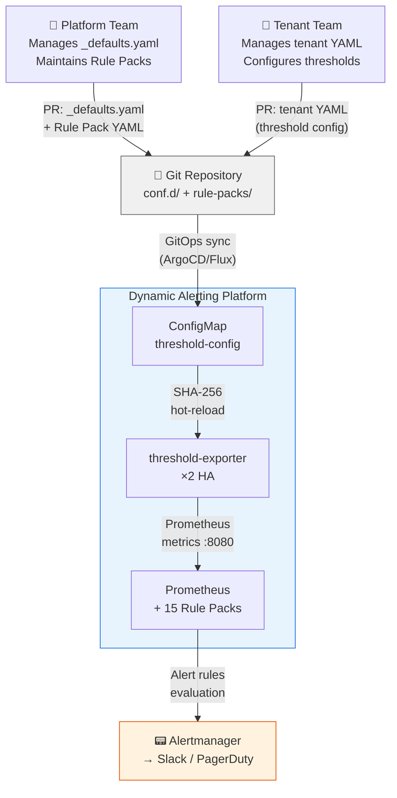
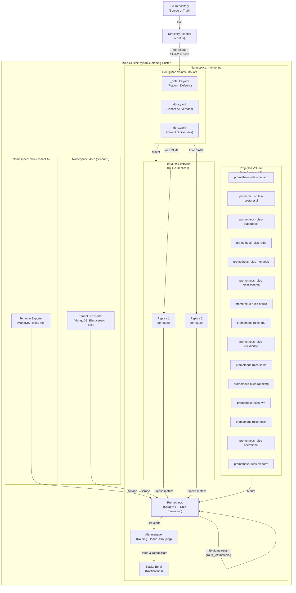
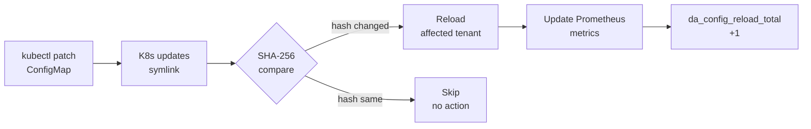
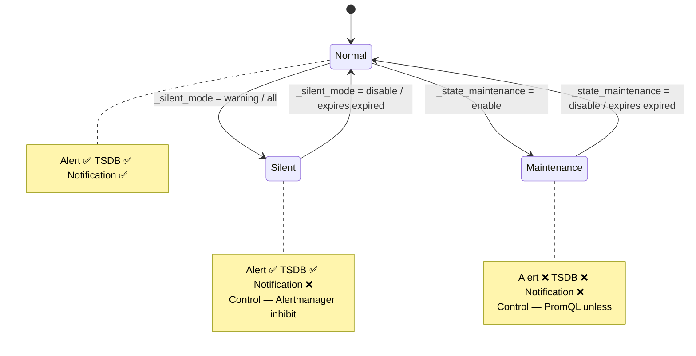
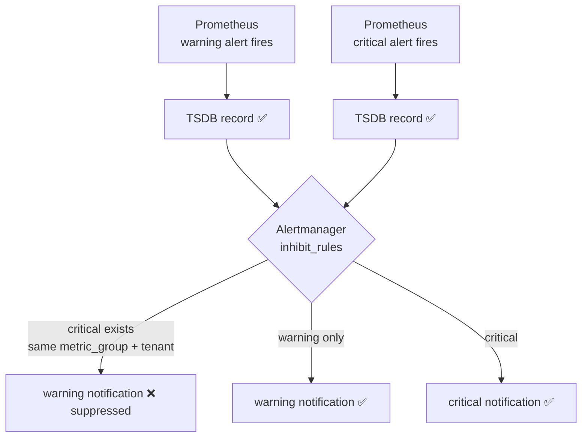
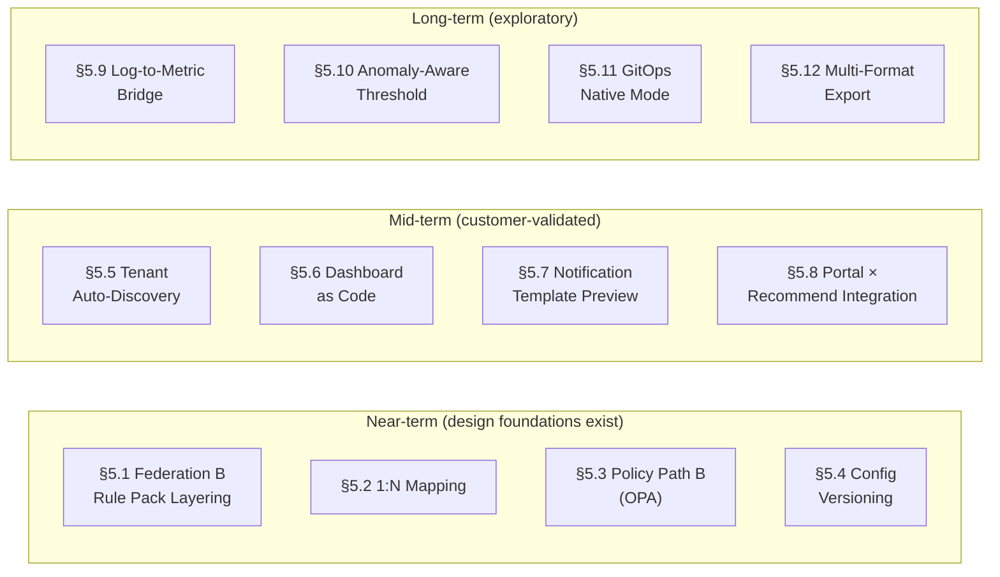

# Architecture and Design — Multi-Tenant Dynamic Alerting Platform Technical Whitepaper

> **Language / 語言：** **English (Current)** | [中文](architecture-and-design.md)

## Introduction

This document provides Platform Engineers and Site Reliability Engineers (SREs) with an in-depth exploration of the technical architecture of the "Multi-Tenant Dynamic Alerting Platform" .

**This document covers:**
- System architecture and core design principles (including Regex dimension thresholds, scheduled thresholds)
- Config-driven configuration workflow
- Governance model for Projected Volume and 15 Rule Packs
- High availability (HA) design
- Future roadmap

**Standalone topic documents:**
- **Benchmarks** → [benchmarks.en.md](benchmarks.en.md)
- **Governance & Security** → [governance-security.en.md](governance-security.en.md)
- **Troubleshooting** → [troubleshooting.en.md](troubleshooting.en.md)
- **Advanced Scenarios** → [scenarios/advanced-scenarios.en.md](scenarios/advanced-scenarios.en.md)
- **Migration Engine** → [migration-engine.en.md](migration-engine.en.md)

**Related documentation:**
- **Quick Start** → [README.en.md](index.md)
- **Migration Guide** → [migration-guide.md](migration-guide.md)
- **Rule Packs Documentation** → [rule-packs/README.md](rule-packs/README.md)
- **threshold-exporter Component** → [components/threshold-exporter/README.md](https://github.com/vencil/Dynamic-Alerting-Integrations/blob/main/components/threshold-exporter/README.md)

---

## 1. System Architecture Diagram

### 1.1 C4 Context — System Boundary & Actor Interactions


```mermaid
graph TB
    PT["👤 Platform Team<br/>Manages _defaults.yaml<br/>Maintains Rule Packs"]
    TT["👤 Tenant Team<br/>Manages tenant YAML<br/>Configures thresholds"]
    Git["📂 Git Repository<br/>conf.d/ + rule-packs/"]

    subgraph DAP["Dynamic Alerting Platform"]
        TE["threshold-exporter<br/>×2 HA"]
        PM["Prometheus<br/>+ 15 Rule Packs"]
        CM["ConfigMap<br/>threshold-config"]
    end

    AM["📟 Alertmanager<br/>→ Slack / PagerDuty"]

    PT -->|"PR: _defaults.yaml<br/>+ Rule Pack YAML"| Git
    TT -->|"PR: tenant YAML<br/>(threshold config)"| Git
    Git -->|"GitOps sync<br/>(ArgoCD/Flux)"| CM
    CM -->|"SHA-256<br/>hot-reload"| TE
    TE -->|"Prometheus<br/>metrics :8080"| PM
    PM -->|"Alert rules<br/>evaluation"| AM

    style DAP fill:#e8f4fd,stroke:#1a73e8
    style Git fill:#f0f0f0,stroke:#666
    style AM fill:#fff3e0,stroke:#e65100
```

### 1.2 Internal Architecture


```mermaid
graph TB
    subgraph Cluster["Kind Cluster: dynamic-alerting-cluster"]
        subgraph TenantA["Namespace: db-a (Tenant A)"]
            ExpA["Tenant A Exporter<br/>(MariaDB, Redis, etc.)"]
        end

        subgraph TenantB["Namespace: db-b (Tenant B)"]
            ExpB["Tenant B Exporter<br/>(MongoDB, Elasticsearch, etc.)"]
        end

        subgraph Monitoring["Namespace: monitoring"]
            subgraph Config["ConfigMap Volume Mounts"]
                CfgDefault["_defaults.yaml<br/>(Platform Defaults)"]
                CfgTenantA["db-a.yaml<br/>(Tenant A Overrides)"]
                CfgTenantB["db-b.yaml<br/>(Tenant B Overrides)"]
            end

            subgraph Export["threshold-exporter<br/>(×2 HA Replicas)"]
                TE1["Replica 1<br/>port 8080"]
                TE2["Replica 2<br/>port 8080"]
            end

            subgraph Rules["Projected Volume<br/>Rule Packs (×15)"]
                RP1["prometheus-rules-mariadb"]
                RP2["prometheus-rules-postgresql"]
                RP3["prometheus-rules-kubernetes"]
                RP4["prometheus-rules-redis"]
                RP5["prometheus-rules-mongodb"]
                RP6["prometheus-rules-elasticsearch"]
                RP7["prometheus-rules-oracle"]
                RP8["prometheus-rules-db2"]
                RP9["prometheus-rules-clickhouse"]
                RP10["prometheus-rules-kafka"]
                RP11["prometheus-rules-rabbitmq"]
                RP12["prometheus-rules-jvm"]
                RP13["prometheus-rules-nginx"]
                RP14["prometheus-rules-operational"]
                RP15["prometheus-rules-platform"]
            end

            Prom["Prometheus<br/>(Scrape: TE, Rule Evaluation)"]
            AM["Alertmanager<br/>(Routing, Dedup, Grouping)"]
            Slack["Slack / Email<br/>(Notifications)"]
        end
    end

    Git["Git Repository<br/>(Source of Truth)"]
    Scanner["Directory Scanner<br/>(conf.d/)"]

    Git -->|Pull| Scanner
    Scanner -->|Hot-reload<br/>SHA-256 hash| Config
    Config -->|Mount| Export
    ExpA -->|Scrape| Prom
    ExpB -->|Scrape| Prom
    Config -->|Load YAML| TE1
    Config -->|Load YAML| TE2
    TE1 -->|Expose metrics| Prom
    TE2 -->|Expose metrics| Prom
    Rules -->|Mount| Prom
    Prom -->|Evaluate rules<br/>group_left matching| Prom
    Prom -->|Fire alerts| AM
    AM -->|Route & Deduplicate| Slack
```

**Architecture highlights:**
1. **Directory Scanner** scans the `conf.d/` directory, automatically discovering `_defaults.yaml` and tenant configuration files
2. **threshold-exporter × 2 HA Replicas** read ConfigMap and output three-state Prometheus metrics
3. **Projected Volume** mounts 15 independent rule packs, zero PR conflicts, each team independently owns their rules
4. **Prometheus** uses `group_left` vector matching to join with user thresholds, achieving O(M) complexity

---

## 2. Core Design: Config-Driven Architecture

### 2.1 Three-State Logic

The platform supports a "three-state" configuration pattern, providing flexible default values, overrides, and disable mechanisms:

| State | Configuration | Prometheus Output | Description |
|-------|---------------|-------------------|-------------|
| **Custom Value** | `metric_key: 42` | ✓ Output custom threshold | Tenant override of default |
| **Omitted (Default)** | Not specified in YAML | ✓ Output platform default | Uses `_defaults.yaml` |
| **Disable** | `metric_key: "disable"` | ✗ No output | Completely disable metric |

**Prometheus output example:**

```
# Custom value (db-a tenant)
user_threshold{tenant="db-a", metric="mariadb_replication_lag", severity="warning"} 10

# Default value (db-b tenant, not overridden)
user_threshold{tenant="db-b", metric="mariadb_replication_lag", severity="warning"} 30

# Disabled (no output)
# (metric not present)
```

### 2.2 Directory Scanner Mode (conf.d/)

**Directory structure:**
```
conf.d/
├── _defaults.yaml         # Platform global defaults (managed by Platform team)
├── db-a.yaml             # Tenant A overrides (managed by db-a team)
├── db-b.yaml             # Tenant B overrides (managed by db-b team)
└── ...
```

**`_defaults.yaml` content (Platform managed):**
```yaml
defaults:
  mysql_connections: 80
  mysql_cpu: 80
  mysql_slave_lag: 30
  container_cpu: 80
  container_memory: 85

state_filters:
  container_crashloop:
    reasons: ["CrashLoopBackOff"]
    severity: "critical"
  maintenance:
    reasons: []
    severity: "info"
    default_state: "disable"
```

**`db-a.yaml` content (Tenant override):**
```yaml
tenants:
  db-a:
    mysql_connections: "70"          # Override default 80
    container_cpu: "70"              # Override default 80
    mysql_slave_lag: "disable"       # No replica, disable
    # mysql_cpu not specified → use default value 80
    # Dimensional labels
    "redis_queue_length{queue='tasks'}": "500"
    "redis_queue_length{queue='events', priority='high'}": "1000:critical"
```

#### Boundary Enforcement Rules

| File Type | Allowed Blocks | Violation Behavior |
|-----------|----------------|-------------------|
| Files with `_` prefix (`_defaults.yaml`) | `defaults`, `state_filters`, `tenants` | — |
| Tenant files (`db-a.yaml`) | Only `tenants` | Other blocks automatically ignored + WARN log |

#### SHA-256 Hot-Reload

Does not rely on file modification time (ModTime), but rather on **SHA-256 content hash**:

```bash
# On each ConfigMap update
$ sha256sum conf.d/_defaults.yaml conf.d/db-a.yaml conf.d/db-b.yaml
abc123... conf.d/_defaults.yaml
def456... conf.d/db-a.yaml
ghi789... conf.d/db-b.yaml

# Kubernetes ConfigMap symlink mounted will rotate
# Old hash → new hash
# threshold-exporter detects change, reloads configuration
```


```mermaid
flowchart LR
    A["kubectl patch<br/>ConfigMap"] --> B["K8s updates<br/>symlink"]
    B --> C{"SHA-256<br/>compare"}
    C -->|"hash changed"| D["Reload<br/>affected tenant"]
    C -->|"hash same"| E["Skip<br/>no action"]
    D --> F["Update Prometheus<br/>metrics"]
    F --> G["da_config_reload_total<br/>+1"]
```

**Why SHA-256 instead of ModTime?**
- Kubernetes ConfigMap creates a symlink layer, ModTime is unreliable
- Same content = same hash, avoid unnecessary reloads

### 2.3 Tenant-Namespace Mapping

The platform's `tenant` is a **logical identity** determined by two independent sources:

1. **Threshold side**: threshold-exporter derives tenant from the YAML config key (`tenants.db-a`), zero coupling with K8s namespace
2. **Data side**: Prometheus `relabel_configs` injects a `tenant` label into scraped metrics

Both sides must produce an exact match, but **their sources can differ**. This enables three mapping modes:

| Mode | Description | Prometheus relabel Strategy | Use Case |
|------|------------|---------------------------|----------|
| **1:1** (standard) | One Namespace = One Tenant | `source_labels: [__meta_kubernetes_namespace]` → `target_label: tenant` | Most deployments |
| **N:1** | Multiple Namespaces → One Tenant | Multiple namespace metrics relabeled to the same tenant value | Read/write split (`db-a-read` + `db-a-write` → `db-a`) |
| **1:N** | One Namespace → Multiple Tenants | Use Service label/annotation instead of namespace as tenant source | Shared-namespace multi-tenant architecture |

**N:1 relabel example** (multiple namespaces → one tenant):

```yaml
relabel_configs:
  - source_labels: [__meta_kubernetes_namespace]
    action: keep
    regex: "db-a-(read|write)"
  # Unify to db-a
  - source_labels: [__meta_kubernetes_namespace]
    target_label: tenant
    regex: "(db-[^-]+).*"    # Extract first segment as tenant
    replacement: "$1"
```

**1:N relabel example** (one namespace → multiple tenants):

```yaml
relabel_configs:
  - source_labels: [__meta_kubernetes_namespace]
    action: keep
    regex: "shared-db"
  # Read tenant identity from Service annotation
  - source_labels: [__meta_kubernetes_service_annotation_alerting_tenant]
    target_label: tenant
```

**Automation**: `scaffold_tenant.py --namespaces ns1,ns2` auto-generates N:1 relabel_configs snippet and writes a `_namespaces` metadata field in the tenant YAML for tool reference (does not affect metric logic).

**Design principle**: The platform core (threshold-exporter + Rule Packs) is completely namespace-agnostic. Mapping flexibility is entirely provided by Prometheus scrape config — no platform component changes needed. See [BYO Prometheus Integration Guide](byo-prometheus-integration.en.md).

### 2.4 Multi-tier Severity

Support both `_critical` suffix and `"value:severity"` syntax:

**Method 1: `_critical` suffix (suitable for basic thresholds)**
```yaml
tenants:
  db-a:
    mysql_connections: "100"            # warning threshold
    mysql_connections_critical: "150"   # _critical → auto-generate critical alert
```

**Method 2: `"value:severity"` syntax (suitable for dimensional labels)**
```yaml
tenants:
  redis-prod:
    "redis_queue_length{queue='orders'}": "500:critical"
```

**Prometheus output:**
```
user_threshold{tenant="db-a", component="mysql", metric="connections", severity="warning"} 100
user_threshold{tenant="db-a", component="mysql", metric="connections", severity="critical"} 150
```

#### Auto-Suppression (Severity Dedup via Alertmanager Inhibit)

Severity dedup is handled at the **Alertmanager inhibit layer**, not in PromQL. This design preserves TSDB completeness while avoiding notification duplication.

**Key principle:** Prometheus always records both warning and critical metrics. Alertmanager's `inhibit_rules` suppress only the **notification**, not the alert itself.

**Prometheus alert rules:**

```yaml
- alert: MariaDBHighConnections          # warning
  expr: |
    ( tenant:mysql_threads_connected:max > on(tenant) group_left tenant:alert_threshold:connections )
    unless on(tenant) (user_state_filter{filter="maintenance"} == 1)
  for: 5m
  labels:
    severity: warning
    metric_group: "connections"

- alert: MariaDBHighConnectionsCritical  # critical
  expr: |
    ( tenant:mysql_threads_connected:max > on(tenant) group_left tenant:alert_threshold:connections_critical )
    unless on(tenant) (user_state_filter{filter="maintenance"} == 1)
  for: 5m
  labels:
    severity: critical
    metric_group: "connections"
```

**Alertmanager inhibit rule (per-tenant, auto-generated):**

```yaml
inhibit_rules:
  - source_matchers:
      - severity="critical"
      - metric_group=~".+"
      - tenant="db-a"
    target_matchers:
      - severity="warning"
      - metric_group=~".+"
      - tenant="db-a"
    equal: ["metric_group"]
```

**Result:**
- Connection count ≥ 150 (critical): Both warning and critical alerts fire in Prometheus (TSDB records both). Alertmanager's inhibit rule blocks only the **warning notification**, critical notification sends normally.
- Connection count 100–150 (warning only): Warning alert fires, critical does not. Warning notification sends.
- **TSDB completeness:** All alert firings remain in Prometheus TSDB regardless of notification suppression.

### 2.5 Regex Dimension Thresholds

Since v0.12.0, the config parser supports the `=~` operator, enabling regex-based fine-grained matching on dimension labels. This design allows thresholds to target specific dimension subsets without introducing external data dependencies.

**Configuration syntax:**
```yaml
tenants:
  db-a:
    # Exact match
    "oracle_tablespace_used_percent{tablespace='USERS'}": "85"
    # Regex match: all tablespaces starting with SYS
    "oracle_tablespace_used_percent{tablespace=~'SYS.*'}": "95"
```

**Implementation path:**

1. **Exporter layer**: Config parser detects the `=~` operator and outputs the regex pattern as a `_re` suffixed label
   ```
   user_threshold{tenant="db-a", metric="oracle_tablespace_used_percent",
                  tablespace_re="SYS.*", severity="warning"} 95
   ```
2. **Recording rule layer**: PromQL uses `label_replace` + `=~` for actual matching at query time
3. **Design principle**: The exporter remains a pure config→metric converter; matching logic is entirely handled by Prometheus native vector operations

### 2.6 Scheduled Thresholds

Since v0.12.0, thresholds support time-window scheduling, allowing automatic threshold switching across different time periods. Typical use cases: relaxed thresholds during nighttime maintenance windows, tightened thresholds during peak hours.

**Configuration syntax:**
```yaml
tenants:
  db-a:
    mysql_connections:
      default: "100"
      overrides:
        - window: "22:00-06:00"    # UTC nighttime window (cross-midnight supported)
          value: "200"             # Nighttime batch jobs, relax to 200
        - window: "09:00-18:00"
          value: "80"              # Daytime peak, tighten to 80
```

**Technical implementation:**

- **`ScheduledValue` custom YAML type**: Supports dual-format parsing — scalar strings (backward compatible) and structured `{default, overrides[{window, value}]}`
- **`ResolveAt(now time.Time)`**: Resolves the applicable threshold based on current UTC time, ensuring determinism and testability
- **Time window format**: `HH:MM-HH:MM` (UTC), cross-midnight support (e.g., `22:00-06:00` means 10 PM to 6 AM next day)
- **45 test cases**: Covering boundary conditions — window overlap, cross-midnight, scalar fallback, empty overrides

### 2.7 Three-State Operational Modes

v1.2.0 introduced **Silent Mode**, which together with the existing Maintenance Mode forms a three-state operational model, solving the problem of "users mistaking Maintenance Mode for muting."

**Behavior Matrix**

| Operational State | Semantics | Alert Triggered | TSDB Record | Notification | Control Layer |
|-------------------|-----------|-----------------|-------------|--------------|---|
| Normal | Normal operation | ✅ | ✅ | ✅ | — |
| Silent | Muted | ✅ | ✅ | ❌ | Alertmanager |
| Maintenance | True maintenance | ❌ | ❌ | ❌ | Prometheus (PromQL) |


```mermaid
stateDiagram-v2
    [*] --> Normal
    Normal --> Silent : _silent_mode = warning / all
    Normal --> Maintenance : _state_maintenance = enable
    Silent --> Normal : _silent_mode = disable / expires expired
    Maintenance --> Normal : _state_maintenance = disable / expires expired

    note right of Normal
        Alert ✅ TSDB ✅ Notification ✅
    end note
    note right of Silent
        Alert ✅ TSDB ✅ Notification ❌
        Control — Alertmanager inhibit
    end note
    note right of Maintenance
        Alert ❌ TSDB ❌ Notification ❌
        Control — PromQL unless
    end note
```

**Design principle:** Prometheus controls "what should trigger an alert," Alertmanager controls "whether to send notification."

- **Maintenance Mode** (existing): Eliminates alerts at the PromQL layer via `unless on(tenant) (user_state_filter{filter="maintenance"} == 1)`. Alert does not fire, TSDB has no record, no notification.
- **Silent Mode** : Alert fires normally in Prometheus (TSDB records `ALERTS`), but Alertmanager intercepts notifications via `inhibit_rules`.

**Silent Mode Data Flow**

```
tenant YAML: _silent_mode: "warning"
    ↓
threshold-exporter: user_silent_mode{tenant="db-a", target_severity="warning"} 1
    ↓
Prometheus alert rule (rule-pack-operational.yaml):
    TenantSilentWarning{tenant="db-a"} fires
    ↓
Alertmanager inhibit_rules:
    source: alertname="TenantSilentWarning"
    target: severity="warning", equal: ["tenant"]
    ↓
Result: db-a warning alerts fire normally (TSDB record exists), but notifications are intercepted
```

**Tenant Configuration**

```yaml
tenants:
  db-a:
    _silent_mode: "warning"    # Mute warning notifications only
  db-b:
    _silent_mode: "all"        # Mute both warning and critical notifications
  db-c:
    _state_maintenance: "enable"  # True maintenance, alert completely suppressed
  db-d: {}                        # Normal — default behavior
```

Available `_silent_mode` values: `warning`, `critical`, `all`, `disable`. Unset defaults to Normal mode.

**Auto-Expiry :** `_silent_mode` and `_state_maintenance` support structured objects (backward compatible with scalar strings) with `expires` ISO8601 timestamp. The Go engine checks `time.Now().After(expires)` to stop emitting sentinel metrics, automatically restoring alerts to normal. Expiry generates a transient gauge `da_config_event{event="silence_expired"}` with `TenantConfigEvent` alert rule for notification.

```yaml
tenants:
  db-a:
    _silent_mode:
      target: "all"
      expires: "2026-04-01T00:00:00Z"
      reason: "Migration shadow monitoring period"
    _state_maintenance:
      target: "all"
      expires: "2026-04-01T00:00:00Z"
      reason: "Scheduled maintenance window"
```

**Alertmanager inhibit_rules Template**

```yaml
inhibit_rules:
  # Severity Dedup: per-tenant inhibit rules (generated by generate_alertmanager_routes.py)
  # Only tenants with _severity_dedup: "enable" (default) generate rules
  # Tenants with _severity_dedup: "disable" have no corresponding rules → receive both notifications
  - source_matchers:
      - severity="critical"
      - metric_group=~".+"
      - tenant="db-a"
    target_matchers:
      - severity="warning"
      - metric_group=~".+"
      - tenant="db-a"
    equal: ["metric_group"]

  # Silent Mode: suppress warning notifications
  - source_matchers:
      - alertname="TenantSilentWarning"
    target_matchers:
      - severity="warning"
    equal: ["tenant"]

  # Silent Mode: suppress critical notifications
  - source_matchers:
      - alertname="TenantSilentCritical"
    target_matchers:
      - severity="critical"
    equal: ["tenant"]
```

### 2.8 Severity Dedup

v1.2.0 introduced **Severity Dedup** to resolve the issue of "TSDB records for warning being eliminated when critical fires."

**Design change:** Auto-suppression moved from the PromQL layer (`unless critical`) to the Alertmanager layer (`inhibit_rules`). TSDB always records both warning and critical simultaneously; dedup only controls notification behavior.


```mermaid
flowchart TD
    A["Prometheus<br/>warning alert fires"] --> B["TSDB record ✅"]
    C["Prometheus<br/>critical alert fires"] --> D["TSDB record ✅"]
    B --> E{"Alertmanager<br/>inhibit_rules"}
    D --> E
    E -->|"critical exists<br/>same metric_group + tenant"| F["warning notification ❌ suppressed"]
    E -->|"warning only"| G["warning notification ✅"]
    E -->|"critical"| H["critical notification ✅"]
```

**Per-Tenant Control Mechanism**

v1.2.0 implements per-tenant inhibit rules for optional configuration:

1. `generate_alertmanager_routes.py` scans all tenant YAML files for `_severity_dedup` setting
2. For each tenant with dedup enabled, generates a dedicated inhibit rule (with `tenant="<name>"` matcher)
3. Tenants with `_severity_dedup: "disable"` generate no rule → receive both notifications
4. Exporter still outputs `user_severity_dedup{tenant, mode}` metric → Prometheus sentinel `TenantSeverityDedupEnabled` for Grafana panels to display each tenant's dedup status

**Behavior Matrix**

| Setting | TSDB warning | TSDB critical | Warning Notification | Critical Notification |
|---------|------------|--------------|---------------------|---------------------|
| `_severity_dedup: "enable"` (default) | ✅ | ✅ | ❌ Intercepted by AM | ✅ |
| `_severity_dedup: "disable"` | ✅ | ✅ | ✅ | ✅ |

**Pairing Mechanism:** The `metric_group` label in alert rules allows Alertmanager to correctly pair warning/critical (since they have different alertnames). For example, `MariaDBHighConnections` and `MariaDBHighConnectionsCritical` share `metric_group: "connections"`. Each per-tenant inhibit rule limits `metric_group=~".+"` to ensure alerts without `metric_group` (like `MariaDBDown`) do not participate in dedup.

**Tenant Configuration**

```yaml
tenants:
  db-a: {}                                # Default enable — warning suppressed
  db-b:
    _severity_dedup: "disable"           # Receive both notifications
```

**Generated Alertmanager Configuration**

```bash
python3 scripts/tools/ops/generate_alertmanager_routes.py --config-dir conf.d/ --dry-run
# Output includes per-tenant inhibit_rules section, merged into Alertmanager config
```

### 2.9 Alert Routing (Config-Driven Routing)

Tenants can manage notification destinations, grouping strategies, and timing controls via the `_routing` section. The platform tool `generate_alertmanager_routes.py` reads all tenant YAML files and generates Alertmanager route + receiver + inhibit_rules YAML fragment.

> supports six receiver types: webhook / email / slack / teams / rocketchat / pagerduty. Receivers are structured objects (`{type, ...fields}`), validated by `generate_alertmanager_routes.py` for required fields and corresponding Alertmanager config generation.

**Schema**

```yaml
tenants:
  db-a:
    _routing:
      receiver:                                         # required — structured object
        type: "webhook"                                 #   type: webhook/email/slack/teams/rocketchat/pagerduty
        url: "https://webhook.db-a.svc/alerts"
      group_by: ["alertname", "severity"]               # optional
      group_wait: "30s"                                  # optional, guardrail 5s–5m
      group_interval: "1m"                               # optional, guardrail 5s–5m
      repeat_interval: "4h"                              # optional, guardrail 1m–72h
      overrides: []                                      # optional, per-rule routing (§2.10)
```

**Timing Guardrails**

The platform enforces strict bounds on timing parameters; values outside limits are clamped and logged as WARN:

| Parameter | Minimum | Maximum | Default |
|-----------|---------|---------|---------|
| `group_wait` | 5s | 5m | 30s |
| `group_interval` | 5s | 5m | 5m |
| `repeat_interval` | 1m | 72h | 4h |

**Interaction with Silent Mode**

Silent Mode naturally bypasses routing: Alertmanager's `inhibit_rules` intercept notifications before route evaluation. Therefore, even if a tenant configures custom routing, silent alerts will not send notifications.

**Tool Chain**

```bash
# Preview mode
python3 scripts/tools/ops/generate_alertmanager_routes.py \
  --config-dir conf.d/ --dry-run

# Generate fragment + CI validation
python3 scripts/tools/ops/generate_alertmanager_routes.py \
  --config-dir conf.d/ -o alertmanager-routes.yaml --validate \
  --policy .github/custom-rule-policy.yaml

# All-in-one merge into Alertmanager ConfigMap + reload
python3 scripts/tools/ops/generate_alertmanager_routes.py \
  --config-dir conf.d/ --apply --yes
```

`--validate` checks YAML validity + webhook domain allowlist (exit 0/1 for CI consumption). `--apply` directly merges fragment into Alertmanager ConfigMap and triggers reload. Output supports six receiver types: webhook, email, slack, teams, rocketchat, pagerduty.

### 2.10 Per-rule Routing Overrides 

Per-rule Routing Overrides allow tenants to route specific alerts or metric groups to different receivers (e.g., DBA-critical alerts to PagerDuty, everything else to Slack).

**YAML example:**

```yaml
tenants:
  db-a:
    _routing:
      receiver:
        type: slack
        api_url: "https://hooks.slack.com/services/..."
      overrides:
        - alertname: "MariaDBReplicationLag"
          receiver:
            type: pagerduty
            service_key: "abc123"
        - metric_group: "redis"
          receiver:
            type: webhook
            url: "https://oncall.example.com/redis"
```

**Design rules:**

- Each override must specify exactly one of `alertname` or `metric_group` (not both)
- Override receivers use the same `build_receiver_config()` validation and domain allowlist checks
- `expand_routing_overrides()` generates sub-routes inserted before the tenant's main route, ensuring Alertmanager matches overrides first
- Timing parameters (`group_wait`, `group_interval`, `repeat_interval`) can be overridden per-rule, subject to the same platform guardrails

### 2.11 Platform Enforced Routing 

Platform Team can configure `_routing_enforced` in `_defaults.yaml` to insert platform routing before all tenant routes (with `continue: true`), enabling dual-channel notifications where "NOC always receives + tenant also receives":

```yaml
# _defaults.yaml — Mode A: unified NOC receiver
_routing_enforced:
  enabled: true
  receiver:
    type: "webhook"
    url: "https://noc.example.com/alerts"
  match:
    severity: "critical"    # Only critical alerts sent to NOC
```

**Per-tenant Enforced Channel :** If the receiver field includes `{{tenant}}`, the system automatically creates independent enforced routes for each tenant, allowing Platform to establish per-tenant notification channels that tenants cannot refuse or override:

```yaml
# _defaults.yaml — Mode B: per-tenant independent channels
_routing_enforced:
  enabled: true
  receiver:
    type: "slack"
    api_url: "https://hooks.slack.com/services/T/B/x"
    channel: "#alerts-{{tenant}}"    # → #alerts-db-a, #alerts-db-b, ...
```

`generate_alertmanager_routes.py` inserts platform route before tenant routes. Mode A generates a single shared route; Mode B generates N per-tenant routes (each with `tenant="<name>"` matcher + `continue: true`). Disabled by default; Platform Team enables as needed. See [BYO Alertmanager Integration Guide §8](byo-alertmanager-integration.md#8-platform-enforced-routing).

### 2.13 Performance Architecture: Pre-computed Recording Rule vs Runtime Aggregation

The most common customer question: "Will Prometheus CPU/Memory spike as tenants grow?" The answer is no, because the platform's three-layer Rule Pack design shifts computation cost from "alert evaluation time" to "background pre-computation."

**Traditional approach (Runtime Aggregation) — scans all raw data on every evaluation:**

```yaml
# Every Alert evaluation: Prometheus loads all Pod raw series, runs rate + sum
- alert: TenantCPUHigh
  expr: |
    sum by (namespace) (rate(container_cpu_usage_seconds_total{container!=""}[5m]))
    > on(namespace) group_left()
    tenant_cpu_threshold
```

With N tenants and 10,000 Pods, every 15-second evaluation cycle requires Prometheus to: load 10,000 time series chunks from TSDB → execute `rate()` → execute `sum by (namespace)` → finally perform `>` comparison. Computation is O(pods × tenants), growing linearly with scale.

**This platform's approach (Pre-computed Vector Join) — alert evaluation is pure in-memory comparison:**

```yaml
# Part 2 Recording Rule (runs in background, produces low-cardinality metrics)
- record: tenant:cpu_usage:rate5m
  expr: sum by (tenant) (rate(container_cpu_usage_seconds_total{container!=""}[5m]))

# Part 3 Alert Rule (compares two pre-computed number vectors)
- alert: TenantCPUHigh
  expr: |
    tenant:cpu_usage:rate5m
    > on(tenant) group_left()
    tenant:alert_threshold:cpu_usage
```

Recording Rules aggregate 10,000 raw series into N tenant-level numbers in the background. Alert evaluation only performs an N-vs-N Vector Join in memory. Computation is O(tenants), independent of Pod count.

**Guardrails:**

- **Cardinality Guard**: threshold-exporter enforces a per-tenant 500 metric limit. If misconfiguration occurs, the Go engine truncates output and logs ERROR, preventing TSDB OOM
- **500 is alerting scenarios, not raw metrics**: A single `cpu_warning_threshold: 80` is applied to all Pods under that tenant via Recording Rule Vector Join. 500 represents "500 distinct threshold definitions" — well beyond the SRE best practice of 10-20 core alerts per service

**Verify in your environment:**

Performance depends on your TSDB size, scrape interval, and hardware. Use the built-in tools to assess in your own environment:

```bash
# Forecast cardinality growth trends, predict when limits will be reached
da-tools cardinality-forecast --prometheus http://prometheus:9090 --warn-days 30

# Check per-tenant metric count health
da-tools diagnose <tenant> --config-dir conf.d/
```

> threshold-exporter micro-benchmarks (config reload latency) at [benchmarks.md](benchmarks.md). Incremental migration guide at [incremental-migration-playbook](scenarios/incremental-migration-playbook.en.md).

---

## 3. Projected Volume Architecture (Rule Packs)

### 3.1 Fifteen Independent Rule Packs

| Rule Pack | Owning Team | ConfigMap Name | Recording Rules | Alert Rules |
|-----------|------------|-----------------|----------------|-------------|
| MariaDB | DBA | `prometheus-rules-mariadb` | 11 | 8 |
| PostgreSQL | DBA | `prometheus-rules-postgresql` | 11 | 9 |
| Kubernetes | Infra | `prometheus-rules-kubernetes` | 7 | 4 |
| Redis | Cache | `prometheus-rules-redis` | 11 | 6 |
| MongoDB | AppData | `prometheus-rules-mongodb` | 10 | 6 |
| Elasticsearch | Search | `prometheus-rules-elasticsearch` | 11 | 7 |
| Oracle | DBA / Oracle | `prometheus-rules-oracle` | 11 | 7 |
| DB2 | DBA / DB2 | `prometheus-rules-db2` | 12 | 7 |
| ClickHouse | Analytics | `prometheus-rules-clickhouse` | 12 | 7 |
| Kafka | Messaging | `prometheus-rules-kafka` | 13 | 9 |
| RabbitMQ | Messaging | `prometheus-rules-rabbitmq` | 12 | 8 |
| JVM | AppDev | `prometheus-rules-jvm` | 9 | 7 |
| Nginx | Infra | `prometheus-rules-nginx` | 9 | 6 |
| Operational | Platform | `prometheus-rules-operational` | 0 | 4 |
| Platform | Platform | `prometheus-rules-platform` | 0 | 4 |
| **Total** | | | **139** | **99** |

### 3.2 Self-Contained Three-Part Structure

Each Rule Pack contains three separate and reusable parts:

#### Part 1: Normalization Recording Rules
```yaml
groups:
  - name: mariadb-normalization
    rules:
      # Normalization naming: tenant:<component>_<metric>:<function>
      - record: tenant:mysql_threads_connected:max
        expr: max by(tenant) (mysql_global_status_threads_connected)

      - record: tenant:mysql_slow_queries:rate5m
        expr: sum by(tenant) (rate(mysql_global_status_slow_queries[5m]))
```

**Purpose:** Normalize raw metrics from different exporters into unified namespace `tenant:<metric>:<function>`

#### Part 2: Threshold Normalization
```yaml
groups:
  - name: mariadb-threshold-normalization
    rules:
      - record: tenant:alert_threshold:connections
        expr: max by(tenant) (user_threshold{metric="connections", severity="warning"})

      - record: tenant:alert_threshold:connections_critical
        expr: max by(tenant) (user_threshold{metric="connections", severity="critical"})
```

**Key:** Use `max by(tenant)` rather than `sum` to prevent HA double-counting (see section 4.3)

#### Part 3: Alert Rules
```yaml
groups:
  - name: mariadb-alerts
    rules:
      - alert: MariaDBHighConnections
        expr: |
          (
            tenant:mysql_threads_connected:max
            > on(tenant) group_left
            tenant:alert_threshold:connections
          )
          unless on(tenant) (user_state_filter{filter="maintenance"} == 1)
        for: 5m
        labels:
          severity: warning
        annotations:
          summary: "MariaDB connections {{ $value }} exceeds threshold ({{ $labels.tenant }})"
```

#### v2.0.0 Bilingual Annotations (i18n) for Alerts

Starting with v2.0.0, Rule Packs support **bilingual annotations** to enable multi-language notifications:

- **`summary`** (English): Brief alert summary
- **`summary_zh`** (Chinese): Brief alert summary in Chinese (optional)
- **`description`** (English): Detailed explanation
- **`description_zh`** (Chinese): Detailed explanation in Chinese (optional)
- **`platform_summary`** (English): NOC/Platform perspective annotation (used in enforced routing §2.11)
- **`platform_summary_zh`** (Chinese): NOC/Platform perspective annotation in Chinese (optional)

**Alertmanager Fallback Logic:**

Alertmanager templates use Go's `or` function to prefer Chinese annotations when available, with automatic fallback to English:

```go
{{ $summary := or .CommonAnnotations.summary_zh .CommonAnnotations.summary }}
{{ $description := or .CommonAnnotations.description_zh .CommonAnnotations.description }}
{{ $platformSummary := or .CommonAnnotations.platform_summary_zh .CommonAnnotations.platform_summary }}
```

This pattern is applied in all receiver types (email, webhook, Slack, Teams, PagerDuty) via Alertmanager's global templates (see `k8s/03-monitoring/configmap-alertmanager.yaml`).

**Backward Compatibility:**

- Rule Packs without `*_zh` annotations continue to work — notifications automatically fall back to English
- Existing Prometheus rules need no changes
- New rules should include both English and Chinese for better UX in multi-region deployments

**Three Pilot Rule Packs (v2.0.0):**

- `rule-pack-mariadb.yaml` — 8 alerts with bilingual annotations
- `rule-pack-postgresql.yaml` — 9 alerts with bilingual annotations
- `rule-pack-kubernetes.yaml` — 4 alerts with bilingual annotations (Operational alerts)

For full examples, see `rule-packs/` directory.

### 3.3 Advantages

1. **Zero PR Conflicts** — Each ConfigMap is independent, different teams can push in parallel
2. **Team Autonomy** — DBAs own MariaDB rules, no central platform review needed
3. **Reusable** — Rules can easily be ported to other Prometheus clusters
4. **Independent Testing** — Each pack can be validated and released independently

---

## Extracted Topic Documents

The following sections have been extracted into standalone documents for focused, role-based reading:

| Section | Standalone Document | Audience |
|---------|-------------------|----------|
| §4 Performance Analysis & Benchmarks | [benchmarks.en.md](benchmarks.en.md) | Platform Engineers, SREs |
| §6–§7 Governance, Audit & Security | [governance-security.en.md](governance-security.en.md) | Platform Engineers, Security & Compliance |
| §8 Troubleshooting & Edge Cases | [troubleshooting.en.md](troubleshooting.en.md) | Platform Engineers, SREs, Tenants |
| §9 Advanced Scenarios & Test Coverage | [scenarios/advanced-scenarios.en.md](scenarios/advanced-scenarios.en.md) | Platform Engineers, SREs |
| §10 AST Migration Engine | [migration-engine.en.md](migration-engine.en.md) | Platform Engineers, DevOps |

---

## 4. High Availability Design

### 4.1 Deployment Strategy

```yaml
replicas: 2
strategy:
  type: RollingUpdate
  rollingUpdate:
    maxUnavailable: 0    # Zero-downtime rolling update
    maxSurge: 1

affinity:
  podAntiAffinity:
    preferredDuringSchedulingIgnoredDuringExecution:
      - weight: 100
        podAffinityTerm:
          topologyKey: kubernetes.io/hostname
```

**Features:**
- 2 replicas spread across different nodes
- During rolling update, always 1 replica available
- Kind single-node cluster: soft affinity allows bin-packing

### 4.2 Pod Disruption Budget

```yaml
apiVersion: policy/v1
kind: PodDisruptionBudget
metadata:
  name: threshold-exporter-pdb
spec:
  minAvailable: 1
  selector:
    matchLabels:
      app: threshold-exporter
```

**Guarantee:** Always 1 replica serving Prometheus scrapes, even during active maintenance

### 4.3 Critical: `max by(tenant)` vs `sum`

#### ❌ Wrong: Using `sum`
```yaml
- record: tenant:alert_threshold:connections
  expr: |
    sum by(tenant)
      user_threshold{tenant=~".*", metric="connections"}
```

**Problem:**
- Prometheus scrapes the same metric from two replicas → double value
- `sum by(tenant)` adds values from both replicas → **threshold doubled**
- Alerts fire incorrectly

#### ✓ Correct: Using `max`
```yaml
- record: tenant:alert_threshold:connections
  expr: |
    max by(tenant)
      user_threshold{tenant=~".*", metric="connections"}
```

**Advantage:**
- Takes the maximum value from both replicas (logically identical)
- Avoids double-counting
- Alert threshold accurate under HA

### 4.4 Self-Monitoring (Platform Rule Pack)

4 dedicated alerts monitor threshold-exporter itself:

| Alert | Condition | Action |
|-------|-----------|--------|
| ThresholdExporterDown | `up{job="threshold-exporter"} == 0` for 2m | PagerDuty → SRE |
| ThresholdExporterAbsent | Metrics absent > 5m | Warning → Platform team |
| TooFewReplicas | `count(up{job="threshold-exporter"}) < 2` | Warning → SRE |
| HighRestarts | `rate(container_last_terminated_reason[5m]) > 0.1` | Investigation |

---

## 5. Future Roadmap

DX tooling improvements are tracked in [dx-tooling-backlog.md](internal/dx-tooling-backlog.md).

The following are technical directions still awaiting implementation, organized by maturity level.


```mermaid
graph LR
    subgraph Near["Near-term (design foundations exist)"]
        FB["§5.1 Federation B<br/>Rule Pack Layering"]
        NM["§5.2 1:N Mapping"]
        PB["§5.3 Policy Path B<br/>(OPA)"]
        CV["§5.4 Config<br/>Versioning"]
    end
    subgraph Mid["Mid-term (customer-validated)"]
        AD["§5.5 Tenant<br/>Auto-Discovery"]
        GD["§5.6 Dashboard<br/>as Code"]
        TP["§5.7 Notification<br/>Template Preview"]
        PR["§5.8 Portal ×<br/>Recommend Integration"]
    end
    subgraph Far["Long-term (exploratory)"]
        LM["§5.9 Log-to-Metric<br/>Bridge"]
        AM["§5.10 Anomaly-Aware<br/>Threshold"]
        GT["§5.11 GitOps<br/>Native Mode"]
        MF["§5.12 Multi-Format<br/>Export"]
    end
```

### 5.1 Federation Scenario B: Rule Pack Layering

Scenario A (central threshold-exporter + edge Prometheus instances) already has an [architecture document](federation-integration.en.md). Scenario B requires edge Prometheus to send recording rule results to the central cluster via federation or remote-write. Rule Packs need splitting into two layers — edge uses Part 1 (data normalization), central uses Part 2 + Part 3 (threshold normalization + alerts).

**Technical entry point**: `generate_rule_pack_readme.py` already has Part classification data, which can be extended to produce `edge-rules.yaml` / `central-rules.yaml` split files. Requires pairing with `federation_check.py` to validate recording rule reference integrity after the split.

### 5.2 1:N Tenant Mapping Advanced Support

Multiple logical tenants within a single namespace (differentiated by Service annotation / Pod label). Requires `scaffold_tenant.py --shared-namespace --tenant-source annotation` mode and `_tenant_mappings` config section. §2.3 already has relabel examples; tooling awaits requirement confirmation.

### 5.3 Policy-as-Code Path B: OPA/Rego Integration

Path A (built-in DSL) was implemented in v2.0.0 and suits lightweight scenarios. For enterprise users already invested in the OPA ecosystem, tenant configuration validation needs to integrate into existing OPA governance workflows.

Add a `policy_opa_bridge.py` tool to convert tenant YAML to OPA input JSON, call OPA REST API or local `opa eval`, and convert OPA responses back to the platform's `Violation` format. Can integrate with `validate_config.py` Check 9, allowing Path A/B to coexist complementarily. `policy_engine.py`'s `PolicyResult` / `Violation` data models can be directly reused.

### 5.3b Cross-Domain Routing Profiles & Domain Policies

> **📋 ADR-007 Partially Implemented (v2.1.0)**: See [`docs/adr/007-cross-domain-routing-profiles.md`](adr/007-cross-domain-routing-profiles.md)

A two-layer architecture addresses routing config duplication and cross-domain compliance. Routing Profiles (`_routing_profiles.yaml`) define named routing configurations shared by multiple tenants. Four-layer merge order: `_routing_defaults` → `routing_profiles[ref]` → tenant `_routing` → `_routing_enforced`. Domain Policies (`_domain_policy.yaml`) define business-domain constraints (e.g., finance domain forbids Slack), validated after routing resolution (validate-only, no injection).

**Implemented components (v2.1.0)**: `generate_alertmanager_routes.py` (four-layer merge + `check_domain_policies()`), `check_routing_profiles.py` (lint hook), `explain_route.py` (debug tool), `scaffold_tenant.py` (`--routing-profile` arg), JSON Schema (`routing-profiles.schema.json` / `domain-policy.schema.json`). Go/Python dual-sync for `_routing_profile` reserved key.

**Example configs**: `conf.d/examples/_routing_profiles.yaml`, `conf.d/examples/_domain_policy.yaml`.

### 5.4 Tenant Config Versioning & Rollback

Config-dir changes are managed through Git, but the runtime side lacks fine-grained version tracking and fast rollback capabilities. threshold-exporter retains the previous N config snapshots after each successful reload (in-memory ring buffer), with a new `/admin/rollback?version=N` API to trigger rollback. `da-tools config-history` queries historical reload events and corresponding config hashes. The v2.1.0 incremental reload and per-file hash cache already lay the groundwork for this feature.

### 5.5 Tenant Auto-Discovery

Currently, onboarding a new tenant requires manually creating a tenant YAML file. In Kubernetes-native environments, tenants can be automatically registered based on namespace labels (e.g., `dynamic-alerting.io/tenant: "true"`).

Recommended sidecar pattern: a standalone sidecar periodically scans namespace labels and generates tenant YAML files into config-dir, picked up by the existing Directory Scanner mechanism. This approach avoids modifying the exporter core. Explicit config-dir entries always take precedence over auto-discovery results. An allowlist/denylist mechanism is needed to prevent system namespaces from being mistakenly registered.

### 5.6 Grafana Dashboard as Code

`scaffold_tenant.py --grafana` auto-generates per-tenant dashboard JSON. Leverages `platform-data.json`'s existing Rule Pack / metric information to generate corresponding panels. Paired with Grafana provisioning or API for automatic deployment, eliminating manual omissions during tenant onboarding.

### 5.7 Notification Template Previewer

A new JSX interactive tool: input alert name / severity / labels to instantly render previews of Slack Card, Teams Adaptive Card, and PagerDuty Event payloads. Works with `test-notification --dry-run --json` output, displaying the complete payload for each receiver. Can be extended to a template editor for customizing notification content formats.

### 5.8 Threshold Recommendation × Self-Service Portal Integration

Integrate "recommended value" reference lines into the Portal's Alert Preview tab. Calls `threshold-recommend --json` output, displaying recommended value markers alongside the slider, with an "Apply Recommendation" button to directly update YAML thresholds. Shows warnings when confidence level is below MEDIUM.

### 5.9 Log-to-Metric Bridge

This platform's design boundary is the **Prometheus metrics layer** — it does not directly process logs. For scenarios requiring log-based alerting (e.g., Oracle ORA-600 fatal errors, MySQL slow query log analysis), the recommended ecosystem approach is:

```
Application Log → grok_exporter / mtail → Prometheus metric → Platform threshold management
```

This pattern enables log-based alerts to benefit from dynamic thresholds, multi-tenant isolation, Shadow Monitoring, and other platform capabilities without introducing log processing logic into the core architecture. If demand materializes, a `log_bridge_check.py` tool can validate grok_exporter configuration alignment with Rule Packs.

### 5.10 Anomaly-Aware Dynamic Threshold

Currently `threshold-recommend` recommends static thresholds based on statistical percentiles. The advanced direction is to support `_threshold_mode: adaptive` configuration in threshold-exporter, combining Prometheus sliding window statistics (e.g., `quantile_over_time`) to dynamically adjust threshold bounds.

Core concept: tenant YAML defines a baseline strategy (e.g., `p95 + 2σ`), exporter periodically queries Prometheus to compute dynamic values, producing a `user_threshold_dynamic` metric. A recording rule selects `max(user_threshold, user_threshold_dynamic)` as the final threshold. This design uses static thresholds as a safety floor while dynamic thresholds handle seasonal fluctuations.

**Risk**: Exporter directly querying Prometheus introduces circular dependency and latency. An alternative is to place the computation logic in the recording rule layer (pure PromQL), with the exporter only outputting strategy parameters (window size, percentile, σ multiplier).

### 5.11 GitOps Native Mode

Currently config-dir is mounted via ConfigMap projected volume, requiring `kubectl apply` or Helm upgrade for changes. GitOps Native Mode allows threshold-exporter to directly watch a Git repository (via polling or webhook), eliminating the ConfigMap intermediary.

Design: exporter adds `--config-source git --git-repo URL --git-branch main --git-path configs/` startup parameters, with built-in shallow clone + pull mechanism, reusing the existing Directory Scanner's hash comparison and incremental reload path. The integration point with ArgoCD/Flux: Git serves as the single source of truth, but the exporter does not depend on ArgoCD's sync cycle.

**Trade-off**: Introducing a Git client dependency increases attack surface and image size. An init container + shared volume pattern (git-sync sidecar) serves as a lower-impact alternative.

### 5.12 Multi-Format Export

Export platform configuration and analysis results in other monitoring systems' native formats, reducing migration barriers and lock-in risk.

Directions include: `da-tools export --format datadog` to convert tenant thresholds and alert rules into Datadog Monitor JSON; `--format terraform` to produce Terraform HCL for cloud-native monitoring (e.g., AWS CloudWatch Alarms). This positions the platform as an "alert policy abstraction layer" — managing thresholds with a unified YAML schema while deploying to different monitoring backends.

**Prerequisite**: Requires completing a metric name mapping table between `metric-dictionary.yaml` and each monitoring system. The metric mapping logic in `onboard_platform.py` can be reused.

---

## References

- [Context Diagram](./context-diagram.en.md) — Roles, tools, and product interactions
- [ADR Overview](adr/README.en.md) — 5 architecture decision records
- [Benchmarks](benchmarks.en.md) · [Governance & Security](governance-security.en.md) · [Troubleshooting](troubleshooting.en.md)
- [Migration Guide](migration-guide.en.md) · [Migration Engine](migration-engine.en.md) · [Shadow Monitoring SOP](shadow-monitoring-sop.en.md)
- [Rule Packs](rule-packs/README.md) · [threshold-exporter](https://github.com/vencil/Dynamic-Alerting-Integrations/blob/main/components/threshold-exporter/README.md)

---

**Document version:** v2.1.0 — 2026-03-14
**Maintainer:** Platform Engineering Team

## Related Resources

| Resource | Relevance |
|----------|-----------|
| ["架構與設計 — 動態多租戶警報平台技術白皮書"](./architecture-and-design.md) | ⭐⭐⭐ |
| [001-severity-dedup-via-inhibit.en](adr/001-severity-dedup-via-inhibit.en.md) | ⭐⭐ |
| [002-oci-registry-over-chartmuseum.en](adr/002-oci-registry-over-chartmuseum.en.md) | ⭐⭐ |
| [003-sentinel-alert-pattern.en](adr/003-sentinel-alert-pattern.en.md) | ⭐⭐ |
| [004-federation-scenario-a-first.en](adr/004-federation-scenario-a-first.en.md) | ⭐⭐ |
| [005-projected-volume-for-rule-packs.en](adr/005-projected-volume-for-rule-packs.en.md) | ⭐⭐ |
| [README.en](adr/README.en.md) | ⭐⭐ |
| ["Project Context Diagram: Roles, Tools, and Product Interactions"] | ⭐⭐ |
