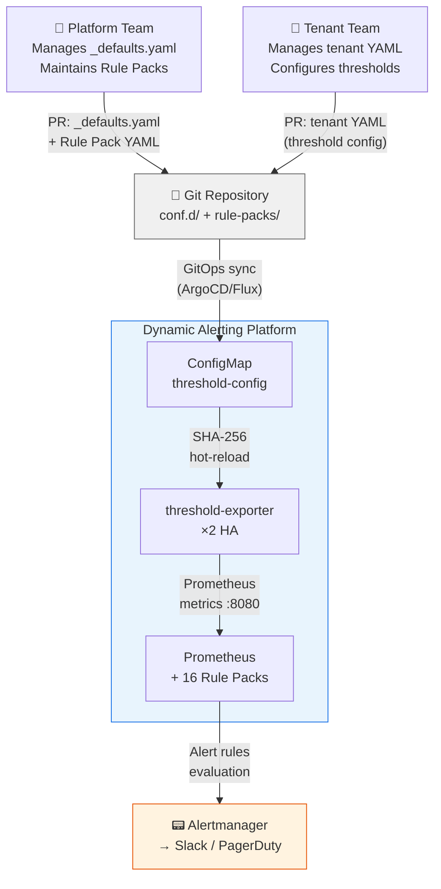
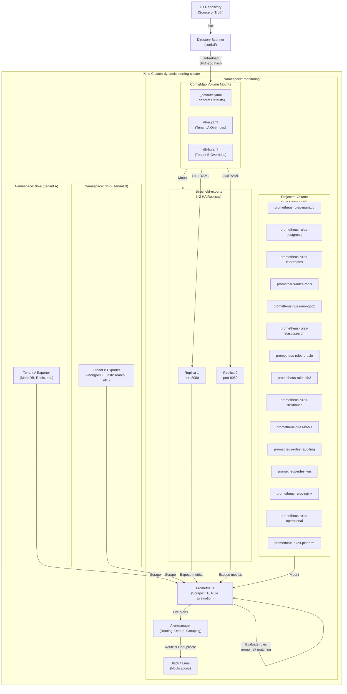

# Architecture and Design — Multi-Tenant Dynamic Alerting Platform Technical Whitepaper

> **Language / 語言：** **English (Current)** | [中文](architecture-and-design.md)

## Introduction

This is the **architecture Hub** for the "Multi-Tenant Dynamic Alerting Platform" — a single page to understand how the system is composed and what each design concept is, then route to the deeper spoke documents. Written at depth for Platform Engineers / SREs; the business-impact column and Design Concepts Overview also let decision-makers assess value quickly.

> 📖 **Unfamiliar term?** (`group_left`, Projected Volume, tri-state, Cardinality Guard, Sentinel Alert, etc.) — check the [Glossary](glossary.en.md) anytime.

**How to read this** (readers switch at any time, and often several read it together):

| You are… | Start with | Drill into |
|---|---|---|
| Decision-maker | Introduction, [Design Concepts Overview](#design-concepts-overview) (business-impact) | [Benchmarks](benchmarks.en.md) |
| New / first-time reader | Introduction, [§1 System Architecture Diagram](#1-system-architecture-diagram) | Design Concepts Overview |
| Platform / SRE | the whole doc + each spoke | — |
| Domain Expert (DBA/Infra) | Design Concepts Overview, Tenant API | [Config-Driven Design](design/config-driven.en.md) |

> **Reading together**: everyone shares **Introduction + §1 System Architecture Diagram** (the full picture anyone can grasp), then drills into the spoke they care about.

**Related documents:**

| Document | Topics | Primary readers |
|------|---------|---------|
| *Design deep-dives (spoke)* | | |
| [Config-Driven Design](design/config-driven.en.md) | Three-state config, Directory Scanner, multi-tier severity, scheduled thresholds, routing, Tenant API, inheritance engine | Platform / SRE / Domain Expert |
| [Rule Packs & Projected Volume](design/rule-packs.en.md) | 16 rule packs, three-part structure, bilingual annotations | Platform / Domain Expert |
| [High Availability (HA)](design/high-availability.en.md) | 2-replica strategy, PDB, rolling update, SLA 99.9%+ | Platform / SRE |
| [Runtime Canary Design](design/runtime-canary.en.md) | End-to-end liveness of the custom-alert compile pipeline, dead-man's-switch, two-layer bad-tenant isolation account (ADR-025 design-readiness) | Platform / SRE |
| [Recipe Would-Fire Preview Design](design/recipe-would-fire-preview.en.md) | see whether a recipe fires in the same modal; compiler+promtool inverted-assert, facade host, synthetic input (#657 P1 design-readiness) | Platform / Domain Expert / SRE |
| [Future Roadmap](design/roadmap-future.en.md) | v2.9.0 delivered + v2.10.0+ exploration | Platform / decision-maker |
| *Topics* | | |
| [Benchmarks](benchmarks.en.md) | Scale / speed / capacity / stability measurements | Platform / SRE / decision-maker |
| [Governance & Security](governance-security.en.md) | Audit, security discipline | Platform / Security |
| [Troubleshooting](troubleshooting.en.md) | Edge cases, diagnostics | Platform / SRE / Tenant |
| [Verified Scenarios](scenarios/verified-scenarios.en.md) | Scenario matrix | Platform / SRE |
| *Onboarding & migration* | | |
| [Migration Engine](migration-engine.en.md) | AST migration of an existing PromRule corpus | Platform / DevOps |
| [Migration Toolkit Install](migration-toolkit-installation.en.md) | Three delivery paths, supply-chain verification | Platform / DevOps |
| [VCS Integration](vcs-integration-guide.md) | GitOps / forge integration | Platform / DevOps |

---

## 1. System Architecture Diagram

### 1.1 C4 Context — System Boundary & Actor Interactions


```mermaid
graph TB
    PT["👤 Platform Team<br/>Manages _defaults.yaml<br/>Maintains Rule Packs"]
    TT["👤 Tenant Team<br/>Manages tenant YAML<br/>Configures thresholds"]
    Git["📂 Git Repository<br/>conf.d/ + rule-packs/"]

    subgraph DAP["Dynamic Alerting Platform"]
        TE["threshold-exporter<br/>×2 HA"]
        PM["Prometheus<br/>+ 16 Rule Packs"]
        CM["ConfigMap<br/>threshold-config"]
    end

    AM["📟 Alertmanager<br/>→ Slack / PagerDuty"]

    PT -->|"PR: _defaults.yaml<br/>+ Rule Pack YAML"| Git
    TT -->|"PR: tenant YAML<br/>(threshold config)"| Git
    Git -->|"GitOps sync<br/>(ArgoCD/Flux)"| CM
    CM -->|"SHA-256<br/>hot-reload"| TE
    TE -->|"Prometheus<br/>metrics :8080"| PM
    PM -->|"Alert rules<br/>evaluation"| AM

    style DAP fill:#e8f4fd,stroke:#1a73e8
    style Git fill:#f0f0f0,stroke:#666
    style AM fill:#fff3e0,stroke:#e65100
```

### 1.2 Internal Architecture


```mermaid
graph TB
    subgraph Cluster["Kind Cluster: dynamic-alerting-cluster"]
        subgraph TenantA["Namespace: db-a (Tenant A)"]
            ExpA["Tenant A Exporter<br/>(MariaDB, Redis, etc.)"]
        end

        subgraph TenantB["Namespace: db-b (Tenant B)"]
            ExpB["Tenant B Exporter<br/>(MongoDB, Elasticsearch, etc.)"]
        end

        subgraph Monitoring["Namespace: monitoring"]
            subgraph Config["ConfigMap Volume Mounts"]
                CfgDefault["_defaults.yaml<br/>(Platform Defaults)"]
                CfgTenantA["db-a.yaml<br/>(Tenant A Overrides)"]
                CfgTenantB["db-b.yaml<br/>(Tenant B Overrides)"]
            end

            subgraph Export["threshold-exporter<br/>(×2 HA Replicas)"]
                TE1["Replica 1<br/>port 8080"]
                TE2["Replica 2<br/>port 8080"]
            end

            subgraph Rules["Projected Volume<br/>Rule Packs (×15)"]
                RP1["prometheus-rules-mariadb"]
                RP2["prometheus-rules-postgresql"]
                RP3["prometheus-rules-kubernetes"]
                RP4["prometheus-rules-redis"]
                RP5["prometheus-rules-mongodb"]
                RP6["prometheus-rules-elasticsearch"]
                RP7["prometheus-rules-oracle"]
                RP8["prometheus-rules-db2"]
                RP9["prometheus-rules-clickhouse"]
                RP10["prometheus-rules-kafka"]
                RP11["prometheus-rules-rabbitmq"]
                RP12["prometheus-rules-jvm"]
                RP13["prometheus-rules-nginx"]
                RP14["prometheus-rules-operational"]
                RP15["prometheus-rules-platform"]
            end

            Prom["Prometheus<br/>(Scrape: TE, Rule Evaluation)"]
            AM["Alertmanager<br/>(Routing, Dedup, Grouping)"]
            Slack["Slack / Email<br/>(Notifications)"]
        end
    end

    Git["Git Repository<br/>(Source of Truth)"]
    Scanner["Directory Scanner<br/>(conf.d/)"]

    Git -->|Pull| Scanner
    Scanner -->|Hot-reload<br/>SHA-256 hash| Config
    Config -->|Mount| Export
    ExpA -->|Scrape| Prom
    ExpB -->|Scrape| Prom
    Config -->|Load YAML| TE1
    Config -->|Load YAML| TE2
    TE1 -->|Expose metrics| Prom
    TE2 -->|Expose metrics| Prom
    Rules -->|Mount| Prom
    Prom -->|Evaluate rules<br/>group_left matching| Prom
    Prom -->|Fire alerts| AM
    AM -->|Route & Deduplicate| Slack
```

**Architecture highlights:**
1. **Directory Scanner** scans the `conf.d/` directory, automatically discovering `_defaults.yaml` and tenant configuration files
2. **threshold-exporter × 2 HA Replicas** read ConfigMap and output three-state Prometheus metrics
3. **Projected Volume** mounts 16 independent rule packs, zero PR conflicts, each team independently owns their rules
4. **Prometheus** uses `group_left` vector matching to join with user thresholds, achieving O(M) complexity (vs traditional O(M×N): fixed M rules vs N×M linear growth)

### 1.3 Customer Migration & GitOps Governance Pipeline (Day-0 / Day-1 / Day-2)

The customer migration pipeline strings together three lifecycle phases — "Day-0 import existing PromRule corpus", "Day-1 GitOps PR splitting & governance", "Day-2 runtime hot-reload" — into an end-to-end flow that runs offline, in air-gapped environments, and with independently-verifiable supply-chain provenance:


```mermaid
graph LR
    subgraph Day0["Day-0: Customer Migration"]
        PR["PromRule corpus<br/>(CRD / YAML)"] -->|da-parser| JSON["Canonical JSON<br/>+ prom_portable flag"]
        JSON -->|Profile Builder library| PB["Profile Builder<br/>(library-only, cluster + median, ADR-018)<br/>CLI not yet shipped (planned)"]
    end

    subgraph Day1["Day-1: GitOps Hierarchy-Aware Governance"]
        PB -->|da-batchpr apply| PR1["Base Infrastructure PR<br/>(_defaults.yaml)"]
        PB -->|da-batchpr apply| PR2["Tenant Override PRs<br/>(&lt;id&gt;.yaml — Blocked by Base)"]
        PR1 -.->|refresh --base-merged| PR2
        PR1 -->|da-guard CI gate| LINT["sticky PR comment<br/>(Schema / Routing / Cardinality / Redundant-override)"]
        PR2 -->|da-guard CI gate| LINT
    end

    subgraph Day2["Day-2: Runtime"]
        LINT -->|Merge| GIT["Git repo (conf.d/)"]
        GIT -->|ArgoCD / Flux| CM["ConfigMap"]
        CM -->|dual-hash hot-reload| TE["threshold-exporter"]
    end

    style Day0 fill:#fff3e0,stroke:#d6b656
    style Day1 fill:#e8f4fd,stroke:#1a73e8
    style Day2 fill:#e8f5e9,stroke:#43a047
```

**Full-lifecycle governance features:**
- **Zero vendor lock-in**: the migration tooling keeps a "still-portable-to-Prom" marker per rule, so customers retain visibility into the subset that can return to Prometheus even after migrating to VictoriaMetrics.
- **GitOps PR ordering is enforced**: the Base PR merges first → tenant override PRs auto-rebase; a parser fix can granularly regenerate patch PRs for specific rules without re-running the whole batch.
- **CI gates report cleanly**: four checks (Schema / Routing / Cardinality / redundant override) post as a sticky PR comment (the same comment updates in place — no spam) + retained artifacts.
- **Three delivery paths**: Docker image / multi-arch static binary / air-gapped tar — every path is cosign-keyless-signed + SBOM (SPDX / CycloneDX); customers verify supply-chain in one command via `make verify-release`.

---

## Design Concepts Overview

> **Why is this architecture worth investing in?** In a typical 50-tenant environment, the Config-Driven architecture reduces rule maintenance from O(N×M) to O(M), saving 40+ engineering hours per month; Severity Dedup combined with tri-state modes suppresses 60%+ alert noise, improving on-call quality of life. (**The 40+ hours / 60%+ are modeled estimates for a 50-tenant scenario, not a single-customer measurement**.)

The table below indexes the **core design concepts** (timeless capabilities, not a per-release delivery list; version history in [§5](#5-roadmap)). Each has a standalone spoke document:

| Design Concept | Business impact | Technical mechanism | Details |
|--------|------|------|------|
| **Config-Driven Architecture** | Zero extra rule cost per new tenant; for rule-pack-covered metrics, onboarding 2 hr → 5 min (migration time for complex/topology metrics: see the [Migration Guide](migration-guide.en.md)) | Three-state config, Directory Scanner, hierarchical `conf.d/` (ADR-016), `_defaults.yaml` L0→L3 inheritance (ADR-017), dual-hash hot-reload | [config-driven.en.md](design/config-driven.en.md) |
| **Inheritance Engine** | Cleaner configs, less duplication, multi-layer default management | `_defaults.yaml` L0→L3 deep merge (ADR-017) + dual-hash (source + merged) precise hot-reload + debounce to absorb ConfigMap symlink rotation; flat and hierarchical `conf.d/` coexist (ADR-016) | [config-driven.en.md](design/config-driven.en.md) |
| **Multi-tier Severity** | Eliminates duplicate notifications; teams see only the highest priority | `_critical` suffix, Severity Dedup, Alertmanager inhibit | [config-driven.en.md](design/config-driven.en.md) |
| **Regex & Scheduled Thresholds** | Auto-widen thresholds off-hours, fewer false night alerts | Regex dimension matching, time-window scheduling (UTC), ResolveAt | [config-driven.en.md](design/config-driven.en.md) |
| **Three-State Operational Modes** | Zero alert noise during maintenance, auto-recovery without forgetting | Normal / Silent / Maintenance + auto-expiry | [config-driven.en.md](design/config-driven.en.md) |
| **Alert Routing** | Multi-channel delivery ensures critical alerts reach the right people | 6 receiver types, Timing Guardrails, Enforced Routing | [config-driven.en.md](design/config-driven.en.md) |
| **Tenant API** | Domain experts self-serve without YAML knowledge | Commit-on-write + RBAC hot-reload + PR write-back + effective-config endpoint (inheritance applied) | [config-driven.en.md](design/config-driven.en.md) |
| **Rule Packs** | Zero PR conflicts for cross-team parallel development | 15 Projected Volumes + three-part structure + bilingual annotations | [rule-packs.en.md](design/rule-packs.en.md) |
| **Customer Migration Pipeline** | Existing PromRule corpus → `conf.d/` fully automated; anti-vendor-lock-in; zero orphan-tenant risk | 5-step migration chain (parse → Profile Builder → Hierarchy-Aware Batch PR → Dangling Defaults Guard). Diagram in [§1.3](#13-customer-migration-gitops-governance-pipeline-day-0-day-1-day-2) | [migration-toolkit-installation.en.md](migration-toolkit-installation.en.md) |
| **Performance Architecture** | 500+ tenant millisecond processing; resource cost barely grows with tenant count | Pre-computed Recording Rules, O(M) complexity, Cardinality Guard | [benchmarks.en.md](benchmarks.en.md) |
| **High Availability (HA)** | SLA 99.9%+ alert reliability, zero-downtime rolling updates | 2 replicas, PDB, `max by(tenant)` prevents double-counting | [high-availability.en.md](design/high-availability.en.md) |
| **Future Roadmap** | Permissions × observability loop × intelligence | Field-level RBAC, Auto-Discovery, DaC, Anomaly-Aware Threshold | [roadmap-future.en.md](design/roadmap-future.en.md) |

---

## 2. Core Design: Config-Driven Architecture

Config-Driven is the platform core: tenants and the platform only edit YAML, never write PromQL — built from three-state config + Directory Scanner + hierarchical inheritance + vector-matching rules. Topics group into four areas (full reference in [config-driven.en.md](design/config-driven.en.md)):

- **Config & inheritance**: three-state logic (custom value / omitted = default / disable), `conf.d/` Directory Scanner + SHA-256 hot-reload + incremental reload, `_defaults.yaml` L0→L3 inheritance, tenant↔namespace mapping (1:1 / N:1 / 1:N).
- **Alert semantics**: multi-tier severity (`_critical` suffix, `"value:severity"` syntax), regex dimension thresholds (`=~`), scheduled thresholds (UTC time windows, cross-midnight), three-state operational modes (Normal / Silent / Maintenance + Sentinel Alert).
- **Routing**: 6 receiver types (Webhook / Email / Slack / Teams / RocketChat / PagerDuty) + Timing Guardrails, Severity Dedup (Alertmanager inhibit), per-rule routing overrides, platform-enforced routing (NOC mandatory), Routing Profiles & domain policies (ADR-007).
- **Performance & self-service**: Pre-computed Recording Rules, O(M) complexity, Cardinality Guard, Tenant API (commit-on-write + RBAC hot-reload + Portal graceful degradation).

---

## 3. Projected Volume Architecture (Rule Packs) — Overview

The platform manages **16 independent rule packs** with **139 Recording Rules + 99 Alert Rules**. Each Rule Pack is a self-contained three-part structure:

1. **Part 1: Normalization Recording Rules** — normalize raw metrics from different exporters
2. **Part 2: Threshold Normalization** — produces `tenant:alert_threshold:*` metrics for Alert Rule matching
3. **Part 3: Alert Rules** — actual alert conditions (with bilingual annotations)

**Advantages:** zero PR conflicts, team autonomy, reusable, independently testable. **Complete reference** in [rule-packs.en.md](design/rule-packs.en.md).

---

> 💡 **Interactive Tools**
>
> **Capacity Planning, Dependency Analysis & Validation**:
>
> - [Capacity Planner](https://vencil.github.io/Dynamic-Alerting-Integrations/assets/jsx-loader.html?component=../interactive/tools/capacity-planner.jsx) — Estimate cluster resource requirements (cardinality, replicas, memory)
> - [Dependency Graph](https://vencil.github.io/Dynamic-Alerting-Integrations/assets/jsx-loader.html?component=../interactive/tools/dependency-graph.jsx) — Visualize Rule Pack and recording rule dependencies
> - [PromQL Tester](https://vencil.github.io/Dynamic-Alerting-Integrations/assets/jsx-loader.html?component=../interactive/tools/promql-tester.jsx) — Test and validate PromQL queries
>
> See [Interactive Tools Hub](https://vencil.github.io/Dynamic-Alerting-Integrations/) for more tools

---

## 4. High Availability Design

threshold-exporter uses a 2-replica + PodAntiAffinity + PodDisruptionBudget strategy, ensuring zero-downtime rolling updates and always keeping 1 replica serving Prometheus scrapes during maintenance. Recording rules use `max by(tenant)` to prevent HA double-counting.

### 4.1 Deployment Strategy

```yaml
replicas: 2
strategy:
  type: RollingUpdate
  rollingUpdate:
    maxUnavailable: 0    # Zero-downtime rolling update
    maxSurge: 1

affinity:
  podAntiAffinity:
    preferredDuringSchedulingIgnoredDuringExecution:
      - weight: 100
        podAffinityTerm:
          topologyKey: kubernetes.io/hostname
```

**Features:**
- 2 replicas spread across different nodes
- During rolling update, always 1 replica available
- Kind single-node cluster: soft affinity allows bin-packing

### 4.2 Pod Disruption Budget

```yaml
apiVersion: policy/v1
kind: PodDisruptionBudget
metadata:
  name: threshold-exporter-pdb
spec:
  minAvailable: 1
  selector:
    matchLabels:
      app: threshold-exporter
```

**Guarantee:** Always 1 replica serving Prometheus scrapes, even during active maintenance

**Complete deployment YAML & SLA analysis** in [high-availability.en.md](design/high-availability.en.md)

---

## 5. Roadmap

> Version history (what each of v2.7.0 → v2.9.0 delivered) is in the [CHANGELOG](https://github.com/vencil/Dynamic-Alerting-Integrations/blob/main/CHANGELOG.md); this section is forward-looking only.

**Current (the capability backbone delivered in v2.9.0)**: tenant self-service alerting (Custom Alerts — 6 platform-authored recipes, no PromQL) + Tenant Federation (read-path proxy + 2-tier policy + key rotation + offboarding) + write-plane single-writer resilience + platform log aggregation.

**v2.10.0 in planning**: tenant federation deepening × reactive hardening continuation. Directions in the live milestone [v2.10.0](https://github.com/vencil/Dynamic-Alerting-Integrations/milestone/3).

**Long-term exploration**:

- **Intelligence**: Anomaly-Aware Threshold, Log-to-Metric Bridge.
- **Decoupling & integration**: Multi-Format Export, CRD, ChatOps.
- **Fine-grained permissions**: Field-level RBAC, Tenant Auto-Discovery.
- **Deep water (defer-with-trigger)**: write-path QoS lanes, the observer effect of reconciliation, a PromQL sandbox — acted on only when trigger conditions are met, to avoid premature investment.

**Complete roadmap** in [roadmap-future.en.md](design/roadmap-future.en.md).

---

## 6. ADR Index (Architecture Decision Records)

> Per ZH-primary SSOT policy, the live ADR index table is rendered into [`architecture-and-design.md`](architecture-and-design.md#6-adr-索引-architecture-decision-records) by `scripts/dx/generate_adr_index.py`. ADR source files live in [`docs/adr/`](adr/); each ADR has an `.en.md` sibling for the English translation.

ADR file naming: `NNN-kebab-case.md` (ZH) + `NNN-kebab-case.en.md` (EN). Status is recorded in each ADR's `## Status` (`## 狀態` in ZH) section. To refresh the auto-rendered table after editing an ADR, run `make adr-index`; CI / pre-commit `adr-index-check` blocks merges with stale tables.

---

## Appendix A: Role & Tool Quick Reference

> See [CLI Reference](cli-reference.md) for detailed tool usage.
