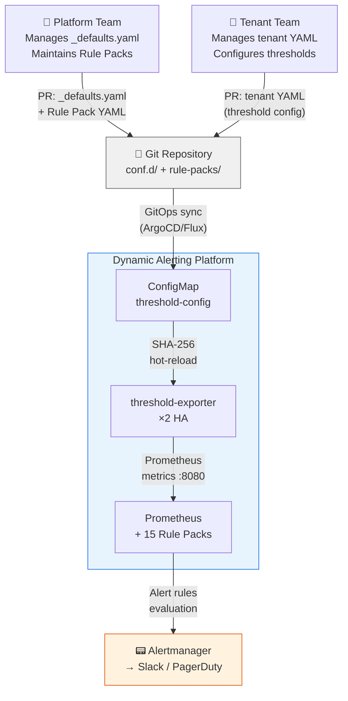
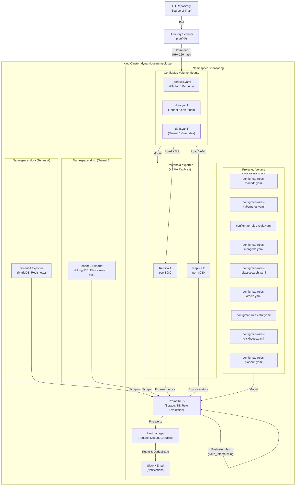
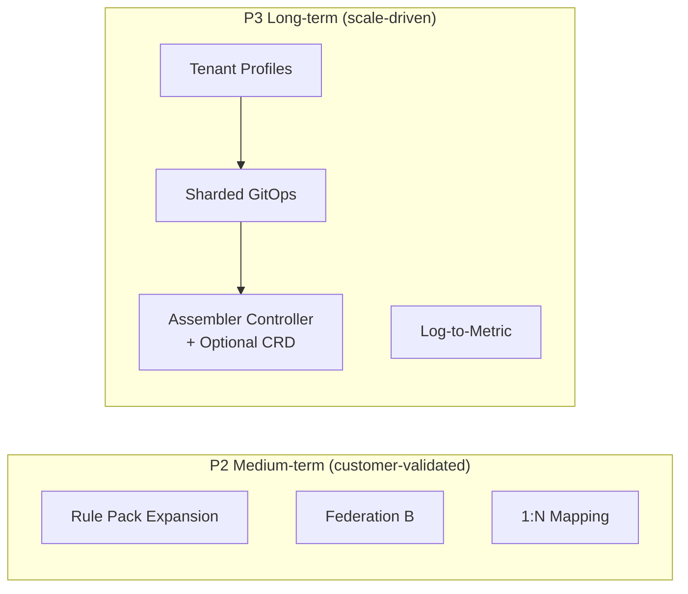
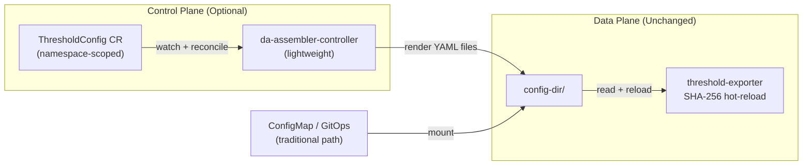

# Architecture and Design — Multi-Tenant Dynamic Alerting Platform Technical Whitepaper

> **Language / 語言：** **English (Current)** | [中文](architecture-and-design.md)

## Introduction

This document provides Platform Engineers and Site Reliability Engineers (SREs) with an in-depth exploration of the technical architecture of the "Multi-Tenant Dynamic Alerting Platform" .

**This document covers:**
- System architecture and core design principles (including Regex dimension thresholds, scheduled thresholds)
- Config-driven configuration workflow
- Governance model for Projected Volume and 15 Rule Packs
- High availability (HA) design
- Future roadmap

**Standalone topic documents:**
- **Benchmarks** → [benchmarks.en.md](benchmarks.en.md)
- **Governance & Security** → [governance-security.en.md](governance-security.en.md)
- **Troubleshooting** → [troubleshooting.en.md](troubleshooting.en.md)
- **Advanced Scenarios** → [scenarios/advanced-scenarios.en.md](scenarios/advanced-scenarios.en.md)
- **Migration Engine** → [migration-engine.en.md](migration-engine.en.md)

**Related documentation:**
- **Quick Start** → [README.en.md](../README.en.md)
- **Migration Guide** → [migration-guide.md](migration-guide.md)
- **Rule Packs Documentation** → [rule-packs/README.md](../rule-packs/README.md)
- **threshold-exporter Component** → [components/threshold-exporter/README.md](../components/threshold-exporter/README.md)

---

## 1. System Architecture Diagram

### 1.1 C4 Context — System Boundary & Actor Interactions


```mermaid
graph TB
    PT["👤 Platform Team<br/>Manages _defaults.yaml<br/>Maintains Rule Packs"]
    TT["👤 Tenant Team<br/>Manages tenant YAML<br/>Configures thresholds"]
    Git["📂 Git Repository<br/>conf.d/ + rule-packs/"]

    subgraph DAP["Dynamic Alerting Platform"]
        TE["threshold-exporter<br/>×2 HA"]
        PM["Prometheus<br/>+ 15 Rule Packs"]
        CM["ConfigMap<br/>threshold-config"]
    end

    AM["📟 Alertmanager<br/>→ Slack / PagerDuty"]

    PT -->|"PR: _defaults.yaml<br/>+ Rule Pack YAML"| Git
    TT -->|"PR: tenant YAML<br/>(threshold config)"| Git
    Git -->|"GitOps sync<br/>(ArgoCD/Flux)"| CM
    CM -->|"SHA-256<br/>hot-reload"| TE
    TE -->|"Prometheus<br/>metrics :8080"| PM
    PM -->|"Alert rules<br/>evaluation"| AM

    style DAP fill:#e8f4fd,stroke:#1a73e8
    style Git fill:#f0f0f0,stroke:#666
    style AM fill:#fff3e0,stroke:#e65100
```

### 1.2 Internal Architecture


```mermaid
graph TB
    subgraph Cluster["Kind Cluster: dynamic-alerting-cluster"]
        subgraph TenantA["Namespace: db-a (Tenant A)"]
            ExpA["Tenant A Exporter<br/>(MariaDB, Redis, etc.)"]
        end

        subgraph TenantB["Namespace: db-b (Tenant B)"]
            ExpB["Tenant B Exporter<br/>(MongoDB, Elasticsearch, etc.)"]
        end

        subgraph Monitoring["Namespace: monitoring"]
            subgraph Config["ConfigMap Volume Mounts"]
                CfgDefault["_defaults.yaml<br/>(Platform Defaults)"]
                CfgTenantA["db-a.yaml<br/>(Tenant A Overrides)"]
                CfgTenantB["db-b.yaml<br/>(Tenant B Overrides)"]
            end

            subgraph Export["threshold-exporter<br/>(×2 HA Replicas)"]
                TE1["Replica 1<br/>port 8080"]
                TE2["Replica 2<br/>port 8080"]
            end

            subgraph Rules["Projected Volume<br/>Rule Packs (×15)"]
                RP1["configmap-rules-mariadb.yaml"]
                RP2["configmap-rules-kubernetes.yaml"]
                RP3["configmap-rules-redis.yaml"]
                RP4["configmap-rules-mongodb.yaml"]
                RP5["configmap-rules-elasticsearch.yaml"]
                RP7["configmap-rules-oracle.yaml"]
                RP8["configmap-rules-db2.yaml"]
                RP9["configmap-rules-clickhouse.yaml"]
                RP6["configmap-rules-platform.yaml"]
            end

            Prom["Prometheus<br/>(Scrape: TE, Rule Evaluation)"]
            AM["Alertmanager<br/>(Routing, Dedup, Grouping)"]
            Slack["Slack / Email<br/>(Notifications)"]
        end
    end

    Git["Git Repository<br/>(Source of Truth)"]
    Scanner["Directory Scanner<br/>(conf.d/)"]

    Git -->|Pull| Scanner
    Scanner -->|Hot-reload<br/>SHA-256 hash| Config
    Config -->|Mount| Export
    ExpA -->|Scrape| Prom
    ExpB -->|Scrape| Prom
    Config -->|Load YAML| TE1
    Config -->|Load YAML| TE2
    TE1 -->|Expose metrics| Prom
    TE2 -->|Expose metrics| Prom
    Rules -->|Mount| Prom
    Prom -->|Evaluate rules<br/>group_left matching| Prom
    Prom -->|Fire alerts| AM
    AM -->|Route & Deduplicate| Slack
```

**Architecture highlights:**
1. **Directory Scanner** scans the `conf.d/` directory, automatically discovering `_defaults.yaml` and tenant configuration files
2. **threshold-exporter × 2 HA Replicas** read ConfigMap and output three-state Prometheus metrics
3. **Projected Volume** mounts 15 independent rule packs, zero PR conflicts, each team independently owns their rules
4. **Prometheus** uses `group_left` vector matching to join with user thresholds, achieving O(M) complexity

---

## 2. Core Design: Config-Driven Architecture

### 2.1 Three-State Logic

The platform supports a "three-state" configuration pattern, providing flexible default values, overrides, and disable mechanisms:

| State | Configuration | Prometheus Output | Description |
|-------|---------------|-------------------|-------------|
| **Custom Value** | `metric_key: 42` | ✓ Output custom threshold | Tenant override of default |
| **Omitted (Default)** | Not specified in YAML | ✓ Output platform default | Uses `_defaults.yaml` |
| **Disable** | `metric_key: "disable"` | ✗ No output | Completely disable metric |

**Prometheus output example:**

```
# Custom value (db-a tenant)
user_threshold{tenant="db-a", metric="mariadb_replication_lag", severity="warning"} 10

# Default value (db-b tenant, not overridden)
user_threshold{tenant="db-b", metric="mariadb_replication_lag", severity="warning"} 30

# Disabled (no output)
# (metric not present)
```

### 2.2 Directory Scanner Mode (conf.d/)

**Directory structure:**
```
conf.d/
├── _defaults.yaml         # Platform global defaults (managed by Platform team)
├── db-a.yaml             # Tenant A overrides (managed by db-a team)
├── db-b.yaml             # Tenant B overrides (managed by db-b team)
└── ...
```

**`_defaults.yaml` content (Platform managed):**
```yaml
defaults:
  mysql_connections: 80
  mysql_cpu: 80
  mysql_slave_lag: 30
  container_cpu: 80
  container_memory: 85

state_filters:
  container_crashloop:
    reasons: ["CrashLoopBackOff"]
    severity: "critical"
  maintenance:
    reasons: []
    severity: "info"
    default_state: "disable"
```

**`db-a.yaml` content (Tenant override):**
```yaml
tenants:
  db-a:
    mysql_connections: "70"          # Override default 80
    container_cpu: "70"              # Override default 80
    mysql_slave_lag: "disable"       # No replica, disable
    # mysql_cpu not specified → use default value 80
    # Dimensional labels
    "redis_queue_length{queue='tasks'}": "500"
    "redis_queue_length{queue='events', priority='high'}": "1000:critical"
```

#### Boundary Enforcement Rules

| File Type | Allowed Blocks | Violation Behavior |
|-----------|----------------|-------------------|
| Files with `_` prefix (`_defaults.yaml`) | `defaults`, `state_filters`, `tenants` | — |
| Tenant files (`db-a.yaml`) | Only `tenants` | Other blocks automatically ignored + WARN log |

#### SHA-256 Hot-Reload

Does not rely on file modification time (ModTime), but rather on **SHA-256 content hash**:

```bash
# On each ConfigMap update
$ sha256sum conf.d/_defaults.yaml conf.d/db-a.yaml conf.d/db-b.yaml
abc123... conf.d/_defaults.yaml
def456... conf.d/db-a.yaml
ghi789... conf.d/db-b.yaml

# Kubernetes ConfigMap symlink mounted will rotate
# Old hash → new hash
# threshold-exporter detects change, reloads configuration
```

**Why SHA-256 instead of ModTime?**
- Kubernetes ConfigMap creates a symlink layer, ModTime is unreliable
- Same content = same hash, avoid unnecessary reloads

### 2.3 Multi-tier Severity

Support both `_critical` suffix and `"value:severity"` syntax:

**Method 1: `_critical` suffix (suitable for basic thresholds)**
```yaml
tenants:
  db-a:
    mysql_connections: "100"            # warning threshold
    mysql_connections_critical: "150"   # _critical → auto-generate critical alert
```

**Method 2: `"value:severity"` syntax (suitable for dimensional labels)**
```yaml
tenants:
  redis-prod:
    "redis_queue_length{queue='orders'}": "500:critical"
```

**Prometheus output:**
```
user_threshold{tenant="db-a", component="mysql", metric="connections", severity="warning"} 100
user_threshold{tenant="db-a", component="mysql", metric="connections", severity="critical"} 150
```

#### Auto-Suppression

Platform Alert Rules use `unless` logic to auto-suppress warning when critical triggers:

```yaml
- alert: MariaDBHighConnections          # warning
  expr: |
    ( tenant:mysql_threads_connected:max > on(tenant) group_left tenant:alert_threshold:connections )
    unless on(tenant) (user_state_filter{filter="maintenance"} == 1)
    unless on(tenant)                    # ← Auto-Suppression: suppress warning when critical fires
    ( tenant:mysql_threads_connected:max > on(tenant) group_left tenant:alert_threshold:connections_critical )
- alert: MariaDBHighConnectionsCritical  # critical
  expr: |
    ( tenant:mysql_threads_connected:max > on(tenant) group_left tenant:alert_threshold:connections_critical )
    unless on(tenant) (user_state_filter{filter="maintenance"} == 1)
```

**Result:** (dual `unless` logic)
- Connection count ≥ 150 (critical): warning suppressed by second `unless`, only critical alert fires
- Connection count 100–150 (warning only): second `unless` does not match, warning alert fires normally

### 2.4 Regex Dimension Thresholds

Since v0.12.0, the config parser supports the `=~` operator, enabling regex-based fine-grained matching on dimension labels. This design allows thresholds to target specific dimension subsets without introducing external data dependencies.

**Configuration syntax:**
```yaml
tenants:
  db-a:
    # Exact match
    "oracle_tablespace_used_percent{tablespace='USERS'}": "85"
    # Regex match: all tablespaces starting with SYS
    "oracle_tablespace_used_percent{tablespace=~'SYS.*'}": "95"
```

**Implementation path:**

1. **Exporter layer**: Config parser detects the `=~` operator and outputs the regex pattern as a `_re` suffixed label
   ```
   user_threshold{tenant="db-a", metric="oracle_tablespace_used_percent",
                  tablespace_re="SYS.*", severity="warning"} 95
   ```
2. **Recording rule layer**: PromQL uses `label_replace` + `=~` for actual matching at query time
3. **Design principle**: The exporter remains a pure config→metric converter; matching logic is entirely handled by Prometheus native vector operations

### 2.5 Scheduled Thresholds

Since v0.12.0, thresholds support time-window scheduling, allowing automatic threshold switching across different time periods. Typical use cases: relaxed thresholds during nighttime maintenance windows, tightened thresholds during peak hours.

**Configuration syntax:**
```yaml
tenants:
  db-a:
    mysql_connections:
      default: "100"
      overrides:
        - window: "22:00-06:00"    # UTC nighttime window (cross-midnight supported)
          value: "200"             # Nighttime batch jobs, relax to 200
        - window: "09:00-18:00"
          value: "80"              # Daytime peak, tighten to 80
```

**Technical implementation:**

- **`ScheduledValue` custom YAML type**: Supports dual-format parsing — scalar strings (backward compatible) and structured `{default, overrides[{window, value}]}`
- **`ResolveAt(now time.Time)`**: Resolves the applicable threshold based on current UTC time, ensuring determinism and testability
- **Time window format**: `HH:MM-HH:MM` (UTC), cross-midnight support (e.g., `22:00-06:00` means 10 PM to 6 AM next day)
- **45 test cases**: Covering boundary conditions — window overlap, cross-midnight, scalar fallback, empty overrides

### 2.7 Three-State Operational Modes

v1.2.0 introduced **Silent Mode**, which together with the existing Maintenance Mode forms a three-state operational model, solving the problem of "users mistaking Maintenance Mode for muting."

**Behavior Matrix**

| Operational State | Semantics | Alert Triggered | TSDB Record | Notification | Control Layer |
|-------------------|-----------|-----------------|-------------|--------------|---|
| Normal | Normal operation | ✅ | ✅ | ✅ | — |
| Silent | Muted | ✅ | ✅ | ❌ | Alertmanager |
| Maintenance | True maintenance | ❌ | ❌ | ❌ | Prometheus (PromQL) |

**Design principle:** Prometheus controls "what should trigger an alert," Alertmanager controls "whether to send notification."

- **Maintenance Mode** (existing): Eliminates alerts at the PromQL layer via `unless on(tenant) (user_state_filter{filter="maintenance"} == 1)`. Alert does not fire, TSDB has no record, no notification.
- **Silent Mode** : Alert fires normally in Prometheus (TSDB records `ALERTS`), but Alertmanager intercepts notifications via `inhibit_rules`.

**Silent Mode Data Flow**

```
tenant YAML: _silent_mode: "warning"
    ↓
threshold-exporter: user_silent_mode{tenant="db-a", target_severity="warning"} 1
    ↓
Prometheus alert rule (rule-pack-operational.yaml):
    TenantSilentWarning{tenant="db-a"} fires
    ↓
Alertmanager inhibit_rules:
    source: alertname="TenantSilentWarning"
    target: severity="warning", equal: ["tenant"]
    ↓
Result: db-a warning alerts fire normally (TSDB record exists), but notifications are intercepted
```

**Tenant Configuration**

```yaml
tenants:
  db-a:
    _silent_mode: "warning"    # Mute warning notifications only
  db-b:
    _silent_mode: "all"        # Mute both warning and critical notifications
  db-c:
    _state_maintenance: "enable"  # True maintenance, alert completely suppressed
  db-d: {}                        # Normal — default behavior
```

Available `_silent_mode` values: `warning`, `critical`, `all`, `disable`. Unset defaults to Normal mode.

**Auto-Expiry :** `_silent_mode` and `_state_maintenance` support structured objects (backward compatible with scalar strings) with `expires` ISO8601 timestamp. The Go engine checks `time.Now().After(expires)` to stop emitting sentinel metrics, automatically restoring alerts to normal. Expiry generates a transient gauge `da_config_event{event="silence_expired"}` with `TenantConfigEvent` alert rule for notification.

```yaml
tenants:
  db-a:
    _silent_mode:
      target: "all"
      expires: "2026-04-01T00:00:00Z"
      reason: "Migration shadow monitoring period"
    _state_maintenance:
      target: "all"
      expires: "2026-04-01T00:00:00Z"
      reason: "Scheduled maintenance window"
```

**Alertmanager inhibit_rules Template**

```yaml
inhibit_rules:
  # Severity Dedup: per-tenant inhibit rules (generated by generate_alertmanager_routes.py)
  # Only tenants with _severity_dedup: "enable" (default) generate rules
  # Tenants with _severity_dedup: "disable" have no corresponding rules → receive both notifications
  - source_matchers:
      - severity="critical"
      - metric_group=~".+"
      - tenant="db-a"
    target_matchers:
      - severity="warning"
      - metric_group=~".+"
      - tenant="db-a"
    equal: ["metric_group"]

  # Silent Mode: suppress warning notifications
  - source_matchers:
      - alertname="TenantSilentWarning"
    target_matchers:
      - severity="warning"
    equal: ["tenant"]

  # Silent Mode: suppress critical notifications
  - source_matchers:
      - alertname="TenantSilentCritical"
    target_matchers:
      - severity="critical"
    equal: ["tenant"]
```

### 2.8 Severity Dedup

v1.2.0 introduced **Severity Dedup** to resolve the issue of "TSDB records for warning being eliminated when critical fires."

**Design change:** Auto-suppression moved from the PromQL layer (`unless critical`) to the Alertmanager layer (`inhibit_rules`). TSDB always records both warning and critical simultaneously; dedup only controls notification behavior.

**Per-Tenant Control Mechanism**

v1.2.0 implements per-tenant inhibit rules for optional configuration:

1. `generate_alertmanager_routes.py` scans all tenant YAML files for `_severity_dedup` setting
2. For each tenant with dedup enabled, generates a dedicated inhibit rule (with `tenant="<name>"` matcher)
3. Tenants with `_severity_dedup: "disable"` generate no rule → receive both notifications
4. Exporter still outputs `user_severity_dedup{tenant, mode}` metric → Prometheus sentinel `TenantSeverityDedupEnabled` for Grafana panels to display each tenant's dedup status

**Behavior Matrix**

| Setting | TSDB warning | TSDB critical | Warning Notification | Critical Notification |
|---------|------------|--------------|---------------------|---------------------|
| `_severity_dedup: "enable"` (default) | ✅ | ✅ | ❌ Intercepted by AM | ✅ |
| `_severity_dedup: "disable"` | ✅ | ✅ | ✅ | ✅ |

**Pairing Mechanism:** The `metric_group` label in alert rules allows Alertmanager to correctly pair warning/critical (since they have different alertnames). For example, `MariaDBHighConnections` and `MariaDBHighConnectionsCritical` share `metric_group: "connections"`. Each per-tenant inhibit rule limits `metric_group=~".+"` to ensure alerts without `metric_group` (like `MariaDBDown`) do not participate in dedup.

**Tenant Configuration**

```yaml
tenants:
  db-a: {}                                # Default enable — warning suppressed
  db-b:
    _severity_dedup: "disable"           # Receive both notifications
```

**Generated Alertmanager Configuration**

```bash
python3 scripts/tools/generate_alertmanager_routes.py --config-dir conf.d/ --dry-run
# Output includes per-tenant inhibit_rules section, merged into Alertmanager config
```

### 2.9 Alert Routing (Config-Driven Routing)

Tenants can manage notification destinations, grouping strategies, and timing controls via the `_routing` section. The platform tool `generate_alertmanager_routes.py` reads all tenant YAML files and generates Alertmanager route + receiver + inhibit_rules YAML fragment.

> supports six receiver types: webhook / email / slack / teams / rocketchat / pagerduty. Receivers are structured objects (`{type, ...fields}`), validated by `generate_alertmanager_routes.py` for required fields and corresponding Alertmanager config generation.

**Schema**

```yaml
tenants:
  db-a:
    _routing:
      receiver:                                         # required — structured object
        type: "webhook"                                 #   type: webhook/email/slack/teams/rocketchat/pagerduty
        url: "https://webhook.db-a.svc/alerts"
      group_by: ["alertname", "severity"]               # optional
      group_wait: "30s"                                  # optional, guardrail 5s–5m
      group_interval: "1m"                               # optional, guardrail 5s–5m
      repeat_interval: "4h"                              # optional, guardrail 1m–72h
      overrides: []                                      # optional, per-rule routing (§2.10)
```

**Timing Guardrails**

The platform enforces strict bounds on timing parameters; values outside limits are clamped and logged as WARN:

| Parameter | Minimum | Maximum | Default |
|-----------|---------|---------|---------|
| `group_wait` | 5s | 5m | 30s |
| `group_interval` | 5s | 5m | 5m |
| `repeat_interval` | 1m | 72h | 4h |

**Interaction with Silent Mode**

Silent Mode naturally bypasses routing: Alertmanager's `inhibit_rules` intercept notifications before route evaluation. Therefore, even if a tenant configures custom routing, silent alerts will not send notifications.

**Tool Chain**

```bash
# Preview mode
python3 scripts/tools/generate_alertmanager_routes.py \
  --config-dir conf.d/ --dry-run

# Generate fragment + CI validation
python3 scripts/tools/generate_alertmanager_routes.py \
  --config-dir conf.d/ -o alertmanager-routes.yaml --validate \
  --policy .github/custom-rule-policy.yaml

# All-in-one merge into Alertmanager ConfigMap + reload
python3 scripts/tools/generate_alertmanager_routes.py \
  --config-dir conf.d/ --apply --yes
```

`--validate` checks YAML validity + webhook domain allowlist (exit 0/1 for CI consumption). `--apply` directly merges fragment into Alertmanager ConfigMap and triggers reload. Output supports six receiver types: webhook, email, slack, teams, rocketchat, pagerduty.

### 2.10 Per-rule Routing Overrides 

Per-rule Routing Overrides allow tenants to route specific alerts or metric groups to different receivers (e.g., DBA-critical alerts to PagerDuty, everything else to Slack).

**YAML example:**

```yaml
tenants:
  db-a:
    _routing:
      receiver:
        type: slack
        api_url: "https://hooks.slack.com/services/..."
      overrides:
        - alertname: "MariaDBReplicationLag"
          receiver:
            type: pagerduty
            service_key: "abc123"
        - metric_group: "redis"
          receiver:
            type: webhook
            url: "https://oncall.example.com/redis"
```

**Design rules:**

- Each override must specify exactly one of `alertname` or `metric_group` (not both)
- Override receivers use the same `build_receiver_config()` validation and domain allowlist checks
- `expand_routing_overrides()` generates sub-routes inserted before the tenant's main route, ensuring Alertmanager matches overrides first
- Timing parameters (`group_wait`, `group_interval`, `repeat_interval`) can be overridden per-rule, subject to the same platform guardrails

### 2.11 Platform Enforced Routing 

Platform Team can configure `_routing_enforced` in `_defaults.yaml` to insert platform routing before all tenant routes (with `continue: true`), enabling dual-channel notifications where "NOC always receives + tenant also receives":

```yaml
# _defaults.yaml — Mode A: unified NOC receiver
_routing_enforced:
  enabled: true
  receiver:
    type: "webhook"
    url: "https://noc.example.com/alerts"
  match:
    severity: "critical"    # Only critical alerts sent to NOC
```

**Per-tenant Enforced Channel :** If the receiver field includes `{{tenant}}`, the system automatically creates independent enforced routes for each tenant, allowing Platform to establish per-tenant notification channels that tenants cannot refuse or override:

```yaml
# _defaults.yaml — Mode B: per-tenant independent channels
_routing_enforced:
  enabled: true
  receiver:
    type: "slack"
    api_url: "https://hooks.slack.com/services/T/B/x"
    channel: "#alerts-{{tenant}}"    # → #alerts-db-a, #alerts-db-b, ...
```

`generate_alertmanager_routes.py` inserts platform route before tenant routes. Mode A generates a single shared route; Mode B generates N per-tenant routes (each with `tenant="<name>"` matcher + `continue: true`). Disabled by default; Platform Team enables as needed. See [BYO Alertmanager Integration Guide §8](byo-alertmanager-integration.md#8-platform-enforced-routingv170).

---

## 3. Projected Volume Architecture (Rule Packs)

### 3.1 Twelve Independent Rule Packs

| Rule Pack | Owning Team | ConfigMap Name | Recording Rules | Alert Rules |
|-----------|------------|-----------------|----------------|-------------|
| MariaDB | DBA | `configmap-rules-mariadb` | 7 | 8 |
| Kubernetes | Infra | `configmap-rules-kubernetes` | 5 | 4 |
| Redis | Cache | `configmap-rules-redis` | 7 | 6 |
| MongoDB | AppData | `configmap-rules-mongodb` | 7 | 6 |
| Elasticsearch | Search | `configmap-rules-elasticsearch` | 7 | 7 |
| Oracle | DBA / Oracle | `configmap-rules-oracle` | 6 | 7 |
| DB2 | DBA / DB2 | `configmap-rules-db2` | 7 | 7 |
| ClickHouse | Analytics | `configmap-rules-clickhouse` | 7 | 7 |
| Platform | Platform | `configmap-rules-platform` | 0 | 4 |
| **Total** | | | **53** | **56** |

### 3.2 Self-Contained Three-Part Structure

Each Rule Pack contains three separate and reusable parts:

#### Part 1: Normalization Recording Rules
```yaml
groups:
  - name: mariadb-normalization
    rules:
      # Normalization naming: tenant:<component>_<metric>:<function>
      - record: tenant:mysql_threads_connected:max
        expr: max by(tenant) (mysql_global_status_threads_connected)

      - record: tenant:mysql_slow_queries:rate5m
        expr: sum by(tenant) (rate(mysql_global_status_slow_queries[5m]))
```

**Purpose:** Normalize raw metrics from different exporters into unified namespace `tenant:<metric>:<function>`

#### Part 2: Threshold Normalization
```yaml
groups:
  - name: mariadb-threshold-normalization
    rules:
      - record: tenant:alert_threshold:connections
        expr: max by(tenant) (user_threshold{metric="connections", severity="warning"})

      - record: tenant:alert_threshold:connections_critical
        expr: max by(tenant) (user_threshold{metric="connections", severity="critical"})
```

**Key:** Use `max by(tenant)` rather than `sum` to prevent HA double-counting (see section 4.3)

#### Part 3: Alert Rules
```yaml
groups:
  - name: mariadb-alerts
    rules:
      - alert: MariaDBHighConnections
        expr: |
          (
            tenant:mysql_threads_connected:max
            > on(tenant) group_left
            tenant:alert_threshold:connections
          )
          unless on(tenant) (user_state_filter{filter="maintenance"} == 1)
        for: 5m
        labels:
          severity: warning
        annotations:
          summary: "MariaDB connections {{ $value }} exceeds threshold ({{ $labels.tenant }})"
```

### 3.3 Advantages

1. **Zero PR Conflicts** — Each ConfigMap is independent, different teams can push in parallel
2. **Team Autonomy** — DBAs own MariaDB rules, no central platform review needed
3. **Reusable** — Rules can easily be ported to other Prometheus clusters
4. **Independent Testing** — Each pack can be validated and released independently

---

## Extracted Topic Documents

The following sections have been extracted into standalone documents for focused, role-based reading:

| Section | Standalone Document | Audience |
|---------|-------------------|----------|
| §4 Performance Analysis & Benchmarks | [benchmarks.en.md](benchmarks.en.md) | Platform Engineers, SREs |
| §6–§7 Governance, Audit & Security | [governance-security.en.md](governance-security.en.md) | Platform Engineers, Security & Compliance |
| §8 Troubleshooting & Edge Cases | [troubleshooting.en.md](troubleshooting.en.md) | Platform Engineers, SREs, Tenants |
| §9 Advanced Scenarios & Test Coverage | [scenarios/advanced-scenarios.en.md](scenarios/advanced-scenarios.en.md) | Platform Engineers, SREs |
| §10 AST Migration Engine | [migration-engine.en.md](migration-engine.en.md) | Platform Engineers, DevOps |

---

## 4. High Availability Design

### 4.1 Deployment Strategy

```yaml
replicas: 2
strategy:
  type: RollingUpdate
  rollingUpdate:
    maxUnavailable: 0    # Zero-downtime rolling update
    maxSurge: 1

affinity:
  podAntiAffinity:
    preferredDuringSchedulingIgnoredDuringExecution:
      - weight: 100
        podAffinityTerm:
          topologyKey: kubernetes.io/hostname
```

**Features:**
- 2 replicas spread across different nodes
- During rolling update, always 1 replica available
- Kind single-node cluster: soft affinity allows bin-packing

### 4.2 Pod Disruption Budget

```yaml
apiVersion: policy/v1
kind: PodDisruptionBudget
metadata:
  name: threshold-exporter-pdb
spec:
  minAvailable: 1
  selector:
    matchLabels:
      app: threshold-exporter
```

**Guarantee:** Always 1 replica serving Prometheus scrapes, even during active maintenance

### 4.3 Critical: `max by(tenant)` vs `sum`

#### ❌ Wrong: Using `sum`
```yaml
- record: tenant:alert_threshold:connections
  expr: |
    sum by(tenant)
      user_threshold{tenant=~".*", metric="connections"}
```

**Problem:**
- Prometheus scrapes the same metric from two replicas → double value
- `sum by(tenant)` adds values from both replicas → **threshold doubled**
- Alerts fire incorrectly

#### ✓ Correct: Using `max`
```yaml
- record: tenant:alert_threshold:connections
  expr: |
    max by(tenant)
      user_threshold{tenant=~".*", metric="connections"}
```

**Advantage:**
- Takes the maximum value from both replicas (logically identical)
- Avoids double-counting
- Alert threshold accurate under HA

### 4.4 Self-Monitoring (Platform Rule Pack)

4 dedicated alerts monitor threshold-exporter itself:

| Alert | Condition | Action |
|-------|-----------|--------|
| ThresholdExporterDown | `up{job="threshold-exporter"} == 0` for 2m | PagerDuty → SRE |
| ThresholdExporterAbsent | Metrics absent > 5m | Warning → Platform team |
| TooFewReplicas | `count(up{job="threshold-exporter"}) < 2` | Warning → SRE |
| HighRestarts | `rate(container_last_terminated_reason[5m]) > 0.1` | Investigation |

---

## 5. Future Roadmap

The following items are listed by expected impact. For completed items, see [CHANGELOG.md](../CHANGELOG.md).


```mermaid
graph LR
    subgraph P2["P2 Medium-term (customer-validated)"]
        RP["Rule Pack Expansion"]
        FB["Federation B"]
        NM["1:N Mapping"]
    end
    subgraph P3["P3 Long-term (scale-driven)"]
        TP["Tenant Profiles"]
        SG["Sharded GitOps"]
        AC["Assembler Controller<br/>+ Optional CRD"]
        LM["Log-to-Metric"]
        TP --> SG --> AC
    end
```

> **Completed in v1.11.0:** Dynamic Runbook Injection (`tenant_metadata_info` info metric + Rule Pack `group_left` join), Recurring Maintenance Schedules (`maintenance_scheduler.py` + CronJob), Config Drift CI (GitHub Actions + GitLab CI templates). See [CHANGELOG.md](../CHANGELOG.md).

### P2 — Medium-term Evolution

#### 5.1 Ecosystem Rule Pack Expansion

v1.8.0 already covers 11 DB/MQ types (including Kafka, RabbitMQ). Next-wave candidates:

| Domain | Recommended Exporter | Key Metrics for Threshold Management | Integration Pattern |
|--------|---------------------|-------------------------------------|-------------------|
| **JVM** | [prometheus/jmx_exporter](https://github.com/prometheus/jmx_exporter) | `jvm_gc_pause_seconds_sum`, `jvm_memory_used_bytes`, `jvm_threads_current` | Standard three-part — GC pause suits scheduled thresholds |
| **Nginx** | [nginxinc/nginx-prometheus-exporter](https://github.com/nginxinc/nginx-prometheus-exporter) | `nginx_connections_active`, `nginx_http_requests_total` rate | Standard three-part — active connections use `max by(tenant)` |
| **AWS RDS** | [percona/rds_exporter](https://github.com/percona/rds_exporter) / [YACE](https://github.com/nerdswords/yet-another-cloudwatch-exporter) | `rds_cpu_utilization`, `rds_free_storage_space`, `rds_database_connections` | CloudWatch → Prometheus → this platform |

#### 5.2 Federation Scenario B: Rule Pack Layering

Scenario A (central threshold-exporter + edge Prometheus instances) already has an [architecture document](federation-integration.md). Scenario B requires edge Prometheus to send recording rule results to the central cluster via federation or remote-write. Rule Packs need splitting into two layers — edge uses Part 1 (data normalization), central uses Part 2 + Part 3 (threshold normalization + alerts). To be pursued after Scenario A is deployed and clear customer demand exists.

#### 5.3 1:N Tenant Mapping Advanced Support

Multiple logical tenants within a single namespace (differentiated by Service annotation / Pod label). Requires `scaffold_tenant.py --shared-namespace --tenant-source annotation` mode and `_tenant_mappings` config section. §2.3 already has relabel examples; tooling awaits requirement confirmation.

### P3 — Long-term Blueprint

#### 5.4 Scalable Configuration Governance: Progressive Three-Layer Architecture

**Problem redefined**: Scaling challenges fall into two distinct dimensions — **configuration management scaling** (YAML redundancy and GitOps review bottlenecks at 1000+ tenants) and **K8s governance scaling** (cross-cluster RBAC, drift reconciliation). These require different solutions and should not be coupled into a single approach.

**Current foundation**: The `-config-dir` directory scanner introduced in already solves the ConfigMap 1MB hard limit (one YAML per tenant, projected volume mount). GitOps-Driven RBAC (CODEOWNERS + CI + `make configmap-assemble`) handles permission control. However, when a single domain's tenant count exceeds 1000, Git PR review burden and YAML duplication become the new bottlenecks.

**Core design principle — Control Plane / Data Plane decoupling**: Regardless of which layer is adopted, `threshold-exporter` always reads from a config-dir directory and performs SHA-256 hot-reload. How upstream configuration is produced (hand-written YAML, Profile expansion, or CRD assembly) is entirely transparent to the exporter. This preserves the core engine's portability — it can run outside Kubernetes on Docker Compose or traditional VMs.

```
                                    ┌──────────────────────────┐
  Phase 1: Profile                  │                          │
  _defaults.yaml ──┐                │   threshold-exporter     │
  _profiles.yaml ──┤  Resolve()     │   (agnostic to upstream) │
  tenant-*.yaml ───┘  ──────────►   │   config-dir/ + SHA-256  │
                                    │   hot-reload             │
  Phase 2: Sharded GitOps           │                          │
  repo-A/conf.d/ ──┐  CI Assembly   └──────────────────────────┘
  repo-B/conf.d/ ──┤  ──────────►         ▲
  repo-C/conf.d/ ──┘                      │
                                          │ All produce the same
  Phase 3: CRD + Assembler               │ config-dir directory
  ThresholdConfig CR ──► Assembler ───────┘
                         Controller
```

##### Phase 1: Tenant Profiles (Configuration Templates, Near-term)

**Motivation**: 1000 tenants will not have 1000 completely different configurations. In practice, most tenants fall into a handful of patterns (e.g., `standard-mariadb-prod`, `standard-redis-staging`). The current `_defaults.yaml` provides a global baseline but lacks a "classification group" intermediate layer.

**Four-layer inheritance chain**:

1. **Global Defaults** (`_defaults.yaml`): Global fallback settings (e.g., default NOC routing, global silent mode)
2. **Rule Pack Baseline**: System built-in standard thresholds (e.g., DB connections 80)
3. **Profile Overlay** (`_profiles.yaml`): Domain-level group overrides; DBAs define "standard MariaDB" thresholds
4. **Tenant Override** (`tenant-db-a.yaml`): Only per-instance exceptions

```yaml
# _profiles.yaml
profiles:
  standard-mariadb:
    mariadb_connections: 85
    mariadb_replication_lag: 30
    mariadb_slow_queries: 50
    _routing:
      receiver: webhook
      webhook_url: "https://noc.example.com/{{tenant}}"
  standard-redis:
    redis_memory_usage: 80
    redis_connected_clients: 500

# tenant-db-0742.yaml — only 2-3 lines needed
_profile: standard-mariadb
mariadb_connections: 95   # this instance is larger, override single threshold
```

**Implementation impact**: Go `Resolve()` function gains one additional profile merge layer (`_defaults` → `_profiles[name]` → tenant overrides), with no K8s architecture changes. `config_diff.py` can automatically compute the blast radius of profile changes (number of affected tenants). `scaffold_tenant.py` gains a `--profile` parameter.

**Benefits**: Approximately 90% of 1000 tenant YAMLs reduce to 2-3 lines (profile reference + few overrides), making Git diff review feasible and significantly improving CI validation performance.

##### Phase 2: Sharded GitOps (Organizational Scaling, Medium-term)

**Motivation**: When multiple domain teams (Payment, User, Analytics) each manage hundreds of tenants, a single Git repo's PR review process becomes an organizational bottleneck (Conway's Law).

**Approach**: Each domain team maintains an independent Git repo (or isolated directory within the same repo), each containing only that domain's `conf.d/` tenant configurations. The Platform team's central CI pipeline pulls from all repos at deploy time and assembles them into a single config-dir.

```
payment-team/conf.d/          ─┐
user-team/conf.d/              ├─► CI Assembly ─► config-dir/ ─► threshold-exporter
analytics-team/conf.d/         ─┘
```

This approach requires no new K8s components — it is purely a CI/CD workflow adjustment. Each team has full PR permission management over their own repo; the Platform team only reviews cross-domain changes.

##### Phase 3: Lightweight Assembler Controller + Optional CRD (Ultimate Form)

**Motivation**: When there is a clear requirement for tenant teams to declaratively manage configurations via the K8s API (e.g., cross-cluster drift reconciliation, integration with existing K8s CD pipelines), CRD is introduced as an optional entry point.

**Architecture — Assembler Pattern (not a full Operator)**:


```mermaid
graph LR
    subgraph ControlPlane["Control Plane (Optional)"]
        CR["ThresholdConfig CR<br/>(namespace-scoped)"]
        AC["da-assembler-controller<br/>(lightweight)"]
    end
    subgraph DataPlane["Data Plane (Unchanged)"]
        CD["config-dir/"]
        TE["threshold-exporter<br/>SHA-256 hot-reload"]
    end
    CR -->|"watch + reconcile"| AC
    AC -->|"render YAML files"| CD
    CD -->|"read + reload"| TE
    YM["ConfigMap / GitOps<br/>(traditional path)"] -->|"mount"| CD
```

`da-assembler-controller` is an extremely lightweight controller (single reconcile loop) that watches `ThresholdConfig` CRDs and renders them as YAML files under config-dir. **It is not a full Operator** — it does not auto-scale, does not manage the threshold-exporter lifecycle, and does not compete with GitOps. It does exactly one thing: CRD → YAML translation.

**Key design decisions**:

- **CRD is an optional entry point**: Small domains continue using ConfigMap + GitOps with hand-written YAML; large domains optionally deploy the Assembler Controller. Both paths converge — threshold-exporter always sees the same config-dir format.
- **Zero K8s dependency in core engine**: threshold-exporter does not import `client-go`, does not watch the K8s API, and remains a pure file reader. Full portability is preserved (Docker Compose, VM, bare metal all work).
- **CRD is namespace-scoped**: Per-namespace permission control integrates naturally with K8s native RBAC. The `ThresholdConfig` spec structure matches the existing tenant YAML format, minimizing learning curve.
- **GitOps audit trail uninterrupted**: The Assembler Controller's output YAML can be committed back to Git (dry-run mode), ensuring all configuration changes retain Git history.

**Phase 3 entry criteria**: Scenarios that Phase 1 (Profiles) + Phase 2 (Sharded GitOps) cannot address clearly emerge — for example, 50+ domain teams needing to manage tenant configs through their own K8s CD pipelines, or drift reconciliation across 3+ clusters becoming an operational pain point.

#### 5.5 Log-to-Metric Bridge

This platform's design boundary is the **Prometheus metrics layer** — it manages thresholds and alerts, and does not directly process logs. For scenarios requiring log-based alerting (e.g., Oracle ORA-600 fatal errors, MySQL slow query log analysis), the recommended ecosystem approach is:

```
Application Log → grok_exporter / mtail → Prometheus metric → Platform threshold management
```

This pattern enables log-based alerts to benefit from dynamic thresholds, multi-tenant isolation, Shadow Monitoring, and other platform capabilities without introducing log processing logic into the core architecture.

#### 5.6 Documentation & Tooling Automation (DX Automation)

As the platform's documentation and tooling continue to grow, the following directions can further reduce operational overhead:

- **Grafana Dashboard Auto-Screenshot**: Use Grafana Rendering API or Puppeteer to automatically generate dashboard preview images in CI, embedding them in documentation so readers can preview panels without actual deployment.
- **Runbook Automation Templates**: Based on ALERT-REFERENCE, auto-generate per-alert standardized Runbooks (triage steps, common queries, escalation paths) with PagerDuty / Opsgenie incident management integration.
- **Operational Workflow Simplification**: Encapsulate multi-step operations documented in guides (e.g., Shadow Monitoring → Cutover → Health Report) into `da-tools` subcommands, reducing the need to consult documentation during operations.
- **One-Click Validation**: Integrate `validate_config.py` + `config_diff.py` + `check_doc_links.py` into a single `da-tools validate --all` command covering configuration, routing, and documentation consistency.

---

## References

- **README.en.md** — Quick start and overview
- **migration-guide.md** — Migration from traditional approach
- **custom-rule-governance.md** — Multi-tenant custom rule governance model
- **rule-packs/README.md** — Rule pack development and extension
- **components/threshold-exporter/README.md** — Exporter internal implementation

---

**Document version:** — 2026-03-12
**Last updated:** — Tenant Profiles + JVM/Nginx Rule Packs (13→15), Benchmark data update
**Maintainer:** Platform Engineering Team

## Related Resources

| Resource | Relevance |
|----------|-----------|
| ["架構與設計 — 動態多租戶警報平台技術白皮書"](./architecture-and-design.md) | ★★★ |
| [001-severity-dedup-via-inhibit.en](adr/001-severity-dedup-via-inhibit.en.md) | ★★ |
| [002-oci-registry-over-chartmuseum.en](adr/002-oci-registry-over-chartmuseum.en.md) | ★★ |
| [003-sentinel-alert-pattern.en](adr/003-sentinel-alert-pattern.en.md) | ★★ |
| [004-federation-scenario-a-first.en](adr/004-federation-scenario-a-first.en.md) | ★★ |
| [005-projected-volume-for-rule-packs.en](adr/005-projected-volume-for-rule-packs.en.md) | ★★ |
| [README.en](adr/README.en.md) | ★★ |
| ["Project Context Diagram: Roles, Tools, and Product Interactions"](./context-diagram.en.md) | ★★ |
