# Architecture and Design — Multi-Tenant Dynamic Alerting Platform Technical Whitepaper

> **Language / 語言：** **English (Current)** | [中文](architecture-and-design.md)

## Introduction

This document provides Platform Engineers and Site Reliability Engineers (SREs) with an in-depth exploration of the technical architecture of the "Multi-Tenant Dynamic Alerting Platform" (v1.0.0).

**This document covers:**
- System architecture and core design principles (including Regex dimension thresholds, scheduled thresholds)
- Config-driven configuration workflow
- Governance model for Projected Volume and 9 Rule Packs
- Performance analysis and scalability proof (including under-load benchmarks and Go micro-benchmarks)
- High availability (HA) design
- Governance, audit, and security compliance
- AST migration engine architecture

**Related documentation:**
- **Quick Start** → [README.en.md](../README.en.md)
- **Migration Guide** → [migration-guide.md](migration-guide.md)
- **Rule Packs Documentation** → [rule-packs/README.md](../rule-packs/README.md)
- **threshold-exporter Component** → [components/threshold-exporter/README.md](../components/threshold-exporter/README.md)

---

## 1. System Architecture Diagram

### 1.1 C4 Context — System Boundary & Actor Interactions

```mermaid
graph TB
    PT["👤 Platform Team\nManages _defaults.yaml\nMaintains Rule Packs"]
    TT["👤 Tenant Team\nManages tenant YAML\nConfigures thresholds"]
    Git["📂 Git Repository\nconf.d/ + rule-packs/"]

    subgraph DAP["Dynamic Alerting Platform"]
        TE["threshold-exporter\n×2 HA"]
        PM["Prometheus\n+ 9 Rule Packs"]
        CM["ConfigMap\nthreshold-config"]
    end

    AM["📟 Alertmanager\n→ Slack / PagerDuty"]

    PT -->|"PR: _defaults.yaml\n+ Rule Pack YAML"| Git
    TT -->|"PR: tenant YAML\n(threshold config)"| Git
    Git -->|"GitOps sync\n(ArgoCD/Flux)"| CM
    CM -->|"SHA-256\nhot-reload"| TE
    TE -->|"Prometheus\nmetrics :8080"| PM
    PM -->|"Alert rules\nevaluation"| AM

    style DAP fill:#e8f4fd,stroke:#1a73e8
    style Git fill:#f0f0f0,stroke:#666
    style AM fill:#fff3e0,stroke:#e65100
```



### 1.2 Internal Architecture


**Architecture highlights:**
1. **Directory Scanner** scans the `conf.d/` directory, automatically discovering `_defaults.yaml` and tenant configuration files
2. **threshold-exporter × 2 HA Replicas** read ConfigMap and output three-state Prometheus metrics
3. **Projected Volume** mounts 9 independent rule packs, zero PR conflicts, each team independently owns their rules
4. **Prometheus** uses `group_left` vector matching to join with user thresholds, achieving O(M) complexity

---

## 2. Core Design: Config-Driven Architecture

### 2.1 Three-State Logic

The platform supports a "three-state" configuration pattern, providing flexible default values, overrides, and disable mechanisms:

| State | Configuration | Prometheus Output | Description |
|-------|---------------|-------------------|-------------|
| **Custom Value** | `metric_key: 42` | ✓ Output custom threshold | Tenant override of default |
| **Omitted (Default)** | Not specified in YAML | ✓ Output platform default | Uses `_defaults.yaml` |
| **Disable** | `metric_key: "disable"` | ✗ No output | Completely disable metric |

**Prometheus output example:**

```
# Custom value (db-a tenant)
user_threshold{tenant="db-a", metric="mariadb_replication_lag", severity="warning"} 10

# Default value (db-b tenant, not overridden)
user_threshold{tenant="db-b", metric="mariadb_replication_lag", severity="warning"} 30

# Disabled (no output)
# (metric not present)
```

### 2.2 Directory Scanner Mode (conf.d/)

**Directory structure:**
```
conf.d/
├── _defaults.yaml         # Platform global defaults (managed by Platform team)
├── db-a.yaml             # Tenant A overrides (managed by db-a team)
├── db-b.yaml             # Tenant B overrides (managed by db-b team)
└── ...
```

**`_defaults.yaml` content (Platform managed):**
```yaml
defaults:
  mysql_connections: 80
  mysql_cpu: 80
  mysql_slave_lag: 30
  container_cpu: 80
  container_memory: 85

state_filters:
  container_crashloop:
    reasons: ["CrashLoopBackOff"]
    severity: "critical"
  maintenance:
    reasons: []
    severity: "info"
    default_state: "disable"
```

**`db-a.yaml` content (Tenant override):**
```yaml
tenants:
  db-a:
    mysql_connections: "70"          # Override default 80
    container_cpu: "70"              # Override default 80
    mysql_slave_lag: "disable"       # No replica, disable
    # mysql_cpu not specified → use default value 80
    # Dimensional labels
    "redis_queue_length{queue='tasks'}": "500"
    "redis_queue_length{queue='events', priority='high'}": "1000:critical"
```

#### Boundary Enforcement Rules

| File Type | Allowed Blocks | Violation Behavior |
|-----------|----------------|-------------------|
| Files with `_` prefix (`_defaults.yaml`) | `defaults`, `state_filters`, `tenants` | — |
| Tenant files (`db-a.yaml`) | Only `tenants` | Other blocks automatically ignored + WARN log |

#### SHA-256 Hot-Reload

Does not rely on file modification time (ModTime), but rather on **SHA-256 content hash**:

```bash
# On each ConfigMap update
$ sha256sum conf.d/_defaults.yaml conf.d/db-a.yaml conf.d/db-b.yaml
abc123... conf.d/_defaults.yaml
def456... conf.d/db-a.yaml
ghi789... conf.d/db-b.yaml

# Kubernetes ConfigMap symlink mounted will rotate
# Old hash → new hash
# threshold-exporter detects change, reloads configuration
```

**Why SHA-256 instead of ModTime?**
- Kubernetes ConfigMap creates a symlink layer, ModTime is unreliable
- Same content = same hash, avoid unnecessary reloads

### 2.3 Multi-tier Severity

Support both `_critical` suffix and `"value:severity"` syntax:

**Method 1: `_critical` suffix (suitable for basic thresholds)**
```yaml
tenants:
  db-a:
    mysql_connections: "100"            # warning threshold
    mysql_connections_critical: "150"   # _critical → auto-generate critical alert
```

**Method 2: `"value:severity"` syntax (suitable for dimensional labels)**
```yaml
tenants:
  redis-prod:
    "redis_queue_length{queue='orders'}": "500:critical"
```

**Prometheus output:**
```
user_threshold{tenant="db-a", component="mysql", metric="connections", severity="warning"} 100
user_threshold{tenant="db-a", component="mysql", metric="connections", severity="critical"} 150
```

#### Auto-Suppression

Platform Alert Rules use `unless` logic to auto-suppress warning when critical triggers:

```yaml
- alert: MariaDBHighConnections          # warning
  expr: |
    ( tenant:mysql_threads_connected:max > on(tenant) group_left tenant:alert_threshold:connections )
    unless on(tenant) (user_state_filter{filter="maintenance"} == 1)
- alert: MariaDBHighConnectionsCritical  # critical
  expr: |
    ( tenant:mysql_threads_connected:max > on(tenant) group_left tenant:alert_threshold:connections_critical )
    unless on(tenant) (user_state_filter{filter="maintenance"} == 1)
```

**Result:**
- Connection count ≥ 150 (critical): only critical alert fires
- Connection count 100-150 (warning only): warning alert fires

### 2.4 Regex Dimension Thresholds

Since v0.12.0, the config parser supports the `=~` operator, enabling regex-based fine-grained matching on dimension labels. This design allows thresholds to target specific dimension subsets without introducing external data dependencies.

**Configuration syntax:**
```yaml
tenants:
  db-a:
    # Exact match
    "oracle_tablespace_used_percent{tablespace='USERS'}": "85"
    # Regex match: all tablespaces starting with SYS
    "oracle_tablespace_used_percent{tablespace=~'SYS.*'}": "95"
```

**Implementation path:**

1. **Exporter layer**: Config parser detects the `=~` operator and outputs the regex pattern as a `_re` suffixed label
   ```
   user_threshold{tenant="db-a", metric="oracle_tablespace_used_percent",
                  tablespace_re="SYS.*", severity="warning"} 95
   ```
2. **Recording rule layer**: PromQL uses `label_replace` + `=~` for actual matching at query time
3. **Design principle**: The exporter remains a pure config→metric converter; matching logic is entirely handled by Prometheus native vector operations

### 2.5 Scheduled Thresholds

Since v0.12.0, thresholds support time-window scheduling, allowing automatic threshold switching across different time periods. Typical use cases: relaxed thresholds during nighttime maintenance windows, tightened thresholds during peak hours.

**Configuration syntax:**
```yaml
tenants:
  db-a:
    mysql_connections:
      default: "100"
      overrides:
        - window: "22:00-06:00"    # UTC nighttime window (cross-midnight supported)
          value: "200"             # Nighttime batch jobs, relax to 200
        - window: "09:00-18:00"
          value: "80"              # Daytime peak, tighten to 80
```

**Technical implementation:**

- **`ScheduledValue` custom YAML type**: Supports dual-format parsing — scalar strings (backward compatible) and structured `{default, overrides[{window, value}]}`
- **`ResolveAt(now time.Time)`**: Resolves the applicable threshold based on current UTC time, ensuring determinism and testability
- **Time window format**: `HH:MM-HH:MM` (UTC), cross-midnight support (e.g., `22:00-06:00` means 10 PM to 6 AM next day)
- **45 test cases**: Covering boundary conditions — window overlap, cross-midnight, scalar fallback, empty overrides

---

## 3. Projected Volume Architecture (Rule Packs)

### 3.1 Nine Independent Rule Packs

| Rule Pack | Owning Team | ConfigMap Name | Recording Rules | Alert Rules |
|-----------|------------|-----------------|----------------|-------------|
| MariaDB | DBA | `configmap-rules-mariadb` | 7 | 8 |
| Kubernetes | Infra | `configmap-rules-kubernetes` | 5 | 4 |
| Redis | Cache | `configmap-rules-redis` | 7 | 6 |
| MongoDB | AppData | `configmap-rules-mongodb` | 7 | 6 |
| Elasticsearch | Search | `configmap-rules-elasticsearch` | 7 | 7 |
| Oracle | DBA / Oracle | `configmap-rules-oracle` | 6 | 7 |
| DB2 | DBA / DB2 | `configmap-rules-db2` | 7 | 7 |
| ClickHouse | Analytics | `configmap-rules-clickhouse` | 7 | 7 |
| Platform | Platform | `configmap-rules-platform` | 0 | 4 |
| **Total** | | | **53** | **56** |

### 3.2 Self-Contained Three-Part Structure

Each Rule Pack contains three separate and reusable parts:

#### Part 1: Normalization Recording Rules
```yaml
groups:
  - name: mariadb-normalization
    rules:
      # Normalization naming: tenant:<component>_<metric>:<function>
      - record: tenant:mysql_threads_connected:max
        expr: max by(tenant) (mysql_global_status_threads_connected)

      - record: tenant:mysql_slow_queries:rate5m
        expr: sum by(tenant) (rate(mysql_global_status_slow_queries[5m]))
```

**Purpose:** Normalize raw metrics from different exporters into unified namespace `tenant:<metric>:<function>`

#### Part 2: Threshold Normalization
```yaml
groups:
  - name: mariadb-threshold-normalization
    rules:
      - record: tenant:alert_threshold:connections
        expr: max by(tenant) (user_threshold{metric="connections", severity="warning"})

      - record: tenant:alert_threshold:connections_critical
        expr: max by(tenant) (user_threshold{metric="connections", severity="critical"})
```

**Key:** Use `max by(tenant)` rather than `sum` to prevent HA double-counting (see section 5.3)

#### Part 3: Alert Rules
```yaml
groups:
  - name: mariadb-alerts
    rules:
      - alert: MariaDBHighConnections
        expr: |
          (
            tenant:mysql_threads_connected:max
            > on(tenant) group_left
            tenant:alert_threshold:connections
          )
          unless on(tenant) (user_state_filter{filter="maintenance"} == 1)
        for: 5m
        labels:
          severity: warning
        annotations:
          summary: "MariaDB connections {{ $value }} exceeds threshold ({{ $labels.tenant }})"
```

### 3.3 Advantages

1. **Zero PR Conflicts** — Each ConfigMap is independent, different teams can push in parallel
2. **Team Autonomy** — DBAs own MariaDB rules, no central platform review needed
3. **Reusable** — Rules can easily be ported to other Prometheus clusters
4. **Independent Testing** — Each pack can be validated and released independently

---

## 4. Performance Analysis — Core Advantages

### 4.1 Vector Matching Complexity Analysis

**Traditional approach (multi-tenant hardcoded):**
```
N tenants × M alert rules = N×M independent PromQL evaluations
Complexity: O(N×M)

Example: 100 tenants, 35 alert rules
= 3,500 independent rule evaluations
```

**Dynamic approach (vector matching with `group_left`):**
```
M alert rules × 1 vector matching = M evaluations
Complexity: O(M), independent of tenant count

Example: 100 tenants, 35 alert rules
= 35 rule evaluations (regardless of tenant count)
```

### 4.2 Actual Benchmark Data (Kind Cluster Measurement)

**Current setup: 2 tenants, 141 rules (9 Rule Packs), 27 rule groups**

> Data below from **5 independent rounds** (Kind single-node cluster, 45s intervals between rounds), reporting mean ± stddev.

```
Total evaluation time (per cycle): 20.3 ± 1.9ms  (range: 17.7–22.8ms, n=5)
- p50 (50th percentile):  1.23 ± 0.28ms per group
- p99 (99th percentile):  6.89 ± 0.44ms per group
```

**Scalability comparison:**

| Metric | Current (2 tenants) | Traditional (100 tenants) | Dynamic (100 tenants) |
|--------|-------|-------------------|------------------|
| Alert rule count | 56 (fixed) | 5,600 (56×100) | 56 (fixed) |
| Recording rule count | 85 (normalization) | 0 (embedded in alerts) | 85 (fixed) |
| **Total rule count** | **141** | **5,600** | **141** |
| Evaluation complexity | O(M) | O(N×M) | O(M) |
| **Estimated evaluation time** | **~20ms** | **~800ms+** | **~20ms** |

**Conclusion:**
- Traditional approach increases evaluation time by **40×** at 100 tenants
- Dynamic approach maintains **constant** evaluation time, linear scalability

### 4.3 Empty Vector Zero-Cost

9 rule packs are pre-loaded. Packs without deployed exporters are evaluated against empty vectors.

**Kind cluster actual measurement:**

| Rule Pack | Status | Rule Count | Evaluation Time | Notes |
|-----------|--------|-----------|-----------------|-------|
| MariaDB | ✓ Active | 7 | **2.12ms** | Has exporter |
| MongoDB | ✗ No exporter | 7 | **0.64ms** | Empty vector |
| Redis | ✗ No exporter | 7 | **0.41ms** | Empty vector |
| Elasticsearch | ✗ No exporter | 7 | **1.75ms** | Complex PromQL, still low-cost |

**Conclusion:**
- Empty vector operations are approximately O(1)
- Pre-loading unused rule packs has **negligible** overhead (< 1ms)
- When new tenants come online, all rules automatically apply, **no redeployment needed**

### 4.4 Memory Efficiency

> Data below from **5 independent rounds** mean ± stddev.

```
Single threshold-exporter pod (measured):
- Heap memory: 2.4 ± 0.4MB (YAML parsing + metric generation)
- Output metrics: ~8 user_threshold series (2 tenants)
- Scrape Duration: 4.1 ± 1.2ms

× 2 HA Replicas: ~4.8MB total
+ Prometheus RSS: 142.7 ± 1.4MB (9 Rule Packs, 141 rules)
= Cluster overhead: ~148MB

vs. Traditional approach (100 tenants, 5,600 rules):
- Prometheus rules cache: ~500MB+
- Total overhead: ~600MB+ (single hub)
```

### 4.5 Resource Usage Baseline

Kind single-node cluster, 5-round measurements (2 tenants, 141 rules, 9 Rule Packs, mean ± stddev):

| Metric | Component | Value (n=5) | Purpose |
|--------|-----------|-------|---------|
| CPU (5m avg) | Prometheus | ~0.014 ± 0.003 cores | Capacity planning — estimate CPU requests |
| RSS Memory | Prometheus | 142.7 ± 1.4MB | Memory budgeting — set memory limits |
| Heap Memory | threshold-exporter (per pod) | 2.4 ± 0.4MB | Pod resource limits tuning |
| Scrape Duration | Prometheus → exporter | 4.1 ± 1.2ms | Scrape performance baseline |

**Automated collection:**

```bash
make benchmark              # Full report (human-readable)
make benchmark ARGS=--json  # JSON output (CI/CD consumption)
```

### 4.6 Storage and Cardinality Analysis

**Why Cardinality Matters More Than Disk**

The performance bottleneck in Prometheus is **Active Series count**, not disk space. Each series consumes approximately 2KB of memory, and the series count directly determines: query latency, memory usage, and compaction frequency.

**Kind cluster measurements:**

| Metric | Value | Description |
|--------|-------|-------------|
| TSDB Disk Usage | 8.9 ± 0.2MB | All rules and metrics included (n=5) |
| Active Series Total | ~6,037 ± 10 | Includes all exporters + recording rules (n=5) |
| `user_threshold` Series | ~8 | Threshold metrics from threshold-exporter |
| Series Per Tenant (marginal) | ~4 | Marginal cost of adding 1 tenant |

**Scaling estimation formula:**

```
Marginal cost of adding N tenants:
  Series delta = N × (series per tenant)
  Memory delta ≈ Series delta × 2KB

Example (100 tenants):
  user_threshold series = 100 × 4 = 400
  Memory delta ≈ (400 - 8) × 2KB ≈ 0.8MB
  Total series ≈ 6,029 - 8 + 400 = 6,421
```

**Conclusion:** The dynamic architecture has minimal series growth per tenant (~4 series each). 100 tenants add only ~0.8MB of memory. Compared to the traditional approach (56+ independent rules per tenant, each potentially generating multiple series), the cardinality advantage is significant.

### 4.7 Under-Load Benchmark Mode

v0.13.0 added the `--under-load` mode, which validates platform scalability under synthetic tenant load. Idle-state benchmarks only measure performance at rest; under-load mode simulates real multi-tenant environments.

**Test methodology:**
```bash
make benchmark ARGS="--under-load --tenants 1000"
```

1. **Synthetic tenant generation**: Dynamically creates N synthetic tenant configurations (scalar + mixed + night-window combinations)
2. **ConfigMap patch**: Injects synthetic configurations into the `threshold-config` ConfigMap
3. **Measurement dimensions**:
   - **Reload Latency**: Time from ConfigMap change to exporter reload completion
   - **Memory Delta**: RSS memory change after adding N tenants
   - **Scrape Duration**: Prometheus scrape time for threshold-exporter
   - **Evaluation Time**: Recording rules + Alert rules evaluation time
4. **Cleanup**: Automatically removes synthetic tenants, restoring original state

**Go Micro-Benchmark:**

`config_bench_test.go` provides precise Go-level performance measurement (Intel Core 7 240H, `-count=5` median):

| Benchmark | ns/op (median) | ns/op (stddev) | B/op | allocs/op |
|-----------|------:|------:|-----:|----------:|
| Resolve_10Tenants_Scalar | 11,570 | 237 | 26,032 | 58 |
| Resolve_100Tenants_Scalar | 107,346 | 4,315 | 196,080 | 511 |
| Resolve_1000Tenants_Scalar | 2,215,080 | 113,589 | 3,739,792 | 5,019 |
| ResolveAt_10Tenants_Mixed | 39,487 | 1,720 | 39,491 | 268 |
| ResolveAt_100Tenants_Mixed | 419,960 | 18,120 | 454,366 | 2,612 |
| ResolveAt_1000Tenants_Mixed | 4,882,962 | 105,810 | 5,160,416 | 26,038 |
| ResolveAt_NightWindow_1000 | 4,887,959 | 123,943 | 5,123,590 | 25,037 |

**Conclusion:** From 10→100→1000 tenants, Scalar resolve ns/op grows linearly (~10×/~19×), memory also linear (26KB→196KB→3.7MB). Mixed (with ScheduledValue) adds ~3.4× overhead over Scalar. Full resolve for 1000 tenants stays under 5ms. 5-round stddev within 2–5% of median, confirming stable and reproducible results.

### 4.8 Rule Evaluation Scaling Curve

Measures the marginal impact of Rule Pack count on Prometheus rule evaluation time. By progressively removing Rule Packs (9→6→3) and measuring `prometheus_rule_group_last_duration_seconds`, we can observe whether evaluation cost grows linearly.

**Methodology:**
```bash
make benchmark ARGS="--scaling-curve"
```

1. **Tier 3 (9 packs)**: Full state (mariadb, kubernetes, redis, mongodb, elasticsearch, oracle, db2, clickhouse, platform)
2. **Tier 2 (6 packs)**: Remove oracle, db2, clickhouse
3. **Tier 1 (3 packs)**: Keep only mariadb, kubernetes, platform

Each tier waits for at least 2 Prometheus evaluation cycles before sampling. All Rule Packs are automatically restored after the test.

**Kind cluster measurement (2026-03-01, 3 rounds, reporting median):**

| Rule Packs | Rule Groups | Total Rules | Eval Time (median) | Range |
|------------|-------------|-------------|-----------|-------|
| 3          | 9           | 34          | 7.7ms     | 3.3–15.3ms |
| 6          | 18          | 85          | 17.3ms    | 14.3–18.6ms |
| 9          | 27          | 141         | 22.7ms    | 8.7–26.0ms |

> **Measurement note:** Each round involves removing Rule Packs → restarting Prometheus → waiting for stabilization → sampling, so per-cycle values are affected by Prometheus restart warm-up, resulting in higher variance than idle-state measurements. Median best represents stable behavior.

**Conclusion:** From 3→6→9 Rule Packs, eval time median grows from 7.7→17.3→22.7ms — approximately linear (~+5–10ms per 3 packs added). Average eval time per group remains stable at ~0.8ms, unaffected by other groups. This confirms the horizontal scalability of the Projected Volume architecture — the marginal cost of adding Rule Packs is predictable and constant.

---

## 5. High Availability Design

### 5.1 Deployment Strategy

```yaml
replicas: 2
strategy:
  type: RollingUpdate
  rollingUpdate:
    maxUnavailable: 0    # Zero-downtime rolling update
    maxSurge: 1

affinity:
  podAntiAffinity:
    preferredDuringSchedulingIgnoredDuringExecution:
      - weight: 100
        podAffinityTerm:
          topologyKey: kubernetes.io/hostname
```

**Features:**
- 2 replicas spread across different nodes
- During rolling update, always 1 replica available
- Kind single-node cluster: soft affinity allows bin-packing

### 5.2 Pod Disruption Budget

```yaml
apiVersion: policy/v1
kind: PodDisruptionBudget
metadata:
  name: threshold-exporter-pdb
spec:
  minAvailable: 1
  selector:
    matchLabels:
      app: threshold-exporter
```

**Guarantee:** Always 1 replica serving Prometheus scrapes, even during active maintenance

### 5.3 Critical: `max by(tenant)` vs `sum`

#### ❌ Wrong: Using `sum`
```yaml
- record: tenant:alert_threshold:connections
  expr: |
    sum by(tenant)
      user_threshold{tenant=~".*", metric="connections"}
```

**Problem:**
- Prometheus scrapes the same metric from two replicas → double value
- `sum by(tenant)` adds values from both replicas → **threshold doubled**
- Alerts fire incorrectly

#### ✓ Correct: Using `max`
```yaml
- record: tenant:alert_threshold:connections
  expr: |
    max by(tenant)
      user_threshold{tenant=~".*", metric="connections"}
```

**Advantage:**
- Takes the maximum value from both replicas (logically identical)
- Avoids double-counting
- Alert threshold accurate under HA

### 5.4 Self-Monitoring (Platform Rule Pack)

4 dedicated alerts monitor threshold-exporter itself:

| Alert | Condition | Action |
|-------|-----------|--------|
| ThresholdExporterDown | `up{job="threshold-exporter"} == 0` for 2m | PagerDuty → SRE |
| ThresholdExporterAbsent | Metrics absent > 5m | Warning → Platform team |
| TooFewReplicas | `count(up{job="threshold-exporter"}) < 2` | Warning → SRE |
| HighRestarts | `rate(container_last_terminated_reason[5m]) > 0.1` | Investigation |

---

## 6. Governance & Audit

### 6.1 Natural Audit Trail

Each tenant YAML ↔ Git history:

```bash
$ git log --follow conf.d/db-a.yaml
commit 5f3e8a2 (HEAD)
Author: alice@db-a-team.com
Date:   2026-02-26

    Increase MariaDB replication_lag threshold from 10s to 15s

    Reason: High load during 6-9pm peak hours
    Ticket: INCIDENT-1234

commit 1a2c5b9
Author: bob@db-a-team.com
Date:   2026-02-20

    Add monitoring for new Redis cluster
    Metric: redis_memory_usage_percent
    Default: 75% warning, 90% critical
```

### 6.2 Separation of Duties

| Role | Can Modify | Cannot Modify |
|------|-----------|---------------|
| **Platform Team** | `conf.d/_defaults.yaml` | Tenant overrides, alert rules |
| **Tenant Team** | `conf.d/<tenant>.yaml` | Defaults, state_filters |
| **All** | N/A | `state_filters` (only in _defaults) |

Git RBAC:
```bash
# .gitignore or Branch Protection Rules
conf.d/_defaults.yaml ← admin:platform-team exclusive push rights

conf.d/db-a.yaml ← write:db-a-team
conf.d/db-b.yaml ← write:db-b-team
```

### 6.3 Configuration Validation and Compliance

Automatically executed on each ConfigMap update:

1. **YAML Format Validation** — Syntax correctness
2. **Boundary Checks** — Tenants cannot modify state_filters
3. **Default Value Validation** — Thresholds in reasonable range (e.g., 0-100%)
4. **Anomaly Detection** — Unusual value detection (e.g., threshold > 10× normal)

---

## 7. Security Compliance (SAST)

### 7.1 Go Component Security

#### ReadHeaderTimeout (Gosec G112 — Slowloris)
```go
// ✓ Correct
server := &http.Server{
    Addr:              ":8080",
    Handler:           mux,
    ReadHeaderTimeout: 10 * time.Second,  // Must be set
}

// ✗ Violation
server := &http.Server{
    Addr:    ":8080",
    Handler: mux,
    // No ReadHeaderTimeout → Slowloris attack risk
}
```

**Why:** Prevent clients from sending slow HTTP headers, exhausting server resources

#### Other Checks
- **G113** — Potential uncontrolled memory consumption
- **G114** — Use of `http.Request.RequestURI` (unsafe, use URL.Path)

### 7.2 Python Component Security

#### File Permissions (CWE-276)
```python
# ✓ Correct
with open(path, 'w') as f:
    f.write(config_content)
os.chmod(path, 0o600)  # rw-------

# ✗ Violation
# Default file permission 0o644 (rw-r--r--) → readable by other users
```

#### No Shell Injection (Command Injection)
```python
# ✓ Correct
result = subprocess.run(['kubectl', 'patch', 'configmap', ...], check=True)

# ✗ Violation
result = os.system(f"kubectl patch configmap {name}")  # shell=True risk
```

### 7.3 SSRF Protection

All local API calls marked with `# nosec B602`:

```python
# nosec B602 — localhost-only, no SSRF risk
response = requests.get('http://localhost:8080/health')
```

---

## 8. Troubleshooting and Edge Cases

### 8.1 SHA-256 Hot-Reload Delay

**Scenario:** After ConfigMap update, threshold-exporter still shows old value

```bash
# Diagnosis
$ kubectl get configmap -n monitoring configmap-defaults -o jsonpath='{.metadata.generation}'
5

$ kubectl logs -n monitoring deployment/threshold-exporter | grep "SHA256"
2026-02-26T10:15:32Z SHA256: abc123... (old)
2026-02-26T10:20:45Z SHA256: def456... (updated after 5min)
```

**Cause:** Kubernetes syncs ConfigMap mounts at most every 60 seconds

**Solution:**
1. Force restart: `kubectl rollout restart deployment/threshold-exporter`
2. Or wait for mount sync (typical < 1 minute)

### 8.2 Empty Vector Alerts Don't Fire

**Scenario:** Redis has no deployed exporter, but Redis alert rules still evaluate

```promql
# Issue:
redis_memory_usage_percent{job="redis-exporter"} >= on(tenant) group_left
  user_threshold{metric="redis_memory_usage_percent", severity="warning"}

# Right side is empty vector (no Redis data in user_threshold)
# group_left matching fails → alert doesn't fire ✓ Expected behavior
```

**Verification (not an issue):**
```bash
$ kubectl exec -it prometheus-0 -c prometheus -- \
  promtool query instant 'count(redis_memory_usage_percent)'
0  # No Redis metric ✓
```

### 8.3 Dual-Replica Scrape Double-Counting

**Scenario:** Prometheus scrapes from two threshold-exporter replicas, user_threshold values double

```
user_threshold{tenant="db-a", severity="warning"} 30  (from replica-1)
user_threshold{tenant="db-a", severity="warning"} 30  (from replica-2)
# ↓ sum by(tenant) would produce 60 (Wrong!)
```

**Fix:** Ensure all threshold rules use `max by(tenant)`

```yaml
- record: tenant:alert_threshold:slave_lag
  expr: |
    max by(tenant)  # ✓ Not sum
      user_threshold{metric="slave_lag"}
```

---

## 9. Implemented Advanced Scenarios

### 9.1 Scenario D: Maintenance Mode and Composite Alerts (Implemented ✓)

All Alert Rules have built-in `unless maintenance` logic, tenants can mute with one state_filter switch:

```yaml
# _defaults.yaml
state_filters:
  maintenance:
    reasons: []
    severity: "info"
    default_state: "disable"   # Disabled by default

# Tenant enables maintenance mode:
tenants:
  db-a:
    _state_maintenance: "enable"  # All alerts suppressed by unless
```

Composite alerts (AND logic) and multi-tier severity (Critical auto-suppresses Warning) are also fully implemented.

### 9.2 Enterprise Test Coverage Matrix

The following matrix maps automated test scenarios to enterprise protection requirements. Each scenario's assertions can be verified via `make test-scenario-*` with a single command.

| Scenario | Enterprise Protection | Test Method | Core Assertions | Command |
|----------|----------------------|-------------|-----------------|---------|
| **A — Dynamic Threshold** | Tenant-defined thresholds take effect immediately, no restart needed | Modify threshold → wait for exporter reload → verify alert fires | `user_threshold` value updated; alert state becomes firing | `make test-scenario-a` |
| **B — Weakest Link Detection** | Worst metric among multiple automatically triggers alert | Inject CPU stress → verify `pod_weakest_cpu_percent` normalization | Recording rule produces correct worst value; alert fires correctly | `make test-scenario-b` |
| **C — Three-State Comparison** | Metrics controlled by custom / default / disable states | Toggle three states → verify exporter metric presence/absence | custom: value=custom; default: value=global default; disable: metric disappears | Included in scenario-a |
| **D — Maintenance Mode** | Automatic alert silencing during planned maintenance | Enable `_state_maintenance` → verify alert suppressed by `unless` | All alerts remain inactive; resume normal after disabling | Included in scenario-a |
| **E — Multi-Tenant Isolation** | Modifying Tenant A never affects Tenant B | Lower A threshold/disable A metric → verify B unchanged | A alert fires, B alert inactive; A metric absent, B metric present | `make test-scenario-e` |
| **F — HA Failover** | Service continues after Pod deletion, thresholds don't double | Kill 1 Pod → verify alert continues → new Pod starts → verify `max by` | Surviving Pods ≥1 (PDB); alert uninterrupted; recording rule value = original (not 2×) | `make test-scenario-f` |
| **demo-full** | End-to-end lifecycle demonstration | Composite load → alert fires → cleanup → alert resolves | All 6 steps succeed; complete firing → inactive cycle | `make demo-full` |

#### Assertion Details

**Scenario E — Two Isolation Dimensions:**

- **E1 — Threshold Modification Isolation**: Set db-a's `mysql_connections` to 5 → db-a triggers `MariaDBHighConnections`, db-b's threshold and alert state remain completely unaffected
- **E2 — Disable Isolation**: Set db-a's `container_cpu` to `disable` → db-a's metric disappears from exporter, db-b's `container_cpu` continues to be exported normally

**Scenario F — `max by(tenant)` Proof:**

Two threshold-exporter Pods each emit identical `user_threshold{tenant="db-a", metric="connections"} = 5`. The recording rule uses `max by(tenant)` aggregation:

- ✅ `max(5, 5) = 5` (correct)
- ❌ If using `sum by(tenant)`: `5 + 5 = 10` (doubled, incorrect)

The test verifies the value remains 5 after killing one Pod, and after the new Pod starts, the series count returns to 2 but the aggregated value is still 5.

### 9.3 demo-full: End-to-End Lifecycle Flowchart

`make demo-full` demonstrates the complete flow from tool verification to real load. The sequence diagram below describes the core path of Step 6 (Live Load):

```mermaid
sequenceDiagram
    participant Op as Operator
    participant LG as Load Generator<br/>(connections + stress-ng)
    participant DB as MariaDB<br/>(db-a)
    participant TE as threshold-exporter
    participant PM as Prometheus

    Note over Op: Step 1-5: scaffold / migrate / diagnose / check_alert / baseline

    Op->>LG: run_load.sh --type composite
    LG->>DB: 95 idle connections + OLTP (sysbench)
    DB-->>PM: mysql_threads_connected ≈ 95<br/>node_cpu busy ≈ 80%+
    TE-->>PM: user_threshold_connections = 70

    Note over PM: Evaluate Recording Rule:<br/>normalized_connections = 95<br/>> user_threshold (70)

    PM->>PM: Alert: MariaDBHighConnections → FIRING

    Op->>LG: run_load.sh --cleanup
    LG->>DB: Kill connections + stop stress-ng
    DB-->>PM: mysql_threads_connected ≈ 5

    Note over PM: normalized_connections = 5<br/>< user_threshold (70)

    PM->>PM: Alert → RESOLVED (after for duration)
    Note over Op: ✅ Complete firing → resolved cycle verified
```



### 9.4 Scenario E: Multi-Tenant Isolation Verification

Verifies that modifying Tenant A's configuration never affects Tenant B. The flow is divided into two isolation dimensions:


### 9.5 Scenario F: HA Failover and `max by(tenant)` Anti-Doubling

Verifies that threshold-exporter HA ×2 continues operating after Pod deletion and that `max by(tenant)` aggregation does not double when Pod count changes:

```mermaid
flowchart TD
    Start([Phase F: Setup]) --> CheckHA{Running Pods ≥ 2?}
    CheckHA -- "yes" --> SavePods
    CheckHA -- "no" --> Scale[kubectl scale replicas=2] --> WaitScale[Wait for Pod Ready] --> SavePods

    SavePods[Record Pod Names + original thresholds] --> F2

    subgraph F2["F2: Trigger Alert"]
        PatchLow[patch db-a mysql_connections = 5] --> WaitThreshold[wait_exporter: threshold = 5]
        WaitThreshold --> WaitAlert[Wait for alert evaluation 45s]
        WaitAlert --> CheckFiring{MariaDBHighConnections<br/>= firing?}
        CheckFiring -- "firing ✅" --> F3
        CheckFiring -- "no ❌" --> FailF2([FAIL: Alert not triggered])
    end

    subgraph F3["F3: Kill Pod → Verify Continuity"]
        KillPod["kubectl delete pod (--force)"] --> Wait15[Wait 15s]
        Wait15 --> CheckSurvivor{Surviving Pods ≥ 1?<br/>PDB protection}
        CheckSurvivor -- "≥1 ✅" --> RebuildPF[Rebuild port-forward]
        CheckSurvivor -- "0 ❌" --> FailF3([FAIL: PDB not protecting])
        RebuildPF --> StillFiring{Alert still firing?}
        StillFiring -- "firing ✅" --> F4
        StillFiring -- "no ❌" --> FailF3b([FAIL: Failover interrupted])
    end

    subgraph F4["F4: Pod Recovery → Anti-Doubling Verification"]
        WaitRecovery[Wait for replacement Pod Ready ≤ 2min] --> CheckPods{Running Pods ≥ 2?}
        CheckPods -- "≥2 ✅" --> QueryMax["Query recording rule value"]
        CheckPods -- "<2 ❌" --> FailF4([FAIL: Pod not recovered])
        QueryMax --> CheckValue{"value = 5?<br/>(not 10)"}
        CheckValue -- "5 ✅ max correct" --> CountSeries["count(user_threshold) = 2?"]
        CheckValue -- "10 ❌ sum doubled" --> FailF4b([FAIL: max by failed])
        CountSeries -- "2 ✅" --> F5
        CountSeries -- "≠2 ❌" --> FailF4c([FAIL: Series count abnormal])
    end

    subgraph F5["F5: Restore"]
        RestoreConfig[Restore original thresholds] --> WaitResolve[Wait for alert resolved]
        WaitResolve --> Pass([PASS: HA verified<br/>max by anti-doubling confirmed])
    end
```



> **Key Proof**: Scenario F's Phase F4 is the critical verification for the entire HA design — it directly proves the correctness of `max by(tenant)` aggregation when Pod count changes. This is the technical rationale for choosing `max` over `sum`. See §5 High Availability Design for details.

---

## 10. AST Migration Engine Architecture

v0.11.0 implemented `migrate_rule.py` v4, upgrading the migration tool's core from regex to AST (Abstract Syntax Tree) precision. This is a critical capability for enterprise customers migrating from traditional monitoring to this platform.

### 10.1 Architecture: AST-Informed String Surgery

```mermaid
flowchart LR
    A["Original PromQL\nstring"] --> B["promql_parser\n.parse()"]
    B -->|"read-only AST"| C["walk_ast()\nCollect VectorSelector\nnodes"]
    C --> D["rewrite_expr()\n1. custom_ prefix\n2. tenant label"]
    D --> E["Reparse +\nprettify()"]
    E -->|"✅ Valid"| F["Output\nRewritten PromQL"]
    B -->|"❌ Parse fails"| G["Fallback\nRegex path"]
    E -->|"❌ Reparse fails"| G

    style F fill:#c8e6c9,stroke:#2e7d32
    style G fill:#fff3e0,stroke:#e65100
```



**Why not full AST rewrite?** The `promql-parser` (Rust PyO3, v0.7.0) AST is read-only — node attributes cannot be modified and re-serialized. The string surgery approach is safer (preserves original expression structure), simpler (no custom PromQL serializer needed), and verifiable (reparse confirms correctness).

### 10.2 Core Capabilities

| Capability | Description |
|------------|-------------|
| `extract_metrics_ast()` | Precise AST-based metric name identification, replacing regex + blacklist approach |
| `extract_label_matchers_ast()` | Extracts all label matchers (including `=~` regex matchers) |
| `rewrite_expr_prefix()` | `custom_` prefix injection using word-boundary regex to prevent substring false matches |
| `rewrite_expr_tenant_label()` | `tenant=~".+"` label injection, ensuring tenant isolation |
| `detect_semantic_break_ast()` | Detects `absent()` / `predict_linear()` and other semantic-breaking functions |

### 10.3 Graceful Degradation

The migration engine employs a progressive degradation strategy:

1. **AST path** (default): Used when `promql-parser` is available and the expression parses successfully
2. **Regex path** (fallback): Automatically activated when `promql-parser` is not installed or a specific expression fails to parse
3. **Forced regex**: CLI `--no-ast` flag bypasses AST for debugging or comparison

Degradation does not affect output format — both paths produce the same three-piece suite (recording rules + threshold normalization + alert rules).

### 10.4 Enterprise Migration Workflow

The complete migration path integrates the AST engine, Shadow Monitoring, and Triage mode:

1. **Triage**: `migrate_rule.py --triage` produces a CSV inventory, categorizing each rule's migration strategy (direct / prefix / skip)
2. **Migration execution**: AST engine handles prefix injection and tenant label injection
3. **Shadow Monitoring**: `validate_migration.py` verifies numerical consistency before and after migration (tolerance ≤ 5%)
4. **Go-live**: `scaffold_tenant.py` generates the complete tenant configuration package

---

## 11. Future Roadmap

The following items represent technical directions not yet implemented, listed by expected impact.

### 11.1 Governance Evolution

Currently all tenant configs reside in a single `threshold-config` ConfigMap, and K8s native RBAC can only control access at the resource level, not at the key level. Splitting into multiple ConfigMaps is feasible but projected volumes require each ConfigMap name to be hardcoded in the Pod Spec — adding a new tenant would require a Deployment change and trigger a Pod restart, breaking the core hot-reload mechanism.

#### Current Best Practice: GitOps-Driven RBAC

The recommended approach is to shift configuration changes from `kubectl patch` to Git commit → GitOps sync (ArgoCD / Flux). The permission boundary moves up to the Git layer:

- **CODEOWNERS / Branch Protection**: Restrict Tenant A's team to only modify `conf.d/db-a.yaml`, while only the Platform Team can modify `_defaults.yaml`
- **CI/CD Pipeline**: Assembles the `conf.d/` directory into a single `threshold-config` ConfigMap and applies it, preserving hot-reload performance
- **Audit Trail**: Git history natively provides complete who / when / what change records

In practice, configuration changes operate at three levels:

1. **Standard Pathway**: All changes go through Git PR → review → merge → GitOps sync. Complete RBAC audit trail, suitable for routine threshold tuning and new tenant onboarding.
2. **Emergency Break-Glass**: During P0 incidents, SREs can use `patch_config.py` to directly runtime-patch the K8s ConfigMap for minimum MTTR.
3. **Drift Reconciliation**: After a break-glass patch, SREs must submit a follow-up PR to sync the change back to Git. Otherwise, the next GitOps sync will overwrite the K8s configuration back to the Git version — this self-healing property naturally prevents "forgot to update the code after firefighting" from becoming permanent technical debt.

#### Future Blueprint: CRD + Operator Architecture

When the platform scales to require auto-scaling, drift reconciliation, and cross-cluster management, a `ThresholdConfig` CRD and Operator can be introduced, elevating tenant configurations to Kubernetes first-class resources. K8s native RBAC would then provide precise per-CR access control, integrating seamlessly with GitOps toolchains. This path requires additional Operator development and operational investment, and is best evaluated when the product enters its scaling phase.

### 11.2 Prometheus Federation

Support multi-cluster architecture:
- Edge clusters each collect tenant metrics and run threshold-exporter
- Central cluster performs global alert evaluation via federation or remote-write
- Cross-cluster SLA monitoring and unified dashboards

### 11.3 Ecosystem Expansion

The platform currently covers database types (MariaDB, Redis, MongoDB, Elasticsearch, Oracle, DB2, ClickHouse) as its primary scope. The architecture itself is not limited to databases — any component that exports Prometheus metrics can be managed by adding a new Rule Pack.

The onboarding pattern for each new domain is identical to existing DB Rule Packs: Normalization → Threshold Normalization → Alert Rules three-part structure, paired with `scaffold_tenant.py` for automatic configuration generation. The following table outlines concrete integration paths:

| Domain | Recommended Exporter | Key Metrics for Threshold Management | Integration Pattern |
|--------|---------------------|-------------------------------------|-------------------|
| **Kafka** | [danielqsj/kafka_exporter](https://github.com/danielqsj/kafka_exporter) | `kafka_consumergroup_lag`, `kafka_brokers`, `kafka_topic_partition_current_offset` | Standard three-part — lag/broker count use `max by(tenant)`, throughput uses `sum by(tenant)` |
| **RabbitMQ** | [kbudde/rabbitmq_exporter](https://github.com/kbudde/rabbitmq_exporter) | `rabbitmq_queue_messages_ready`, `rabbitmq_queue_consumers`, `rabbitmq_connections` | Standard three-part — queue depth suits regex dimensions (per-queue thresholds) |
| **JVM** | [prometheus/jmx_exporter](https://github.com/prometheus/jmx_exporter) | `jvm_gc_pause_seconds_sum`, `jvm_memory_used_bytes`, `jvm_threads_current` | Standard three-part — GC pause suits scheduled thresholds (different tolerances for peak vs. off-peak) |
| **Nginx** | [nginxinc/nginx-prometheus-exporter](https://github.com/nginxinc/nginx-prometheus-exporter) | `nginx_connections_active`, `nginx_http_requests_total` rate, `nginx_connections_waiting` | Standard three-part — active connections use `max by(tenant)` |
| **AWS RDS** | [percona/rds_exporter](https://github.com/percona/rds_exporter) or [YACE](https://github.com/nerdswords/yet-another-cloudwatch-exporter) | `rds_cpu_utilization`, `rds_free_storage_space`, `rds_database_connections` | Standard three-part — CloudWatch metrics converted to Prometheus format via exporter, fully compatible with this platform |

### 11.4 Log-to-Metric Bridge

This platform's design boundary is the **Prometheus metrics layer** — it manages thresholds and alerts, and does not directly process logs. For scenarios requiring log-based alerting (e.g., Oracle ORA-600 fatal errors, MySQL slow query log analysis), the recommended ecosystem approach is:

**Architecture pattern:**
```
Application Log → grok_exporter / mtail → Prometheus metric → Platform threshold management
```

| Tool | Use Case | Description |
|------|----------|-------------|
| [grok_exporter](https://github.com/fstab/grok_exporter) | Structured logs (syslog, access log) | Parses log lines with Grok patterns, outputs as Prometheus counter/gauge/histogram |
| [mtail](https://github.com/google/mtail) | High-throughput real-time log streams | Google open-source, programmatic log pattern → metric definitions, suitable for large-scale deployments |

**Integration example (ORA-600):**
1. grok_exporter monitors Oracle alert log, increments `oracle_fatal_errors_total{instance="..."}` for each `ORA-600` match
2. Platform `_defaults.yaml` sets `oracle_fatal_errors_rate: "0"` (alert on any error)
3. Recording rule: `tenant:oracle_fatal_errors:rate5m` → Alert rule fires

This pattern enables log-based alerts to benefit from dynamic thresholds, multi-tenant isolation, Shadow Monitoring, and other platform capabilities without introducing log processing logic into the core architecture.

---

## References

- **README.en.md** — Quick start and overview
- **migration-guide.md** — Migration from traditional approach
- **custom-rule-governance.md** — Multi-tenant custom rule governance model
- **rule-packs/README.md** — Rule pack development and extension
- **components/threshold-exporter/README.md** — Exporter internal implementation

---

**Document version:** v1.0.0 — 2026-03-01
**Last updated:** v1.0.0 GA Release — Document restructuring: completed features moved to main body (§2.4 Regex Dimensions, §2.5 Scheduled Thresholds, §4.7 Under-Load Benchmarks, §10 AST Migration Engine), Future Roadmap streamlined to unrealized items only. §4 Benchmark data updated to multi-round statistical measurements (idle ×5, scaling-curve ×3, Go micro-bench ×5).
**Maintainer:** Platform Engineering Team
