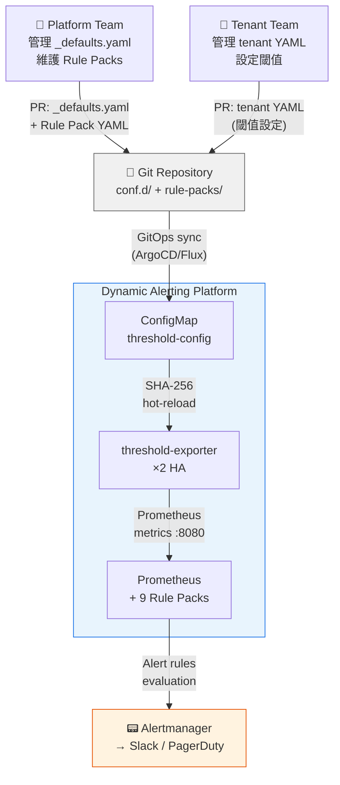
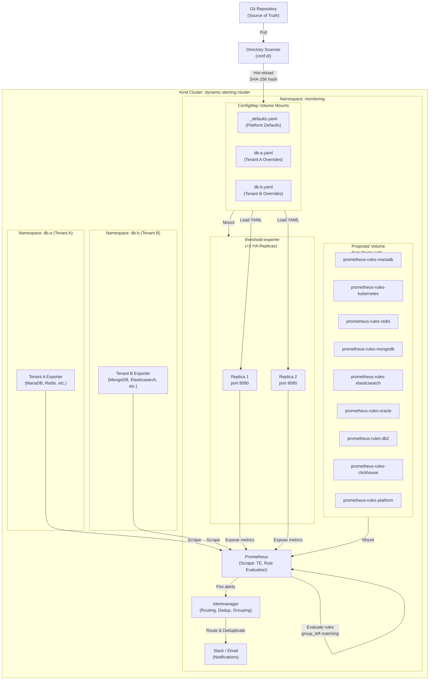
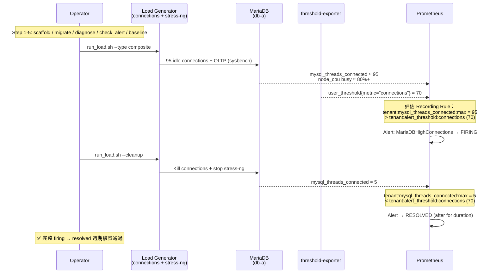
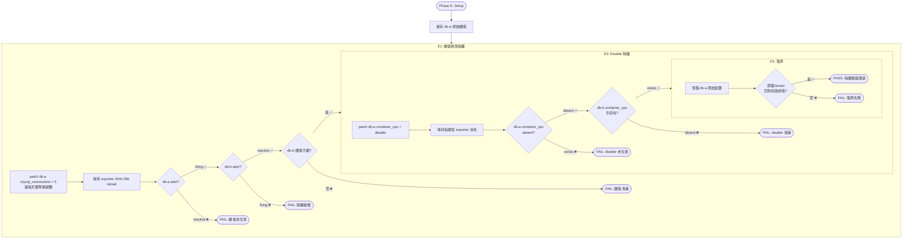
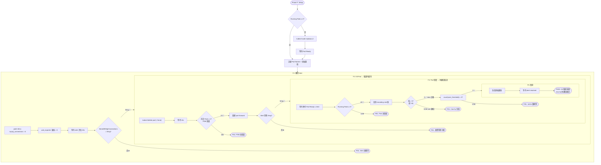
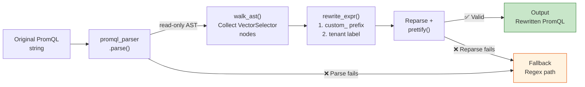

# 架構與設計 — 動態多租戶警報平台技術白皮書

> **Language / 語言：** [English](architecture-and-design.en.md) | **中文（當前）**

## 簡介

本文件針對 Platform Engineers 和 Site Reliability Engineers (SREs) 深入探討「多租戶動態警報平台」(Multi-Tenant Dynamic Alerting Platform) v1.0.1 的技術架構。

**本文涵蓋內容：**
- 系統架構與核心設計理念（含 Regex 維度閾值、排程式閾值）
- Config-driven 配置驅動的工作流程
- Projected Volume 與 9 個規則包 (Rule Packs) 的治理模型
- 性能分析與擴展性証明（含 Under-Load 基準測試與 Go Micro-Benchmark）
- 高可用性 (HA) 設計
- 治理、稽核、安全性合規
- AST 遷移引擎架構

**其他相關文件：**
- **快速入門** → [README.md](../README.md)
- **遷移指南** → [migration-guide.md](migration-guide.md)
- **規則包文件** → [rule-packs/README.md](../rule-packs/README.md)
- **threshold-exporter 元件** → [components/threshold-exporter/README.md](../components/threshold-exporter/README.md)

---

## 1. 系統架構圖 (System Architecture Diagram)

### 1.1 C4 Context — 系統邊界與角色互動



### 1.2 系統內部架構 (Internal Architecture)



**架構要點：**
1. **Directory Scanner** 掃描 `conf.d/` 目錄，自動發現 `_defaults.yaml` 和租戶配置文件
2. **threshold-exporter × 2 HA Replicas** 讀取 ConfigMap，輸出三態 Prometheus 指標
3. **Projected Volume** 掛載 9 個獨立規則包，零 PR 衝突，各團隊獨立擁有
4. **Prometheus** 使用 `group_left` 向量匹配與用戶閾值進行聯接，實現 O(M) 複雜度

---

## 2. 核心設計：Config-Driven 架構

### 2.1 三態邏輯 (Three-State Logic)

平台支援「三態」配置模式，提供靈活的預設值、覆蓋和禁用機制：

| 狀態 | 配置方式 | Prometheus 輸出 | 說明 |
|------|---------|-----------------|------|
| **Custom Value** | `metric_key: 42` | ✓ 輸出自訂閾值 | 租戶覆蓋預設值 |
| **Omitted (Default)** | 未在 YAML 中指定 | ✓ 輸出平台預設值 | 使用 `_defaults.yaml` |
| **Disable** | `metric_key: "disable"` | ✗ 不輸出 | 完全禁用該指標 |

**Prometheus 輸出示例：**

```
# Custom value (db-a 租戶)
user_threshold{tenant="db-a", metric="mariadb_replication_lag", severity="warning"} 10

# Default value (db-b 租戶，未覆蓋)
user_threshold{tenant="db-b", metric="mariadb_replication_lag", severity="warning"} 30

# Disabled (無輸出)
# (metric not present)
```

### 2.2 Directory Scanner 模式 (conf.d/)

**層次結構：**
```
conf.d/
├── _defaults.yaml         # Platform 全局預設值（Platform 團隊管理）
├── db-a.yaml             # 租戶 A 覆蓋（db-a 團隊管理）
├── db-b.yaml             # 租戶 B 覆蓋（db-b 團隊管理）
└── ...
```

**`_defaults.yaml` 內容（Platform 管理）：**
```yaml
defaults:
  mysql_connections: 80
  mysql_cpu: 80
  container_cpu: 80
  container_memory: 85

state_filters:
  container_crashloop:
    reasons: ["CrashLoopBackOff"]
    severity: "critical"
  maintenance:
    reasons: []
    severity: "info"
    default_state: "disable"
```

**`db-a.yaml` 內容（租戶覆蓋）：**
```yaml
tenants:
  db-a:
    mysql_connections: "70"          # 覆蓋預設值 80
    container_cpu: "70"              # 覆蓋預設值 80
    mysql_slave_lag: "disable"       # 無 replica，停用
    # mysql_cpu 未指定 → 使用預設值 80
    # 維度標籤
    "redis_queue_length{queue='tasks'}": "500"
    "redis_queue_length{queue='events', priority='high'}": "1000:critical"
```

#### 邊界強制規則 (Boundary Enforcement)

| 檔案類型 | 允許的區塊 | 違規行為 |
|----------|-----------|---------|
| `_` 前綴檔 (`_defaults.yaml`) | `defaults`, `state_filters`, `tenants` | — |
| 租戶檔 (`db-a.yaml`) | 僅 `tenants` | 其他區塊自動忽略 + WARN log |

#### SHA-256 熱重新加載 (Hot-Reload)

不依賴檔案修改時間 (ModTime)，而是基於 **SHA-256 內容雜湊**：

```bash
# 每次 ConfigMap 更新時
$ sha256sum conf.d/_defaults.yaml conf.d/db-a.yaml conf.d/db-b.yaml
abc123... conf.d/_defaults.yaml
def456... conf.d/db-a.yaml
ghi789... conf.d/db-b.yaml

# Prometheus 掛載的 ConfigMap 符號鏈接會旋轉
# 舊的雜湊值 → 新的雜湊值
# threshold-exporter 偵測到變化，重新載入配置
```

**為什麼 SHA-256 而不是 ModTime？**
- Kubernetes ConfigMap 會建立符號鏈接層，ModTime 不可靠
- 內容相同 = 雜湊相同，避免不必要的重新加載

### 2.3 多層嚴重度 (Multi-tier Severity)

支援 `_critical` 後綴與 `"value:severity"` 兩種語法：

**方式一：`_critical` 後綴（適用於基本閾值）**
```yaml
tenants:
  db-a:
    mysql_connections: "100"            # warning 閾值
    mysql_connections_critical: "150"   # _critical → 自動產生 critical alert
```

**方式二：`"value:severity"` 語法（適用於維度標籤）**
```yaml
tenants:
  redis-prod:
    "redis_queue_length{queue='orders'}": "500:critical"
```

**Prometheus 輸出：**
```
user_threshold{tenant="db-a", component="mysql", metric="connections", severity="warning"} 100
user_threshold{tenant="db-a", component="mysql", metric="connections", severity="critical"} 150
```

#### 自動抑制 (Auto-Suppression)

平台 Alert Rule 使用 `unless` 邏輯，critical 觸發時自動抑制 warning：

```yaml
- alert: MariaDBHighConnections          # warning
  expr: |
    ( tenant:mysql_threads_connected:max > on(tenant) group_left tenant:alert_threshold:connections )
    unless on(tenant) (user_state_filter{filter="maintenance"} == 1)
    unless on(tenant)                    # ← Auto-Suppression：critical 觸發時抑制 warning
    ( tenant:mysql_threads_connected:max > on(tenant) group_left tenant:alert_threshold:connections_critical )
- alert: MariaDBHighConnectionsCritical  # critical
  expr: |
    ( tenant:mysql_threads_connected:max > on(tenant) group_left tenant:alert_threshold:connections_critical )
    unless on(tenant) (user_state_filter{filter="maintenance"} == 1)
```

**結果：**（雙層 `unless` 邏輯）
- 連線數 ≥ 150 (critical)：warning 被第二層 `unless` 抑制，只觸發 critical 警報
- 連線數 100–150 (warning only)：第二層 `unless` 不成立，正常觸發 warning 警報

### 2.4 Regex 維度閾值 (Regex Dimension Thresholds)

v0.12.0 起，Config parser 支援 `=~` 運算子，允許以 regex 模式精細匹配維度標籤。此設計在不引入外部資料依賴的前提下，讓閾值配置可針對特定維度子集生效。

**配置語法：**
```yaml
tenants:
  db-a:
    # 精確匹配
    "oracle_tablespace_used_percent{tablespace='USERS'}": "85"
    # Regex 匹配：所有 SYS 開頭的 tablespace
    "oracle_tablespace_used_percent{tablespace=~'SYS.*'}": "95"
```

**實現路徑：**

1. **Exporter 層**：Config parser 偵測 `=~` 運算子，將 regex pattern 作為 `_re` 後綴 label 輸出
   ```
   user_threshold{tenant="db-a", metric="oracle_tablespace_used_percent",
                  tablespace_re="SYS.*", severity="warning"} 95
   ```
2. **Recording Rule 層**：PromQL 使用 `label_replace` + `=~` 在查詢時完成實際匹配
3. **設計原則**：Exporter 保持為純 config→metric 轉換器，匹配邏輯完全由 Prometheus 原生向量運算執行

### 2.5 排程式閾值 (Scheduled Thresholds)

v0.12.0 起，閾值支援時間窗口排程，允許在不同時段自動切換不同閾值。典型場景：夜間維護窗口放寬閾值、尖峰時段收緊閾值。

**配置語法：**
```yaml
tenants:
  db-a:
    mysql_connections:
      default: "100"
      overrides:
        - window: "22:00-06:00"    # UTC 夜間窗口（支援跨午夜）
          value: "200"             # 夜間批次作業，放寬到 200
        - window: "09:00-18:00"
          value: "80"              # 日間高峰，收緊到 80
```

**技術實現：**

- **`ScheduledValue` 自訂 YAML 型別**：支援雙格式解析——純量字串（向後相容）和結構化 `{default, overrides[{window, value}]}`
- **`ResolveAt(now time.Time)`**：根據當前 UTC 時間解析應使用的閾值，確保確定性與可測試性
- **時間窗口格式**：`HH:MM-HH:MM` (UTC)，支援跨午夜（如 `22:00-06:00` 表示晚上十點到隔天早上六點）
- **45 個測試案例**：覆蓋邊界條件——窗口重疊、跨午夜、純量退化、空 overrides

---

## 3. Projected Volume 架構 (Rule Packs)

### 3.1 九個獨立規則包

| Rule Pack | 擁有團隊 | ConfigMap 名稱 | Recording Rules | Alert Rules |
|-----------|---------|-----------------|----------------|-------------|
| MariaDB | DBA | `prometheus-rules-mariadb` | 11 | 8 |
| Kubernetes | Infra | `prometheus-rules-kubernetes` | 7 | 4 |
| Redis | Cache | `prometheus-rules-redis` | 11 | 6 |
| MongoDB | AppData | `prometheus-rules-mongodb` | 10 | 6 |
| Elasticsearch | Search | `prometheus-rules-elasticsearch` | 11 | 7 |
| Oracle | DBA / Oracle | `prometheus-rules-oracle` | 11 | 7 |
| DB2 | DBA / DB2 | `prometheus-rules-db2` | 12 | 7 |
| ClickHouse | Analytics | `prometheus-rules-clickhouse` | 12 | 7 |
| Platform | Platform | `prometheus-rules-platform` | 0 | 4 |
| **總計** | | | **85** | **56** |

### 3.2 自包含三部分結構

每個 Rule Pack 包含三個獨立且可複用的部分：

#### Part 1：標準化記錄規則 (Normalization Recording Rules)
```yaml
groups:
  - name: mariadb-normalization
    rules:
      # 正規化命名：tenant:<component>_<metric>:<function>
      - record: tenant:mysql_threads_connected:max
        expr: max by(tenant) (mysql_global_status_threads_connected)

      - record: tenant:mysql_slow_queries:rate5m
        expr: sum by(tenant) (rate(mysql_global_status_slow_queries[5m]))
```

**目的：** 將不同匯出器的原始指標正規化為統一命名空間 `tenant:<metric>:<function>`

#### Part 2：閾值標準化 (Threshold Normalization)
```yaml
groups:
  - name: mariadb-threshold-normalization
    rules:
      - record: tenant:alert_threshold:connections
        expr: max by(tenant) (user_threshold{metric="connections", severity="warning"})

      - record: tenant:alert_threshold:connections_critical
        expr: max by(tenant) (user_threshold{metric="connections", severity="critical"})
```

**關鍵：** 使用 `max by(tenant)` 而非 `sum`，防止 HA 雙倍計算（詳見第 5.3 節）

#### Part 3：警報規則 (Alert Rules)
```yaml
groups:
  - name: mariadb-alerts
    rules:
      - alert: MariaDBHighConnections
        expr: |
          (
            tenant:mysql_threads_connected:max
            > on(tenant) group_left
            tenant:alert_threshold:connections
          )
          unless on(tenant) (user_state_filter{filter="maintenance"} == 1)
        for: 5m
        labels:
          severity: warning
        annotations:
          summary: "MariaDB connections {{ $value }} exceeds threshold ({{ $labels.tenant }})"
```

### 3.3 優點

1. **零 PR 衝突** — 各 ConfigMap 獨立，不同團隊可並行推送
2. **團隊自主** — DBA 擁有 MariaDB 規則，不需要中央平台審核
3. **可複用** — 規則可輕鬆移植至其他 Prometheus 叢集
4. **獨立測試** — 每個包可獨立驗證和發布

---

## 4. 性能分析 (Performance Analysis) — 核心優勢

### 4.1 向量匹配複雜度分析

**傳統方法（多租戶硬編碼）：**
```
N 個租戶 × M 個警報規則 = N×M 個獨立 PromQL 評估
複雜度：O(N×M)

範例：100 個租戶，35 個警報規則
= 3,500 個獨立規則評估
```

**動態方法（向量匹配 `group_left`）：**
```
M 個警報規則 × 1 次向量匹配 = M 個評估
複雜度：O(M)，與租戶數量無關

範例：100 個租戶，35 個警報規則
= 35 個規則評估（不論租戶數量）
```

### 4.2 實際基準數據 (Kind 叢集量測)

**現有設置：2 個租戶，141 個規則（9 Rule Packs），27 個規則群組**

> 以下數據取自 **5 輪獨立量測**（Kind 單節點叢集，各輪間隔 45 秒），報告 mean ± stddev。

```
總評估時間（per cycle）: 20.3 ± 1.9ms  (range: 17.7–22.8ms, n=5)
- p50 (50th percentile):  1.23 ± 0.28ms per group
- p99 (99th percentile):  6.89 ± 0.44ms per group
```

**擴展性對比：**

| 指標 | 現有（2 租戶） | 傳統方案（100 租戶） | 動態方案（100 租戶） |
|------|-------|-------------------|------------------|
| 警報規則數 | 56（固定） | 5,600（56×100） | 56（固定） |
| 記錄規則數 | 85（正規化） | 0（嵌入在警報中） | 85（固定） |
| **規則總數** | **141** | **5,600** | **141** |
| 評估複雜度 | O(M) | O(N×M) | O(M) |
| **估計評估時間** | **~20ms** | **~800ms+** | **~20ms** |

**結論：**
- 傳統方案在 100 租戶時評估時間增加 **40 倍**
- 動態方案評估時間 **恆定**，線性擴展

### 4.3 空向量零成本 (Empty Vector Zero-Cost)

9 個規則包預加載。未部署匯出器的包針對空向量評估。

**Kind 叢集實際測量：**

| Rule Pack | 狀態 | 規則數 | 評估時間 | 備註 |
|-----------|------|--------|---------|------|
| MariaDB | ✓ 活躍 | 7 | **2.12ms** | 有匯出器 |
| MongoDB | ✗ 無匯出器 | 7 | **0.64ms** | 空向量 |
| Redis | ✗ 無匯出器 | 7 | **0.41ms** | 空向量 |
| Elasticsearch | ✗ 無匯出器 | 7 | **1.75ms** | 複雜 PromQL，仍低成本 |

**結論：**
- 空向量操作近似 O(1)
- 預加載未使用的規則包開銷 **可忽視**（< 1ms）
- 新租戶上線時，所有規則自動適用，**無需重新部署**

### 4.4 記憶體效率

> 以下數據取自 **5 輪獨立量測** mean ± stddev。

```
單個 threshold-exporter Pod（實測）：
- Heap 記憶體：2.4 ± 0.4MB（YAML 解析 + 指標生成）
- 輸出指標：~8 user_threshold series（2 個租戶）
- Scrape Duration：4.1 ± 1.2ms

× 2 HA Replicas：~4.8MB 合計
+ Prometheus RSS：142.7 ± 1.4MB（含 9 Rule Packs、141 條規則）
= 叢集開銷：~148MB

vs. 傳統方案 (5,600 規則 @ 100 租戶)：
- Prometheus 規則快取：~500MB+
- 總開銷：~600MB+（單樞紐）
```

### 4.5 資源使用基準 (Resource Usage Baseline)

以下為 Kind 單節點叢集 5 輪實測數據（2 個租戶、141 條規則、9 Rule Packs，mean ± stddev）：

| 指標 | 元件 | 數值 (n=5) | 用途 |
|------|------|------|------|
| CPU（5m 均值） | Prometheus | ~0.014 ± 0.003 cores | 容量規劃 — 評估 Prometheus 所需 CPU request |
| RSS Memory | Prometheus | 142.7 ± 1.4MB | 記憶體預算 — 設定 memory limits |
| Heap Memory | threshold-exporter (per pod) | 2.4 ± 0.4MB | Pod resource limits 調整 |
| Scrape Duration | Prometheus → exporter | 4.1 ± 1.2ms | 抓取效能基線 |

**自動化收集：**

```bash
make benchmark          # 完整報告（人類可讀）
make benchmark ARGS=--json  # JSON 輸出（CI/CD 消費）
```

### 4.6 儲存與基數分析 (Storage & Cardinality)

**為什麼基數（Cardinality）比磁碟更重要？**

Prometheus 的效能瓶頸在於 **活躍時間序列數（Active Series）**，而非磁碟空間。每個 series 佔用約 2KB 記憶體，series 數直接決定：查詢延遲、記憶體用量、compaction 頻率。

**Kind 叢集實測：**

| 指標 | 數值 | 說明 |
|------|------|------|
| TSDB 磁碟用量 | 8.9 ± 0.2MB | 含所有規則與指標（n=5） |
| 活躍 Series 總數 | ~6,037 ± 10 | 包含所有 exporter + recording rules（n=5） |
| `user_threshold` Series | 8 | threshold-exporter 輸出的閾值指標 |
| 每租戶 Series 增量 | ~4 | 新增 1 個租戶的邊際成本 |

**擴展估算公式：**

```
新增 N 個租戶的邊際成本：
  Series 增量 = N × (每租戶 series 數)
  記憶體增量 ≈ Series 增量 × 2KB

範例（100 租戶）：
  user_threshold series = 100 × 4 = 400
  記憶體增量 ≈ (400 - 8) × 2KB ≈ 0.8MB
  總 series ≈ 6,037 - 8 + 400 = 6,429
```

**結論：** 動態架構的 series 增量極小（每租戶 ~4 series），100 個租戶僅增加 ~0.8MB 記憶體。相比傳統方案（每租戶 56+ 條獨立規則，每條規則可能產生多個 series），基數優勢顯著。

### 4.7 Under-Load 基準測試 (Benchmark Under-Load Mode)

v0.13.0 新增 `--under-load` 模式，在合成租戶負載下驗證平台擴展性。idle-state 基準只量測空閒效能，under-load 模式則模擬真實的多租戶環境。

**測試方法論：**
```bash
make benchmark ARGS="--under-load --tenants 1000"
```

1. **合成租戶生成**：動態建立 N 個 synthetic tenant 配置（scalar + mixed + night-window 組合）
2. **ConfigMap Patch**：將合成配置注入 `threshold-config` ConfigMap
3. **量測維度**：
   - **Reload Latency**：ConfigMap 變更到 exporter 完成重載的時間
   - **Memory Delta**：新增 N 個租戶後的 RSS 記憶體變化
   - **Scrape Duration**：Prometheus 抓取 threshold-exporter 的時間
   - **Evaluation Time**：Recording rules + Alert rules 的評估時間
4. **清理**：自動移除合成租戶，回到原始狀態

**Go Micro-Benchmark：**

`config_bench_test.go` 提供精確的 Go 層面效能量測（Intel Core 7 240H，`-count=5` 取中位數）：

| Benchmark | ns/op (median) | ns/op (stddev) | B/op | allocs/op |
|-----------|------:|------:|-----:|----------:|
| Resolve_10Tenants_Scalar | 11,570 | 237 | 26,032 | 58 |
| Resolve_100Tenants_Scalar | 107,346 | 4,315 | 196,080 | 511 |
| Resolve_1000Tenants_Scalar | 2,215,080 | 113,589 | 3,739,792 | 5,019 |
| ResolveAt_10Tenants_Mixed | 39,487 | 1,720 | 39,491 | 268 |
| ResolveAt_100Tenants_Mixed | 419,960 | 18,120 | 454,366 | 2,612 |
| ResolveAt_1000Tenants_Mixed | 4,882,962 | 105,810 | 5,160,416 | 26,038 |
| ResolveAt_NightWindow_1000 | 4,887,959 | 123,943 | 5,123,590 | 25,037 |

**結論：** 10→100→1000 租戶，Scalar resolve 的 ns/op 呈線性增長（~10x / ~19x），記憶體也線性（26KB→196KB→3.7MB）。Mixed（含 ScheduledValue）的額外開銷約 3.4× Scalar。1000 租戶的完整 resolve 仍在 5ms 以內。5 輪量測的 stddev 控制在中位數的 2–5% 內，確認結果穩定可重現。

> **與 §4.2 的關係：** §4.2 量測的是 **Prometheus 規則評估**——由於規則數固定為 O(M)，評估時間不隨租戶數增長（2 租戶 ~20ms ≈ 100 租戶 ~20ms）。本節量測的是 **threshold-exporter 設定解析**——每多一個租戶就多一份設定要 resolve，因此成本為 O(N) 線性增長。兩者互補：平台最關鍵的瓶頸（規則評估）恆定不變，次要成本（設定解析）雖線性增長，但 1000 租戶仍僅 ~5ms，遠低於 Prometheus 15 秒抓取週期，對端到端效能影響可忽略。

### 4.8 Rule Evaluation Scaling Curve

量測 Rule Pack 數量對 Prometheus rule evaluation 時間的邊際影響。透過逐步移除 Rule Pack（9→6→3）並量測 `prometheus_rule_group_last_duration_seconds`，可觀察 evaluation 成本是否呈線性增長。

**測試方法：**
```bash
make benchmark ARGS="--scaling-curve"
```

1. **Tier 3 (9 packs)**：完整狀態（mariadb, kubernetes, redis, mongodb, elasticsearch, oracle, db2, clickhouse, platform）
2. **Tier 2 (6 packs)**：移除 oracle, db2, clickhouse
3. **Tier 1 (3 packs)**：僅保留 mariadb, kubernetes, platform

每個階段等待 Prometheus 完成至少 2 個 evaluation cycle 後取樣。測試結束自動還原所有 Rule Pack。

**Kind 叢集實測（2026-03-01，3 輪量測，報告 median）：**

| Rule Packs | Rule Groups | Total Rules | Eval Time (median) | Range |
|------------|-------------|-------------|-----------|-------|
| 3          | 9           | 34          | 7.7ms     | 3.3–15.3ms |
| 6          | 18          | 85          | 17.3ms    | 14.3–18.6ms |
| 9          | 27          | 141         | 22.7ms    | 8.7–26.0ms |

> **量測說明：** 每輪需刪除 Rule Pack → 重啟 Prometheus → 等待穩定 → 取樣，因此 per-cycle 值受 Prometheus 重啟暖機影響，變異較 idle-state 大。取 median 更能代表穩態行為。

**結論：** Rule Pack 從 3→6→9，eval time 中位數從 7.7→17.3→22.7ms，增長接近線性（每增加 3 packs 約 +5–10ms）。每個 group 的平均 eval time 穩定在 ~0.8ms，不受其他 group 影響。這確認了 Projected Volume 架構的水平擴展性 — 新增 Rule Pack 的邊際成本可預測且恆定。

---

## 5. 高可用性設計 (High Availability)

### 5.1 部署策略

```yaml
replicas: 2
strategy:
  type: RollingUpdate
  rollingUpdate:
    maxUnavailable: 0    # 零停機滾動更新
    maxSurge: 1

affinity:
  podAntiAffinity:
    preferredDuringSchedulingIgnoredDuringExecution:
      - weight: 100
        podAffinityTerm:
          topologyKey: kubernetes.io/hostname
```

**特性：**
- 2 個副本分散在不同節點
- 滾動更新時，總有 1 個副本可用
- Kind 單節點叢集：軟親和性允許裝箱

### 5.2 Pod 中斷預算 (PodDisruptionBudget)

```yaml
apiVersion: policy/v1
kind: PodDisruptionBudget
metadata:
  name: threshold-exporter-pdb
spec:
  minAvailable: 1
  selector:
    matchLabels:
      app: threshold-exporter
```

**保證：** 即使在主動維護期間，也始終有 1 個副本服務於 Prometheus 抓取

### 5.3 臨界：`max by(tenant)` vs `sum`

#### ❌ 錯誤：使用 `sum`
```yaml
- record: tenant:alert_threshold:connections
  expr: |
    sum by(tenant)
      user_threshold{tenant=~".*", metric="connections"}
```

**問題：**
- Prometheus 從兩個副本抓取相同指標 → 雙倍值
- `sum by(tenant)` 將兩個副本的值相加 → **閾值翻倍**
- 警報觸發錯誤

#### ✓ 正確：使用 `max`
```yaml
- record: tenant:alert_threshold:connections
  expr: |
    max by(tenant)
      user_threshold{tenant=~".*", metric="connections"}
```

**優勢：**
- 取兩個副本中的最大值（邏輯上相同）
- 避免雙倍計算
- HA 下警報閾值準確

### 5.4 自監控 (Platform Rule Pack)

4 個專用警報監控 threshold-exporter 本身：

| 警報 | 條件 | 動作 |
|------|------|------|
| ThresholdExporterDown | `up{job="threshold-exporter"} == 0` for 2m | PageDuty → SRE |
| ThresholdExporterAbsent | Metrics absent > 5m | 警告 → 平台團隊 |
| ThresholdExporterTooFewReplicas | `count(up{job="threshold-exporter"}) < 2` | 警告 → SRE |
| ThresholdExporterHighRestarts | `rate(container_last_terminated_reason[5m]) > 0.1` | 調查 |

---

## 6. 治理與稽核 (Governance & Audit)

### 6.1 自然稽核跡 (Natural Audit Trail)

每個租戶 YAML ⟷ Git 歷史記錄：

```bash
$ git log --follow conf.d/db-a.yaml
commit 5f3e8a2 (HEAD)
Author: alice@db-a-team.com
Date:   2026-02-26

    Increase MariaDB replication_lag threshold from 10s to 15s

    Reason: High load during 6-9pm peak hours
    Ticket: INCIDENT-1234

commit 1a2c5b9
Author: bob@db-a-team.com
Date:   2026-02-20

    Add monitoring for new Redis cluster
    Metric: redis_memory_usage_percent
    Default: 75% warning, 90% critical
```

### 6.2 權責分離 (Separation of Duties)

| 角色 | 可修改 | 無法修改 |
|------|--------|---------|
| **Platform Team** | `conf.d/_defaults.yaml` | 租戶覆蓋、警報規則 |
| **Tenant Team** | `conf.d/<tenant>.yaml` | 預設值、state_filters |
| **All** | N/A | `state_filters`（只能在 _defaults 中） |

Git RBAC：
```bash
# .gitignore 或 Branch Protection Rules
conf.d/_defaults.yaml ← admin:platform-team 專用推送權

conf.d/db-a.yaml ← write:db-a-team
conf.d/db-b.yaml ← write:db-b-team
```

### 6.3 配置驗證與合規

每次 ConfigMap 更新時自動執行：

1. **YAML 格式驗證** — 語法正確性
2. **邊界檢查** — 租戶無法修改 state_filters
3. **預設值驗證** — 閾值在合理範圍內（e.g., 0-100%）
4. **敏感性測試** — 異常值偵測（e.g., 閾值 > 10×正常值）

---

## 7. 安全合規 (Security Compliance — SAST)

### 7.1 Go 元件安全

#### ReadHeaderTimeout (Gosec G112 — Slowloris)
```go
// ✓ 正確
server := &http.Server{
    Addr:              ":8080",
    Handler:           mux,
    ReadHeaderTimeout: 10 * time.Second,  // 必須設置
}

// ✗ 違反
server := &http.Server{
    Addr:    ":8080",
    Handler: mux,
    // 無 ReadHeaderTimeout → Slowloris 攻擊風險
}
```

**為什麼：** 防止客戶端傳送緩慢的 HTTP 標頭，耗盡伺服器資源

#### 其他檢查
- **G113** — Potential uncontrolled memory consumption
- **G114** — Use of `http.Request.RequestURI` (不安全，用 URL.Path)

### 7.2 Python 元件安全

#### 檔案權限 (CWE-276)
```python
# ✓ 正確
with open(path, 'w') as f:
    f.write(config_content)
os.chmod(path, 0o600)  # rw-------

# ✗ 違反
# 預設檔案權限 0o644 (rw-r--r--) → 其他使用者可讀
```

#### 無 Shell 注入 (Command Injection)
```python
# ✓ 正確
result = subprocess.run(['kubectl', 'patch', 'configmap', ...], check=True)

# ✗ 違反
result = os.system(f"kubectl patch configmap {name}")  # shell=True 風險
```

### 7.3 SSRF 保護

所有本地 API 呼叫註記為 `# nosec B602`：

```python
# nosec B602 — localhost-only, no SSRF risk
response = requests.get('http://localhost:8080/health')
```

---

## 8. 故障排查與邊界情況

### 8.1 SHA-256 熱重新加載延遲

**情景：** ConfigMap 更新後，threshold-exporter 仍顯示舊值

```bash
# 診斷
$ kubectl get configmap -n monitoring configmap-defaults -o jsonpath='{.metadata.generation}'
5

$ kubectl logs -n monitoring deployment/threshold-exporter | grep "SHA256"
2026-02-26T10:15:32Z SHA256: abc123... (old)
2026-02-26T10:20:45Z SHA256: def456... (updated after 5min)
```

**原因：** Kubernetes 至多每 60 秒同步一次 ConfigMap 掛載

**解決方案：**
1. 強制重新啟動：`kubectl rollout restart deployment/threshold-exporter`
2. 或等待掛載同步（典型 < 1分鐘）

### 8.2 空向量警報不觸發

**情景：** Redis 沒有部署匯出器，但 Redis 警報規則仍在評估

```promql
# 問題：
redis_memory_usage_percent{job="redis-exporter"} >= on(tenant) group_left
  user_threshold{metric="redis_memory_usage_percent", severity="warning"}

# 右側為空向量 (user_threshold 無 Redis 資料)
# group_left 匹配失敗 → 警報不觸發 ✓ 預期行為
```

**驗證（非問題）：**
```bash
$ kubectl exec -it prometheus-0 -c prometheus -- \
  promtool query instant 'count(redis_memory_usage_percent)'
0  # 無 Redis 指標 ✓
```

### 8.3 雙租戶抓取重複計數

**情景：** Prometheus 從兩個 threshold-exporter 副本抓取，user_threshold 值翻倍

```
user_threshold{tenant="db-a", severity="warning"} 30  (from replica-1)
user_threshold{tenant="db-a", severity="warning"} 30  (from replica-2)
# ↓ sum by(tenant) 會產生 60 （錯誤！）
```

**修正：** 確保所有閾值規則使用 `max by(tenant)`

```yaml
- record: tenant:alert_threshold:slave_lag
  expr: |
    max by(tenant)  # ✓ 不是 sum
      user_threshold{metric="slave_lag"}
```

**閾值 vs 資料——聚合方式的差異：**

此問題僅涉及 **threshold（閾值）recording rules**。閾值本質上是一個設定值（例如「連線上限 100」），無論幾個 exporter 副本回報，數值都相同，因此 `max by(tenant)` 是語義上唯一正確的聚合方式——不存在需要 `sum` 的場景。平台在兩層保證這一點：

1. **Platform Rule Packs**：所有 threshold recording rules 固定使用 `max by(tenant)`
2. **`migrate_rule.py` AST 引擎**：產出的 threshold recording rule 也固定為 `max by(tenant)`，使用者無法覆寫

另一方面，**data（資料）recording rules** 的聚合方式依語義而異。例如 `mysql_threads_connected`（當前連線數）每個副本觀察到的是同一個值，用 `max`；但 `rate(requests_total)`（每秒請求量）若來自不同來源，可能需要 `sum`。Data recording rules 的聚合策略可透過 metric dictionary 指定，不受本節 threshold 聚合約束的影響。

---

## 9. 已實現的進階場景 (Implemented Advanced Scenarios)

### 9.1 維護模式與複合警報 (已實現 ✓)

所有 Alert Rules 內建 `unless maintenance` 邏輯，租戶可透過 state_filter 一鍵靜音：

```yaml
# _defaults.yaml
state_filters:
  maintenance:
    reasons: []
    severity: "info"
    default_state: "disable"   # 預設關閉

# 租戶啟用維護模式：
tenants:
  db-a:
    _state_maintenance: "enable"  # 所有警報被 unless 抑制
```

複合警報 (AND 邏輯) 與多層嚴重度 (Critical 自動降級 Warning) 也已完整實現。

### 9.2 企業級測試覆蓋矩陣 (Enterprise Test Coverage Matrix)

以下矩陣將自動化測試場景對應到企業客戶關心的防護需求，每個場景的斷言邏輯均可透過 `make test-scenario-*` 一鍵驗證。

| 場景 | 企業防護需求 | 測試方式 | 核心斷言 | 指令 |
|------|-------------|----------|----------|------|
| **A — 動態閾值** | 租戶自訂閾值即時生效，無需重啟 | 修改閾值 → 等待 exporter reload → 驗證 alert 觸發 | `user_threshold` 值更新；alert 狀態變為 firing | `make test-scenario-a` |
| **B — 弱環節偵測** | 多指標中最差的自動觸發告警 | 注入 CPU 壓力 → 驗證 `pod_weakest_cpu_percent` 歸一化 | recording rule 產出正確的最差值；alert 正確觸發 | `make test-scenario-b` |
| **C — 三態比對** | 指標可被 custom / default / disable 三態控制 | 切換三態 → 驗證 exporter 指標存在/消失 | custom: 值=自訂; default: 值=全域預設; disable: 指標消失 | scenario-a 內含 |
| **D — 維護模式** | 計劃性維護期間自動靜音所有告警 | 啟用 `_state_maintenance` → 驗證 alert 被 `unless` 抑制 | 所有 alert 保持 inactive；解除後恢復正常 | scenario-a 內含 |
| **E — 多租戶隔離** | 修改 Tenant A 不影響 Tenant B | 壓低 A 閾值/disable A 指標 → 驗證 B 不變 | A alert fires, B alert inactive; A 指標消失, B 指標存在 | `make test-scenario-e` |
| **F — HA 故障切換** | Pod 被刪除後服務不中斷、閾值不翻倍 | Kill 1 Pod → 驗證 alert 持續 → 新 Pod 啟動 → 驗證 `max by` | 存活 Pod ≥1 (PDB); alert 無中斷; recording rule 值=原值 (非 2×) | `make test-scenario-f` |
| **demo-full** | 端到端展演完整生命週期 | Composite load → alert 觸發 → cleanup → alert 恢復 | 6 步驟全部成功; alert firing → inactive 完整週期 | `make demo-full` |

#### 斷言細節補充

**Scenario E 的兩個隔離維度：**

- **E1 — 閾值修改隔離**：將 db-a 的 `mysql_connections` 壓低至 5 → db-a 觸發 `MariaDBHighConnections`，db-b 的閾值和 alert 狀態完全不受影響
- **E2 — Disable 隔離**：將 db-a 的 `container_cpu` 設為 `disable` → db-a 該指標從 exporter 消失，db-b 的 `container_cpu` 仍正常產出

**Scenario F 的 `max by(tenant)` 證明：**

兩個 threshold-exporter Pod 各自吐出相同的 `user_threshold{tenant="db-a", metric="connections"} = 5`。Recording rule 使用 `max by(tenant)` 聚合：

- ✅ `max(5, 5) = 5`（正確）
- ❌ 如果用 `sum by(tenant)`：`5 + 5 = 10`（翻倍，錯誤）

測試在 Kill 一個 Pod 後驗證值仍為 5，且新 Pod 啟動後 series 數回到 2 但聚合值仍為 5。

### 9.3 demo-full：端到端生命週期流程圖

`make demo-full` 展示從工具驗證到真實負載的完整流程。以下時序圖描述 Step 6 (Live Load) 的核心路徑：



### 9.4 Scenario E：多租戶隔離驗證

驗證修改 Tenant A 的配置絕對不影響 Tenant B。流程分為兩個隔離維度：



### 9.5 Scenario F：HA 故障切換與 `max by(tenant)` 防翻倍

驗證 threshold-exporter HA ×2 在 Pod 被刪除後服務不中斷，且 `max by(tenant)` 聚合不會因 Pod 數量變化而翻倍：



> **核心證明**：Scenario F 的 Phase F4 是整個 HA 設計的關鍵驗證——它直接證明了 `max by(tenant)` 聚合在 Pod 數量變動時的正確性，這是選擇 `max` 而非 `sum` 的技術根據。詳見 §5 高可用性設計。

---

## 10. AST 遷移引擎架構 (Migration Engine Architecture)

v0.11.0 實現了 `migrate_rule.py` v4，將遷移工具的核心從 regex 提升至 AST (Abstract Syntax Tree) 精度。這是企業客戶從傳統監控遷移至本平台的關鍵能力。

### 10.1 架構：AST-Informed String Surgery



**為什麼不做完整 AST 重寫？** `promql-parser` (Rust PyO3, v0.7.0) 的 AST 是唯讀的——無法修改節點屬性後重新序列化。String surgery 方法更安全（保留原始表達式結構）、更簡單（無需自建 PromQL 序列化器）、且可驗證（reparse 確認結果正確性）。

### 10.2 核心功能

| 功能 | 說明 |
|------|------|
| `extract_metrics_ast()` | AST 精準辨識 metric name，取代 regex + blacklist 方式 |
| `extract_label_matchers_ast()` | 提取所有 label matcher（含 `=~` regex matcher） |
| `rewrite_expr_prefix()` | `custom_` 前綴注入，使用 word-boundary regex 防止子字串誤替換 |
| `rewrite_expr_tenant_label()` | `tenant=~".+"` label 注入，確保租戶隔離 |
| `detect_semantic_break_ast()` | 偵測 `absent()` / `predict_linear()` 等語意中斷函式 |

### 10.3 Graceful Degradation

遷移引擎採用漸進式降級策略：

1. **AST 路徑**（預設）：`promql-parser` 可用且表達式可解析時，使用 AST 精確辨識
2. **Regex 路徑**（降級）：`promql-parser` 未安裝或特定表達式解析失敗時，自動回到 regex 路徑
3. **強制 Regex**：CLI `--no-ast` 旗標可跳過 AST，用於除錯或比較

降級不影響輸出格式——兩條路徑產出相同的三件式套件（recording rules + threshold normalization + alert rules）。

### 10.4 企業遷移工作流

完整遷移路徑整合 AST 引擎、Shadow Monitoring 與 Triage 模式：

1. **Triage**：`migrate_rule.py --triage` 產出 CSV 清單，分類每條規則的遷移策略（direct / prefix / skip）
2. **遷移執行**：AST 引擎處理 prefix 注入與 tenant label 注入
3. **Shadow Monitoring**：`validate_migration.py` 驗證遷移前後的數值一致性（容差 ≤ 5%）
4. **上線**：透過 `scaffold_tenant.py` 產出完整的租戶配置包

> **為什麼容差是 5%？** 遷移前後的 PromQL 查詢結果不可能完全一致，因為存在三個天然誤差來源：(1) **時間窗口偏移**——新舊規則在不同 evaluation cycle 被評估，對 `rate()` / `irate()` 等時間敏感函數會產生取樣偏差；(2) **聚合路徑改變**——從嵌入式 PromQL 改為 recording rule 引用，多一層 evaluation cycle 的時序延遲；(3) **浮點精度**——不同 expression 路徑的浮點運算可能在末位小數產生差異。5% 的設計目標是「寬鬆到足以容納這些天然抖動，但嚴格到能偵測語義錯誤」（例如漏了 label filter 或聚合方式錯誤）。若特定場景需要更嚴格或更寬鬆的容差，可透過 `--tolerance` 參數調整。

---

## 11. 未來擴展路線 (Future Roadmap)

以下項目為尚未實現的技術方向，依預期影響排列。

### 11.1 治理架構演進 (Governance Evolution)

目前所有租戶配置集中於單一 `threshold-config` ConfigMap，K8s 原生 RBAC 僅能控制到 resource 層級，無法區分 key 層級的存取權限。拆分為多個 ConfigMap 雖然可行，但 projected volume 必須在 Pod Spec 中寫死每個 ConfigMap name——新增租戶時需修改 Deployment 並觸發 Pod 重啟，破壞 hot-reload 核心機制。

#### 現行最佳實踐：GitOps-Driven RBAC

推薦將配置變更流程從 `kubectl patch` 轉為 Git commit → GitOps sync（ArgoCD / Flux）。權限邊界上移至 Git 層：

- **CODEOWNERS / Branch Protection**：限制 Tenant A 團隊僅能修改 `conf.d/db-a.yaml`，Platform Team 才能修改 `_defaults.yaml`
- **CI/CD Pipeline**：將 `conf.d/` 目錄組裝為單一 `threshold-config` ConfigMap 並 apply，保留 hot-reload 效能優勢
- **審計軌跡**：Git history 天然提供 who / when / what 的完整變更紀錄

實務上，配置變更分為三個層次：

1. **常規流程 (Standard Pathway)**：所有變更經 Git PR → review → merge → GitOps sync。RBAC 稽核軌跡完整，適用於日常閾值調校與新租戶上線。
2. **緊急破窗 (Break-Glass)**：P0 事故期間，SRE 可直接使用 `patch_config.py` 對 K8s ConfigMap 做 runtime patch，以最短 MTTR 止血。
3. **飄移收斂 (Drift Reconciliation)**：破窗修改後，SRE 必須補發 PR 將變更同步回 Git。否則下一次 GitOps sync 會將 K8s 上的配置覆蓋回 Git 版本——這正是 GitOps 的自癒特性，天然防止「急救後忘記改程式碼」造成永久技術債。

#### 終極藍圖：CRD + Operator

當平台擴展至需要自動擴縮、drift reconciliation、跨叢集管理時，可引入 `ThresholdConfig` CRD 與 Operator，將租戶配置提升為 Kubernetes first-class resource。K8s 原生 RBAC 即可在 per-CR 層級精確控制存取，同時與 GitOps 工具鏈無縫整合。此路線需要額外的 Operator 開發與維運投資，適合在產品進入規模化階段時評估。

### 11.2 Prometheus 聯邦 (Federation)

支援多叢集架構：
- 邊界叢集各自收集租戶指標並運行 threshold-exporter
- 中央叢集透過 federation 或 remote-write 進行全域警報評估
- 跨叢集 SLA 監控與統一儀表板

### 11.3 生態系擴展展望 (Ecosystem Expansion)

目前平台以資料庫類型（MariaDB, Redis, MongoDB, Elasticsearch, Oracle, DB2, ClickHouse）為主要涵蓋範圍。架構本身不限於 DB——任何能輸出 Prometheus metrics 的元件都可透過新增 Rule Pack 納入管理。

每個新領域的接入模式與現有 DB Rule Pack 相同：Normalization → Threshold Normalization → Alert Rules 三件式結構，搭配 `scaffold_tenant.py` 自動生成配置。以下列出具體的整合路徑：

| 領域 | 推薦 Exporter | 適合閾值管理的關鍵指標 | 整合模式 |
|------|--------------|----------------------|---------|
| **Kafka** | [danielqsj/kafka_exporter](https://github.com/danielqsj/kafka_exporter) | `kafka_consumergroup_lag`, `kafka_brokers`, `kafka_topic_partition_current_offset` | 標準三件式 — lag/broker count 用 `max by(tenant)`，throughput 用 `sum by(tenant)` |
| **RabbitMQ** | [kbudde/rabbitmq_exporter](https://github.com/kbudde/rabbitmq_exporter) | `rabbitmq_queue_messages_ready`, `rabbitmq_queue_consumers`, `rabbitmq_connections` | 標準三件式 — queue depth 適合 regex 維度（per-queue 閾值） |
| **JVM** | [prometheus/jmx_exporter](https://github.com/prometheus/jmx_exporter) | `jvm_gc_pause_seconds_sum`, `jvm_memory_used_bytes`, `jvm_threads_current` | 標準三件式 — GC pause 適合排程式閾值（尖峰 vs 離峰容忍度不同） |
| **Nginx** | [nginxinc/nginx-prometheus-exporter](https://github.com/nginxinc/nginx-prometheus-exporter) | `nginx_connections_active`, `nginx_http_requests_total` rate, `nginx_connections_waiting` | 標準三件式 — active connections 用 `max by(tenant)` |
| **AWS RDS** | [percona/rds_exporter](https://github.com/percona/rds_exporter) 或 [YACE](https://github.com/nerdswords/yet-another-cloudwatch-exporter) | `rds_cpu_utilization`, `rds_free_storage_space`, `rds_database_connections` | 標準三件式 — CloudWatch metrics 經 exporter 轉為 Prometheus 格式後，與本平台完全相容 |

### 11.4 Log-to-Metric Bridge（日誌轉指標橋接）

本平台的設計邊界是 **Prometheus metrics 層**——它管理閾值與警報，不直接處理日誌。對於需要基於日誌觸發警報的場景（如 Oracle ORA-600 致命錯誤、MySQL slow query log 分析），推薦的生態系解法是：

**架構模式：**
```
Application Log → grok_exporter / mtail → Prometheus metric → 本平台閾值管理
```

| 工具 | 適用場景 | 說明 |
|------|---------|------|
| [grok_exporter](https://github.com/fstab/grok_exporter) | 結構化日誌（syslog, access log） | 用 Grok pattern 解析日誌行，輸出為 Prometheus counter/gauge/histogram |
| [mtail](https://github.com/google/mtail) | 高吞吐量即時日誌串流 | Google 開源，程式化定義日誌 pattern → metric，適合大規模部署 |

**整合範例（ORA-600）：**
1. grok_exporter 監控 Oracle alert log，每匹配到 `ORA-600` 遞增 `oracle_fatal_errors_total{instance="..."}`
2. 本平台 `_defaults.yaml` 設定 `oracle_fatal_errors_rate: "0"` (任何錯誤即告警)
3. Recording rule: `tenant:oracle_fatal_errors:rate5m` → Alert rule 觸發

此模式讓日誌類警報也能享受動態閾值、多租戶隔離、Shadow Monitoring 等平台能力，而不需要在核心架構中引入日誌處理邏輯。

---

## 參考資源

- **README.md** — 快速開始與概述
- **migration-guide.md** — 從傳統方案遷移
- **custom-rule-governance.md** — 多租戶客製化規則治理規範
- **rule-packs/README.md** — 規則包開發與擴展
- **components/threshold-exporter/README.md** — 匯出器內部實現

---

**文件版本：** v1.0.1 — 2026-03-01
**最後更新：** v1.0.0 GA Release — 文件重構 + 基準數據更新：§4 性能分析全面改為多輪統計量測（idle-state ×5, scaling-curve ×3, Go micro-benchmark ×5），報告 mean ± stddev / median (range)
**維護者：** Platform Engineering Team
