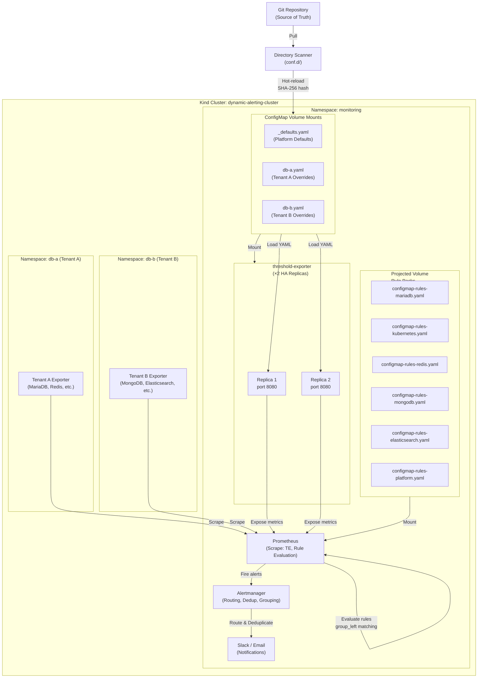

# Architecture & Design — 動態多租戶警報平台技術白皮書

## 簡介 (Introduction)

本文件針對 Platform Engineers 和 Site Reliability Engineers (SREs) 深入探討「多租戶動態警報平台」(Multi-Tenant Dynamic Alerting Platform) v0.5.0 的技術架構。

**本文涵蓋內容：**
- 系統架構與核心設計理念
- Config-driven 配置驅動的工作流程
- Projected Volume 與規則包 (Rule Packs) 的治理模型
- 性能分析與擴展性証明
- 高可用性 (HA) 設計
- 治理、稽核、安全性合規

**其他相關文件：**
- **快速入門** → [README.md](../README.md)
- **遷移指南** → [migration-guide.md](migration-guide.md)
- **規則包文件** → [rule-packs/README.md](../rule-packs/README.md)
- **threshold-exporter 元件** → [components/threshold-exporter/README.md](../components/threshold-exporter/README.md)

---

## 1. 系統架構圖 (System Architecture Diagram)



**架構要點：**
1. **Directory Scanner** 掃描 `conf.d/` 目錄，自動發現 `_defaults.yaml` 和租戶配置文件
2. **threshold-exporter × 2 HA Replicas** 讀取 ConfigMap，輸出三態 Prometheus 指標
3. **Projected Volume** 掛載 6 個獨立規則包，零 PR 衝突，各團隊獨立擁有
4. **Prometheus** 使用 `group_left` 向量匹配與用戶閾值進行聯接，實現 O(M) 複雜度

---

## 2. 核心設計：Config-Driven 架構

### 2.1 三態邏輯 (Three-State Logic)

平台支援「三態」配置模式，提供靈活的預設值、覆蓋和禁用機制：

| 狀態 | 配置方式 | Prometheus 輸出 | 說明 |
|------|---------|-----------------|------|
| **Custom Value** | `metric_key: 42` | ✓ 輸出自訂閾值 | 租戶覆蓋預設值 |
| **Omitted (Default)** | 未在 YAML 中指定 | ✓ 輸出平台預設值 | 使用 `_defaults.yaml` |
| **Disable** | `metric_key: "disable"` | ✗ 不輸出 | 完全禁用該指標 |

**Prometheus 輸出示例：**

```
# Custom value (db-a 租戶)
user_threshold{tenant="db-a", metric="mariadb_replication_lag", severity="warning"} 10

# Default value (db-b 租戶，未覆蓋)
user_threshold{tenant="db-b", metric="mariadb_replication_lag", severity="warning"} 30

# Disabled (無輸出)
# (metric not present)
```

### 2.2 Directory Scanner 模式 (conf.d/)

**層次結構：**
```
conf.d/
├── _defaults.yaml         # Platform 全局預設值（Platform 團隊管理）
├── db-a.yaml             # 租戶 A 覆蓋（db-a 團隊管理）
├── db-b.yaml             # 租戶 B 覆蓋（db-b 團隊管理）
└── ...
```

**`_defaults.yaml` 內容（Platform 管理）：**
```yaml
defaults:
  mysql_connections: 80
  mysql_cpu: 80
  mysql_slave_lag: 30
  container_cpu: 80
  container_memory: 85

state_filters:
  container_crashloop:
    reasons: ["CrashLoopBackOff"]
    severity: "critical"
  maintenance:
    reasons: []
    severity: "info"
    default_state: "disable"
```

**`db-a.yaml` 內容（租戶覆蓋）：**
```yaml
tenants:
  db-a:
    mysql_connections: "70"          # 覆蓋預設值 80
    container_cpu: "70"              # 覆蓋預設值 80
    mysql_slave_lag: "disable"       # 無 replica，停用
    # mysql_cpu 未指定 → 使用預設值 80
    # 維度標籤 (Phase 2B)
    "redis_queue_length{queue='tasks'}": "500"
    "redis_queue_length{queue='events', priority='high'}": "1000:critical"
```

#### 邊界強制規則 (Boundary Enforcement)

| 檔案類型 | 允許的區塊 | 違規行為 |
|----------|-----------|---------|
| `_` 前綴檔 (`_defaults.yaml`) | `defaults`, `state_filters`, `tenants` | — |
| 租戶檔 (`db-a.yaml`) | 僅 `tenants` | 其他區塊自動忽略 + WARN log |

#### SHA-256 熱重新加載 (Hot-Reload)

不依賴檔案修改時間 (ModTime)，而是基於 **SHA-256 內容雜湊**：

```bash
# 每次 ConfigMap 更新時
$ sha256sum conf.d/_defaults.yaml conf.d/db-a.yaml conf.d/db-b.yaml
abc123... conf.d/_defaults.yaml
def456... conf.d/db-a.yaml
ghi789... conf.d/db-b.yaml

# Prometheus 掛載的 ConfigMap 符號鏈接會旋轉
# 舊的雜湊值 → 新的雜湊值
# threshold-exporter 偵測到變化，重新載入配置
```

**為什麼 SHA-256 而不是 ModTime？**
- Kubernetes ConfigMap 會建立符號鏈接層，ModTime 不可靠
- 內容相同 = 雜湊相同，避免不必要的重新加載

### 2.3 多層嚴重度 (Multi-tier Severity)

支援 `_critical` 後綴與 `"value:severity"` 兩種語法：

**方式一：`_critical` 後綴（適用於基本閾值）**
```yaml
tenants:
  db-a:
    mysql_connections: "100"            # warning 閾值
    mysql_connections_critical: "150"   # _critical → 自動產生 critical alert
```

**方式二：`"value:severity"` 語法（適用於維度標籤）**
```yaml
tenants:
  redis-prod:
    "redis_queue_length{queue='orders'}": "500:critical"
```

**Prometheus 輸出：**
```
user_threshold{tenant="db-a", component="mysql", metric="connections", severity="warning"} 100
user_threshold{tenant="db-a", component="mysql", metric="connections", severity="critical"} 150
```

#### 自動抑制 (Auto-Suppression)

平台 Alert Rule 使用 `unless` 邏輯，critical 觸發時自動抑制 warning：

```yaml
- alert: MariaDBHighConnections          # warning
  expr: |
    ( tenant:mysql_threads_connected:max > on(tenant) group_left tenant:alert_threshold:connections )
    unless on(tenant) (user_state_filter{filter="maintenance"} == 1)
- alert: MariaDBHighConnectionsCritical  # critical
  expr: |
    ( tenant:mysql_threads_connected:max > on(tenant) group_left tenant:alert_threshold:connections_critical )
    unless on(tenant) (user_state_filter{filter="maintenance"} == 1)
```

**結果：**
- 連線數 ≥ 150 (critical)：只觸發 critical 警報
- 連線數 100-150 (warning only)：觸發 warning 警報

---

## 3. Projected Volume 架構 (Rule Packs)

### 3.1 六個獨立規則包

| Rule Pack | 擁有團隊 | ConfigMap 名稱 | Recording Rules | Alert Rules |
|-----------|---------|-----------------|----------------|-------------|
| MariaDB | DBA | `configmap-rules-mariadb` | 7 | 8 |
| Kubernetes | Infra | `configmap-rules-kubernetes` | 5 | 4 |
| Redis | Cache | `configmap-rules-redis` | 7 | 6 |
| MongoDB | AppData | `configmap-rules-mongodb` | 7 | 6 |
| Elasticsearch | Search | `configmap-rules-elasticsearch` | 7 | 7 |
| Platform | Platform | `configmap-rules-platform` | 0 | 4 |
| **總計** | | | **33** | **35** |

### 3.2 自包含三部分結構

每個 Rule Pack 包含三個獨立且可複用的部分：

#### Part 1：標準化記錄規則 (Normalization Recording Rules)
```yaml
groups:
  - name: mariadb-normalization
    rules:
      # 正規化命名：tenant:<component>_<metric>:<function>
      - record: tenant:mysql_threads_connected:max
        expr: max by(tenant) (mysql_global_status_threads_connected)

      - record: tenant:mysql_slow_queries:rate5m
        expr: sum by(tenant) (rate(mysql_global_status_slow_queries[5m]))
```

**目的：** 將不同匯出器的原始指標正規化為統一命名空間 `tenant:<metric>:<function>`

#### Part 2：閾值標準化 (Threshold Normalization)
```yaml
groups:
  - name: mariadb-threshold-normalization
    rules:
      - record: tenant:alert_threshold:connections
        expr: max by(tenant) (user_threshold{metric="connections", severity="warning"})

      - record: tenant:alert_threshold:connections_critical
        expr: max by(tenant) (user_threshold{metric="connections", severity="critical"})
```

**關鍵：** 使用 `max by(tenant)` 而非 `sum`，防止 HA 雙倍計算（詳見第 5.3 節）

#### Part 3：警報規則 (Alert Rules)
```yaml
groups:
  - name: mariadb-alerts
    rules:
      - alert: MariaDBHighConnections
        expr: |
          (
            tenant:mysql_threads_connected:max
            > on(tenant) group_left
            tenant:alert_threshold:connections
          )
          unless on(tenant) (user_state_filter{filter="maintenance"} == 1)
        for: 5m
        labels:
          severity: warning
        annotations:
          summary: "MariaDB connections {{ $value }} exceeds threshold ({{ $labels.tenant }})"
```

### 3.3 優點

1. **零 PR 衝突** — 各 ConfigMap 獨立，不同團隊可並行推送
2. **團隊自主** — DBA 擁有 MariaDB 規則，不需要中央平台審核
3. **可複用** — 規則可輕鬆移植至其他 Prometheus 叢集
4. **獨立測試** — 每個包可獨立驗證和發布

---

## 4. 性能分析 (Performance Analysis) — 核心優勢

### 4.1 向量匹配複雜度分析

**傳統方法（多租戶硬編碼）：**
```
N 個租戶 × M 個警報規則 = N×M 個獨立 PromQL 評估
複雜度：O(N×M)

範例：100 個租戶，35 個警報規則
= 3,500 個獨立規則評估
```

**動態方法（向量匹配 `group_left`）：**
```
M 個警報規則 × 1 次向量匹配 = M 個評估
複雜度：O(M)，與租戶數量無關

範例：100 個租戶，35 個警報規則
= 35 個規則評估（不論租戶數量）
```

### 4.2 實際基準數據 (Kind 叢集量測)

**現有設置：2 個租戶，85 個規則，18 個警報群組**

```
總評估時間（per cycle）: ~20.8ms
- p50 (50th percentile):  0.59ms per group
- p99 (99th percentile):  5.05ms per group
```

**擴展性對比：**

| 指標 | 現有（2 租戶） | 傳統方案（100 租戶） | 動態方案（100 租戶） |
|------|-------|-------------------|------------------|
| 警報規則數 | 35（固定） | 3,500（35×100） | 35（固定） |
| 記錄規則數 | 50（正規化） | 0（嵌入在警報中） | 50（固定） |
| **規則總數** | **85** | **3,500** | **85** |
| 評估複雜度 | O(M) | O(N×M) | O(M) |
| **估計評估時間** | **~20.8ms** | **~850ms+** | **~20.8ms** |

**結論：**
- 傳統方案在 100 租戶時評估時間增加 **40 倍**
- 動態方案評估時間 **恆定**，線性擴展

### 4.3 空向量零成本 (Empty Vector Zero-Cost)

6 個規則包預加載。未部署匯出器的包針對空向量評估。

**Kind 叢集實際測量：**

| Rule Pack | 狀態 | 規則數 | 評估時間 | 備註 |
|-----------|------|--------|---------|------|
| MariaDB | ✓ 活躍 | 7 | **2.12ms** | 有匯出器 |
| MongoDB | ✗ 無匯出器 | 7 | **0.64ms** | 空向量 |
| Redis | ✗ 無匯出器 | 7 | **0.41ms** | 空向量 |
| Elasticsearch | ✗ 無匯出器 | 7 | **1.75ms** | 複雜 PromQL，仍低成本 |

**結論：**
- 空向量操作近似 O(1)
- 預加載未使用的規則包開銷 **可忽視**（< 1ms）
- 新租戶上線時，所有規則自動適用，**無需重新部署**

### 4.4 記憶體效率

```
單個 threshold-exporter Pod：
- ConfigMap 記憶體：~5MB（YAML 解析）
- 輸出指標：~2,000 series（2 個租戶）
- 總用量：~150MB (RSS)

× 2 HA Replicas：~300MB 總計
+ Prometheus 規則快取：~50MB
= 叢集開銷：~350MB

vs. 傳統方案 (3,500 規則)：
- Prometheus 規則快取：~200MB+
- 總開銷：~400MB+（單樞紐）
```

---

## 5. 高可用性設計 (High Availability)

### 5.1 部署策略

```yaml
replicas: 2
strategy:
  type: RollingUpdate
  rollingUpdate:
    maxUnavailable: 0    # 零停機滾動更新
    maxSurge: 1

affinity:
  podAntiAffinity:
    preferredDuringSchedulingIgnoredDuringExecution:
      - weight: 100
        podAffinityTerm:
          topologyKey: kubernetes.io/hostname
```

**特性：**
- 2 個副本分散在不同節點
- 滾動更新時，總有 1 個副本可用
- Kind 單節點叢集：軟親和性允許裝箱

### 5.2 Pod 中斷預算 (PodDisruptionBudget)

```yaml
apiVersion: policy/v1
kind: PodDisruptionBudget
metadata:
  name: threshold-exporter-pdb
spec:
  minAvailable: 1
  selector:
    matchLabels:
      app: threshold-exporter
```

**保證：** 即使在主動維護期間，也始終有 1 個副本服務於 Prometheus 抓取

### 5.3 臨界：`max by(tenant)` vs `sum`

#### ❌ 錯誤：使用 `sum`
```yaml
- record: tenant:alert_threshold:connections
  expr: |
    sum by(tenant)
      user_threshold{tenant=~".*", metric="connections"}
```

**問題：**
- Prometheus 從兩個副本抓取相同指標 → 雙倍值
- `sum by(tenant)` 將兩個副本的值相加 → **閾值翻倍**
- 警報觸發錯誤

#### ✓ 正確：使用 `max`
```yaml
- record: tenant:alert_threshold:connections
  expr: |
    max by(tenant)
      user_threshold{tenant=~".*", metric="connections"}
```

**優勢：**
- 取兩個副本中的最大值（邏輯上相同）
- 避免雙倍計算
- HA 下警報閾值準確

### 5.4 自監控 (Platform Rule Pack)

4 個專用警報監控 threshold-exporter 本身：

| 警報 | 條件 | 動作 |
|------|------|------|
| ThresholdExporterDown | `up{job="threshold-exporter"} == 0` for 2m | PageDuty → SRE |
| ThresholdExporterAbsent | Metrics absent > 5m | 警告 → 平台團隊 |
| TooFewReplicas | `count(up{job="threshold-exporter"}) < 2` | 警告 → SRE |
| HighRestarts | `rate(container_last_terminated_reason[5m]) > 0.1` | 調查 |

---

## 6. 治理與稽核 (Governance & Audit)

### 6.1 自然稽核跡 (Natural Audit Trail)

每個租戶 YAML ⟷ Git 歷史記錄：

```bash
$ git log --follow conf.d/db-a.yaml
commit 5f3e8a2 (HEAD)
Author: alice@db-a-team.com
Date:   2026-02-26

    Increase MariaDB replication_lag threshold from 10s to 15s

    Reason: High load during 6-9pm peak hours
    Ticket: INCIDENT-1234

commit 1a2c5b9
Author: bob@db-a-team.com
Date:   2026-02-20

    Add monitoring for new Redis cluster
    Metric: redis_memory_usage_percent
    Default: 75% warning, 90% critical
```

### 6.2 權責分離 (Separation of Duties)

| 角色 | 可修改 | 無法修改 |
|------|--------|---------|
| **Platform Team** | `conf.d/_defaults.yaml` | 租戶覆蓋、警報規則 |
| **Tenant Team** | `conf.d/<tenant>.yaml` | 預設值、state_filters |
| **All** | N/A | `state_filters`（只能在 _defaults 中） |

Git RBAC：
```bash
# .gitignore 或 Branch Protection Rules
conf.d/_defaults.yaml ← admin:platform-team 專用推送權

conf.d/db-a.yaml ← write:db-a-team
conf.d/db-b.yaml ← write:db-b-team
```

### 6.3 配置驗證與合規

每次 ConfigMap 更新時自動執行：

1. **YAML 格式驗證** — 語法正確性
2. **邊界檢查** — 租戶無法修改 state_filters
3. **預設值驗證** — 閾值在合理範圍內（e.g., 0-100%）
4. **敏感性測試** — 異常值偵測（e.g., 閾值 > 10×正常值）

---

## 7. 安全合規 (Security Compliance — SAST)

### 7.1 Go 元件安全

#### ReadHeaderTimeout (Gosec G112 — Slowloris)
```go
// ✓ 正確
server := &http.Server{
    Addr:              ":8080",
    Handler:           mux,
    ReadHeaderTimeout: 10 * time.Second,  // 必須設置
}

// ✗ 違反
server := &http.Server{
    Addr:    ":8080",
    Handler: mux,
    // 無 ReadHeaderTimeout → Slowloris 攻擊風險
}
```

**為什麼：** 防止客戶端傳送緩慢的 HTTP 標頭，耗盡伺服器資源

#### 其他檢查
- **G113** — Potential uncontrolled memory consumption
- **G114** — Use of `http.Request.RequestURI` (不安全，用 URL.Path)

### 7.2 Python 元件安全

#### 檔案權限 (CWE-276)
```python
# ✓ 正確
with open(path, 'w') as f:
    f.write(config_content)
os.chmod(path, 0o600)  # rw-------

# ✗ 違反
# 預設檔案權限 0o644 (rw-r--r--) → 其他使用者可讀
```

#### 無 Shell 注入 (Command Injection)
```python
# ✓ 正確
result = subprocess.run(['kubectl', 'patch', 'configmap', ...], check=True)

# ✗ 違反
result = os.system(f"kubectl patch configmap {name}")  # shell=True 風險
```

### 7.3 SSRF 保護

所有本地 API 呼叫註記為 `# nosec B602`：

```python
# nosec B602 — localhost-only, no SSRF risk
response = requests.get('http://localhost:8080/health')
```

---

## 8. 故障排查與邊界情況

### 8.1 SHA-256 熱重新加載延遲

**情景：** ConfigMap 更新後，threshold-exporter 仍顯示舊值

```bash
# 診斷
$ kubectl get configmap -n monitoring configmap-defaults -o jsonpath='{.metadata.generation}'
5

$ kubectl logs -n monitoring deployment/threshold-exporter | grep "SHA256"
2026-02-26T10:15:32Z SHA256: abc123... (old)
2026-02-26T10:20:45Z SHA256: def456... (updated after 5min)
```

**原因：** Kubernetes 至多每 60 秒同步一次 ConfigMap 掛載

**解決方案：**
1. 強制重新啟動：`kubectl rollout restart deployment/threshold-exporter`
2. 或等待掛載同步（典型 < 1分鐘）

### 8.2 空向量警報不觸發

**情景：** Redis 沒有部署匯出器，但 Redis 警報規則仍在評估

```promql
# 問題：
redis_memory_usage_percent{job="redis-exporter"} >= on(tenant) group_left
  user_threshold{metric="redis_memory_usage_percent", severity="warning"}

# 右側為空向量 (user_threshold 無 Redis 資料)
# group_left 匹配失敗 → 警報不觸發 ✓ 預期行為
```

**驗證（非問題）：**
```bash
$ kubectl exec -it prometheus-0 -c prometheus -- \
  promtool query instant 'count(redis_memory_usage_percent)'
0  # 無 Redis 指標 ✓
```

### 8.3 雙租戶抓取重複計數

**情景：** Prometheus 從兩個 threshold-exporter 副本抓取，user_threshold 值翻倍

```
user_threshold{tenant="db-a", severity="warning"} 30  (from replica-1)
user_threshold{tenant="db-a", severity="warning"} 30  (from replica-2)
# ↓ sum by(tenant) 會產生 60 （錯誤！）
```

**修正：** 確保所有閾值規則使用 `max by(tenant)`

```yaml
- record: tenant:alert_threshold:slave_lag
  expr: |
    max by(tenant)  # ✓ 不是 sum
      user_threshold{metric="slave_lag"}
```

---

## 9. 已實現的進階場景 (Implemented Advanced Scenarios)

### 9.1 Scenario D：維護模式與複合警報 (已實現 ✓)

所有 Alert Rules 內建 `unless maintenance` 邏輯，租戶可透過 state_filter 一鍵靜音：

```yaml
# _defaults.yaml
state_filters:
  maintenance:
    reasons: []
    severity: "info"
    default_state: "disable"   # 預設關閉

# 租戶啟用維護模式：
tenants:
  db-a:
    _state_maintenance: "enable"  # 所有警報被 unless 抑制
```

複合警報 (AND 邏輯) 與多層嚴重度 (Critical 自動降級 Warning) 也已完整實現。

---

## 10. 未來擴展路線 (Future Roadmap)

### 10.1 完整 RBAC 整合

與 Kubernetes RBAC 綁定：
- Platform Team 取得 `configmaps/patch` on `_defaults.yaml`
- Tenant Team 取得 `configmaps/patch` on `<tenant>.yaml`

### 10.2 Prometheus 聯邦 (Federation)

支援多叢集聯邦：
- 邊界叢集收集租戶指標
- 中央叢集進行全域警報評估
- 跨叢集 SLA 監控

---

## 參考資源

- **README.md** — 快速開始與概述
- **migration-guide.md** — 從傳統方案遷移
- **rule-packs/README.md** — 規則包開發與擴展
- **components/threshold-exporter/README.md** — 匯出器內部實現
- **docs/testing-playbook.md** — K8s 與測試故障排查
- **docs/windows-mcp-playbook.md** — Windows/PowerShell 相容性

---

**文件版本：** v0.5.0 — 2026-02-26
**最後更新：** 動態多租戶警報平台 GA 發布
**維護者：** Platform Engineering Team
