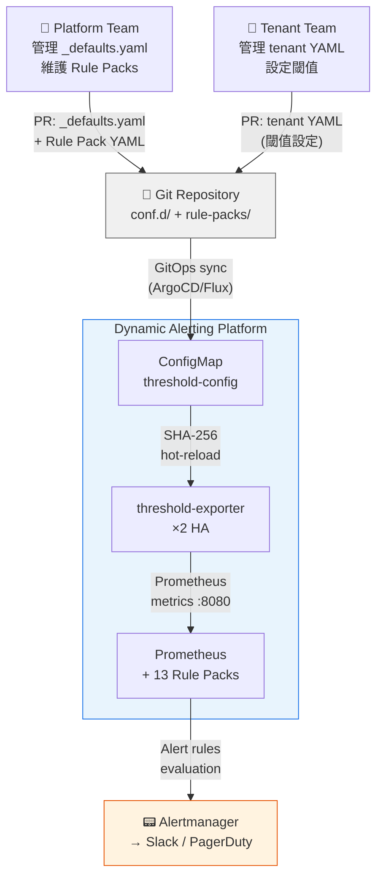
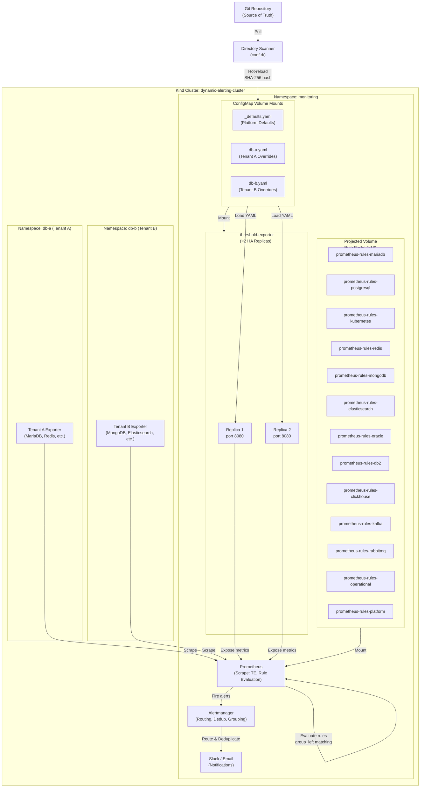
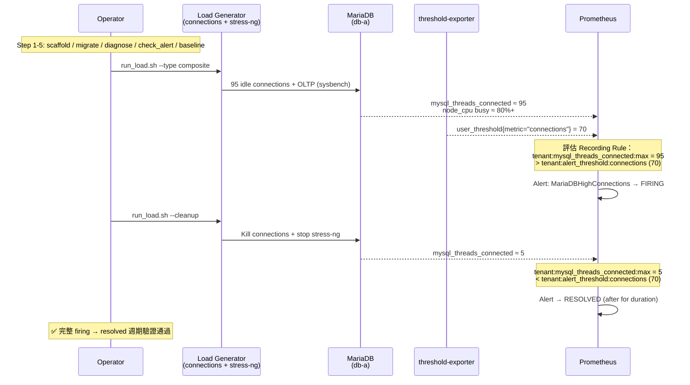
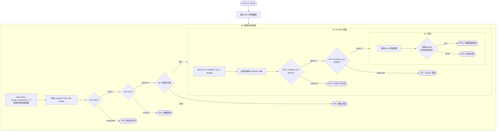
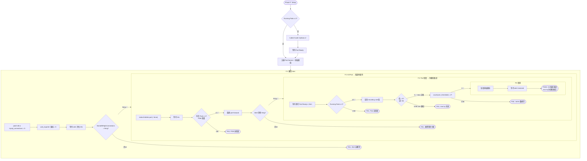
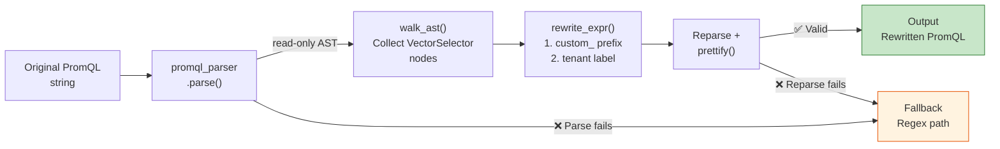

# 架構與設計 — 動態多租戶警報平台技術白皮書

> **Language / 語言：** [English](architecture-and-design.en.md) | **中文（當前）**

## 簡介

本文件針對 Platform Engineers 和 Site Reliability Engineers (SREs) 深入探討「多租戶動態警報平台」(Multi-Tenant Dynamic Alerting Platform) v1.10.0 的技術架構。

**本文涵蓋內容：**
- 系統架構與核心設計理念（含 Regex 維度閾值、排程式閾值）
- Config-driven 配置驅動的工作流程
- Projected Volume 與 13 個規則包 (Rule Packs) 的治理模型
- 性能分析與擴展性証明（含 Under-Load 基準測試與 Go Micro-Benchmark）
- 高可用性 (HA) 設計
- 治理、稽核、安全性合規
- AST 遷移引擎架構

**其他相關文件：**
- **快速入門** → [README.md](../README.md)
- **遷移指南** → [migration-guide.md](migration-guide.md)
- **規則包文件** → [rule-packs/README.md](../rule-packs/README.md)
- **threshold-exporter 元件** → [components/threshold-exporter/README.md](../components/threshold-exporter/README.md)

---

## 1. 系統架構圖 (System Architecture Diagram)

### 1.1 C4 Context — 系統邊界與角色互動


```mermaid
graph TB
    PT["👤 Platform Team<br/>管理 _defaults.yaml<br/>維護 Rule Packs"]
    TT["👤 Tenant Team<br/>管理 tenant YAML<br/>設定閾值"]
    Git["📂 Git Repository<br/>conf.d/ + rule-packs/"]

    subgraph DAP["Dynamic Alerting Platform"]
        TE["threshold-exporter<br/>×2 HA"]
        PM["Prometheus<br/>+ 13 Rule Packs"]
        CM["ConfigMap<br/>threshold-config"]
    end

    AM["📟 Alertmanager<br/>→ Slack / PagerDuty"]

    PT -->|"PR: _defaults.yaml<br/>+ Rule Pack YAML"| Git
    TT -->|"PR: tenant YAML<br/>(閾值設定)"| Git
    Git -->|"GitOps sync<br/>(ArgoCD/Flux)"| CM
    CM -->|"SHA-256<br/>hot-reload"| TE
    TE -->|"Prometheus<br/>metrics :8080"| PM
    PM -->|"Alert rules<br/>evaluation"| AM

    style DAP fill:#e8f4fd,stroke:#1a73e8
    style Git fill:#f0f0f0,stroke:#666
    style AM fill:#fff3e0,stroke:#e65100
```

### 1.2 系統內部架構 (Internal Architecture)


```mermaid
graph TB
    subgraph Cluster["Kind Cluster: dynamic-alerting-cluster"]
        subgraph TenantA["Namespace: db-a (Tenant A)"]
            ExpA["Tenant A Exporter<br/>(MariaDB, Redis, etc.)"]
        end

        subgraph TenantB["Namespace: db-b (Tenant B)"]
            ExpB["Tenant B Exporter<br/>(MongoDB, Elasticsearch, etc.)"]
        end

        subgraph Monitoring["Namespace: monitoring"]
            subgraph Config["ConfigMap Volume Mounts"]
                CfgDefault["_defaults.yaml<br/>(Platform Defaults)"]
                CfgTenantA["db-a.yaml<br/>(Tenant A Overrides)"]
                CfgTenantB["db-b.yaml<br/>(Tenant B Overrides)"]
            end

            subgraph Export["threshold-exporter<br/>(×2 HA Replicas)"]
                TE1["Replica 1<br/>port 8080"]
                TE2["Replica 2<br/>port 8080"]
            end

            subgraph Rules["Projected Volume<br/>Rule Packs (×13)"]
                RP1["prometheus-rules-mariadb"]
                RP2["prometheus-rules-postgresql"]
                RP3["prometheus-rules-kubernetes"]
                RP4["prometheus-rules-redis"]
                RP5["prometheus-rules-mongodb"]
                RP6["prometheus-rules-elasticsearch"]
                RP7["prometheus-rules-oracle"]
                RP8["prometheus-rules-db2"]
                RP9["prometheus-rules-clickhouse"]
                RP10["prometheus-rules-kafka"]
                RP11["prometheus-rules-rabbitmq"]
                RP12["prometheus-rules-operational"]
                RP13["prometheus-rules-platform"]
            end

            Prom["Prometheus<br/>(Scrape: TE, Rule Evaluation)"]
            AM["Alertmanager<br/>(Routing, Dedup, Grouping)"]
            Slack["Slack / Email<br/>(Notifications)"]
        end
    end

    Git["Git Repository<br/>(Source of Truth)"]
    Scanner["Directory Scanner<br/>(conf.d/)"]

    Git -->|Pull| Scanner
    Scanner -->|Hot-reload<br/>SHA-256 hash| Config
    Config -->|Mount| Export
    ExpA -->|Scrape| Prom
    ExpB -->|Scrape| Prom
    Config -->|Load YAML| TE1
    Config -->|Load YAML| TE2
    TE1 -->|Expose metrics| Prom
    TE2 -->|Expose metrics| Prom
    Rules -->|Mount| Prom
    Prom -->|Evaluate rules<br/>group_left matching| Prom
    Prom -->|Fire alerts| AM
    AM -->|Route & Deduplicate| Slack
```

**架構要點：**
1. **Directory Scanner** 掃描 `conf.d/` 目錄，自動發現 `_defaults.yaml` 和租戶配置文件
2. **threshold-exporter × 2 HA Replicas** 讀取 ConfigMap，輸出三態 Prometheus 指標
3. **Projected Volume** 掛載 13 個獨立規則包，零 PR 衝突，各團隊獨立擁有
4. **Prometheus** 使用 `group_left` 向量匹配與用戶閾值進行聯接，實現 O(M) 複雜度（相比傳統 O(M×N)：100 metric × 50 tenant = 5,000 條規則 vs 固定 100 條）

---

## 2. 核心設計：Config-Driven 架構

### 2.1 三態邏輯 (Three-State Logic)

平台支援「三態」配置模式，提供靈活的預設值、覆蓋和禁用機制：

| 狀態 | 配置方式 | Prometheus 輸出 | 說明 |
|------|---------|-----------------|------|
| **Custom Value** | `metric_key: 42` | ✓ 輸出自訂閾值 | 租戶覆蓋預設值 |
| **Omitted (Default)** | 未在 YAML 中指定 | ✓ 輸出平台預設值 | 使用 `_defaults.yaml` |
| **Disable** | `metric_key: "disable"` | ✗ 不輸出 | 完全禁用該指標 |

**Prometheus 輸出示例：**

```
# Custom value (db-a 租戶)
user_threshold{tenant="db-a", metric="mariadb_replication_lag", severity="warning"} 10

# Default value (db-b 租戶，未覆蓋)
user_threshold{tenant="db-b", metric="mariadb_replication_lag", severity="warning"} 30

# Disabled (無輸出)
# (metric not present)
```

### 2.2 Directory Scanner 模式 (conf.d/)

**層次結構：**
```
conf.d/
├── _defaults.yaml         # Platform 全局預設值（Platform 團隊管理）
├── db-a.yaml             # 租戶 A 覆蓋（db-a 團隊管理）
├── db-b.yaml             # 租戶 B 覆蓋（db-b 團隊管理）
└── ...
```

**`_defaults.yaml` 內容（Platform 管理）：**
```yaml
defaults:
  mysql_connections: 80
  mysql_cpu: 80
  container_cpu: 80
  container_memory: 85

state_filters:
  container_crashloop:
    reasons: ["CrashLoopBackOff"]
    severity: "critical"
  maintenance:
    reasons: []
    severity: "info"
    default_state: "disable"
```

**`db-a.yaml` 內容（租戶覆蓋）：**
```yaml
tenants:
  db-a:
    mysql_connections: "70"          # 覆蓋預設值 80
    container_cpu: "70"              # 覆蓋預設值 80
    mysql_slave_lag: "disable"       # 無 replica，停用
    # mysql_cpu 未指定 → 使用預設值 80
    # 維度標籤
    "redis_queue_length{queue='tasks'}": "500"
    "redis_queue_length{queue='events', priority='high'}": "1000:critical"
```

#### 邊界強制規則 (Boundary Enforcement)

| 檔案類型 | 允許的區塊 | 違規行為 |
|----------|-----------|---------|
| `_` 前綴檔 (`_defaults.yaml`) | `defaults`, `state_filters`, `tenants` | — |
| 租戶檔 (`db-a.yaml`) | 僅 `tenants` | 其他區塊自動忽略 + WARN log |

#### SHA-256 熱重新加載 (Hot-Reload)

不依賴檔案修改時間 (ModTime)，而是基於 **SHA-256 內容雜湊**：

```bash
# 每次 ConfigMap 更新時
$ sha256sum conf.d/_defaults.yaml conf.d/db-a.yaml conf.d/db-b.yaml
abc123... conf.d/_defaults.yaml
def456... conf.d/db-a.yaml
ghi789... conf.d/db-b.yaml

# Prometheus 掛載的 ConfigMap 符號鏈接會旋轉
# 舊的雜湊值 → 新的雜湊值
# threshold-exporter 偵測到變化，重新載入配置
```

**為什麼 SHA-256 而不是 ModTime？**
- Kubernetes ConfigMap 會建立符號鏈接層，ModTime 不可靠
- 內容相同 = 雜湊相同，避免不必要的重新加載

### 2.3 Tenant-Namespace 映射模式 (Tenant-Namespace Mapping)

平台的 `tenant` 是**邏輯身分**，由兩個獨立來源決定：

1. **閾值側**：threshold-exporter 從 YAML config key（`tenants.db-a`）取得 tenant，與 K8s namespace 零耦合
2. **資料側**：Prometheus `relabel_configs` 將抓取到的指標注入 `tenant` 標籤

兩側的 `tenant` 值必須精確匹配，但**來源可以不同**。這使得以下三種映射模式都可行：

| 映射模式 | 說明 | Prometheus relabel 策略 | 適用場景 |
|---------|------|------------------------|---------|
| **1:1**（標準） | 一個 Namespace = 一個 Tenant | `source_labels: [__meta_kubernetes_namespace]` → `target_label: tenant` | 大多數部署 |
| **N:1** | 多個 Namespace 視為同一 Tenant | 多個 namespace 的指標 relabel 到同一個 tenant 值 | 讀寫分離（`db-a-read` + `db-a-write` → `db-a`） |
| **1:N** | 一個 Namespace 內多個 Tenant | 以 Service label/annotation 而非 namespace 作為 tenant 來源 | 共享 namespace 的多租戶架構 |

**N:1 relabel 範例**（多 namespace → 一個 tenant）：

```yaml
relabel_configs:
  - source_labels: [__meta_kubernetes_namespace]
    action: keep
    regex: "db-a-(read|write)"
  # 統一映射為 db-a
  - source_labels: [__meta_kubernetes_namespace]
    target_label: tenant
    regex: "(db-[^-]+).*"    # 擷取第一段作為 tenant
    replacement: "$1"
```

**1:N relabel 範例**（一個 namespace → 多個 tenant）：

```yaml
relabel_configs:
  - source_labels: [__meta_kubernetes_namespace]
    action: keep
    regex: "shared-db"
  # 從 Service annotation 讀取 tenant 身分
  - source_labels: [__meta_kubernetes_service_annotation_alerting_tenant]
    target_label: tenant
```

**自動化工具**：`scaffold_tenant.py --namespaces ns1,ns2` 可自動產出 N:1 relabel_configs snippet，並在 tenant YAML 中寫入 `_namespaces` 元資料欄位供工具參考（不影響 metric 邏輯）。

**設計原則**：平台核心（threshold-exporter + Rule Packs）完全不感知 namespace 結構。映射彈性完全由 Prometheus scrape config 提供，無需修改平台任何元件。詳見 [BYO Prometheus 整合指南](byo-prometheus-integration.md)。

### 2.4 多層嚴重度 (Multi-tier Severity)

支援 `_critical` 後綴與 `"value:severity"` 兩種語法：

**方式一：`_critical` 後綴（適用於基本閾值）**
```yaml
tenants:
  db-a:
    mysql_connections: "100"            # warning 閾值
    mysql_connections_critical: "150"   # _critical → 自動產生 critical alert
```

**方式二：`"value:severity"` 語法（適用於維度標籤）**
```yaml
tenants:
  redis-prod:
    "redis_queue_length{queue='orders'}": "500:critical"
```

**Prometheus 輸出：**
```
user_threshold{tenant="db-a", component="mysql", metric="connections", severity="warning"} 100
user_threshold{tenant="db-a", component="mysql", metric="connections", severity="critical"} 150
```

#### 自動抑制 (Auto-Suppression)

平台 Alert Rule 使用 `unless` 邏輯，critical 觸發時自動抑制 warning：

```yaml
- alert: MariaDBHighConnections          # warning
  expr: |
    ( tenant:mysql_threads_connected:max > on(tenant) group_left tenant:alert_threshold:connections )
    unless on(tenant) (user_state_filter{filter="maintenance"} == 1)
    unless on(tenant)                    # ← Auto-Suppression：critical 觸發時抑制 warning
    ( tenant:mysql_threads_connected:max > on(tenant) group_left tenant:alert_threshold:connections_critical )
- alert: MariaDBHighConnectionsCritical  # critical
  expr: |
    ( tenant:mysql_threads_connected:max > on(tenant) group_left tenant:alert_threshold:connections_critical )
    unless on(tenant) (user_state_filter{filter="maintenance"} == 1)
```

**結果：**（雙層 `unless` 邏輯）
- 連線數 ≥ 150 (critical)：warning 被第二層 `unless` 抑制，只觸發 critical 警報
- 連線數 100–150 (warning only)：第二層 `unless` 不成立，正常觸發 warning 警報

### 2.5 Regex 維度閾值 (Regex Dimension Thresholds)

v0.12.0 起，Config parser 支援 `=~` 運算子，允許以 regex 模式精細匹配維度標籤。此設計在不引入外部資料依賴的前提下，讓閾值配置可針對特定維度子集生效。

**配置語法：**
```yaml
tenants:
  db-a:
    # 精確匹配
    "oracle_tablespace_used_percent{tablespace='USERS'}": "85"
    # Regex 匹配：所有 SYS 開頭的 tablespace
    "oracle_tablespace_used_percent{tablespace=~'SYS.*'}": "95"
```

**實現路徑：**

1. **Exporter 層**：Config parser 偵測 `=~` 運算子，將 regex pattern 作為 `_re` 後綴 label 輸出
   ```
   user_threshold{tenant="db-a", metric="oracle_tablespace_used_percent",
                  tablespace_re="SYS.*", severity="warning"} 95
   ```
2. **Recording Rule 層**：PromQL 使用 `label_replace` + `=~` 在查詢時完成實際匹配
3. **設計原則**：Exporter 保持為純 config→metric 轉換器，匹配邏輯完全由 Prometheus 原生向量運算執行

### 2.6 排程式閾值 (Scheduled Thresholds)

v0.12.0 起，閾值支援時間窗口排程，允許在不同時段自動切換不同閾值。典型場景：夜間維護窗口放寬閾值、尖峰時段收緊閾值。

**配置語法：**
```yaml
tenants:
  db-a:
    mysql_connections:
      default: "100"
      overrides:
        - window: "22:00-06:00"    # UTC 夜間窗口（支援跨午夜）
          value: "200"             # 夜間批次作業，放寬到 200
        - window: "09:00-18:00"
          value: "80"              # 日間高峰，收緊到 80
```

**技術實現：**

- **`ScheduledValue` 自訂 YAML 型別**：支援雙格式解析——純量字串（向後相容）和結構化 `{default, overrides[{window, value}]}`
- **`ResolveAt(now time.Time)`**：根據當前 UTC 時間解析應使用的閾值，確保確定性與可測試性
- **時間窗口格式**：`HH:MM-HH:MM` (UTC)，支援跨午夜（如 `22:00-06:00` 表示晚上十點到隔天早上六點）
- **45 個測試案例**：覆蓋邊界條件——窗口重疊、跨午夜、純量退化、空 overrides

### 2.7 三態運營模式 (Operational Modes)

v1.2.0 新增 **Silent Mode**，與既有的 Maintenance Mode 形成三態運營模式，解決「使用者把 Maintenance Mode 當靜音用」的問題。

**行為矩陣**

| 運營狀態 | 語義 | Alert 觸發 | TSDB 紀錄 | 通知 | 控制層 |
|---------|------|-----------|----------|------|--------|
| Normal | 正常運行 | ✅ | ✅ | ✅ | — |
| Silent | 靜音 | ✅ | ✅ | ❌ | Alertmanager |
| Maintenance | 真正維護 | ❌ | ❌ | ❌ | Prometheus (PromQL) |

**設計原則**：Prometheus 管「什麼該 alert」，Alertmanager 管「要不要通知」。

- **Maintenance Mode**（既有）：在 PromQL 層透過 `unless on(tenant) (user_state_filter{filter="maintenance"} == 1)` 消滅 alert。Alert 不觸發，TSDB 無紀錄，無通知。
- **Silent Mode**（v1.2.0）：Alert 在 Prometheus 正常觸發（TSDB 有 `ALERTS` 紀錄），但 Alertmanager 透過 `inhibit_rules` 攔截通知。

**Silent Mode 資料流**

```
tenant YAML: _silent_mode: "warning"
    ↓
threshold-exporter: user_silent_mode{tenant="db-a", target_severity="warning"} 1
    ↓
Prometheus alert rule (rule-pack-operational.yaml):
    TenantSilentWarning{tenant="db-a"} fires
    ↓
Alertmanager inhibit_rules:
    source: alertname="TenantSilentWarning"
    target: severity="warning", equal: ["tenant"]
    ↓
結果: db-a 的 warning alert 照常觸發（TSDB 有紀錄），但通知被攔截
```

**Tenant 配置**

```yaml
tenants:
  db-a:
    _silent_mode: "warning"    # 只靜音 warning 通知
  db-b:
    _silent_mode: "all"        # 靜音 warning + critical 通知
  db-c:
    _state_maintenance: "enable"  # 真正維護，完全不觸發 alert
  db-d: {}                        # Normal — 預設行為
```

可用的 `_silent_mode` 值：`warning`、`critical`、`all`、`disable`。未設定等同 Normal。

**自動失效 (v1.7.0)**：`_silent_mode` 和 `_state_maintenance` 支援結構化物件（向後相容純量字串），帶 `expires` ISO8601 時戳。Go 引擎 `time.Now().After(expires)` 過期即停止 emit sentinel metric，alert 自動恢復正常。失效時產出瞬時 gauge `da_config_event{event="silence_expired"}` 搭配 `TenantConfigEvent` alert rule 通知。

```yaml
tenants:
  db-a:
    _silent_mode:
      target: "all"
      expires: "2026-04-01T00:00:00Z"
      reason: "Migration shadow monitoring period"
    _state_maintenance:
      target: "all"
      expires: "2026-04-01T00:00:00Z"
      reason: "Scheduled maintenance window"
```

**Alertmanager inhibit_rules 範本**

```yaml
inhibit_rules:
  # Severity Dedup: per-tenant inhibit rules (由 generate_alertmanager_routes.py 產出)
  # 僅 _severity_dedup: "enable" (預設) 的 tenant 會產出規則
  # _severity_dedup: "disable" 的 tenant 不會有對應規則 → 兩種通知都收到
  - source_matchers:
      - severity="critical"
      - metric_group=~".+"
      - tenant="db-a"
    target_matchers:
      - severity="warning"
      - metric_group=~".+"
      - tenant="db-a"
    equal: ["metric_group"]

  # Silent Mode: 壓制 warning 通知
  - source_matchers:
      - alertname="TenantSilentWarning"
    target_matchers:
      - severity="warning"
    equal: ["tenant"]

  # Silent Mode: 壓制 critical 通知
  - source_matchers:
      - alertname="TenantSilentCritical"
    target_matchers:
      - severity="critical"
    equal: ["tenant"]
```

### 2.8 Severity Dedup（嚴重度去重）

v1.2.0 新增 **Severity Dedup**，解決「critical 觸發時 warning 的 TSDB 紀錄被消滅」的問題。

**設計變更**：Auto-Suppression 從 PromQL 層（`unless critical`）移至 Alertmanager 層（`inhibit_rules`）。TSDB 永遠同時記錄 warning 和 critical，dedup 只控制通知行為。

**Per-Tenant 控制機制**

v1.2.0 採用 per-tenant inhibit rules 實現可選化：

1. `generate_alertmanager_routes.py` 掃描所有 tenant YAML 的 `_severity_dedup` 設定
2. 對每個 dedup enabled 的 tenant 產出一條專屬 inhibit rule（帶 `tenant="<name>"` matcher）
3. `_severity_dedup: "disable"` 的 tenant 不產出 rule → 兩種通知都收到
4. Exporter 仍輸出 `user_severity_dedup{tenant, mode}` metric → Prometheus sentinel `TenantSeverityDedupEnabled` 供 Grafana 面板顯示各 tenant dedup 狀態

**行為矩陣**

| 設定 | TSDB warning | TSDB critical | Warning 通知 | Critical 通知 |
|------|-------------|--------------|-------------|--------------|
| `_severity_dedup: "enable"`（預設） | ✅ | ✅ | ❌ 被 AM 攔截 | ✅ |
| `_severity_dedup: "disable"` | ✅ | ✅ | ✅ | ✅ |

**配對機制**：Alert rule 的 `metric_group` label 讓 Alertmanager 正確配對 warning/critical（因為兩者 alertname 不同）。例如 `MariaDBHighConnections` 和 `MariaDBHighConnectionsCritical` 共享 `metric_group: "connections"`。每條 per-tenant inhibit rule 限定 `metric_group=~".+"` 確保無 `metric_group` 的 alert（如 `MariaDBDown`）不會參與 dedup。

**Tenant 配置**

```yaml
tenants:
  db-a: {}                                # 預設 enable — warning 被壓制
  db-b:
    _severity_dedup: "disable"           # 兩種通知都收到
```

**產出 Alertmanager 設定**

```bash
python3 scripts/tools/generate_alertmanager_routes.py --config-dir conf.d/ --dry-run
# 輸出包含 per-tenant inhibit_rules section，合併至 Alertmanager config
```

### 2.9 Alert Routing 客製化 (Config-Driven Routing)

Tenant 可透過 `_routing` section 自主管理通知目的地、分群策略與時序控制。平台工具 `generate_alertmanager_routes.py` 讀取所有 tenant YAML，產出 Alertmanager route + receiver + inhibit_rules YAML fragment。

> v1.4.0 支援 webhook / email / slack / teams / rocketchat / pagerduty 六種 receiver type。Receiver 為結構化物件（`{type, ...fields}`），由 `generate_alertmanager_routes.py` 驗證必要欄位並產出對應 Alertmanager config。

**Schema**

```yaml
tenants:
  db-a:
    _routing:
      receiver:                                         # required — 結構化物件
        type: "webhook"                                 #   type: webhook/email/slack/teams/rocketchat/pagerduty
        url: "https://webhook.db-a.svc/alerts"
      group_by: ["alertname", "severity"]               # optional
      group_wait: "30s"                                  # optional, guardrail 5s–5m
      group_interval: "1m"                               # optional, guardrail 5s–5m
      repeat_interval: "4h"                              # optional, guardrail 1m–72h
      overrides: []                                      # optional, per-rule routing (§2.10)
```

**Timing Guardrails**

平台對時序參數設定硬性上下界，超限值自動 clamp 並發出 WARN log：

| 參數 | 最小值 | 最大值 | 預設值 |
|------|--------|--------|--------|
| `group_wait` | 5s | 5m | 30s |
| `group_interval` | 5s | 5m | 5m |
| `repeat_interval` | 1m | 72h | 4h |

**與 Silent Mode 的交互**

Silent Mode 天然 bypass routing：Alertmanager 的 inhibit_rules 在 route evaluation 之前攔截通知。因此即使 tenant 配置了自訂 routing，silent 的 alert 仍不會送出通知。

**工具鏈**

```bash
# 預覽模式
python3 scripts/tools/generate_alertmanager_routes.py \
  --config-dir conf.d/ --dry-run

# 產出 fragment + CI 驗證
python3 scripts/tools/generate_alertmanager_routes.py \
  --config-dir conf.d/ -o alertmanager-routes.yaml --validate \
  --policy .github/custom-rule-policy.yaml

# 一站式合併至 Alertmanager ConfigMap + reload
python3 scripts/tools/generate_alertmanager_routes.py \
  --config-dir conf.d/ --apply --yes
```

`--validate` 檢查 YAML 合法性 + webhook domain allowlist（exit 0/1，供 CI 消費）。`--apply` 直接合併 fragment 至 Alertmanager ConfigMap 並觸發 reload。產出支援 webhook、email、slack、teams、rocketchat、pagerduty 六種 receiver type。

### 2.10 Per-rule Routing Overrides

v1.8.0 新增 **Per-rule Routing Overrides** 功能，允許 tenant 針對特定 alert 或 metric group 指定不同的 receiver（例如：DBA 特定 alert 走 PagerDuty，其餘走 Slack）。

**YAML 設定範例：**

```yaml
tenants:
  db-a:
    _routing:
      receiver:
        type: slack
        api_url: "https://hooks.slack.com/services/..."
      overrides:
        - alertname: "MariaDBReplicationLag"
          receiver:
            type: pagerduty
            service_key: "abc123"
        - metric_group: "redis"
          receiver:
            type: webhook
            url: "https://oncall.example.com/redis"
```

**設計規則：**

- 每個 override 必須指定 `alertname` 或 `metric_group`（二擇一，不可同時設定）
- override receiver 走同一個 `build_receiver_config()` 驗證 + domain allowlist 檢查
- `expand_routing_overrides()` 產出的子路由插入在 tenant 主路由之前，確保 Alertmanager 優先匹配 override
- Timing parameters（`group_wait`、`group_interval`、`repeat_interval`）可在 override 層級覆寫，同樣受平台 guardrails 約束

### 2.11 Platform Enforced Routing（v1.7.0）

Platform Team 可在 `_defaults.yaml` 設定 `_routing_enforced`，在所有 tenant route 之前插入平台路由（帶 `continue: true`），實現「NOC 必收 + tenant 也收」雙軌通知：

```yaml
# _defaults.yaml
_routing_enforced:
  enabled: true
  receiver:
    type: "webhook"
    url: "https://noc.example.com/alerts"
  match:
    severity: "critical"    # 僅 critical 送 NOC
```

`generate_alertmanager_routes.py` 在 tenant route 之前插入 platform route。預設不啟用，Platform Team 按需開啟。詳見 [BYO Alertmanager 整合指南 §8](byo-alertmanager-integration.md#8-platform-enforced-routingv170)。

---

## 3. Projected Volume 架構 (Rule Packs)

### 3.1 十三個獨立規則包

| Rule Pack | 擁有團隊 | ConfigMap 名稱 | Recording Rules | Alert Rules |
|-----------|---------|-----------------|----------------|-------------|
| MariaDB | DBA | `prometheus-rules-mariadb` | 11 | 8 |
| PostgreSQL | DBA | `prometheus-rules-postgresql` | 12 | 6 |
| Kubernetes | Infra | `prometheus-rules-kubernetes` | 7 | 4 |
| Redis | Cache | `prometheus-rules-redis` | 11 | 6 |
| MongoDB | AppData | `prometheus-rules-mongodb` | 10 | 6 |
| Elasticsearch | Search | `prometheus-rules-elasticsearch` | 11 | 7 |
| Oracle | DBA / Oracle | `prometheus-rules-oracle` | 11 | 7 |
| DB2 | DBA / DB2 | `prometheus-rules-db2` | 12 | 7 |
| ClickHouse | Analytics | `prometheus-rules-clickhouse` | 12 | 7 |
| Kafka | Messaging | `prometheus-rules-kafka` | 10 | 5 |
| RabbitMQ | Messaging | `prometheus-rules-rabbitmq` | 11 | 6 |
| Operational | Platform | `prometheus-rules-operational` | 0 | 4 |
| Platform | Platform | `prometheus-rules-platform` | 0 | 4 |
| **總計** | | | **118** | **77** |

### 3.2 自包含三部分結構

每個 Rule Pack 包含三個獨立且可複用的部分：

#### Part 1：標準化記錄規則 (Normalization Recording Rules)
```yaml
groups:
  - name: mariadb-normalization
    rules:
      # 正規化命名：tenant:<component>_<metric>:<function>
      - record: tenant:mysql_threads_connected:max
        expr: max by(tenant) (mysql_global_status_threads_connected)

      - record: tenant:mysql_slow_queries:rate5m
        expr: sum by(tenant) (rate(mysql_global_status_slow_queries[5m]))
```

**目的：** 將不同匯出器的原始指標正規化為統一命名空間 `tenant:<metric>:<function>`

#### Part 2：閾值標準化 (Threshold Normalization)
```yaml
groups:
  - name: mariadb-threshold-normalization
    rules:
      - record: tenant:alert_threshold:connections
        expr: max by(tenant) (user_threshold{metric="connections", severity="warning"})

      - record: tenant:alert_threshold:connections_critical
        expr: max by(tenant) (user_threshold{metric="connections", severity="critical"})
```

**關鍵：** 使用 `max by(tenant)` 而非 `sum`，防止 HA 雙倍計算（詳見第 5.3 節）

#### Part 3：警報規則 (Alert Rules)
```yaml
groups:
  - name: mariadb-alerts
    rules:
      - alert: MariaDBHighConnections
        expr: |
          (
            tenant:mysql_threads_connected:max
            > on(tenant) group_left
            tenant:alert_threshold:connections
          )
          unless on(tenant) (user_state_filter{filter="maintenance"} == 1)
        for: 5m
        labels:
          severity: warning
        annotations:
          summary: "MariaDB connections {{ $value }} exceeds threshold ({{ $labels.tenant }})"
```

### 3.3 優點

1. **零 PR 衝突** — 各 ConfigMap 獨立，不同團隊可並行推送
2. **團隊自主** — DBA 擁有 MariaDB 規則，不需要中央平台審核
3. **可複用** — 規則可輕鬆移植至其他 Prometheus 叢集
4. **獨立測試** — 每個包可獨立驗證和發布

---

## 4. 性能分析 (Performance Analysis) — 核心優勢

### 4.1 向量匹配複雜度分析

**傳統方法（多租戶硬編碼）：**
```
N 個租戶 × M 個警報規則 = N×M 個獨立 PromQL 評估
複雜度：O(N×M)

範例：100 個租戶，35 個警報規則
= 3,500 個獨立規則評估
```

**動態方法（向量匹配 `group_left`）：**
```
M 個警報規則 × 1 次向量匹配 = M 個評估
複雜度：O(M)，與租戶數量無關

範例：100 個租戶，35 個警報規則
= 35 個規則評估（不論租戶數量）
```

### 4.2 實際基準數據 (Kind 叢集量測)

**現有設置：2 個租戶，141 個規則（9 Rule Packs），27 個規則群組**

> 以下數據取自 **5 輪獨立量測**（Kind 單節點叢集，各輪間隔 45 秒），報告 mean ± stddev。

```
總評估時間（per cycle）: 20.3 ± 1.9ms  (range: 17.7–22.8ms, n=5)
- p50 (50th percentile):  1.23 ± 0.28ms per group
- p99 (99th percentile):  6.89 ± 0.44ms per group
```

**擴展性對比：**

| 指標 | 現有（2 租戶） | 傳統方案（100 租戶） | 動態方案（100 租戶） |
|------|-------|-------------------|------------------|
| 警報規則數 | 56（固定） | 5,600（56×100） | 56（固定） |
| 記錄規則數 | 85（正規化） | 0（嵌入在警報中） | 85（固定） |
| **規則總數** | **141** | **5,600** | **141** |
| 評估複雜度 | O(M) | O(N×M) | O(M) |
| **估計評估時間** | **~20ms** | **~800ms+** | **~20ms** |

**結論：**
- 傳統方案在 100 租戶時評估時間增加 **40 倍**
- 動態方案評估時間 **恆定**，線性擴展

### 4.3 空向量零成本 (Empty Vector Zero-Cost)

所有規則包預加載（benchmark 時為 9 個，v1.8.0 已擴展至 13 個）。未部署匯出器的包針對空向量評估。

**Kind 叢集實際測量：**

| Rule Pack | 狀態 | 規則數 | 評估時間 | 備註 |
|-----------|------|--------|---------|------|
| MariaDB | ✓ 活躍 | 7 | **2.12ms** | 有匯出器 |
| MongoDB | ✗ 無匯出器 | 7 | **0.64ms** | 空向量 |
| Redis | ✗ 無匯出器 | 7 | **0.41ms** | 空向量 |
| Elasticsearch | ✗ 無匯出器 | 7 | **1.75ms** | 複雜 PromQL，仍低成本 |

**結論：**
- 空向量操作近似 O(1)
- 預加載未使用的規則包開銷 **可忽視**（< 1ms）
- 新租戶上線時，所有規則自動適用，**無需重新部署**

### 4.4 記憶體效率

> 以下數據取自 **5 輪獨立量測** mean ± stddev。

```
單個 threshold-exporter Pod（實測）：
- Heap 記憶體：2.4 ± 0.4MB（YAML 解析 + 指標生成）
- 輸出指標：~8 user_threshold series（2 個租戶）
- Scrape Duration：4.1 ± 1.2ms

× 2 HA Replicas：~4.8MB 合計
+ Prometheus RSS：142.7 ± 1.4MB（含 9 Rule Packs、141 條規則）
= 叢集開銷：~148MB

vs. 傳統方案 (5,600 規則 @ 100 租戶)：
- Prometheus 規則快取：~500MB+
- 總開銷：~600MB+（單樞紐）
```

### 4.5 資源使用基準 (Resource Usage Baseline)

以下為 Kind 單節點叢集 5 輪實測數據（2 個租戶、141 條規則、9 Rule Packs，mean ± stddev）：

| 指標 | 元件 | 數值 (n=5) | 用途 |
|------|------|------|------|
| CPU（5m 均值） | Prometheus | ~0.014 ± 0.003 cores | 容量規劃 — 評估 Prometheus 所需 CPU request |
| RSS Memory | Prometheus | 142.7 ± 1.4MB | 記憶體預算 — 設定 memory limits |
| Heap Memory | threshold-exporter (per pod) | 2.4 ± 0.4MB | Pod resource limits 調整 |
| Scrape Duration | Prometheus → exporter | 4.1 ± 1.2ms | 抓取效能基線 |

**自動化收集：**

```bash
make benchmark          # 完整報告（人類可讀）
make benchmark ARGS=--json  # JSON 輸出（CI/CD 消費）
```

### 4.6 儲存與基數分析 (Storage & Cardinality)

**為什麼基數（Cardinality）比磁碟更重要？**

Prometheus 的效能瓶頸在於 **活躍時間序列數（Active Series）**，而非磁碟空間。每個 series 佔用約 2KB 記憶體，series 數直接決定：查詢延遲、記憶體用量、compaction 頻率。

**Kind 叢集實測：**

| 指標 | 數值 | 說明 |
|------|------|------|
| TSDB 磁碟用量 | 8.9 ± 0.2MB | 含所有規則與指標（n=5） |
| 活躍 Series 總數 | ~6,037 ± 10 | 包含所有 exporter + recording rules（n=5） |
| `user_threshold` Series | 8 | threshold-exporter 輸出的閾值指標 |
| 每租戶 Series 增量 | ~4 | 新增 1 個租戶的邊際成本 |

**擴展估算公式：**

```
新增 N 個租戶的邊際成本：
  Series 增量 = N × (每租戶 series 數)
  記憶體增量 ≈ Series 增量 × 2KB

範例（100 租戶）：
  user_threshold series = 100 × 4 = 400
  記憶體增量 ≈ (400 - 8) × 2KB ≈ 0.8MB
  總 series ≈ 6,037 - 8 + 400 = 6,429
```

**結論：** 動態架構的 series 增量極小（每租戶 ~4 series），100 個租戶僅增加 ~0.8MB 記憶體。相比傳統方案（每租戶 56+ 條獨立規則，每條規則可能產生多個 series），基數優勢顯著。

### 4.7 Under-Load 基準測試 (Benchmark Under-Load Mode)

v0.13.0 新增 `--under-load` 模式，在合成租戶負載下驗證平台擴展性。idle-state 基準只量測空閒效能，under-load 模式則模擬真實的多租戶環境。

**測試方法論：**
```bash
make benchmark ARGS="--under-load --tenants 1000"
```

1. **合成租戶生成**：動態建立 N 個 synthetic tenant 配置（scalar + mixed + night-window 組合）
2. **ConfigMap Patch**：將合成配置注入 `threshold-config` ConfigMap
3. **量測維度**：
   - **Reload Latency**：ConfigMap 變更到 exporter 完成重載的時間
   - **Memory Delta**：新增 N 個租戶後的 RSS 記憶體變化
   - **Scrape Duration**：Prometheus 抓取 threshold-exporter 的時間
   - **Evaluation Time**：Recording rules + Alert rules 的評估時間
4. **清理**：自動移除合成租戶，回到原始狀態

**Go Micro-Benchmark：**

`config_bench_test.go` 提供精確的 Go 層面效能量測（Intel Core 7 240H，`-count=5` 取中位數）：

| Benchmark | ns/op (median) | ns/op (stddev) | B/op | allocs/op |
|-----------|------:|------:|-----:|----------:|
| Resolve_10Tenants_Scalar | 11,570 | 237 | 26,032 | 58 |
| Resolve_100Tenants_Scalar | 107,346 | 4,315 | 196,080 | 511 |
| Resolve_1000Tenants_Scalar | 2,215,080 | 113,589 | 3,739,792 | 5,019 |
| ResolveAt_10Tenants_Mixed | 39,487 | 1,720 | 39,491 | 268 |
| ResolveAt_100Tenants_Mixed | 419,960 | 18,120 | 454,366 | 2,612 |
| ResolveAt_1000Tenants_Mixed | 4,882,962 | 105,810 | 5,160,416 | 26,038 |
| ResolveAt_NightWindow_1000 | 4,887,959 | 123,943 | 5,123,590 | 25,037 |

**結論：** 10→100→1000 租戶，Scalar resolve 的 ns/op 呈線性增長（~10x / ~19x），記憶體也線性（26KB→196KB→3.7MB）。Mixed（含 ScheduledValue）的額外開銷約 3.4× Scalar。1000 租戶的完整 resolve 仍在 5ms 以內。5 輪量測的 stddev 控制在中位數的 2–5% 內，確認結果穩定可重現。

> **與 §4.2 的關係：** §4.2 量測的是 **Prometheus 規則評估**——由於規則數固定為 O(M)，評估時間不隨租戶數增長（2 租戶 ~20ms ≈ 100 租戶 ~20ms）。本節量測的是 **threshold-exporter 設定解析**——每多一個租戶就多一份設定要 resolve，因此成本為 O(N) 線性增長。兩者互補：平台最關鍵的瓶頸（規則評估）恆定不變，次要成本（設定解析）雖線性增長，但 1000 租戶仍僅 ~5ms，遠低於 Prometheus 15 秒抓取週期，對端到端效能影響可忽略。

### 4.8 Rule Evaluation Scaling Curve

量測 Rule Pack 數量對 Prometheus rule evaluation 時間的邊際影響。透過逐步移除 Rule Pack（9→6→3）並量測 `prometheus_rule_group_last_duration_seconds`，可觀察 evaluation 成本是否呈線性增長。

**測試方法：**
```bash
make benchmark ARGS="--scaling-curve"
```

1. **Tier 3 (9 packs)**：完整狀態（mariadb, kubernetes, redis, mongodb, elasticsearch, oracle, db2, clickhouse, platform）
2. **Tier 2 (6 packs)**：移除 oracle, db2, clickhouse
3. **Tier 1 (3 packs)**：僅保留 mariadb, kubernetes, platform

每個階段等待 Prometheus 完成至少 2 個 evaluation cycle 後取樣。測試結束自動還原所有 Rule Pack。

**Kind 叢集實測（2026-03-01，3 輪量測，報告 median）：**

| Rule Packs | Rule Groups | Total Rules | Eval Time (median) | Range |
|------------|-------------|-------------|-----------|-------|
| 3          | 9           | 34          | 7.7ms     | 3.3–15.3ms |
| 6          | 18          | 85          | 17.3ms    | 14.3–18.6ms |
| 9          | 27          | 141         | 22.7ms    | 8.7–26.0ms |

> **量測說明：** 每輪需刪除 Rule Pack → 重啟 Prometheus → 等待穩定 → 取樣，因此 per-cycle 值受 Prometheus 重啟暖機影響，變異較 idle-state 大。取 median 更能代表穩態行為。

**結論：** Rule Pack 從 3→6→9，eval time 中位數從 7.7→17.3→22.7ms，增長接近線性（每增加 3 packs 約 +5–10ms）。每個 group 的平均 eval time 穩定在 ~0.8ms，不受其他 group 影響。這確認了 Projected Volume 架構的水平擴展性 — 新增 Rule Pack 的邊際成本可預測且恆定。

### 4.9 Route Generation Scaling（Alertmanager 路由產出效能）

`generate_alertmanager_routes.py` 將所有 tenant YAML 轉換為 Alertmanager route + receiver + inhibit_rules fragment。隨租戶數增加，產出的 route tree 線性增長。此 benchmark 量測 route generation 的 wall time，確認 CI pipeline 和 `--apply` 的即時性不受租戶規模影響。

**測試方法：**
```bash
make benchmark ARGS="--routing-bench --tenants 100"
```

1. 以 `scaffold_tenant.py` 的 YAML 結構為基礎，產出 N 個合成 tenant 配置（含 6 種 receiver type 輪替、severity_dedup、每 5 個 tenant 帶 routing overrides）
2. 對每個 N（2, 10, 50, 100）執行 5 輪 `generate_alertmanager_routes.py --dry-run`，取 median wall time
3. 同步記錄產出的 YAML 行數、route 數、inhibit rule 數

**實測數據（10 輪取 median）：**

| Tenants | Wall Time (median) | Output Lines | Routes | Receivers | Inhibit Rules |
|---------|-------------------|--------------|--------|-----------|---------------|
| 2       | 94ms              | 72           | 3      | 3         | 2             |
| 10      | 118ms             | 209          | 8      | 8         | 10            |
| 50      | 245ms             | 994          | 41     | 41        | 50            |
| 100     | 298ms             | 1,943        | 80     | 80        | 100           |
| 200     | 397ms             | 3,884        | 161    | 161       | 200           |

> **合成 tenant 規格：** 6 種 receiver type 輪替（webhook/email/slack/teams/rocketchat/pagerduty），所有 tenant 啟用 `_severity_dedup`，每 5 個 tenant 帶 1 個 routing override。Wall time 包含 Python 啟動 + YAML 載入 + route 產出。

**結論：** 基礎開銷 ~80ms（Python 啟動 + import），之後每增加 100 個 tenant 約 +200ms。200 個 tenant 仍在 400ms 以內，遠低於 CI pipeline 容忍度（秒級）。Output lines 與 tenant 數嚴格線性（~19 lines/tenant），inhibit rules 數 = tenant 數（每個啟用 dedup 的 tenant 1 條 severity dedup rule）。

### 4.10 Alertmanager 通知效能（Notification Performance）

量測 Alertmanager 在動態路由配置下的運行時效能，重點在於 inhibit rule 評估和通知延遲。

**測試方法：**
```bash
make benchmark ARGS="--alertmanager-bench"
```

從 Prometheus 和 Alertmanager API 收集以下指標：

| 指標 | 來源 | 說明 |
|------|------|------|
| Notification Latency p99 | `alertmanager_notification_latency_seconds` | 從收到 alert 到發出通知的 99th percentile |
| Alerts Received (5m) | `alertmanager_alerts_received_total` | 5 分鐘內收到的 alert 數 |
| Notifications Sent (5m) | `alertmanager_notifications_total` | 5 分鐘內成功發送的通知數 |
| Notifications Failed (5m) | `alertmanager_notifications_failed_total` | 失敗的通知數 |
| Inhibited Alerts | `/api/v2/alerts` | 目前被 inhibit 的 alert 數（severity dedup + enforced routing） |
| Active Inhibit Rules | `/api/v2/status` | 配置中的 inhibit rule 總數 |

**Kind 叢集 Idle-State 實測（2 個 tenant，3 條 inhibit rules）：**

| 指標 | 數值 | 說明 |
|------|------|------|
| Active Inhibit Rules | 3 | 2 條 severity dedup（per-tenant）+ 1 條預設 |
| Active Alerts | 1 | 穩態下的 sentinel alert |
| Inhibited Alerts | 0 | 閒置時無 warning+critical 同時觸發 |
| Notification Latency p99 | N/A | 閒置時無通知活動（需搭配 `--under-load` 觸發 alert 量測） |

> **觀測說明：** Idle-state 下 Alertmanager 無通知活動，notification latency histogram 為空。完整的通知延遲量測需搭配 `make demo-full`（composite load → 觸發 alert → 觀察通知延遲）或 `--under-load` 模式。

**關鍵觀察：** Inhibited alerts / Alerts received 的比率反映 severity dedup 的有效性。正常運營下，每個啟用 dedup 的 tenant-metric_group 對，同時觸發 warning + critical 時，warning 應被 inhibit。3 條 inhibit rules（2 tenant × 1 severity dedup + 1 default）對 Alertmanager 的 route matching 效能影響可忽略。

### 4.11 Config Reload E2E 延遲

量測 Alertmanager 配置變更生效的端到端延遲。這條路徑決定了「tenant 改了 routing 設定後，多快生效」。

**測試方法：**
```bash
make benchmark ARGS="--reload-bench"
```

**量測路徑：**

```
Tenant YAML 變更
  → generate_alertmanager_routes.py --apply
    → kubectl patch ConfigMap
      → configmap-reload sidecar 偵測檔案變更
        → POST /-/reload
          → 新 route 生效
```

**Kind 叢集實測（5 輪取 median）：**

| 指標 | 數值 (median) | 說明 |
|------|--------------|------|
| `/-/reload` API | **0.3ms** | Alertmanager 自身 config reload（sub-millisecond） |
| `--apply` E2E | **763ms** | 完整路徑：route generation + `kubectl patch` + `/-/reload` |

**`--apply` E2E 5 輪明細：** 676ms, 707ms, **763ms**, 858ms, 956ms

**分解：**
- Route generation（2 tenants）：~94ms（§4.9 數據）
- `kubectl patch` ConfigMap + API server 回應：~500–700ms
- `/-/reload` API：~0.3ms
- 總和與量測一致（~763ms）

> **configmap-reload sidecar 說明：** sidecar 監聽的是 Projected Volume 的**檔案內容變更**，而非 ConfigMap annotation。`--apply` 模式直接更新 ConfigMap `data` 區段 + 觸發 `/-/reload`，因此不依賴 sidecar 的輪詢週期。若僅修改 annotation 而不改變 data，sidecar 不會偵測到變更。

**結論：** 完整的「tenant 改了 routing → Alertmanager 生效」路徑在 Kind 環境下約 760ms（sub-second）。瓶頸在 kubectl API server 交互（~600ms），而非 route generation（~94ms）或 Alertmanager reload（<1ms）。生產環境中 API server 回應通常更快（dedicated etcd），預期 E2E < 500ms。

---

## 5. 高可用性設計 (High Availability)

### 5.1 部署策略

```yaml
replicas: 2
strategy:
  type: RollingUpdate
  rollingUpdate:
    maxUnavailable: 0    # 零停機滾動更新
    maxSurge: 1

affinity:
  podAntiAffinity:
    preferredDuringSchedulingIgnoredDuringExecution:
      - weight: 100
        podAffinityTerm:
          topologyKey: kubernetes.io/hostname
```

**特性：**
- 2 個副本分散在不同節點
- 滾動更新時，總有 1 個副本可用
- Kind 單節點叢集：軟親和性允許裝箱

### 5.2 Pod 中斷預算 (PodDisruptionBudget)

```yaml
apiVersion: policy/v1
kind: PodDisruptionBudget
metadata:
  name: threshold-exporter-pdb
spec:
  minAvailable: 1
  selector:
    matchLabels:
      app: threshold-exporter
```

**保證：** 即使在主動維護期間，也始終有 1 個副本服務於 Prometheus 抓取

### 5.3 臨界：`max by(tenant)` vs `sum`

#### ❌ 錯誤：使用 `sum`
```yaml
- record: tenant:alert_threshold:connections
  expr: |
    sum by(tenant)
      user_threshold{tenant=~".*", metric="connections"}
```

**問題：**
- Prometheus 從兩個副本抓取相同指標 → 雙倍值
- `sum by(tenant)` 將兩個副本的值相加 → **閾值翻倍**
- 警報觸發錯誤

#### ✓ 正確：使用 `max`
```yaml
- record: tenant:alert_threshold:connections
  expr: |
    max by(tenant)
      user_threshold{tenant=~".*", metric="connections"}
```

**優勢：**
- 取兩個副本中的最大值（邏輯上相同）
- 避免雙倍計算
- HA 下警報閾值準確

### 5.4 自監控 (Platform Rule Pack)

4 個專用警報監控 threshold-exporter 本身：

| 警報 | 條件 | 動作 |
|------|------|------|
| ThresholdExporterDown | `up{job="threshold-exporter"} == 0` for 2m | PageDuty → SRE |
| ThresholdExporterAbsent | Metrics absent > 5m | 警告 → 平台團隊 |
| ThresholdExporterTooFewReplicas | `count(up{job="threshold-exporter"}) < 2` | 警告 → SRE |
| ThresholdExporterHighRestarts | `rate(container_last_terminated_reason[5m]) > 0.1` | 調查 |

---

## 6. 治理與稽核 (Governance & Audit)

### 6.1 自然稽核跡 (Natural Audit Trail)

每個租戶 YAML ⟷ Git 歷史記錄：

```bash
$ git log --follow conf.d/db-a.yaml
commit 5f3e8a2 (HEAD)
Author: alice@db-a-team.com
Date:   2026-02-26

    Increase MariaDB replication_lag threshold from 10s to 15s

    Reason: High load during 6-9pm peak hours
    Ticket: INCIDENT-1234

commit 1a2c5b9
Author: bob@db-a-team.com
Date:   2026-02-20

    Add monitoring for new Redis cluster
    Metric: redis_memory_usage_percent
    Default: 75% warning, 90% critical
```

### 6.2 權責分離 (Separation of Duties)

| 角色 | 職責範圍 | 可修改 | 無法修改 |
|------|---------|--------|---------|
| **Platform Team** | 全域預設、Rule Pack 維護、enforced routing | `_defaults.yaml`、`_routing_enforced`、`_routing_defaults`、Rule Pack YAML | 租戶覆蓋 |
| **Domain Expert** | 特定 DB 類型的 Rule Pack、metric dictionary | `rule-packs/rule-pack-<db>.yaml`、`metric-dictionary.yaml` | 平台預設、其他 DB |
| **Tenant Team** | 自身閾值、路由、運營模式 | `<tenant>.yaml` 中的閾值三態、`_routing`(含 overrides)、`_silent_mode`、`_state_maintenance`、`_severity_dedup` | 預設值、state_filters、其他 tenant |

Git RBAC（搭配 `.github/CODEOWNERS`）：
```bash
# CODEOWNERS — PR 自動指派 reviewer
conf.d/_defaults.yaml                @platform-team
conf.d/db-a.yaml                     @db-a-team
rule-packs/rule-pack-mariadb.yaml    @dba-team
```

詳見 [GitOps 部署指南 §7](gitops-deployment.md#7-tenant-自助設定範圍) 的 tenant 自助設定範圍。

### 6.3 配置驗證與合規

v1.7.0 起，`validate_config.py` 提供一站式配置驗證，涵蓋：

1. **YAML 格式驗證** — 語法正確性
2. **Schema 驗證** — Go `ValidateTenantKeys()` + Python `validate_tenant_keys()` 偵測未知/typo key
3. **路由驗證** — `generate_alertmanager_routes.py --validate` 檢查 receiver 結構 + domain allowlist
4. **Custom Rule Lint** — `lint_custom_rules.py` deny-list 合規檢查
5. **版號一致性** — `bump_docs.py --check` 確認三條版號線同步

```bash
# 一站式驗證（CI 可直接消費 JSON 輸出）
da-tools validate-config --config-dir conf.d/ --json
```

---

## 7. 安全合規 (Security Compliance — SAST)

### 7.1 Go 元件安全

#### ReadHeaderTimeout (Gosec G112 — Slowloris)
```go
// ✓ 正確
server := &http.Server{
    Addr:              ":8080",
    Handler:           mux,
    ReadHeaderTimeout: 10 * time.Second,  // 必須設置
}

// ✗ 違反
server := &http.Server{
    Addr:    ":8080",
    Handler: mux,
    // 無 ReadHeaderTimeout → Slowloris 攻擊風險
}
```

**為什麼：** 防止客戶端傳送緩慢的 HTTP 標頭，耗盡伺服器資源

#### 其他檢查
- **G113** — Potential uncontrolled memory consumption
- **G114** — Use of `http.Request.RequestURI` (不安全，用 URL.Path)

### 7.2 Python 元件安全

#### 檔案權限 (CWE-276)
```python
# ✓ 正確
with open(path, 'w') as f:
    f.write(config_content)
os.chmod(path, 0o600)  # rw-------

# ✗ 違反
# 預設檔案權限 0o644 (rw-r--r--) → 其他使用者可讀
```

#### 無 Shell 注入 (Command Injection)
```python
# ✓ 正確
result = subprocess.run(['kubectl', 'patch', 'configmap', ...], check=True)

# ✗ 違反
result = os.system(f"kubectl patch configmap {name}")  # shell=True 風險
```

### 7.3 SSRF 保護

所有本地 API 呼叫註記為 `# nosec B602`：

```python
# nosec B602 — localhost-only, no SSRF risk
response = requests.get('http://localhost:8080/health')
```

---

## 8. 故障排查與邊界情況

### 8.1 SHA-256 熱重新加載延遲

**情景：** ConfigMap 更新後，threshold-exporter 仍顯示舊值

```bash
# 診斷
$ kubectl get configmap -n monitoring configmap-defaults -o jsonpath='{.metadata.generation}'
5

$ kubectl logs -n monitoring deployment/threshold-exporter | grep "SHA256"
2026-02-26T10:15:32Z SHA256: abc123... (old)
2026-02-26T10:20:45Z SHA256: def456... (updated after 5min)
```

**原因：** Kubernetes 至多每 60 秒同步一次 ConfigMap 掛載

**解決方案：**
1. 強制重新啟動：`kubectl rollout restart deployment/threshold-exporter`
2. 或等待掛載同步（典型 < 1分鐘）

### 8.2 空向量警報不觸發

**情景：** Redis 沒有部署匯出器，但 Redis 警報規則仍在評估

```promql
# 問題：
redis_memory_usage_percent{job="redis-exporter"} >= on(tenant) group_left
  user_threshold{metric="redis_memory_usage_percent", severity="warning"}

# 右側為空向量 (user_threshold 無 Redis 資料)
# group_left 匹配失敗 → 警報不觸發 ✓ 預期行為
```

**驗證（非問題）：**
```bash
$ kubectl exec -it prometheus-0 -c prometheus -- \
  promtool query instant 'count(redis_memory_usage_percent)'
0  # 無 Redis 指標 ✓
```

### 8.3 雙租戶抓取重複計數

**情景：** Prometheus 從兩個 threshold-exporter 副本抓取，user_threshold 值翻倍

```
user_threshold{tenant="db-a", severity="warning"} 30  (from replica-1)
user_threshold{tenant="db-a", severity="warning"} 30  (from replica-2)
# ↓ sum by(tenant) 會產生 60 （錯誤！）
```

**修正：** 確保所有閾值規則使用 `max by(tenant)`

```yaml
- record: tenant:alert_threshold:slave_lag
  expr: |
    max by(tenant)  # ✓ 不是 sum
      user_threshold{metric="slave_lag"}
```

**閾值 vs 資料——聚合方式的差異：**

此問題僅涉及 **threshold（閾值）recording rules**。閾值本質上是一個設定值（例如「連線上限 100」），無論幾個 exporter 副本回報，數值都相同，因此 `max by(tenant)` 是語義上唯一正確的聚合方式——不存在需要 `sum` 的場景。平台在兩層保證這一點：

1. **Platform Rule Packs**：所有 threshold recording rules 固定使用 `max by(tenant)`
2. **`migrate_rule.py` AST 引擎**：產出的 threshold recording rule 也固定為 `max by(tenant)`，使用者無法覆寫

另一方面，**data（資料）recording rules** 的聚合方式依語義而異。例如 `mysql_threads_connected`（當前連線數）每個副本觀察到的是同一個值，用 `max`；但 `rate(requests_total)`（每秒請求量）若來自不同來源，可能需要 `sum`。Data recording rules 的聚合策略可透過 metric dictionary 指定，不受本節 threshold 聚合約束的影響。

---

## 9. 已實現的進階場景 (Implemented Advanced Scenarios)

### 9.1 維護模式與複合警報 (已實現 ✓)

所有 Alert Rules 內建 `unless maintenance` 邏輯，租戶可透過 state_filter 一鍵靜音：

```yaml
# _defaults.yaml
state_filters:
  maintenance:
    reasons: []
    severity: "info"
    default_state: "disable"   # 預設關閉

# 租戶啟用維護模式：
tenants:
  db-a:
    _state_maintenance: "enable"  # 所有警報被 unless 抑制
```

複合警報 (AND 邏輯) 與多層嚴重度 (Critical 自動降級 Warning) 也已完整實現。

### 9.2 企業級測試覆蓋矩陣 (Enterprise Test Coverage Matrix)

測試體系分為兩層：**E2E Scenario Tests**（K8s 叢集內端到端驗證）和 **Unit/Integration Tests**（pytest + go test，750+ 測試案例）。

#### E2E Scenario Tests（`make test-scenario-*`）

| 場景 | 企業防護需求 | 測試方式 | 核心斷言 | 指令 |
|------|-------------|----------|----------|------|
| **A — 動態閾值** | 租戶自訂閾值即時生效，無需重啟 | 修改閾值 → 等待 exporter reload → 驗證 alert 觸發 | `user_threshold` 值更新；alert 狀態變為 firing | `make test-scenario-a` |
| **B — 弱環節偵測** | 多指標中最差的自動觸發告警 | 注入 CPU 壓力 → 驗證 `pod_weakest_cpu_percent` 歸一化 | recording rule 產出正確的最差值；alert 正確觸發 | `make test-scenario-b` |
| **C — 三態比對** | 指標可被 custom / default / disable 三態控制 | 切換三態 → 驗證 exporter 指標存在/消失 | custom: 值=自訂; default: 值=全域預設; disable: 指標消失 | scenario-a 內含 |
| **D — 維護模式** | 計劃性維護期間自動靜音所有告警 | 啟用 `_state_maintenance` → 驗證 alert 被 `unless` 抑制 | 所有 alert 保持 inactive；解除後恢復正常 | scenario-a 內含 |
| **E — 多租戶隔離** | 修改 Tenant A 不影響 Tenant B | 壓低 A 閾值/disable A 指標 → 驗證 B 不變 | A alert fires, B alert inactive; A 指標消失, B 指標存在 | `make test-scenario-e` |
| **F — HA 故障切換** | Pod 被刪除後服務不中斷、閾值不翻倍 | Kill 1 Pod → 驗證 alert 持續 → 新 Pod 啟動 → 驗證 `max by` | 存活 Pod ≥1 (PDB); alert 無中斷; recording rule 值=原值 (非 2×) | `make test-scenario-f` |
| **demo-full** | 端到端展演完整生命週期 | Composite load → alert 觸發 → cleanup → alert 恢復 | 6 步驟全部成功; alert firing → inactive 完整週期 | `make demo-full` |

#### Unit/Integration Tests（`make test` / `pytest`）

v1.7.0–v1.10.0 新增大量企業功能，其測試覆蓋集中在 unit/integration 層：

| 功能域 | 企業防護需求 | 覆蓋範圍 | 測試數 |
|--------|-------------|----------|--------|
| **Silent Mode** | 靜音通知但保留 TSDB 紀錄 | sentinel metric emit、inhibit rule 產出、三態交互 | ~20 |
| **Severity Dedup** | warning/critical 去重 | per-tenant inhibit rules、metric_group 配對、sentinel metric | ~15 |
| **Config-driven Routing** | 6 種 receiver + guardrails | receiver 結構驗證、timing clamp、domain allowlist | ~40 |
| **Per-rule Overrides** | 特定 alert 走不同 receiver | expand_routing_overrides、子路由產出、驗證互斥 | ~15 |
| **Platform Enforced Routing** | NOC 必收 + tenant 也收 | `_routing_enforced` 合併、`continue: true` 插入 | ~10 |
| **Expires Auto-expiry** | 防止 silent/maintenance 忘記關 | `time.Now().After(expires)` 邏輯、`da_config_event` emit | ~15 |
| **Cardinality Guard** | 防止 tenant 配置爆炸 | `max_metrics_per_tenant` truncate、ERROR log | ~10 |
| **Schema Validation** | 偵測 typo/unknown key | Go + Python 雙端一致、warning 回報 | ~20 |
| **Onboard/Migration** | 企業無縫遷移 | AST engine、triage CSV、shadow mapping、prefix injection | ~50 |
| **N:1 Namespace Mapping** | 多 NS → 單 tenant | relabel snippet 產出、`_namespaces` 元資料 | ~10 |
| **Shadow Monitoring Cutover** | 一鍵自動化切換 | readiness 消費、5 步驟執行、dry-run、timeout 處理 | ~25 |
| **Blind Spot Discovery** | 叢集盲區偵測 | targets 解析、segment 匹配、wrapped YAML 格式 | ~25 |
| **Config Diff** | 配置差異 blast radius | wrapped/flat 格式載入、變更分類、Markdown 產出 | ~20 |
| **AM GitOps ConfigMap** | 完整 ConfigMap 產出 | base-config 載入、互斥驗證、YAML 結構 | ~30 |

> 完整測試套件：`make test`（Go）+ `pytest tests/`（Python, 750+ passed）。CI pipeline `.github/workflows/validate.yaml` 在每次 PR 自動執行。

#### 斷言細節補充

**Scenario E 的兩個隔離維度：**

- **E1 — 閾值修改隔離**：將 db-a 的 `mysql_connections` 壓低至 5 → db-a 觸發 `MariaDBHighConnections`，db-b 的閾值和 alert 狀態完全不受影響
- **E2 — Disable 隔離**：將 db-a 的 `container_cpu` 設為 `disable` → db-a 該指標從 exporter 消失，db-b 的 `container_cpu` 仍正常產出

**Scenario F 的 `max by(tenant)` 證明：**

兩個 threshold-exporter Pod 各自吐出相同的 `user_threshold{tenant="db-a", metric="connections"} = 5`。Recording rule 使用 `max by(tenant)` 聚合：

- ✅ `max(5, 5) = 5`（正確）
- ❌ 如果用 `sum by(tenant)`：`5 + 5 = 10`（翻倍，錯誤）

測試在 Kill 一個 Pod 後驗證值仍為 5，且新 Pod 啟動後 series 數回到 2 但聚合值仍為 5。

### 9.3 demo-full：端到端生命週期流程圖

`make demo-full` 展示從工具驗證到真實負載的完整流程。以下時序圖描述 Step 6 (Live Load) 的核心路徑：


```mermaid
sequenceDiagram
    participant Op as Operator
    participant LG as Load Generator<br/>(connections + stress-ng)
    participant DB as MariaDB<br/>(db-a)
    participant TE as threshold-exporter
    participant PM as Prometheus

    Note over Op: Step 1-5: scaffold / migrate / diagnose / check_alert / baseline

    Op->>LG: run_load.sh --type composite
    LG->>DB: 95 idle connections + OLTP (sysbench)
    DB-->>PM: mysql_threads_connected ≈ 95<br/>node_cpu busy ≈ 80%+
    TE-->>PM: user_threshold{metric="connections"} = 70

    Note over PM: 評估 Recording Rule：<br/>tenant:mysql_threads_connected:max = 95<br/>> tenant:alert_threshold:connections (70)

    PM->>PM: Alert: MariaDBHighConnections → FIRING

    Op->>LG: run_load.sh --cleanup
    LG->>DB: Kill connections + stop stress-ng
    DB-->>PM: mysql_threads_connected ≈ 5

    Note over PM: tenant:mysql_threads_connected:max = 5<br/>< tenant:alert_threshold:connections (70)

    PM->>PM: Alert → RESOLVED (after for duration)
    Note over Op: ✅ 完整 firing → resolved 週期驗證通過
```

### 9.4 Scenario E：多租戶隔離驗證

驗證修改 Tenant A 的配置絕對不影響 Tenant B。流程分為兩個隔離維度：


```mermaid
flowchart TD
    Start([Phase E: Setup]) --> SaveOrig[保存 db-a 原始閾值]
    SaveOrig --> E1

    subgraph E1["E1: 閾值修改隔離"]
        PatchA[patch db-a mysql_connections = 5<br/>遠低於實際連線數] --> WaitReload[等待 exporter SHA-256 reload]
        WaitReload --> CheckA{db-a alert?}
        CheckA -- "firing ✅" --> CheckB{db-b alert?}
        CheckA -- "inactive ❌" --> FailE1([FAIL: 閾值未生效])
        CheckB -- "inactive ✅" --> CheckBVal{db-b 閾值不變?}
        CheckB -- "firing ❌" --> FailE1b([FAIL: 隔離破壞])
        CheckBVal -- "是 ✅" --> E2
        CheckBVal -- "否 ❌" --> FailE1c([FAIL: 閾值洩漏])
    end

    subgraph E2["E2: Disable 隔離"]
        DisableA[patch db-a container_cpu = disable] --> WaitAbsent[等待指標從 exporter 消失]
        WaitAbsent --> CheckAbsent{db-a container_cpu<br/>absent?}
        CheckAbsent -- "absent ✅" --> CheckBMetric{db-b container_cpu<br/>仍存在?}
        CheckAbsent -- "exists ❌" --> FailE2([FAIL: disable 未生效])
        CheckBMetric -- "exists ✅" --> Restore
        CheckBMetric -- "absent ❌" --> FailE2b([FAIL: disable 洩漏])
    end

    subgraph Restore["E3: 復原"]
        RestoreA[恢復 db-a 原始配置] --> VerifyBoth{兩個 tenant<br/>回到初始狀態?}
        VerifyBoth -- "是 ✅" --> Pass([PASS: 隔離驗證通過])
        VerifyBoth -- "否 ❌" --> FailRestore([FAIL: 復原失敗])
    end
```

### 9.5 Scenario F：HA 故障切換與 `max by(tenant)` 防翻倍

驗證 threshold-exporter HA ×2 在 Pod 被刪除後服務不中斷，且 `max by(tenant)` 聚合不會因 Pod 數量變化而翻倍：


```mermaid
flowchart TD
    Start([Phase F: Setup]) --> CheckHA{Running Pods ≥ 2?}
    CheckHA -- "是" --> SavePods
    CheckHA -- "否" --> Scale[kubectl scale replicas=2] --> WaitScale[等待 Pod Ready] --> SavePods

    SavePods[記錄 Pod Names + 原始閾值] --> F2

    subgraph F2["F2: 觸發 Alert"]
        PatchLow[patch db-a mysql_connections = 5] --> WaitThreshold[wait_exporter: 閾值 = 5]
        WaitThreshold --> WaitAlert[等待 alert 評估 45s]
        WaitAlert --> CheckFiring{MariaDBHighConnections<br/>= firing?}
        CheckFiring -- "firing ✅" --> F3
        CheckFiring -- "否 ❌" --> FailF2([FAIL: Alert 未觸發])
    end

    subgraph F3["F3: Kill Pod → 驗證持續性"]
        KillPod["kubectl delete pod (--force)"] --> Wait15[等待 15s]
        Wait15 --> CheckSurvivor{存活 Pods ≥ 1?<br/>PDB 保護}
        CheckSurvivor -- "≥1 ✅" --> RebuildPF[重建 port-forward]
        CheckSurvivor -- "0 ❌" --> FailF3([FAIL: PDB 未保護])
        RebuildPF --> StillFiring{Alert 仍然 firing?}
        StillFiring -- "firing ✅" --> F4
        StillFiring -- "否 ❌" --> FailF3b([FAIL: 故障切換中斷])
    end

    subgraph F4["F4: Pod 恢復 → 防翻倍驗證"]
        WaitRecovery[等待替代 Pod Ready ≤ 2min] --> CheckPods{Running Pods ≥ 2?}
        CheckPods -- "≥2 ✅" --> QueryMax["查詢 recording rule 值"]
        CheckPods -- "<2 ❌" --> FailF4([FAIL: Pod 未恢復])
        QueryMax --> CheckValue{"值 = 5?<br/>(非 10)"}
        CheckValue -- "5 ✅ max 正確" --> CountSeries["count(user_threshold) = 2?"]
        CheckValue -- "10 ❌ sum 翻倍" --> FailF4b([FAIL: max by 失效])
        CountSeries -- "2 ✅" --> F5
        CountSeries -- "≠2 ❌" --> FailF4c([FAIL: series 數異常])
    end

    subgraph F5["F5: 復原"]
        RestoreConfig[恢復原始閾值] --> WaitResolve[等待 alert resolved]
        WaitResolve --> Pass([PASS: HA 驗證通過<br/>max by 防翻倍確認])
    end
```

> **核心證明**：Scenario F 的 Phase F4 是整個 HA 設計的關鍵驗證——它直接證明了 `max by(tenant)` 聚合在 Pod 數量變動時的正確性，這是選擇 `max` 而非 `sum` 的技術根據。詳見 §5 高可用性設計。

---

## 10. AST 遷移引擎架構 (Migration Engine Architecture)

v0.11.0 實現了 `migrate_rule.py` v4，將遷移工具的核心從 regex 提升至 AST (Abstract Syntax Tree) 精度。這是企業客戶從傳統監控遷移至本平台的關鍵能力。

### 10.1 架構：AST-Informed String Surgery


```mermaid
flowchart LR
    A["Original PromQL<br/>string"] --> B["promql_parser<br/>.parse()"]
    B -->|"read-only AST"| C["walk_ast()<br/>Collect VectorSelector<br/>nodes"]
    C --> D["rewrite_expr()<br/>1. custom_ prefix<br/>2. tenant label"]
    D --> E["Reparse +<br/>prettify()"]
    E -->|"✅ Valid"| F["Output<br/>Rewritten PromQL"]
    B -->|"❌ Parse fails"| G["Fallback<br/>Regex path"]
    E -->|"❌ Reparse fails"| G

    style F fill:#c8e6c9,stroke:#2e7d32
    style G fill:#fff3e0,stroke:#e65100
```

**為什麼不做完整 AST 重寫？** `promql-parser` (Rust PyO3, v0.7.0) 的 AST 是唯讀的——無法修改節點屬性後重新序列化。String surgery 方法更安全（保留原始表達式結構）、更簡單（無需自建 PromQL 序列化器）、且可驗證（reparse 確認結果正確性）。

### 10.2 核心功能

| 功能 | 說明 |
|------|------|
| `extract_metrics_ast()` | AST 精準辨識 metric name，取代 regex + blacklist 方式 |
| `extract_label_matchers_ast()` | 提取所有 label matcher（含 `=~` regex matcher） |
| `rewrite_expr_prefix()` | `custom_` 前綴注入，使用 word-boundary regex 防止子字串誤替換 |
| `rewrite_expr_tenant_label()` | `tenant=~".+"` label 注入，確保租戶隔離 |
| `detect_semantic_break_ast()` | 偵測 `absent()` / `predict_linear()` 等語意中斷函式 |

### 10.3 Graceful Degradation

遷移引擎採用漸進式降級策略：

1. **AST 路徑**（預設）：`promql-parser` 可用且表達式可解析時，使用 AST 精確辨識
2. **Regex 路徑**（降級）：`promql-parser` 未安裝或特定表達式解析失敗時，自動回到 regex 路徑
3. **強制 Regex**：CLI `--no-ast` 旗標可跳過 AST，用於除錯或比較

降級不影響輸出格式——兩條路徑產出相同的三件式套件（recording rules + threshold normalization + alert rules）。

### 10.4 企業遷移工作流

完整遷移路徑整合 AST 引擎、Shadow Monitoring 與 Triage 模式：

1. **Triage**：`migrate_rule.py --triage` 產出 CSV 清單，分類每條規則的遷移策略（direct / prefix / skip）
2. **遷移執行**：AST 引擎處理 prefix 注入與 tenant label 注入
3. **Shadow Monitoring**：`validate_migration.py` 驗證遷移前後的數值一致性（預設容差 `--tolerance 0.001`）
4. **上線**：透過 `scaffold_tenant.py` 產出完整的租戶配置包

> **為什麼需要容差？** 遷移前後的 PromQL 查詢結果不可能完全一致，因為存在三個天然誤差來源：(1) **時間窗口偏移**——新舊規則在不同 evaluation cycle 被評估，對 `rate()` / `irate()` 等時間敏感函數會產生取樣偏差；(2) **聚合路徑改變**——從嵌入式 PromQL 改為 recording rule 引用，多一層 evaluation cycle 的時序延遲；(3) **浮點精度**——不同 expression 路徑的浮點運算可能在末位小數產生差異。預設容差 0.001（0.1%）「嚴格到能偵測語義錯誤（漏 label filter、聚合方式錯誤），又寬鬆到容納浮點抖動」。可透過 `--tolerance` 參數調整。

---

## 11. 未來擴展路線 (Future Roadmap)

以下為按優先序排列的技術方向。已完成項目請查閱 [CHANGELOG.md](../CHANGELOG.md)。

```
P2 中期演進                P3 長期藍圖
(需客戶驗證)               (規模化需求驅動)
┌────────────────┐     ┌───────────────┐
│ Rule Pack 擴展  │     │ CRD + Operator│
│ Federation B   │     │ Log-to-Metric │
│ 1:N Mapping    │     │               │
└────────────────┘     └───────────────┘
```

### P2 — 中期演進

#### 11.1 生態系 Rule Pack 擴展

v1.8.0 已涵蓋 11 種 DB/MQ（含 Kafka、RabbitMQ）。以下為下一波候選：

| 領域 | 推薦 Exporter | 適合閾值管理的關鍵指標 | 整合模式 |
|------|--------------|----------------------|---------|
| **JVM** | [prometheus/jmx_exporter](https://github.com/prometheus/jmx_exporter) | `jvm_gc_pause_seconds_sum`, `jvm_memory_used_bytes`, `jvm_threads_current` | 標準三件式 — GC pause 適合排程式閾值 |
| **Nginx** | [nginxinc/nginx-prometheus-exporter](https://github.com/nginxinc/nginx-prometheus-exporter) | `nginx_connections_active`, `nginx_http_requests_total` rate | 標準三件式 — active connections 用 `max by(tenant)` |
| **AWS RDS** | [percona/rds_exporter](https://github.com/percona/rds_exporter) / [YACE](https://github.com/nerdswords/yet-another-cloudwatch-exporter) | `rds_cpu_utilization`, `rds_free_storage_space`, `rds_database_connections` | CloudWatch → Prometheus → 本平台 |

#### 11.2 Federation 場景 B：Rule Pack 分層

場景 A（中央 threshold-exporter + 多邊緣 Prometheus）已有[架構文件](federation-integration.md)。場景 B 需要邊緣 Prometheus 透過 federation 或 remote-write 將 recording rule 結果送到中央。Rule Pack 需拆成兩層——邊緣用 Part 1（data normalization），中央用 Part 2 + Part 3（threshold normalization + alerts）。待場景 A 落地且有明確客戶需求後再推進。

#### 11.3 1:N Tenant Mapping 進階支援

一個 Namespace 內多個邏輯 Tenant（透過 Service annotation/Pod label 區分）。需要 `scaffold_tenant.py --shared-namespace --tenant-source annotation` 模式及 `_tenant_mappings` 配置 section。目前 §2.3 已有 relabel 範例，工具化待需求確認。

### P3 — 長期藍圖

#### 11.4 CRD + Operator

**背景**：目前所有租戶配置集中於單一 `threshold-config` ConfigMap。K8s 原生 RBAC 僅能控制到 resource 層級，無法區分 key 層級。拆分為多 ConfigMap 雖可行，但 projected volume 必須在 Pod Spec 寫死 ConfigMap name——新增租戶需修改 Deployment 並觸發 Pod 重啟，破壞 hot-reload 核心機制。因此現行以 GitOps-Driven RBAC（CODEOWNERS + CI + `make configmap-assemble`）解決權限問題。

**容量上限**：單一 ConfigMap 有 1MB 硬限。每個 tenant YAML 約 1-2KB，因此單一 ConfigMap 可容納 500+ tenants。v1.5.0 引入的 `-config-dir` directory scanner 模式已將配置拆成多檔案（每 tenant 一個 YAML），搭配 projected volume 掛載，實務上不受此限制。CRD 的驅動力應為「跨叢集管理 + drift reconciliation」而非 ConfigMap 大小。

當平台擴展至需要自動擴縮、drift reconciliation、跨叢集管理時，可引入 `ThresholdConfig` CRD 與 Operator，將租戶配置提升為 Kubernetes first-class resource。

**現行決策**：CRD/Operator 引入的複雜度（+1 Operator Deployment、reconcile loop 與 GitOps 競爭、版本管理負擔）大於其價值。CRD 解決的核心問題——K8s 原生 per-tenant RBAC——在企業環境中反而應避免（租戶直接 `kubectl apply` 繞過 Git = 沒有 review、沒有 CI 驗證）。待 50+ tenant 直接操作 K8s 的規模化需求明確再評估。

#### 11.5 Log-to-Metric Bridge（日誌轉指標橋接）

本平台的設計邊界是 **Prometheus metrics 層**，不直接處理日誌。對於需要基於日誌觸發警報的場景（如 Oracle ORA-600、MySQL slow query log），推薦的生態系解法：

```
Application Log → grok_exporter / mtail → Prometheus metric → 本平台閾值管理
```

此模式讓日誌類警報也能享受動態閾值、多租戶隔離、Shadow Monitoring 等平台能力，而不需要在核心架構中引入日誌處理邏輯。

---

## 參考資源

- **README.md** — 快速開始與概述
- **migration-guide.md** — 從傳統方案遷移
- **custom-rule-governance.md** — 多租戶客製化規則治理規範
- **rule-packs/README.md** — 規則包開發與擴展
- **components/threshold-exporter/README.md** — 匯出器內部實現

---

**文件版本：** v1.10.0 — 2026-03-08
**最後更新：** v1.10.0 — Shadow Monitoring 自動化 + AM GitOps 閉環 + Blind Spot Discovery + Config Diff、da-tools CLI 16→19 命令
**維護者：** Platform Engineering Team
