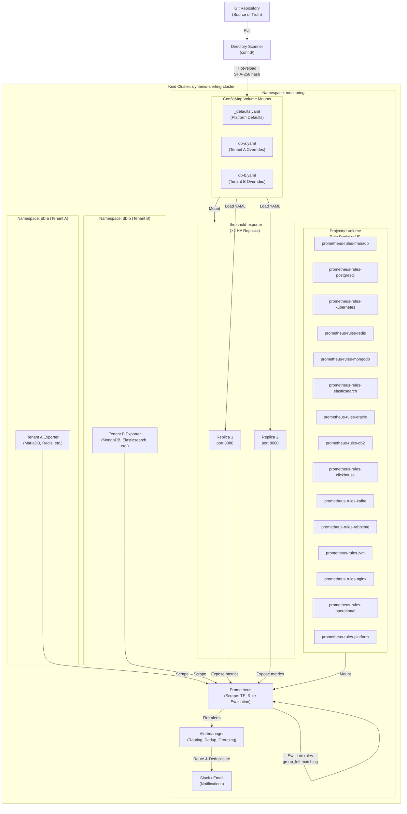
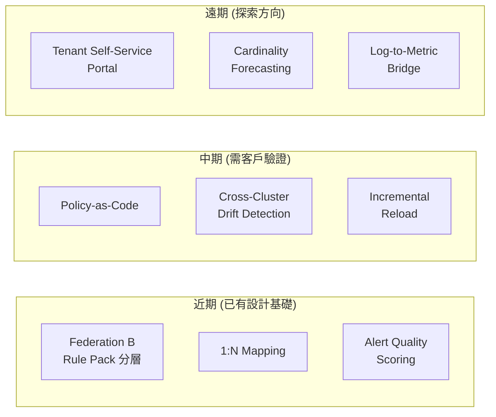

# 架構與設計 — 動態多租戶警報平台技術白皮書

> **Language / 語言：** [English](architecture-and-design.en.md) | **中文（當前）**

## 簡介

本文件針對 Platform Engineers 和 Site Reliability Engineers (SREs) 深入探討「多租戶動態警報平台」(Multi-Tenant Dynamic Alerting Platform) 的技術架構。

**本文涵蓋內容：**
- 系統架構與核心設計理念（含 Regex 維度閾值、排程式閾值）
- Config-driven 配置驅動的工作流程
- Projected Volume 與 15 個規則包 (Rule Packs) 的治理模型
- 高可用性 (HA) 設計
- 未來擴展路線

**獨立專題文件：** 性能基準測試 → [benchmarks.md](benchmarks.md) · 治理與安全 → [governance-security.md](governance-security.md) · 故障排查 → [troubleshooting.md](troubleshooting.md) · 進階場景 → [scenarios/advanced-scenarios.md](scenarios/advanced-scenarios.md) · 遷移引擎 → [migration-engine.md](migration-engine.md)

**其他相關文件：**
- **快速入門** → [README.md](../README.md)
- **遷移指南** → [migration-guide.md](migration-guide.md)
- **規則包文件** → [rule-packs/README.md](../rule-packs/README.md)
- **threshold-exporter 元件** → [components/threshold-exporter/README.md](../components/threshold-exporter/README.md)
- **性能基準測試** → [benchmarks.md](benchmarks.md)
- **治理與安全合規** → [governance-security.md](governance-security.md)
- **故障排查與邊界情況** → [troubleshooting.md](troubleshooting.md)
- **進階場景與測試覆蓋** → [scenarios/advanced-scenarios.md](scenarios/advanced-scenarios.md)
- **AST 遷移引擎架構** → [migration-engine.md](migration-engine.md)

---

## 1. 系統架構圖 (System Architecture Diagram)

### 1.1 C4 Context — 系統邊界與角色互動


```mermaid
graph TB
    PT["👤 Platform Team<br/>管理 _defaults.yaml<br/>維護 Rule Packs"]
    TT["👤 Tenant Team<br/>管理 tenant YAML<br/>設定閾值"]
    Git["📂 Git Repository<br/>conf.d/ + rule-packs/"]

    subgraph DAP["Dynamic Alerting Platform"]
        TE["threshold-exporter<br/>×2 HA"]
        PM["Prometheus<br/>+ 15 Rule Packs"]
        CM["ConfigMap<br/>threshold-config"]
    end

    AM["📟 Alertmanager<br/>→ Slack / PagerDuty"]

    PT -->|"PR: _defaults.yaml<br/>+ Rule Pack YAML"| Git
    TT -->|"PR: tenant YAML<br/>(閾值設定)"| Git
    Git -->|"GitOps sync<br/>(ArgoCD/Flux)"| CM
    CM -->|"SHA-256<br/>hot-reload"| TE
    TE -->|"Prometheus<br/>metrics :8080"| PM
    PM -->|"Alert rules<br/>evaluation"| AM

    style DAP fill:#e8f4fd,stroke:#1a73e8
    style Git fill:#f0f0f0,stroke:#666
    style AM fill:#fff3e0,stroke:#e65100
```

### 1.2 系統內部架構 (Internal Architecture)


```mermaid
graph TB
    subgraph Cluster["Kind Cluster: dynamic-alerting-cluster"]
        subgraph TenantA["Namespace: db-a (Tenant A)"]
            ExpA["Tenant A Exporter<br/>(MariaDB, Redis, etc.)"]
        end

        subgraph TenantB["Namespace: db-b (Tenant B)"]
            ExpB["Tenant B Exporter<br/>(MongoDB, Elasticsearch, etc.)"]
        end

        subgraph Monitoring["Namespace: monitoring"]
            subgraph Config["ConfigMap Volume Mounts"]
                CfgDefault["_defaults.yaml<br/>(Platform Defaults)"]
                CfgTenantA["db-a.yaml<br/>(Tenant A Overrides)"]
                CfgTenantB["db-b.yaml<br/>(Tenant B Overrides)"]
            end

            subgraph Export["threshold-exporter<br/>(×2 HA Replicas)"]
                TE1["Replica 1<br/>port 8080"]
                TE2["Replica 2<br/>port 8080"]
            end

            subgraph Rules["Projected Volume<br/>Rule Packs (×15)"]
                RP1["prometheus-rules-mariadb"]
                RP2["prometheus-rules-postgresql"]
                RP3["prometheus-rules-kubernetes"]
                RP4["prometheus-rules-redis"]
                RP5["prometheus-rules-mongodb"]
                RP6["prometheus-rules-elasticsearch"]
                RP7["prometheus-rules-oracle"]
                RP8["prometheus-rules-db2"]
                RP9["prometheus-rules-clickhouse"]
                RP10["prometheus-rules-kafka"]
                RP11["prometheus-rules-rabbitmq"]
                RP12["prometheus-rules-jvm"]
                RP13["prometheus-rules-nginx"]
                RP14["prometheus-rules-operational"]
                RP15["prometheus-rules-platform"]
            end

            Prom["Prometheus<br/>(Scrape: TE, Rule Evaluation)"]
            AM["Alertmanager<br/>(Routing, Dedup, Grouping)"]
            Slack["Slack / Email<br/>(Notifications)"]
        end
    end

    Git["Git Repository<br/>(Source of Truth)"]
    Scanner["Directory Scanner<br/>(conf.d/)"]

    Git -->|Pull| Scanner
    Scanner -->|Hot-reload<br/>SHA-256 hash| Config
    Config -->|Mount| Export
    ExpA -->|Scrape| Prom
    ExpB -->|Scrape| Prom
    Config -->|Load YAML| TE1
    Config -->|Load YAML| TE2
    TE1 -->|Expose metrics| Prom
    TE2 -->|Expose metrics| Prom
    Rules -->|Mount| Prom
    Prom -->|Evaluate rules<br/>group_left matching| Prom
    Prom -->|Fire alerts| AM
    AM -->|Route & Deduplicate| Slack
```

**架構要點：**
1. **Directory Scanner** 掃描 `conf.d/` 目錄，自動發現 `_defaults.yaml` 和租戶配置文件
2. **threshold-exporter × 2 HA Replicas** 讀取 ConfigMap，輸出三態 Prometheus 指標
3. **Projected Volume** 掛載 15 個獨立規則包，零 PR 衝突，各團隊獨立擁有
4. **Prometheus** 使用 `group_left` 向量匹配與用戶閾值進行聯接，實現 O(M) 複雜度（相比傳統 O(M×N)：固定 M 條規則 vs N×M 線性增長）

---

## 2. 核心設計：Config-Driven 架構

### 2.1 三態邏輯 (Three-State Logic)

平台支援「三態」配置模式，提供靈活的預設值、覆蓋和禁用機制：

| 狀態 | 配置方式 | Prometheus 輸出 | 說明 |
|------|---------|-----------------|------|
| **Custom Value** | `metric_key: 42` | ✓ 輸出自訂閾值 | 租戶覆蓋預設值 |
| **Omitted (Default)** | 未在 YAML 中指定 | ✓ 輸出平台預設值 | 使用 `_defaults.yaml` |
| **Disable** | `metric_key: "disable"` | ✗ 不輸出 | 完全禁用該指標 |

**Prometheus 輸出示例：**

```
# Custom value (db-a 租戶)
user_threshold{tenant="db-a", metric="mariadb_replication_lag", severity="warning"} 10

# Default value (db-b 租戶，未覆蓋)
user_threshold{tenant="db-b", metric="mariadb_replication_lag", severity="warning"} 30

# Disabled (無輸出)
# (metric not present)
```

### 2.2 Directory Scanner 模式 (conf.d/)

**層次結構：**
```
conf.d/
├── _defaults.yaml         # Platform 全局預設值（Platform 團隊管理）
├── db-a.yaml             # 租戶 A 覆蓋（db-a 團隊管理）
├── db-b.yaml             # 租戶 B 覆蓋（db-b 團隊管理）
└── ...
```

**`_defaults.yaml` 內容（Platform 管理）：**
```yaml
defaults:
  mysql_connections: 80
  mysql_cpu: 80
  container_cpu: 80
  container_memory: 85

state_filters:
  container_crashloop:
    reasons: ["CrashLoopBackOff"]
    severity: "critical"
  maintenance:
    reasons: []
    severity: "info"
    default_state: "disable"
```

**`db-a.yaml` 內容（租戶覆蓋）：**
```yaml
tenants:
  db-a:
    mysql_connections: "70"          # 覆蓋預設值 80
    container_cpu: "70"              # 覆蓋預設值 80
    mysql_slave_lag: "disable"       # 無 replica，停用
    # mysql_cpu 未指定 → 使用預設值 80
    # 維度標籤
    "redis_queue_length{queue='tasks'}": "500"
    "redis_queue_length{queue='events', priority='high'}": "1000:critical"
```

#### 邊界強制規則 (Boundary Enforcement)

| 檔案類型 | 允許的區塊 | 違規行為 |
|----------|-----------|---------|
| `_` 前綴檔 (`_defaults.yaml`) | `defaults`, `state_filters`, `tenants` | — |
| 租戶檔 (`db-a.yaml`) | 僅 `tenants` | 其他區塊自動忽略 + WARN log |

#### SHA-256 熱重新加載 (Hot-Reload)

不依賴檔案修改時間 (ModTime)，而是基於 **SHA-256 內容雜湊**：

```bash
# 每次 ConfigMap 更新時
$ sha256sum conf.d/_defaults.yaml conf.d/db-a.yaml conf.d/db-b.yaml
abc123... conf.d/_defaults.yaml
def456... conf.d/db-a.yaml
ghi789... conf.d/db-b.yaml

# Prometheus 掛載的 ConfigMap 符號鏈接會旋轉
# 舊的雜湊值 → 新的雜湊值
# threshold-exporter 偵測到變化，重新載入配置
```

**為什麼 SHA-256 而不是 ModTime？**
- Kubernetes ConfigMap 會建立符號鏈接層，ModTime 不可靠
- 內容相同 = 雜湊相同，避免不必要的重新加載

### 2.3 Tenant-Namespace 映射模式 (Tenant-Namespace Mapping)

平台的 `tenant` 是**邏輯身分**，由兩個獨立來源決定：

1. **閾值側**：threshold-exporter 從 YAML config key（`tenants.db-a`）取得 tenant，與 K8s namespace 零耦合
2. **資料側**：Prometheus `relabel_configs` 將抓取到的指標注入 `tenant` 標籤

兩側的 `tenant` 值必須精確匹配，但**來源可以不同**。這使得以下三種映射模式都可行：

| 映射模式 | 說明 | Prometheus relabel 策略 | 適用場景 |
|---------|------|------------------------|---------|
| **1:1**（標準） | 一個 Namespace = 一個 Tenant | `source_labels: [__meta_kubernetes_namespace]` → `target_label: tenant` | 大多數部署 |
| **N:1** | 多個 Namespace 視為同一 Tenant | 多個 namespace 的指標 relabel 到同一個 tenant 值 | 讀寫分離（`db-a-read` + `db-a-write` → `db-a`） |
| **1:N** | 一個 Namespace 內多個 Tenant | 以 Service label/annotation 而非 namespace 作為 tenant 來源 | 共享 namespace 的多租戶架構 |

**N:1 relabel 範例**（多 namespace → 一個 tenant）：

```yaml
relabel_configs:
  - source_labels: [__meta_kubernetes_namespace]
    action: keep
    regex: "db-a-(read|write)"
  # 統一映射為 db-a
  - source_labels: [__meta_kubernetes_namespace]
    target_label: tenant
    regex: "(db-[^-]+).*"    # 擷取第一段作為 tenant
    replacement: "$1"
```

**1:N relabel 範例**（一個 namespace → 多個 tenant）：

```yaml
relabel_configs:
  - source_labels: [__meta_kubernetes_namespace]
    action: keep
    regex: "shared-db"
  # 從 Service annotation 讀取 tenant 身分
  - source_labels: [__meta_kubernetes_service_annotation_alerting_tenant]
    target_label: tenant
```

**自動化工具**：`scaffold_tenant.py --namespaces ns1,ns2` 可自動產出 N:1 relabel_configs snippet，並在 tenant YAML 中寫入 `_namespaces` 元資料欄位供工具參考（不影響 metric 邏輯）。

**設計原則**：平台核心（threshold-exporter + Rule Packs）完全不感知 namespace 結構。映射彈性完全由 Prometheus scrape config 提供，無需修改平台任何元件。詳見 [BYO Prometheus 整合指南](byo-prometheus-integration.md)。

### 2.4 多層嚴重度 (Multi-tier Severity)

支援 `_critical` 後綴與 `"value:severity"` 兩種語法：

**方式一：`_critical` 後綴（適用於基本閾值）**
```yaml
tenants:
  db-a:
    mysql_connections: "100"            # warning 閾值
    mysql_connections_critical: "150"   # _critical → 自動產生 critical alert
```

**方式二：`"value:severity"` 語法（適用於維度標籤）**
```yaml
tenants:
  redis-prod:
    "redis_queue_length{queue='orders'}": "500:critical"
```

**Prometheus 輸出：**
```
user_threshold{tenant="db-a", component="mysql", metric="connections", severity="warning"} 100
user_threshold{tenant="db-a", component="mysql", metric="connections", severity="critical"} 150
```

#### 自動抑制 (Auto-Suppression) — Severity Dedup

v1.2.0 起，Severity Dedup 從 PromQL 層移至 **Alertmanager inhibit 層**（詳見 §2.8）。Alert Rule 不再使用 `unless critical` 邏輯，warning 和 critical 均在 Prometheus 中獨立觸發，TSDB 保有完整紀錄。通知去重由 Alertmanager per-tenant inhibit rule 控制。

```yaml
# Warning 和 Critical 獨立觸發，TSDB 完整保留
- alert: MariaDBHighConnections          # warning
  expr: |
    ( tenant:mysql_threads_connected:max > on(tenant) group_left tenant:alert_threshold:connections )
    unless on(tenant) (user_state_filter{filter="maintenance"} == 1)
  labels:
    severity: warning
    metric_group: connections
- alert: MariaDBHighConnectionsCritical  # critical
  expr: |
    ( tenant:mysql_threads_connected:max > on(tenant) group_left tenant:alert_threshold:connections_critical )
    unless on(tenant) (user_state_filter{filter="maintenance"} == 1)
  labels:
    severity: critical
    metric_group: connections
```

**結果：** 連線數 ≥ 150 時，warning 和 critical 均觸發（TSDB 完整），但 Alertmanager inhibit rule 攔截 warning 通知，只送出 critical 通知。

### 2.5 Regex 維度閾值 (Regex Dimension Thresholds)

v0.12.0 起，Config parser 支援 `=~` 運算子，允許以 regex 模式精細匹配維度標籤。此設計在不引入外部資料依賴的前提下，讓閾值配置可針對特定維度子集生效。

**配置語法：**
```yaml
tenants:
  db-a:
    # 精確匹配
    "oracle_tablespace_used_percent{tablespace='USERS'}": "85"
    # Regex 匹配：所有 SYS 開頭的 tablespace
    "oracle_tablespace_used_percent{tablespace=~'SYS.*'}": "95"
```

**實現路徑：**

1. **Exporter 層**：Config parser 偵測 `=~` 運算子，將 regex pattern 作為 `_re` 後綴 label 輸出
   ```
   user_threshold{tenant="db-a", metric="oracle_tablespace_used_percent",
                  tablespace_re="SYS.*", severity="warning"} 95
   ```
2. **Recording Rule 層**：PromQL 使用 `label_replace` + `=~` 在查詢時完成實際匹配
3. **設計原則**：Exporter 保持為純 config→metric 轉換器，匹配邏輯完全由 Prometheus 原生向量運算執行

### 2.6 排程式閾值 (Scheduled Thresholds)

v0.12.0 起，閾值支援時間窗口排程，允許在不同時段自動切換不同閾值。典型場景：夜間維護窗口放寬閾值、尖峰時段收緊閾值。

**配置語法：**
```yaml
tenants:
  db-a:
    mysql_connections:
      default: "100"
      overrides:
        - window: "22:00-06:00"    # UTC 夜間窗口（支援跨午夜）
          value: "200"             # 夜間批次作業，放寬到 200
        - window: "09:00-18:00"
          value: "80"              # 日間高峰，收緊到 80
```

**技術實現：**

- **`ScheduledValue` 自訂 YAML 型別**：支援雙格式解析——純量字串（向後相容）和結構化 `{default, overrides[{window, value}]}`
- **`ResolveAt(now time.Time)`**：根據當前 UTC 時間解析應使用的閾值，確保確定性與可測試性
- **時間窗口格式**：`HH:MM-HH:MM` (UTC)，支援跨午夜（如 `22:00-06:00` 表示晚上十點到隔天早上六點）
- **45 個測試案例**：覆蓋邊界條件——窗口重疊、跨午夜、純量退化、空 overrides

### 2.7 三態運營模式 (Operational Modes)

v1.2.0 新增 **Silent Mode**，與既有的 Maintenance Mode 形成三態運營模式，解決「使用者把 Maintenance Mode 當靜音用」的問題。

**行為矩陣**

| 運營狀態 | 語義 | Alert 觸發 | TSDB 紀錄 | 通知 | 控制層 |
|---------|------|-----------|----------|------|--------|
| Normal | 正常運行 | ✅ | ✅ | ✅ | — |
| Silent | 靜音 | ✅ | ✅ | ❌ | Alertmanager |
| Maintenance | 真正維護 | ❌ | ❌ | ❌ | Prometheus (PromQL) |

**設計原則**：Prometheus 管「什麼該 alert」，Alertmanager 管「要不要通知」。

- **Maintenance Mode**（既有）：在 PromQL 層透過 `unless on(tenant) (user_state_filter{filter="maintenance"} == 1)` 消滅 alert。Alert 不觸發，TSDB 無紀錄，無通知。
- **Silent Mode**：Alert 在 Prometheus 正常觸發（TSDB 有 `ALERTS` 紀錄），但 Alertmanager 透過 `inhibit_rules` 攔截通知。

**Silent Mode 資料流**

```
tenant YAML: _silent_mode: "warning"
    ↓
threshold-exporter: user_silent_mode{tenant="db-a", target_severity="warning"} 1
    ↓
Prometheus alert rule (rule-pack-operational.yaml):
    TenantSilentWarning{tenant="db-a"} fires
    ↓
Alertmanager inhibit_rules:
    source: alertname="TenantSilentWarning"
    target: severity="warning", equal: ["tenant"]
    ↓
結果: db-a 的 warning alert 照常觸發（TSDB 有紀錄），但通知被攔截
```

**Tenant 配置**

```yaml
tenants:
  db-a:
    _silent_mode: "warning"    # 只靜音 warning 通知
  db-b:
    _silent_mode: "all"        # 靜音 warning + critical 通知
  db-c:
    _state_maintenance: "enable"  # 真正維護，完全不觸發 alert
  db-d: {}                        # Normal — 預設行為
```

可用的 `_silent_mode` 值：`warning`、`critical`、`all`、`disable`。未設定等同 Normal。

**自動失效 **：`_silent_mode` 和 `_state_maintenance` 支援結構化物件（向後相容純量字串），帶 `expires` ISO8601 時戳。Go 引擎 `time.Now().After(expires)` 過期即停止 emit sentinel metric，alert 自動恢復正常。失效時產出瞬時 gauge `da_config_event{event="silence_expired"}` 搭配 `TenantConfigEvent` alert rule 通知。

```yaml
tenants:
  db-a:
    _silent_mode:
      target: "all"
      expires: "2026-04-01T00:00:00Z"
      reason: "Migration shadow monitoring period"
    _state_maintenance:
      target: "all"
      expires: "2026-04-01T00:00:00Z"
      reason: "Scheduled maintenance window"
```

**Alertmanager inhibit_rules 範本**

```yaml
inhibit_rules:
  # Severity Dedup: per-tenant inhibit rules (由 generate_alertmanager_routes.py 產出)
  # 僅 _severity_dedup: "enable" (預設) 的 tenant 會產出規則
  # _severity_dedup: "disable" 的 tenant 不會有對應規則 → 兩種通知都收到
  - source_matchers:
      - severity="critical"
      - metric_group=~".+"
      - tenant="db-a"
    target_matchers:
      - severity="warning"
      - metric_group=~".+"
      - tenant="db-a"
    equal: ["metric_group"]

  # Silent Mode: 壓制 warning 通知
  - source_matchers:
      - alertname="TenantSilentWarning"
    target_matchers:
      - severity="warning"
    equal: ["tenant"]

  # Silent Mode: 壓制 critical 通知
  - source_matchers:
      - alertname="TenantSilentCritical"
    target_matchers:
      - severity="critical"
    equal: ["tenant"]
```

### 2.8 Severity Dedup（嚴重度去重）

v1.2.0 新增 **Severity Dedup**，解決「critical 觸發時 warning 的 TSDB 紀錄被消滅」的問題。

**設計變更**：Auto-Suppression 從 PromQL 層（`unless critical`）移至 Alertmanager 層（`inhibit_rules`）。TSDB 永遠同時記錄 warning 和 critical，dedup 只控制通知行為。

**Per-Tenant 控制機制**

v1.2.0 採用 per-tenant inhibit rules 實現可選化：

1. `generate_alertmanager_routes.py` 掃描所有 tenant YAML 的 `_severity_dedup` 設定
2. 對每個 dedup enabled 的 tenant 產出一條專屬 inhibit rule（帶 `tenant="<name>"` matcher）
3. `_severity_dedup: "disable"` 的 tenant 不產出 rule → 兩種通知都收到
4. Exporter 仍輸出 `user_severity_dedup{tenant, mode}` metric → Prometheus sentinel `TenantSeverityDedupEnabled` 供 Grafana 面板顯示各 tenant dedup 狀態

**行為矩陣**

| 設定 | TSDB warning | TSDB critical | Warning 通知 | Critical 通知 |
|------|-------------|--------------|-------------|--------------|
| `_severity_dedup: "enable"`（預設） | ✅ | ✅ | ❌ 被 AM 攔截 | ✅ |
| `_severity_dedup: "disable"` | ✅ | ✅ | ✅ | ✅ |

**配對機制**：Alert rule 的 `metric_group` label 讓 Alertmanager 正確配對 warning/critical（因為兩者 alertname 不同）。例如 `MariaDBHighConnections` 和 `MariaDBHighConnectionsCritical` 共享 `metric_group: "connections"`。每條 per-tenant inhibit rule 限定 `metric_group=~".+"` 確保無 `metric_group` 的 alert（如 `MariaDBDown`）不會參與 dedup。

**Tenant 配置**

```yaml
tenants:
  db-a: {}                                # 預設 enable — warning 被壓制
  db-b:
    _severity_dedup: "disable"           # 兩種通知都收到
```

**產出 Alertmanager 設定**

```bash
python3 scripts/tools/generate_alertmanager_routes.py --config-dir conf.d/ --dry-run
# 輸出包含 per-tenant inhibit_rules section，合併至 Alertmanager config
```

### 2.9 Alert Routing 客製化 (Config-Driven Routing)

Tenant 可透過 `_routing` section 自主管理通知目的地、分群策略與時序控制。平台工具 `generate_alertmanager_routes.py` 讀取所有 tenant YAML，產出 Alertmanager route + receiver + inhibit_rules YAML fragment。

> 支援 webhook / email / slack / teams / rocketchat / pagerduty 六種 receiver type。Receiver 為結構化物件（`{type, ...fields}`），由 `generate_alertmanager_routes.py` 驗證必要欄位並產出對應 Alertmanager config。

**Schema**

```yaml
tenants:
  db-a:
    _routing:
      receiver:                                         # required — 結構化物件
        type: "webhook"                                 #   type: webhook/email/slack/teams/rocketchat/pagerduty
        url: "https://webhook.db-a.svc/alerts"
      group_by: ["alertname", "severity"]               # optional
      group_wait: "30s"                                  # optional, guardrail 5s–5m
      group_interval: "1m"                               # optional, guardrail 5s–5m
      repeat_interval: "4h"                              # optional, guardrail 1m–72h
      overrides: []                                      # optional, per-rule routing (§2.10)
```

**Timing Guardrails**

平台對時序參數設定硬性上下界，超限值自動 clamp 並發出 WARN log：

| 參數 | 最小值 | 最大值 | 預設值 |
|------|--------|--------|--------|
| `group_wait` | 5s | 5m | 30s |
| `group_interval` | 5s | 5m | 5m |
| `repeat_interval` | 1m | 72h | 4h |

**與 Silent Mode 的交互**

Silent Mode 天然 bypass routing：Alertmanager 的 inhibit_rules 在 route evaluation 之前攔截通知。因此即使 tenant 配置了自訂 routing，silent 的 alert 仍不會送出通知。

**工具鏈**

```bash
# 預覽模式
python3 scripts/tools/generate_alertmanager_routes.py \
  --config-dir conf.d/ --dry-run

# 產出 fragment + CI 驗證
python3 scripts/tools/generate_alertmanager_routes.py \
  --config-dir conf.d/ -o alertmanager-routes.yaml --validate \
  --policy .github/custom-rule-policy.yaml

# 一站式合併至 Alertmanager ConfigMap + reload
python3 scripts/tools/generate_alertmanager_routes.py \
  --config-dir conf.d/ --apply --yes
```

`--validate` 檢查 YAML 合法性 + webhook domain allowlist（exit 0/1，供 CI 消費）。`--apply` 直接合併 fragment 至 Alertmanager ConfigMap 並觸發 reload。產出支援 webhook、email、slack、teams、rocketchat、pagerduty 六種 receiver type。

### 2.10 Per-rule Routing Overrides

v1.8.0 新增 **Per-rule Routing Overrides** 功能，允許 tenant 針對特定 alert 或 metric group 指定不同的 receiver（例如：DBA 特定 alert 走 PagerDuty，其餘走 Slack）。

**YAML 設定範例：**

```yaml
tenants:
  db-a:
    _routing:
      receiver:
        type: slack
        api_url: "https://hooks.slack.com/services/..."
      overrides:
        - alertname: "MariaDBReplicationLag"
          receiver:
            type: pagerduty
            service_key: "abc123"
        - metric_group: "redis"
          receiver:
            type: webhook
            url: "https://oncall.example.com/redis"
```

**設計規則：**

- 每個 override 必須指定 `alertname` 或 `metric_group`（二擇一，不可同時設定）
- override receiver 走同一個 `build_receiver_config()` 驗證 + domain allowlist 檢查
- `expand_routing_overrides()` 產出的子路由插入在 tenant 主路由之前，確保 Alertmanager 優先匹配 override
- Timing parameters（`group_wait`、`group_interval`、`repeat_interval`）可在 override 層級覆寫，同樣受平台 guardrails 約束

### 2.11 Platform Enforced Routing

Platform Team 可在 `_defaults.yaml` 設定 `_routing_enforced`，在所有 tenant route 之前插入平台路由（帶 `continue: true`），實現「NOC 必收 + tenant 也收」雙軌通知：

```yaml
# _defaults.yaml — 模式 A：統一 NOC 接收
_routing_enforced:
  enabled: true
  receiver:
    type: "webhook"
    url: "https://noc.example.com/alerts"
  match:
    severity: "critical"    # 僅 critical 送 NOC
```

**Per-tenant Enforced Channel：** 若 receiver 欄位包含 `{{tenant}}`，系統自動為每個 tenant 建立獨立的 enforced route，讓 Platform 可 by-tenant 建立各自的通知通道，tenant 無法拒絕也無法覆寫：

```yaml
# _defaults.yaml — 模式 B：per-tenant 獨立通道
_routing_enforced:
  enabled: true
  receiver:
    type: "slack"
    api_url: "https://hooks.slack.com/services/T/B/x"
    channel: "#alerts-{{tenant}}"    # → #alerts-db-a, #alerts-db-b, ...
```

`generate_alertmanager_routes.py` 在 tenant route 之前插入 platform route。模式 A 產生單一共用 route，模式 B 產生 N 個 per-tenant route（各帶 `tenant="<name>"` matcher + `continue: true`）。預設不啟用，Platform Team 按需開啟。詳見 [BYO Alertmanager 整合指南 §8](byo-alertmanager-integration.md#8-platform-enforced-routingv170)。

---

## 3. Projected Volume 架構 (Rule Packs)

### 3.1 十五個獨立規則包

| Rule Pack | 擁有團隊 | ConfigMap 名稱 | Recording Rules | Alert Rules |
|-----------|---------|-----------------|----------------|-------------|
| MariaDB | DBA | `prometheus-rules-mariadb` | 11 | 8 |
| PostgreSQL | DBA | `prometheus-rules-postgresql` | 11 | 9 |
| Kubernetes | Infra | `prometheus-rules-kubernetes` | 7 | 4 |
| Redis | Cache | `prometheus-rules-redis` | 11 | 6 |
| MongoDB | AppData | `prometheus-rules-mongodb` | 10 | 6 |
| Elasticsearch | Search | `prometheus-rules-elasticsearch` | 11 | 7 |
| Oracle | DBA / Oracle | `prometheus-rules-oracle` | 11 | 7 |
| DB2 | DBA / DB2 | `prometheus-rules-db2` | 12 | 7 |
| ClickHouse | Analytics | `prometheus-rules-clickhouse` | 12 | 7 |
| Kafka | Messaging | `prometheus-rules-kafka` | 13 | 9 |
| RabbitMQ | Messaging | `prometheus-rules-rabbitmq` | 12 | 8 |
| JVM | AppDev | `prometheus-rules-jvm` | 9 | 7 |
| Nginx | Infra | `prometheus-rules-nginx` | 9 | 6 |
| Operational | Platform | `prometheus-rules-operational` | 0 | 4 |
| Platform | Platform | `prometheus-rules-platform` | 0 | 4 |
| **總計** | | | **139** | **99** |

### 3.2 自包含三部分結構

每個 Rule Pack 包含三個獨立且可複用的部分：

#### Part 1：標準化記錄規則 (Normalization Recording Rules)
```yaml
groups:
  - name: mariadb-normalization
    rules:
      # 正規化命名：tenant:<component>_<metric>:<function>
      - record: tenant:mysql_threads_connected:max
        expr: max by(tenant) (mysql_global_status_threads_connected)

      - record: tenant:mysql_slow_queries:rate5m
        expr: sum by(tenant) (rate(mysql_global_status_slow_queries[5m]))
```

**目的：** 將不同匯出器的原始指標正規化為統一命名空間 `tenant:<metric>:<function>`

#### Part 2：閾值標準化 (Threshold Normalization)
```yaml
groups:
  - name: mariadb-threshold-normalization
    rules:
      - record: tenant:alert_threshold:connections
        expr: max by(tenant) (user_threshold{metric="connections", severity="warning"})

      - record: tenant:alert_threshold:connections_critical
        expr: max by(tenant) (user_threshold{metric="connections", severity="critical"})
```

**關鍵：** 使用 `max by(tenant)` 而非 `sum`，防止 HA 雙倍計算（詳見第 4.3 節）

#### Part 3：警報規則 (Alert Rules)
```yaml
groups:
  - name: mariadb-alerts
    rules:
      - alert: MariaDBHighConnections
        expr: |
          (
            tenant:mysql_threads_connected:max
            > on(tenant) group_left
            tenant:alert_threshold:connections
          )
          unless on(tenant) (user_state_filter{filter="maintenance"} == 1)
        for: 5m
        labels:
          severity: warning
        annotations:
          summary: "MariaDB connections {{ $value }} exceeds threshold ({{ $labels.tenant }})"
```

### 3.3 優點

1. **零 PR 衝突** — 各 ConfigMap 獨立，不同團隊可並行推送
2. **團隊自主** — DBA 擁有 MariaDB 規則，不需要中央平台審核
3. **可複用** — 規則可輕鬆移植至其他 Prometheus 叢集
4. **獨立測試** — 每個包可獨立驗證和發布

---

## 拆分文件導覽

以下章節已獨立為專題文件，便於按角色與需求查閱：

| 章節 | 專題文件 | 適用對象 |
|------|---------|---------|
| §4 性能分析與基準測試 | [benchmarks.md](benchmarks.md) | Platform Engineers, SREs |
| §5–§6 治理、稽核與安全合規 | [governance-security.md](governance-security.md) | Platform Engineers, 安全與合規團隊 |
| §7 故障排查與邊界情況 | [troubleshooting.md](troubleshooting.md) | Platform Engineers, SREs, Tenant 管理者 |
| §8–§9 進階場景與測試覆蓋 | [scenarios/advanced-scenarios.md](scenarios/advanced-scenarios.md) | Platform Engineers, SREs |
| §10 AST 遷移引擎架構 | [migration-engine.md](migration-engine.md) | Platform Engineers, DevOps |

---

## 4. 高可用性設計 (High Availability)

### 4.1 部署策略

```yaml
replicas: 2
strategy:
  type: RollingUpdate
  rollingUpdate:
    maxUnavailable: 0    # 零停機滾動更新
    maxSurge: 1

affinity:
  podAntiAffinity:
    preferredDuringSchedulingIgnoredDuringExecution:
      - weight: 100
        podAffinityTerm:
          topologyKey: kubernetes.io/hostname
```

**特性：**
- 2 個副本分散在不同節點
- 滾動更新時，總有 1 個副本可用
- Kind 單節點叢集：軟親和性允許裝箱

### 4.2 Pod 中斷預算 (PodDisruptionBudget)

```yaml
apiVersion: policy/v1
kind: PodDisruptionBudget
metadata:
  name: threshold-exporter-pdb
spec:
  minAvailable: 1
  selector:
    matchLabels:
      app: threshold-exporter
```

**保證：** 即使在主動維護期間，也始終有 1 個副本服務於 Prometheus 抓取

### 4.3 臨界：`max by(tenant)` vs `sum`

#### ❌ 錯誤：使用 `sum`
```yaml
- record: tenant:alert_threshold:connections
  expr: |
    sum by(tenant)
      user_threshold{tenant=~".*", metric="connections"}
```

**問題：**
- Prometheus 從兩個副本抓取相同指標 → 雙倍值
- `sum by(tenant)` 將兩個副本的值相加 → **閾值翻倍**
- 警報觸發錯誤

#### ✓ 正確：使用 `max`
```yaml
- record: tenant:alert_threshold:connections
  expr: |
    max by(tenant)
      user_threshold{tenant=~".*", metric="connections"}
```

**優勢：**
- 取兩個副本中的最大值（邏輯上相同）
- 避免雙倍計算
- HA 下警報閾值準確

### 4.4 自監控 (Platform Rule Pack)

4 個專用警報監控 threshold-exporter 本身：

| 警報 | 條件 | 動作 |
|------|------|------|
| ThresholdExporterDown | `up{job="threshold-exporter"} == 0` for 2m | PageDuty → SRE |
| ThresholdExporterAbsent | Metrics absent > 5m | 警告 → 平台團隊 |
| ThresholdExporterTooFewReplicas | `count(up{job="threshold-exporter"}) < 2` | 警告 → SRE |
| ThresholdExporterHighRestarts | `rate(container_last_terminated_reason[5m]) > 0.1` | 調查 |

---

## 5. 未來擴展路線 (Future Roadmap)

以下為按優先序排列的技術方向。已完成項目請查閱 [CHANGELOG.md](../CHANGELOG.md) 及 [dx-tooling-backlog.md](internal/dx-tooling-backlog.md)。


```mermaid
graph LR
    subgraph Near["近期 (已有設計基礎)"]
        FB["Federation B<br/>Rule Pack 分層"]
        NM["1:N Mapping"]
        QS["Alert Quality<br/>Scoring"]
    end
    subgraph Mid["中期 (需客戶驗證)"]
        PS["Policy-as-Code"]
        CD["Cross-Cluster<br/>Drift Detection"]
        IR["Incremental<br/>Reload"]
    end
    subgraph Far["遠期 (探索方向)"]
        SP["Tenant Self-Service<br/>Portal"]
        CF["Cardinality<br/>Forecasting"]
        LM["Log-to-Metric<br/>Bridge"]
    end
```

### 5.1 Federation 場景 B：Rule Pack 分層

場景 A（中央 threshold-exporter + 多邊緣 Prometheus）已有[架構文件](federation-integration.md)。場景 B 需要邊緣 Prometheus 透過 federation 或 remote-write 將 recording rule 結果送到中央。Rule Pack 需拆成兩層——邊緣用 Part 1（data normalization），中央用 Part 2 + Part 3（threshold normalization + alerts）。

**技術切入點**：`generate_rule_pack_readme.py` 已有 Part 分類資訊，可延伸產出 `edge-rules.yaml` / `central-rules.yaml` 分割檔。需搭配 `federation_check.py` 驗證分層後的 recording rule 引用完整性。

### 5.2 1:N Tenant Mapping 進階支援

一個 Namespace 內多個邏輯 Tenant（透過 Service annotation/Pod label 區分）。需要 `scaffold_tenant.py --shared-namespace --tenant-source annotation` 模式及 `_tenant_mappings` 配置 section。目前 §2.3 已有 relabel 範例，工具化待需求確認。

### 5.3 Alert Quality Scoring（警報品質評估）

**動機**：隨著租戶數與 Rule Pack 數量增長，低品質警報會侵蝕值班人員的注意力預算。目前缺乏系統化方式識別問題警報。

**做法**：分析 Alertmanager 歷史紀錄，對每個 alertname × tenant 組合計算品質指標：

- **Noise Score**：單位時間內 firing 次數過高（反覆 fire/resolve 震盪）
- **Stale Score**：長期未 fire 的警報（閾值可能已失去意義）
- **Resolution Latency**：從 firing 到 resolved 的平均時間（過短 = flapping，過長 = 無人處理）
- **Suppression Ratio**：被 inhibit 或 silence 壓掉的比例（過高 = 規則設計需調整）

**產出**：`da-tools alert-quality --period 30d --json` → per-tenant 報告，可嵌入 Grafana dashboard 或作為 CI gate。

### 5.4 Policy-as-Code（配置策略引擎）

**動機**：目前 `ValidateTenantKeys()` 做結構驗證（schema），但無法表達組織層級的策略約束，例如「所有 critical alert 必須配置 pagerduty receiver」或「repeat_interval 不得低於 5m」。隨著 Sharded GitOps 讓更多 team 自主管理配置，策略護欄變得更重要。

**做法**：

```
tenant.yaml → Schema Validation (現有) → Policy Evaluation (新增) → config-dir
```

引入輕量策略層，以宣告式規則表達約束。兩種可能路徑：

- **Path A — 內建 DSL**：在 `_defaults.yaml` 新增 `_policies` section，用簡潔的 key-operator-value 語法。優點是零外部依賴，學習成本低。
- **Path B — OPA/Rego 整合**：策略表達力強，適合已有 OPA 基礎設施的團隊。缺點是引入外部依賴。

兩條路徑都透過 `validate_config.py` 的 plugin 機制掛載，不侵入 threshold-exporter 核心。

### 5.5 Cross-Cluster Drift Detection（跨叢集漂移偵測）

**動機**：Assembler Controller（§2.10 已實作）解決了單叢集的 CRD → YAML 翻譯。但在多叢集部署中，各叢集 config-dir 的實際內容可能因部署時序、人為操作而產生漂移。

**做法**：

```
Cluster-A config-dir ──┐
Cluster-B config-dir ──┤── drift_detect.py ──► diff report + reconcile action
Cluster-C config-dir ──┘
```

- **快照比對**：定期從各叢集擷取 config-dir 的 SHA-256 manifest（`assemble_config_dir.py --manifest` 已支援），跨叢集比對。
- **漂移分類**：區分「預期差異」（per-cluster override）與「意外漂移」（部署失敗殘留）。
- **自動修復**：dry-run 預覽後可選擇性 reconcile，搭配 `config_diff.py` 產出變更明細。

### 5.6 Incremental Hot-Reload（增量熱載入）

**動機**：目前 threshold-exporter 的 SHA-256 reload 是全量重載——任一檔案變更觸發所有 tenant 重新解析。在千級租戶規模下，reload latency 會隨 tenant 數線性增長。

**做法**：維護 per-file SHA-256 index，reload 時只重新解析有變更的檔案。需要在 Go 端改造 `config.Load()` 為 incremental 模式，保留完整的 tenant registry 在記憶體中做 delta merge。

**風險**：delta merge 的一致性保證比全量重載複雜。需要完善的 benchmark 對比（`make benchmark` 已有 reload-bench 基礎），確認增量模式在各規模下皆不退化。

### 5.7 Tenant Self-Service Portal（租戶自助入口）

**動機**：目前租戶互動完全依賴 YAML 檔案 + CLI 工具。對於非 DevOps 背景的 tenant team，提供視覺化的配置體驗可降低上手門檻。

**功能範圍**（輕量，非完整 UI 平台）：

- **YAML 驗證**：貼上 tenant YAML，即時回饋 schema error + policy violation
- **Alert 預覽**：輸入樣本 metric 值，預覽哪些 alert 會 fire（基於 `validate_config.py` 的 dry-evaluate 能力）
- **Routing 視覺化**：以樹狀圖呈現 Alertmanager route 結構，highlight 該 tenant 的 routing path

**技術基礎**：`docs/interactive/` 下的 React 元件（Tenant YAML Validator、Rule Pack Selector）已驗證了瀏覽器端執行的可行性。可進一步整合為獨立的 SPA。

### 5.8 Cardinality Forecasting（基數預測）

**動機**：per-tenant 500 cardinality guard（§2.6）是事後防護。若能根據歷史趨勢預測基數增長，Platform team 可提前介入而非被動 truncate。

**做法**：基於 Prometheus `scrape_series_added` 和 `tenant_threshold_*` metric family 的時序資料，用簡單的線性回歸 / 指數平滑預測未來 N 天的基數上限。產出 warning-level alert 在觸頂前 7 天通知。

### 5.9 Log-to-Metric Bridge（日誌轉指標橋接）

本平台的設計邊界是 **Prometheus metrics 層**，不直接處理日誌。對於需要基於日誌觸發警報的場景（如 Oracle ORA-600、MySQL slow query log），推薦的生態系解法：

```
Application Log → grok_exporter / mtail → Prometheus metric → 本平台閾值管理
```

此模式讓日誌類警報也能享受動態閾值、多租戶隔離、Shadow Monitoring 等平台能力，而不需要在核心架構中引入日誌處理邏輯。未來若需求明確，可提供 `log_bridge_check.py` 驗證 grok_exporter 配置與 Rule Pack 的對接完整性。

---

## 相關資源

- [English Version](./architecture-and-design.en.md)
- [Context 圖](./context-diagram.md) — 角色、工具與產品互動關係
- [ADR 總覽](adr/README.md) — 5 個架構決策紀錄
- [性能基準](benchmarks.md) · [治理與安全](governance-security.md) · [故障排查](troubleshooting.md)
- [遷移指南](migration-guide.md) · [遷移引擎](migration-engine.md) · [Shadow Monitoring SOP](shadow-monitoring-sop.md)
- [規則包目錄](../rule-packs/README.md) · [threshold-exporter](../components/threshold-exporter/README.md)

---

**文件版本：** v2.0.0-preview.2 — 2026-03-14
**維護者：** Platform Engineering Team
