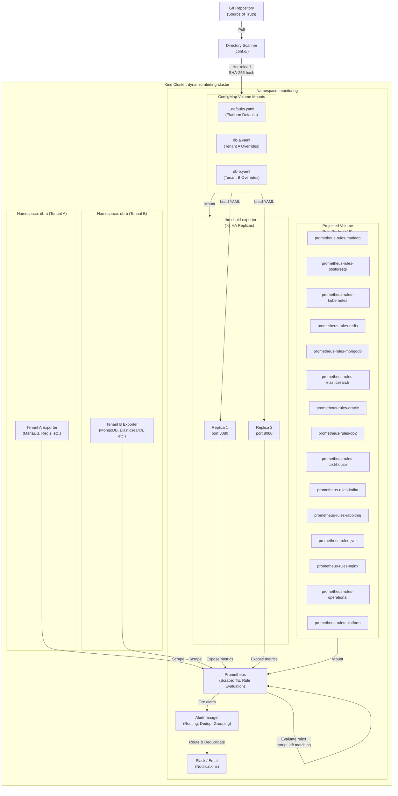

# 架構與設計 — 動態多租戶警報平台技術白皮書

> **Language / 語言：** **中文 (Current)** | [English](./architecture-and-design.en.md)

<!-- Language switcher is provided by mkdocs-static-i18n header. -->

## 簡介

本文件針對 Platform Engineers 和 Site Reliability Engineers (SREs) 深入探討「多租戶動態警報平台」(Multi-Tenant Dynamic Alerting Platform) 的技術架構。

本文件是架構 Hub — 系統架構圖 + 設計概念索引。詳細內容在各 spoke 文件中展開。

**設計文件（spoke）：**

| 文件 | 涵蓋主題 |
|------|---------|
| [Config-Driven 設計](design/config-driven.md) | 三態配置、Directory Scanner、多層嚴重度、排程式閾值、路由、Tenant API |
| [Rule Packs 與 Projected Volume](design/rule-packs.md) | 15 個規則包、三部分結構、雙語 Annotation |
| [高可用性 (HA)](design/high-availability.md) | 2 副本策略、PDB、滾動更新、SLA 99.9%+ |
| [未來擴展路線](design/roadmap-future.md) | v2.8.0 已交付項目 + v2.9.0+ 長期探索方向 |

**專題文件：** [性能基準](benchmarks.md) · [治理與安全](governance-security.md) · [故障排查](troubleshooting.md) · [進階場景](internal/test-coverage-matrix.md) · [遷移引擎](migration-engine.md) · [VCS 整合](vcs-integration-guide.md)

---

## 1. 系統架構圖 (System Architecture Diagram)

### 1.1 C4 Context — 系統邊界與角色互動


```mermaid
graph TB
    PT["👤 Platform Team<br/>管理 _defaults.yaml<br/>維護 Rule Packs"]
    TT["👤 Tenant Team<br/>管理 tenant YAML<br/>設定閾值"]
    Git["📂 Git Repository<br/>conf.d/ + rule-packs/"]

    subgraph DAP["Dynamic Alerting Platform"]
        TE["threshold-exporter<br/>×2 HA"]
        PM["Prometheus<br/>+ 15 Rule Packs"]
        CM["ConfigMap<br/>threshold-config"]
    end

    AM["📟 Alertmanager<br/>→ Slack / PagerDuty"]

    PT -->|"PR: _defaults.yaml<br/>+ Rule Pack YAML"| Git
    TT -->|"PR: tenant YAML<br/>(閾值設定)"| Git
    Git -->|"GitOps sync<br/>(ArgoCD/Flux)"| CM
    CM -->|"SHA-256<br/>hot-reload"| TE
    TE -->|"Prometheus<br/>metrics :8080"| PM
    PM -->|"Alert rules<br/>evaluation"| AM

    style DAP fill:#e8f4fd,stroke:#1a73e8
    style Git fill:#f0f0f0,stroke:#666
    style AM fill:#fff3e0,stroke:#e65100
```

### 1.2 系統內部架構 (Internal Architecture)


```mermaid
graph TB
    subgraph Cluster["Kind Cluster: dynamic-alerting-cluster"]
        subgraph TenantA["Namespace: db-a (Tenant A)"]
            ExpA["Tenant A Exporter<br/>(MariaDB, Redis, etc.)"]
        end

        subgraph TenantB["Namespace: db-b (Tenant B)"]
            ExpB["Tenant B Exporter<br/>(MongoDB, Elasticsearch, etc.)"]
        end

        subgraph Monitoring["Namespace: monitoring"]
            subgraph Config["ConfigMap Volume Mounts"]
                CfgDefault["_defaults.yaml<br/>(Platform Defaults)"]
                CfgTenantA["db-a.yaml<br/>(Tenant A Overrides)"]
                CfgTenantB["db-b.yaml<br/>(Tenant B Overrides)"]
            end

            subgraph Export["threshold-exporter<br/>(×2 HA Replicas)"]
                TE1["Replica 1<br/>port 8080"]
                TE2["Replica 2<br/>port 8080"]
            end

            subgraph Rules["Projected Volume<br/>Rule Packs (×15)"]
                RP1["prometheus-rules-mariadb"]
                RP2["prometheus-rules-postgresql"]
                RP3["prometheus-rules-kubernetes"]
                RP4["prometheus-rules-redis"]
                RP5["prometheus-rules-mongodb"]
                RP6["prometheus-rules-elasticsearch"]
                RP7["prometheus-rules-oracle"]
                RP8["prometheus-rules-db2"]
                RP9["prometheus-rules-clickhouse"]
                RP10["prometheus-rules-kafka"]
                RP11["prometheus-rules-rabbitmq"]
                RP12["prometheus-rules-jvm"]
                RP13["prometheus-rules-nginx"]
                RP14["prometheus-rules-operational"]
                RP15["prometheus-rules-platform"]
            end

            Prom["Prometheus<br/>(Scrape: TE, Rule Evaluation)"]
            AM["Alertmanager<br/>(Routing, Dedup, Grouping)"]
            Slack["Slack / Email<br/>(Notifications)"]
        end
    end

    Git["Git Repository<br/>(Source of Truth)"]
    Scanner["Directory Scanner<br/>(conf.d/)"]

    Git -->|Pull| Scanner
    Scanner -->|Hot-reload<br/>SHA-256 hash| Config
    Config -->|Mount| Export
    ExpA -->|Scrape| Prom
    ExpB -->|Scrape| Prom
    Config -->|Load YAML| TE1
    Config -->|Load YAML| TE2
    TE1 -->|Expose metrics| Prom
    TE2 -->|Expose metrics| Prom
    Rules -->|Mount| Prom
    Prom -->|Evaluate rules<br/>group_left matching| Prom
    Prom -->|Fire alerts| AM
    AM -->|Route & Deduplicate| Slack
```

**架構要點：**
1. **Directory Scanner** 掃描 `conf.d/` 目錄，自動發現 `_defaults.yaml` 和租戶配置文件
2. **threshold-exporter × 2 HA Replicas** 讀取 ConfigMap，輸出三態 Prometheus 指標
3. **Projected Volume** 掛載 15 個獨立規則包，零 PR 衝突，各團隊獨立擁有
4. **Prometheus** 使用 `group_left` 向量匹配與用戶閾值進行聯接，實現 O(M) 複雜度（相比傳統 O(M×N)：固定 M 條規則 vs N×M 線性增長）

### 1.3 客戶導入與 GitOps 治理管線 (Day-0 / Day-1 / Day-2)

v2.8.0 引入的客戶導入管線把「Day-0 把既有 PromRule corpus 轉進來」「Day-1 用 GitOps PR 切塊治理」「Day-2 運行期熱重載」三階段串成一條可離線跑、可在 air-gapped 跑、可獨立驗 supply-chain 的端到端流程：


```mermaid
graph LR
    subgraph Day0["Day-0: Customer Migration (v2.8.0 新增)"]
        PR["PromRule corpus<br/>(CRD / YAML)"] -->|da-parser| JSON["Canonical JSON<br/>+ prom_portable flag"]
        JSON -->|da-tools profile build| PB["Profile Builder<br/>(cluster + median ADR-018)"]
    end

    subgraph Day1["Day-1: GitOps Hierarchy-Aware 治理"]
        PB -->|da-batchpr apply| PR1["Base Infrastructure PR<br/>(_defaults.yaml)"]
        PB -->|da-batchpr apply| PR2["Tenant Override PRs<br/>(&lt;id&gt;.yaml — Blocked by Base)"]
        PR1 -.->|refresh --base-merged| PR2
        PR1 -->|da-guard CI gate| LINT["sticky PR comment<br/>(Schema / Routing / Cardinality / Redundant-override)"]
        PR2 -->|da-guard CI gate| LINT
    end

    subgraph Day2["Day-2: Runtime (v2.7.0 Scale Foundation I)"]
        LINT -->|Merge| GIT["Git repo (conf.d/)"]
        GIT -->|ArgoCD / Flux| CM["ConfigMap"]
        CM -->|dual-hash hot-reload| TE["threshold-exporter"]
    end

    style Day0 fill:#fff3e0,stroke:#d6b656
    style Day1 fill:#e8f4fd,stroke:#1a73e8
    style Day2 fill:#e8f5e9,stroke:#43a047
```

**全週期治理特色：**
- **零 vendor lock-in**：`da-parser` 保留 `prom_portable: bool`，遷入 VictoriaMetrics 後仍能識別「可回 Prom」的子集
- **GitOps PR 切塊正確順序**：Base PR 先 merge → tenant PRs 自動 rebase（`refresh --base-merged`）；parser bug fix 走 `refresh --source-rule-ids` 細粒度重生 patch PR
- **CI 自動把關**：`da-guard` 四層檢查 sticky PR comment（marker-based update 不灌訊息）+ artifact 14d retention
- **三條交付路徑**：Docker / static binary 6-arch / air-gapped tar，每路徑 cosign keyless 簽 + SBOM SPDX/CycloneDX；客戶 `make verify-release` 一鍵驗

---

## 設計概念總覽

> **為何這套架構值得投資？** 在典型的 50-tenant 環境中，Config-Driven 架構將規則維護從 O(N×M) 降至 O(M)，每月節省 40+ 小時工程時間。Severity Dedup 與三態模式組合壓制 60%+ 告警噪音，大幅改善 On-call 團隊的工作品質。

以下表格總結核心設計概念，每項都有獨立的深入文件供進一步閱讀：

| 設計概念 | 業務影響 | 技術機制 | 詳見 |
|--------|---------|---------|------|
| **Config-Driven 架構** | 新增租戶零額外規則成本，Onboard 從 2hr 降至 5min | 三態配置、Directory Scanner、階層式 `conf.d/`（ADR-016）、`_defaults.yaml` L0→L3 繼承（ADR-017）、Dual-hash hot-reload | [design/config-driven.md](design/config-driven.md) |
| **多層嚴重度** | 消除告警重複通知，團隊只收到最高優先級 | `_critical` 後綴、Severity Dedup、Alertmanager inhibit | [design/config-driven.md](design/config-driven.md) |
| **Regex 與排程式閾值** | 非工作時段自動調寬閾值，減少夜間假告警 | Regex 維度匹配、時間窗口排程 (UTC)、ResolveAt | [design/config-driven.md](design/config-driven.md) |
| **三態運營模式** | 維護窗口期間零告警干擾，自動恢復不遺忘 | Normal / Silent / Maintenance + expires 自動失效 | [design/config-driven.md](design/config-driven.md) |
| **Alert Routing** | 多通道通知確保關鍵告警必達正確人員 | 6 種 receiver、Timing Guardrails、Enforced Routing | [design/config-driven.md](design/config-driven.md) |
| **Tenant API** | Domain expert 可自助操作，無需 YAML 知識 | Commit-on-write + RBAC 熱更新 + PR Write-back (v2.6.0) + `GET /tenants/{id}/effective` 套完繼承的 merged config + dual hashes (v2.7.0) | [design/config-driven.md](design/config-driven.md) |
| **Rule Packs** | 跨團隊並行開發零 PR 衝突 | 15 個 Projected Volume + 三部分結構 + 雙語 Annotation | [design/rule-packs.md](design/rule-packs.md) |
| **效能架構** | 500+ tenant 毫秒級處理，資源成本近乎不隨租戶數增長 | Pre-computed Recording Rule、O(M) 複雜度、Cardinality Guard | [design/config-driven.md](design/config-driven.md) |
| **高可用性 (HA)** | SLA 99.9%+ 警報可靠度，滾動更新零中斷 | 2 副本、PDB、`max by(tenant)` 防雙倍計算 | [design/high-availability.md](design/high-availability.md) |
| **繼承引擎 (Inheritance Engine)** 🟢 *v2.7.0 已發布* | 配置乾淨化、減少重複、多層次預設管理 | `_defaults.yaml` L0→L3 深合併（ADR-017）+ 雙雜湊（source_hash + merged_hash）精確熱重載 + 300ms debounce 防 ConfigMap symlink rotation；扁平與階層式 conf.d/ 共存（ADR-016）。詳細交付物見 [design/config-driven.md](design/config-driven.md) | [design/config-driven.md](design/config-driven.md) |
| **客戶導入管線 (Customer Migration Pipeline)** 🟢 *v2.8.0 已交付* | 客戶 PromRule corpus → conf.d/ 全自動化；anti-vendor-lock-in；GitOps Hierarchy-Aware 切 PR；零 orphan tenant 風險 | 5-step migration chain（`da-parser` → `profile build` → `da-batchpr` → `da-guard`）。完整圖示見 §1.3，逐步細節見 [migration-toolkit-installation.md](migration-toolkit-installation.md) · [ADR-018](adr/018-profile-as-directory-default.md) | [migration-toolkit-installation.md](migration-toolkit-installation.md) |
| **/simulate Endpoint + Ephemeral Graph** 🟢 *v2.8.0 已交付* | tenant.yaml dry-run preview（不污染 watch loop）；Import Journey / simulator widget / Profile Builder 共用同一 merge code path；防止 simulate 與 commit-後實際結果發散 | 抽出 `ConfigSource` interface，讓 `/simulate`（dry-run）與底層 WatchLoop 共用同一套 `computeEffectiveConfig`+`computeMergedHash` 解析狀態機，**保證預覽與生產結果 100% 收斂不發散**；CI gate `TestSimulate_VsResolve_ParityHash` 鎖死契約 | [design/config-driven.md](design/config-driven.md) |
| **Migration Toolkit 三條交付路徑** 🟢 *v2.8.0 已交付* | 滿足從 internet-connected 到 air-gapped (金融/政府/軍工) 全光譜客戶部署環境；客戶可獨立驗 supply-chain provenance | (a) Docker pull `ghcr.io/vencil/da-tools` (b) Static binary 6-arch cross-compile (linux/darwin/windows × amd64/arm64) (c) Air-gapped tar (`docker save` export)。每路徑 cosign keyless 簽 + SBOM SPDX/CycloneDX；客戶 `make verify-release` 一鍵驗 | [migration-toolkit-installation.md](migration-toolkit-installation.md) |
| **未來路線** | 權限 × 可觀測性閉環 × 智慧化 | Field-level RBAC、Auto-Discovery、DaC、Anomaly-Aware Threshold | [design/roadmap-future.md](design/roadmap-future.md) |

---

## 2. 核心設計：Config-Driven 架構

### 2.1–2.14 完整詳解

Config-Driven 架構是平台的核心，涵蓋以下主題：

- **三態邏輯** (§2.1)：Custom Value / Omitted (Default) / Disable
- **Directory Scanner 模式** (§2.2)：`conf.d/` 目錄結構、`_defaults.yaml`、SHA-256 hot-reload、Incremental Reload
- **Tenant-Namespace 映射** (§2.3)：1:1 / N:1 / 1:N 映射模式
- **多層嚴重度** (§2.4)：`_critical` 後綴、`"value:severity"` 語法、Severity Dedup
- **Regex 維度閾值** (§2.5)：`=~` 運算子、Regex 模式匹配
- **排程式閾值** (§2.6)：時間窗口排程、UTC 時區、跨午夜支援
- **三態運營模式** (§2.7)：Normal / Silent / Maintenance、自動失效、Sentinel Alert
- **Severity Dedup** (§2.8)：Alertmanager inhibit 層去重、Per-tenant 控制
- **Alert Routing 客製化** (§2.9)：Webhook / Email / Slack / Teams / RocketChat / PagerDuty、Timing Guardrails
- **Per-rule Routing Overrides** (§2.10)：Alertname / Metric Group 級別的路由覆寫
- **Platform Enforced Routing** (§2.11)：NOC 必收機制、Per-tenant Enforced Channel
- **Routing Profiles 與 Domain Policies** (§2.12)：ADR-007、四層合併流水線
- **效能架構** (§2.13)：Pre-computed Recording Rule、O(M) 複雜度、Cardinality Guard
- **Tenant API 架構** (§2.14)：Commit-on-write、RBAC 熱更新、Portal 降級安全

**所有詳細內容已獨立至** [design/config-driven.md](design/config-driven.md)

---

## 3. Projected Volume 架構 (Rule Packs) — 簡介

平台管理 **15 個獨立規則包**，共 **139 個 Recording Rules + 99 個 Alert Rules**。每個 Rule Pack 包含自包含的三部分結構：

1. **Part 1：標準化記錄規則** — 正規化不同匯出器的原始指標
2. **Part 2：閾值標準化** — 產出 `tenant:alert_threshold:*` 指標，用於 Alert Rule 匹配
3. **Part 3：警報規則** — 實際告警條件（含雙語 Annotation）

**優點：** 零 PR 衝突、團隊自主、可複用、獨立測試

**完整詳解見** [design/rule-packs.md](design/rule-packs.md)

---

> 💡 **互動工具**
>
> **容量規劃、依賴分析與驗證**：
>
> - [Capacity Planner](https://vencil.github.io/Dynamic-Alerting-Integrations/assets/jsx-loader.html?component=../interactive/tools/capacity-planner.jsx) — 估算叢集資源需求（基數、副本、記憶體）
> - [Dependency Graph](https://vencil.github.io/Dynamic-Alerting-Integrations/assets/jsx-loader.html?component=../interactive/tools/dependency-graph.jsx) — 視覺化 Rule Pack 與記錄規則的依賴關係
> - [PromQL Tester](https://vencil.github.io/Dynamic-Alerting-Integrations/assets/jsx-loader.html?component=../interactive/tools/promql-tester.jsx) — 測試與驗證 PromQL 查詢
>
> 更多工具見 [Interactive Tools Hub](https://vencil.github.io/Dynamic-Alerting-Integrations/)

---

## 4. 高可用性設計 (High Availability)

threshold-exporter 採用 2 副本 + PodAntiAffinity + PodDisruptionBudget 策略，確保滾動更新零停機、維護期間始終有 1 個副本服務 Prometheus 抓取。Recording rule 使用 `max by(tenant)` 防止 HA 翻倍計算。

### 4.1 部署策略 (Deployment Strategy)

```yaml
replicas: 2
strategy:
  type: RollingUpdate
  rollingUpdate:
    maxUnavailable: 0    # 滾動更新零停機
    maxSurge: 1

affinity:
  podAntiAffinity:
    preferredDuringSchedulingIgnoredDuringExecution:
      - weight: 100
        podAffinityTerm:
          topologyKey: kubernetes.io/hostname
```

**特性**：
- 2 副本分散於不同節點
- 滾動更新期間始終保持 1 個副本可用
- Kind 單節點叢集：軟 affinity 允許 bin-packing

### 4.2 Pod Disruption Budget

```yaml
apiVersion: policy/v1
kind: PodDisruptionBudget
metadata:
  name: threshold-exporter-pdb
spec:
  minAvailable: 1
  selector:
    matchLabels:
      app: threshold-exporter
```

**保證**：即使在主動維護期間，始終有 1 個副本服務 Prometheus 抓取

**完整部署 YAML 與 SLA 分析見** [design/high-availability.md](design/high-availability.md)

---

## 5. 未來擴展路線 (Future Roadmap)

| 時程 | 主題 | 重點方向 |
|------|------|---------|
| **v2.7.0 已發布** | Scale Foundation I + 元件健壯化 | `conf.d/` 目錄分層 + `_defaults.yaml` 繼承引擎（ADR-016/017）、Go 生產路徑完成（`config_debounce.go` + `config_metrics.go` + Tenant API `/effective` endpoint + dual-hash 熱重載）、Blast Radius CI bot、Tier 1 元件健康度快照、1000-tenant synthetic fixture |
| **v2.8.0 已發布**（2026-05-12）| 客戶導入管線 + 千租戶 Scale 驗證 + 自動化收斂 | (a) **客戶導入管線 5-step chain**（da-parser → Profile Builder ([ADR-018](adr/018-profile-as-directory-default.md)) → Hierarchy-Aware Batch PR (da-batchpr) + refresh modes → Dangling Defaults Guard (da-guard) with sticky PR comment workflow）；(b) **/simulate endpoint + ephemeral graph**；(c) **Server-side Search API + virtualized Tenant Manager**；(d) **Master Onboarding Dual Entry**（5/5 wizards：cicd-setup → deployment → alert-builder → routing-trace → tenant-manager）+ **Smart Views frontend integration**；(e) **Migration Toolkit 三條交付路徑**（Docker / static binary 6-arch / air-gapped tar）+ cosign keyless 簽章 + SBOM SPDX/CycloneDX；(f) **Policy-as-Code 自動化**（56 pre-commit hooks：39 auto + 14 manual + 3 pre-push）；(g) **Scale Foundation III**（千租戶 SLO 量測：cold load 112 ms / steady-state reload 1.3 ms / 5-anchor e2e fire-through baseline）+ **Tenant API hardening**（rate limit + X-Request-ID + tenant-scoped authz + body-content range validation）+ mixed-mode duplicate tenant id 改 hard error；(h) **ZH-primary SSOT policy lock** |
| **v2.9.0 規劃中** | 從第一個客戶的實際使用 harden | Glossary-driven codename gate Layer 2 (self-healing) · 4-hr soak + customer-anon corpus calibration · Rule Pack × threshold-calculator 資料流評估 · Local try-it-yourself onboarding（exporter / tenant-api / portal / da-tools standalone） |
| **長期探索** | 智慧化 × 去耦合 | Anomaly-Aware Threshold、Log-to-Metric Bridge、Multi-Format Export、CRD、ChatOps、Field-level RBAC、Tenant Auto-Discovery |

**完整路線圖與技術規劃見** [design/roadmap-future.md](design/roadmap-future.md) · DX 工具改善見 [dx-tooling-backlog.md](internal/dx-tooling-backlog.md)

---

## 6. ADR 索引 (Architecture Decision Records)

> 自動產生 — `scripts/dx/generate_adr_index.py` 從 `docs/adr/` frontmatter + `## 狀態` 區塊重新渲染。**新增或修改 ADR 後跑 `make adr-index`**；pre-commit drift gate 會擋 stale 表。

<!-- ADR_INDEX_START -->
| ADR | 標題 | 狀態 | 版本 |
|-----|------|------|------|
| ADR-001 | [嚴重度 Dedup 採用 Inhibit 規則](adr/001-severity-dedup-via-inhibit.md) | ✅ Accepted | v1.0.0 |
| ADR-002 | [OCI Registry 替代 ChartMuseum](adr/002-oci-registry-over-chartmuseum.md) | ✅ Accepted | v1.12.0 |
| ADR-003 | [Sentinel Alert 模式](adr/003-sentinel-alert-pattern.md) | ✅ Accepted | v1.0.0 |
| ADR-004 | [Federation 架構——中央 Exporter 優先](adr/004-federation-central-exporter-first.md) | ✅ Accepted | v1.12.0 |
| ADR-005 | [投影卷掛載 Rule Pack](adr/005-projected-volume-for-rule-packs.md) | ✅ Accepted | v1.0.0 |
| ADR-006 | [租戶映射拓撲 (1:1, N:1, 1:N)](adr/006-tenant-mapping-topologies.md) | ✅ Accepted | v2.1.0 |
| ADR-007 | [跨域路由設定檔與域策略](adr/007-cross-domain-routing-profiles.md) | ✅ Accepted | v2.1.0 |
| ADR-008 | [Operator-Native 整合路徑](adr/008-operator-native-integration-path.md) | ✅ Accepted | v2.3.0 |
| ADR-009 | [Tenant Manager CRUD API 架構](adr/009-tenant-manager-crud-api.md) | ✅ Accepted | v2.4.0 |
| ADR-010 | [Multi-Tenant Grouping Architecture](adr/010-multi-tenant-grouping.md) | ✅ Accepted | v2.5.0 |
| ADR-011 | [PR-based Write-back 模式](adr/011-pr-based-write-back.md) | ✅ Accepted | v2.6.0 |
| ADR-012 | [threshold-heatmap 色盲補丁 — 結構化 severity 返回值](adr/012-colorblind-hotfix-structured-severity-return.md) | ✅ Accepted | v2.7.0 |
| ADR-013 | [Component Health Scanner — Tier 評分演算法與 token_density 輔助指標](adr/013-component-health-token-density-metric.md) | ✅ Accepted | v2.7.0 |
| ADR-014 | [wizard.jsx design token 遷移採 Option A（Tailwind arbitrary value 全改寫）](adr/014-wizard-arbitrary-value-token-migration.md) | ✅ Accepted | v2.7.0 |
| ADR-015 | [全面改用 `[data-theme]` 單軌 dark mode，移除 Tailwind `dark:` 變體](adr/015-data-theme-single-track-dark-mode.md) | ✅ Accepted | v2.7.0 |
| ADR-016 | [conf.d/ 目錄分層 + 混合模式 + 遷移策略](adr/016-conf-d-directory-hierarchy-mixed-mode.md) | ✅ Accepted | v2.7.0 |
| ADR-017 | [_defaults.yaml 繼承語意 + dual-hash hot-reload](adr/017-defaults-yaml-inheritance-dual-hash.md) | ✅ Accepted | v2.7.0 |
| ADR-018 | [Profile-as-Directory-Default](adr/018-profile-as-directory-default.md) | 🟢 Accepted | v2.8.0 |
| ADR-019 | [Planning SSOT — Frontmatter Contract + Discovery-based Index](adr/019-planning-ssot.md) | ✅ Accepted | v2.8.0 |
| ADR-020 | [Tenant Federation — Label-Injection Proxy over Self-Built Endpoint](adr/020-tenant-federation.md) | ✅ Accepted | v2.8.0 |
| ADR-021 | [Tenant Log Query — Authorization-Plane-Only, Ingestion-Decoupled](adr/021-tenant-log-query-federation.md) | ✅ Accepted | v2.9.0 |
| ADR-022 | [tenant-api Dev-Auth Bypass — Local-Dev Identity Substitute, Four-Layer Containment](adr/022-dev-auth-bypass-four-layer-containment.md) | ✅ Accepted | v2.9.0 |
| ADR-023 | [tenant-api 寫入平面 — Single-Writer Invariant 與韌性圍堵](adr/023-write-plane-single-writer-invariant.md) | 🟡 Proposed | — |
| ADR-024 | [宣告式 Dimensional 告警引擎 — Version-Aware Thresholds + Custom Alerts](adr/024-version-aware-threshold-via-dimensional-label.md) | ✅ Accepted | v2.9.0 |

<!-- ADR_INDEX_END -->

ADR 完整檔案見 [`docs/adr/`](adr/)；EN mirror 位於每份 ADR 的 `.en.md` sibling（ZH 為 SSOT primary）。

---

## 拆分文件 (Extracted Topic Documents)

以下章節已拆分為獨立文件，便於角色聚焦閱讀：

| 章節 | 獨立文件 | 目標讀者 |
|------|----------|----------|
| §4 效能分析與基準測試 | [benchmarks.md](benchmarks.md) | Platform Engineers, SREs |
| §6–§7 治理、稽核與安全 | [governance-security.md](governance-security.md) | Platform Engineers, Security & Compliance |
| §8 疑難排解與邊界案例 | [troubleshooting.md](troubleshooting.md) | Platform Engineers, SREs, Tenants |
| §9 進階情境與測試覆蓋 | [internal/test-coverage-matrix.md](internal/test-coverage-matrix.md) | Platform Engineers, SREs |
| §10 AST 遷移引擎 | [migration-engine.md](migration-engine.md) | Platform Engineers, DevOps |

---

## 附錄：角色與工具速查

> 詳細工具用法見 [CLI Reference](cli-reference.md)。
