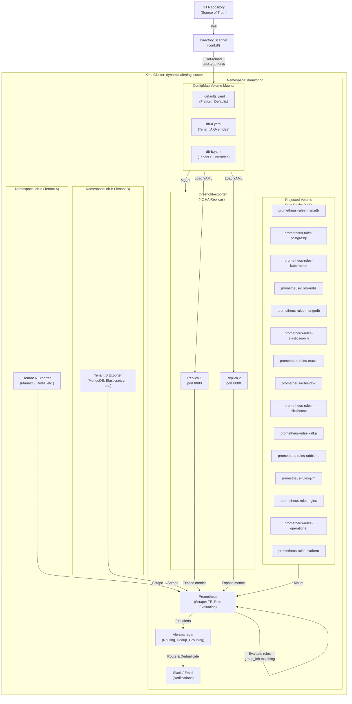

# 架構與設計 — 動態多租戶警報平台技術白皮書

> **Language / 語言：** **中文 (Current)** | [English](./architecture-and-design.en.md)

<!-- Language switcher is provided by mkdocs-static-i18n header. -->

## 簡介

這是「多租戶動態警報平台」的**架構 Hub**——一頁看懂系統怎麼組成、各設計概念是什麼，再路由到深入的 spoke 文件。技術深度為 Platform Engineer / SRE 寫；決策者的商業價值評估請直接看 [決策者評估指南](getting-started/for-decision-makers.md)，本頁業務影響欄僅為各技術概念的用途註解。

> 📖 **遇到不熟的術語**（`group_left`、Projected Volume、三態、Cardinality Guard、Sentinel Alert 等）？隨時查 [術語表](glossary.md)。

**如何讀**（讀者隨時可切換，且常多人同看一份）：

| 你是… | 先看 | 想深入再看 |
|---|---|---|
| 企業決策者 | [決策者評估指南](getting-started/for-decision-makers.md)（商業價值 + 證據） | [設計概念總覽](#設計概念總覽)、[性能基準](benchmarks.md) |
| 新讀者 / 初次了解 | 簡介、[§1 系統架構圖](#1-系統架構圖-system-architecture-diagram) | 設計概念總覽 |
| Platform / SRE | 全文 + 各 spoke | — |
| Domain Expert（DBA/Infra） | 設計概念總覽、Tenant API | [Config-Driven 設計](design/config-driven.md) |

> **多人同看**：先共享 **簡介 + §1 系統架構圖**（人人都懂的全貌），再各自下鑽到關心的 spoke。

**相關文件**：

| 文件 | 涵蓋主題 | 主要讀者 |
|------|---------|---------|
| *設計深入（spoke）* | | |
| [Config-Driven 設計](design/config-driven.md) | 三態配置、Directory Scanner、多層嚴重度、排程閾值、路由、Tenant API、繼承引擎 | Platform / SRE / Domain Expert |
| [Rule Packs 與 Projected Volume](design/rule-packs.md) | 16 個規則包、三部分結構、雙語 Annotation | Platform / Domain Expert |
| [高可用性 (HA)](design/high-availability.md) | 2 副本策略、PDB、滾動更新、SLA 99.9%+ | Platform / SRE |
| [Runtime Canary 設計](design/runtime-canary.md) | 自訂告警編譯管線端到端活性、dead-man's-switch、壞租戶隔離兩層說明（ADR-025 設計就緒） | Platform / SRE |
| [Recipe would-fire 預覽設計](design/recipe-would-fire-preview.md) | 在同一 modal 看 recipe 會不會 fire；compiler+promtool inverted-assert、facade host、合成輸入（#657 P1 設計就緒） | Platform / Domain Expert / SRE |
| [未來擴展路線](design/roadmap-future.md) | v2.9.0 已交付 + v2.10.0+ 長期探索 | Platform / 決策者 |
| *專題* | | |
| [性能基準](benchmarks.md) | 規模 / 速度 / 容量 / 穩定的實測數字 | Platform / SRE / 決策者 |
| [治理與安全](governance-security.md) | 稽核、安全紀律 | Platform / Security |
| [故障排查](troubleshooting.md) | 邊界案例、疑難排解 | Platform / SRE / 租戶 |
| [驗證場景與平台行為](scenarios/verified-scenarios.md) | 場景矩陣 | Platform / SRE |
| *導入與遷移* | | |
| [遷移引擎](migration-engine.md) | 既有 PromRule corpus 的 AST 遷移 | Platform / DevOps |
| [Migration Toolkit 安裝](migration-toolkit-installation.md) | 三條交付路徑、supply-chain 驗證 | Platform / DevOps |
| [VCS 整合](vcs-integration-guide.md) | GitOps / forge 整合 | Platform / DevOps |

---

## 1. 系統架構圖 (System Architecture Diagram)

### 1.1 C4 Context — 系統邊界與角色互動


```mermaid
graph TB
    PT["👤 Platform Team<br/>管理 _defaults.yaml<br/>維護 Rule Packs"]
    TT["👤 Tenant Team<br/>管理 tenant YAML<br/>設定閾值"]
    Git["📂 Git Repository<br/>conf.d/ + rule-packs/"]

    subgraph DAP["Dynamic Alerting Platform"]
        TE["threshold-exporter<br/>×2 HA"]
        PM["Prometheus<br/>+ 16 Rule Packs"]
        CM["ConfigMap<br/>threshold-config"]
    end

    AM["📟 Alertmanager<br/>→ Slack / PagerDuty"]

    PT -->|"PR: _defaults.yaml<br/>+ Rule Pack YAML"| Git
    TT -->|"PR: tenant YAML<br/>(閾值設定)"| Git
    Git -->|"GitOps sync<br/>(ArgoCD/Flux)"| CM
    CM -->|"SHA-256<br/>hot-reload"| TE
    TE -->|"Prometheus<br/>metrics :8080"| PM
    PM -->|"Alert rules<br/>evaluation"| AM

    style DAP fill:#e8f4fd,stroke:#1a73e8
    style Git fill:#f0f0f0,stroke:#666
    style AM fill:#fff3e0,stroke:#e65100
```

### 1.2 系統內部架構 (Internal Architecture)


```mermaid
graph TB
    subgraph Cluster["Kind Cluster: dynamic-alerting-cluster"]
        subgraph TenantA["Namespace: db-a (Tenant A)"]
            ExpA["Tenant A Exporter<br/>(MariaDB, Redis, etc.)"]
        end

        subgraph TenantB["Namespace: db-b (Tenant B)"]
            ExpB["Tenant B Exporter<br/>(MongoDB, Elasticsearch, etc.)"]
        end

        subgraph Monitoring["Namespace: monitoring"]
            subgraph Config["ConfigMap Volume Mounts"]
                CfgDefault["_defaults.yaml<br/>(Platform Defaults)"]
                CfgTenantA["db-a.yaml<br/>(Tenant A Overrides)"]
                CfgTenantB["db-b.yaml<br/>(Tenant B Overrides)"]
            end

            subgraph Export["threshold-exporter<br/>(×2 HA Replicas)"]
                TE1["Replica 1<br/>port 8080"]
                TE2["Replica 2<br/>port 8080"]
            end

            subgraph Rules["Projected Volume<br/>Rule Packs (×15)"]
                RP1["prometheus-rules-mariadb"]
                RP2["prometheus-rules-postgresql"]
                RP3["prometheus-rules-kubernetes"]
                RP4["prometheus-rules-redis"]
                RP5["prometheus-rules-mongodb"]
                RP6["prometheus-rules-elasticsearch"]
                RP7["prometheus-rules-oracle"]
                RP8["prometheus-rules-db2"]
                RP9["prometheus-rules-clickhouse"]
                RP10["prometheus-rules-kafka"]
                RP11["prometheus-rules-rabbitmq"]
                RP12["prometheus-rules-jvm"]
                RP13["prometheus-rules-nginx"]
                RP14["prometheus-rules-operational"]
                RP15["prometheus-rules-platform"]
            end

            Prom["Prometheus<br/>(Scrape: TE, Rule Evaluation)"]
            AM["Alertmanager<br/>(Routing, Dedup, Grouping)"]
            Slack["Slack / Email<br/>(Notifications)"]
        end
    end

    Git["Git Repository<br/>(Source of Truth)"]
    Scanner["Directory Scanner<br/>(conf.d/)"]

    Git -->|Pull| Scanner
    Scanner -->|Hot-reload<br/>SHA-256 hash| Config
    Config -->|Mount| Export
    ExpA -->|Scrape| Prom
    ExpB -->|Scrape| Prom
    Config -->|Load YAML| TE1
    Config -->|Load YAML| TE2
    TE1 -->|Expose metrics| Prom
    TE2 -->|Expose metrics| Prom
    Rules -->|Mount| Prom
    Prom -->|Evaluate rules<br/>group_left matching| Prom
    Prom -->|Fire alerts| AM
    AM -->|Route & Deduplicate| Slack
```

**架構要點：**
1. **Directory Scanner** 掃描 `conf.d/` 目錄，自動發現 `_defaults.yaml` 和租戶配置文件
2. **threshold-exporter × 2 HA Replicas** 讀取 ConfigMap，輸出三態 Prometheus 指標
3. **Projected Volume** 掛載 16 個獨立規則包，零 PR 衝突，各團隊獨立擁有
4. **Prometheus** 使用 `group_left` 向量匹配與用戶閾值進行聯接，實現 O(M) 複雜度（相比傳統 O(M×N)：固定 M 條規則 vs N×M 線性增長）

### 1.3 客戶導入與 GitOps 治理管線 (Day-0 / Day-1 / Day-2)

客戶導入管線把「Day-0 把既有 PromRule corpus 轉進來」「Day-1 用 GitOps PR 切塊治理」「Day-2 運行期熱重載」三階段串成一條可離線、可在 air-gapped 跑、可獨立驗 supply-chain 的端到端流程：


```mermaid
graph LR
    subgraph Day0["Day-0: Customer Migration"]
        PR["PromRule corpus<br/>(CRD / YAML)"] -->|da-parser| JSON["Canonical JSON<br/>+ prom_portable flag"]
        JSON -->|Profile Builder library| PB["Profile Builder<br/>(library-only, cluster + median, ADR-018)<br/>CLI 尚未出貨（規劃中）"]
    end

    subgraph Day1["Day-1: GitOps Hierarchy-Aware 治理"]
        PB -->|da-batchpr apply| PR1["Base Infrastructure PR<br/>(_defaults.yaml)"]
        PB -->|da-batchpr apply| PR2["Tenant Override PRs<br/>(&lt;id&gt;.yaml — Blocked by Base)"]
        PR1 -.->|refresh --base-merged| PR2
        PR1 -->|da-guard CI gate| LINT["sticky PR comment<br/>(Schema / Routing / Cardinality / Redundant-override)"]
        PR2 -->|da-guard CI gate| LINT
    end

    subgraph Day2["Day-2: Runtime"]
        LINT -->|Merge| GIT["Git repo (conf.d/)"]
        GIT -->|ArgoCD / Flux| CM["ConfigMap"]
        CM -->|dual-hash hot-reload| TE["threshold-exporter"]
    end

    style Day0 fill:#fff3e0,stroke:#d6b656
    style Day1 fill:#e8f4fd,stroke:#1a73e8
    style Day2 fill:#e8f5e9,stroke:#43a047
```

**全週期治理特色：**
- **零 vendor lock-in**：遷移工具為每條規則保留「可回 Prom」可移植標記，遷入 VictoriaMetrics 後仍能識別可回 Prometheus 的子集。
- **GitOps PR 切塊的正確順序**：Base PR 先 merge → 租戶 override PR 自動 rebase；parser 修正可針對特定規則細粒度重生 patch PR，不必整批重跑。
- **CI 自動把關**：四層檢查（Schema / Routing / Cardinality / 冗餘 override）以 sticky PR comment 回報（同一則留言原地更新、不洗版）+ artifact 保留。
- **三條交付路徑**：Docker image / 多架構 static binary / air-gapped tar，每條路徑 cosign keyless 簽章 + SBOM（SPDX / CycloneDX）；客戶 `make verify-release` 一鍵驗 supply-chain。

---

## 設計概念總覽

> 商業價值、ROI 與適配評估見 [決策者評估指南](getting-started/for-decision-makers.md)；本頁專注技術機制。

下表是**核心設計概念**的索引（timeless 能力，非逐版交付清單；版本歷史見 [§5](#5-未來路線-roadmap)）。每項都有獨立 spoke 文件深入：

| 設計概念 | 業務影響 | 技術機制 | 詳見 |
|--------|---------|---------|------|
| **Config-Driven 架構** | 新增租戶零額外規則成本；rule-pack 涵蓋的指標 Onboard 2hr→5min（複雜/拓樸指標的遷移時間見[遷移指南](migration-guide.md)） | 三態配置、Directory Scanner、階層式 `conf.d/`（ADR-016）、`_defaults.yaml` L0→L3 繼承（ADR-017）、dual-hash 熱重載 | [config-driven.md](design/config-driven.md) |
| **繼承引擎** | 配置乾淨化、減少重複、多層次預設管理 | `_defaults.yaml` L0→L3 深合併（ADR-017）+ 雙雜湊（source + merged）精確熱重載 + debounce 防 ConfigMap symlink rotation；扁平與階層式 `conf.d/` 共存（ADR-016） | [config-driven.md](design/config-driven.md) |
| **多層嚴重度** | 消除告警重複通知，團隊只收到最高優先級 | `_critical` 後綴、Severity Dedup、Alertmanager inhibit | [config-driven.md](design/config-driven.md) |
| **Regex 與排程式閾值** | 非工作時段自動調寬閾值，減少夜間假告警 | Regex 維度匹配、時間窗口排程 (UTC)、ResolveAt | [config-driven.md](design/config-driven.md) |
| **三態運營模式** | 維護窗口期間零告警干擾，自動恢復不遺忘 | Normal / Silent / Maintenance + expires 自動失效 | [config-driven.md](design/config-driven.md) |
| **Alert Routing** | 多通道通知確保關鍵告警必達正確人員 | 6 種 receiver、Timing Guardrails、Enforced Routing | [config-driven.md](design/config-driven.md) |
| **Tenant API** | Domain expert 可自助操作，無需 YAML 知識 | Commit-on-write + RBAC 熱更新 + PR Write-back + 套完繼承的 effective config endpoint | [config-driven.md](design/config-driven.md) |
| **Rule Packs** | 跨團隊並行開發零 PR 衝突 | 15 個 Projected Volume + 三部分結構 + 雙語 Annotation | [rule-packs.md](design/rule-packs.md) |
| **客戶導入管線** | 既有 PromRule corpus → `conf.d/` 全自動化；anti-vendor-lock-in；零 orphan tenant 風險 | 5-step 遷移鏈（解析 → Profile Builder → Hierarchy-Aware Batch PR → Dangling Defaults Guard）。圖示見 [§1.3](#13-客戶導入與-gitops-治理管線-day-0-day-1-day-2) | [migration-toolkit-installation.md](migration-toolkit-installation.md) |
| **效能架構** | 500+ tenant 毫秒級處理，資源成本近乎不隨租戶數增長 | Pre-computed Recording Rule、O(M) 複雜度、Cardinality Guard | [benchmarks.md](benchmarks.md) |
| **高可用性 (HA)** | SLA 99.9%+ 警報可靠度，滾動更新零中斷 | 2 副本、PDB、`max by(tenant)` 防雙倍計算 | [high-availability.md](design/high-availability.md) |
| **未來路線** | 權限 × 可觀測性閉環 × 智慧化 | Field-level RBAC、Auto-Discovery、DaC、Anomaly-Aware Threshold | [roadmap-future.md](design/roadmap-future.md) |

---

## 2. 核心設計：Config-Driven 架構

Config-Driven 是平台核心：租戶與平台只改 YAML、不寫 PromQL，由三態配置 + Directory Scanner + 階層繼承 + 向量匹配規則組成。涵蓋主題分四組（完整詳解見 [config-driven.md](design/config-driven.md)）：

- **配置與繼承**：三態邏輯（自訂值 / 省略採預設 / 停用）、`conf.d/` Directory Scanner + SHA-256 熱重載 + Incremental Reload、`_defaults.yaml` L0→L3 繼承、租戶↔namespace 映射（1:1 / N:1 / 1:N）。
- **告警語意**：多層嚴重度（`_critical` 後綴、`"value:severity"` 語法）、Regex 維度閾值（`=~`）、排程式閾值（UTC 時間窗、跨午夜）、三態運營模式（Normal / Silent / Maintenance + Sentinel Alert）。
- **路由**：6 種 receiver（Webhook / Email / Slack / Teams / RocketChat / PagerDuty）+ Timing Guardrails、Severity Dedup（Alertmanager inhibit）、per-rule 路由覆寫、平台強制路由（NOC 必收）、Routing Profiles 與域策略（ADR-007）。
- **效能與自助**：Pre-computed Recording Rule、O(M) 複雜度、Cardinality Guard、Tenant API（commit-on-write + RBAC 熱更新 + Portal 降級安全）。

---

## 3. Projected Volume 架構 (Rule Packs) — 簡介

平台管理 **16 個獨立規則包**，共 **139 個 Recording Rules + 99 個 Alert Rules**。每個 Rule Pack 為自包含的三部分結構：

1. **Part 1：標準化記錄規則** — 正規化不同匯出器的原始指標
2. **Part 2：閾值標準化** — 產出 `tenant:alert_threshold:*` 指標，供 Alert Rule 匹配
3. **Part 3：警報規則** — 實際告警條件（含雙語 Annotation）

**優點：** 零 PR 衝突、團隊自主、可複用、獨立測試。**完整詳解見** [rule-packs.md](design/rule-packs.md)。

---

> 💡 **互動工具**
>
> **容量規劃、依賴分析與驗證**：
>
> - [Capacity Planner](https://vencil.github.io/Dynamic-Alerting-Integrations/assets/jsx-loader.html?component=../interactive/tools/capacity-planner.jsx) — 估算叢集資源需求（基數、副本、記憶體）
> - [Dependency Graph](https://vencil.github.io/Dynamic-Alerting-Integrations/assets/jsx-loader.html?component=../interactive/tools/dependency-graph.jsx) — 視覺化 Rule Pack 與記錄規則的依賴關係
> - [PromQL Tester](https://vencil.github.io/Dynamic-Alerting-Integrations/assets/jsx-loader.html?component=../interactive/tools/promql-tester.jsx) — 測試與驗證 PromQL 查詢
>
> 更多工具見 [Interactive Tools Hub](https://vencil.github.io/Dynamic-Alerting-Integrations/)

---

## 4. 高可用性設計 (High Availability)

threshold-exporter 採用 2 副本 + PodAntiAffinity + PodDisruptionBudget 策略，確保滾動更新零停機、維護期間始終有 1 個副本服務 Prometheus 抓取。Recording rule 使用 `max by(tenant)` 防止 HA 翻倍計算。

### 4.1 部署策略 (Deployment Strategy)

```yaml
replicas: 2
strategy:
  type: RollingUpdate
  rollingUpdate:
    maxUnavailable: 0    # 滾動更新零停機
    maxSurge: 1

affinity:
  podAntiAffinity:
    preferredDuringSchedulingIgnoredDuringExecution:
      - weight: 100
        podAffinityTerm:
          topologyKey: kubernetes.io/hostname
```

**特性**：
- 2 副本分散於不同節點
- 滾動更新期間始終保持 1 個副本可用
- Kind 單節點叢集：軟 affinity 允許 bin-packing

### 4.2 Pod Disruption Budget

```yaml
apiVersion: policy/v1
kind: PodDisruptionBudget
metadata:
  name: threshold-exporter-pdb
spec:
  minAvailable: 1
  selector:
    matchLabels:
      app: threshold-exporter
```

**保證**：即使在主動維護期間，始終有 1 個副本服務 Prometheus 抓取

**完整部署 YAML 與 SLA 分析見** [high-availability.md](design/high-availability.md)

---

## 5. 未來路線 (Roadmap)

> 版本歷史（v2.7.0 → v2.9.0 各版交付了什麼）見 [CHANGELOG](https://github.com/vencil/Dynamic-Alerting-Integrations/blob/main/CHANGELOG.md)；本節只談現況與前瞻。

**現況（v2.9.0 已交付的能力骨幹）**：租戶自助告警（Custom Alerts，6 種平台 authored recipe、不寫 PromQL）+ 租戶聯邦（讀路徑 proxy + 2-tier policy + 金鑰輪替 + offboarding）+ 寫入平面單寫者韌性 + 平台日誌彙整。

**v2.10.0 規劃中**：租戶聯邦深化 × 反應式硬化延續。方向見 live milestone [v2.10.0](https://github.com/vencil/Dynamic-Alerting-Integrations/milestone/3)。

**長期探索**：

- **智慧化**：Anomaly-Aware Threshold、Log-to-Metric Bridge。
- **去耦合與整合**：Multi-Format Export、CRD、ChatOps。
- **細粒度權限**：Field-level RBAC、Tenant Auto-Discovery。
- **深水區（defer-with-trigger）**：寫入路徑 QoS 分流、調諧的觀察者效應、PromQL 沙箱——僅在達到觸發條件時才動，避免過早投資。

**完整路線圖見** [roadmap-future.md](design/roadmap-future.md)。

---

## 6. ADR 索引 (Architecture Decision Records)

> 自動產生 — `scripts/dx/generate_adr_index.py` 從 `docs/adr/` frontmatter + `## 狀態` 區塊重新渲染。**新增或修改 ADR 後跑 `make adr-index`**；pre-commit drift gate 會擋 stale 表。

<!-- ADR_INDEX_START -->
| ADR | 標題 | 狀態 | 版本 |
|-----|------|------|------|
| ADR-001 | [嚴重度 Dedup 採用 Inhibit 規則](adr/001-severity-dedup-via-inhibit.md) | ✅ Accepted | v1.0.0 |
| ADR-002 | [OCI Registry 替代 ChartMuseum](adr/002-oci-registry-over-chartmuseum.md) | ✅ Accepted | v1.12.0 |
| ADR-003 | [Sentinel Alert 模式](adr/003-sentinel-alert-pattern.md) | ✅ Accepted | v1.0.0 |
| ADR-004 | [Federation 架構——中央 Exporter 優先](adr/004-federation-central-exporter-first.md) | ✅ Accepted | v1.12.0 |
| ADR-005 | [投影卷掛載 Rule Pack](adr/005-projected-volume-for-rule-packs.md) | ✅ Accepted | v1.0.0 |
| ADR-006 | [租戶映射拓撲 (1:1, N:1, 1:N)](adr/006-tenant-mapping-topologies.md) | ✅ Accepted | v2.1.0 |
| ADR-007 | [跨域路由設定檔與域策略](adr/007-cross-domain-routing-profiles.md) | ✅ Accepted | v2.1.0 |
| ADR-008 | [Operator-Native 整合路徑](adr/008-operator-native-integration-path.md) | ✅ Accepted | v2.3.0 |
| ADR-009 | [Tenant Manager CRUD API 架構](adr/009-tenant-manager-crud-api.md) | ✅ Accepted | v2.4.0 |
| ADR-010 | [Multi-Tenant Grouping Architecture](adr/010-multi-tenant-grouping.md) | ✅ Accepted | v2.5.0 |
| ADR-011 | [PR-based Write-back 模式](adr/011-pr-based-write-back.md) | ✅ Accepted | v2.6.0 |
| ADR-012 | [threshold-heatmap 色盲補丁 — 結構化 severity 返回值](adr/012-colorblind-hotfix-structured-severity-return.md) | ✅ Accepted | v2.7.0 |
| ADR-013 | [Component Health Scanner — Tier 評分演算法與 token_density 輔助指標](adr/013-component-health-token-density-metric.md) | ✅ Accepted | v2.7.0 |
| ADR-014 | [wizard.jsx design token 遷移採 Option A（Tailwind arbitrary value 全改寫）](adr/014-wizard-arbitrary-value-token-migration.md) | ✅ Accepted | v2.7.0 |
| ADR-015 | [全面改用 `[data-theme]` 單軌 dark mode，移除 Tailwind `dark:` 變體](adr/015-data-theme-single-track-dark-mode.md) | ✅ Accepted | v2.7.0 |
| ADR-016 | [conf.d/ 目錄分層 + 混合模式 + 遷移策略](adr/016-conf-d-directory-hierarchy-mixed-mode.md) | ✅ Accepted | v2.7.0 |
| ADR-017 | [_defaults.yaml 繼承語意 + dual-hash hot-reload](adr/017-defaults-yaml-inheritance-dual-hash.md) | ✅ Accepted | v2.7.0 |
| ADR-018 | [Profile-as-Directory-Default](adr/018-profile-as-directory-default.md) | 🟢 Accepted | v2.8.0 |
| ADR-019 | [Planning SSOT — Frontmatter Contract + Discovery-based Index](adr/019-planning-ssot.md) | ✅ Accepted | v2.8.0 |
| ADR-020 | [Tenant Federation — Label-Injection Proxy over Self-Built Endpoint](adr/020-tenant-federation.md) | ✅ Accepted | v2.8.0 |
| ADR-021 | [Tenant Log Query — Authorization-Plane-Only, Ingestion-Decoupled](adr/021-tenant-log-query-federation.md) | ✅ Accepted | v2.9.0 |
| ADR-022 | [tenant-api Dev-Auth Bypass — Local-Dev Identity Substitute, Four-Layer Containment](adr/022-dev-auth-bypass-four-layer-containment.md) | ✅ Accepted | v2.9.0 |
| ADR-023 | [tenant-api 寫入平面 — 單一寫者不變式](adr/023-write-plane-single-writer-invariant.md) | ✅ Accepted | — |
| ADR-024 | [宣告式 Dimensional 告警引擎 — Version-Aware Thresholds + Custom Alerts](adr/024-version-aware-threshold-via-dimensional-label.md) | ✅ Accepted | v2.9.0 |
| ADR-025 | [告警平面自我存活性 — 讓告警系統能偵測自己的死亡](adr/025-alerting-plane-self-liveness.md) | ✅ Accepted | — |
| ADR-026 | [Node/Cluster 維護告警抑制 — 不需要子系統](adr/026-node-maintenance-liveness-suppression.md) | 🟡 Proposed | — |
| ADR-028 | [Federation 撤銷儲存 tamper-evidence — off-cluster 對帳為主控](adr/028-federation-revocation-tamper-evidence.md) | ✅ Accepted | — |
| ADR-029 | [租戶自訂告警跨租戶查詢隔離 — 編譯期邊界中和為主、評估期 ruler 隔離延後](adr/029-custom-alert-cross-tenant-query-scoping.md) | ✅ Accepted | — |
| ADR-030 | [決策層遷移驗證 — 製造 Oracle 而非觀測](adr/030-decision-layer-migration-validation.md) | 🟡 Proposed | — |

<!-- ADR_INDEX_END -->

ADR 完整檔案見 [`docs/adr/`](adr/)；ZH 為 SSOT primary，部分 ADR 另附 `.en.md` sibling（ADR-019 起多為 ZH-only，依語言政策）。

---

## 附錄：角色與工具速查

> 詳細工具用法見 [CLI Reference](cli-reference.md)。
