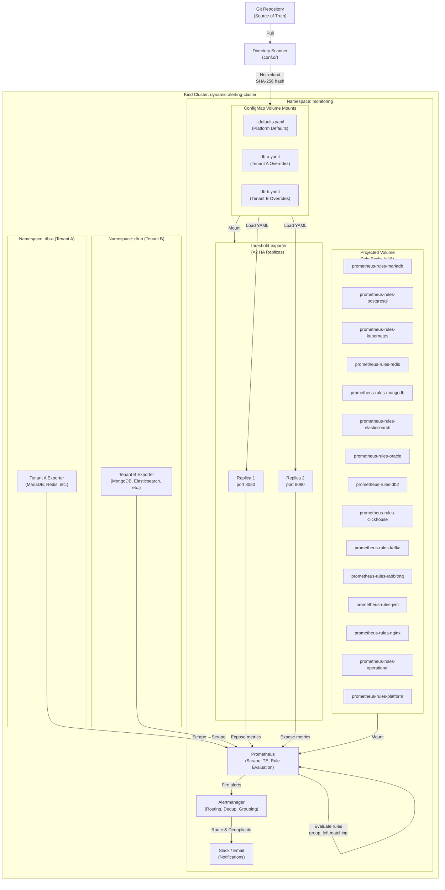

# 架構與設計 — 動態多租戶警報平台技術白皮書

<!-- Language switcher is provided by mkdocs-static-i18n header. -->

## 簡介

本文件針對 Platform Engineers 和 Site Reliability Engineers (SREs) 深入探討「多租戶動態警報平台」(Multi-Tenant Dynamic Alerting Platform) 的技術架構。

本文件是架構 Hub — 系統架構圖 + 設計概念索引。詳細內容在各 spoke 文件中展開。

**設計文件（spoke）：**

| 文件 | 涵蓋主題 |
|------|---------|
| [Config-Driven 設計](design/config-driven.md) | 三態配置、Directory Scanner、多層嚴重度、排程式閾值、路由、Tenant API |
| [Rule Packs 與 Projected Volume](design/rule-packs.md) | 15 個規則包、三部分結構、雙語 Annotation |
| [高可用性 (HA)](design/high-availability.md) | 2 副本策略、PDB、滾動更新、SLA 99.9%+ |
| [未來擴展路線](design/roadmap-future.md) | v2.7.0 計畫中 → 長期探索方向 |

**專題文件：** [性能基準](benchmarks.md) · [治理與安全](governance-security.md) · [故障排查](troubleshooting.md) · [進階場景](internal/test-coverage-matrix.md) · [遷移引擎](migration-engine.md) · [VCS 整合](vcs-integration-guide.md) · [Backstage Plugin](https://github.com/vencil/Dynamic-Alerting-Integrations/blob/main/components/backstage-plugin/README.md)

---

## 1. 系統架構圖 (System Architecture Diagram)

### 1.1 C4 Context — 系統邊界與角色互動


```mermaid
graph TB
    PT["👤 Platform Team<br/>管理 _defaults.yaml<br/>維護 Rule Packs"]
    TT["👤 Tenant Team<br/>管理 tenant YAML<br/>設定閾值"]
    Git["📂 Git Repository<br/>conf.d/ + rule-packs/"]

    subgraph DAP["Dynamic Alerting Platform"]
        TE["threshold-exporter<br/>×2 HA"]
        PM["Prometheus<br/>+ 15 Rule Packs"]
        CM["ConfigMap<br/>threshold-config"]
    end

    AM["📟 Alertmanager<br/>→ Slack / PagerDuty"]

    PT -->|"PR: _defaults.yaml<br/>+ Rule Pack YAML"| Git
    TT -->|"PR: tenant YAML<br/>(閾值設定)"| Git
    Git -->|"GitOps sync<br/>(ArgoCD/Flux)"| CM
    CM -->|"SHA-256<br/>hot-reload"| TE
    TE -->|"Prometheus<br/>metrics :8080"| PM
    PM -->|"Alert rules<br/>evaluation"| AM

    style DAP fill:#e8f4fd,stroke:#1a73e8
    style Git fill:#f0f0f0,stroke:#666
    style AM fill:#fff3e0,stroke:#e65100
```

### 1.2 系統內部架構 (Internal Architecture)


```mermaid
graph TB
    subgraph Cluster["Kind Cluster: dynamic-alerting-cluster"]
        subgraph TenantA["Namespace: db-a (Tenant A)"]
            ExpA["Tenant A Exporter<br/>(MariaDB, Redis, etc.)"]
        end

        subgraph TenantB["Namespace: db-b (Tenant B)"]
            ExpB["Tenant B Exporter<br/>(MongoDB, Elasticsearch, etc.)"]
        end

        subgraph Monitoring["Namespace: monitoring"]
            subgraph Config["ConfigMap Volume Mounts"]
                CfgDefault["_defaults.yaml<br/>(Platform Defaults)"]
                CfgTenantA["db-a.yaml<br/>(Tenant A Overrides)"]
                CfgTenantB["db-b.yaml<br/>(Tenant B Overrides)"]
            end

            subgraph Export["threshold-exporter<br/>(×2 HA Replicas)"]
                TE1["Replica 1<br/>port 8080"]
                TE2["Replica 2<br/>port 8080"]
            end

            subgraph Rules["Projected Volume<br/>Rule Packs (×15)"]
                RP1["prometheus-rules-mariadb"]
                RP2["prometheus-rules-postgresql"]
                RP3["prometheus-rules-kubernetes"]
                RP4["prometheus-rules-redis"]
                RP5["prometheus-rules-mongodb"]
                RP6["prometheus-rules-elasticsearch"]
                RP7["prometheus-rules-oracle"]
                RP8["prometheus-rules-db2"]
                RP9["prometheus-rules-clickhouse"]
                RP10["prometheus-rules-kafka"]
                RP11["prometheus-rules-rabbitmq"]
                RP12["prometheus-rules-jvm"]
                RP13["prometheus-rules-nginx"]
                RP14["prometheus-rules-operational"]
                RP15["prometheus-rules-platform"]
            end

            Prom["Prometheus<br/>(Scrape: TE, Rule Evaluation)"]
            AM["Alertmanager<br/>(Routing, Dedup, Grouping)"]
            Slack["Slack / Email<br/>(Notifications)"]
        end
    end

    Git["Git Repository<br/>(Source of Truth)"]
    Scanner["Directory Scanner<br/>(conf.d/)"]

    Git -->|Pull| Scanner
    Scanner -->|Hot-reload<br/>SHA-256 hash| Config
    Config -->|Mount| Export
    ExpA -->|Scrape| Prom
    ExpB -->|Scrape| Prom
    Config -->|Load YAML| TE1
    Config -->|Load YAML| TE2
    TE1 -->|Expose metrics| Prom
    TE2 -->|Expose metrics| Prom
    Rules -->|Mount| Prom
    Prom -->|Evaluate rules<br/>group_left matching| Prom
    Prom -->|Fire alerts| AM
    AM -->|Route & Deduplicate| Slack
```

**架構要點：**
1. **Directory Scanner** 掃描 `conf.d/` 目錄，自動發現 `_defaults.yaml` 和租戶配置文件
2. **threshold-exporter × 2 HA Replicas** 讀取 ConfigMap，輸出三態 Prometheus 指標
3. **Projected Volume** 掛載 15 個獨立規則包，零 PR 衝突，各團隊獨立擁有
4. **Prometheus** 使用 `group_left` 向量匹配與用戶閾值進行聯接，實現 O(M) 複雜度（相比傳統 O(M×N)：固定 M 條規則 vs N×M 線性增長）

---

## 設計概念總覽

> **為何這套架構值得投資？** 在典型的 50-tenant 環境中，Config-Driven 架構將規則維護從 O(N×M) 降至 O(M)，每月節省 40+ 小時工程時間。Severity Dedup 與三態模式組合壓制 60%+ 告警噪音，大幅改善 On-call 團隊的工作品質。

以下表格總結核心設計概念，每項都有獨立的深入文件供進一步閱讀：

| 設計概念 | 業務影響 | 技術機制 | 詳見 |
|--------|---------|---------|------|
| **Config-Driven 架構** | 新增租戶零額外規則成本，Onboard 從 2hr 降至 5min | 三態配置、Directory Scanner、階層式 `conf.d/`（ADR-017）、`_defaults.yaml` L0→L3 繼承（ADR-018）、Dual-hash hot-reload | [design/config-driven.md](design/config-driven.md) |
| **多層嚴重度** | 消除告警重複通知，團隊只收到最高優先級 | `_critical` 後綴、Severity Dedup、Alertmanager inhibit | [design/config-driven.md](design/config-driven.md) |
| **Regex 與排程式閾值** | 非工作時段自動調寬閾值，減少夜間假告警 | Regex 維度匹配、時間窗口排程 (UTC)、ResolveAt | [design/config-driven.md](design/config-driven.md) |
| **三態運營模式** | 維護窗口期間零告警干擾，自動恢復不遺忘 | Normal / Silent / Maintenance + expires 自動失效 | [design/config-driven.md](design/config-driven.md) |
| **Alert Routing** | 多通道通知確保關鍵告警必達正確人員 | 6 種 receiver、Timing Guardrails、Enforced Routing | [design/config-driven.md](design/config-driven.md) |
| **Tenant API** | Domain expert 可自助操作，無需 YAML 知識 | Commit-on-write + RBAC 熱更新 + PR Write-back (v2.6.0) + `GET /tenants/{id}/effective` 套完繼承的 merged config + dual hashes (v2.7.0) | [design/config-driven.md](design/config-driven.md) |
| **Rule Packs** | 跨團隊並行開發零 PR 衝突 | 15 個 Projected Volume + 三部分結構 + 雙語 Annotation | [design/rule-packs.md](design/rule-packs.md) |
| **效能架構** | 500+ tenant 毫秒級處理，資源成本近乎不隨租戶數增長 | Pre-computed Recording Rule、O(M) 複雜度、Cardinality Guard | [design/config-driven.md](design/config-driven.md) |
| **高可用性 (HA)** | SLA 99.9%+ 警報可靠度，滾動更新零中斷 | 2 副本、PDB、`max by(tenant)` 防雙倍計算 | [design/high-availability.md](design/high-availability.md) |
| **繼承引擎 (Inheritance Engine)** 🟢 *v2.7.0 已發布* | 配置乾淨化、減少重複、多層次預設管理 | `_defaults.yaml` 於 domain/region/env 層提供可繼承的預設（L0→L1→L2→L3 深合併、array 替換、null-as-delete）(ADR-018)、雙雜湊 (source_hash + merged_hash) 精確熱重載 + 300ms debounce 防 ConfigMap symlink rotation 連動、平坦與階層式 conf.d/ 共存 (ADR-017)。**v2.7.0 交付**：Go 生產路徑 (`config_debounce.go` + `config_metrics.go` + `populateHierarchyState()` + `--scan-debounce` flag) + 3 個新 Prometheus metric (`da_config_scan_duration_seconds` / `da_config_reload_trigger_total{reason}` / `da_config_defaults_change_noop_total`) + Tenant API `GET /tenants/{id}/effective` + `da-tools describe-tenant` / `migrate-conf-d` CLI | [design/config-driven.md](design/config-driven.md) |
| **未來路線** | 國際化 × 權限 × 可觀測性閉環 × 智慧化 | EN-first SSOT、Field-level RBAC、Auto-Discovery、DaC | [design/roadmap-future.md](design/roadmap-future.md) |

---

## 2. 核心設計：Config-Driven 架構

### 2.1–2.14 完整詳解

Config-Driven 架構是平台的核心，涵蓋以下主題：

- **三態邏輯** (§2.1)：Custom Value / Omitted (Default) / Disable
- **Directory Scanner 模式** (§2.2)：`conf.d/` 目錄結構、`_defaults.yaml`、SHA-256 hot-reload、Incremental Reload
- **Tenant-Namespace 映射** (§2.3)：1:1 / N:1 / 1:N 映射模式
- **多層嚴重度** (§2.4)：`_critical` 後綴、`"value:severity"` 語法、Severity Dedup
- **Regex 維度閾值** (§2.5)：`=~` 運算子、Regex 模式匹配
- **排程式閾值** (§2.6)：時間窗口排程、UTC 時區、跨午夜支援
- **三態運營模式** (§2.7)：Normal / Silent / Maintenance、自動失效、Sentinel Alert
- **Severity Dedup** (§2.8)：Alertmanager inhibit 層去重、Per-tenant 控制
- **Alert Routing 客製化** (§2.9)：Webhook / Email / Slack / Teams / RocketChat / PagerDuty、Timing Guardrails
- **Per-rule Routing Overrides** (§2.10)：Alertname / Metric Group 級別的路由覆寫
- **Platform Enforced Routing** (§2.11)：NOC 必收機制、Per-tenant Enforced Channel
- **Routing Profiles 與 Domain Policies** (§2.12)：ADR-007、四層合併流水線
- **效能架構** (§2.13)：Pre-computed Recording Rule、O(M) 複雜度、Cardinality Guard
- **Tenant API 架構** (§2.14)：Commit-on-write、RBAC 熱更新、Portal 降級安全

**所有詳細內容已獨立至** [design/config-driven.md](design/config-driven.md)

---

## 3. Projected Volume 架構 (Rule Packs) — 簡介

平台管理 **15 個獨立規則包**，共 **139 個 Recording Rules + 99 個 Alert Rules**。每個 Rule Pack 包含自包含的三部分結構：

1. **Part 1：標準化記錄規則** — 正規化不同匯出器的原始指標
2. **Part 2：閾值標準化** — 產出 `tenant:alert_threshold:*` 指標，用於 Alert Rule 匹配
3. **Part 3：警報規則** — 實際告警條件（含雙語 Annotation）

**優點：** 零 PR 衝突、團隊自主、可複用、獨立測試

**完整詳解見** [design/rule-packs.md](design/rule-packs.md)

---

> 💡 **互動工具**
>
> **容量規劃、依賴分析與驗證**：
>
> - [Capacity Planner](https://vencil.github.io/Dynamic-Alerting-Integrations/assets/jsx-loader.html?component=../interactive/tools/capacity-planner.jsx) — 估算叢集資源需求（基數、副本、記憶體）
> - [Dependency Graph](https://vencil.github.io/Dynamic-Alerting-Integrations/assets/jsx-loader.html?component=../interactive/tools/dependency-graph.jsx) — 視覺化 Rule Pack 與記錄規則的依賴關係
> - [PromQL Tester](https://vencil.github.io/Dynamic-Alerting-Integrations/assets/jsx-loader.html?component=../interactive/tools/promql-tester.jsx) — 測試與驗證 PromQL 查詢
>
> 更多工具見 [Interactive Tools Hub](https://vencil.github.io/Dynamic-Alerting-Integrations/)

---

## 4. 高可用性設計 (High Availability)

threshold-exporter 採用 2 副本 + PodAntiAffinity + PodDisruptionBudget 策略，確保滾動更新零停機、維護期間始終有 1 個副本服務 Prometheus 抓取。Recording rule 使用 `max by(tenant)` 防止 HA 翻倍計算。

### 4.1 部署策略 (Deployment Strategy)

```yaml
replicas: 2
strategy:
  type: RollingUpdate
  rollingUpdate:
    maxUnavailable: 0    # 滾動更新零停機
    maxSurge: 1

affinity:
  podAntiAffinity:
    preferredDuringSchedulingIgnoredDuringExecution:
      - weight: 100
        podAffinityTerm:
          topologyKey: kubernetes.io/hostname
```

**特性**：
- 2 副本分散於不同節點
- 滾動更新期間始終保持 1 個副本可用
- Kind 單節點叢集：軟 affinity 允許 bin-packing

### 4.2 Pod Disruption Budget

```yaml
apiVersion: policy/v1
kind: PodDisruptionBudget
metadata:
  name: threshold-exporter-pdb
spec:
  minAvailable: 1
  selector:
    matchLabels:
      app: threshold-exporter
```

**保證**：即使在主動維護期間，始終有 1 個副本服務 Prometheus 抓取

**完整部署 YAML 與 SLA 分析見** [design/high-availability.md](design/high-availability.md)

---

## 5. 未來擴展路線 (Future Roadmap)

| 時程 | 主題 | 重點方向 |
|------|------|---------|
| **v2.7.0 已發布** | Scale Foundation + 元件健壯化 | `conf.d/` 目錄分層 + `_defaults.yaml` 繼承引擎（ADR-017/018）、Go 生產路徑完成（`config_debounce.go` + `config_metrics.go` + Tenant API `/effective` endpoint + dual-hash 熱重載）、Blast Radius CI bot ✅、Tier 1 元件健康度快照 ✅、1000-tenant synthetic fixture ✅、SSOT 語言 Phase 1 試點 ✅ |
| **v2.8.0 計畫中** | 千租戶上線 × 控制台整合 | Scale Foundation II（server-side search、Tenant Manager virtualized）、SSOT EN-first 全量遷移、Master Onboarding Journey、Field-level RBAC、剩餘 24 個 Playwright `test.fixme()` 清倉（C-1/C-3/C-4） |
| **長期探索** | 智慧化 × 去耦合 | Anomaly-Aware Threshold、Log-to-Metric Bridge、Multi-Format Export、CRD、ChatOps |

**完整路線圖與技術規劃見** [design/roadmap-future.md](design/roadmap-future.md) · DX 工具改善見 [dx-tooling-backlog.md](internal/dx-tooling-backlog.md) · v2.7.0 執行紀錄見 `internal/v2.7.0-planning.md`（internal-only planning doc，GitHub 上直接瀏覽此路徑）

---

## 拆分文件 (Extracted Topic Documents)

以下章節已拆分為獨立文件，便於角色聚焦閱讀：

| 章節 | 獨立文件 | 目標讀者 |
|------|----------|----------|
| §4 效能分析與基準測試 | [benchmarks.md](benchmarks.md) | Platform Engineers, SREs |
| §6–§7 治理、稽核與安全 | [governance-security.md](governance-security.md) | Platform Engineers, Security & Compliance |
| §8 疑難排解與邊界案例 | [troubleshooting.md](troubleshooting.md) | Platform Engineers, SREs, Tenants |
| §9 進階情境與測試覆蓋 | [internal/test-coverage-matrix.md](internal/test-coverage-matrix.md) | Platform Engineers, SREs |
| §10 AST 遷移引擎 | [migration-engine.md](migration-engine.md) | Platform Engineers, DevOps |

---

## 附錄：角色與工具速查

> 詳細工具用法見 [CLI Reference](cli-reference.md)。

