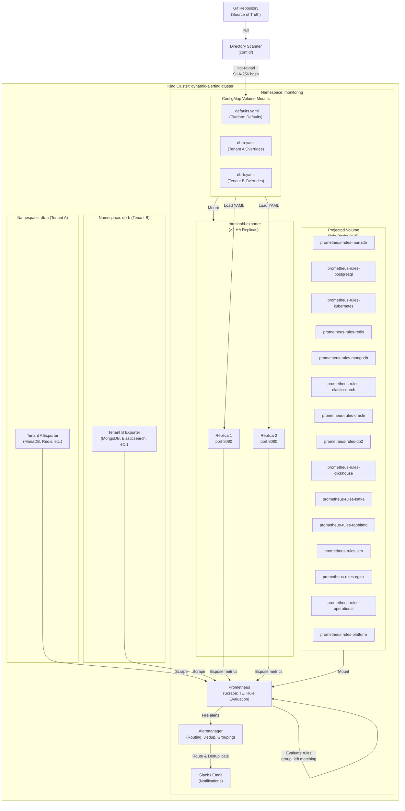

# 架構與設計 — 動態多租戶警報平台技術白皮書

> **Language / 語言：** | **中文（當前）** | [English](architecture-and-design.en.md)

## 簡介

本文件針對 Platform Engineers 和 Site Reliability Engineers (SREs) 深入探討「多租戶動態警報平台」(Multi-Tenant Dynamic Alerting Platform) 的技術架構。

**本文涵蓋內容：**
- 系統架構與核心設計理念（含 Regex 維度閾值、排程式閾值）
- 高可用性 (HA) 設計
- Rule Pack 治理模型簡介（詳見 [design/rule-packs.md](design/rule-packs.md)）

**獨立設計文件（spoke 檔案）：**
- **Config-Driven 設計詳解** → [design/config-driven.md](design/config-driven.md)
- **Rule Packs 與 Projected Volume** → [design/rule-packs.md](design/rule-packs.md)
- **高可用性 (HA) 深度** → [design/high-availability.md](design/high-availability.md)
- **未來擴展路線** → [design/roadmap-future.md](design/roadmap-future.md)

**獨立專題文件：** 性能基準測試 → [benchmarks.md](benchmarks.md) · 治理與安全 → [governance-security.md](governance-security.md) · 故障排查 → [troubleshooting.md](troubleshooting.md) · 進階場景 → [scenarios/advanced-scenarios.md](scenarios/advanced-scenarios.md) · 遷移引擎 → [migration-engine.md](migration-engine.md)

**其他相關文件：**
- **快速入門** → [README.md](index.md)
- **遷移指南** → [migration-guide.md](migration-guide.md)
- **規則包文件** → [rule-packs/README.md](rule-packs/README.md)
- **threshold-exporter 元件** → [components/threshold-exporter/README.md](https://github.com/vencil/Dynamic-Alerting-Integrations/blob/main/components/threshold-exporter/README.md)
- **性能基準測試** → [benchmarks.md](benchmarks.md)
- **治理與安全合規** → [governance-security.md](governance-security.md)
- **故障排查與邊界情況** → [troubleshooting.md](troubleshooting.md)
- **進階場景與測試覆蓋** → [scenarios/advanced-scenarios.md](scenarios/advanced-scenarios.md)
- **AST 遷移引擎架構** → [migration-engine.md](migration-engine.md)

---

## 1. 系統架構圖 (System Architecture Diagram)

### 1.1 C4 Context — 系統邊界與角色互動


```mermaid
graph TB
    PT["👤 Platform Team<br/>管理 _defaults.yaml<br/>維護 Rule Packs"]
    TT["👤 Tenant Team<br/>管理 tenant YAML<br/>設定閾值"]
    Git["📂 Git Repository<br/>conf.d/ + rule-packs/"]

    subgraph DAP["Dynamic Alerting Platform"]
        TE["threshold-exporter<br/>×2 HA"]
        PM["Prometheus<br/>+ 15 Rule Packs"]
        CM["ConfigMap<br/>threshold-config"]
    end

    AM["📟 Alertmanager<br/>→ Slack / PagerDuty"]

    PT -->|"PR: _defaults.yaml<br/>+ Rule Pack YAML"| Git
    TT -->|"PR: tenant YAML<br/>(閾值設定)"| Git
    Git -->|"GitOps sync<br/>(ArgoCD/Flux)"| CM
    CM -->|"SHA-256<br/>hot-reload"| TE
    TE -->|"Prometheus<br/>metrics :8080"| PM
    PM -->|"Alert rules<br/>evaluation"| AM

    style DAP fill:#e8f4fd,stroke:#1a73e8
    style Git fill:#f0f0f0,stroke:#666
    style AM fill:#fff3e0,stroke:#e65100
```

### 1.2 系統內部架構 (Internal Architecture)


```mermaid
graph TB
    subgraph Cluster["Kind Cluster: dynamic-alerting-cluster"]
        subgraph TenantA["Namespace: db-a (Tenant A)"]
            ExpA["Tenant A Exporter<br/>(MariaDB, Redis, etc.)"]
        end

        subgraph TenantB["Namespace: db-b (Tenant B)"]
            ExpB["Tenant B Exporter<br/>(MongoDB, Elasticsearch, etc.)"]
        end

        subgraph Monitoring["Namespace: monitoring"]
            subgraph Config["ConfigMap Volume Mounts"]
                CfgDefault["_defaults.yaml<br/>(Platform Defaults)"]
                CfgTenantA["db-a.yaml<br/>(Tenant A Overrides)"]
                CfgTenantB["db-b.yaml<br/>(Tenant B Overrides)"]
            end

            subgraph Export["threshold-exporter<br/>(×2 HA Replicas)"]
                TE1["Replica 1<br/>port 8080"]
                TE2["Replica 2<br/>port 8080"]
            end

            subgraph Rules["Projected Volume<br/>Rule Packs (×15)"]
                RP1["prometheus-rules-mariadb"]
                RP2["prometheus-rules-postgresql"]
                RP3["prometheus-rules-kubernetes"]
                RP4["prometheus-rules-redis"]
                RP5["prometheus-rules-mongodb"]
                RP6["prometheus-rules-elasticsearch"]
                RP7["prometheus-rules-oracle"]
                RP8["prometheus-rules-db2"]
                RP9["prometheus-rules-clickhouse"]
                RP10["prometheus-rules-kafka"]
                RP11["prometheus-rules-rabbitmq"]
                RP12["prometheus-rules-jvm"]
                RP13["prometheus-rules-nginx"]
                RP14["prometheus-rules-operational"]
                RP15["prometheus-rules-platform"]
            end

            Prom["Prometheus<br/>(Scrape: TE, Rule Evaluation)"]
            AM["Alertmanager<br/>(Routing, Dedup, Grouping)"]
            Slack["Slack / Email<br/>(Notifications)"]
        end
    end

    Git["Git Repository<br/>(Source of Truth)"]
    Scanner["Directory Scanner<br/>(conf.d/)"]

    Git -->|Pull| Scanner
    Scanner -->|Hot-reload<br/>SHA-256 hash| Config
    Config -->|Mount| Export
    ExpA -->|Scrape| Prom
    ExpB -->|Scrape| Prom
    Config -->|Load YAML| TE1
    Config -->|Load YAML| TE2
    TE1 -->|Expose metrics| Prom
    TE2 -->|Expose metrics| Prom
    Rules -->|Mount| Prom
    Prom -->|Evaluate rules<br/>group_left matching| Prom
    Prom -->|Fire alerts| AM
    AM -->|Route & Deduplicate| Slack
```

**架構要點：**
1. **Directory Scanner** 掃描 `conf.d/` 目錄，自動發現 `_defaults.yaml` 和租戶配置文件
2. **threshold-exporter × 2 HA Replicas** 讀取 ConfigMap，輸出三態 Prometheus 指標
3. **Projected Volume** 掛載 15 個獨立規則包，零 PR 衝突，各團隊獨立擁有
4. **Prometheus** 使用 `group_left` 向量匹配與用戶閾值進行聯接，實現 O(M) 複雜度（相比傳統 O(M×N)：固定 M 條規則 vs N×M 線性增長）

---

## 設計概念總覽

以下表格總結核心設計概念，每項都有獨立的深入文件供進一步閱讀：

| 設計概念 | 概述 | 詳見 |
|--------|------|------|
| **Config-Driven 架構** | 三態配置（Custom/Default/Disable）、Directory Scanner、SHA-256 hot-reload、Tenant-Namespace 映射 | [design/config-driven.md](design/config-driven.md) |
| **多層嚴重度** | `_critical` 後綴與 `"value:severity"` 語法、Severity Dedup、Alertmanager inhibit | [design/config-driven.md](design/config-driven.md) |
| **Regex 與排程式閾值** | Regex 維度匹配 (`=~`)、時間窗口排程 (UTC)、ResolveAt 機制 | [design/config-driven.md](design/config-driven.md) |
| **三態運營模式** | Normal / Silent / Maintenance、自動失效、Sentinel Alert 模式 | [design/config-driven.md](design/config-driven.md) |
| **Alert Routing 與 Receivers** | 6 種 receiver type、Timing Guardrails、Per-rule Overrides、Enforced Routing、Routing Profiles | [design/config-driven.md](design/config-driven.md) |
| **Tenant API 架構** | Commit-on-write、RBAC 熱更新、驗證邏輯共用、Portal 降級安全 | [design/config-driven.md](design/config-driven.md) |
| **Rule Packs 與 Projected Volume** | 15 個獨立規則包、三部分結構、雙語 Annotation | [design/rule-packs.md](design/rule-packs.md) |
| **效能架構** | Pre-computed Recording Rule vs Runtime Aggregation、O(M) vs O(M×N)、Cardinality Guard | [design/config-driven.md](design/config-driven.md) |
| **高可用性 (HA)** | 2 副本部署、RollingUpdate、PodDisruptionBudget、`max by(tenant)` 防雙倍計算 | [design/high-availability.md](design/high-availability.md) |
| **未來路線** | Design System 統一、K8s Operator、Async Write-back、Auto-Discovery、Dashboard as Code 等 | [design/roadmap-future.md](design/roadmap-future.md) |

---

## 2. 核心設計：Config-Driven 架構

### 2.1–2.14 完整詳解

Config-Driven 架構是平台的核心，涵蓋以下主題：

- **三態邏輯** (§2.1)：Custom Value / Omitted (Default) / Disable
- **Directory Scanner 模式** (§2.2)：`conf.d/` 目錄結構、`_defaults.yaml`、SHA-256 hot-reload、Incremental Reload
- **Tenant-Namespace 映射** (§2.3)：1:1 / N:1 / 1:N 映射模式
- **多層嚴重度** (§2.4)：`_critical` 後綴、`"value:severity"` 語法、Severity Dedup
- **Regex 維度閾值** (§2.5)：`=~` 運算子、Regex 模式匹配
- **排程式閾值** (§2.6)：時間窗口排程、UTC 時區、跨午夜支援
- **三態運營模式** (§2.7)：Normal / Silent / Maintenance、自動失效、Sentinel Alert
- **Severity Dedup** (§2.8)：Alertmanager inhibit 層去重、Per-tenant 控制
- **Alert Routing 客製化** (§2.9)：Webhook / Email / Slack / Teams / RocketChat / PagerDuty、Timing Guardrails
- **Per-rule Routing Overrides** (§2.10)：Alertname / Metric Group 級別的路由覆寫
- **Platform Enforced Routing** (§2.11)：NOC 必收機制、Per-tenant Enforced Channel
- **Routing Profiles 與 Domain Policies** (§2.12)：ADR-007、四層合併流水線
- **效能架構** (§2.13)：Pre-computed Recording Rule、O(M) 複雜度、Cardinality Guard
- **Tenant API 架構** (§2.14)：Commit-on-write、RBAC 熱更新、Portal 降級安全

**所有詳細內容已獨立至** [design/config-driven.md](design/config-driven.md)

---

## 3. Projected Volume 架構 (Rule Packs) — 簡介

平台管理 **15 個獨立規則包**，共 **139 個 Recording Rules + 99 個 Alert Rules**。每個 Rule Pack 包含自包含的三部分結構：

1. **Part 1：標準化記錄規則** — 正規化不同匯出器的原始指標
2. **Part 2：閾值標準化** — 產出 `tenant:alert_threshold:*` 指標，用於 Alert Rule 匹配
3. **Part 3：警報規則** — 實際告警條件（含雙語 Annotation）

**優點：** 零 PR 衝突、團隊自主、可複用、獨立測試

**完整詳解見** [design/rule-packs.md](design/rule-packs.md)

---

> 💡 **互動工具**
>
> **容量規劃、依賴分析與驗證**：
>
> - [Capacity Planner](https://vencil.github.io/Dynamic-Alerting-Integrations/assets/jsx-loader.html?component=../interactive/tools/capacity-planner.jsx) — 估算叢集資源需求（基數、副本、記憶體）
> - [Dependency Graph](https://vencil.github.io/Dynamic-Alerting-Integrations/assets/jsx-loader.html?component=../interactive/tools/dependency-graph.jsx) — 視覺化 Rule Pack 與記錄規則的依賴關係
> - [PromQL Tester](https://vencil.github.io/Dynamic-Alerting-Integrations/assets/jsx-loader.html?component=../interactive/tools/promql-tester.jsx) — 測試與驗證 PromQL 查詢
>
> 更多工具見 [Interactive Tools Hub](https://vencil.github.io/Dynamic-Alerting-Integrations/)

---

## 4. 高可用性設計 (High Availability)

### 4.1 部署策略

```yaml
replicas: 2
strategy:
  type: RollingUpdate
  rollingUpdate:
    maxUnavailable: 0    # 零停機滾動更新
    maxSurge: 1

affinity:
  podAntiAffinity:
    preferredDuringSchedulingIgnoredDuringExecution:
      - weight: 100
        podAffinityTerm:
          topologyKey: kubernetes.io/hostname
```

**特性：**
- 2 個副本分散在不同節點
- 滾動更新時，總有 1 個副本可用
- Kind 單節點叢集：軟親和性允許裝箱

### 4.2 Pod 中斷預算 (PodDisruptionBudget)

```yaml
apiVersion: policy/v1
kind: PodDisruptionBudget
metadata:
  name: threshold-exporter-pdb
spec:
  minAvailable: 1
  selector:
    matchLabels:
      app: threshold-exporter
```

**保證：** 即使在主動維護期間，也始終有 1 個副本服務於 Prometheus 抓取

---

## 5. 未來擴展路線 (Future Roadmap)

- **短期（v2.6.0）**：Design System 統一 + K8s Operator 遷移路徑 + PR-based async write-back
- **中期（v2.7.0）**：Tenant Auto-Discovery + Grafana Dashboard as Code + Release Automation
- **長期**：Anomaly-Aware Dynamic Threshold + Log-to-Metric Bridge + Multi-Format Export

**完整詳解見** [design/roadmap-future.md](design/roadmap-future.md)

---

## 拆分文件導覽

以下章節已獨立為專題文件，便於按角色與需求查閱：

| 專題 | 文件 | 適用對象 |
|------|------|---------|
| 性能分析與基準測試 | [benchmarks.md](benchmarks.md) | Platform Engineers, SREs |
| 治理、稽核與安全合規 | [governance-security.md](governance-security.md) | Platform Engineers, 安全與合規團隊 |
| 故障排查與邊界情況 | [troubleshooting.md](troubleshooting.md) | Platform Engineers, SREs, Tenant 管理者 |
| 進階場景與測試覆蓋 | [scenarios/advanced-scenarios.md](scenarios/advanced-scenarios.md) | Platform Engineers, SREs |
| AST 遷移引擎架構 | [migration-engine.md](migration-engine.md) | Platform Engineers, DevOps |

---

## 附錄 A：角色與工具速查

> 詳細工具用法見 [CLI Reference](cli-reference.md)。

