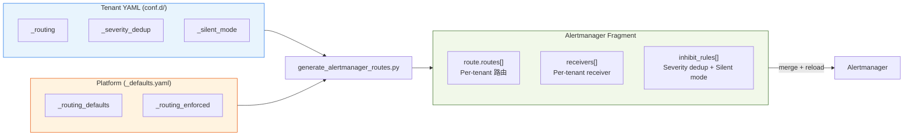

# BYO Alertmanager 整合指南

> **版本**：v1.10.0
> **受眾**：Platform Engineers、SREs
> **前置文件**：[BYO Prometheus 整合指南](byo-prometheus-integration.md)

---

## 1. 概述

告警疲勞的四大根因與對應解法：

| 根因 | 解法 | 機制 | 配置來源 |
|------|------|------|----------|
| 備份/維護期間假陽性風暴 | **Silent Mode** | Sentinel alert → inhibit_rules 攔截通知（TSDB 有紀錄） | `_silent_mode` |
| 計畫性維護忘記關閉 | **Maintenance Mode** | PromQL 層完全不觸發（可設 `expires` 自動失效） | `_state_maintenance` |
| Warning + Critical 重複告警 | **Severity Dedup** | Per-tenant inhibit_rules（`metric_group` 配對） | `_severity_dedup` |
| 通知目的地寫死在中央 | **Alert Routing** | Per-tenant route + receiver（6 種 type） | `_routing` |

Silent Mode 和 Maintenance Mode 均支援結構化物件設定，含 `expires`（ISO 8601）自動失效和 `reason` 欄位，防止「設了忘記關」。

所有 Alertmanager 配置 fragment 由 `generate_alertmanager_routes.py` 從 tenant YAML 自動產出：



---

## 2. 整合步驟

### Step 1: 啟用 Alertmanager Lifecycle API

在 Alertmanager deployment 加入 `--web.enable-lifecycle` flag：

```yaml
args:
  - "--config.file=/etc/alertmanager/alertmanager.yml"
  - "--storage.path=/alertmanager"
  - "--web.enable-lifecycle"
```

驗證：

```bash
kubectl port-forward svc/alertmanager 9093:9093 -n monitoring &
curl -sf http://localhost:9093/-/ready && echo "OK"
```

### Step 2: 確保 Prometheus 連接 Alertmanager

```yaml
# prometheus.yml
alerting:
  alertmanagers:
    - static_configs:
        - targets:
            - "alertmanager.monitoring.svc.cluster.local:9093"
```

### Step 3: 設定 Tenant Routing Config

在 tenant YAML 中定義 `_routing` section（v1.3.0 結構化 receiver）：

```yaml
# conf.d/db-a.yaml
tenants:
  db-a:
    mysql_connections: "70"
    _routing:
      receiver:
        type: "webhook"
        url: "https://webhook.example.com/alerts"
      group_by: ["alertname", "severity"]
      group_wait: "30s"
      repeat_interval: "4h"
```

### Step 4: 產出 Alertmanager Fragment

```bash
# 產出 fragment
docker run --rm \
  -v $(pwd)/conf.d:/data/conf.d \
  ghcr.io/vencil/da-tools:1.10.0 \
  generate-routes --config-dir /data/conf.d -o /data/alertmanager-routes.yaml

# 驗證產出
docker run --rm \
  -v $(pwd)/conf.d:/data/conf.d \
  ghcr.io/vencil/da-tools:1.10.0 \
  generate-routes --config-dir /data/conf.d --validate

# 驗證 + webhook domain allowlist 檢查（v1.5.0）
docker run --rm \
  -v $(pwd)/conf.d:/data/conf.d \
  -v $(pwd)/.github:/data/.github \
  ghcr.io/vencil/da-tools:1.10.0 \
  generate-routes --config-dir /data/conf.d --validate --policy /data/.github/custom-rule-policy.yaml
```

產出內容包含：
- `route.routes[]`: Per-tenant 路由（含 `tenant="<name>"` matcher + timing guardrails）
- `receivers[]`: Per-tenant receiver（webhook/email/slack/teams/rocketchat/pagerduty）
- `inhibit_rules[]`: Per-tenant severity dedup rules

### Step 5: 合併至 Alertmanager ConfigMap

將產出的 fragment 合併至 Alertmanager 主配置。**兩種模式根據部署流程選擇：**

**模式 A：`--apply`（Runtime 直接操作，v1.4.0）**

```bash
# 一站式自動合併 + apply + reload
docker run --rm \
  -v $(pwd)/conf.d:/data/conf.d \
  --network=host \
  ghcr.io/vencil/da-tools:1.10.0 \
  generate-routes --config-dir /data/conf.d --apply --yes

# 或手動合併後 apply
kubectl create configmap alertmanager-config \
  --from-file=alertmanager.yml=alertmanager-merged.yml \
  -n monitoring --dry-run=client -o yaml | kubectl apply -f -
```

適合：初次部署測試、P0 緊急修復、不走 GitOps 的環境。

**模式 B：`--output-configmap`（GitOps PR flow，v1.10.0）**

```bash
# 產出完整 ConfigMap YAML（含 global + default route/receiver + tenant routes）
docker run --rm \
  -v $(pwd)/conf.d:/data/conf.d \
  -v $(pwd)/deploy:/data/deploy \
  ghcr.io/vencil/da-tools:1.10.0 \
  generate-routes --config-dir /data/conf.d --output-configmap \
  -o /data/deploy/alertmanager-configmap.yaml

# 搭配自訂基礎配置（覆蓋 global.resolve_timeout、SMTP 設定等）
docker run --rm \
  -v $(pwd)/conf.d:/data/conf.d \
  -v $(pwd)/deploy:/data/deploy \
  ghcr.io/vencil/da-tools:1.10.0 \
  generate-routes --config-dir /data/conf.d --output-configmap \
  --base-config /data/conf.d/base-alertmanager.yaml \
  -o /data/deploy/alertmanager-configmap.yaml

# 檔案進 Git → PR review → merge → ArgoCD/Flux 自動 sync
git add deploy/alertmanager-configmap.yaml && git commit -m "update AM routes"
```

適合：正式 GitOps 流程。產出的 ConfigMap YAML 是完整可 `kubectl apply` 的格式，無需手動合併。不提供 `--base-config` 時使用內建預設值（`resolve_timeout: 5m`、`group_by: [alertname, tenant]`、default receiver）。

**模式比較：**

| | `--apply` | `--output-configmap` |
|---|-----------|---------------------|
| 操作方式 | 直接修改 K8s ConfigMap | 產出 YAML 檔案 |
| 適用流程 | CLI 手動操作 / 緊急修復 | Git PR → review → GitOps sync |
| 是否需要 K8s 連線 | 是（kubectl context） | 否（純文件產出） |
| Alertmanager reload | `--apply` 自動觸發 | GitOps sync 後由 sidecar/webhook 觸發 |
| 可審計性 | 無 Git 紀錄 | 完整 Git history |

> **注意**：`--apply` 與 `--output-configmap` 互斥，不能同時使用。

### Step 6: 重載 Alertmanager

```bash
# HTTP reload（需 Step 1 的 --web.enable-lifecycle）
curl -X POST http://localhost:9093/-/reload

# 驗證 reload 成功
curl -sf http://localhost:9093/-/ready && echo "Alertmanager ready"
```

---

## 3. generate_alertmanager_routes.py 工具

### 功能

讀取 `conf.d/` 所有 tenant YAML，掃描 `_routing` 和 `_severity_dedup` 設定，產出合法的 Alertmanager YAML fragment。

### 模式

| Flag | 說明 |
|------|------|
| `--dry-run` | 輸出至 stdout，不寫入檔案 |
| `-o FILE` | 寫入指定檔案 |
| `--validate` | 驗證配置合法性（exit 0/1，適合 CI） |
| `--policy FILE` | 載入 `allowed_domains` 做 webhook URL 合規檢查 |
| `--apply [--yes]` | 自動合併至 Alertmanager ConfigMap + reload（`--yes` 跳過確認） |
| `--output-configmap` | 產出完整 ConfigMap YAML（與 `--apply` 互斥），適合 GitOps PR flow（v1.10.0） |
| `--base-config FILE` | 搭配 `--output-configmap`，載入基礎 Alertmanager 配置（global / default receiver 等） |

### Timing Guardrails

平台強制的 timing 範圍，超限自動 clamp：

| 參數 | 最小值 | 最大值 | 預設值 |
|------|--------|--------|--------|
| `group_wait` | 5s | 5m | 30s |
| `group_interval` | 5s | 5m | 5m |
| `repeat_interval` | 1m | 72h | 4h |

---

## 4. 動態 Reload

### 機制

v1.3.0 透過 Alertmanager 原生的 `--web.enable-lifecycle` flag 實現 HTTP reload：

```bash
# 更新 ConfigMap 後
curl -X POST http://alertmanager:9093/-/reload
```

### 自動化選項

| 方案 | 說明 | 適用場景 |
|------|------|----------|
| **HTTP reload** | `curl -X POST /-/reload`（v1.3.0 預設） | 最小侵入，適合自管 Alertmanager |
| **ConfigMap Watcher Sidecar** | 類似 `prometheus-config-reloader` | 全自動，適合生產環境 |
| **CI Pipeline 整合** | GitOps: `generate-routes --validate` + apply + reload | 適合 GitOps 工作流 |
| **GitOps ConfigMap 產出** | `generate-routes --output-configmap` 產出完整 ConfigMap YAML 進 Git PR flow | v1.10.0+，取代 `--apply` 直操作 |
| **Alertmanager Operator** | `kube-prometheus-stack` 的 AlertmanagerConfig CRD | 適合已使用 Operator 的環境 |

### _lib.sh Helper

```bash
source scripts/_lib.sh
reload_alertmanager  # 預設 http://localhost:9093
reload_alertmanager "http://alertmanager.monitoring.svc.cluster.local:9093"
```

---

## 5. Receiver 類型

v1.4.0 支援六種 receiver 類型：

### Webhook

```yaml
_routing:
  receiver:
    type: "webhook"
    url: "https://webhook.example.com/alerts"
```

### Email

```yaml
_routing:
  receiver:
    type: "email"
    to: ["team@example.com", "oncall@example.com"]
    smarthost: "smtp.example.com:587"
    from: "alertmanager@example.com"
    require_tls: true
```

### Slack

```yaml
_routing:
  receiver:
    type: "slack"
    api_url: "https://hooks.slack.com/services/T.../B.../xxx"
    channel: "#alerts"
```

### Microsoft Teams

```yaml
_routing:
  receiver:
    type: "teams"
    webhook_url: "https://outlook.office.com/webhook/..."
```

### Rocket.Chat

```yaml
_routing:
  receiver:
    type: "rocketchat"
    url: "https://chat.example.com/hooks/xxx/yyy"
    channel: "#alerts"        # metadata（不傳入 AM config）
    username: "PrometheusBot" # metadata（不傳入 AM config）
```

### PagerDuty

```yaml
_routing:
  receiver:
    type: "pagerduty"
    service_key: "your-integration-key"
    severity: "critical"
    client: "Dynamic Alerting Platform"
```

### 共通選填欄位

所有 receiver 類型都支援 `send_resolved: true`（預設 false），控制 alert 解除時是否發送通知。

### 訊息模板（Go Template）

Slack、Teams、Email 的 `title` / `text` / `html` 欄位支援 Alertmanager 原生的 Go template 語法，可引用 alert 的 labels、annotations、status：

**Slack 客製化範例：**

```yaml
_routing:
  receiver:
    type: "slack"
    api_url: "https://hooks.slack.com/services/..."
    channel: "#db-alerts"
    title: '{{ .Status | toUpper }}: {{ .CommonLabels.alertname }}'
    text: >-
      *Tenant*: {{ .CommonLabels.tenant }}
      *Severity*: {{ .CommonLabels.severity }}
      {{ range .Alerts }}
        - {{ .Annotations.summary }}
      {{ end }}
```

**Email HTML 模板範例：**

```yaml
_routing:
  receiver:
    type: "email"
    to: ["team@example.com"]
    smarthost: "smtp.example.com:587"
    html: |
      <h2>{{ .CommonLabels.alertname }}</h2>
      <p>Tenant: {{ .CommonLabels.tenant }} | Severity: {{ .CommonLabels.severity }}</p>
      <ul>
      {{ range .Alerts }}
        <li>{{ .Annotations.description }}</li>
      {{ end }}
      </ul>
```

**可用的 Go template 變數：**

| 變數 | 說明 |
|------|------|
| `.CommonLabels.alertname` | Alert 名稱 |
| `.CommonLabels.tenant` | Tenant 名稱 |
| `.CommonLabels.severity` | 嚴重度（warning / critical） |
| `.CommonAnnotations.summary` | Alert 摘要 |
| `.CommonAnnotations.description` | Alert 描述 |
| `.Status` | 狀態（firing / resolved） |
| `.Alerts` | Alert 列表（可 `{{ range }}` 迴圈） |
| `{{ .Alerts \| len }}` | Alert 數量 |

> 完整語法參考：[Alertmanager Notification Template Reference](https://prometheus.io/docs/alerting/latest/notifications/)

---

## 6. 驗證 Checklist

### 工具驗證

```bash
# 1. 產出 fragment（dry-run 預覽）
da-tools generate-routes --config-dir /data/conf.d --dry-run

# 2. 驗證配置合法性
da-tools generate-routes --config-dir /data/conf.d --validate

# 3. 檢查 Alertmanager 狀態
curl -sf http://localhost:9093/-/ready

# 4. 查看當前 alert 狀態
curl -sf http://localhost:9093/api/v2/alerts | python3 -m json.tool
```

### 功能驗證

- [ ] `validate-config --config-dir conf.d/` 通過（一站式檢查）
- [ ] `generate-routes --validate` exit code 0
- [ ] Alertmanager 載入合併後的配置無錯誤
- [ ] `curl -X POST /-/reload` 回傳 200
- [ ] Silent Mode tenant 的 alert 不發送通知
- [ ] Maintenance Mode tenant 的 alert 不觸發
- [ ] Silent/Maintenance 的 `expires` 到期後自動恢復
- [ ] Severity Dedup enabled tenant 的 warning 在 critical 觸發時被抑制
- [ ] Custom routing tenant 的 alert 送達指定 receiver
- [ ] Per-rule override 的 alert 送達指定的 override receiver

---

## 7. Per-Rule Routing Overrides（v1.8.0）

在進階場景中，某些特定警報可能需要不同的路由策略。Tenant YAML 的 `_routing.overrides[]` 支援 per-alertname 或 per-metric_group 指定自訂 receiver：

### 配置範例

```yaml
# conf.d/db-a.yaml
tenants:
  db-a:
    mysql_connections: "70"
    _routing:
      receiver:
        type: "slack"
        api_url: "https://hooks.slack.com/services/.../default"
        channel: "#db-alerts"

      # 特定警報的路由覆寫
      overrides:
        - alertname: "MariaDBHighConnections"
          receiver:
            type: "pagerduty"
            service_key: "urgency-key-123"

        - metric_group: "replication"
          receiver:
            type: "email"
            to: ["dba-team@example.com"]
```

### 優先級

1. **Exact alertname match** — 若指定 `alertname`，該警報優先使用 override receiver
2. **Metric group match** — 若指定 `metric_group`，該群組內警報使用 override receiver
3. **Tenant default** — 無 override 時，使用租戶預設 receiver

`generate_alertmanager_routes.py` 自動展開 overrides 為 Alertmanager 的嵌套 subroute，確保優先級正確套用。

---

## 8. Platform Enforced Routing（v1.7.0）

Platform Team 可在 `_defaults.yaml` 設定強制路由，確保 NOC 必收所有 tenant 的告警（與 tenant 自訂路由並行，雙軌通知）：

```yaml
# conf.d/_defaults.yaml
_routing_enforced:
  enabled: true
  receiver:
    type: "webhook"
    url: "https://noc.example.com/alerts"
  match:
    severity: "critical"
```

`generate_alertmanager_routes.py` 會在所有 tenant route 之前插入 platform route（帶 `continue: true`），實現「NOC 必收 + tenant 也收」。預設不啟用。

---

## 9. 一站式配置驗證

v1.7.0 新增 `validate_config.py`，一次檢查 YAML syntax、schema、routes、policy、custom rules、版號一致性：

```bash
# da-tools 容器方式
docker run --rm -v $(pwd)/conf.d:/data/conf.d \
  ghcr.io/vencil/da-tools:1.10.0 validate-config --config-dir /data/conf.d

# CI pipeline 使用 JSON 輸出
docker run --rm \
  -v $(pwd)/conf.d:/data/conf.d \
  -v $(pwd)/.github:/data/.github \
  ghcr.io/vencil/da-tools:1.10.0 \
  validate-config --config-dir /data/conf.d --policy /data/.github/custom-rule-policy.yaml --json
```

建議在 `generate-routes --apply` 前先執行 `validate-config`，確保配置完整正確。

---

## Appendix: Alertmanager Operator 路徑

如果使用 `kube-prometheus-stack`（Prometheus Operator），可透過 `AlertmanagerConfig` CRD 管理路由：

```yaml
apiVersion: monitoring.coreos.com/v1alpha1
kind: AlertmanagerConfig
metadata:
  name: tenant-db-a
  namespace: monitoring
spec:
  route:
    matchers:
      - name: tenant
        value: db-a
    receiver: tenant-db-a
  receivers:
    - name: tenant-db-a
      webhookConfigs:
        - url: "https://webhook.db-a.example.com/alerts"
```

此路徑與 `generate_alertmanager_routes.py` 的 ConfigMap 方式互斥。選擇 Operator 路徑的用戶不需要使用 `generate-routes` 工具。
