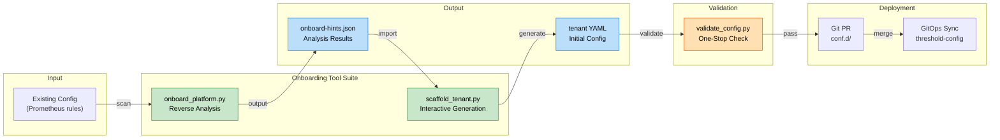
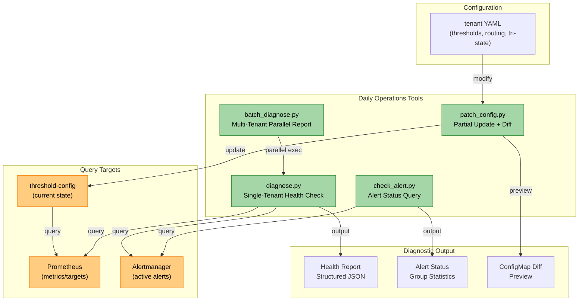
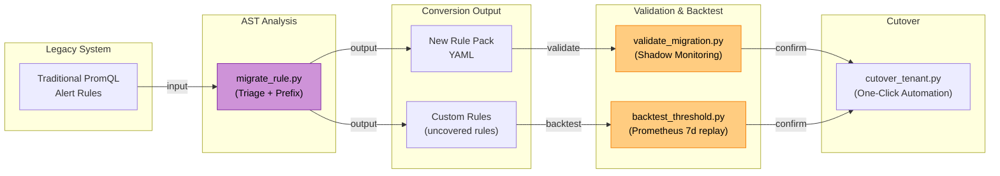
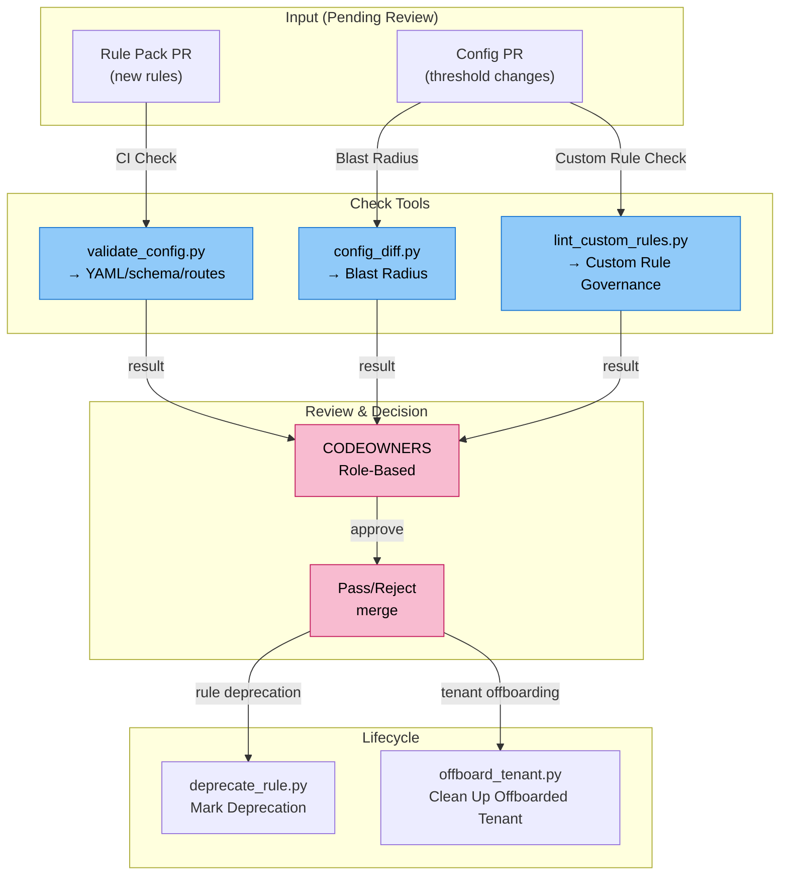

# Project Context Diagram: Roles, Tools, and Product Interactions

> **Language / 語言：** **English (Current)** | [中文](context-diagram.md)

> **v2.1.0** | Audience: All Participants (Platform Engineers, Domain Experts, Tenant Teams)

## Introduction

This document presents the Multi-Tenant Dynamic Alerting Platform's **role distribution, tool workflow, and infrastructure interactions** using the C4 Context model.

**Core Concepts:**
- **Three-Tier Role Model**: Platform Engineer (platform layer), Domain Expert (domain expertise), Tenant Team (tenant layer)
- **21 Supporting Tools**: Spanning Onboarding, Daily Ops, Migration, and Governance workflows
- **Five Infrastructure Categories**: Config, Compute, Evaluation, Routing, Notification

This diagram helps newcomers quickly understand:
1. What is my role in this system?
2. Which tools should I use?
3. How does my work impact downstream systems?

---

## 1. Overall Context Diagram

```mermaid
graph TB
    subgraph Roles["🏢 Three-Tier Role Distribution"]
        PE["Platform Engineer<br/>Platform Engineer"]
        DX["Domain Expert<br/>Domain Expert (DBA/SRE)"]
        TT["Tenant Team<br/>Tenant Team (SRE/DBA)"]
    end

    subgraph Config["📋 Configuration Layer"]
        Defaults["_defaults.yaml<br/>Platform Defaults"]
        Profiles["_profiles.yaml<br/>Four-Layer Inheritance"]
        RulePacks["Rule Packs<br/>(15 YAML files)"]
        TenantYAML["tenant YAML<br/>(conf.d/)"]
    end

    subgraph Tools["🛠 Tool Ecosystem (21 Tools)"]
        subgraph OnboardTools["Onboarding"]
            ScaffoldTool["scaffold_tenant.py"]
            OnboardAnalyze["onboard_platform.py"]
        end

        subgraph OpsTools["Daily Ops"]
            DiagnoseTool["diagnose.py"]
            BatchDiag["batch_diagnose.py"]
            CheckAlert["check_alert.py"]
            PatchConfig["patch_config.py"]
        end

        subgraph MigTools["Migration"]
            MigrateRule["migrate_rule.py"]
            ValidateMig["validate_migration.py"]
            CutoverTool["cutover_tenant.py"]
        end

        subgraph GovTools["Governance"]
            ValidateConfig["validate_config.py"]
            ConfigDiff["config_diff.py"]
            LintRules["lint_custom_rules.py"]
            DeprecateRule["deprecate_rule.py"]
            OffboardTool["offboard_tenant.py"]
        end

        subgraph AdvTools["Advanced"]
            BlindSpot["blind_spot_discovery.py"]
            BaselineDisc["baseline_discovery.py"]
            BacktestThresh["backtest_threshold.py"]
            MaintScheduler["maintenance_scheduler.py"]
            BumpDocs["bump_docs.py"]
            GenerateRoutes["generate_alertmanager_routes.py"]
        end
    end

    subgraph Infra["🏗 Infrastructure Products"]
        subgraph ConfigInfra["Config (ConfigMap)"]
            ThreshConfig["threshold-config"]
        end

        subgraph ComputeInfra["Compute"]
            Exporter["threshold-exporter ×2<br/>(HA, port 8080)"]
        end

        subgraph EvalInfra["Evaluation"]
            Prom["Prometheus<br/>+ 15 Rule Packs"]
        end

        subgraph RoutingInfra["Routing & Alert"]
            AlertMgr["Alertmanager<br/>(Dynamic routing)"]
        end

        subgraph NotifInfra["Notification"]
            Channels["Slack | PagerDuty<br/>Email | Teams<br/>RocketChat | Webhook"]
        end
    end

    subgraph GitOps["📂 GitOps Layer"]
        GitRepo["Git Repository<br/>(conf.d/ + rule-packs/)"]
    end

    %% Role -> Config Management
    PE -->|manages| Defaults
    PE -->|manages| Profiles
    PE -->|maintains| RulePacks
    DX -->|contributes| RulePacks
    DX -->|maintains| TenantYAML
    TT -->|manages| TenantYAML

    %% Config -> GitOps
    Defaults -->|PR| GitRepo
    Profiles -->|PR| GitRepo
    RulePacks -->|PR| GitRepo
    TenantYAML -->|PR| GitRepo

    %% Role -> Tools (Examples)
    PE -->|uses| ValidateConfig
    PE -->|uses| ConfigDiff
    PE -->|uses| GenerateRoutes
    DX -->|uses| LintRules
    DX -->|uses| MigrateRule
    TT -->|uses| ScaffoldTool
    TT -->|uses| DiagnoseTool
    TT -->|uses| CheckAlert

    %% Tools -> Config
    ScaffoldTool -->|generates| TenantYAML
    OnboardAnalyze -->|analyzes| Defaults
    MigrateRule -->|converts| TenantYAML
    GenerateRoutes -->|consumes| TenantYAML

    %% Tools -> Infra
    ValidateConfig -->|validates| ThreshConfig
    PatchConfig -->|updates| ThreshConfig
    DiagnoseTool -->|queries| Prom
    CheckAlert -->|queries| AlertMgr
    ConfigDiff -->|compares| GitRepo

    %% GitOps -> Infra
    GitRepo -->|GitOps Sync<br/>ArgoCD / Flux| ThreshConfig

    %% Infrastructure Flow
    ThreshConfig -->|SHA-256<br/>hot-reload| Exporter
    Exporter -->|"Metrics :8080"| Prom
    Prom -->|Alert Rules<br/>Evaluation| AlertMgr
    AlertMgr -->|Routes & Groups| Channels

    %% Advanced tools
    BlindSpot -->|scans| Prom
    BaselineDisc -->|observes| Prom
    BacktestThresh -->|backtests| Prom
    MaintScheduler -->|creates| AlertMgr
    BumpDocs -->|version mgmt| GitRepo

    %% Styling
    classDef roleStyle fill:#e3f2fd,stroke:#1976d2,stroke-width:2px,color:#000
    classDef configStyle fill:#f3e5f5,stroke:#7b1fa2,stroke-width:2px,color:#000
    classDef toolStyle fill:#e8f5e9,stroke:#388e3c,stroke-width:2px,color:#000
    classDef infraStyle fill:#fff3e0,stroke:#e65100,stroke-width:2px,color:#000
    classDef gitStyle fill:#f0f0f0,stroke:#616161,stroke-width:2px,color:#000

    class PE,DX,TT roleStyle
    class Defaults,Profiles,RulePacks,TenantYAML configStyle
    class ScaffoldTool,OnboardAnalyze,DiagnoseTool,BatchDiag,CheckAlert,PatchConfig,MigrateRule,ValidateMig,CutoverTool,ValidateConfig,ConfigDiff,LintRules,DeprecateRule,OffboardTool,BlindSpot,BaselineDisc,BacktestThresh,MaintScheduler,BumpDocs,GenerateRoutes toolStyle
    class ThreshConfig,Exporter,Prom,AlertMgr,Channels infraStyle
    class GitRepo gitStyle
```

---

## 2. Onboarding Workflow Detail

---

## 3. Daily Ops Workflow Detail

---

## 4. Migration Workflow Detail

---

## 5. Governance Workflow Detail

---

## 6. Role and Tool Mapping Table

| Role | Primary Responsibility | Core Tools | Occasional Tools |
|------|----------------------|------------|-----------------|
| **Platform Engineer** | Platform-level config, Rule Pack maintenance, infrastructure | `validate_config.py` `generate_alertmanager_routes.py` `config_diff.py` | `bump_docs.py` `maintenance_scheduler.py` |
| **Domain Expert (DBA/SRE)** | Domain-specific Rule Packs, metric dictionaries, governance | `lint_custom_rules.py` `migrate_rule.py` `deprecate_rule.py` | `validate_config.py` `backtest_threshold.py` |
| **Tenant Team (SRE/DBA)** | Tenant config, thresholds, routing, tri-state, metadata | `scaffold_tenant.py` `diagnose.py` `check_alert.py` | `validate_migration.py` `offboard_tenant.py` `patch_config.py` |

---

## 7. Tools by Workflow Classification Table

| Workflow | Stage | Tool | Input | Output | Time |
|----------|-------|------|-------|--------|------|
| **Onboarding** | Analysis | `onboard_platform.py` | Prometheus rules | `onboard-hints.json` | 1–2 min |
| | Generation | `scaffold_tenant.py` | `--from-onboard` / interactive | `tenant.yaml` | 2–5 min |
| | Validation | `validate_config.py` | `tenant.yaml` | validation report | 10–30 sec |
| **Daily Ops** | Health Check | `diagnose.py` | Tenant ID | structured report | 5–10 sec |
| | Batch Report | `batch_diagnose.py` | Namespace | multi-tenant CSV | 30–60 sec |
| | Alert Query | `check_alert.py` | Filter (alertname/labels) | JSON result | 2–5 sec |
| | Config Update | `patch_config.py` | ConfigMap name, key, value | update + diff preview | 5 sec |
| **Migration** | Rule Conversion | `migrate_rule.py` | old PromQL | new YAML + custom rules | 10–30 sec |
| | Shadow Validation | `validate_migration.py` | old rule + new rule | diff report + convergence | 2–5 min |
| | Threshold Backtest | `backtest_threshold.py` | metric + threshold + days | historical hit stats | 30–120 sec |
| | Cutover | `cutover_tenant.py` | tenant config | fully automated cutover (§7.1) | 5–10 min |
| **Governance** | Config Validation | `validate_config.py` | YAML files | multi-check report | 10–30 sec |
| | Blast Radius | `config_diff.py` | old dir + new dir | diff + impact report | 5–10 sec |
| | Rule Linting | `lint_custom_rules.py` | custom rule YAML | compliance report | 5 sec |
| | Rule Deprecation | `deprecate_rule.py` | rule name + end date | migration hints + silence config | 1–2 sec |
| | Tenant Offboarding | `offboard_tenant.py` | tenant ID + reason | cleanup + audit log | 30–60 sec |
| **Advanced** | Blind Spot Scan | `blind_spot_discovery.py` | cluster targets | unmonitored list | 10–30 sec |
| | Baseline Discovery | `baseline_discovery.py` | metric pattern + period | threshold suggestion table | 1–3 min |
| | Version Management | `bump_docs.py` | Platform/Exporter/Tools versions | update CHANGELOG + docs | 5 sec |
| | AM Route Generation | `generate_alertmanager_routes.py` | tenant YAML | Alertmanager fragment | 1–2 sec |
| | Maintenance Scheduling | `maintenance_scheduler.py` | cron + duration | AlertManager silence CronJob | 10 sec |

---

## 8. Configuration and Infrastructure Interaction

```mermaid
graph LR
    subgraph ConfigLayer["📋 Configuration Layer"]
        Defaults["_defaults.yaml"]
        Profiles["_profiles.yaml<br/>(Four-Layer Chain)"]
        RulePacks["rule-pack-*.yaml<br/>(15 packs)"]
        TenantYAML["<tenant>.yaml<br/>(conf.d/)"]
    end

    subgraph GitOpsLayer["📂 GitOps Layer"]
        GitRepo["Git Repository<br/>conf.d/ + rule-packs/"]
    end

    subgraph PlatformLayer["🏗 Platform Layer"]
        CM["ConfigMap<br/>threshold-config"]
    end

    subgraph ComputeLayer["💻 Compute Layer"]
        Exp1["threshold-exporter #1<br/>(port 8080)"]
        Exp2["threshold-exporter #2<br/>(port 8080)"]
    end

    subgraph EvalLayer["📊 Evaluation Layer"]
        PV["Projected Volume<br/>(15 Rule Packs)"]
        Prom["Prometheus<br/>(3h + SHA-256)"]
    end

    subgraph RoutingLayer["🔀 Routing Layer"]
        RuleGen["generate_alertmanager_routes.py"]
        AM["Alertmanager<br/>(Dynamic routing)"]
    end

    subgraph NotifLayer["📢 Notification Layer"]
        Slack["Slack"]
        PD["PagerDuty"]
        Email["Email"]
        Teams["Teams"]
        RChat["RocketChat"]
        Webhook["Webhook"]
    end

    Defaults -->|1. Merge in| GitRepo
    Profiles -->|2. Merge in| GitRepo
    RulePacks -->|3. Mount via| PV
    TenantYAML -->|4. Merge in| GitRepo

    GitRepo -->|GitOps Sync<br/>ArgoCD / Flux| CM

    CM -->|SHA-256 hot-reload| Exp1
    CM -->|SHA-256 hot-reload| Exp2

    Exp1 -->|"/metrics<br/>(metrics + flags)"| Prom
    Exp2 -->|"/metrics<br/>(metrics + flags)"| Prom

    PV -->|Mounted Rules| Prom

    Prom -->|Alert Evaluation| RuleGen

    TenantYAML -->|Route/Receiver| RuleGen

    RuleGen -->|Fragment| AM

    AM -->|Alert Routes| Slack
    AM -->|Alert Routes| PD
    AM -->|Alert Routes| Email
    AM -->|Alert Routes| Teams
    AM -->|Alert Routes| RChat
    AM -->|Alert Routes| Webhook

    classDef cfgLayerStyle fill:#f3e5f5,stroke:#7b1fa2,color:#000
    classDef gitLayerStyle fill:#f0f0f0,stroke:#616161,color:#000
    classDef platformLayerStyle fill:#fce4ec,stroke:#c2185b,color:#000
    classDef computeLayerStyle fill:#e3f2fd,stroke:#1976d2,color:#000
    classDef evalLayerStyle fill:#e8f5e9,stroke:#388e3c,color:#000
    classDef routingLayerStyle fill:#fff3e0,stroke:#e65100,color:#000
    classDef notifLayerStyle fill:#f1f8e9,stroke:#558b2f,color:#000

    class Defaults,Profiles,RulePacks,TenantYAML cfgLayerStyle
    class GitRepo gitLayerStyle
    class CM platformLayerStyle
    class Exp1,Exp2 computeLayerStyle
    class PV,Prom evalLayerStyle
    class RuleGen,AM routingLayerStyle
    class Slack,PD,Email,Teams,RChat,Webhook notifLayerStyle
```

---

## 9. Newcomer Quick Navigation

**I am a Platform Engineer, I should:**
1. Read [architecture-and-design.en.md](architecture-and-design.en.md) to understand overall architecture
2. Learn `validate_config.py` and `generate_alertmanager_routes.py`
3. Use `config_diff.py` for PR review blast radius analysis
4. Run `bump_docs.py` regularly to maintain version consistency

**I am a Domain Expert (DBA), I should:**
1. Read [custom-rule-governance.en.md](custom-rule-governance.en.md) to understand governance model
2. Use `migrate_rule.py` to assist new rule migration
3. Use `lint_custom_rules.py` to check custom rule compliance
4. Use `backtest_threshold.py` to validate new threshold historical accuracy

**I am a Tenant Team (SRE/DBA), I should:**
1. Read [getting-started/for-tenants.en.md](getting-started/for-tenants.en.md) to get started quickly
2. Use [Self-Service Portal](https://vencil.github.io/Dynamic-Alerting-Integrations/assets/jsx-loader.html?component=../interactive/tools/self-service-portal.jsx) for self-service operations (config, validation, preview). For enterprise intranet, use the `da-portal` Docker image ([deployment guide](https://github.com/vencil/Dynamic-Alerting-Integrations/blob/main/components/da-portal/README.md))
3. Use `scaffold_tenant.py` to generate initial configuration
4. Use `diagnose.py` to regularly check health status
5. Use `check_alert.py` to query alert status
6. Use `patch_config.py` for partial updates (no need for full redeployment)

---

## 10. Related Documents and Topics

- **In-Depth Architecture** → [architecture-and-design.en.md](architecture-and-design.en.md)
- **Migration Guide** → [migration-guide.md](migration-guide.md) and [migration-engine.en.md](migration-engine.en.md)
- **Tenant Quick Start** → [getting-started/for-tenants.en.md](getting-started/for-tenants.en.md)
- **Governance & Security** → [governance-security.en.md](governance-security.en.md) and [custom-rule-governance.en.md](custom-rule-governance.en.md)
- **GitOps Deployment** → [gitops-deployment.md](gitops-deployment.md)
- **Troubleshooting** → [troubleshooting.en.md](troubleshooting.en.md)
- **Interactive Tools** → [Interactive Tools Hub](https://vencil.github.io/Dynamic-Alerting-Integrations/) and [Self-Service Portal](https://vencil.github.io/Dynamic-Alerting-Integrations/assets/jsx-loader.html?component=../interactive/tools/self-service-portal.jsx). Enterprise intranet deployment: [da-portal](https://github.com/vencil/Dynamic-Alerting-Integrations/blob/main/components/da-portal/README.md)
- **Playbooks** (AI Agent exclusive)
  - [docs/internal/testing-playbook.md](internal/testing-playbook.md)
  - [docs/internal/windows-mcp-playbook.md](internal/windows-mcp-playbook.md)
  - [docs/internal/github-release-playbook.md](internal/github-release-playbook.md)

---

**Last Updated**: | **Maintainers**: Platform Team

## Related Resources

| Resource | Relevance |
|----------|-----------|
| ["專案 Context 圖：角色、工具與產品互動關係"](./context-diagram.md) | ⭐⭐⭐ |
| [001-severity-dedup-via-inhibit.en](adr/001-severity-dedup-via-inhibit.en.md) | ⭐⭐ |
| [002-oci-registry-over-chartmuseum.en](adr/002-oci-registry-over-chartmuseum.en.md) | ⭐⭐ |
| [003-sentinel-alert-pattern.en](adr/003-sentinel-alert-pattern.en.md) | ⭐⭐ |
| [004-federation-scenario-a-first.en](adr/004-federation-scenario-a-first.en.md) | ⭐⭐ |
| [005-projected-volume-for-rule-packs.en](adr/005-projected-volume-for-rule-packs.en.md) | ⭐⭐ |
| [README.en](adr/README.en.md) | ⭐⭐ |
| ["Architecture and Design — Multi-Tenant Dynamic Alerting Platform Technical Whitepaper"] | ⭐⭐ |
