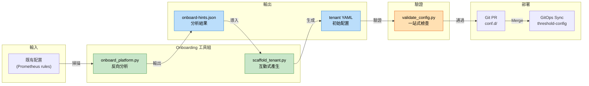
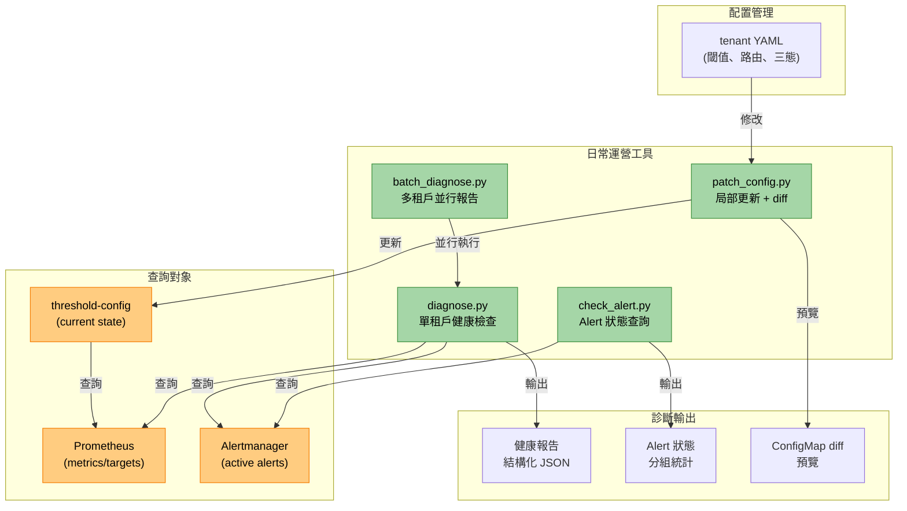
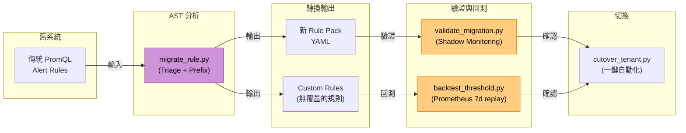
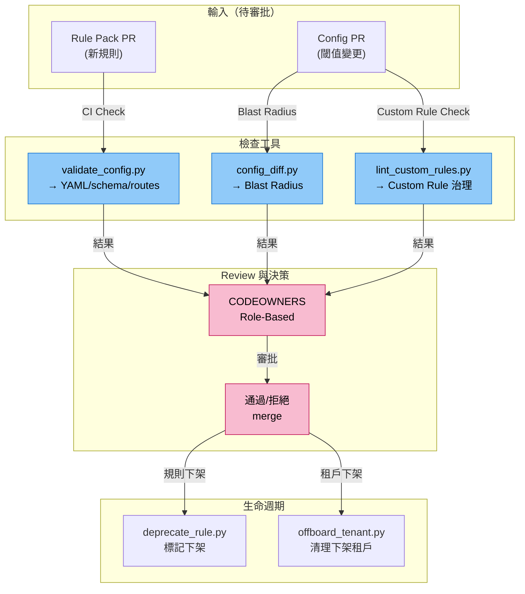

# 專案 Context 圖：角色、工具與產品互動關係

> **Language / 語言：** | **中文（當前）**

> **v2.1.0** | 適用對象：所有參與者（Platform Engineers、Domain Experts、Tenant Teams）

## 簡介

本文件透過 Context 圖（C4 模型）呈現多租戶動態警報平台的**角色分工、工具使用流程、與產品基礎設施的互動關係**。

**核心概念：**
- **三層角色分工**：Platform Engineer（平台層）、Domain Expert（專業領域）、Tenant Team（租戶層）
- **62 個 Python 工具**：涵蓋 Onboarding、Daily Ops、Migration、Governance、Advanced Ops 五大工作流
- **24 個互動 JSX 工具**：瀏覽器端視覺化操作（Interactive Tools Hub）
- **六類基礎設施**：Config、Compute、Evaluation、Routing、Notification、Interactive UI

此圖幫助新加入者快速理解：
1. 我在這個系統中的角色是什麼？
2. 我應該使用哪些工具？
3. 我的工作成果如何影響下游系統？

---

## 1. 整體 Context 圖

```mermaid
graph TB
    subgraph Roles["🏢 三層角色分工"]
        PE["Platform Engineer<br/>平台工程師"]
        DX["Domain Expert<br/>領域專家 (DBA/SRE)"]
        TT["Tenant Team<br/>租戶團隊 (SRE/DBA)"]
    end

    subgraph Config["📋 配置層"]
        Defaults["_defaults.yaml<br/>平台級預設"]
        Profiles["_profiles.yaml<br/>四層繼承鏈"]
        RulePacks["Rule Packs<br/>(15個YAML)"]
        TenantYAML["tenant YAML<br/>(conf.d/)"]
    end

    subgraph Tools["🛠 工具生態（62 Python + 24 JSX）"]
        subgraph OnboardTools["Onboarding"]
            ScaffoldTool["scaffold_tenant.py"]
            OnboardAnalyze["onboard_platform.py"]
        end

        subgraph OpsTools["Daily Ops"]
            DiagnoseTool["diagnose.py"]
            BatchDiag["batch_diagnose.py"]
            CheckAlert["check_alert.py"]
            PatchConfig["patch_config.py"]
        end

        subgraph MigTools["Migration"]
            MigrateRule["migrate_rule.py"]
            ValidateMig["validate_migration.py"]
            CutoverTool["cutover_tenant.py"]
        end

        subgraph GovTools["Governance"]
            ValidateConfig["validate_config.py"]
            ConfigDiff["config_diff.py"]
            LintRules["lint_custom_rules.py"]
            DeprecateRule["deprecate_rule.py"]
            OffboardTool["offboard_tenant.py"]
        end

        subgraph AdvTools["Advanced Ops"]
            BlindSpot["blind_spot_discovery.py"]
            BaselineDisc["baseline_discovery.py"]
            BacktestThresh["backtest_threshold.py"]
            MaintScheduler["maintenance_scheduler.py"]
            BumpDocs["bump_docs.py"]
            GenerateRoutes["generate_alertmanager_routes.py"]
        end

        subgraph V2Tools["v2.0.0 新功能"]
            AlertQuality["alert_quality.py"]
            PolicyEngine["policy_engine.py"]
            CardinalityForecast["cardinality_forecasting.py"]
        end
    end

    subgraph InteractiveUI["🌐 Interactive Tools Hub（24 JSX）"]
        SelfServicePortal["Self-Service Portal<br/>（Tenant 自助操作）"]
        ToolsHub["Interactive Tools Hub<br/>（視覺化工具入口）"]
    end

    subgraph Infra["🏗 基礎設施產品"]
        subgraph ConfigInfra["Config (ConfigMap)"]
            ThreshConfig["threshold-config"]
        end

        subgraph ComputeInfra["Compute"]
            Exporter["threshold-exporter ×2<br/>(HA, 8080)"]
        end

        subgraph EvalInfra["Evaluation"]
            Prom["Prometheus<br/>+ 15 Rule Packs"]
        end

        subgraph RoutingInfra["Routing & Alert"]
            AlertMgr["Alertmanager<br/>(Dynamic routing)"]
        end

        subgraph NotifInfra["Notification"]
            Channels["Slack | PagerDuty<br/>Email | Teams<br/>RocketChat | Webhook"]
        end
    end

    subgraph GitOps["📂 GitOps層"]
        GitRepo["Git Repository<br/>(conf.d/ + rule-packs/)"]
    end

    %% Role -> Config Management
    PE -->|管理| Defaults
    PE -->|管理| Profiles
    PE -->|維護| RulePacks
    DX -->|貢獻| RulePacks
    DX -->|維護| TenantYAML
    TT -->|管理| TenantYAML

    %% Config -> GitOps
    Defaults -->|PR| GitRepo
    Profiles -->|PR| GitRepo
    RulePacks -->|PR| GitRepo
    TenantYAML -->|PR| GitRepo

    %% Role -> Tools (Examples)
    PE -->|使用| ValidateConfig
    PE -->|使用| ConfigDiff
    PE -->|使用| GenerateRoutes
    DX -->|使用| LintRules
    DX -->|使用| MigrateRule
    TT -->|使用| ScaffoldTool
    TT -->|使用| DiagnoseTool
    TT -->|使用| CheckAlert

    %% Tools -> Config
    ScaffoldTool -->|生成| TenantYAML
    OnboardAnalyze -->|分析| Defaults
    MigrateRule -->|轉換| TenantYAML
    GenerateRoutes -->|消費| TenantYAML

    %% Tools -> Infra
    ValidateConfig -->|驗證| ThreshConfig
    PatchConfig -->|更新| ThreshConfig
    DiagnoseTool -->|查詢| Prom
    CheckAlert -->|查詢| AlertMgr
    ConfigDiff -->|比對| GitRepo

    %% GitOps -> Infra
    GitRepo -->|GitOps Sync<br/>ArgoCD / Flux| ThreshConfig

    %% Infrastructure Flow
    ThreshConfig -->|SHA-256<br/>hot-reload| Exporter
    Exporter -->|"Metrics :8080"| Prom
    Prom -->|Alert Rules<br/>Evaluation| AlertMgr
    AlertMgr -->|Routes & Groups| Channels

    %% Advanced tools
    BlindSpot -->|掃描| Prom
    BaselineDisc -->|觀測| Prom
    BacktestThresh -->|回測| Prom
    MaintScheduler -->|建立| AlertMgr
    BumpDocs -->|版號一致| GitRepo

    %% v2.0.0 tools
    AlertQuality -->|查詢| Prom
    AlertQuality -->|查詢| AlertMgr
    PolicyEngine -->|驗證| TenantYAML
    CardinalityForecast -->|查詢| Prom

    %% Interactive UI
    TT -->|自助操作| SelfServicePortal
    SelfServicePortal -->|生成| TenantYAML
    ToolsHub -->|視覺化| RulePacks

    %% Styling
    classDef roleStyle fill:#e3f2fd,stroke:#1976d2,stroke-width:2px,color:#000
    classDef configStyle fill:#f3e5f5,stroke:#7b1fa2,stroke-width:2px,color:#000
    classDef toolStyle fill:#e8f5e9,stroke:#388e3c,stroke-width:2px,color:#000
    classDef infraStyle fill:#fff3e0,stroke:#e65100,stroke-width:2px,color:#000
    classDef gitStyle fill:#f0f0f0,stroke:#616161,stroke-width:2px,color:#000

    class PE,DX,TT roleStyle
    class Defaults,Profiles,RulePacks,TenantYAML configStyle
    classDef interactiveStyle fill:#e0f7fa,stroke:#00838f,stroke-width:2px,color:#000

    class ScaffoldTool,OnboardAnalyze,DiagnoseTool,BatchDiag,CheckAlert,PatchConfig,MigrateRule,ValidateMig,CutoverTool,ValidateConfig,ConfigDiff,LintRules,DeprecateRule,OffboardTool,BlindSpot,BaselineDisc,BacktestThresh,MaintScheduler,BumpDocs,GenerateRoutes,AlertQuality,PolicyEngine,CardinalityForecast toolStyle
    class ThreshConfig,Exporter,Prom,AlertMgr,Channels infraStyle
    class GitRepo gitStyle
    class SelfServicePortal,ToolsHub interactiveStyle
```

---

## 2. Onboarding 工作流詳圖

---

## 3. Daily Ops 工作流詳圖

---

## 4. Migration 工作流詳圖

---

## 5. Governance 工作流詳圖

---

## 6. 角色與工具對應表

| 角色 | 主責 | 核心工具 | 偶用工具 |
|------|------|---------|---------|
| **Platform Engineer** | 平台級配置、Rule Pack 維護、基礎設施 | `validate_config.py` `generate_alertmanager_routes.py` `config_diff.py` `policy_engine.py` | `bump_docs.py` `maintenance_scheduler.py` `alert_quality.py` `cardinality_forecasting.py` |
| **Domain Expert (DBA/SRE)** | 特定 Rule Pack、metric dictionary、governance | `lint_custom_rules.py` `migrate_rule.py` `deprecate_rule.py` | `validate_config.py` `backtest_threshold.py` `alert_quality.py` |
| **Tenant Team (SRE/DBA)** | 租戶配置、閾值、路由、三態、metadata | `scaffold_tenant.py` `diagnose.py` `check_alert.py` Self-Service Portal | `validate_migration.py` `offboard_tenant.py` `patch_config.py` |

---

## 7. 工具按工作流分類表

| 工作流 | 階段 | 工具 | 輸入 | 輸出 | 用時 |
|--------|------|------|------|------|------|
| **Onboarding** | Analysis | `onboard_platform.py` | Prometheus rules | `onboard-hints.json` | 1–2 min |
| | Generation | `scaffold_tenant.py` | `--from-onboard` / 互動 | `tenant.yaml` | 2–5 min |
| | Validation | `validate_config.py` | `tenant.yaml` | 驗證報告 | 10–30 sec |
| **Daily Ops** | Health Check | `diagnose.py` | Tenant ID | 結構化報告 | 5–10 sec |
| | Batch Report | `batch_diagnose.py` | Namespace | 多租戶 CSV | 30–60 sec |
| | Alert Query | `check_alert.py` | Filter (alertname/labels) | JSON 結果 | 2–5 sec |
| | Config Update | `patch_config.py` | ConfigMap name, key, value | 更新 + diff preview | 5 sec |
| **Migration** | Rule Conversion | `migrate_rule.py` | 舊 PromQL | 新 YAML + custom rules | 10–30 sec |
| | Shadow Validation | `validate_migration.py` | 舊 rule + 新 rule | Diff 報告 + convergence | 2–5 min |
| | Threshold Backtest | `backtest_threshold.py` | Metric + threshold + days | 歷史命中統計 | 30–120 sec |
| | Cutover | `cutover_tenant.py` | Tenant config | 全自動切換（§7.1） | 5–10 min |
| **Governance** | Config Validation | `validate_config.py` | YAML 檔 | Multi-check 報告 | 10–30 sec |
| | Blast Radius | `config_diff.py` | Old dir + new dir | 差異 + impact report | 5–10 sec |
| | Rule Linting | `lint_custom_rules.py` | Custom rule YAML | 合規報告 | 5 sec |
| | Rule Deprecation | `deprecate_rule.py` | Rule name + end date | Migration 提示 + silence config | 1–2 sec |
| | Tenant Offboarding | `offboard_tenant.py` | Tenant ID + reason | 清理 + 審計日誌 | 30–60 sec |
| **Advanced** | Blind Spot Scan | `blind_spot_discovery.py` | Cluster targets | Unmonitored 清單 | 10–30 sec |
| | Baseline Discovery | `baseline_discovery.py` | Metric pattern + period | 閾值建議表 | 1–3 min |
| | Version Management | `bump_docs.py` | Platform/Exporter/Tools 版號 | 更新 CHANGELOG + docs | 5 sec |
| | AM Route Generation | `generate_alertmanager_routes.py` | Tenant YAML | Alertmanager fragment | 1–2 sec |
| | Maintenance Scheduling | `maintenance_scheduler.py` | Cron + duration | AlertManager silence CronJob | 10 sec |
| **v2.0.0** | Alert Quality Scoring | `alert_quality.py` | Prometheus + Alertmanager | 品質報告（四維評分） | 3–5 sec |
| | Policy Evaluation | `policy_engine.py` | `_defaults.yaml` policies + tenant configs | 違規報告 | <1 sec |
| | Cardinality Forecast | `cardinality_forecasting.py` | Prometheus range query | 趨勢預測 + 風險報告 | 3–5 sec |
| **Interactive** | Self-Service Portal | JSX (瀏覽器) | Tenant 自助操作 | YAML 配置 + 驗證 | 即時 |
| | Tools Hub | JSX (瀏覽器) | 24 個互動工具 | 視覺化分析 | 即時 |

---

## 8. 配置與基礎設施互動

```mermaid
graph LR
    subgraph ConfigLayer["📋 配置層"]
        Defaults["_defaults.yaml"]
        Profiles["_profiles.yaml<br/>(四層鏈)"]
        RulePacks["rule-pack-*.yaml<br/>(15個)"]
        TenantYAML["<tenant>.yaml<br/>(conf.d/)"]
    end

    subgraph GitOpsLayer["📂 GitOps層"]
        GitRepo["Git Repository<br/>conf.d/ + rule-packs/"]
    end

    subgraph PlatformLayer["🏗 Platform層"]
        CM["ConfigMap<br/>threshold-config"]
    end

    subgraph ComputeLayer["💻 Compute層"]
        Exp1["threshold-exporter #1<br/>(port 8080)"]
        Exp2["threshold-exporter #2<br/>(port 8080)"]
    end

    subgraph EvalLayer["📊 Evaluation層"]
        PV["Projected Volume<br/>(15 Rule Packs)"]
        Prom["Prometheus<br/>(3h + SHA-256)"]
    end

    subgraph RoutingLayer["🔀 Routing層"]
        RuleGen["generate_alertmanager_routes.py"]
        AM["Alertmanager<br/>(Dynamic routing)"]
    end

    subgraph NotifLayer["📢 Notification層"]
        Slack["Slack"]
        PD["PagerDuty"]
        Email["Email"]
        Teams["Teams"]
        RChat["RocketChat"]
        Webhook["Webhook"]
    end

    subgraph UILayer["🌐 Interactive UI層"]
        Hub["Tools Hub<br/>(24 JSX tools)"]
        Portal["Self-Service Portal<br/>(Tenant 自助)"]
        GHPages["GitHub Pages<br/>(靜態部署)"]
    end

    Defaults -->|1. Merge in| GitRepo
    Profiles -->|2. Merge in| GitRepo
    RulePacks -->|3. Mount via| PV
    TenantYAML -->|4. Merge in| GitRepo

    GitRepo -->|GitOps Sync<br/>ArgoCD / Flux| CM

    CM -->|SHA-256 hot-reload| Exp1
    CM -->|SHA-256 hot-reload| Exp2

    Exp1 -->|"/metrics<br/>(metrics + flags)"| Prom
    Exp2 -->|"/metrics<br/>(metrics + flags)"| Prom

    PV -->|Mounted Rules| Prom

    Prom -->|Alert Evaluation| RuleGen

    TenantYAML -->|Route/Receiver| RuleGen

    RuleGen -->|Fragment| AM

    AM -->|Alert Routes| Slack
    AM -->|Alert Routes| PD
    AM -->|Alert Routes| Email
    AM -->|Alert Routes| Teams
    AM -->|Alert Routes| RChat
    AM -->|Alert Routes| Webhook

    %% Interactive UI
    Hub -->|Fetch| RulePacks
    Portal -->|生成| TenantYAML
    GHPages -->|託管| Hub
    GHPages -->|託管| Portal

    classDef cfgLayerStyle fill:#f3e5f5,stroke:#7b1fa2,color:#000
    classDef gitLayerStyle fill:#f0f0f0,stroke:#616161,color:#000
    classDef platformLayerStyle fill:#fce4ec,stroke:#c2185b,color:#000
    classDef computeLayerStyle fill:#e3f2fd,stroke:#1976d2,color:#000
    classDef evalLayerStyle fill:#e8f5e9,stroke:#388e3c,color:#000
    classDef routingLayerStyle fill:#fff3e0,stroke:#e65100,color:#000
    classDef notifLayerStyle fill:#f1f8e9,stroke:#558b2f,color:#000
    classDef uiLayerStyle fill:#e0f7fa,stroke:#00838f,color:#000

    class Defaults,Profiles,RulePacks,TenantYAML cfgLayerStyle
    class GitRepo gitLayerStyle
    class CM platformLayerStyle
    class Exp1,Exp2 computeLayerStyle
    class PV,Prom evalLayerStyle
    class RuleGen,AM routingLayerStyle
    class Slack,PD,Email,Teams,RChat,Webhook notifLayerStyle
    class Hub,Portal,GHPages uiLayerStyle
```

---

## 9. 新手快速導航

**我是 Platform Engineer，我該：**
1. 讀 [architecture-and-design.md](architecture-and-design.md) 理解整體架構
2. 學習 `validate_config.py` 和 `generate_alertmanager_routes.py`
3. 運用 `config_diff.py` 做 PR review blast radius 分析
4. 定期執行 `bump_docs.py` 維護版號一致性

**我是 Domain Expert (DBA)，我該：**
1. 讀 [custom-rule-governance.md](custom-rule-governance.md) 掌握治理模型
2. 使用 `migrate_rule.py` 協助新規則遷移
3. 用 `lint_custom_rules.py` 檢查自訂規則合規性
4. 用 `backtest_threshold.py` 驗證新閾值的歷史準確度

**我是 Tenant Team (SRE/DBA)，我該：**
1. 讀 [getting-started/for-tenants.md](getting-started/for-tenants.md) 快速上手
2. 用 [Self-Service Portal](https://vencil.github.io/Dynamic-Alerting-Integrations/assets/jsx-loader.html?component=../interactive/tools/self-service-portal.jsx) 進行自助操作（配置、驗證、預覽）。企業內網環境可用 `da-portal` Docker image 自建（[部署說明](https://github.com/vencil/Dynamic-Alerting-Integrations/blob/main/components/da-portal/README.md)）
3. 用 `scaffold_tenant.py` 生成初始配置
4. 用 `diagnose.py` 定期檢查健康狀態
5. 用 `check_alert.py` 查詢 Alert 狀態
6. 用 `patch_config.py` 做局部更新（無需全量重新部署）

---

## 10. 相關文件與主題

- **深度架構** → [architecture-and-design.md](architecture-and-design.md)
- **遷移指南** → [migration-guide.md](migration-guide.md) 和 [migration-engine.md](migration-engine.md)
- **Tenant 快速入門** → [getting-started/for-tenants.md](getting-started/for-tenants.md)
- **治理與安全** → [governance-security.md](governance-security.md) 和 [custom-rule-governance.md](custom-rule-governance.md)
- **GitOps 部署** → [gitops-deployment.md](gitops-deployment.md)
- **故障排查** → [troubleshooting.md](troubleshooting.md)
- **互動工具** → [Interactive Tools Hub](https://vencil.github.io/Dynamic-Alerting-Integrations/) 和 [Self-Service Portal](https://vencil.github.io/Dynamic-Alerting-Integrations/assets/jsx-loader.html?component=../interactive/tools/self-service-portal.jsx)。企業內網部署見 [da-portal](https://github.com/vencil/Dynamic-Alerting-Integrations/blob/main/components/da-portal/README.md)
- **效能基準** → [benchmarks.md](benchmarks.md)
- **Playbooks**（AI Agent 專用）
  - [docs/internal/testing-playbook.md](internal/testing-playbook.md)
  - [docs/internal/windows-mcp-playbook.md](internal/windows-mcp-playbook.md)
  - [docs/internal/github-release-playbook.md](internal/github-release-playbook.md)

---

**最後更新**：v2.1.0 | **維護者**：Platform Team

## 相關資源

| 資源 | 相關性 |
|------|--------|
| ["Project Context Diagram: Roles, Tools, and Product Interactions"] | ⭐⭐⭐ |
| [001-severity-dedup-via-inhibit](adr/001-severity-dedup-via-inhibit.md) | ⭐⭐ |
| [002-oci-registry-over-chartmuseum](adr/002-oci-registry-over-chartmuseum.md) | ⭐⭐ |
| [003-sentinel-alert-pattern](adr/003-sentinel-alert-pattern.md) | ⭐⭐ |
| [004-federation-scenario-a-first](adr/004-federation-scenario-a-first.md) | ⭐⭐ |
| [005-projected-volume-for-rule-packs](adr/005-projected-volume-for-rule-packs.md) | ⭐⭐ |
| [README](adr/README.md) | ⭐⭐ |
| ["架構與設計 — 動態多租戶警報平台技術白皮書"](./architecture-and-design.md) | ⭐⭐ |
