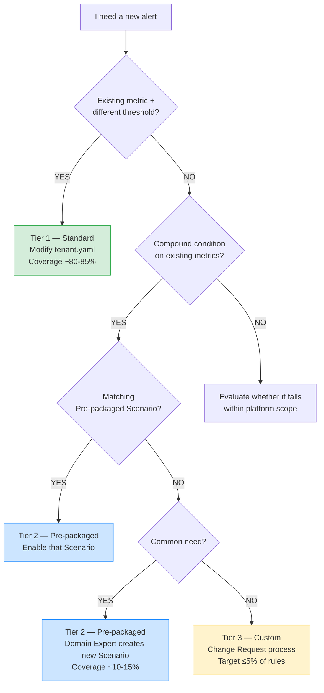
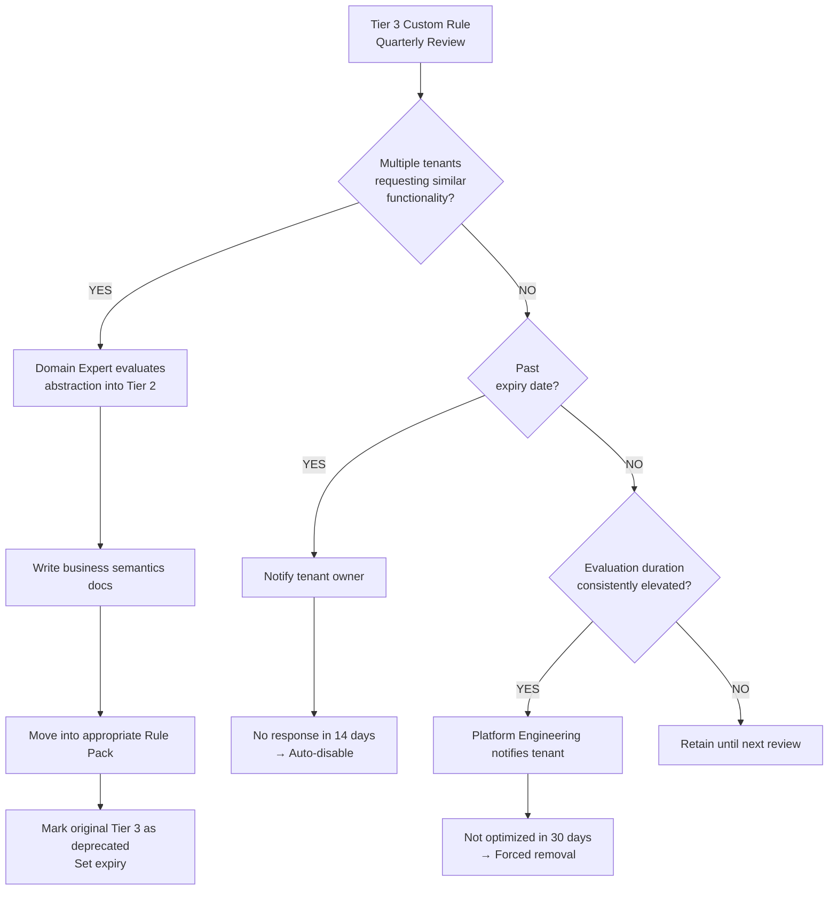

# Multi-Tenant Custom Rule Governance Model

> **Audience**: Platform Engineering, Domain Experts (DBA/Infra), Tenant Tech Leads
> **Version**: v1.0.0
> **Related**: [Architecture and Design](architecture-and-design.en.md), [Rule Packs Directory](../rule-packs/README.md), [Migration Guide](migration-guide.md)

---

## 1. Purpose

The core value proposition of the Dynamic Alerting platform is **O(M) complexity**: define M metric types once, and all tenants adjust thresholds via config — no per-tenant PromQL maintenance required.

In practice, however, some tenant alerting requirements go beyond simple threshold differences and may involve distinct condition combinations or business scenarios. This document defines a 3-tier governance model that provides structured customization paths while preserving the O(M) performance advantage.

---

## 2. Three-Tier Governance Model



### 2.1 Tier 1 — Standard (Config-Driven Three-State Control)

**Coverage**: ~80–85% of tenant requirements

Tenants configure thresholds via `tenant.yaml` without touching PromQL:

```yaml
# Three-state control example (key names match metric definitions in _defaults.yaml)
mysql_connections: "800"        # Custom: user-defined threshold
mysql_cpu: ""                   # Default: use platform default (omit or empty string)
mariadb_replication_lag: "disable" # Disable: turn off this alert
```

Each metric supports Warning / Critical severity levels (`_critical` suffix) and dimension label filtering.

**Rule complexity**: O(M) — does not grow with tenant count.

### 2.2 Tier 2 — Pre-packaged Scenarios

**Coverage**: ~10–15% of tenant requirements

Domain Experts define composite alerting scenarios with clear business semantics based on real-world experience. Tenants do not write PromQL — they simply choose whether to enable a scenario and adjust its parameters.

**Existing example — `MariaDBSystemBottleneck`**:

```yaml
# Business semantics: connections AND CPU both exceeded = real load bottleneck (not connection leak)
- alert: MariaDBSystemBottleneck
  expr: |
    (
      tenant:mysql_threads_connected:max
      > on(tenant) group_left
      tenant:alert_threshold:connections
    )
    and on(tenant)
    (
      tenant:mysql_cpu_usage:rate5m
      > on(tenant) group_left
      tenant:alert_threshold:cpu
    )
    unless on(tenant)
    (user_state_filter{filter="maintenance"} == 1)
```

**Enable/disable mechanism**: Tier 2 scenarios are implicitly controlled through existing three-state controls — no additional toggle key is needed:

- **Enable**: As long as all metrics the scenario depends on have valid thresholds (Custom or Default), the scenario is active.
- **Disable a single metric**: Set that metric to `"disable"`. The corresponding recording rule produces no value, making the `>` comparison false and the scenario inactive.
- **Global maintenance mode**: Set `state_filters.maintenance` to `"true"`. The `unless ... user_state_filter{filter="maintenance"}` clause in the scenario expression takes effect, silencing all alerts.

> **Design rationale**: PromQL has no native on/off switch. This mechanism leverages the propagation effect of "missing threshold → recording rule produces no value → condition is false" to achieve implicit enable/disable, avoiding an extra config key per scenario.

**Design principles**:

- Tier 2 scenarios are defined by Domain Experts, not assembled by tenants. "The platform offers curated packages; tenants decide whether to subscribe" — not "hand tenants building blocks to assemble themselves."
- Each scenario must have clear business semantics documentation (what business question it answers, why this combination is meaningful).
- Thresholds remain config-driven — tenants can adjust numbers but cannot alter the logic structure.

**Rule complexity**: O(number of scenarios) — does not grow with tenant count.

### 2.3 Tier 3 — True Custom (Strictly Governed Customization)

**Coverage**: no more than 5% of total rules

For exceptional requirements that Tier 1 + Tier 2 cannot satisfy. Must go through a formal Change Request process.

**Admission criteria**:

1. Submitter must explain why Tier 1 (threshold adjustment) and Tier 2 (pre-packaged scenarios) are insufficient
2. Domain Expert reviews and determines whether the need can be abstracted into a new Tier 2 scenario
3. Must pass CI deny-list linting (see §4)
4. Must include owner label and expiry date

**Architectural isolation**:

Tier 3 rules are placed in a dedicated Prometheus Rule Group with a longer `evaluation_interval` (e.g., 30s instead of the default 15s). This ensures:

- If a Custom Rule's PromQL is too heavy and causes evaluation delays, the blast radius is contained within that group
- Tier 1 and Tier 2 alerting timeliness is not affected by Noisy Neighbors
- Platform team can independently monitor Custom Rule Group evaluation duration

```yaml
# rule-packs/custom/tenant-specific.yaml (this directory is created when the first Tier 3 Rule is submitted)
groups:
  - name: custom_tenant_rules
    interval: 30s   # Dedicated evaluation interval
    rules:
      - alert: CustomAlert_db-a_special_tablespace
        expr: |
          custom_tablespace_usage{tenant="db-a", tablespace="SPECIAL_APP"} > 95
        labels:
          tier: "custom"
          owner: "team-db-a"
          expiry: "2026-06-30"
        annotations:
          ticket: "REQ-12345"
          justification: "No matching Tier 2 scenario: dedicated threshold for a specific tablespace"
```

**Rule complexity**: O(Custom Rule count). Management target is to keep this under 5% of total rules.

---

## 3. Roles and Responsibilities (RnR)

This platform involves three roles. In smaller teams, one person may wear multiple hats — the key is clear responsibility boundaries, not org chart structure.

| | Platform Engineering | Domain Expert | Tenant |
|---|---|---|---|
| **Role** | Infrastructure provider + guardrail builder | Golden Standards definer | Platform consumer + business system owner |
| **Tier 1** | Guarantee alerting engine operation | Define default thresholds, metric semantics | Self-manage Warning/Critical thresholds |
| **Tier 2** | Guarantee alerting engine operation | Design scenarios, write business semantics docs | Decide whether to enable scenarios |
| **Tier 3** | Performance monitoring + forced removal authority | Review requests, evaluate Tier 2 promotion | You build it, you run it (no SLA guarantee) |
| **CI/CD** | Maintain deny-list linting + Rule Pack structure validation | Maintain owned Rule Packs | — |
| **SLA scope** | Alerting engine operation (eval, scrape, routing) | Tier 1/2 business correctness | Tier 3 alert quality is self-owned |

> **Practical note**: Tenant teams typically lack PromQL expertise. In practice, tenants submit requirements and Domain Experts write the rules on their behalf, but SLA ownership still falls on the tenant — i.e., "Domain Expert writes it for you, but you own the alert quality."

**Responsibility quick reference**:

| Scenario | Responsible party |
|----------|-------------------|
| Prometheus down, all alerts non-functional | Platform Engineering |
| Tier 1 threshold too low, causing false positives | Tenant (thresholds are self-configured) |
| Tier 2 scenario logic flawed, causing platform-wide missed alerts | Domain Expert |
| Tier 3 Custom Rule too heavy, slowing evaluation | Platform Engineering forces removal → Tenant fixes and resubmits |
| Tier 3 Custom Rule false positive | Tenant |

---

## 4. CI Guardrails: Deny-list Linting

All rules submitted to `rule-packs/custom/` must pass automated checks.

### 4.1 Deny-list Rules

```yaml
# .github/custom-rule-policy.yaml (optional; the lint tool has a built-in default policy)
denied_functions:
  - holt_winters           # CPU-intensive function
  - predict_linear         # Large lookback queries
  - quantile_over_time     # High memory consumption

denied_patterns:
  - '=~".*"'              # Catch-all regex (performance killer)
  - 'without(tenant)'     # Breaks tenant isolation

required_labels:
  - tenant                 # All Custom Alert Rules must include tenant label

max_range_duration: 1h     # Prohibit excessively long range vectors (e.g., [7d])
max_evaluation_interval: 60s  # Custom Rule Group interval cap
```

### 4.2 Linting Tool

```bash
# Run in CI
python3 scripts/tools/lint_custom_rules.py rule-packs/custom/

# With custom policy file
python3 scripts/tools/lint_custom_rules.py rule-packs/custom/ --policy .github/custom-rule-policy.yaml

# Via da-tools container (no repo clone needed)
docker run --rm \
  -v $(pwd)/my-custom-rules:/data/rules \
  ghcr.io/vencil/da-tools:1.0.0 \
  lint /data/rules --ci

# Example output
# PASS: custom_tenant_rules.yaml - 2 rules checked
# FAIL: bad_rule.yaml:15 - denied function 'holt_winters' in expr
# FAIL: bad_rule.yaml:22 - missing required label 'tenant'
```

### 4.3 Why Limit "Weight" Instead of "Count"

Problems with fixed quotas (e.g., "5 rules per tenant"): waste and shortage coexist (some tenants use zero, others hit the cap at rule #6), rule explosion unsolved (50 tenants × 5 = 250 rules with different logic), and idle evaluation cost (Prometheus evaluates all rules every 15 seconds regardless).

The deny-list approach constrains each rule's "computational weight" rather than rule count. Combined with dedicated Rule Group isolation and evaluation duration monitoring, this prevents performance degradation without imposing hard limits.

---

## 5. Assimilation Cycle

Quarterly Custom Rule Review (recommended to combine with quarterly SLA review).



### Health Metrics (Planned, Not Yet Implemented)

Recommended tracking in threshold-exporter:

```
# Custom Rule count distribution
da_custom_rule_count{tenant="db-a", tier="2"} 3
da_custom_rule_count{tenant="db-a", tier="3"} 1

# Alert when Tier 3 ratio exceeds 5%
da_custom_rule_ratio_tier3 > 0.05
```

If a specific tenant's Tier 3 count keeps rising, this signals that Tier 2 scenario design may need expansion — not that the tenant's requirements are uniquely special.

---

## 6. Quick Reference

### Tier Comparison Table

| | Tier 1 (Standard) | Tier 2 (Pre-packaged) | Tier 3 (Custom) |
|---|---|---|---|
| **Control method** | tenant.yaml thresholds | Threshold three-state implicit toggle + params | Full PromQL |
| **Author** | Tenant self-service | Domain Expert pre-built | Domain Expert writes on behalf |
| **SLA** | Platform-guaranteed | Platform-guaranteed | No guarantee |
| **Rule complexity** | O(M) | O(scenario count) | O(Custom count) |
| **CI checks** | Automatic (three-state validation) | Rule Pack CI | Deny-list linting |
| **Lifecycle** | Permanent | Permanent | Expiry date required |
